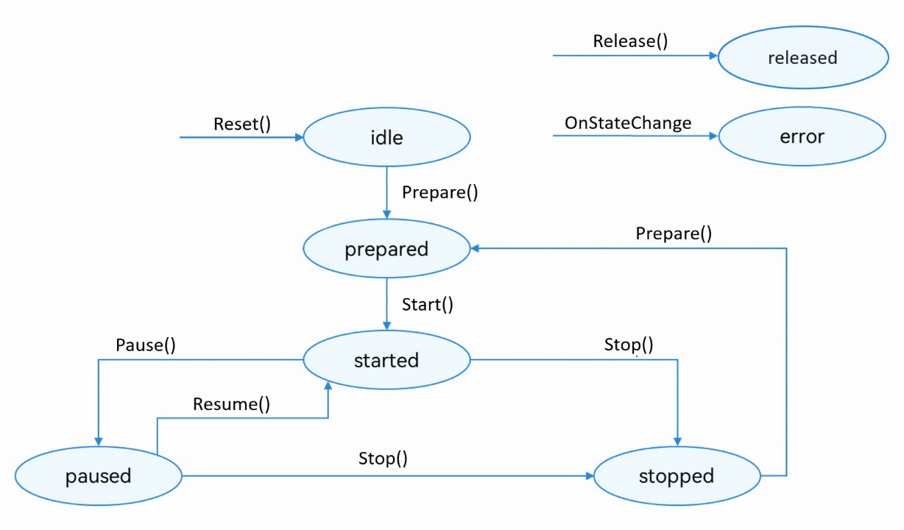

# 基于AVRecorder录制格式化音频（C++）

更新时间：2026-03-12 08:45:02

来源：https://developer.huawei.com/consumer/cn/doc/best-practices/bpta-audio-record-base-on-avrecorder

**   


##### 概述

AVRecorder提供了Native API，可以快速实现音频录制，支持m4a、mp3等格式。本文适用于音频录制类应用的开发，针对市场上主流音频录制类应用的常见场景，介绍了在C/C++侧基于AVRecorder如何录制格式化音频，指导开发者实现基础录制。
 
基于AVRecorder录制格式化音频（C++）实现的功能效果如下：
 


 
本文的主要内容如下：
 
[基础录制](#section20569101215108)：介绍了在C/C++侧基于AVRecorder录制格式化音频，包括开始录制、暂停录制和结束录制。
 
 

##### 基础录制

 

##### 实现原理

除了ArkTS语言版本外，HarmonyOS还提供了C/C++语言版本的AVRecorder录制器，用于在C/C++侧进行音频数据采集、音频编码以及音频文件封装等端到端一体化音频录制。C/C++侧AVRecorder的功能和开发流程与ArkTS侧基本一致。
 
图1 **录制状态变化示意图



 
 
 

##### 开发步骤

1.在CMake脚本中链接动态库libavrecorder.so、libnative_media_core.so等。
 
```text
target_link_libraries(entry PUBLIC libace_napi.z.so libavrecorder.so libnative_media_core.so libhilog_ndk.z.so)
```
 
2.在Native侧，配置AVRecorder。
 
- 创建OH_AVRecorder_Config对象，并设置音频录制的相关配置，包括音频采样率、音频格式、采样通道等。
- 根据实际需要，设置音频录制的回调函数，如错误回调函数OH_AVRecorder_SetErrorCallback()等。
- 调用OH_AVRecorder_Prepare()接口，让AVRecorder进入prepare状态。

 
```cpp
// Set AVRecorder Config
void SetConfig(OH_AVRecorder_Config &config) {
    config.audioSourceType = AVRECORDER_MIC;
    // Set media config
    config.profile.audioBitrate = 96000; // Set audio bitrate
    config.profile.audioChannels = 2; // Set audio channels
    config.profile.audioCodec = AVRECORDER_AUDIO_MP3; // Set audio codec
    config.profile.audioSampleRate = 48000; // Set audio sampleRate
    config.profile.fileFormat = AVRECORDER_CFT_MP3; // Set fileFormat
    config.fileGenerationMode = AVRECORDER_APP_CREATE; // Set FileGenerationMode
}

// Prepare AVRecorder
napi_value AVRecorder::PrepareAVRecorder(napi_env env, napi_callback_info info) {
    size_t argc = 1;
    napi_value args[1] = {nullptr};
    napi_get_cb_info(env, info, &argc, args, nullptr, nullptr);
    
    napi_get_value_int32(env, args[0], &g_outputFd);
    if (g_outputFd <= 0) {
        napi_value res;
        napi_create_int32(env, -1, &res);
        return res;
    }
    OH_LOG_INFO(LOG_APP, "PrepareAVRecorder in!");
    g_avRecorder = OH_AVRecorder_Create();
    OH_LOG_INFO(LOG_APP, "AVRecorder Create ok! g_avRecorder: %{public}p", g_avRecorder);
    if (g_avRecorder == nullptr) {
        OH_LOG_ERROR(LOG_APP, "AVRecorder Create failed!");
    }
    OH_AVRecorder_Config *config = new OH_AVRecorder_Config();
    SetConfig(*config);

    // Set url
    std::string fileUrl = "fd://" + std::to_string(g_outputFd);
    config->url = const_cast<char *>(fileUrl.c_str());
    OH_LOG_INFO(LOG_APP, "config.url is: %s", const_cast<char *>(fileUrl.c_str()));

    // Set State Callback
    OH_AVRecorder_SetStateCallback(g_avRecorder, OnStateChange, nullptr);
    // Set Error Callback
    OH_AVRecorder_SetErrorCallback(g_avRecorder, OnError, nullptr);
    // Set recorder configuration
    OH_AVRecorder_SetWillMuteWhenInterrupted(g_avRecorder, true);
    
    // Prepare
    int result = OH_AVRecorder_Prepare(g_avRecorder, config);
    if (result != AV_ERR_OK) {
        OH_LOG_ERROR(LOG_APP, " AVRecorder Prepare failed %{public}d", result);
    }
    napi_value res;
    napi_create_int32(env, result, &res);
    return res;
}
```
 
3.启动音频录制。
 
```cpp
// Start AVRecorder
napi_value AVRecorder::StartAVRecorder(napi_env env, napi_callback_info info) {
    (void)info;
    OH_LOG_INFO(LOG_APP, " g_avRecorder start: %{public}p", g_avRecorder);
    int result = OH_AVRecorder_Start(g_avRecorder);
    if (result != AV_ERR_OK) {
        OH_LOG_ERROR(LOG_APP, " AVRecorder Start failed %{public}d", result);
    }
    napi_value res;
    napi_create_int32(env, result, &res);
    return res;
}
```
 
4.暂停音频录制。
 
```cpp
// Pause AVRecorder
napi_value AVRecorder::PauseAVRecorder(napi_env env, napi_callback_info info) {
    (void)info;
    int result = OH_AVRecorder_Pause(g_avRecorder);
    if (result != AV_ERR_OK) {
        OH_LOG_ERROR(LOG_APP, " AVRecorder Pause failed %{public}d", result);
    }
    napi_value res;
    napi_create_int32(env, result, &res);
    return res;
}
```
 
5.继续音频录制。
 
```cpp
// Resume AVRecorder
napi_value AVRecorder::ResumeAVRecorder(napi_env env, napi_callback_info info) {
    (void)info;
    int result = OH_AVRecorder_Resume(g_avRecorder);
    if (result != AV_ERR_OK) {
        OH_LOG_ERROR(LOG_APP, " AVRecorder Resume failed %{public}d", result);
    }
    napi_value res;
    napi_create_int32(env, result, &res);
    return res;
}
```
 
6.停止音频录制。
 
```cpp
// Stop AVRecorder
napi_value AVRecorder::StopAVRecorder(napi_env env, napi_callback_info info) {
    (void)info;
    int result = OH_AVRecorder_Stop(g_avRecorder);
    if (result != AV_ERR_OK) {
        OH_LOG_ERROR(LOG_APP, " AVRecorder Stop failed %{public}d", result);
    }
    close(g_outputFd);
    napi_value res;
    napi_create_int32(env, result, &res);
    return res;
}
```
 
7.释放音频录制资源。
 
```cpp
// Release AVRecorder
napi_value AVRecorder::ReleaseAVRecorder(napi_env env, napi_callback_info info) {
    (void)info;
    if (g_avRecorder == nullptr) {
        OH_LOG_ERROR(LOG_APP, " g_avRecorder is nullptr!");
        napi_value res;
        napi_create_int32(env, AV_ERR_INVALID_VAL, &res);
        return res;
    }

    int result = OH_AVRecorder_Release(g_avRecorder);
    g_avRecorder = nullptr;

    if (result != AV_ERR_OK) {
        OH_LOG_ERROR(LOG_APP, " AVRecorder Release failed %{public}d", result);
    }
    napi_value res;
    napi_create_int32(env, result, &res);
    return res;
}
```
 
 

##### 常见问题

 

##### 设置静音打断模式

通过调用[OH_AVRecorder_SetWillMuteWhenInterrupted()](https://developer.huawei.com/consumer/cn/doc/harmonyos-references/capi-avrecorder-h#oh_avrecorder_setwillmutewheninterrupted)接口设置是否开启静音打断模式。
 
 

##### 设置回声消除

通过将[OH_AVRecorder_AudioSourceType](https://developer.huawei.com/consumer/cn/doc/harmonyos-references/capi-avrecorder-base-h#oh_avrecorder_audiosourcetype)值指定为AVRECORDER_VOICE_COMMUNICATION即可。
 
 

##### 示例代码

- [基于AVRecorder录制音频（C++）](https://gitcode.com/HarmonyOS_Samples/avrecorder-record-formatted-audio-cpp)
