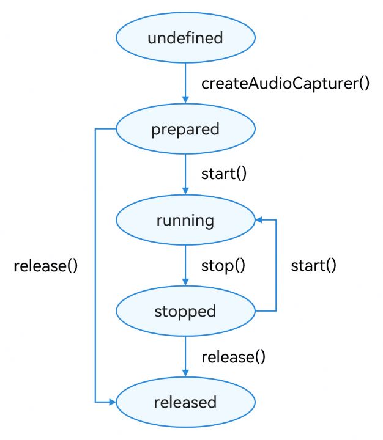

# 基于AudioCapturer录制PCM音频（ArkTS）

更新时间：2026-05-22 09:46:30

来源：https://developer.huawei.com/consumer/cn/doc/best-practices/bpta-audio-record-base-on-audiocapturer

**   


##### 概述

AudioCapturer是用于音频录制的ArkTS API，仅支持录制PCM格式，可以用于录制音频母带。本文适用于音频录制类应用的开发，针对市场上主流音频录制类应用的常见场景，介绍了基于AudioCapturer如何录制PCM音频，指导开发者基于不同的业务场景，使用AudioCapturer实现音频录制功能。
 
基于AudioCapturer录制PCM音频（ArkTS）实现的功能效果如下：
 


 
本文的主要内容如下：
 
[基础录制](#section20569101215108)：介绍了基于AudioCapturer录制PCM音频，包括开始录制、结束录制。
 
 

##### 基础录制

 

##### 实现原理

AudioCapturer可以录制PCM（Pulse Code Modulation）音频数据，能够快速实现PCM的基础录制，支持设置静音打断和回声消除。在创建完AudioCapturer后，需要设置对应的回调函数、音频录制的参数配置，通过readData的回调函数将采集的数据写入到文件中。
 
图1 **AudioCapturer状态变化示意图



 
 
 

##### 开发步骤

1.配置音频采集参数。
 
- 音频采集参数分为2类：音频流信息[AudioStreamInfo](https://developer.huawei.com/consumer/cn/doc/harmonyos-references/arkts-apis-audio-i#audiostreaminfo8)（主要包括采样率、通道数、采样格式、编码格式等）和音频采集器信息[AudioCapturerInfo](https://developer.huawei.com/consumer/cn/doc/harmonyos-references/arkts-apis-audio-i#audiocapturerinfo8)（音频流类型，即录制业务场景和采集器标志）。
- 将配置好的参数audioCapturerOptions传入createAudioCapturer接口中，以创建音频采集器实例。
- 设置readData回调函数。该回调用于系统向PCM文件中写入采集到的音频数据。其中，Options用来标记每次写入的数据在文件中偏移量和大小。

 
```ArkTS
async initCapturer(): Promise<void> {
  try {
    // Config AudioStreamInfo
    const audioStreamInfo: audio.AudioStreamInfo = {
      channels: audio.AudioChannel.CHANNEL_1, // Set channel
      samplingRate: audio.AudioSamplingRate.SAMPLE_RATE_48000,  // Set samplingRate
      sampleFormat: audio.AudioSampleFormat.SAMPLE_FORMAT_S16LE,  // Set sampleFormat
      encodingType: audio.AudioEncodingType.ENCODING_TYPE_RAW,  // Set encodingType
    };
    // Config AudioCapturerInfo
    const audioCapturerInfo: audio.AudioCapturerInfo = {
      capturerFlags: 0,
      source: audio.SourceType.SOURCE_TYPE_VOICE_COMMUNICATION,
    };
    // Config AudioCapturerOptions
    const audioCapturerOptions: audio.AudioCapturerOptions = {
      streamInfo: audioStreamInfo,
      capturerInfo: audioCapturerInfo,
    };

    this.capturer = await audio.createAudioCapturer(audioCapturerOptions);
    // Set if capturer want to be muted
    this.capturer.setWillMuteWhenInterrupted(true).catch((error: BusinessError) => {
      Logger.error(TAG, `setWillMuteWhenInterrupted error. message:${error.message}`);
    });
    // Set stateChange callback
    this.capturer.on('stateChange', (state: audio.AudioState) => {
      Logger.info(TAG, `Audio capturer state changed: ${state}`);
    });
    // Set readData callback
    this.capturer.on('readData', (buffer: ArrayBuffer) => {
      if (!this.recordFile) {
        return;
      }
      let options: WriteOptions = { offset: this.writeOffset, length: buffer.byteLength };
      fileIo.writeSync(this.recordFile.fd, buffer, options);
      this.writeOffset += buffer.byteLength;
    });
  } catch (error) {
    Logger.error(TAG, `initCapturer error. message:${(error as BusinessError).message}`);
  }
}
```
 
2.开始音频录制。
 
```ArkTS
async startCapturer(): Promise<void> {
  try {
    if (this.capturer === undefined) {
      throw new Error(`Release AudioCapturer at undefined state`);
    }
    let state = this.capturer.state;
    if (state === audio.AudioState.STATE_INVALID) {
      this.capturer = undefined;
      throw new Error(`AudioCapturer at invalid state.`);
    }
    if (state !== audio.AudioState.STATE_PREPARED && state !== audio.AudioState.STATE_STOPPED) {
      throw new Error(`Release AudioCapturer at wrong state, ${state}`);
    }
    if (!this.context) {
      throw new Error(`Context is undefined.`);
    }
    this.tmpPath = this.context?.filesDir + '/example.pcm';
    let openMode = fileIo.OpenMode.WRITE_ONLY | fileIo.OpenMode.CREATE | fileIo.OpenMode.TRUNC;
    this.recordFile = fileIo.openSync(this.tmpPath, openMode);
    this.writeOffset = 0;
    await this.capturer.start();
  } catch (error) {
    Logger.error(TAG, `startCapturer error. message:${(error as BusinessError).message}`);
  }
}
```
 
3.停止音频录制。
 
```ArkTS
async stopCapturer(): Promise<void> {
  try {
    if (this.capturer === undefined) {
      throw new Error(`Release AudioCapturer at undefined state`);
    }
    let state = this.capturer.state;
    if (state === audio.AudioState.STATE_INVALID) {
      this.capturer = undefined;
      throw new Error(`AudioCapturer at invalid state.`);
    }
    if (state !== audio.AudioState.STATE_RUNNING) {
      return;
    }
    await this.capturer.stop();
    fileIo.closeSync(this.recordFile?.fd);
  } catch (error) {
    Logger.error(TAG, `stopCapturer error. message:${(error as BusinessError).message}`);
  }
}
```
 
4.取消监听事件，并释放资源。
 
```ArkTS
async releaseCapturer(): Promise<void> {
  try {
    if (this.capturer === undefined) {
      throw new Error(`Release AudioCapturer at undefined state`);
    }
    let state = this.capturer.state;
    if (state === audio.AudioState.STATE_INVALID) {
      this.capturer = undefined;
      throw new Error(`AudioCapturer at invalid state.`);
    }
    if (state !== audio.AudioState.STATE_PREPARED && state !== audio.AudioState.STATE_STOPPED) {
      throw new Error(`Release AudioCapturer at wrong state, ${state}`);
    }
    this.capturer.off('readData');
    await this.capturer.release();
    this.capturer = undefined;
  } catch (error) {
    Logger.error(TAG, `releaseCapturer error. message:${(error as BusinessError).message}`);
  }
}
```
 
 

##### 常见问题

 

##### 设置静音打断模式

开发者在创建AudioCapturer实例时，调用[setWillMuteWhenInterrupted()](https://developer.huawei.com/consumer/cn/doc/harmonyos-references/arkts-apis-audio-audiocapturer#setwillmutewheninterrupted20)接口设置当前录制音频流是否启用静音打断模式。
 
```ArkTS
// Set if capturer want to be muted
this.capturer.setWillMuteWhenInterrupted(true).catch((error: BusinessError) => {
  Logger.error(TAG, `setWillMuteWhenInterrupted error. message:${error.message}`);
});
```
 
 

##### 设置回声消除

开发者在设置audio.AudioCapturerInfo时，将[SourceType](https://developer.huawei.com/consumer/cn/doc/harmonyos-references/arkts-apis-audio-e#sourcetype8)值指定为SOURCE_TYPE_VOICE_COMMUNICATION或SOURCE_TYPE_LIVE即可。
 
 

##### 获取音频振幅

开发者在开发通讯软件的语音录制发送、音乐录制等场景时，为了体现当前录制音量的大小，需要实现音频录制波形。关于音频录制波形可以参考[基于AudioRenderer和AudioCapturer实现音频波形动画](https://developer.huawei.com/consumer/cn/doc/best-practices/bpta-audio-ripple-animation)。
 
 

##### 示例代码

- [基于AudioCapturer录制音频(ArkTS)](https://gitcode.com/HarmonyOS_Samples/audio-capturer-record-pcm)
