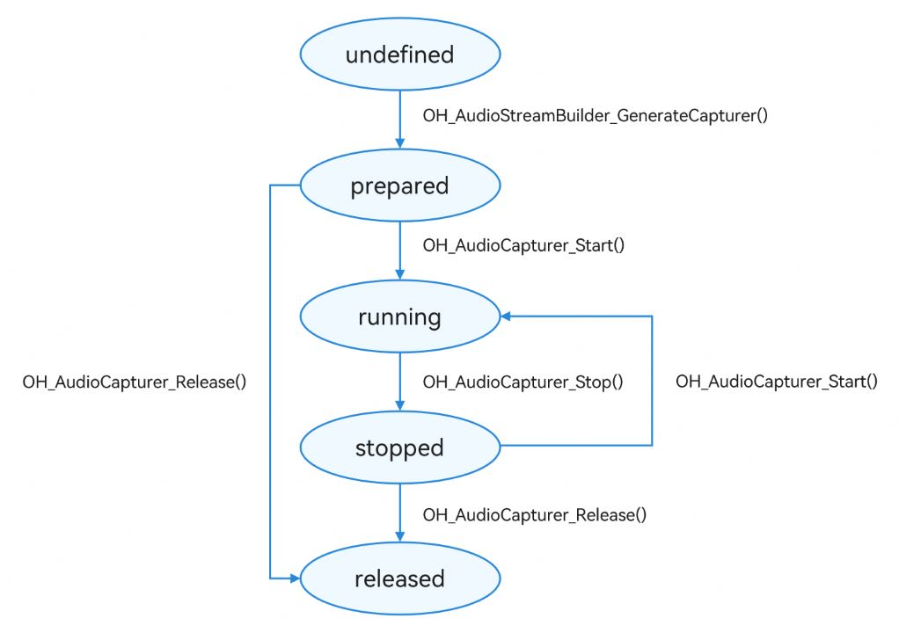

# 基于OHAudio录制PCM音频（C++）

更新时间：2026-05-18 00:55:31

来源：https://developer.huawei.com/consumer/cn/doc/best-practices/bpta-audio-record-base-on-ohaudio

**   


##### 概述

在C/C++侧，OHAudio提供音频模块相关能力，包含音频采集（OH_AudioCapturer）、音频管理和音频播放等能力。OH_AudioCapturer仅支持录制PCM格式，可以在C/C++侧实现音频母带录制。本文适用于音频录制类应用的开发，针对市场上主流音频录制类应用的常见场景，介绍了基于OHAudio如何录制PCM音频，指导开发者实现基础录制。
 
基于OHAudio录制PCM音频（C++）实现的功能效果如下：
 


 
本文的主要内容如下：
 
[基础录制](#section20569101215108)：介绍了基于OHAudio录制PCM音频，包括开始录制、暂停录制、结束录制。
 
 

##### 基础录制

 

##### 实现原理

OH_AudioCapturer仅支持PCM格式，同时支持设置低时延通路、静音打断和回声消除，适用于依赖Native层实现音频录制的场景。整个开发流程可以概括为：音频流构造器实例创建、音频采集参数配置、采集回调注册（各类事件监听）、采集器实例创建、采集的开始与停止以及资源的释放等。其中，事件监听主要包括音频输入流回调等。在创建完实例后，开发者可以调用相关方法使得音频录制流进入对应的状态。
 
图1 **OHAudio音频录制状态变化示意图



 
 
 

##### 开发步骤

1.依赖导入。
 
- 在CMake脚本中链接动态库libohaudio.so、libnative_media_codecbase.so等。

 
```text
target_link_libraries(entry PUBLIC libace_napi.z.so libohaudio.so libhilog_ndk.z.so libnative_media_codecbase.so)
```
 
2.创建音频采集器。
 
- 创建OH_AudioStreamBuilder，用于采集器的相关配置。
- 通过OH_AudioStreamBuilder设置环境配置，包括采样率、采样通道数、回调函数等。其中，回调函数OH_AudioCapturer_OnReadData是向PCM文件中写入采集到的音频数据。
- 通过OH_AudioStreamBuilder_GenerateCapturer创建音频采集器。

 
```cpp
static int32_t AudioRendererOnWriteData(OH_AudioRenderer *renderer, void *userData, void *buffer, int32_t bufferLen) {
    if (g_file == nullptr) {
        return 0;
    }
    size_t readCount = fread(buffer, bufferLen, 1, g_file);
    if (!readCount) {
        // End of the file
        if (feof(g_file)) {
            // Seek start point
            fseek(g_file, 0, SEEK_SET);
        }
    }
    return 0;
}

static napi_value AudioCapturerLowLatencyInit(napi_env env, napi_callback_info info) {
    if (audioCapturer != nullptr) {
        OH_AudioCapturer_Release(audioCapturer);
        OH_AudioStreamBuilder_Destroy(builder);
        
        audioCapturer = nullptr;
        builder = nullptr;
    }
    if (g_file) {
        fclose(g_file);
        g_file = nullptr;
    }
    g_file = fopen(g_filePath.c_str(), "wb");
    // 1. create builder
    OH_AudioStream_Type type = AUDIOSTREAM_TYPE_CAPTURER;
    OH_AudioStreamBuilder_Create(&builder, type);
    // 2. set params and callbacks
    OH_AudioStreamBuilder_SetSamplingRate(builder, g_samplingRate); // Set SamplingRate 
    OH_AudioStreamBuilder_SetChannelCount(builder, g_channelCount); // Set ChannelCount
    OH_AudioStreamBuilder_SetLatencyMode(builder, AUDIOSTREAM_LATENCY_MODE_FAST); // Set LatencyMode
    OH_AudioStreamBuilder_SetEncodingType(builder, AUDIOSTREAM_ENCODING_TYPE_RAW); // Set EncodingType

    OH_AudioCapturer_Callbacks callbacks;
    callbacks.OH_AudioCapturer_OnReadData = AudioCapturerOnReadData; // Set ReadData Callback
    callbacks.OH_AudioCapturer_OnError = nullptr;
    callbacks.OH_AudioCapturer_OnInterruptEvent = nullptr;
    callbacks.OH_AudioCapturer_OnStreamEvent = nullptr;
    OH_AudioStreamBuilder_SetCapturerCallback(builder, callbacks, nullptr); // Set Capturer Callback

    // 3. create OH_AudioCapturer
    OH_AudioStreamBuilder_GenerateCapturer(builder, &audioCapturer); // Generate Capturer
    return nullptr;
}
```
 
3.开始音频录制。
 
```cpp
static napi_value AudioCapturerStart(napi_env env, napi_callback_info info) {
    // start
    OH_AudioCapturer_Start(audioCapturer);
    return nullptr;
}
```
 
4.暂停音频录制。
 
```cpp
static napi_value AudioCapturerPause(napi_env env, napi_callback_info info) {
    OH_AudioCapturer_Pause(audioCapturer);
    return nullptr;
}
```
 
5.停止音频录制。
 
```cpp
static napi_value AudioCapturerStop(napi_env env, napi_callback_info info) {
    OH_AudioCapturer_Stop(audioCapturer);
    return nullptr;
}
```
 
6.释放音频录制资源。
 
```cpp
static napi_value AudioCapturerRelease(napi_env env, napi_callback_info info) {
    if (audioCapturer) {
        OH_AudioCapturer_Release(audioCapturer);
        OH_AudioStreamBuilder_Destroy(builder);
        audioCapturer = nullptr;
        builder = nullptr;
    }
    if (g_file) {
        fclose(g_file);
        g_file = nullptr;
    }
    return nullptr;
}
```
 
 

##### 常见问题

 

##### 设置静音打断模式

开发者在创建AudioCapturer实例时，调用[OH_AudioStreamBuilder_SetCapturerWillMuteWhenInterrupted()](https://developer.huawei.com/consumer/cn/doc/harmonyos-references/capi-native-audiostreambuilder-h#oh_audiostreambuilder_setcapturerwillmutewheninterrupted)接口设置是否开启静音打断模式。
 
 

##### 设置回声消除

通过将[OH_AudioStream_SourceType](https://developer.huawei.com/consumer/cn/doc/harmonyos-references/capi-native-audiostream-base-h#oh_audiostream_sourcetype)值指定为AUDIOSTREAM_SOURCE_TYPE_VOICE_COMMUNICATION、AUDIOSTREAM_SOURCE_TYPE_LIVE即可。
 
 

##### 设置音频录制低时延

通过调用[OH_AudioStreamBuilder_SetLatencyMode()](https://developer.huawei.com/consumer/cn/doc/harmonyos-references/capi-native-audiostreambuilder-h#oh_audiostreambuilder_setlatencymode)设置低时延模式。
 
 

##### 示例代码

- [基于AudioCapturer录制音频(C++)](https://gitcode.com/HarmonyOS_Samples/audio-native)
