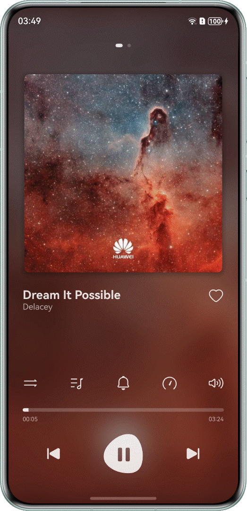

# 基于OHAudio播放PCM音频

更新时间：2026-03-12 08:45:02

来源：https://developer.huawei.com/consumer/cn/doc/best-practices/bpta-playing-pcm-audio-based-ohaudio

## 概述


OHAudio是用于音频播放的Native API，仅支持PCM格式的音频。指导开发者使用OHAudio接口实现播放PCM音频的功能，主要涉及基本播控、精准跳转、静音播放、倍速播放、音量控制、焦点管理、后台播放与接入播控中心、冷启动等开发场景。

本文是音频播放系列文章的第2篇，实现的功能效果如下：


## 场景分析


| 场景名称 | 描述 | 实现方案 |
| --- | --- | --- |
| [基础播控](#section1764813377511) | 音频资源的加载、播放、暂停、退出等操作。 | 使用[OHAudio](https://developer.huawei.com/consumer/cn/doc/harmonyos-references/capi-ohaudio)接口实现。 |
| [跳转播放](#section16920851193717) | 滑动进度条精准跳转到指定时间进行播放。 | 使用[Slider组件](https://developer.huawei.com/consumer/cn/doc/harmonyos-references/ts-basic-components-slider)实现进度条，在[OH_AudioStreamBuilder_SetRendererWriteDataCallback()](https://developer.huawei.com/consumer/cn/doc/harmonyos-references/capi-native-audiostreambuilder-h#oh_audiostreambuilder_setrendererwritedatacallback)设置的回调函数中，从跳转的目标位置开始获取歌曲资源并写入回调中，从而实现跳转播放。 |
| [静音播放](#section125715278533) | 通过界面按钮切换音频播放静音状态，实现一键开启或关闭静音。 | 使用[OH_AudioRenderer_SetSilentModeAndMixWithOthers()](https://developer.huawei.com/consumer/cn/doc/harmonyos-references/capi-native-audiorenderer-h#oh_audiorenderer_setsilentmodeandmixwithothers)方法控制静音状态。 |
| [切换歌曲播放](#section590418431566) | 点击上一首、下一首或歌单列表中的其他歌曲来进行切换歌曲播放。 | 调用[OH_AudioStreamBuilder_SetRendererWriteDataCallback()](https://developer.huawei.com/consumer/cn/doc/harmonyos-references/capi-native-audiostreambuilder-h#oh_audiostreambuilder_setrendererwritedatacallback)接口，设置写入音频数据的回调。在回调函数中， 将获取到的不同的歌曲资源写入数据缓冲区，实现播放不同歌曲的功能。 |
| [倍速设置](#section189460361122) | 滑动倍速调节面板调节播放速度。 | 使用[OH_AudioRenderer_SetSpeed()](https://developer.huawei.com/consumer/cn/doc/harmonyos-references/capi-native-audiorenderer-h#oh_audiorenderer_setspeed)设置播放倍速。 |
| [音量设置](#section88718617116) | 滑动音量调节面板调节播放音量。 | 使用[OH_AudioRenderer_SetVolume()](https://developer.huawei.com/consumer/cn/doc/harmonyos-references/capi-native-audiorenderer-h#oh_audiorenderer_setvolume)设置播放音量。 |
| [接入播控中心](https://developer.huawei.com/consumer/cn/doc/best-practices/bpta-playing-pcm-audio-based-audiorenderer#section06660114245) | 通过播控中心，控制播放、暂停、切换音频、调整播放进度、切换循环模式 | 具体原理、方案和开发步骤参考[接入播控中心](https://developer.huawei.com/consumer/cn/doc/best-practices/bpta-playing-pcm-audio-based-audiorenderer#section06660114245)。本篇文章不再赘述。 |
| [后台播放](https://developer.huawei.com/consumer/cn/doc/best-practices/bpta-playing-pcm-audio-based-audiorenderer#section1749719114143) | 音频切换到后台播放。 | 具体原理、方案和开发步骤参考[后台播放](https://developer.huawei.com/consumer/cn/doc/best-practices/bpta-playing-pcm-audio-based-audiorenderer#section1749719114143)。本篇文章不再赘述。 |
| [接入播控中心冷启动和历史歌单](https://developer.huawei.com/consumer/cn/doc/best-practices/bpta-playing-pcm-audio-based-audiorenderer#section476545143517) | 应用退出后，播控中心显示历史歌单，点击播控中心播放按钮拉起应用播放，或者点击歌单拉起应用播放。 | 具体原理、方案和开发步骤参考[接入播控中心冷启动和历史歌单](https://developer.huawei.com/consumer/cn/doc/best-practices/bpta-playing-pcm-audio-based-audiorenderer#section476545143517)。本篇文章不再赘述。 |
| [低功耗音频播放](https://developer.huawei.com/consumer/cn/doc/harmonyos-guides/power-saving-for-playback) | 低功耗音频播放是一种通过软硬芯协同设计实现的音频渲染方案。其核心机制是增大音频渲染器的内部缓存，使系统能够一次性填充大量音频数据，从而允许主处理器长时间休眠，减少频繁处理音频数据的功耗，显著降低系统级功耗负载。 | 具体介绍和实现方案参考：[低功耗音频播放](https://developer.huawei.com/consumer/cn/doc/harmonyos-guides/power-saving-for-playback)。 |


## 基础播控


### 场景描述


通过OHAudio接口实现核心音频播放控制能力，包括音频资源加载、播放、暂停、停止及退出等操作。


### 实现原理


开发者可以通过OH_AudioStreamBuilder_Create()的接口，创建音频流构造器实例，调用OH_AudioStreamBuilder_SetRendererWriteDataCallback()接口设置写入音频数据的回调函数，将获取的音频数据写入回调函数中，实现资源加载。通过OH_AudioRenderer_Start()、OH_AudioRenderer_Pause()、OH_AudioRenderer_Stop()、OH_AudioRenderer_Release()接口实现音频的播放、暂停、停止和退出操作。OHAudio的不同接口调用和其状态的变化关系参考OHAudio音频播放状态变化示意图。


### 开发步骤


1. 创建音频流构造器实例。

```cpp
void OHAudioPlayer::InitPlayer() {
  // Check the residual status of the previous player
  if ((audioRenderer != nullptr) || (rendererBuilder != nullptr) || (audioFileOprInfo != nullptr)) {
    OH_LOG_INFO(LOG_APP, "Previous audio player or builder or fileInfo remained and release it.");
    ReleasePlayer();
  }

  // Create stream builder
  OH_AudioStream_Type streamType = AUDIOSTREAM_TYPE_RENDERER;
  auto ret = OH_AudioStreamBuilder_Create(&rendererBuilder, streamType);
  if (ret != AUDIOSTREAM_SUCCESS) {
    OH_LOG_ERROR(LOG_APP, "Create stream builder failed, ret: %{public}d", ret);
    return;
  }

  // ret = OH_AudioStreamBuilder_SetLatencyMode(rendererBuilder, AUDIOSTREAM_LATENCY_MODE_FAST);
  if (ret != AUDIOSTREAM_SUCCESS) {
    OH_LOG_ERROR(LOG_APP, "Set latencyMode failed, ret: %{public}d", ret);
    return;
  }
  OH_LOG_INFO(LOG_APP, "Set latencyMode success, ret: %{public}d", ret);

  // New audioFileOprInfo instance
  audioFileOprInfo = new AudioFileOprInfo();

  // Configure audio parameters
  // Set audio sample rate
  (void)OH_AudioStreamBuilder_SetSamplingRate(rendererBuilder, 48000);
  // Set audio channel count
  (void)OH_AudioStreamBuilder_SetChannelCount(rendererBuilder, 2);
  // Set audio sample format
  (void)OH_AudioStreamBuilder_SetSampleFormat(rendererBuilder, AUDIOSTREAM_SAMPLE_S16LE);
  // Set audio encode type
  (void)OH_AudioStreamBuilder_SetEncodingType(rendererBuilder, AUDIOSTREAM_ENCODING_TYPE_RAW);
  // Set audio render info
  (void)OH_AudioStreamBuilder_SetRendererInfo(rendererBuilder, AUDIOSTREAM_USAGE_MUSIC);
  SecondBufferWalk = (48000 * 2 * 16) / 8;
  // Configure audio callback
  // Set audio interrupt callback
  (void)OH_AudioStreamBuilder_SetRendererInterruptCallback(rendererBuilder, OnAudioInterruptEvent, nullptr);
  // Set audio render error callback
  (void)OH_AudioStreamBuilder_SetRendererErrorCallback(rendererBuilder, OnAudioErrorEvent, nullptr);
  // Set audio render write data callback
  (void)OH_AudioStreamBuilder_SetRendererWriteDataCallback(rendererBuilder, OnAudioRendererWriteDataEvent,
  reinterpret_cast<void *>(audioFileOprInfo));

  ret = OH_AudioStreamBuilder_GenerateRenderer(rendererBuilder, &audioRenderer);
  if (ret != AUDIOSTREAM_SUCCESS) {
    OH_LOG_ERROR(LOG_APP, "Create audio renderer failed, ret: %{public}d", ret);
    ReleasePlayer();
  }
  OH_LOG_INFO(LOG_APP, "Init player successfully.");
}
```

2. 加载歌曲资源。

```cpp
void OHAudioPlayer::LoadSongInfo(uint32_t songFd, uint32_t songFileSize, uint32_t songDuration,
uint32_t songFileOffset) {
  if (audioFileOprInfo == nullptr) {
    OH_LOG_ERROR(LOG_APP, "The audioFileOprInfo is null.");
    return;
  }

  audioFileOprInfo->songFd = songFd;
  audioFileOprInfo->songFileSize = songFileSize;
  audioFileOprInfo->songDuration = songDuration;
  audioFileOprInfo->songFileOffset = songFileOffset;
  audioFileOprInfo->songCurrentOffset = 0;
  (void)lseek(audioFileOprInfo->songFd, songFileOffset, SEEK_SET);

  OH_LOG_INFO(LOG_APP,
  "Load song information successfully. "
  "Song fd: %{public}d, "
  "file size: %{public}d, "
  "Song duration: %{public}d."
  "file offset: %{public}d.",
  songFd, songFileSize, songDuration, songFileOffset);
}
```

3. 调用OH_AudioStreamBuilder_SetRendererWriteDataCallback()接口设置写入音频数据的回调函数，将获取的歌曲资源写入回调函数中，实现资源加载。

```cpp
// Custom data write function
static OH_AudioData_Callback_Result OnAudioRendererWriteDataEvent([[maybe_unused]] OH_AudioRenderer *audioRenderer,
void *userData, void *audioData,
int32_t audioDataSize) {
  auto audioFileOprInfo = reinterpret_cast<AudioFileOprInfo *>(userData);
  auto readSize = read(audioFileOprInfo->songFd, audioData, audioDataSize);
  audioFileOprInfo->songCurrentOffset += audioDataSize;
  if (audioFileOprInfo->songCurrentOffset >= audioFileOprInfo->songFileSize) {
    audioFileOprInfo->songCurrentOffset = audioFileOprInfo->songFileSize;
  }
  if ((readSize < 0) || (readSize > audioDataSize)) {
    OH_LOG_ERROR(LOG_APP, "Read audio data error.");
    return AUDIO_DATA_CALLBACK_RESULT_INVALID;
  }
  if (readSize == 0) {
    OH_LOG_INFO(LOG_APP, "Read audio file end.");
    audioFileOprInfo->isReadEnd = true;
    if (audioFileOprInfo->isNeedLoop) {
      OH_LOG_INFO(LOG_APP, "Need to loop play and reset fd to file head.");
      (void)lseek(audioFileOprInfo->songFd, 0, SEEK_SET);
      audioFileOprInfo->isReadEnd = false;
    }
  }

  return AUDIO_DATA_CALLBACK_RESULT_VALID;
}
```

4. 播放音频。

```cpp
void OHAudioPlayer::PlaySong() {
  if (audioRenderer == nullptr) {
    OH_LOG_ERROR(LOG_APP, "The audioRenderer is null.");
    return;
  }

  auto ret = OH_AudioRenderer_Start(audioRenderer);
  if (ret != AUDIOSTREAM_SUCCESS) {
    OH_LOG_ERROR(LOG_APP, "Play song failed, ret: %{public}d", ret);
    return;
  }

  OH_LOG_INFO(LOG_APP, "Play song successfully.");
}
```

5. 暂停播放。

```cpp
void OHAudioPlayer::PauseSong() {
  if (audioRenderer == nullptr) {
    OH_LOG_ERROR(LOG_APP, "The audioRenderer is null.");
    return;
  }

  auto ret = OH_AudioRenderer_Pause(audioRenderer);
  if (ret != AUDIOSTREAM_SUCCESS) {
    OH_LOG_ERROR(LOG_APP, "Pause song failed, ret: %{public}d", ret);
    return;
  }

  OH_LOG_INFO(LOG_APP, "Pause song successfully.");
}
```

6. 停止播放。

```cpp
void OHAudioPlayer::StopSong() {
  if (audioRenderer == nullptr) {
    OH_LOG_ERROR(LOG_APP, "The audioRenderer is null.");
    return;
  }

  auto ret = OH_AudioRenderer_Stop(audioRenderer);
  if (ret != AUDIOSTREAM_SUCCESS) {
    OH_LOG_ERROR(LOG_APP, "Stop song failed, ret: %{public}d", ret);
    return;
  }
  ret = OH_AudioRenderer_Flush(audioRenderer);
  if (ret != AUDIOSTREAM_SUCCESS) {
    OH_LOG_ERROR(LOG_APP, "Flush song failed, ret: %{public}d", ret);
    return;
  }
  OH_LOG_INFO(LOG_APP, "Stop song successfully.");
}
```

6. 释放实例，退出播放。

```cpp
void OHAudioPlayer::ReleasePlayer() {
  if (rendererBuilder != nullptr) {
    OH_AudioStreamBuilder_Destroy(rendererBuilder);
    rendererBuilder = nullptr;
  }

  if (audioRenderer != nullptr) {
    OH_AudioRenderer_Release(audioRenderer);
    audioRenderer = nullptr;
  }

  if (audioFileOprInfo != nullptr) {
    delete audioFileOprInfo;
    audioFileOprInfo = nullptr;
  }

  OH_LOG_INFO(LOG_APP, "Release player successfully.");
}
```


## 跳转播放


### 场景描述


通过点击或拖动进度条精准跳转到指定时间进行播放。


### 实现原理


在基于AudioRender播放PCM音频中跳转播放的实现原理一节中，介绍了通过每1s走过的字节数来判断对应资源起始位置的方法来实现seek，本章节将介绍另一种实现方法，通过计算目标时间和歌曲总时长的比例，来计算目标时间对应的音频帧的起始位置。音频本质的是连续的采样流，无论采集、编码、播放、网络传输等都不可能一个字节一个字节处理，必须按音频帧分块处理。


通过比例计算要注意，计算出目标时间对应的目标字节位置后，下一步要计算目标字节数对应的目标音频帧的起始位置，以音频帧的起始位置为准，不能随便以目标字节数为此次的播放起始位置，否则会因为当前播放的音频帧不完整，从而产生杂音。

跳转的目标字节位置 = （跳转的目标时间 / 歌曲的总时长）* 文件的总长度。

目标音频帧的起始位置 = 跳转的目标字节位置  - （跳转的目标字节位置  % 每1秒PCM对应的字节数）。

每1秒PCM对应的字节数的计算方法参考基于AudioRender播放PCM音频中跳转播放的实现原理。


### 开发步骤


1. 根据配置信息，计算每1秒PCM对应的字节数。

```cpp
// Configure audio parameters
// Set audio sample rate
(void)OH_AudioStreamBuilder_SetSamplingRate(rendererBuilder, 48000);
// Set audio channel count
(void)OH_AudioStreamBuilder_SetChannelCount(rendererBuilder, 2);
// Set audio sample format
(void)OH_AudioStreamBuilder_SetSampleFormat(rendererBuilder, AUDIOSTREAM_SAMPLE_S16LE);
// ...
SecondBufferWalk = (48000 * 2 * 16) / 8;
```

2. 计算目标时间对应的音频帧起始位置。

```cpp
// Get audio file offset value by seek timeStamp
static uint32_t GetAudioFileOffset(uint32_t songDuration, float targetTimeStamp, uint32_t fileSize) {
  uint32_t fileOffset = floor((targetTimeStamp / songDuration) * fileSize);
  uint32_t frameOffset = fileOffset - fileOffset % OHAudioPlayer::GetInstance().SecondBufferWalk;
  OH_LOG_INFO(LOG_APP,
  "file offset: %{public}d,"
  "frame offset: %{public}d",
  fileOffset, frameOffset);
  return frameOffset;
}
```

3. 执行跳转方法，计算出对应的起始位置。

```cpp
void OHAudioPlayer::SeekPlaySong(uint32_t timeStamp) {
  if (audioRenderer == nullptr) {
    OH_LOG_ERROR(LOG_APP, "The audioRenderer is null.");
    return;
  }
  OH_LOG_INFO(LOG_APP, "ms is %{public}d in SeekPlaySong", timeStamp);
  auto fileOffset = GetAudioFileOffset(audioFileOprInfo->songDuration, timeStamp, audioFileOprInfo->songFileSize);
  audioFileOprInfo->songCurrentOffset = fileOffset;
  // Add whole file offset value
  fileOffset += audioFileOprInfo->songFileOffset;
  OH_LOG_INFO(LOG_APP, "current offset is  %{public}d , songCurrentOffset is %{public}d ,fileOffset is %{public}d ",
  audioFileOprInfo->songCurrentOffset, audioFileOprInfo->songFileOffset, fileOffset);

  auto pos = lseek(audioFileOprInfo->songFd, fileOffset, SEEK_SET);
  if (pos == -1) {
    OH_LOG_ERROR(LOG_APP, "Seek position failed.");
    return;
  }

  if (pos == audioFileOprInfo->songFileSize) {
    audioFileOprInfo->isReadEnd = true;
    OH_LOG_INFO(LOG_APP, "Seek audio file end.");
    return;
  }

  OH_LOG_INFO(LOG_APP, "Seek position successfully.");
}
```

4. 在OH_AudioStreamBuilder_SetRendererWriteDataCallback()设置的回调函数中，从对应的起始位置开始获取歌曲资源并写入回调中，从而实现跳转播放。

```cpp
// Custom data write function
static OH_AudioData_Callback_Result OnAudioRendererWriteDataEvent([[maybe_unused]] OH_AudioRenderer *audioRenderer,
void *userData, void *audioData,
int32_t audioDataSize) {
  auto audioFileOprInfo = reinterpret_cast<AudioFileOprInfo *>(userData);
  auto readSize = read(audioFileOprInfo->songFd, audioData, audioDataSize);
  audioFileOprInfo->songCurrentOffset += audioDataSize;
  if (audioFileOprInfo->songCurrentOffset >= audioFileOprInfo->songFileSize) {
    audioFileOprInfo->songCurrentOffset = audioFileOprInfo->songFileSize;
  }
  if ((readSize < 0) || (readSize > audioDataSize)) {
    OH_LOG_ERROR(LOG_APP, "Read audio data error.");
    return AUDIO_DATA_CALLBACK_RESULT_INVALID;
  }
  if (readSize == 0) {
    OH_LOG_INFO(LOG_APP, "Read audio file end.");
    audioFileOprInfo->isReadEnd = true;
    if (audioFileOprInfo->isNeedLoop) {
      OH_LOG_INFO(LOG_APP, "Need to loop play and reset fd to file head.");
      (void)lseek(audioFileOprInfo->songFd, 0, SEEK_SET);
      audioFileOprInfo->isReadEnd = false;
    }
  }

  return AUDIO_DATA_CALLBACK_RESULT_VALID;
}
```


## 静音播放


### 场景描述


通过界面按钮切换音频播放静音状态，实现一键开启或关闭静音。





### 实现原理


使用OH_AudioRenderer_SetSilentModeAndMixWithOthers()方法控制静音状态。


### 开发步骤


调用OH_AudioRenderer_SetSilentModeAndMixWithOthers()接口，第二个入参中传入true，即可设置成静音播放模式。

```cpp
void OHAudioPlayer::SetSilentMode(bool isSilentMode) {
  if (audioRenderer == nullptr) {
    OH_LOG_ERROR(LOG_APP, "The audioRenderer is null.");
    return;
  }

  auto ret = OH_AudioRenderer_SetSilentModeAndMixWithOthers(audioRenderer, isSilentMode);
  if (ret != AUDIOSTREAM_SUCCESS) {
    OH_LOG_ERROR(LOG_APP, "Set silent mode failed, ret: %{public}d", ret);
    return;
  }

  OH_LOG_INFO(LOG_APP, "Set silent mode successfully.");
}
```


## 切换歌曲播放


### 场景描述


点击上一首、下一首或歌单列表中的其他歌曲来进行切换歌曲播放。


### 实现原理


通过加载不同的资源文件，并在OH_AudioStreamBuilder_SetRendererWriteDataCallback()接口的回调中，读取资源数据，从而完成歌曲切换场景。


### 开发步骤


1. 停止当前播放的歌曲，并且清空缓存，防止杂音。

```cpp
void OHAudioPlayer::StopSong() {
  if (audioRenderer == nullptr) {
    OH_LOG_ERROR(LOG_APP, "The audioRenderer is null.");
    return;
  }

  auto ret = OH_AudioRenderer_Stop(audioRenderer);
  if (ret != AUDIOSTREAM_SUCCESS) {
    OH_LOG_ERROR(LOG_APP, "Stop song failed, ret: %{public}d", ret);
    return;
  }
  ret = OH_AudioRenderer_Flush(audioRenderer);
  if (ret != AUDIOSTREAM_SUCCESS) {
    OH_LOG_ERROR(LOG_APP, "Flush song failed, ret: %{public}d", ret);
    return;
  }
  OH_LOG_INFO(LOG_APP, "Stop song successfully.");
}
```

2. 根据切换模式，获取下一首歌曲的资源后，执行播放。

```ts
public async playNext() {
  await this.stop();
  let nextIndex = this.musicIndex;
  switch (this.playMode) {
    case MusicPlayMode.SINGLE_CYCLE:
    break;
    case MusicPlayMode.ORDER:
    if (this.musicIndex === this.songList.length - 1) {
      nextIndex = 0;
    } else {
      nextIndex += 1;
    }
    break;
    case MusicPlayMode.RANDOM:
    nextIndex = this.setRandom();
    break;
    default:
    break;
  }
  this.updateMusicIndex(nextIndex);
  await this.loadSongAssent();
  Logger.info(TAG, `nextIndex is ${nextIndex}`);
  await this.play();
}
```

3. 调用OH_AudioStreamBuilder_SetRendererWriteDataCallback()接口，设置写入音频数据的回调。在回调函数中，将获取到的不同的歌曲资源写入数据缓冲区，实现播放不同歌曲的功能。

```cpp
// Custom data write function
static OH_AudioData_Callback_Result OnAudioRendererWriteDataEvent([[maybe_unused]] OH_AudioRenderer *audioRenderer,
void *userData, void *audioData,
int32_t audioDataSize) {
  auto audioFileOprInfo = reinterpret_cast<AudioFileOprInfo *>(userData);
  auto readSize = read(audioFileOprInfo->songFd, audioData, audioDataSize);
  audioFileOprInfo->songCurrentOffset += audioDataSize;
  if (audioFileOprInfo->songCurrentOffset >= audioFileOprInfo->songFileSize) {
    audioFileOprInfo->songCurrentOffset = audioFileOprInfo->songFileSize;
  }
  if ((readSize < 0) || (readSize > audioDataSize)) {
    OH_LOG_ERROR(LOG_APP, "Read audio data error.");
    return AUDIO_DATA_CALLBACK_RESULT_INVALID;
  }
  if (readSize == 0) {
    OH_LOG_INFO(LOG_APP, "Read audio file end.");
    audioFileOprInfo->isReadEnd = true;
    if (audioFileOprInfo->isNeedLoop) {
      OH_LOG_INFO(LOG_APP, "Need to loop play and reset fd to file head.");
      (void)lseek(audioFileOprInfo->songFd, 0, SEEK_SET);
      audioFileOprInfo->isReadEnd = false;
    }
  }

  return AUDIO_DATA_CALLBACK_RESULT_VALID;
}
```


## 倍速设置


### 场景描述


滑动倍速调节面板调节播放速度。


### 实现原理


通过调节面板获取目标速度值，输入到OH_AudioRenderer_SetSpeed()接口中，实现设置播放倍速的功能。


### 开发步骤


1. 通过调节面板获取速度值，传入OH_AudioRenderer_SetSpeed()接口中。

```ts
Slider({
  value: this.speed,
  min: 0.25,
  max: 4,
  step: 0.25,
  style: SliderStyle.OutSet,
})
  .layoutWeight(1)
  .showTips(true, this.speed.toString())
  .showSteps(true)
  .onChange((value: number, mode: SliderChangeMode) => {
    this.speed = value;
    MediaControlCenter.getInstance().setSpeed(this.speed);
    Logger.info(TAG, 'value:' + value + 'mode:' + mode.toString());
  });
```

2. 根据支持的倍数范围，通过OH_AudioRenderer_SetSpeed()接口设置播放的倍数值。

```cpp
void OHAudioPlayer::SetPlayingSpeed(float speed) {
  if (audioRenderer == nullptr) {
    OH_LOG_ERROR(LOG_APP, "The audioRenderer is null.");
    return;
  }
  auto ret = OH_AudioRenderer_SetSpeed(audioRenderer, speed);
  if (ret != AUDIOSTREAM_SUCCESS) {
    OH_LOG_ERROR(LOG_APP, "Set playing speed failed, ret: %{public}d", ret);
    return;
  }

  OH_LOG_INFO(LOG_APP, "Set playing speed successfully.");
}
```


## 音量设置


### 场景描述


滑动音量调节面板调节播放音量。


### 实现原理


通过调节面板获取目标音量值，输入到OH_AudioRenderer_SetVolume()接口中，实现设置播放音量的功能。


### 开发步骤


1. 通过调节面板获取音量值，传入setVolume()接口中。

```ts
Slider({
  value: this.volume,
  min: 0,
  max: 1,
  step: 0.1,
  style: SliderStyle.OutSet,
})
  .showTips(false)
  .layoutWeight(1)
  .onChange((value: number, mode: SliderChangeMode) => {
    this.volume = value;
    // ...
  });
```

2. 调用OH_AudioRenderer_SetVolume()接口，第二个参数中传入设置的音量值，设置当前音频流音量。

```cpp
void OHAudioPlayer::SetPlayingVolume(float volume) {
  if (audioRenderer == nullptr) {
    OH_LOG_ERROR(LOG_APP, "The audioRenderer is null.");
    return;
  }

  auto ret = OH_AudioRenderer_SetVolume(audioRenderer, volume);
  if (ret != AUDIOSTREAM_SUCCESS) {
    OH_LOG_ERROR(LOG_APP, "Set stream volume failed, ret: %{public}d", ret);
    return;
  }

  OH_LOG_INFO(LOG_APP, "Set stream volume successfully.");
}
```


## 示例代码


- [基于OHAudio播放PCM音频](https://gitcode.com/HarmonyOS_Samples/ohaudio-play-pcm)
