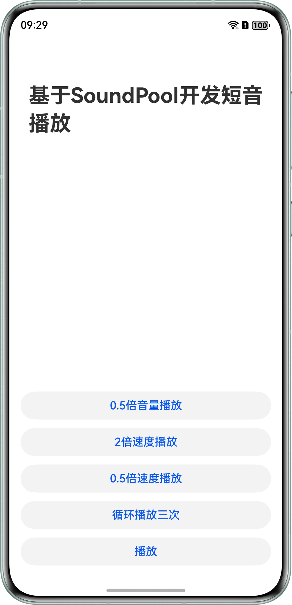

# 基于SoundPool播放短音频

更新时间：2026-03-12 08:45:02

来源：https://developer.huawei.com/consumer/cn/doc/best-practices/bpta-playing-short-audio-based-soundpool

## 概述


SoundPool提供短音频的播放能力，当需要播放一些急促简短的音效（如应用启动音、消息通知音等）时，建议调用SoundPool，应用只需要提供音频资源来源，不负责数据解析和解码就可达成播放效果。指导开发者使用SoundPool开发播放短音频功能，主要涉及基础播放、倍速播放、循环播放、音量调节等开发场景。

本文是音频播放系列文章的第5篇，实现的功能效果如下：





## 规格与限制


- 支持的文件大小：SoundPool当前支持播放解码后1MB以下的音频资源，解码后大小超过1MB的长音频将截取前面的1MB大小数据进行播放。


- 支持的协议如下：


| 协议类型 | 协议描述 |
| --- | --- |
| 本地点播 | 协议格式：支持file descriptor，禁止file path。 |


- 支持的音频播放格式如下：


| 音频容器规格 | 编码规格描述 |
| --- | --- |
| m4a | 音频格式：AAC |
| aac | 音频格式：AAC |
| mp3 | 音频格式：MP3 |
| ogg | 音频格式：VORBIS |
| wav | 音频格式：PCM |


- SoundPool实例数量限制：API version 18以下版本，创建的SoundPool对象底层为单实例模式，一个应用进程只能够创建1个SoundPool实例。
- API version 18及API version 18以上版本，创建的SoundPool对象底层为多实例模式，一个应用进程最多能够创建128个SoundPool实例。


## 实现原理


通过创建SoundPool实例，加载和播放对应的音频资源。支持设置音频流的播放速率、音量、循环模式等播放参数。


> [!NOTE]
> 使用SoundPool播放短音频，且[StreamUsage](https://developer.huawei.com/consumer/cn/doc/harmonyos-references/arkts-apis-audio-e#streamusage)指定为Music、Movie、AudioBook等类型时，其申请焦点时默认为并发模式，不会影响其他音频，若开发过程中涉及焦点管理的问题，请参考[音频焦点管理解决方案](https://developer.huawei.com/consumer/cn/doc/best-practices/bpta-audio-focus-management#section8811136185118)。


## 开发步骤


1. 创建SoundPool实例。

```ts
// The parameter 'usage' in audioRenderInfo takes the values of STREAM_USAGE_UNKNOWN, STREAM_USAGE_MUSIC, and STREAM_USAGE_MOVIE.
// When STREAM_USAGE_AUDIOBOOK is used, the SoundPool plays short sounds in the mixing mode and will not interrupt the playback of other audio.
let audioRendererInfo: audio.AudioRendererInfo = {
  usage: audio.StreamUsage.STREAM_USAGE_MUSIC, // The type of audio stream used: Music. Configure according to the business scenario and refer to StreamUsage.
  rendererFlags: 1, // Set rendererFlags to 1 for low-latency path playback
};
// Create an instance of soundPool.
this.soundPool = await media.createSoundPool(14, audioRendererInfo);
```

2. 设置on('loadComplete')回调，用于监听“资源加载完成”的状态。开发者应在监听到“资源加载完成”的状态后，方可执行后续的播放操作，否则系统会抛出异常。

```ts
// Loading completion callback.
async loadCallback() {
  if (!this.soundPool) {
    hilog.error(0xFF00, 'SoundPool', `soundPool is undefined`);
    return;
  }
  this.soundPool.on('loadComplete', (soundId: number) => {
    this.soundId = soundId;
    hilog.info(0xFF00, 'SoundPool', `load soundPool soundId: ${this.soundId}`);
  })
}
```

3. 设置on('playFinished')或者on('playFinishedWithStreamId')回调，用于监听“播放完成”，以便于在播放后处理对应的业务。

```ts
setPlayFinishedCallback() {
  if (!this.soundPool) {
    hilog.error(0xFF00, 'SoundPool', `soundPool is undefined`);
    return;
  }
  this.soundPool.on('playFinished', () => {
    hilog.info(0xFF00, 'SoundPool', `Succeeded in playFinished`);
  })
}
```

4. 设置on('error')回调，进行错误类型的监听，以便遇到播放问题后，进行快速定位。

```ts
// Set error type listening.
setErrorCallback() {
  if (!this.soundPool) {
    hilog.error(0xFF00, 'SoundPool', `soundPool is undefined`);
    return;
  }
  this.soundPool.on('error', (error: BusinessError) => {
    hilog.error(0xFF00, 'SoundPool',
    `error happened, error code is :' ${error.code}, error message is ${error.message}`);
  })
}
```

5. 调用load()方法，加载音频资源。

```ts
// Load audio resources.
let context = this.getUIContext().getHostContext();
let fileDescriptor = await context!.resourceManager.getRawFd('test.ogg');
this.soundId = await this.soundPool.load(
  fileDescriptor.fd,
  fileDescriptor.offset,
  fileDescriptor.length,
);
```

6. 调用play()方法，播放音频资源。

```ts
async playSoundPool() {
  if (!this.soundPool) {
    hilog.error(0xFF00, 'SoundPool', `soundPool is undefined`);
    return;
  }
  this.soundPool.setPriority(this.soundId, 999);
  // Please perform the 'play' operation only after the audio resource is fully loaded, that is, after receiving the 'loadComplete' callback.
  this.streamId = await this.soundPool.play(this.soundId);
}
```

7. 开发者可以通过配置播放参数PlayParameters实现不同的播放效果，也可以通过单独调用setLoop、setPriority、setvolume、setRate等函数来实现不同的播放效果。下面以设置短音频的循环模式为例，其他设置方法的调用方式相同。

```ts
if (!this.soundPool) {
  hilog.error(0xff00, 'SoundPool', `soundPool is undefined`);
  return;
}
// ...
await this.soundPool.setLoop(this.streamId, 2);
```

8. 停止播放，取消监听，释放SoundPool实例。

```ts
async setOffCallback() {
  if (!this.soundPool) {
    hilog.error(0xFF00, 'SoundPool', `soundPool is undefined`);
    return;
  }
  this.soundPool.off('loadComplete');
  this.soundPool.off('playFinished');
  this.soundPool.off('error');
}
```

```ts
async release() {
  if (!this.soundPool) {
    hilog.error(0xFF00, 'SoundPool', `soundPool is undefined`);
    return;
  }
  // Terminate the playback of the specified stream.
  await this.soundPool.stop(this.streamId);
  // Uninstall audio resources.
  await this.soundPool.unload(this.soundId);
  // Turn off the monitoring.
  this.setOffCallback();
  // Release SoundPool.
  await this.soundPool.release();
  this.streamId = 0;
}
```


## 示例代码


- [基于SoundPool播放短音频](https://gitcode.com/HarmonyOS_Samples/soundpool-play-short-audio)
