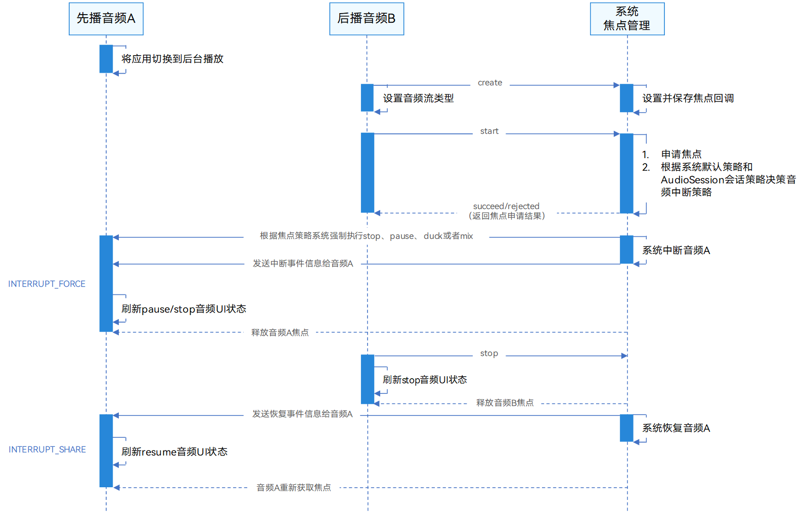
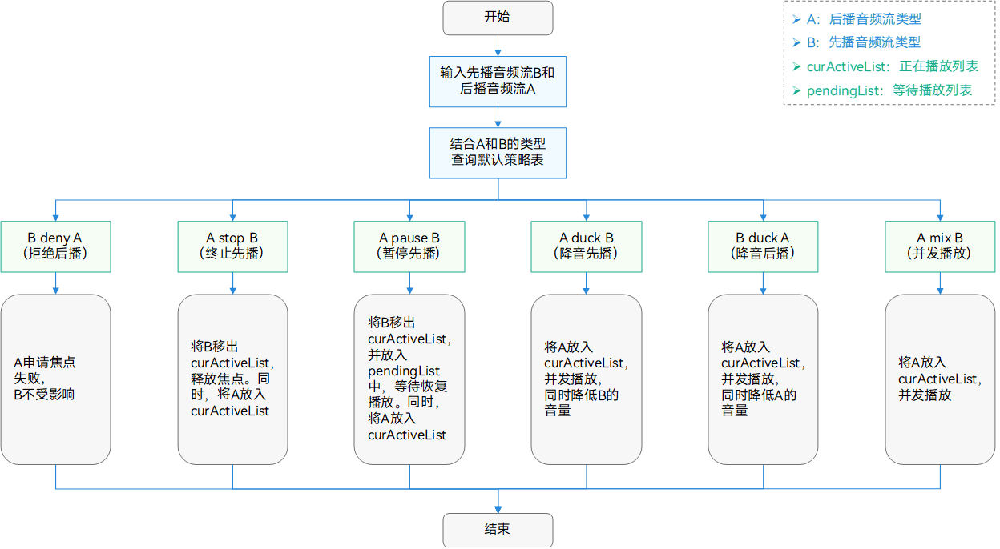
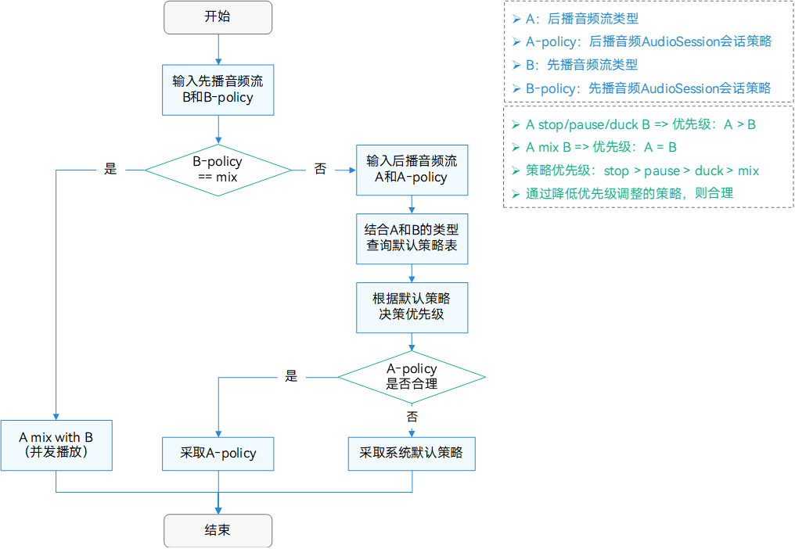
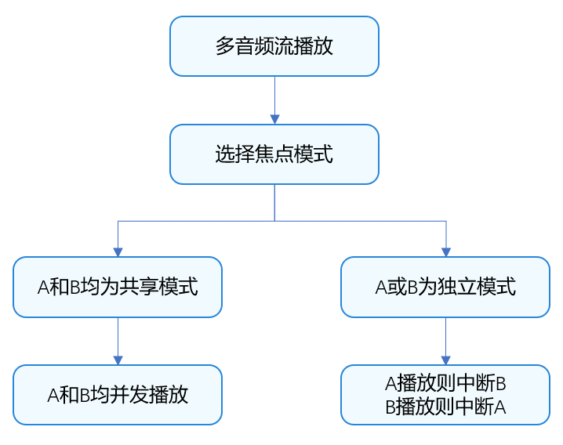
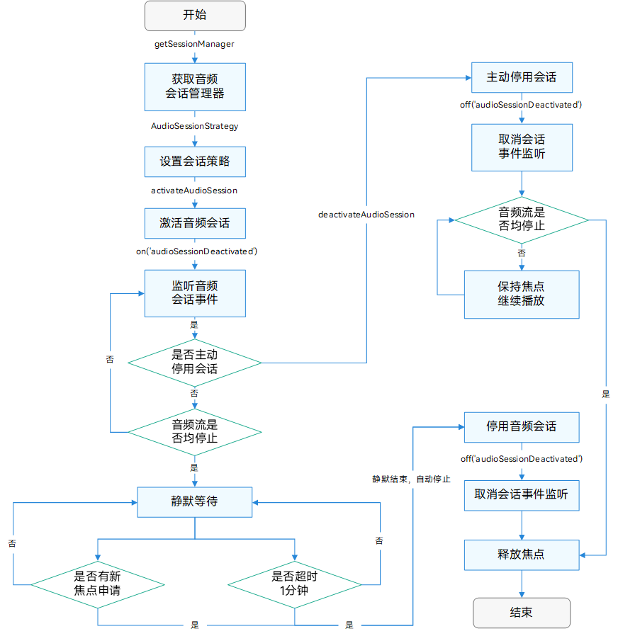

# 音频焦点管理解决方案

更新时间：2026-05-11 08:57:30

来源：https://developer.huawei.com/consumer/cn/doc/best-practices/bpta-audio-focus-management

##### 概述

在后台音频应用已正确监听音频焦点事件并作相应处理后，目前仍存在前台应用与后台音频抢占音频焦点导致的用户体验问题。例如：
 1. 前台静音播放中断后台音乐播放。
2. 前台公众号文章中内嵌的短视频播放中断后台音乐播放，短视频播放结束后，后台音乐播放未恢复。
3. 前台视频播放过程中，音频被后台闹铃播放中断后，无声播放。
 
为解决上述场景中的多音频流播放冲突问题，系统采用了音频焦点机制，即只有获得音频焦点的音频流可以正常播放，失去音频焦点的音频流则不能播放。为满足用户多样化的播放体验，系统构建了一套音频焦点管理机制，会根据不同应用播放的音频流类型，采取不同的中断策略以满足用户的体验需求。
 
本文将从以下几个方面，通过手机场景举例详细介绍系统音频焦点管理机制原理和典型问题场景的解决思路，其他设备场景下的管理机制相通，主要区别在于系统默认策略不同：
 
- [音频焦点抢占流程](#section1747213761316)：了解多音频流抢占焦点的流程，熟悉系统音频焦点管理机制，有助于开发者更高效地定位和解决焦点问题。
- [音频流类型正确配置](#section2888185819153)：正确配置音频流类型，可以获取合理的系统默认焦点策略。同时，在音量管理、音效管理以及输入/输出设备选择上，避免出现不可预期的故障现象。
- [自定义焦点策略设置](#section048671914296)：使用AudioSession进行自定义焦点策略设置，可以定制化地满足用户预期的播放体验。
- [焦点中断事件正确处理](#section1664171514332)：正确处理焦点中断事件，可以避免出现中断后不恢复或播放UI状态错误的现象。
- [应用内多音频流焦点处理](#section168291861114)：同一应用内创建多个音频流时，可实现自主管控，定制不同场景下的多音频流播放体验。
- [常见焦点场景的问题分析](#section8750452171110)：通过分析典型问题场景，有助于开发者获取解决方案，以提升开发效率。

 
> [!NOTE]
> 移动端与电脑端的音频焦点在系统默认策略上存在差异。在移动端，默认策略为新应用播放时会中断或降低先前应用的音量，以避免同时大声播放。例如，用户在听音乐时打开短视频App，音乐将自动暂停或音量显著降低，确保短视频声音清晰。而在电脑端，默认策略允许多个应用的音频同时输出，音量叠加。例如，用户可以一边听音乐，一边观看游戏直播，通过调整不同窗口的音量来实现平衡。

 
 
不同应用可通过设置不同的音频焦点策略，以适配各种体验场景，满足用户良好的应用体验。同一应用内，则可通过调整焦点模式，适配不同体验场景，确保多音频播放的优质体验。同时本篇文章配套的sample覆盖了上述所有场景，效果如下图。
 



 

##### 实现原理

面对多样化的业务场景，为了给用户更好的音频播放体验，系统音频焦点管理机制提供了四类音频中断策略：
 
- **终止策略（Stop）：**停止先播音频流，使其永久失焦，待后播音频流结束后，先播音频流不恢复播放。
- **暂停策略（Pause）：**暂停先播音频流，使其暂时失焦，待后播音频流结束后，先播音频流恢复播放。
- **降音策略（Duck）：**与先播音频流并发播放，并且降低先播音频流的音量，待后播音频流结束后，先播音频流恢复音量。
- **并发策略（Mix）：**与先播音频流并发播放。

 
为了确保业务符合用户的中断策略，系统构建了音频焦点管理机制。该机制以音频流类型为输入，自动决策并执行相应的中断策略。同时，若系统默认策略无法满足用户的音频播放体验需求，系统提供了音频会话（AudioSession），以便开发者进行精细化管理和自定义调整中断策略。
 
 

##### 音频焦点抢占流程

在详细了解音频焦点管理机制之前，开发者应先了解多音频流抢占焦点的时序流程。流程图如下：
 

 



 
从上图可以看出系统音频焦点管理机制，开发者在开发音频相关功能时需要关注以下3点：
 1. 配置正确的音频流，其中音频焦点的创建、释放以及中断策略等动作由系统统一调控。
2. 在音频流配置正确后，若仍无法满足音频播放体验时，开发者可通过AudioSession采用自定义焦点模式。
3. 监听系统发出的中断事件，依据中断事件信息进行相应业务处理。
 
 

##### 音频流类型正确配置

[音频流](https://developer.huawei.com/consumer/cn/doc/harmonyos-guides/audio-kit-intro#音频流介绍)类型是定义音频数据播放和录制方式的关键属性。
 
- **播放场景**
音频播放场景的信息，可以通过[StreamUsage](https://developer.huawei.com/consumer/cn/doc/harmonyos-references/arkts-apis-audio-e#streamusage)进行描述。
- [StreamUsage](https://developer.huawei.com/consumer/cn/doc/harmonyos-references/arkts-apis-audio-e#streamusage)指音频流本身的用途类型，包括媒体、语音通信、语音播报、通知、铃声等。

 - **录制场景**
音频流录制场景的信息，可以通过[SourceType](https://developer.huawei.com/consumer/cn/doc/harmonyos-references/arkts-apis-audio-e#sourcetype8)进行描述。
- [SourceType](https://developer.huawei.com/consumer/cn/doc/harmonyos-references/arkts-apis-audio-e#sourcetype8)指音频流中录音源的类型，包括麦克风音频源、语音识别音频源、语音通话音频源等。

 
 
在系统机制中，音频流类型对业务的影响包括：**音频焦点策略调整**、**音频音量控制**、**音频输入/输出设备选择**以及**音频音效管理**等。
 
上文提到，为确保音频播放效果符合预期，开发者需要在创建音频流时配置正确的音频流类型。系统将根据音频流类型默认执行相应中断策略，若类型配置错误，可能会导致音频播放体验与用户预期不符，进而影响用户体验。
 
以前台导航音频和后台音乐音频冲突场景为例，用户的预期体验是：导航语音播放时会压低后台音乐音量，在导航语音播放完毕后恢复后台音乐音量。如果开发者将导航类应用的音频流类型错误设置为STREAM_USAGE_MUSIC（音乐类型），则在播放导航语音时，会停止后台音乐的播放，使其释放焦点。并且在语音播放完毕后不会恢复音乐播放，导致用户后台音乐播放体验中断。
 
**音频流类型对音频焦点策略的影响原理**
 
系统根据先播和后播音频流类型，查询默认焦点策略。不同策略对应着不同的焦点处理方式，具体如下流程图：
 

 



 
**音频流类型设置方法**
 
应用可采用多种方法实现音频播放或录音功能，例如AudioRenderer、OHAudio、AVPlayer、SoundPool等。因此，设置音频流类型的方式也各不相同。比如，当开发者[使用AudioRenderer开发音频播放功能](https://developer.huawei.com/consumer/cn/doc/harmonyos-guides/using-audiorenderer-for-playback)时，可以在调用[createAudioRenderer](https://developer.huawei.com/consumer/cn/doc/harmonyos-references/arkts-apis-audio-f#audiocreateaudiorenderer8)时，使用[StreamUsage](https://developer.huawei.com/consumer/cn/doc/harmonyos-references/arkts-apis-audio-e#streamusage)来设置音频流类型。具体开发细节可参考[使用AudioRenderer开发音频播放功能](https://developer.huawei.com/consumer/cn/doc/harmonyos-guides/using-audiorenderer-for-playback#完整示例)。另外，更多正确设置音频流类型的方法和详细细节，可以参考指南[设置音频流类型](https://developer.huawei.com/consumer/cn/doc/harmonyos-guides/using-right-streamusage-and-sourcetype#设置音频流类型)。其他方式可参考[使用OHAudio开发音频播放功能(C/C++)](https://developer.huawei.com/consumer/cn/doc/harmonyos-guides/using-ohaudio-for-playback)、[使用AVPlayer播放音频(ArkTS)](https://developer.huawei.com/consumer/cn/doc/harmonyos-guides/using-avplayer-for-playback)、[使用SoundPool播放短音频(ArkTS)](https://developer.huawei.com/consumer/cn/doc/harmonyos-guides/using-soundpool-for-playback)。
 
**音频流类型与典型业务场景映射表**
 
为了开发者能够更好地选择正确的音频流类型，本文提供了常见音频流及其对应业务场景映射表以供参考。
  
| 音频流类型 | 典型业务场景 |
| STREAM_USAGE_MUSIC | 音乐播放、游戏音效 |
| STREAM_USAGE_MOVIE | 电视、电影、短视频、广告、直播、Web页面（比如商品详情介绍视频） |
| STREAM_USAGE_AUDIOBOOK | 有声读物（听书、相声、评书等）、听新闻、播客 |
| STREAM_USAGE_GAME | 适用于游戏内配乐、配音，后台音乐不会被中断；游戏内语音，建议使用STREAM_USAGE_VOICE_COMMUNICATION |
| STREAM_USAGE_NAVIGATION | 导航语音 |
| STREAM_USAGE_VOICE_MESSAGE | 语音消息（即时通讯软件、论坛等），比如语音消息 |
| STREAM_USAGE_VOICE_ASSISTANT | 语音播报，比如滴滴打车 |
| STREAM_USAGE_ACCESSIBILITY | 无障碍（听障辅助等） |
| STREAM_USAGE_VOICE_COMMUNICATION | VoIP语音通话，比如游戏内语音交流、微信语音通话 |
| STREAM_USAGE_VIDEO_COMMUNICATION | VoIP视频通话，比如微信视频通话 |
| STREAM_USAGE_ALARM | 闹钟播放 |
| STREAM_USAGE_RINGTONE | VoIP来电铃声，比如微信电话来电响铃 |
| STREAM_USAGE_NOTIFICATION | 应用消息通知音/提示音播放 |
 
 
 

##### 自定义焦点策略设置

对于多音频流并发冲突的场景，系统虽然提供了统一的音频焦点管理机制进行协调，但是默认策略未必适用于所有业务场景。
 
以新闻或者公众号文章中的内嵌短视频播放中断后台音乐场景为例，短视频音频流类型正确配置为[STREAM_USAGE_MOVIE](#table1513115566277)，根据系统默认策略，后台音乐会在短视频播放时停止播放，且短视频播放结束后，后台音乐不会自动恢复播放。然而，该场景下，更佳的音频播放体验应为短视频播放结束后，后台音乐自动恢复播放。此例说明开发者有需要精细化管理音频焦点策略的场景。
 
针对上述场景中系统默认策略与用户预期策略不一致的情况，系统提供了音频会话（AudioSession）机制，以便开发者自定义焦点策略。AudioSession将在系统默认策略的基础上，进行适当的策略调整。例如，将“音频A stop 音频B”调整为“音频A pause 音频B”。
 
AudioSession提供的四种会话策略（即自定义焦点策略），具体如下：
 1. **默认模式（CONCURRENCY_DEFAULT）：**即系统默认的音频焦点策略。
2. **并发模式（CONCURRENCY_MIX_WITH_OTHERS）：**和其他音频流并发。
3. **降低音量模式（CONCURRENCY_DUCK_OTHERS）：**和其他音频流并发，并且降低其他音频流的音量。
4. **暂停模式（CONCURRENCY_PAUSE_OTHERS）：**暂停其他音频流，待释放焦点后通知其他音频流恢复。
 
**自定义策略原理**
 
AudioSession的自定义焦点策略原理主要通过降低音频流优先级在系统默认策略上进行调整的。例如音频A stop 音频B，说明音频A优先级大于音频B优先级，此时开发者可以降低音频A优先级，自定义焦点策略为并发模式，使其能够与音频B进行并发播放。其原理流程图如下：
 

 


 
以上文的内嵌短视频播放中断后台音乐场景为例，短视频音频流类型为STREAM_USAGE_MOVIE，后台音乐音频流类型为STREAM_USAGE_MUSIC，系统默认策略为Stop模式，用户预期策略为Pause模式。
 1. 判断后台音乐的焦点策略是否为mix（mix具有双向策略特点）。若为mix，则系统直接采取mix策略；
2. 根据内嵌短视频和后台音乐音频流类型，查询默认策略为内嵌短视频Stop后台音乐。因此，内嵌短视频优先级高于后台音乐；
3. 内嵌短视频的AudioSession会话策略为Pause模式，其优先级低于默认策略Stop模式，满足AudioSession调整原则；
4. 系统按照内嵌短视频Pause后台音乐的策略执行中断操作。
 


 

AudioSession自定义焦点策略的原则主要为以下2点：
 1. 无论先播还是后播，存在mix策略，则调整双向策略为mix；
2. 不可通过提高优先级来调整策略。
 
因此，当应用通过AudioSession使用上述各种模式时，系统将尽量满足其焦点策略，并非所有场景能够保证完全满足。例如，使用CONCURRENCY_PAUSE_OTHERS模式时，STREAM_USAGE_MOVIE流申请音频焦点，如果STREAM_USAGE_MUSIC流正在播放，则STREAM_USAGE_MUSIC流会被暂停。此时，如果STREAM_USAGE_VOICE_COMMUNICATION流正在播放，则STREAM_USAGE_VOICE_COMMUNICATION流不会被暂停。
 

 
关于AudioSession的具体使用方法，可以参考[使用AudioSession管理应用音频焦点(ArkTS)](https://developer.huawei.com/consumer/cn/doc/harmonyos-guides/audio-session-management)，完成音频会话从创建到激活并监听的过程。
 
 

##### 焦点中断事件正确处理

上文提到，为了达成用户预期播放体验，除了配置正确的音频流类型，开发者往往还需要监听并正确处理焦点中断事件。例如：
 
- 对于音视频类应用，当音频播放被中断后，需要在页面状态上有所调整，如播放按钮切换为暂停按钮、显示相应的提示消息等。
- 对于音频流恢复播放，如被暂停播放的后台音乐应用，需要应用自行监听系统传递的中断事件，在合适的时机恢复播放。

 
然而，处理焦点中断事件不是必选的，比如瞬时的按键音、提示音等等，一般只需配置正确的音频流类型即可。
 
根据系统对于音频流播放冲突的处理方案，应用的音频流播放场景可以概括为四类：**先暂停后恢复播放、先降低音量后恢复音量、停止后不恢复播放以及并发混音播放**。
 
**先暂停后恢复播放**
 
- **场景描述**
先播音频正常播放中，当后播音频类型为闹钟、电话或铃声时，先播音频暂停播放，待后播音频结束后，先播音频恢复播放。

 - **处理方式**
当后播应用播放音频时，系统会强制暂停先播音频播放，先播应用会监听到音频中断类型为InterruptForceType.INTERRUPT_FORCE（强制中断），中断提示为InterruptHint.INTERRUPT_HINT_PAUSE（音频暂停）事件，然后需要刷新播放状态。值得注意的是，如果使用AVPlayer播放的话，那么播放状态不会自动变为暂停，先播应用需要主动调用AVPlayer的暂停接口来保证状态一致。
- 当后播应用音频结束后，先播应用会监听到中断类型为InterruptForceType.INTERRUPT_SHARE（共享中断），中断提示为InterruptHint.INTERRUPT_HINT_RESUME（音频恢复）事件，此时系统不会自动恢复先播音频播放，先播应用需要在相应的事件中主动调用AVPlayer的播放接口完成恢复。

 
 
**先降低音量后恢复音量**
 
- **场景描述**
先播音频正常播放中，当后播音频类型为导航、TextReader控件朗读语音或语音助手类短语音时，先播音频会降低音量持续播放，待后播音频结束后，先播音频音量恢复。

 
 
- **处理方式**
当后播应用播放音频时，系统会强制降低先播音频音量，先播应用会监听到音频中断类型为InterruptForceType.INTERRUPT_FORCE（强制中断），中断提示为InterruptHint.INTERRUPT_HINT_DUCK（降低音量）事件，应用无需处理，如果应用想实现其他业务逻辑，可在相应的事件类型下进行处理。
- 当后播应用音频结束后，先播应用会监听到中断类型为InterruptForceType.INTERRUPT_FORCE（强制中断），中断提示为InterruptHint.INTERRUPT_HINT_UNDUCK（恢复音量）事件，此时系统会自动恢复先播音频音量，应用无需处理，如果应用想实现其他业务逻辑，可在相应的事件类型下进行处理。

 
 
**停止后不恢复播放**
 
- **场景描述**
先播音频正常播放中，当后播音频类型为音乐、视频或VoIP时，先播音频停止播放，待后播音频结束后，先播音频不会恢复。

 
 
- **处理方式**
当后播应用播放音频时，系统会强制停止先播音频播放，先播应用会监听到音频中断类型为InterruptForceType.INTERRUPT_FORCE（强制中断），中断提示为InterruptHint.INTERRUPT_HINT_STOP（音频结束）事件，然后需要刷新播放状态。值得注意的是，如果使用AVPlayer播放的话，那么播放状态不会自动变为暂停，先播应用需要主动调用AVPlayer的暂停接口来保证状态一致。

 
 
**并发混音播放**
 
- **场景描述**
先播音频正常播放中，当后播音频类型为游戏或系统音效(锁屏或按键)时，先播应用会与后播应用并发播放。

 
 
- **处理方式**
此场景为系统默认行为，应用无需适配。

 
 
不同的音频开发方式，对应的中断事件处理接口亦不相同，详情可参考[处理音频焦点变化](https://developer.huawei.com/consumer/cn/doc/harmonyos-guides/audio-playback-concurrency#处理音频焦点变化)章节。
 
 

##### 应用内多音频流焦点处理

针对同一应用创建的多个音频流，应用可通过设置[焦点模式（InterruptMode）](https://developer.huawei.com/consumer/cn/doc/harmonyos-references/arkts-apis-audio-e#interruptmode9)，选择由应用自主管控，或由系统统一管理。
 
系统预设了两种焦点模式：
 
- **共享焦点模式（SHARE_MODE）**：同一应用创建的多个音频流共享一个音频焦点。这些音频流之间的并发规则由应用自行决定，音频焦点策略不会介入。仅当其他应用创建的音频流与该应用的音频流同时播放时，才会触发音频焦点策略的管理。
- **独立焦点模式（INDEPENDENT_MODE）**：应用创建的每个音频流均独立拥有一个音频焦点，多个音频流同时播放时，将触发音频焦点策略的管理。

 
应用可根据需求选择合适的焦点模式。在创建音频流时，系统默认采用共享焦点模式（SHARE_MODE），多音频流间可以并发播放，若设置为独立模式，则音频流之前的打断策略使用系统默认焦点策略。应用可根据不同场景需求主动设置所需的焦点模式。下面以同应用内有两条音频流A和B为例，展示下在不同焦点模式下A和B的播放差异。
 


 
设置焦点模式的方法：
 
- 若[使用AVPlayer开发音频播放功能(ArkTS)](https://developer.huawei.com/consumer/cn/doc/harmonyos-guides/using-avplayer-for-playback)，则可以通过修改AVPlayer的[InterruptMode](https://developer.huawei.com/consumer/cn/doc/harmonyos-references/arkts-apis-audio-e#interruptmode9)属性进行设置。
- 若[使用AVPlayer开发音频播放功能(C/C++)](https://developer.huawei.com/consumer/cn/doc/harmonyos-guides/using-ndk-avplayer-for-playback)，则可以调用[OH_AVPlayer_SetAudioInterruptMode](https://developer.huawei.com/consumer/cn/doc/harmonyos-references/capi-avplayer-h#oh_avplayer_setaudiointerruptmode)函数进行设置。
- 若[使用AudioRenderer开发音频播放功能](https://developer.huawei.com/consumer/cn/doc/harmonyos-guides/using-audiorenderer-for-playback)，则可以调用[setInterruptMode](https://developer.huawei.com/consumer/cn/doc/harmonyos-references/arkts-apis-audio-audiorenderer#setinterruptmode9)函数进行设置。
- 若[使用OHAudio开发音频播放功能(C/C++)](https://developer.huawei.com/consumer/cn/doc/harmonyos-guides/using-ohaudio-for-playback)，则可以调用[OH_AudioStreamBuilder_SetRendererInterruptMode](https://developer.huawei.com/consumer/cn/doc/harmonyos-references/capi-native-audiostreambuilder-h#oh_audiostreambuilder_setrendererinterruptmode)函数进行设置。

 
 

##### 不同应用间音频焦点冲突处理

 

##### 场景描述

不同应用间音频流焦点相互抢占情况，例如后播短视频会打断先播的后台音乐，按照系统默认焦点策略，后台音乐会停止播放，且短视频暂停或者播放结束后也不会恢复播放。从实际体验来看，短视频暂停或结束，后台音乐恢复播放的体验更优。
 
 

##### 实现原理

通过给后播短视频设置自定义焦点策略，可以实现[场景描述](#section938014296464)中的更优体验。主要的开发步骤如下。
 1. 在播放视频前，利用[音频会话管理](https://developer.huawei.com/consumer/cn/doc/harmonyos-guides/audio-session-management)，设置此次音频流所采用的音频焦点策略为暂停模式（CONCURRENCY_PAUSE_OTHERS）。
2. 播放暂停或结束后，需要释放音频焦点。
 
 

##### 开发步骤

1. 播放时，设置音频流所采用的音频焦点策略为暂停模式。
 
```ArkTS
async mediaPlay() {
  // ...
  await this.activateAudioSession();
  await this.avPlayer.play().catch((error: BusinessError) => {
    Logger.error(TAG,
      `play failed, code is ${error.code}, message is ${error.message}`);
  });
  // ...
}
```
 
```ArkTS
async activateAudioSession() {
  try {
    this.audioSessionManager.setAudioSessionScene(audio.AudioSessionScene.AUDIO_SESSION_SCENE_MEDIA)
    let strategy: audio.AudioSessionStrategy = {
      concurrencyMode: this.isMuted ? audio.AudioConcurrencyMode.CONCURRENCY_MIX_WITH_OTHERS :
        AppStorage.get('audioConcurrencyMode') as audio.AudioConcurrencyMode
    };
    await this.audioSessionManager.activateAudioSession(strategy).catch(() => {
      Logger.info('activateAudioSession SUCCESS');
    }).then(() => {
      Logger.info('activateAudioSession SUCCESS');
    });
  } catch (error) {
    Logger.error(TAG, `activateAudioSession failed,code is ${error.code},message is ${error.message}}`);
  }
}
```
 
2. 播放暂停或结束后，调用[deactivateAudioSession()](https://developer.huawei.com/consumer/cn/doc/harmonyos-references/arkts-apis-audio-audiosessionmanager#deactivateaudiosession12)释放音频焦点。
 
```ArkTS
async mediaPause() {
  if (this.avPlayer && this.avPlayer.state !== 'paused') {
    try {
      await this.avPlayer.pause().catch((error: BusinessError) => {
        Logger.error(TAG,
          `pause failed, code is ${error.code}, message is ${error.message}`);
      });
      // ...
      let isScrolling: boolean | undefined = AppStorage.get('isScrolling')
      if (!isScrolling) {
        this.deactivateAudioSession();
        Logger.info(TAG, 'mediaPause success and deactivateAudioSession')
      }
      Logger.info(TAG, 'mediaPause');
    } catch (error) {
      if (error.code !== null && error.message !== null) {
        Logger.error(TAG, `mediaPause failed, code is ${error.code}, message is ${error.message}`);
      }
    }
  }
}
```
 
 

##### 同应用内多音频流焦点冲突处理

 

##### 场景描述

同一个应用内多音频流焦点冲突情况，例如游戏音效与VOIP语音通话并发或者中断等。
 
 

##### 实现原理

可通过设置[焦点模式（InterruptMode）](https://developer.huawei.com/consumer/cn/doc/harmonyos-references/arkts-apis-audio-e#interruptmode9)，可以实现同应用内不同音频流之间的并发或中断效果，详细流程参考上文[应用内多音频流焦点处理](#section168291861114)。
 
主要的开发步骤如下：
 
1. 定义播放实例类，每个实例类初始化时都需要创建一个单独的AudioRender实例，播放传入的音频流。
2. 初始化不同播放实例类，每个实例类传入不同对应音频流，保证一个AudioRender实例控制和渲染一条音频流
3. 调用[setInterruptMode](https://developer.huawei.com/consumer/cn/doc/harmonyos-references/arkts-apis-audio-audiorenderer#setinterruptmode9)函数设置焦点模式。
 

##### 开发步骤

1. 定义播放实例类，每个实例类初始化时都需要创建一个单独的AudioRender实例，播放传入的音频流。
 
```ArkTS
export class AudioItem {
  // ...
  audioRenderController: AudioRenderController | undefined = undefined;
  constructor(img: Resource, audioUrl: string, isPlaying: boolean, tag: string,
    avSessionController: AVSessionController) {
    // ...
    this.audioRenderController = new AudioRenderController(this.tag);
    // ...
  }
  // ...
}
```
 
2. 初始化不同播放实例类，每个实例类传入不同对应音频流，保证一个AudioRender实例控制和渲染一条音频流。
 
```ArkTS
@Component
struct MultiAudioStreamPlayScene {
  private avSessionController: AVSessionController = new AVSessionController();
  // Instantiate three audio streams, with each AudioRender instance independently controlling the rendering of one audio stream.
  @State audioItems: AudioItem[] =
    [new AudioItem($r('app.media.ic_avatar12'), AudioNameTag.FIRST_SONG_NAME + CommonConstants.AUDIO_TYPE, false,
      AudioNameTag.FIRST_SONG_NAME, this.avSessionController),
      new AudioItem($r('app.media.ic_avatar13'), AudioNameTag.SECOND_SONG_NAME + CommonConstants.AUDIO_TYPE, false,
        AudioNameTag.SECOND_SONG_NAME, this.avSessionController),
      new AudioItem($r('app.media.ic_avatar14'), AudioNameTag.THIRD_SONG_NAME + CommonConstants.AUDIO_TYPE, false,
        AudioNameTag.THIRD_SONG_NAME, this.avSessionController)]
  // ...
}
```
 
3. 调用[setInterruptMode](https://developer.huawei.com/consumer/cn/doc/harmonyos-references/arkts-apis-audio-audiorenderer#setinterruptmode9)函数设置焦点模式。
 
```ArkTS
setInterruptMode(mode: audio.InterruptMode) {
  if (!this.audioRenderer) {
    Logger.info(TAG, 'set interrupt callback failed, audioRenderer is null.');
    return;
  }
  this.audioRenderer.setInterruptMode(mode).then(() => {
    Logger.info(TAG, 'setInterruptMode Success!');
  }).catch((err: BusinessError) => {
    Logger.info(TAG, `setInterruptMode Fail: ${err}`);
  });
}
```
 
 

##### 典型问题场景

 

##### 直播或广告被中断后不恢复问题

**问题现象**
 
直播或广告在播放过程中，被后播音乐中断，待后播音乐结束后，直播或广告将会停止不恢复或者无声播放。
 
**分析思路**
 
直播或广告的音频流类型一般为STREAM_USAGE_MOVIE。该音频流类型对应的系统默认焦点策略如下：
 
- 若后播音频为闹钟、运营商通话、VoIP通话、铃声或语音消息时，则直播或广告会被暂停，待后播音频流播放结束后，直播或广告恢复播放。
- 若后播音频为导航、语音播报或通知消息时，则直播或广告会被降低音量持续播放，待后播音频流播放结束后，直播或广告恢复音量持续播放。
- 若后播音频为音乐、视频或电子书时，则直播或广告会被停止，永久失焦。
- 若后播音频为游戏或系统音效（锁屏、按键音）时，则并发混音播放。

 
因此，根据系统默认的焦点策略，当后台播放的音频为STREAM_USAGE_MOVIE时，直播或广告将永久失焦。由于直播或广告视频页面中没有交互按钮，用户无法通过点击播放按钮来重新播放视频，因此，音频也无法重新获取焦点并恢复播放。
 
**解决方案**
 
针对上述场景，常见解决方案如下：
 
- 如果先播应用从后台切换到前台，开发者需要在生命周期方法onPageShow()中主动调用播放接口以恢复播放。具体参考[使用AVPlayer播放视频时，如何实现应用从后台切回前台时继续播放原视频](https://developer.huawei.com/consumer/cn/doc/harmonyos-faqs/faqs-media-4)。
- 如果先播应用在前台被stop，那么需要应用适配交互行为，让用户主动触发以恢复播放。

 
```ArkTS
XComponent({
  id: 'VideoPlayer',
  type: XComponentType.SURFACE,
  controller: this.xComponentController
})
  .onLoad(() => {
    this.initAVResource();
  })
  .width('100%')
  .height('100%')
```
 
 

##### VoIP通话被中断后不恢复问题

**问题现象**
 
在VoIP通话过程中，若被后播音频中断，待后播音频结束后，VoIP音频不会自动恢复，导致无声。
 
**分析思路**
 
VoIP通话场景中，播放对端通话声音的音频流类型应当设置为STREAM_USAGE_VOICE_COMMUNICATION。该音频流类型对应的系统默认焦点策略如下：
 
- 若后播音频为运营商通话或VoIP通话时，则先暂停VoIP通话，待后播音频结束后，VoIP通话恢复。
- 若后播音频为语音播报时，则后播音频申请焦点失败，不允许播放。
- 若后播音频为蜂窝铃声、VoIP铃声、导航播报、通知消息或运营商拨号声时，则并发混音播放。
- 若后播音频为语音消息、锁屏按键声、音频、视频、游戏声效、电子书播报或闹钟时，则降低后播音频音量，并发播放。

 
因此，从系统默认焦点策略来看，出现VoIP被中断不恢复的原因，主要有以下两个可能原因：
 1. **音频流类型设置错误，导致系统默认策略错误。**例如：
- 当先播音频为VoIP通话，后播音频为运营商通话时，则：

2. 若先播音频流类型为STREAM_USAGE_VOICE_COMMUNICATION，则系统默认策略为pause inprocessing，即先暂停先播音频，待后播音频结束后，先播音频恢复播放。

3. 若先播音频流类型为STREAM_USAGE_VOICE_MESSAGE，则系统默认策略为stop inprocessing，即直接停止先播音频，使其永久失焦，待后播音频结束后，先播音频不恢复播放。

4. **应用未正确处理中断事件，导致音频中断不恢复。**
恢复中断事件类型为InterruptForceType.INTERRUPT_SHARE（共享中断），该事件非强制性执行，系统不会自动恢复先播音频播放。当先播应用收到中断提示为InterruptHint.INTERRUPT_HINT_RESUME（音频恢复）时，需在相应事件中主动调用播放接口以完成恢复。

  **解决方案**

  针对上述可能导致音频中断不恢复的原因，相应提出以下解决方案：

1. **音频流类型设置解决方案**
了解音频流类型与系统默认策略关联原理。

2. 参考[音频流类型正确配置](#section2888185819153)，选择正确的音频流类型。

3. 根据所用的音频开发方法，正确[设置音频流类型](https://developer.huawei.com/consumer/cn/doc/harmonyos-guides/using-right-streamusage-and-sourcetype#设置音频流类型)。

4. **焦点中断事件处理解决方案**
由于恢复事件属于非强制类型，系统不会自动恢复先播音频播放。先播应用收到中断提示为InterruptHint.INTERRUPT_HINT_RESUME（音频恢复）后，需要主动在相应的事件中调用播放接口完成恢复。具体操作参考[处理音频焦点变化](https://developer.huawei.com/consumer/cn/doc/harmonyos-guides/audio-playback-concurrency#处理音频焦点变化)。

  

  ##### 信息流内嵌短视频中断先播音频不恢复问题

  **问题现象**

  信息流内嵌短视频是指新闻、公众号文章等内部的短视频。若后播音频为信息流内嵌短视频，中断先播音频后，不使其恢复播放。

  **分析思路**

  信息流内嵌短视频的音频流类型一般为STREAM_USAGE_MOVIE。该音频流类型对应的系统默认焦点策略如下：

  
若先播音频为短视频，后播音频为闹钟、运营商通话、VoIP通话或铃声时，则短视频会被暂停，待后播音频流播放结束后，视频恢复播放。
- 若先播音频为短视频，后播音频为导航、语音播报或通知消息时，则短视频会被降低音量持续播放，待后播音频流播放结束后，视频恢复音量持续播放。
- 若先播音频为短视频，后播音频为音乐、视频或电子书时，则短视频会被停止，永久失焦。
- 若先播音频为短视频，后播音频为游戏或系统音效（锁屏、按键音）时，则并发混音播放。
- 若后播音频为短视频时，则会中断STREAM_USAGE_MUSIC、STREAM_USAGE_MOVIE、STREAM_USAGE_AUDIOBOOK等类型的先播音频，且不会使其恢复播放。

 
因此，从系统默认焦点策略来看，当其中断先播音频后，待其结束时，是不会恢复先播音频播放的。在该问题中，系统默认策略不符合用户播放预期。例如先播音频为音乐，其音频流类型设置为STREAM_USAGE_MUSIC。后播音频为新闻内嵌短视频，其音频流类型设置为STREAM_USAGE_MOVIE。
 
- 系统默认策略为stop inprocessing，即直接停止先播音频，使其永久失焦，待后播音频结束后，先播音频不恢复播放。
- 用户预期策略为pause inprocessing，即先暂停先播音频，待后播音频结束后，先播音频恢复播放。

 
**解决方案**
 
短视频应该配置的音频流类型是STREAM_USAGE_MOVIE，根据所用的音频开发方法，正确[设置音频流类型](https://developer.huawei.com/consumer/cn/doc/harmonyos-guides/using-right-streamusage-and-sourcetype#设置音频流类型)。
 


 

- 如果使用AVPlayer进行短视频应用开发，可以通过设置AVPlayer的属性audioRenderInfo来设置音频流类型。
- 如果未主动设置该属性，AVPlayer将默认使用STREAM_USAGE_MUSIC类型。但是，当媒体源包含视频时，默认值为STREAM_USAGE_MOVIE。

 

 
后播音频流是内嵌在信息流中的短视频，比如新闻、公众号文章中插入的短视频。当先播音频流类型为STREAM_USAGE_MUSIC、STREAM_USAGE_MOVIE、STREAM_USAGE_AUDIOBOOK时，用户通常期望在短视频播放完毕后，先播音频能恢复播放。此时系统的默认音频焦点策略不能解决这个问题，需要使用AudioSession进行自定义焦点策略。
 
- 根据业务需求，选择适当的[音频会话策略](https://developer.huawei.com/consumer/cn/doc/harmonyos-guides/audio-session-management#音频会话策略)以满足用户播放预期。对于该场景，应选择暂停模式（CONCURRENCY_PAUSE_OTHERS）。
- 参考[使用AudioSession管理应用音频焦点(ArkTS)](https://developer.huawei.com/consumer/cn/doc/harmonyos-guides/audio-session-management)进行业务实现。

 
```ArkTS
async mediaPlay() {
  // ...
  await this.activateAudioSession();
  await this.avPlayer.play().catch((error: BusinessError) => {
    Logger.error(TAG,
      `play failed, code is ${error.code}, message is ${error.message}`);
  });
  // ...
}
```
 
```ArkTS
async activateAudioSession() {
  try {
    this.audioSessionManager.setAudioSessionScene(audio.AudioSessionScene.AUDIO_SESSION_SCENE_MEDIA)
    let strategy: audio.AudioSessionStrategy = {
      concurrencyMode: this.isMuted ? audio.AudioConcurrencyMode.CONCURRENCY_MIX_WITH_OTHERS :
        AppStorage.get('audioConcurrencyMode') as audio.AudioConcurrencyMode
    };
    await this.audioSessionManager.activateAudioSession(strategy).catch(() => {
      Logger.info('activateAudioSession SUCCESS');
    }).then(() => {
      Logger.info('activateAudioSession SUCCESS');
    });
  } catch (error) {
    Logger.error(TAG, `activateAudioSession failed,code is ${error.code},message is ${error.message}}`);
  }
}
```
 
 

##### 短视频上下滑动间隙漏音问题

**问题现象**
 
在短视频上下滑动过程中，会出现以下两种漏音场景：
 1. 后播音频为短视频，在滑动一半停止固定页面，出现漏音（先播音频声音）现象。
2. 后播音频为短视频，在上下滑动间隙出现漏音（先播音频声音）现象。
 
**分析思路**
 
该问题主要是因为上下两个短视频保持焦点不连贯，导致在滑动间隙后台音频重新获取焦点恢复播放。上文提到的音频会话（AudioSession）机制除了能够自定义焦点策略以外，还具有延迟焦点释放的功能。原理流程如下：
 

 


 1. 若AudioSession处于激活状态，应用的音频流全部停止时，不会立刻释放音频焦点，系统会保持音频焦点进入静默等待状态，直到音频会话停用或者该应用有新的音频流申请焦点。
2. 若应用存在音频流处于运行状态，AudioSession停用后，不会立刻释放音频焦点，系统会保持音频焦点，直到应用所有音频流均停止。
 
因此，导致该问题的可能原因有以下两个：
 1. 未使用AudioSession机制来管控焦点，导致焦点不能延时释放，从而让后台音频有机会重获焦点恢复播放。
2. AudioSession使用时机不对。若保证焦点在短视频页面继续持有，可以应当基于页面级创建AudioSession会话，而非视频级AudioSession。若基于视频级创建AudioSession，则上下两个视频各自拥有独立的AudioSession实例。在上个视频滑过之后，该视频对应的AudioSession实例被停用，从而短视频应用失去焦点。
 
**解决方案**
 
**1. 使用音频会话（AudioSession）机制，延时释放焦点。**
 
- 根据业务需要，选择合适的[音频会话策略](https://developer.huawei.com/consumer/cn/doc/harmonyos-guides/audio-session-management#音频会话策略)以满足用户播放预期。针对该场景应当选择暂停模式（CONCURRENCY_PAUSE_OTHERS），同时监听短视频列表的滚动状态，在滚动时即使视频暂停，也不立刻释放焦点，滚动结束后再释放焦点，达到延时释放的效果。
```ArkTS
Swiper(this.swiperController) {
  LazyForEach(this.source, (item: VideoData, index: number) => {
    VideoPlayer({
      curSource: item,
      curIndex: this.curIndex,
      index: index,
      avSessionController: this.avSessionController,
      avPlayerController: this.avPlayerController
    })
  })
}
// ...
.onScrollStateChanged((state: ScrollState) => {
  AppStorage.setOrCreate('isScrolling', true);
  if (state === ScrollState.Idle) {
    AppStorage.setOrCreate('isScrolling', false);
  }
  Logger.info(TAG, `scroll state is ${state}`)
})
```
 
```ArkTS
async mediaPause() {
  if (this.avPlayer && this.avPlayer.state !== 'paused') {
    try {
      await this.avPlayer.pause().catch((error: BusinessError) => {
        Logger.error(TAG,
          `pause failed, code is ${error.code}, message is ${error.message}`);
      });
      // ...
      let isScrolling: boolean | undefined = AppStorage.get('isScrolling')
      if (!isScrolling) {
        this.deactivateAudioSession();
        Logger.info(TAG, 'mediaPause success and deactivateAudioSession')
      }
      Logger.info(TAG, 'mediaPause');
    } catch (error) {
      if (error.code !== null && error.message !== null) {
        Logger.error(TAG, `mediaPause failed, code is ${error.code}, message is ${error.message}`);
      }
    }
  }
}
```


 
**2. 参考[使用AudioSession管理应用音频焦点(ArkTS)](https://developer.huawei.com/consumer/cn/doc/harmonyos-guides/audio-session-management)进行页面级AudioSession业务实现。**
 
- 在进入页面时，在对应的生命周期（比如自定组件的生命周期onDidBuild或NavDestination的生命周期onWillAppear）中[激活音频会话](https://developer.huawei.com/consumer/cn/doc/harmonyos-guides/using-ohaudio-for-session#激活音频会话)，针对该场景应当选择暂停模式（CONCURRENCY_PAUSE_OTHERS）。
- 在离开页面时，在对应的生命周期（比如自定组件的生命周期aboutToDisappear或NavDestination的生命周期onWillDisappear）中[停用音频会话](https://developer.huawei.com/consumer/cn/doc/harmonyos-guides/using-ohaudio-for-session#停用音频会话)。

 
 

##### 短音中断先播音频不恢复问题

**问题现象**
 
先播音频类型为STREAM_USAGE_MUSIC，后播音频为短音，当后播音频抢占焦点后，先播音频停止播放，待后播音频结束后，先播音频不会恢复。
 
**分析思路**
 
短音类型一般包括闹钟、语音消息、通知消息等。短音类型不同，对应的音频流类型亦不同。建议闹钟对应STREAM_USAGE_ALARM、语音消息对应STREAM_USAGE_VOICE_MESSAGE、通知音对应STREAM_USAGE_NAVIGATION、动效音对应STREAM_USAGE_MUSIC。
 
当先播音频流类型为STREAM_USAGE_MUSIC、STREAM_USAGE_MOVIE、STREAM_USAGE_GAME或STREAM_USAGE_AUDIOBOOK时，后播短音音频根据类型不同，系统默认焦点策略有所不同：
 
- 若短音类型为闹钟和语音消息时，则会先暂停先播音频。在短音播放结束后，先播音频会收到RESUME类型的焦点事件，并恢复播放。
- 若短音类型为通知音时，则会先暂时降低先播音频的音量，在通知音播放完毕后，恢复先播音频音量。
- 若短音类型为动效音时，若先播音频为STREAM_USAGE_MUSIC、STREAM_USAGE_MOVIE或STREAM_USAGE_AUDIOBOOK，则会先停止先播音频，使其永久失焦。在短音播放结束后，先播音频不能恢复播放。若先播音频为STREAM_USAGE_GAME时，则会并发混音播放。

 
根据系统默认策略来看，短音音频流优先级较低。一般当先播音频也为短音类型时，后播音频策略才为stop。
 
因此，后播短音中断先播音频，使其不恢复的原因主要是以下两种：
 1. **音频流类型设置错误，导致系统默认策略错误。**例如先播音频为音乐，其音频流类型设置为STREAM_USAGE_MUSIC。后播音频为闹钟。
- 若后播音频流类型为STREAM_USAGE_ALARM，则系统默认策略为pause inprocessing，即先暂停先播音频，待后播音频结束后，先播音频恢复播放。

2. 若后播音频流类型为STREAM_USAGE_MUSIC，则系统默认策略为stop inprocessing，即直接停止先播音频，使其永久失焦，待后播音频结束后，先播音频不恢复播放。

3. **系统默认策略不符合用户播放预期。**例如先播音频为音乐，其音频流类型设置为STREAM_USAGE_MUSIC。后播音频为动效音，其音频流类型设置为STREAM_USAGE_MUSIC。
系统默认策略为stop inprocessing，即直接停止先播音频，使其永久失焦，待后播音频结束后，先播音频不恢复播放。

4. 用户预期策略为pause inprocessing，即先暂停先播音频，待后播音频结束后，先播音频恢复播放。

  **解决方案**

1. **音频流类型设置解决方案**
了解音频流类型与系统默认策略关联原理。

2. 参考[音频流类型正确配置](#section2888185819153)，选择正确的音频流类型。

3. 根据所用的音频开发方法，正确[设置音频流类型](https://developer.huawei.com/consumer/cn/doc/harmonyos-guides/using-right-streamusage-and-sourcetype#设置音频流类型)。

4. **系统默认焦点策略不满足业务预期策略解决方案**
使用AudioSession自定义焦点策略，根据业务需要，选择合适的[音频会话策略](https://developer.huawei.com/consumer/cn/doc/harmonyos-guides/audio-session-management#音频会话策略)以满足用户播放预期。

5. [使用SoundPool播放短音频(ArkTS)](https://developer.huawei.com/consumer/cn/doc/harmonyos-guides/using-soundpool-for-playback)，且[StreamUsage](https://developer.huawei.com/consumer/cn/doc/harmonyos-references/arkts-apis-audio-e#streamusage)指定为STREAM_USAGE_MUSIC、STREAM_USAGE_MOVIE、STREAM_USAGE_AUDIOBOOK等类型播放短音，则其申请焦点时默认为并发模式，不会影响其他音频。

  

  ##### 静音播放中断其他音频问题

  **问题现象**

  音频静音播放，中断其他非静音播放的音频。

  **分析思路**

  音频静音播放应当满足以下两种场景：

1. 当先播音频为静音播放时，不能影响后播音频申请焦点并正常播放。

2. 当后播音频为静音播放时，不能中断先播音频。

  若出现音频静音播放中断其他音频的现象，则主要是以下两种可能原因：

1. 系统静音接口使用不当，导致静音音频不是并发策略。

2. 若未使用系统静音接口，则音频焦点策略不对和音量控制不当，导致静音音频不是并发策略。

  **解决方案**

  综上问题原因，针对音频静音播放中断其他音频的现象，有以下两种解决方案：

1. 当使用系统静音并发接口开发时，该接口让应用以静音状态开始播放音频（或视频），并且静音阶段不影响其他音频，当后续解除静音的时候，再以正常策略申请音频焦点。各类音频开发方法中的静音接口如下：
[使用AVPlayer播放音频(ArkTS)](https://developer.huawei.com/consumer/cn/doc/harmonyos-guides/using-avplayer-for-playback)，可以调用[setMediaMuted](https://developer.huawei.com/consumer/cn/doc/harmonyos-references/arkts-apis-media-avplayer#setmediamuted12)函数。

2. [使用AudioRenderer开发音频播放功能](https://developer.huawei.com/consumer/cn/doc/harmonyos-guides/using-audiorenderer-for-playback)，可调用[setSilentModeAndMixWithOthers](https://developer.huawei.com/consumer/cn/doc/harmonyos-references/arkts-apis-audio-audiorenderer#setsilentmodeandmixwithothers12)函数。

3. [使用OHAudio开发音频播放功能(C/C++)](https://developer.huawei.com/consumer/cn/doc/harmonyos-guides/using-ohaudio-for-playback)，可调用[OH_AudioRenderer_SetSilentModeAndMixWithOthers](https://developer.huawei.com/consumer/cn/doc/harmonyos-references/capi-native-audiorenderer-h#oh_audiorenderer_setsilentmodeandmixwithothers)函数。

4. 当不使用系统静音接口开发时，则可以使用AudioSession自定义焦点策略为CONCURRENCY_MIX_WITH_OTHERS（并发模式），并手动设置自身应用音量为0即可。具体参考[使用AudioSession管理应用音频焦点(ArkTS)](https://developer.huawei.com/consumer/cn/doc/harmonyos-guides/audio-session-management)进行业务实现。

  

  ##### 游戏音效与其他音频冲突问题

  **问题现象**

  游戏音频场景中，经常会出现如下问题：

  
游戏配乐、配音、动效声音中断后台音乐，预期是并发播放。
- 游戏语音中断后台音乐不恢复。
- 游戏应用内，VOIP通话音频与游戏音效存在中断，预期是并发播放。

 
**分析思路**
 
游戏场景的音频流类型选择需要取决于具体音效类型。比如游戏中的配乐、配音建议使用STREAM_USAGE_GAME类型，类似射击动效音建议使用STREAM_USAGE_MUSIC类型，游戏语音建议使用STREAM_USAGE_VOICE_COMMUNICATION。问题场景中，后台音乐类型为STREAM_USAGE_MUSIC，则系统默认焦点策略如下：
 
- 若游戏音频流类型为STREAM_USAGE_GAME时，则并发混音播放。
- 若游戏音频流类型为STREAM_USAGE_MUSIC时，则终止后台音乐，使其永久失焦，待游戏动效声音结束后，音乐不恢复播放。
- 若游戏音频流类型为STREAM_USAGE_VOICE_COMMUNICATION时，则暂时中断后台音乐，待游戏语音结束后，音乐恢复播放。

 
因此，从系统默认焦点策略来看，可能原因如下：
 
- **游戏配乐、配音中断后台音乐，预期是并发播放，**可参考上文[短音中断场景分析思路](#section8811136185118)
音频流类型设置错误，导致系统默认策略错误。
- 系统默认策略不符合用户播放预期。

 - **游戏语音中断后台音乐不恢复**，可参考上文[VoIP通话场景分析思路](#section195701439164615)
音频流类型设置错误，导致系统默认策略错误。
- 应用未正确处理中断事件，导致音频中断不恢复。

 - **游戏应用内，VOIP通话音频与游戏音效存在中断，预期是并发播放。**可参考[应用内多音频流焦点处理](#section168291861114)
应用内不同音频流焦点模式设置错误，导致互相打断。

 
 
**解决方案**
 
综上问题原因，有以下解决方案：
 1. **音频流类型设置解决方案**
- 了解音频流类型与系统默认策略关联原理。

2. 参考[音频流类型正确配置](#section2888185819153)，选择正确的音频流类型。

3. 根据所用的音频开发方法，正确[设置音频流类型](https://developer.huawei.com/consumer/cn/doc/harmonyos-guides/using-right-streamusage-and-sourcetype#设置音频流类型)。

4. **游戏动效声音使用了STREAM_USAGE_MUSIC类型调整焦点策略方案**
使用AudioSession自定义焦点策略，根据业务需要，选择合适的[音频会话策略](https://developer.huawei.com/consumer/cn/doc/harmonyos-guides/audio-session-management#音频会话策略)以满足用户播放预期。

5. [使用SoundPool播放短音频(ArkTS)](https://developer.huawei.com/consumer/cn/doc/harmonyos-guides/using-soundpool-for-playback)，且[StreamUsage](https://developer.huawei.com/consumer/cn/doc/harmonyos-references/arkts-apis-audio-e#streamusage)指定为STREAM_USAGE_MUSIC、STREAM_USAGE_MOVIE、STREAM_USAGE_AUDIOBOOK等类型播放短音，则其申请焦点时默认为并发模式，不会影响其他音频。

6. **焦点中断事件处理解决方案**
由于恢复事件属于非强制类型，系统不会自动恢复先播音频播放。先播应用收到中断提示为InterruptHint.INTERRUPT_HINT_RESUME（音频恢复）后，需要主动在相应的事件中调用播放接口完成恢复。具体操作参考[处理音频焦点变化](https://developer.huawei.com/consumer/cn/doc/harmonyos-guides/audio-playback-concurrency#处理音频焦点变化)。

7. **焦点模式设置解决方案**
通过设置[焦点模式（InterruptMode）](https://developer.huawei.com/consumer/cn/doc/harmonyos-references/arkts-apis-audio-e#interruptmode9)，可以实现同应用内不同音频流之间的并发或中断效果。参考上文[应用内多音频流焦点处理](#section168291861114)

  

  ##### 后台长时任务与音频焦点管理的问题

  **问题现象**

  （1）后台播放音频，自动停止播放，并偶现闪退。

  （2）后台播放过程中用户主动暂停，没有释放长时任务，应用进程被挂起。

  **分析思路**

  后台长时任务的申请和取消具有一定的运行限制。应用若不遵守规范接入，则将会被系统管控，比如静音冻结、进程挂起等。长时任务具体使用场景和运行限制，请参考[后台长时任务使用场景和运行限制](https://developer.huawei.com/consumer/cn/doc/harmonyos-guides/continuous-task#使用场景)。

  **解决方案**

  根据后台长时任务的使用场景和运行限制，开发者在进行后台播放时，建议如下：

1. 应用执行的业务类型与长时任务的申请类型需要保持一致，否则系统会对应用进行管控，即应用退至后台会被挂起。如系统检测到应用只申请了AUDIO_PLAYBACK（音视频播放），但实际上除了播放音乐（对应AUDIO_PLAYBACK类型），还在进行录制（对应AUDIO_RECORDING类型）。

2. 应用申请长时任务后，需要执行相应的业务，否则系统会对应用进行管控，即应用退至后台会被挂起。如系统检测到应用申请了AUDIO_PLAYBACK（音视频播放），但实际未播放音乐。

3. 媒体播放类（流类型为STREAM_USAGE_MUSIC、STREAM_USAGE_MOVIE和STREAM_USAGE_AUDIOBOOK）和游戏类（流类型为STREAM_USAGE_GAME）应用申请后台长时任务播放时，必须接入媒体会话服务（[AVSession](https://developer.huawei.com/consumer/cn/doc/harmonyos-guides/avsession-overview)），且长时任务类型应当为AUDIO_PLAYBACK。否则应用退至后台播放时会被系统静音并冻结，无法在后台正常播放，直到应用重新切回前台时，才会解除静音并恢复播放。

4. 用户主动点击音乐暂停播放时，应用需及时取消对应的长时任务；用户再次点击音乐播放时，需重新申请长时任务。

5. 若音频在后台播放时被打断，系统会自行检测和停止长时任务，音频重启播放时，需要再次申请长时任务。

6. 后台播放音频的应用，在停止长时任务的同时，需要暂停或停止音频流，否则应用会被系统强制终止。

7. 若应用退至后台，需要暂停音频播放时，则建议不申请长时任务。

  

  ##### 视频频繁后台切换导致后台音乐不恢复播放问题

  **问题现象**

  先播音频类型为STREAM_USAGE_MUSIC，后播音频类型为视频。先播音频在后台播放，后播视频抢占焦点后，先播音频停止播放，待后播视频进入后台时会暂停，但是先播音频不会恢复。

  **分析思路**

  如果后播视频进入后台暂停后，希望先播音频恢复，需要满足2个条件：

1. 后播视频播放时需要先使用[音频会话管理](https://developer.huawei.com/consumer/cn/doc/harmonyos-guides/audio-session-management)设置焦点策略为暂停模式（CONCURRENCY_PAUSE_OTHERS）。

2. 当结束或者暂停播放时，需要使用停用音频会话以[释放音频焦点](https://developer.huawei.com/consumer/cn/doc/harmonyos-guides/audio-playback-concurrency#释放音频焦点)。

  
> [!NOTE]
> 当应用 使用AudioRenderer开发音频播放功能 或 使用AVPlayer播放视频(ArkTS) ，当暂停或者结束播放时，系统会自动为相应的音频流释放音频焦点。 如果应用通过激活 音频会话管理 申请过焦点，当暂停或者结束播放时，则需要结束AudioSession以释放焦点。


  因此，根据系统默认的焦点策略，当先播音频被后播视频打断，即使后播视频暂停，先播音频也不会恢复播放。如果需要先播音频恢复播放，需要设置后播视频焦点策略为暂停模式，并且在后播视频暂停时，需要及时释放音频焦点。

  **解决方案**

1. 使用AudioSession的[activateAudioSession](https://developer.huawei.com/consumer/cn/doc/harmonyos-references/arkts-apis-audio-audiosessionmanager#activateaudiosession12)接口激活音频音频会话，并设置音频会话策略为暂停模式（CONCURRENCY_PAUSE_OTHERS）。

2. 如果后播应用从前台切换到后台，开发者需要在生命周期方法onPageShow()或者[NavDestination](https://developer.huawei.com/consumer/cn/doc/harmonyos-references/ts-basic-components-navdestination)页面的生命周期方法[onHidden()](https://developer.huawei.com/consumer/cn/doc/harmonyos-references/ts-basic-components-navdestination#onhidden10)中调用AudioSession的[deactivateAudioSession](https://developer.huawei.com/consumer/cn/doc/harmonyos-references/arkts-apis-audio-audiosessionmanager#deactivateaudiosession12)停用音频会话，及时释放焦点。

  

  ##### 示例代码

  
[实现音频焦点管理功能](https://gitcode.com/harmonyos_samples/audio-focus)
