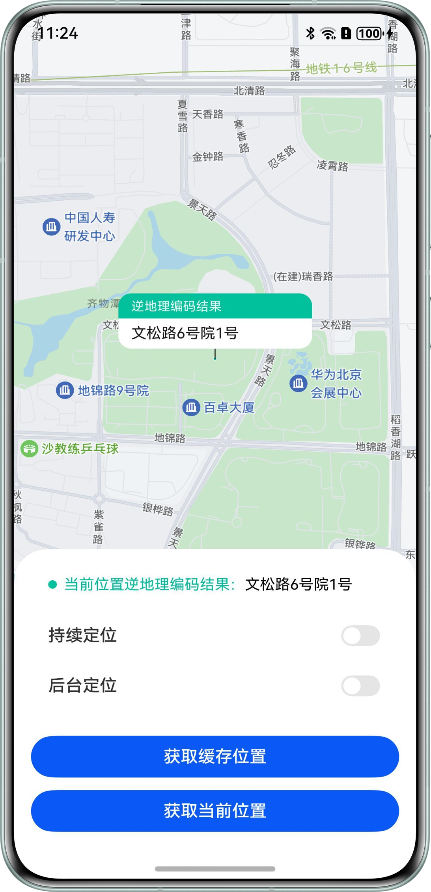
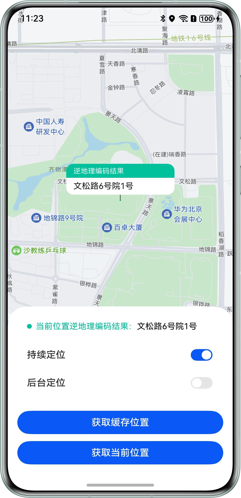
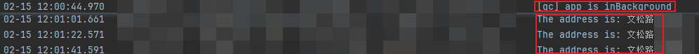

# 位置定位

更新时间：2026-05-18 00:55:31

来源：https://developer.huawei.com/consumer/cn/doc/best-practices/bpta-positioning

**   


##### 概述

在实际应用开发过程中，经常需要用到移动终端设备的位置信息，比如查看所在城市天气、出行打车、旅行导航以及观察运动轨迹等。关于位置定位，位置服务提供了两种定位方式，分别为GNSS定位和网络定位，如下表所示：
  
| 定位方式 | 说明 | 优点 |
| --- | --- | --- |
| GNSS定位 | 基于全球导航卫星系统，包含GPS、GLONASS、北斗、Galileo等，通过导航卫星、设备芯片提供的定位算法，来确定设备准确位置。 | 定位精准 |
| 网络定位 | 通过网络进行定位，包括WLAN、蓝牙定位、基站定位。 | 定位速度快 |
 
 
利用系统的位置定位能力，可以在多种开发场景中获得实时准确的位置信息。本文将介绍如下四种常见的定位场景，并给出其具体实现方案，帮助开发者更好地掌握位置定位的基本原理和开发流程。
 
- [当前位置定位](#section15711161035812)：获取设备的当前位置信息。开发者可以根据实际需求将其应用于多种业务场景，如外卖定位、打车定位等。
- [实时位置定位](#section189692202585)：持续获取设备的实时位置信息。开发者可以将此能力应用于需要实时定位的场景，如步行导航、驾车出行等。
- [应用后台定位](#section32954110416)：将应用切换到后台仍然可以持续获取位置信息。该能力可以用于实现后台应用实时记录运动轨迹等业务场景。
- [历史定位获取](#section1920418138118)：获取系统缓存的最新位置，即最近一次的历史定位信息。该能力可以用于在设备网络信号较弱或对系统功耗比较敏感的场景下获取位置信息。

 
 

##### 当前位置定位

开发者可以根据实际业务诉求，设置相应的定位策略获取设备的当前位置信息，不同定位策略对应[表1 定位方式介绍](#table1916823418349)中不同的定位方式。
 
**实现原理**
 
位置服务提供[getCurrentLocation()](https://developer.huawei.com/consumer/cn/doc/harmonyos-references/js-apis-geolocationmanager#geolocationmanagergetcurrentlocation-2)接口来获取当前位置信息，该接口需要用户设置关键参数——定位请求信息。定位请求信息包含定位方式优先级、单次定位超时时间等，分为[CurrentLocationRequest](https://developer.huawei.com/consumer/cn/doc/harmonyos-references/js-apis-geolocationmanager#currentlocationrequest)和[SingleLocationRequest](https://developer.huawei.com/consumer/cn/doc/harmonyos-references/js-apis-geolocationmanager#singlelocationrequest12)两种类型。两种类型对应的定位优先级分别为[LocationRequestPriority](https://developer.huawei.com/consumer/cn/doc/harmonyos-references/js-apis-geolocationmanager#locationrequestpriority)和[LocatingPriority](https://developer.huawei.com/consumer/cn/doc/harmonyos-references/js-apis-geolocationmanager#locatingpriority12)。
 
**开发步骤**
 1. 申请定位权限，具体内容可参考[申请位置权限开发指导](https://developer.huawei.com/consumer/cn/doc/harmonyos-guides/location-permission-guidelines)。
2. 实例化位置信息请求对象，确认当前定位策略。以实例化SingleLocationRequest对象为例，将其定位方式优先级设置为快速获取位置优先，定位超时时间设置为10秒，具体代码如下：
```ArkTS
let request: geoLocationManager.SingleLocationRequest = {
  locatingPriority: 0x502,
  locatingTimeoutMs: 10000
};
```

3. 根据定位策略，调用getCurrentLocation()接口获取当前位置信息。
```ArkTS
geoLocationManager.getCurrentLocation(request).then((location: geoLocationManager.Location) => {
  // ...
}).catch((err: BusinessError) => {
  hilog.error(0x0000, TAG, `getCurrentLocationPosition failed, code: ${err.code}, message: ${err.message}`);
  // ...
});
```

4. 调用[getAddressesFromLocation()](https://developer.huawei.com/consumer/cn/doc/harmonyos-references/js-apis-geolocationmanager#geolocationmanagergetaddressesfromlocation)接口进行逆地理编码转化，将位置坐标信息转换为对应的地理位置描述。
```ArkTS
geoLocationManager.getAddressesFromLocation(reverseGeocodeRequest, async (err, data) => {
  if (data) {
    this.address = data[0]?.placeName || '';
    // ...
  } else {
    hilog.error(0x0000, TAG, `getAddressesFromLocation failed, code: ${err.code}, message: ${err.message}`);
    // ...
  }
});
```

5. 运行效果如下图所示

  图1 **获取当前位置信息效果展示**


 
 

##### 实时位置定位

开发者可以根据实际[用户活动场景](https://developer.huawei.com/consumer/cn/doc/harmonyos-references/js-apis-geolocationmanager#useractivityscenario12)或[功耗场景](https://developer.huawei.com/consumer/cn/doc/harmonyos-references/js-apis-geolocationmanager#powerconsumptionscenario12)，设置相应的定位策略持续获取设备的位置信息，不同定位策略对应[表1 定位方式介绍](#table1916823418349)中不同的定位方式。
 
**实现原理**
 
位置服务通过[on('locationChange')](https://developer.huawei.com/consumer/cn/doc/harmonyos-references/js-apis-geolocationmanager#geolocationmanageronlocationchange)接口订阅位置变化情况，实现持续获取设备位置信息的场景诉求。该订阅服务需要申请定位请求信息[LocationRequest](https://developer.huawei.com/consumer/cn/doc/harmonyos-references/js-apis-geolocationmanager#locationrequest)或者[ContinuousLocationRequest](https://developer.huawei.com/consumer/cn/doc/harmonyos-references/js-apis-geolocationmanager#continuouslocationrequest12)，并在请求信息中设置定位场景类型和位置信息上报时间间隔。
 
**开发步骤**
 1. 申请定位权限，具体内容可参考[申请位置权限开发指导](https://developer.huawei.com/consumer/cn/doc/harmonyos-guides/location-permission-guidelines)。
2. 实例化位置信息请求对象，确认持续定位策略。以实例化ContinuousLocationRequest为例，将定位场景类型设置为导航场景，位置信息上报时间间隔设置为1秒，具体代码如下：
```ArkTS
let request: geoLocationManager.ContinuousLocationRequest = {
  interval: 1,
  locationScenario: 0x401
};
```

3. 根据定位策略，调用on('locationChange')开启位置变化订阅，并发起定位请求，持续获取当前位置信息。
```ArkTS
geoLocationManager.on('locationChange', request, this.locationChange);
```

4. 在on('locationChange')的回调函数中，调用[getAddressesFromLocation()](https://developer.huawei.com/consumer/cn/doc/harmonyos-references/js-apis-geolocationmanager#geolocationmanagergetaddressesfromlocation)接口进行逆地理编码转化，将坐标信息转换为对应的地理位置描述。
```ArkTS
geoLocationManager.getAddressesFromLocation(reverseGeocodeRequest, async (err, data) => {
  if (data) {
    this.address = data[0]?.placeName || '';
    // ...
  } else {
    hilog.error(0x0000, TAG, `getAddressesFromLocation failed, code: ${err.code}, message: ${err.message}`);
    // ...
  }
});
```

5. 在不需要获取位置信息时，及时关闭位置变化订阅，并删除对应的定位请求，减少设备功耗。
```ArkTS
try {
  geoLocationManager.off('locationChange', this.locationChange);
} catch (err) {
  hilog.error(0x0000, TAG, `offLocationChange failed, code: ${err.code}, message: ${err.message}`);
}
```

6. 运行效果如下图所示

  图2 **持续获取实时位置信息效果展示**



  


 
 

##### 应用后台定位

当用户将应用切至后台且依然需要获取设备的位置信息时，可以使用该方式进行后台定位。
 
**实现原理**
 
应用后台定位需要申请后台定位权限ohos.permission.LOCATION_IN_BACKGROUND和长时任务权限ohos.permission.KEEP_BACKGROUND_RUNNING。申请了相关权限后，开启[任务模式](https://developer.huawei.com/consumer/cn/doc/harmonyos-references/js-apis-resourceschedule-backgroundtaskmanager#backgroundmode)为定位导航的[长时任务](https://developer.huawei.com/consumer/cn/doc/harmonyos-guides/continuous-task)，并在其回调接口中通过[on('locationChange')](https://developer.huawei.com/consumer/cn/doc/harmonyos-references/js-apis-geolocationmanager#geolocationmanageronlocationchange)订阅位置变化情况，在应用后台持续获取当前位置信息。
 
**开发步骤**
 1. 申请后台定位权限，具体内容可参考[申请位置权限开发指导](https://developer.huawei.com/consumer/cn/doc/harmonyos-guides/location-permission-guidelines)。
2. 在模块的module.json5文件中，申请长时任务权限，并将长时任务模式设置为定位导航类型。申请长时任务权限

  
```json
{
  "name": "ohos.permission.KEEP_BACKGROUND_RUNNING",
  "reason": "$string:running_background",
  "usedScene": {
    "abilities": [
      "EntryAbility"
    ],
    "when": "always"
  }
},
```
 设置长时任务模式为定位导航类型

  
```json
"abilities": [
  {
    // ...
    "backgroundModes": [
      "location"
    ],
    // ...
  }
],
```

3. 开启任务模式为定位导航类型的长时任务，在其回调接口中开启位置变化订阅，并发起定位请求，在应用后台持续获取当前位置信息。开启长时任务

  
```ArkTS
startContinuousTask(): void {
  let context = this.getUIContext().getHostContext() as common.UIAbilityContext;
  if (!context) {
    return;
  }
  let wantAgentInfo: wantAgent.WantAgentInfo = {
    wants: [
      {
        bundleName: context.abilityInfo.bundleName,
        abilityName: context.abilityInfo.name
      }
    ],
    operationType: wantAgent.OperationType.START_ABILITY,
    requestCode: 1,
    wantAgentFlags: [wantAgent.WantAgentFlags.UPDATE_PRESENT_FLAG]
  };

  wantAgent.getWantAgent(wantAgentInfo).then((wantAgentObj) => {
    backgroundTaskManager.startBackgroundRunning(context,
      backgroundTaskManager.BackgroundMode.LOCATION, wantAgentObj).then(() => {
      this.onLocationChange();
      hilog.info(0x0000, TAG, 'startBackgroundRunning succeeded');
    }).catch((err: BusinessError) => {
      hilog.error(0x0000, TAG, `startBackgroundRunning failed, cause:  ${JSON.stringify(err)}`);
    });
  }).catch((err: BusinessError) => {
    hilog.error(0x0000, TAG, `getWantAgent failed, cause:  ${JSON.stringify(err)}`);
  });
}
```
 订阅位置变化情况

  
```ArkTS
onLocationChange(): void {
  let request: geoLocationManager.ContinuousLocationRequest = {
    interval: 1,
    locationScenario: 0x401
  };
  try {
    geoLocationManager.on('locationChange', request, this.locationChange);
    // ...
  } catch (err) {
    hilog.error(0x0000, TAG, `onLocationChange failed, code: ${err.code}, message: ${err.message}`);
    // ...
  }
}
```

4. 在位置变化的回调中，调用[getAddressesFromLocation()](https://developer.huawei.com/consumer/cn/doc/harmonyos-references/js-apis-geolocationmanager#geolocationmanagergetaddressesfromlocation)接口进行逆地理编码转化，将坐标信息转换为对应的地理位置描述。
```ArkTS
geoLocationManager.getAddressesFromLocation(reverseGeocodeRequest, async (err, data) => {
  if (data) {
    this.address = data[0]?.placeName || '';
    // ...
  } else {
    hilog.error(0x0000, TAG, `getAddressesFromLocation failed, code: ${err.code}, message: ${err.message}`);
    // ...
  }
});
```

5. 当不需要在应用后台获取位置信息时，及时关闭长时任务和位置变化订阅，并删除对应的定位请求，减少设备功耗。关闭长时任务

  
```ArkTS
stopContinuousTask(): void {
  let context = this.getUIContext().getHostContext() as common.UIAbilityContext;
  if (!context) {
    return;
  }
  backgroundTaskManager.stopBackgroundRunning(context).then(() => {
    if (!this.isOnLocationChange) {
      this.offLocationChange();
    }
    hilog.info(0x0000, TAG, 'stopBackgroundRunning succeeded');
  }).catch((err: BusinessError) => {
    hilog.error(0x0000, TAG, `stopBackgroundRunning failed, cause:  ${JSON.stringify(err)}`);
  });
}
```
 关闭位置变化订阅

  
```ArkTS
offLocationChange(): void {
  try {
    geoLocationManager.off('locationChange', this.locationChange);
  } catch (err) {
    hilog.error(0x0000, TAG, `offLocationChange failed, code: ${err.code}, message: ${err.message}`);
  }
}
```

6. 运行效果如下图所示
 
图3 **在应用后台持续获取位置信息效果展示**


 



 
 

##### 历史定位获取

当用户设备网络信号较弱或者对系统功耗比较敏感时，可以先获取系统缓存的最新位置，即最近一次的历史定位信息。
 
**实现原理**
 
位置服务通过[getLastLocation()](https://developer.huawei.com/consumer/cn/doc/harmonyos-references/js-apis-geolocationmanager#geolocationmanagergetlastlocation)接口来获取系统缓存的最新位置信息。该接口参数列表为空，返回值为[Location](https://developer.huawei.com/consumer/cn/doc/harmonyos-references/js-apis-geolocationmanager#location)位置信息。
 
**开发步骤**
 1. 申请定位权限，具体内容可参考[申请位置权限开发指导](https://developer.huawei.com/consumer/cn/doc/harmonyos-guides/location-permission-guidelines)。
2. 调用getLastLocation()接口获取系统缓存的最新位置信息。
```ArkTS
let location = geoLocationManager.getLastLocation();
```

3. 调用[getAddressesFromLocation()](https://developer.huawei.com/consumer/cn/doc/harmonyos-references/js-apis-geolocationmanager#geolocationmanagergetaddressesfromlocation)接口进行逆地理编码转化，将坐标信息转换为对应的地理位置描述。
```ArkTS
geoLocationManager.getAddressesFromLocation(reverseGeocodeRequest, async (err, data) => {
  if (data) {
    this.address = data[0]?.placeName || '';
    // ...
  } else {
    hilog.error(0x0000, TAG, `getAddressesFromLocation failed, code: ${err.code}, message: ${err.message}`);
    // ...
  }
});
```

4. 运行效果如下图所示

  图4 **获取缓存位置信息效果展示


 
 

##### 常见问题

 

##### 位置定位不准或者位置信息有偏差

**问题现象**
 
在定位过程中，获取的定位结果不准确，或者将定位结果标记在地图上时出现偏差。
 
**可能原因**
 
- 定位权限设置错误，例如设置的定位权限为模糊定位而非精准定位。
- 定位策略设置错误，例如设置的策略为快速获取位置优先（蓝牙、基站、WLAN等网络定位方式）而非精度优先（GNSS卫星定位方式）。
- 在获取定位结果后，未进行坐标纠偏就将结果标记在地图上。华为地图在中国大陆、中国香港和中国澳门使用的是GCJ02坐标系，而定位返回结果使用的是WGS84坐标系，若直接将结果标记在华为地图上，因坐标值不同，展示位置会有偏移。

 
**解决措施**
 
- 针对定位权限设置错误问题，需要申请精准定位权限ohos.permission.LOCATION，并在应用中授权获取精准位置。
- 针对定位策略设置错误问题，需要将定位策略设置为精度优先，采用GNSS卫星定位方式。
- 针对定位结果在地图上的标记偏差问题，在中国大陆、中国香港和中国澳门如果使用WGS84坐标调用Map Kit服务，需要先将其转换为GCJ02坐标系再访问，详情见[坐标纠偏](https://developer.huawei.com/consumer/cn/doc/harmonyos-guides/map-convert-coordinate)。

 
 

##### 位置定位失败

**问题现象**
 
无法使用定位功能获取位置信息。
 
**可能原因**
 
- 系统位置开关为关闭状态。
- 网络信号不佳，导致定位超时。
- 系统无缓存位置信息，导致获取上一次位置失败。

 
**解决措施**
 
- 打开系统位置开关。
- 检查设备是否联网、是否插入SIM卡、WiFi开关是否开启等。
- 移动至开阔地带再发起定位。
- 在系统无缓存位置的情况下，使用[getCurrentLocation()](https://developer.huawei.com/consumer/cn/doc/harmonyos-references/js-apis-geolocationmanager#geolocationmanagergetcurrentlocation-2)接口获取当前位置信息。

 
 

##### 系统缓存位置信息不准确

**问题现象**
 
使用[getCurrentLocation()](https://developer.huawei.com/consumer/cn/doc/harmonyos-references/js-apis-geolocationmanager#geolocationmanagergetcurrentlocation-2)接口获取当前定位信息后，再使用[getLastLocation()](https://developer.huawei.com/consumer/cn/doc/harmonyos-references/js-apis-geolocationmanager#geolocationmanagergetlastlocation)接口获取缓存定位信息，两次获取的定位信息不一致。
 
**可能原因**
 
所有应用公用系统中的同一份缓存定位信息，有可能在两次接口调用之间有其他应用发起定位，刷新了系统中的缓存定位信息。
 
**解决措施**
 
对比获取定位信息的时间，根据时间判断缓存定位信息是否更新。
 
 

##### 示例代码

- [基于位置服务获取设备定位信息](https://gitcode.com/harmonyos_samples/location-service)
