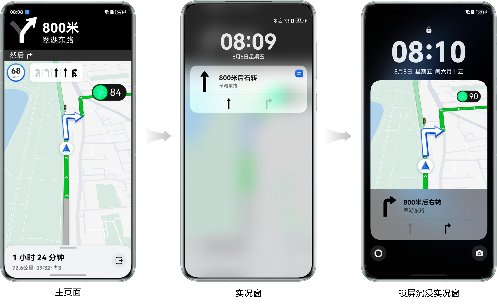
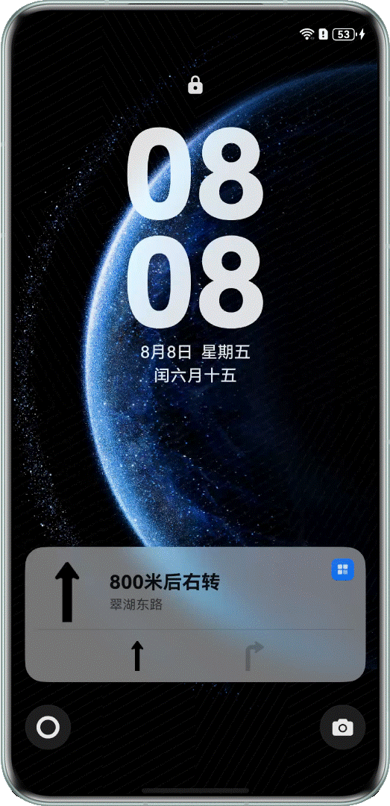
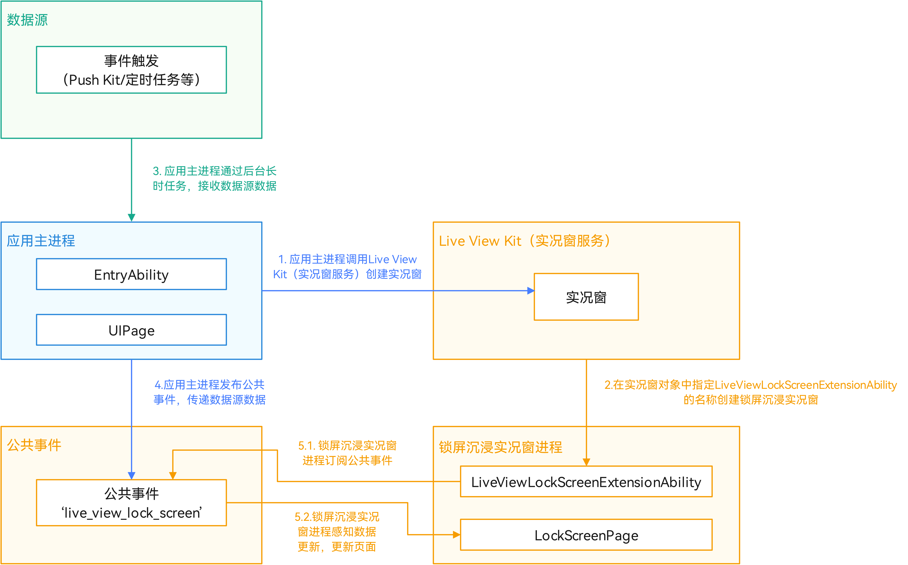
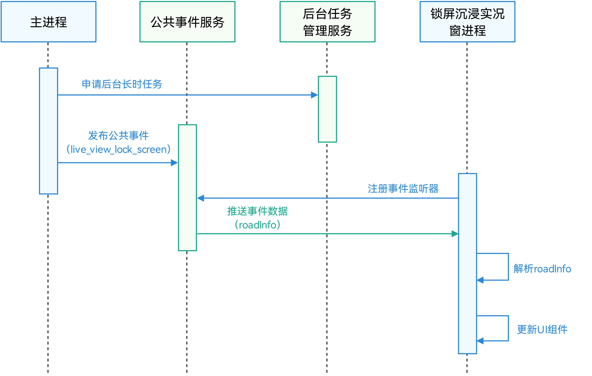
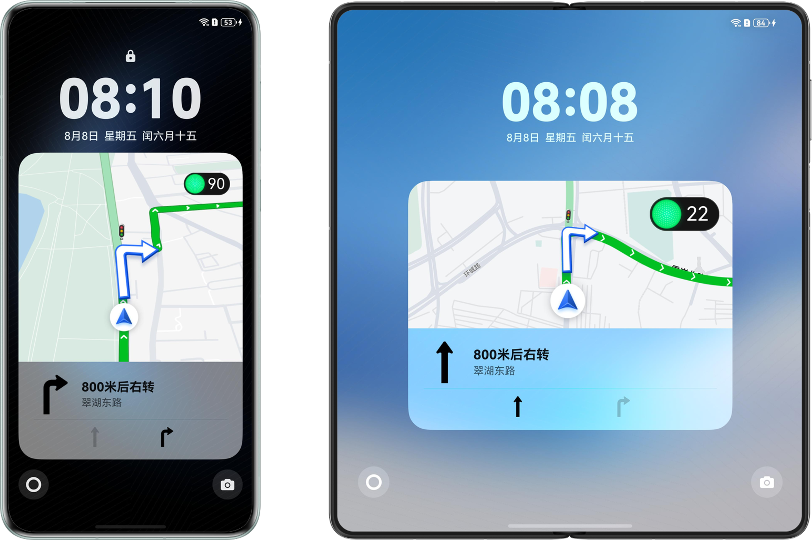

# 锁屏沉浸实况窗

更新时间：2026-03-12 08:45:02

来源：https://developer.huawei.com/consumer/cn/doc/best-practices/bpta-lock-screen-immersive-live-window

## 概述


在实际应用开发中，实时信息的高效呈现始终是提升用户体验的关键。实况窗作为高效的交互组件，有助于用户聚焦并迅速查看、处理任务，具备时段性、时效性、变化性的特征。锁屏沉浸实况窗能够详细展示应用的实时活动状态，将重要信息呈现在锁屏界面上，使用户一目了然，无需解锁屏幕进入应用即可获取最新的活动状态，尤其适合于实时性要求高，需要用户及时了解状态的场景，如动态显示网约车位置的出行打车场景、实时更新外卖进度的即时配送场景、以及在锁屏界面呈现电子登机牌的航班场景等。通过Live View Kit（实况窗服务）协助开发者快速集成实况窗功能，能轻松实现锁屏沉浸式的展示效果。

图1 用户获取实时信息界面





当用户退出主界面操作后，可通过下拉通知栏或点击胶囊态实况窗快速获取导航概要；当设备进入锁屏状态时，将进一步展示沉浸式锁屏实况窗界面。这种设计可实现实时获取当前信息，既保证了核心业务流的持续可视化，又实现了用户注意力资源的智能分配。

本文将以车道级导航锁屏沉浸实况窗开发实践为例，介绍锁屏沉浸实况窗的实现原理、开发流程，以及开发过程中常见的问题。


### 开发准备


图2 在锁屏页面点击实况窗打开锁屏沉浸实况窗





锁屏沉浸实况窗的创建依赖于实况窗功能，用户需要点击实况窗展开完整锁屏沉浸实况窗卡片。因此创建锁屏沉浸实况窗的应用需要申请实况窗权限和锁屏沉浸实况窗权限，详情请参考Live View Kit（实况窗服务）开发准备。


### 锁屏沉浸实况窗体验


锁屏沉浸实况窗的核心功能在于实时展示关键信息和动态数据。通过高效实时更新机制，确保界面内容与最新状态即时同步，使用户能够随时获取最新资讯。这一功能不仅帮助用户高效掌握重要信息，还提升了应用的可信度和用户体验。在典型应用场景中，车道级导航可以即时更新车辆所在车道和导航信息，音乐应用则可通过更新歌曲信息和封面来提供当前播放的歌曲详情。

图3 车道级导航锁屏沉浸实况窗


由于锁屏状态的特殊性，锁屏沉浸实况窗通常为被动更新，因此需要有合理的更新策略。以车道级导航为例，当用户的车辆所在车道发生变化时，应更新车道信息，并定期更新导航信息，以保持锁屏沉浸实况窗内容的新鲜感和实时性，确保用户能够持续获取信息并合理分配注意力资源。


## 实现原理


图4 锁屏沉浸实况窗架构图





锁屏沉浸实况窗的创建和更新依赖于Live View Kit（实况窗服务），具体流程如下：

1. 应用主进程创建实况窗：应用主进程通过调用[Live View Kit（实况窗服务）](https://developer.huawei.com/consumer/cn/doc/harmonyos-guides/live-view-kit-guide)创建实况窗。
2. 关联实况窗和锁屏沉浸实况窗：在创建实况窗时，需在参数中传入[LiveViewLockScreenExtensionAbility](https://developer.huawei.com/consumer/cn/doc/harmonyos-references/liveview-lock-screen-ability)名称，以便将实况窗与锁屏沉浸实况窗关联。此步骤需调用[Live View Kit（实况窗服务）](https://developer.huawei.com/consumer/cn/doc/harmonyos-guides/live-view-kit-guide)中的liveViewManager模块实现，具体实现方法请参阅[开发实况窗场景](https://developer.huawei.com/consumer/cn/doc/harmonyos-guides/liveview-scenes)。
3. 应用主进程接收数据：应用主进程通过后台长时任务接收来自数据源的数据。
4. 应用主进程发布公共事件传递数据源数据。
5. 锁屏沉浸实况窗更新页面：锁屏沉浸实况窗订阅相应的公共事件，接收数据源的数据；
6. 锁屏沉浸实况窗检测到数据更新后，进行页面的更新。


## 锁屏沉浸实况窗创建


### 场景描述


通过LiveView对象与LiveViewLockScreenExtensionAbility关联，并通过回调创建锁屏沉浸实况窗，以实现锁屏沉浸实况窗的展示。


### 开发步骤


在创建实况窗时，需在LiveView对象中指定LiveViewLockScreenExtensionAbility的名称，以便系统能够正确关联并渲染锁屏沉浸式实况窗。

1. 将[LiveViewLockScreenExtensionAbility](https://developer.huawei.com/consumer/cn/doc/harmonyos-references/liveview-lock-screen-ability)的名称写入创建实况窗时创建的liveView对象中。
```ts
import { liveViewManager } from '@kit.LiveViewKit';
// ...
// Construct live window request body.
let liveView: liveViewManager.LiveView = {
  id: 0,
  sequence: this.sequence,
  // Application scenarios of the live window. NAVIGATION: Navigation.
  event: 'NAVIGATION',
  liveViewData: {
    // Live view capsule related parameters
    capsule: {
      type: liveViewManager.CapsuleType.CAPSULE_TYPE_TEXT,
      status: 1,
      icon: 'turn_right_light_square.png',
      backgroundColor: this.getStringSync(
        $r('app.string.live_view_background').id,
      ),
      title: this.getStringSync($r('app.string.live_view_title').id),
    },
    // Live view card related parameters
    primary: {
      title: this.getStringSync($r('app.string.live_view_title').id),
      content: [
        { text: this.getStringSync($r('app.string.live_view_content').id) },
      ],
      // Add LiveViewLockScreenExtensionAbility name to build lock screen live view
      liveViewLockScreenAbilityName: 'LiveViewExtAbility',
      liveViewLockScreenAbilityParameters: { liveViewParameters: '' },
      keepTime: 0,
      clickAction: await LiveViewUtil.buildWantAgent(),
    },
  },
};
```
2. 在应用module.json5中配置[LiveViewLockScreenExtensionAbility](https://developer.huawei.com/consumer/cn/doc/harmonyos-references/liveview-lock-screen-ability)的名称。
```ts
"extensionAbilities": [
{
  // Keep it consistent with LiveViewLockScreenExtensionAbility name in live view instance
  "name": "LiveViewExtAbility",
  "type": "liveViewLockScreen",
  // LiveViewLockScreenExtensionAbility location
  "srcEntry": "./ets/liveview/LiveViewExtAbility.ets",
  "exported": false
}
],
```
3. 在[LiveViewLockScreenExtensionAbility](https://developer.huawei.com/consumer/cn/doc/harmonyos-references/liveview-lock-screen-ability)的onSessionCreate()方法中完成锁屏沉浸实况窗页面的创建。
```ts
// Core logic when creating UI session.
onSessionCreate(_want: Want, session: UIExtensionContentSession): void {
  // ...
  try {
    session.loadContent('liveview/LockScreenPage');
  } catch (error) {
    const err: BusinessError = error as BusinessError;
    hilog.error(0x0000, TAG, `Session load content failed. code: ${err.code}, message: ${err.message}`);
  }
}
```


## 锁屏沉浸实况窗实时更新


### 场景描述


在通过LiveViewLockScreenExtensionAbility生命周期回调创建锁屏沉浸实况窗后，为了满足用户及时获取信息更新的需求，该实况窗需要实时更新。本章节将介绍如何实现锁屏沉浸实况窗的数据实时更新。

图5 锁屏沉浸实况窗实时更新


### 开发步骤


沉浸式实况窗进程与应用主进程之间的数据通信需根据不同场景兼顾实时性和初始化需求。以下是不同场景下的推荐方案：

1. 公共事件方案（适用于多数场景）：通过注册公共事件和监听公共事件的方式，实现锁屏沉浸实况窗进程与应用主进程间的数据通信。
- 优点：实现简单，支持跨进程广播通信。
- 缺点：无法获取初始数据。
2. liveViewLockScreenAbilityParameters参数方案（适用于有初始化需求的场景）：将数据携带在liveview对象的liveViewLockScreenAbilityParameters中，锁屏沉浸实况窗启动时可通过want直接获取。
- 优点：启动时可立即获取初始数据。
- 缺点：数据不可更新，更新需重启锁屏沉浸实况窗，可能导致闪屏。
3. 文件共享方案（适用于大数据传输场景，谨慎使用）：应用主进程将数据保存至沙箱文件中，在沉浸实况进程中监听文件内容变动以获取数据。
- 优点：适合大数据量传输，可持久化存储。
- 缺点：读写文件效率较低，锁屏沉浸实况窗进程无法直接获取沙箱路径，需由应用主进程通过其他方式传入沙箱路径。


综合考虑实现复杂度、性能表现和业务需求，在对初始数据无特殊要求的场景下，推荐开发者采用公共事件方案。该方案在实现难度和功能完整性之间取得了平衡，能够满足大多数场景下的通信需求。

如果开发者对锁屏沉浸实况窗的初始数据有特殊要求，可以结合使用liveViewLockScreenAbilityParameters参数方案和公共事件方案：使用liveViewLockScreenAbilityParameters参数传入初始数据，通过注册和监听公共事件的方式进行后续数据更新。下文将以公共事件方案为例，介绍如何实现锁屏沉浸式实况窗的实时更新。

图6 锁屏沉浸实况窗实时更新时序图





1. 申请后台长时任务，确保在后台能够发布公共事件以传递更新数据。
- 在申请后台长时任务之前，需确认应用已在module.json5中声明后台运行权限。
```ts
"requestPermissions": [
{
  "name": "ohos.permission.KEEP_BACKGROUND_RUNNING",
  "reason": "$string:reason_background",
  "usedScene": {
    "abilities": [
    "EntryAbility"
    ],
    "when": "always"
  }
},
],
```
- 应用创建长时任务，并声明长时任务类型。
```ts
import { backgroundTaskManager } from '@kit.BackgroundTasksKit';
// ...
// Internal method to manage background tasks
private startContinuousRunningTask() {
  // Configure WantAgent for background operation
  let wantAgentInfo: wantAgent.WantAgentInfo = {
    wants: [
    {
      bundleName: 'com.example.mapliveviewsample',
      abilityName: 'EntryAbility'
    }
    ],
    actionType: wantAgent.OperationType.START_ABILITY,
    requestCode: 0,
    actionFlags: [wantAgent.WantAgentFlags.UPDATE_PRESENT_FLAG]
  };

  try {
    // Acquire WantAgent for background operations
    wantAgent.getWantAgent(wantAgentInfo).then((wantAgentObj: WantAgent) => {
      try {
        hilog.info(0x0000, TAG, '%{public}s', 'Operation startBackgroundRunning begin.');
        // Required background resource types
        const list: string[] = ['location'];
        // Request background running permission
        if (canIUse('SystemCapability.ResourceSchedule.BackgroundTaskManager.ContinuousTask')) {
          backgroundTaskManager.startBackgroundRunning(this.context, list, wantAgentObj).then(() => {
            hilog.info(0x0000, TAG, '%{public}s', 'Operation startBackgroundRunning succeeded.');
          }).catch((error: BusinessError) => {
            hilog.error(0x0000, TAG, '%{public}s',
            `Failed to Operation startBackgroundRunning. code is ${error.code} message is ${error.message}`);
          });
        }
      } catch (error) {
        hilog.error(0x0000, TAG, '%{public}s',
        `Failed to Operation startBackgroundRunning. code is ${(error as BusinessError).code} message is ${(error as BusinessError).message}`);
      }
    });
  } catch (error) {
    hilog.error(0x0000, TAG, '%{public}s',
    `Failed to Operation getWantAgent. code is ${(error as BusinessError).code} message is ${(error as BusinessError).message}`);
  }
}
```
2. 发布公共事件传递更新数据到锁屏沉浸实况窗。应用在主页面中通过[commonEventManager.publish()](https://developer.huawei.com/consumer/cn/doc/harmonyos-references/js-apis-commoneventmanager#commoneventmanagerpublish)接口发布公共事件'live_view_lock_screen'，并在[CommonEventPublishData](https://developer.huawei.com/consumer/cn/doc/harmonyos-references/js-apis-inner-commonevent-commoneventpublishdata)的parameters属性中附带锁屏沉浸实况窗的创建和更新数据。
```ts
import { BusinessError, commonEventManager } from '@kit.BasicServicesKit';
// ...
// Prepare common event data
let options: commonEventManager.CommonEventPublishData = {
  data: 'data',
  bundleName: 'com.example.mapliveviewsample',
  parameters: {
    laneData: routeData.laneData,
  },
};
// Publish system event for lock screen updates
commonEventManager.publish(
  'live_view_lock_screen',
  options,
  (error: BusinessError) => {
    if (error) {
      hilog.error(
        0x0000,
        TAG,
        '%{public}s',
        `Failed to publish commonEvent. code is ${error.code} message is ${error.message}`,
      );
    } else {
      hilog.info(
        0x0000,
        TAG,
        '%{public}s',
        'Succeeded in publishing commonEvent.',
      );
    }
  },
);
```
3. 订阅公共事件更新锁屏沉浸实况窗。锁屏沉浸实况窗进程在[LiveViewLockScreenExtensionAbility](https://developer.huawei.com/consumer/cn/doc/harmonyos-references/liveview-lock-screen-ability)中，使用[commonEventManager.createSubscriber()](https://developer.huawei.com/consumer/cn/doc/harmonyos-references/js-apis-commoneventmanager#commoneventmanagercreatesubscriber)接口创建主页面创建的公共事件'live_view_lock_screen'的订阅者，通过[AppStorage（应用全局的UI状态存储）](https://developer.huawei.com/consumer/cn/doc/harmonyos-guides/arkts-appstorage)将主页面传递的数据传入LockScreenPage.ets，以实现锁屏沉浸实况窗的创建和更新。
```ts
import { BusinessError, commonEventManager } from '@kit.BasicServicesKit';
// ...

// Initialize event subscription.
let subscribeInfo: commonEventManager.CommonEventSubscribeInfo = {
  events: ['live_view_lock_screen'],
  publisherBundleName: 'com.example.mapliveviewsample',
  priority: 0,
};
commonEventManager.createSubscriber(
  subscribeInfo,
  (error: BusinessError, data: commonEventManager.CommonEventSubscriber) => {
    if (error) {
      hilog.error(
        0x0000,
        TAG,
        '%{public}s',
        `Failed to create subscriber. code is ${error.code} message is ${error.message}.`,
      );
      return;
    }
    this.subscriber = data;
    hilog.info(0x0000, TAG, '%{public}s', 'Succeeded in creating subscriber.');
    // Event handling logic.
    commonEventManager.subscribe(
      this.subscriber,
      async (
        error: BusinessError,
        data: commonEventManager.CommonEventData,
      ) => {
        if (error) {
          hilog.error(
            0x0000,
            TAG,
            '%{public}s',
            `Failed to subscribe commonEvent. code is ${error.code} message is ${error.message}.`,
          );
          return;
        }
        hilog.info(
          0x0000,
          TAG,
          '%{public}s',
          'Succeeded in subscribe commonEvent success.',
        );
        if (data.parameters) {
          let laneData = data.parameters['laneData'] as LaneData;
          AppStorage.setOrCreate('laneData', laneData);
          hilog.info(
            0x0000,
            TAG,
            '%{public}s',
            'Succeeded in receive commonEvent.',
          );
        }
      },
    );
  },
);
```


## 锁屏沉浸实况窗结束


### 场景描述


当用户实时获取信息的需求结束时，应用应及时关闭实况窗及锁屏沉浸实况窗，以优化设备性能和电池续航，避免不必要功耗问题。


### 开发步骤


为确保结束锁屏沉浸实况窗时可以完整释放系统资源，结束流程需按以下顺序执行：

1. 停止数据源接收：关闭数据输入通道，停止数据采集。本开发实践为结束定时器任务，停止更新车道数据。
```ts
// Clear periodic updates
if (this.updateInterval !== undefined) {
  clearInterval(this.updateInterval);
  this.updateInterval = undefined;
  hilog.info(0x0000, TAG, 'Timer has been cleared');
}
```
2. 结束界面更新：停止实况窗和沉浸实况窗的内容更新与展示。
```ts
// Close live view.
public async closeLiveView() {
  // Ensure that the sequence is greater than the current live window page.
  this.sequence++;
  this.defaultLiveView = await this.createPrimaryLiveView();
  await liveViewManager.stopLiveView(this.defaultLiveView).then(() => {
    this.sequence = 0;
    this.defaultLiveView = undefined;
    hilog.info(0x0000, TAG, '%{public}s', 'Succeeded in stopping liveView, result: %{public}');
  }).catch((error: BusinessError) => {
    hilog.error(0x0000, TAG, '%{public}s',
    `Failed to stop liveView. Cause code: ${error.code}, message: ${error.message}`);
  });
  return;
}
```
3. 清理后台任务：结束关联的后台长时运行任务。
```ts
// Stop background tasks
try {
  if (
    canIUse(
      'SystemCapability.ResourceSchedule.BackgroundTaskManager.ContinuousTask',
    )
  ) {
    backgroundTaskManager
      .stopBackgroundRunning(this.context)
      .then(() => {
        hilog.info(
          0x0000,
          TAG,
          '%{public}s',
          'Operation stopBackgroundRunning succeeded',
        );
      })
      .catch((error: BusinessError) => {
        hilog.error(
          0x0000,
          TAG,
          '%{public}s',
          `Operation stopBackgroundRunning failed. code is ${error.code} message is ${error.message}`,
        );
      });
  }
} catch (error) {
  hilog.error(
    0x0000,
    TAG,
    '%{public}s',
    `Operation stopBackgroundRunning failed. code is ${(error as BusinessError).code} message is ${(error as BusinessError).message}`,
  );
}
```


## 锁屏沉浸实况窗多设备适配


### 场景描述


图7 手机折叠态和展开态锁屏沉浸实况窗对比图





为了适配不同尺寸的实况卡片和多样化的设备形态，沉浸式实况展示应采用自适应的多断点布局方案，以确保在各种产品上能够实现自适应布局。可以参考断点。

锁屏沉浸实况窗在不同设备形态上的布局存在差异，主要体现在手机折叠态与展开态两种显示模式中。在手机展开状态下，锁屏沉浸实况窗的高宽比会减少，页面变得更宽。然而，无论是在哪种形态下，横断点都属于sm断点（断点的定义），因此需要使用基于高宽比的纵断点进行区分，以实现多适配。


### 开发步骤


1. 在[LiveViewLockScreenExtensionAbility](https://developer.huawei.com/consumer/cn/doc/harmonyos-references/liveview-lock-screen-ability)中注册页面布局变化的监听器。
```ts
import {
  AbilityConstant,
  UIExtensionContentSession,
  Want,
} from '@kit.AbilityKit';
import { display, window } from '@kit.ArkUI';
// ...
try {
  // Window size listener.
  const extensionWindow = session.getUIExtensionWindowProxy();
  extensionWindow.on('windowSizeChange', (windowSize: window.Size) => {
    this.updateBreakPoint(windowSize);
  });
} catch (error) {
  const err: BusinessError = error as BusinessError;
  hilog.error(
    0x0000,
    TAG,
    `Session update break point failed. code: ${err.code}, message: ${err.message}`,
  );
}
```
2. 当检测到锁屏沉浸实况窗布局发生变化时，触发纵向断点的重新计算。
```ts
import { display, window } from '@kit.ArkUI';
// ...
// Distinguish page layout using vertical breakpoints.
private updateBreakPoint(windowSize: window.Size): void {
  try {
    let windowWidthVp: number = windowSize.width / display.getDefaultDisplaySync().densityPixels;
    let windowHeightVp: number = windowSize.height / display.getDefaultDisplaySync().densityPixels;
    let windowRatio: number = windowWidthVp / windowHeightVp;
    let verticalBreakpoint: string = Constants.BREAK_POINT_SM;
    // Vertical breakpoints are distinguished by aspect ratio.
    if (windowRatio < 0.8) {
      verticalBreakpoint = Constants.BREAK_POINT_SM;
    } else if (windowRatio > 1.2) {
      verticalBreakpoint = Constants.BREAK_POINT_LG;
    } else {
      verticalBreakpoint = Constants.BREAK_POINT_MD;
    }
    if (this.verticalBreakpoint !== verticalBreakpoint) {
      this.verticalBreakpoint = verticalBreakpoint;
      AppStorage.setOrCreate('verticalBreakpoint', this.verticalBreakpoint);
    }
    hilog.info(0x0000, TAG, `updateBreakpoint ${verticalBreakpoint}`);
  } catch (error) {
    hilog.error(0x0000, TAG, `updateBreakpoint catch err:`, (error as BusinessError).message);
  }
}
```
3. 在 LockScreenPage中采用纵向断点监听机制，根据窗口大小动态切换布局样式。
```ts
@StorageLink('verticalBreakpoint') verticalBreakpoint: string = Constants.BREAK_POINT_SM;
@StorageProp('laneData') laneData: LaneData | undefined = undefined;

build() {
  Stack({ alignContent: Alignment.Top }) {
    Image(this.verticalBreakpoint === Constants.BREAK_POINT_MD ? $r('app.media.ic_lock') : $r('app.media.ic_lock_md'))
    .width('100%')
    .height('100%')

    Row() {
      Stack() {
        Image($r('app.media.ic_light'))
        .width(this.verticalBreakpoint === Constants.BREAK_POINT_MD ? 73.5 : 106)
        .height(this.verticalBreakpoint === Constants.BREAK_POINT_MD ? 36 : 52)
        Text(JSON.stringify(this.laneData?.lightTime ?? 90))
        .fontColor($r('sys.color.white'))
        .fontSize(this.verticalBreakpoint === Constants.BREAK_POINT_MD ? 24 : 30)
        .margin({ right: this.verticalBreakpoint === Constants.BREAK_POINT_MD ? 8 : 16 })
      }
      .alignContent(Alignment.End)
    }
    .width(this.verticalBreakpoint === Constants.BREAK_POINT_MD ? 73.5 : 106)
    .height(this.verticalBreakpoint === Constants.BREAK_POINT_MD ? 36 : 52)
    .position({
      // Layout based on vertical breakpoint.
      right: 20,
      top: this.verticalBreakpoint === Constants.BREAK_POINT_MD ? 32 : 25
    })
  }
  .width('100%')
  .height('100%')
  .alignContent(Alignment.Center)
}
```


## 常见问题


### 应用接入锁屏沉浸实况窗后存在功耗上升现象


当应用接入锁屏沉浸实况窗后，因需实时更新锁屏沉浸实况窗页面，可能会导致功耗上升。其优化策略是采用智能后台更新机制，仅在应用进入后台时触发实况窗的刷新及数据同步。可使用appManager.getRunningProcessInformation()接口来获取当前应用运行进程的相关信息，并通过返回的ProcessInformation模块中的state来判断当前进程的运行状态。

```ts
// Set up periodic state checking
this.updateInterval = setInterval(() => {
  // Monitor application state changes
  appManager
    .getRunningProcessInformation()
    .then((data: Array<appManager.ProcessInformation>) => {
      hilog.info(
        0x0000,
        TAG,
        '%{public}s',
        'Success to getRunningProcessInformation',
      );
      // Handle background state
      if (data[0].state === appManager.ProcessState.STATE_BACKGROUND) {
        // ...
      }
    })
    .catch((error: BusinessError) => {
      hilog.error(
        0x0000,
        TAG,
        '%{public}s',
        `Failed to getRunningProcessInformation. code is ${error.code} message is ${error.message}`,
      );
    });
}, 1000);
```


## 示例代码


- [实现锁屏沉浸实况窗](https://gitcode.com/harmonyos_samples/LiveViewLockScreen)
