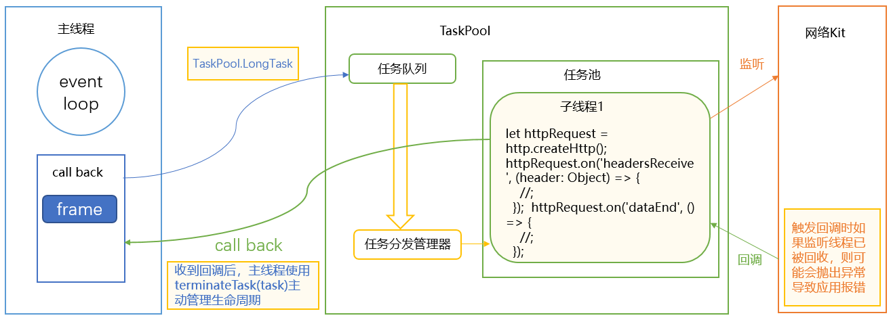
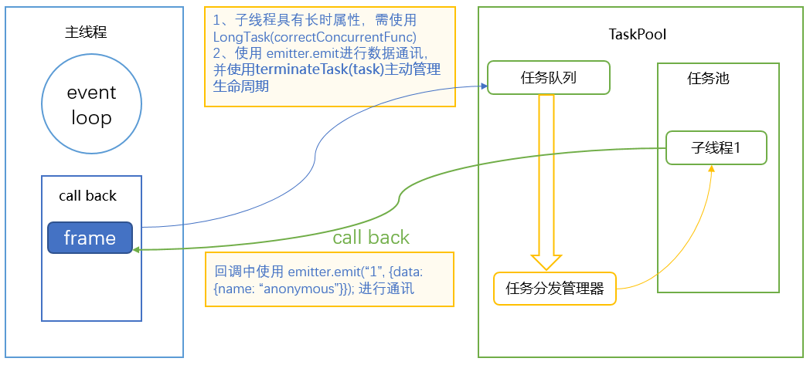

# TaskPool使用规范

更新时间：2026-05-22 09:46:30

来源：https://developer.huawei.com/consumer/cn/doc/best-practices/bpta-taskpool_usage_specifications_and_faqs

#### 概述
[任务池（TaskPool）](https://developer.huawei.com/consumer/cn/doc/harmonyos-guides/taskpool-introduction)基于池化思想和任务机制，提供了一系列并发API，旨在充分发挥多核CPU的优势，降低主线程负载，提高程序性能。使用TaskPool进行开发需遵守一些规范，并综合业务和并发特性，细分场景使用。违反这些规范可能会导致性能劣化，引起稳定性或者其他非预期的问题。
本文就TaskPool错误使用导致的一些诸如应用报错、业务异常、资源消耗过大等问题进行了分析，并总结出了一些使用规范，以帮助开发者更好的使用TaskPool进行应用开发。

#### TaskPool使用规范
#### 根据业务场景合理划分项目结构，避免在子线程中直接或间接引入UI
**场景描述**
在工程中导入文件和HAR时，某些文件使用了如@Observed、AppStorage等UI装饰器或状态变量，这些UI装饰器或状态变量即使没有被显式调用也可能会被解析执行。然而目前子线程并不支持UI属性，当解析到这些UI装饰器或状态变量时，会抛出异常并返回，导致本模块的解析会被中断。访问这些包含UI的文件中的某些变量时可能会抛出错误：xxx is not initialized ，导致功能失效甚至crash。如下图所示：


另外在一些复杂项目中，即使本模块未发生改动，也可能由于SDK或其他依赖模块发生变更而导致该问题。此类问题排查起来较为困难，因此推荐在开发和迭代阶段就做好相应的约束和验证。
**反例**
实现Foo和Bar类。

```ArkTS
// a.ets
import { hilog } from '@kit.PerformanceAnalysisKit';
@Observed
class Foo {
  constructor() {
    hilog.info(0xFF00, "sampleTag", "this is class Foo");
  }
}

export class Bar {
  constructor() {
    hilog.info(0xFF00, "sampleTag", "this is class Bar");
  }
}
```

在Sample1.ets中import需要使用的类和方法。

```ArkTS
// Sample1.ets
import { Bar } from './wrong/a';
import { BusinessError } from '@ohos.base';
import { taskpool } from '@kit.ArkTS';
import { Foo } from './correct/b';
import { hilog } from '@kit.PerformanceAnalysisKit';
```

实现@Concurrent方法。

```ArkTS
// Sample1.ets
@Concurrent
function wrongConcurrentFunc() {
  try {
    let bar: Bar = new Bar;
  } catch (e) {
    let error: BusinessError = e;
    hilog.error(0xFF00, 'sampleTag', 'error occur: ' + error.message);
  }
}
```

在组件的onClick()方法中使用taskpool.execute()调用wrongConcurrentFunc()。

```ArkTS
// Sample1.ets
taskpool.execute(wrongConcurrentFunc)
  .then(() => {
    hilog.info(0x000, 'testTag', 'execute success');
  })
  .catch((err: BusinessError) => {
    hilog.error(0x000, 'testTag', `execute failed, code=${err.code}, message=${err.message}`);
  })
```

本例中，在a.ets中声明了2个class（Foo和Bar），其中class Foo被@Observed修饰。当在子线程中尝试new Bar时，解析执行到@Observed会抛出异常，并不会继续执行class Bar的逻辑，导致Bar属于未定义变量，访问时会抛出异常: Bar is not initialized。
**正例**
实现@Observed装饰器装饰的类Bar。

```ArkTS
// a.ets
@Observed
export class Bar {
  id: number = 0;
  name: string = "Bar";
}
```

实现一个普通的类Foo。

```ArkTS
// b.ets
export class Foo {
  id: number = 0;
}
```

在correctConcurrentFunc()方法中创建Foo对象。

```ArkTS
// Sample1.ets
@Concurrent
function correctConcurrentFunc() {
  let foo: Foo = new Foo;
}
```

在组件的onClick()方法中使用taskpool.execute()调用correctConcurrentFunc()。

```ArkTS
// Sample1.ets
taskpool.execute(correctConcurrentFunc)
  .then(() => {
    hilog.info(0x000, 'testTag', 'execute success');
  })
  .catch((err: BusinessError) => {
    hilog.error(0x000, 'testTag', `execute failed, code=${err.code}, message=${err.message}`);
  })
```

将原先涉及UI的class（此处为Bar）剥离到单独的文件中，子线程再去导入不涉及UI的class（此处为Foo），这样就能确保应用正确运行。这样划分结构有利于提高程序正确性、执行效率和可维护性。

#### 在长时任务中注册监听事件，避免在非长时任务中使用带有监听性质的接口
**场景描述**
通常监听接口具有长时属性，当在子线程注册监听接口并执行回调事件时，即使当该任务执行返回后，监听接口仍然会生效，并且触发时间不确定。由于TaskPool使能了负载均衡机制，对于非长时任务，会在任务执行完成后尝试回收空闲线程。
如果注册了监听接口的子线程已经被释放，而此时其他线程又向该子线程发送事件则会导致功能异常或者未定义行为，比如crash。
因此，当开发者有监听需求时，推荐使用长时任务，主动管理任务所在线程的生命周期。


**反例**
在concurrentFunc()方法中调用httpRequest中的监听方法，监听网络请求结果。

```ArkTS
// Sample2.ets
import { http } from '@kit.NetworkKit';
import { taskpool } from '@kit.ArkTS';
import { hilog } from '@kit.PerformanceAnalysisKit';
import { BusinessError } from '@kit.BasicServicesKit';

@Concurrent
function concurrentFunc() {
  let httpRequest = http.createHttp();
  httpRequest.on('headersReceive', (header: Object) => {
    hilog.info(0xFF00, 'sampleTag', 'header: ' + JSON.stringify(header));
  });

  httpRequest.on('dataEnd', () => {
    hilog.info(0xFF00, 'sampleTag', 'No more data in response, data receive end');
  });
}
```

在组件的onClick()方法中使用taskpool.execute()调用concurrentFunc()。

```ArkTS
// Sample2.ets
taskpool.execute(concurrentFunc)
  .then(() => {
    hilog.info(0x000, 'testTag', 'execute success');
  })
  .catch((err: BusinessError) => {
    hilog.error(0x000, 'testTag', `execute failed, code=${err.code}, message=${err.message}`);
  })
```

如在上述反例中，在concurrentFunc()中使用了http API，其中on()接口监听headersReceive事件，当相关事件到来时调用回调。从concurrentFunc()的角度来说，注册完on()接口，该任务的逻辑也就完成和返回了。回调如果不调用，执行该任务的线程就一直处于空闲状态。一段时间后，该线程可能会被释放，如果此时headersReceive事件再次到来，就会引起非预期行为。
**正例**
在concurrentFunc()方法中调用httpRequest中的监听方法，监听网络请求结果。

```ArkTS
// Sample2.ets
import { http } from '@kit.NetworkKit';
import { taskpool } from '@kit.ArkTS';
import { hilog } from '@kit.PerformanceAnalysisKit';
import { BusinessError } from '@kit.BasicServicesKit';

@Concurrent
function concurrentFunc() {
  let httpRequest = http.createHttp();
  httpRequest.on('headersReceive', (header: Object) => {
    hilog.info(0xFF00, 'sampleTag', 'header: ' + JSON.stringify(header));
  });

  httpRequest.on('dataEnd', () => {
    hilog.info(0xFF00, 'sampleTag', 'No more data in response, data receive end');
  });
}
```

在组件的onClick()方法中使用taskpool.execute()执行concurrentFunc()方法，并在成功拿到回调结果后中断task。

```ArkTS
// Sample2.ets
let task: taskpool.LongTask = new taskpool.LongTask(concurrentFunc);
taskpool.execute(task)
  .then(() => {
    hilog.info(0xFF00, 'sampleTag', 'receive http msg success.');
    taskpool.terminateTask(task);
  })
  .catch((err: BusinessError) => {
    hilog.error(0x000, 'testTag', `execute failed, code=${err.code}, message=${err.message}`);
  })
```

需要根据业务诉求合理选择任务类型。像http类的监听性质的接口适合使用长时任务，同时主动管理任务所在线程的生命周期，在具体逻辑执行完成后调用terminateTask()接口(通常在拿到结果时调用，即await之后或then逻辑里)，释放资源，避免造成执行长时任务的线程长时间不释放。

#### 使用emitter和LongTask()的组合实现回调场景的通信诉求，避免在回调函数中使用sendData()
**场景描述**
TaskPool提供了支持TaskPool子线程和宿主线程通信的接口[sendData()](https://developer.huawei.com/consumer/cn/doc/harmonyos-references/js-apis-taskpool#senddata11)。作为TaskPool提供的接口，[sendData()](https://developer.huawei.com/consumer/cn/doc/harmonyos-references/js-apis-taskpool#senddata11)能够安全的将子线程的数据传输到宿主线程。
然而[sendData()](https://developer.huawei.com/consumer/cn/doc/harmonyos-references/js-apis-taskpool#senddata11)接口依赖于Task，生命周期同Task一致。考虑到微任务和异步事件的特性，回调函数可能在TaskPool任务结果返回后才会被处理：此时Task可能已经被销毁，如果再去调用依赖Task的接口[sendData()](https://developer.huawei.com/consumer/cn/doc/harmonyos-references/js-apis-taskpool#senddata11)是不合理和不安全的。TaskPool在这种情况下会抛出异常，如果这种异常是在任务返回后调用抛出的，还将被遗留在线程中不被处理，因此需避免在回调函数中使用[sendData()](https://developer.huawei.com/consumer/cn/doc/harmonyos-references/js-apis-taskpool#senddata11)。
如果有需要，推荐使用emitter，emitter能够方便地实现宿主线程和子线程之间的双向通信。另外emitter的on()接口具有监听性质，在没有取消注册的情况下，能在任意时间被触发，因此需要在LongTask()中注册。


**反例**
实现一个@Concurrent方法，并在其中通过promise异步调用taskpool中的sendData()方法。

```ArkTS
// Sample3.ets
@Concurrent
function wrongConcurrentFunc() {
  let promise = Promise.resolve();
  promise.then(() => {
    try {
      taskpool.Task.sendData();
    } catch (error) {
      let err = error as BusinessError;
      hilog.warn(0x000, 'testTag', `sendData failed, code=${err.code}, message=${err.message}`);
    }
  })
}
```

创建一个Task，通过onReceiveData()方法接收taskpool通过sendData()方法发送的数据。

```ArkTS
// Sample3.ets
let task: taskpool.Task = new taskpool.Task(wrongConcurrentFunc);
task.onReceiveData(() => {
  hilog.info(0xFF00, 'sampleTag', "onReceiveData has been called");
})
taskpool.execute(task)
  .then(() => {
    hilog.info(0xFF00, 'sampleTag', 'receive http msg success.');
    taskpool.terminateTask(task);
  })
  .catch((err: BusinessError) => {
    hilog.error(0x000, 'testTag', `execute failed, code=${err.code}, message=${err.message}`);
  })
```

在上述反例中，使用了异步接口，并在then中使用了sendData()。从执行流来看，wrongConcurrentFunc()会先调用Promise.resolve()生成并返回一个promise。此时，并没有其他可执行逻辑，因此会直接返回，即出了wrongConcurrentFunc()的作用域。之后在执行微任务队列时，then中的回调逻辑会被执行，且不在wrongConcurrentFunc()的作用域中执行，因此会抛出异常：sendData is not called in the concurrent function。
**正例**
实现一个@Concurrent方法，并在其中通过emitter()方法发送数据。

```ArkTS
// Sample3.ets
@Concurrent
function correctConcurrentFunc() {
  let promise = Promise.resolve();
  promise.then(() => {
    emitter.emit("1", { data: { name: "anonymous" } });
  })
}
```

创建一个LongTask，并在emitter()接收到数据后中断该task。

```ArkTS
// Sample3.ets
let task: taskpool.LongTask = new taskpool.LongTask(correctConcurrentFunc);
emitter.on("1", (data: emitter.EventData) => {
  hilog.info(0xff00, 'sampleTag', "name is : " + data.data?.name);
  emitter.off("1")
  taskpool.terminateTask(task)
})
taskpool.execute(task)
  .then(() => {
    hilog.info(0xFF00, 'sampleTag', 'receive http msg success.');
    taskpool.terminateTask(task);
  })
  .catch((err: BusinessError) => {
    hilog.error(0x000, 'testTag', `execute failed, code=${err.code}, message=${err.message}`);
  })
```

正例中仍使用了Promise then的用法，区别于反例，在then的逻辑里使用了emitter()来代替sendData()接口。同时将correctConcurrentFunc()这个任务声明为LongTask()，并使用terminateTask()手动管理生命周期，在实现功能的同时也能够保证程序的正确性。

#### 根据业务场景和性能数据控制并发度
**场景描述**
使用TaskPool存在一定执行成本，对于耗时长的任务（同步或者异步回调阶段耗时）可以抛到TaskPool中去执行，而耗时十分短的任务则可以直接放在主线程执行。
同时合理划分业务粒度，对于一组相关联的任务，可以使用任务组TaskGroup。等待所有子任务都处理完再继续向下处理，从而保证业务代码整体性和可维护性。对于某些不紧急的查询任务，则可以将这些任务收集起来，在一些较为空闲的时间段再抛到任务池中执行。
在合适的场景下也可以使用[SequenceRunner](https://developer.huawei.com/consumer/cn/doc/harmonyos-references/js-apis-taskpool#sequencerunner-11)()等API，以避免短时间内大量任务连续进入任务池，使线程数瞬间提升到最大。主线程连续处理大量任务密集返回时的回调和微任务会阻塞UI，影响用户体验。


```ArkTS
// Sample5.ets
import { taskpool } from '@kit.ArkTS';
import { BusinessError } from '@kit.BasicServicesKit';
import { hilog } from '@kit.PerformanceAnalysisKit';

@Concurrent
function imageProcessing(dataSlice: ArrayBuffer): ArrayBuffer {
  // Step 1: Specific image processing operations and other time-consuming operations.
  return dataSlice;
}

function histogramStatistic(pixelBuffer: ArrayBuffer): void {
  // Step 2: Divide into three segments for concurrent scheduling.
  let number: number = pixelBuffer.byteLength / 3;
  let buffer1: ArrayBuffer = pixelBuffer.slice(0, number);
  let buffer2: ArrayBuffer = pixelBuffer.slice(number, number * 2);
  let buffer3: ArrayBuffer = pixelBuffer.slice(number * 2);

  let group: taskpool.TaskGroup = new taskpool.TaskGroup();
  try {
    group.addTask(imageProcessing, buffer1);
    group.addTask(imageProcessing, buffer2);
    group.addTask(imageProcessing, buffer3);
  } catch (error) {
    let err = error as BusinessError;
    hilog.warn(0x000, 'testTag', `addTask failed, code=${err.code}, message=${err.message}`);
  }

  taskpool.execute(group, taskpool.Priority.HIGH)
    .then((ret: Object) => {
      // Step 3: Summarize the result array.
    })
    .catch((err: BusinessError) => {
      hilog.error(0x000, 'testTag', `execute failed, code=${err.code}, message=${err.message}`);
    })

}
```

在组件的onClick()方法中调用histogramStatistic()方法。

```ArkTS
// Sample5.ets
let buffer: ArrayBuffer = new ArrayBuffer(24);
histogramStatistic(buffer);
```

上例是一段处理图片的代码。在示例中将图片buffer分成3段，使用TaskPool的TaskGroup接口分发一组任务到多个子线程计算，同时接收多个结果，再返回UI线程展示。

#### 正确处理业务逻辑异常情况，避免Task损耗
**场景描述**
在TaskPool并发场景下，调用接口需要保证匹配，例如open()接口和close()接口要对应，使用了setInterval()后也需要调用clearInterval()。如果接口不匹配，在退出阶段可能会有些句柄未正常关闭，这将会导致线程不能被释放。当线程较多时，这种情况对常驻内存会有较大影响。
推荐使用try...catch...来处理业务逻辑可能出现的异常。例如当taskpool.execute()传入的参数可能发生异常时，使用外层try...catch...及时捕获，当子线程中的task可能出现异常时，则可以使用.catch进行捕获。
**例1**
创建一个@Concurrent方法，并通过setInterval()模拟一个定时任务。

```ArkTS
// Sample4.ets
@Concurrent
function correctConcurrentFunc() {
  let count: number = 0;
  let id = setInterval(() => {
    count++;
    if (count == 10) {
      hilog.info(0xFF00, 'sampleTag', "the value has reached the threshold");
      clearInterval(id);
    }
  }, 1000);
}
```

在组件的onClick()方法中通过taskpool执行correctConcurrentFunc()方法。

```ArkTS
// Sample4.ets
let task: taskpool.Task = new taskpool.Task(correctConcurrentFunc);
taskpool.execute(task)
  .then(() => {
    hilog.info(0xFF00, 'sampleTag', 'receive http msg success.');
  })
  .catch((err: BusinessError) => {
    hilog.error(0x000, 'testTag', `execute failed, code=${err.code}, message=${err.message}`);
  })
```

在子线程使用定时器setInterval()模拟了一个定时任务，当定时条件满足条件后，主动使用clearInterval()将定时器取消，能够保证线程在空闲时能被正常释放。
**例2**
创建一个@Observed类，并在@Concurrent方法中传入该类的对象。

```ArkTS
// Sample4.ets
@Observed
class Foo {
  id: number = 0;
  name: string = "foo"
}

@Concurrent
function correctConcurrentFunc1(foo: Foo) {
  console.info("the id is: " + foo.id);
}
```

在组件的onClick()方法中通过taskpool执行correctConcurrentFunc1()，并通过try...catch...捕获异常。

```ArkTS
// Sample4.ets
try {
  let foo = new Foo();
  taskpool.execute(correctConcurrentFunc1, foo)
    .then(() => {
      hilog.info(0xFF00, 'sampleTag', 'receive http msg success.');
    })
    .catch((err: BusinessError) => {
      hilog.error(0x000, 'testTag', `execute failed, code=${err.code}, message=${err.message}`);
    })
} catch (e) {
  let error: ErrorEvent = e;
  hilog.error(0xFF00, 'sampleTag', "error info: " + error.message);
}
```

在创建并执行Task时，模拟误传入标注了@Observed的class Foo，构建序列化错误场景。通常对于taskpool抛出的异常，会使用.catch的形式来捕获。但对于taskpool.execute()的序列化逻辑，此时Promise还未被创建，所以也无法被.catch捕获，因此此处使用外层的try...catch...来捕获异常
**例3**
实现一个@Concurrent方法，并抛出异常。

```ArkTS
// Sample4.ets
@Concurrent
function correctConcurrentFunc2() {
  let error: Error = new Error("TaskPoolThread error");
  throw error;
}
```

在组件的onClick()方法中通过taskpool执行correctConcurrentFunc2()方法。

```ArkTS
// Sample4.ets
taskpool.execute(correctConcurrentFunc2).catch((error: BusinessError) => {
  hilog.error(0xFF00, 'sampleTag', "error info: " + error.message);
})
```

例3中对于子线程抛出的异常，使用了.catch的方式，异常能被正确捕获，打印也符合预期。

#### ArkTS线程间传递对象遵守序列化
**场景描述**
目前序列化支持的数据类型有[普通对象](https://developer.huawei.com/consumer/cn/doc/harmonyos-guides/normal-object)、[ArrayBuffer对象](https://developer.huawei.com/consumer/cn/doc/harmonyos-guides/arraybuffer-object)、[SharedArrayBuffer对象](https://developer.huawei.com/consumer/cn/doc/harmonyos-guides/shared-arraybuffer-object)、[Transferable对象（NativeBinding对象）](https://developer.huawei.com/consumer/cn/doc/harmonyos-guides/transferabled-object)、[Sendable对象](https://developer.huawei.com/consumer/cn/doc/harmonyos-guides/sendable-object)五种，不支持代理和Promise等类型。因为序列化导致的失败，日志中会有“taskpool: failed to serialize arguments.”或者 "taskpool: failed to serialize result.”，可以通过过滤ArkCompiler Error日志查看具体类型报错，并根据类型排查代码（返回值的传递同样不支持这些类型）。
**反例1**
创建一个@Concurrent方法，动态import一个模块。

```ArkTS
// Sample6.ets
@Concurrent
async function returnModule() {
  let module = await import('./a');
  return module;
}
```

在组件的onClick()方法中通过taskpool执行returnModule()方法，并通过try...catch...捕获异常。

```ArkTS
// Sample6.ets
taskpool.execute(returnModule).catch((e: BusinessError) => {
  hilog.error(0xFF00, 'sampleTag', "error info: " + e.message);
})
```

反例1中尝试动态import加载一个模块，返回到主线程使用，因module不支持序列化，出现报错。
**反例2**
创建一个@Concurrent方法，通过Promise异步执行resolve()方法。

```ArkTS
// Sample6.ets
@Concurrent
async function returnPromise() {
  let promise = new Promise<void>((resolve) => {
    setTimeout(() => {
      resolve();
    }, 1000);
  })
  return promise;
}
```

在组件的onClick()方法中通过taskpool执行returnPromise()方法，并通过try...catch...捕获异常。

```ArkTS
// Sample6.ets
taskpool.execute(returnPromise).catch((e: BusinessError) => {
  hilog.error(0xFF00, 'sampleTag', "error info: " + e.message);
})
```

反例2中尝试返回一个pending状态的promise，目前会被拦截，需要在当前线程完成对promise的操作。

#### 常见问题
#### 使用TaskPool时不遵循最小化导入原则有什么影响
根据ECMA规范，导入方法和变量的时候，JavaScript运行时会根据开发者指定的入口文件开始深度遍历import链上的每个文件，并先从叶子节点执行文件。每个文件只会运行一次，然后存放在线程缓存中，后续加载可直接获取。
对于TaskPool中的concurrentFunc()，虽然使能了精准import机制，在concurrentFunc()的最顶层仅会导入当前执行所需要的模块。但是对于较大的模块或在当前模块内依赖导入的其他模块，在系统侧是无法优化的。

```ArkTS
import { a } from './a';
import { b } from './b';
import { c } from './c';
@Concurrent
function concurrentFunc() {
  hilog.info(0xFF00, 'sampleTag', 'value: ' + a);
}
```

如上面的例子，模块a、b、c虽然都被引用了，但concurrentFunc()中仅仅使用了模块a，因此在TaskPool中执行concurrentFunc()函数，仅有模块a会被解析执行。但a中所有依赖的模块仍然都会被解析执行。
另一种常见的情形是导入HAR包，当使用 import { case } from '@ohos/common' 导入时，前端会翻译成 import { case } from '@ohos/common/index'。由于index文件是整个HAR包导出的接口，虽然开发者可能只是想使用其中一个接口，但实际上却执行了整个HAR包(包括HAR包中导入的文件)，导致较大的耗时。虽然这部分耗时在子线程，但是也会对任务的执行耗时和内存产生较大影响。
一般来说，在子线程中导入HAR包通常仅是使用其中某些独立的方法，在这种情况下，采用精准导入的方法可以带来比较明显的收益。比如使用import { case } from '@ohos/common/xxx/xxx/case' 来导入具体文件(需要考虑可操作性)，或者将这个方法封装到一个全新的文件，这样仅解析这个单独的文件即可。
因此在使用TaskPool时应该遵循最小化导入原则，尤其避免在独立的任务中引入大量不相关文件或者HAR。

> [!NOTE] 说明
> 由于不同线程中上下文对象不同，TaskPool工作线程只能使用线程安全的模块。例如，不能使用UI相关的非线程安全模块。TaskPool/Worker等工作线程不支持使用操作UI的模块、线程不安全的模块以及其他只支持在主线程中使用的模块。不支持UI模块是因为目前工作线程不支持操作UI，不支持线程不安全的模块是因为多线程使用该模块可能会导致多线程问题，只支持在主线程中使用的模块明确在文档中说明的有ApplicationContext等。线程安全的模块是指多线程同时使用该模块也不会引入多线程问题，如TaskPool/Worker/hilog等。

#### 子线程使用同步接口和异步接口有什么差异 ，使用哪种接口比较合适
TaskPool线程池线程的最大数量是有限的，当前策略是maxThreads=CPU核数 -1，因此基于当前的设备，正常情况下线程数上限为11个。当所有线程都被占用时，后续的任务可能不会被及时调度。因此，在工作线程中推荐使用异步接口而非同步接口，在等待I/O时能够及时处理新入队的任务，避免任务池阻塞。
以文件系统copy为例，以下提供了同步和异步两种接口。由于文件拷贝比较耗时，推荐在子线程使用异步接口。
同步：

```ArkTS
let srcPath = pathDir + "/srcDir/test.txt";
let dstPath = pathDir + "/dstDir/test.txt";

fileIo.copyFileSync(srcPath, dstPath);
```

异步：

```ArkTS
import { BusinessError } from '@kit.BasicServicesKit';


  let srcPath = pathDir + "/srcDir/test.txt";
  let dstPath = pathDir + "/dstDir/test.txt";
  fileIo.copyFile(srcPath, dstPath, 0).then(() => {
    hilog.info(0xFF00, 'sampleTag', 'copy file succeed');
  }).catch((err: BusinessError) => {
    hilog.error(0xFF00, 'sampleTag',
      'copy file failed with error message: ' + err.message + ', error code: ' + err.code);
  });
```

#### 使用Sendable传输数据与使用深拷贝传输数据有什么差异
默认情况下，Sendable数据被分配在共享堆SharedHeap中，其在ArkTS并发实例间是通过引用传递数据。区别于深拷贝的方式，在trace上的直观表现是序列化和反序列化的时间明显减少，因此非常适用于性能敏感的场景。
比如从网络数据库获取数据，可以将获取数据的逻辑改造到子线程中，并将期望获取的业务模型声明为Sendable。子线程中获取到JSON数据、转换并生成模型数据后，通过Sendable以引用的方式传回到主线程，这样能显著减少主线程的负载。
另外由于子线程不支持UI属性，放入子线程的数据需要同UI剥离出来，返回的数据需要使用合理的方式同UI结合并渲染。对于这种Sendable对象和UI的组合使用可以参考ArkUI的新特性[makeObserved](https://developer.huawei.com/consumer/cn/doc/harmonyos-guides/arkts-new-makeobserved)。将makeObserved和@Sendable配合使用满足了应用开发中，在子线程进行大数据处理时，在UI线程实现ViewModel的显示和观察数据的需求。
此外，Sendable特性支持共享模块。对于一些工具类单例，由于线程隔离的特性，需要在子线程调用时使用Init重新初始化一次。在使用共享模块后，可以保证多线程内共享一个单例，优化写法，提升易用性。对一些耗时的SDK，如果能使用共享模块，也可以将初始化阶段下沉到子线程，主线程使用的时候将不用重新初始化相关模块，能够有效提升性能。

#### Napi回调耗时长如何处理
ArkTS的执行是在单线程中进行的，这意味着异步函数不会自己创建线程。 即使用了TaskPool，任务在任务池的子线程执行，但是结果逻辑是需要返回到任务的宿主线程处理的。
一般来说，对于异步任务，开发者在ArkTS线程调用接口，对应接口会返回promise并挂起，异步逻辑则在工作线程中执行。异步逻辑执行完成后，通过线程间通信机制把结果返回到ArkTS线程。回到ArkTS线程后对应的Trace表示为Napi complete，在这一阶段会调用napi_resolve_deferred。
当Promise状态变为Fulfield之后会执行微任务队列，即执行开发者定义的await之后的逻辑或者then的逻辑。这段耗时和微任务的逻辑和数量密切相关，Napi complete的Trace也会统计这段耗时。这段耗时并不是系统造成的，而是开发者自己的代码的耗时。如果耗时较长，例如在forEach里对返回的数据做复杂的加工处理，渲染UI等，可能会有掉帧的风险。

#### 示例代码
- [TaskPool使用规范样例代码工程](https://gitcode.com/harmonyos_samples/BestPracticeSnippets/tree/master/TaskPoolPractice)