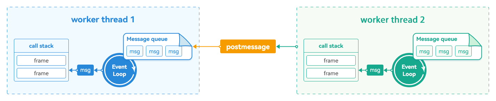
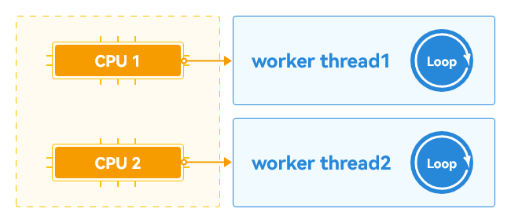
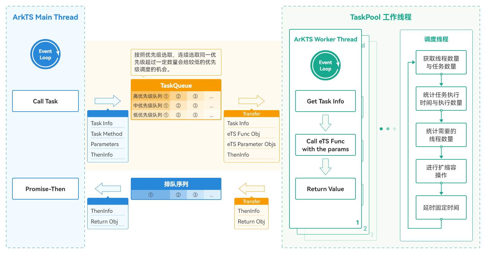
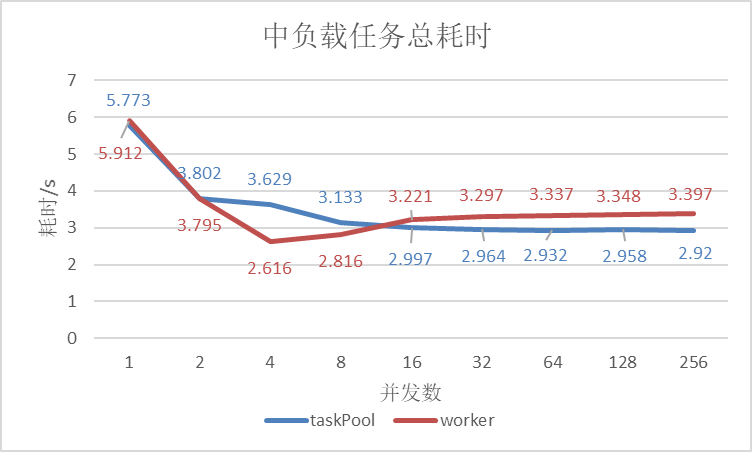
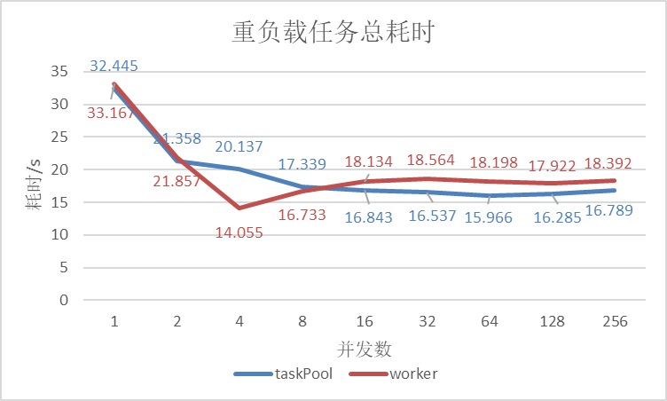
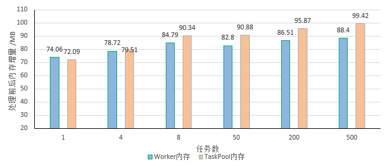
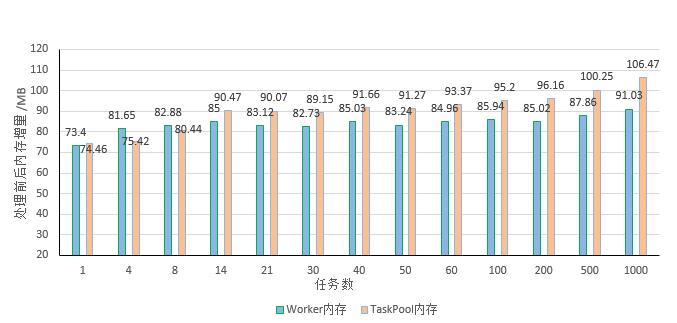

# TaskPool和Worker对比

更新时间：2026-03-17 02:20:01

来源：https://developer.huawei.com/consumer/cn/doc/best-practices/bpta-comparative_practice_of_taskpool_and_worker

## 概述


ArkTS提供了TaskPool与Worker两种多线程并发方案，下面我们将从其工作原理、使用效果对比两种方案的差异，进而选择适用于ArkTS图片编辑场景的并发方案。


## TaskPool和Worker工作原理


TaskPool与Worker两种多线程并发能力均是基于Actor并发模型实现的。Worker主、子线程通过收发消息进行通信；TaskPool基于Worker做了更多场景化的功能封装，例如支持任务执行、任务Task或任务组TaskGroup的创建、任务优先级设置、取消任务等功能，且可以根据任务数量进行自动的扩容与缩容，还可以根据任务优先级进行任务调度。


### Worker工作原理


Worker拥有独立的运行环境，每个Worker线程和主线程一样拥有自己的内存空间、消息队列（MessageQueue）、事件轮询机制（EventLoop）、调用栈（CallStack）等。线程之间通过Message进行交互，如下图所示：

图1 Worker工作原理





在多核的情况下（下图中的CPU 1和CPU 2能同时工作），多个Worker线程（下图中的Worker thread1和Worker thread2）可以同时执行，因此Worker线程做到了真正的并发，如下图所示：

图2 多核CPU下Worker并发原理图





### TaskPool工作原理


TaskPool在Worker之上实现了调度器和Worker线程池，无需管理生命周期。在主线程（ArkTS Main Thread）中调用execute接口会将待执行的任务方法及参数信息，根据设置的任务优先级放入任务队列（TaskQueue）中等待调度执行。调度器会依据调度算法（优先级，防饥饿），从优先级队列中取出任务进行序列化，放入TaskPool中的Worker线程池，工作线程（ArkTS Worker Thread）根据调度器的安排执行任务方法，并将任务处理结果进行反序列化，最终以Promise-Then的方式返回给主线程。TaskPool的工作线程池会根据待执行的任务数量，任务的执行时间进行相应的扩容与缩容。原理图如下所示：

图3 TaskPool工作原理图





## TaskPool与Worker并发方案对比


### 使用场景


本章节主要介绍Worker与TaskPool并发方案在ArkTS图片编辑场景下的使用及性能差异。分别从编码效率、线程创建耗时、数据传输、任务执行耗时、应用运行内存占用几个维度进行分析，对比不同方案各自的优缺点，以供开发者在遇到不同场景时参考。

图4 ArkTS图片编辑效果


> [!NOTE]
> 本文中对TaskPool的实验均是在配置了高优先级（taskpool.Priority.HIGH）模式下进行的。本实验中手机均为8核，应用运行实验环境有中载、重载两种，中载CPU资源占用率为50%~60%，重载CPU占用率为90%以上。测试数据仅限于示例程序，不同的应用程序及待编辑图片差异都会引起实验数据的变化。长时任务指耗时大于3分钟的任务。


### 编码效率对比


使用Worker处理图片

使用Worker并发处理图片时需要开发者根据任务量的多少，控制Worker实例运行的数量，最多可以同时运行64个实例。为了避免产生大量的线程创建开销，需要开发者尽量复用已创建线程处理耗时任务，任务执行完成时需要及时销毁Worker，以免线程资源长期被占用影响其他任务的执行。具体请参见生命周期注意事项。

使用Worker进行图片处理分以下步骤：

1. 根据任务数创建Worker实例，由于Worker最多同时运行的子线程数量为64个（API12新增支持，旧版本为8个），所以当任务数超过64时需要做相应限制，示例代码如下。
```text
let taskNum: number = 14; // The number of concurrent tasks is controlled, which can be adjusted according to the demand.
let curTaskNum: number = taskNum <= 64 ? taskNum : 64; // Control allows up to 64 Worker instances to run at the same time.
let Workers: worker.ThreadWorker[] = [];
for (let i = 0; i < curTaskNum; i++) { // Control the number of instantiations of the Worker according to the limit.
let WorkerInstance = new worker.ThreadWorker(WorkerName);
Workers.push(WorkerInstance);
}
```
2. 根据任务数将图片像素字节数进行拆分，并分配给已创建的Worker实例进行计算处理。
```ts
//Split the picture pixel data ArrayBuffer according to the number of tasks N.
function splitArrayBuffer(
  buffer: ArrayBuffer,
  taskCount: number,
): ArrayBuffer[] {
  const BYTES_PER_PIXEL = 4; // RGBA
  const bytesPerTask =
    Math.floor(buffer.byteLength / taskCount / BYTES_PER_PIXEL) *
    BYTES_PER_PIXEL;

  let result: ArrayBuffer[] = [];
  for (let i = 0; i < taskCount; i++) {
    if (i === taskCount - 1) {
      // The final block contains all the remaining data
      result[i] = buffer.slice(i * bytesPerTask);
    } else {
      result[i] = buffer.slice(i * bytesPerTask, (i + 1) * bytesPerTask);
    }
  }
  return result;
}

// ...
// Assign the split pixels to the Worker instance.
const buffers: ArrayBuffer[] = splitArrayBuffer(bufferArray, taskNum);
let messages: MessageItem[] = [];
for (let i = 0; i < taskNum; i++) {
  // Encapsulating corresponding task data according to the number of tasks.
  let message = new MessageItem(buffers[i], sliderValue, value); //Construct task message
  messages.push(message);
}
let n: number = 0;
let allocation: number = taskNum; // Number of tasks to be assigned
for (let index = 0; index < taskNum; index++) {
  Workers[index].postMessage(messages[n]); // Distribute the task to the corresponding Worker child thread instance.
  allocation = allocation - 1; // Number of remaining tasks to be assigned
  n += 1;
}
```
3. 接收到任务的Worker子线程会进行像素计算，并将计算结果返回给主线程。
```ts
// The child thread receives the task and calculates it.
WorkerPort.onmessage = (event: MessageEvents) => {
  let bufferArray: ArrayBuffer = event.data.buf;
  let last: number = event.data.last;
  let cur: number = event.data.cur;
  let index: number = event.data.index;
  let buffer = adjustImageValue(bufferArray, last, cur); // Pixel calculation execution
  let output: ESObject = new WorkerBuffer(buffer, index);
  WorkerPort.postMessage(output); // Send the calculation result to the main thread.
};

function adjustImageValue(
  bufferArray: ArrayBuffer,
  last: number,
  cur: number,
  hsvIndex?: number,
): ArrayBuffer {
  return execColorInfo(bufferArray, last, cur, HSVIndex.VALUE);
}

// Picture pixel calculation
function execColorInfo(
  bufferArray: ArrayBuffer,
  last: number,
  cur: number,
  hsvIndex: number,
) {
  // ...
  const newBufferArr = bufferArray;
  let colorInfo = new Uint8Array(newBufferArr);
  for (let i = 0; i < colorInfo?.length; i += CommonConstants.PIXEL_STEP) {
    const hsv = rgb2hsv(
      colorInfo[i + RGBIndex.RED],
      colorInfo[i + RGBIndex.GREEN],
      colorInfo[i + RGBIndex.BLUE],
    );
    let rate = cur / last;
    hsv[hsvIndex] *= rate;
    const rgb: ESObject = hsv2rgb(
      hsv[HSVIndex.HUE],
      hsv[HSVIndex.SATURATION],
      hsv[HSVIndex.VALUE],
    );
    colorInfo[i + RGBIndex.RED] = rgb[RGBIndex.RED];
    colorInfo[i + RGBIndex.GREEN] = rgb[RGBIndex.GREEN];
    colorInfo[i + RGBIndex.BLUE] = rgb[RGBIndex.BLUE];
  }
  return newBufferArr;
}
```
4. 当主线程接收到子线程的计算结果时，如果还有剩余任务没有处理，就会复用该子Worker线程继续处理剩余任务；当所有任务都处理完成时，销毁所有子线程，并将所有任务处理结果进行合并进而更新UI。
```ts
let num = 0; // Number of tasks processed
let newBuffers: ArrayBuffer[] = [];
for (let i = 0; i < taskNum; i++) {
  newBuffers[i] = new ArrayBuffer(0); // Initialize calculation result data of each task
}
Workers[index].onmessage = (e: ESObject) => {
  newBuffers[e.data.index] = e.data.buffer; // The main thread receives the calculation result.
  num = num + 1; // Number of tasks completed +1
  if (allocation !== 0) {
    // If the total task has not been processed, reuse the sub-thread to continue processing the remaining tasks.
    Workers[index].postMessage(messages[n]);
    n += 1;
    allocation = allocation - 1;
  } else if (num === taskNum) {
    for (let i = 0; i < curTaskNum; i++) {
      Workers[i].terminate(); // When all tasks are processed, the child thread is destroyed.
    }
    const entireArrayBuffer = mergeArrayBuffers(newBuffers); // Merge all task calculation results
    that.updatePixelMap(entireArrayBuffer); // Refresh the UI according to the calculation result.
  }
};
// Merge the calculation results of all tasks.
function mergeArrayBuffers(buffers: ArrayBuffer[]) {
  // Calculate the combined total length.
  let totalLength = buffers.reduce((length, buffer) => {
    length += buffer.byteLength;
    return length;
  }, 0);
  // Create a new ArrayBuffer.
  let mergedBuffer = new ArrayBuffer(totalLength);
  // Create a Uint8Array to operate the new ArrayBuffer.
  let mergedArray = new Uint8Array(mergedBuffer);
  // Copy the contents of each ArrayBuffer to the new ArrayBuffer in turn.
  let offset = 0;
  for (let buffer of buffers) {
    let array = new Uint8Array(buffer);
    mergedArray.set(array, offset);
    offset += array.length;
  }
  return mergedBuffer;
}
```


基于以上示例代码，可以发现使用Worker需要关注任务池个数上限，并管理Worker线程的生命周期，当任务数较多时难免会增加代码的复杂度。


使用TaskPool处理图片

TaskPool提供了比较简洁的API接口，开发者只需把任务方法、参数传入execute()接口，等待任务执行完成返回结果就行了，无需关注线程的创建，系统会自动根据任务量多少进行扩容及缩容。TaskPool还提供了一些常用功能，支持任务执行，任务Task或任务组TaskGroup的创建、配置任务优先级、任务取消等功能，以满足开发者更多的开发场景。本实践利用TaskGroup任务组的能力，将一个大的任务拆分成多个小的任务放进一个任务组中等待调度执行。

使用TaskPool进行图片处理步骤如下，其中根据图片编辑类型分别对图片进行处理，针对图片亮度和饱和度根据任务数对图片数据进行拆分、图片像素点的计算，以及任务结果的合并与Worker的处理逻辑一致，在此不再赘述。

1. 根据图片编辑类型分别处理。
```ts
// ImageEditTaskPool/entry/src/main/ets/view/AdjustContentView.ets
async sliderChange(value: number, mode: SliderChangeMode) {
  // ...
  const needBrightness = this.currentAdjustData[AdjustId.BRIGHTNESS] !== CommonConstants.SLIDER_MAX;
  const needSaturation = this.currentAdjustData[AdjustId.SATURATION] !== CommonConstants.SLIDER_MAX;
  if (needBrightness || needSaturation) {
    try {
      if (needBrightness) {
        buffer = await this.execImageProcessing(buffer, AdjustId.BRIGHTNESS, this.currentAdjustData[AdjustId.BRIGHTNESS]);
      }
      if (needSaturation) {
        buffer = await this.execImageProcessing(buffer, AdjustId.SATURATION, this.currentAdjustData[AdjustId.SATURATION]);
      }
      px.writeBufferToPixelsSync(buffer);
    } catch (err) {
      let error = err as BusinessError;
      hilog.error(0x0000, TAG, `${error.code}, ${error.message}`);
    }
  }

  if (this.currentAdjustData[AdjustId.TRANSPARENCY] !== CommonConstants.SLIDER_MAX) {
    const opacity = this.currentAdjustData[AdjustId.TRANSPARENCY] / CommonConstants.SLIDER_MAX;
    try {
      px.opacitySync(opacity);
    } catch (err) {
      let error = err as BusinessError;
      hilog.error(0x0000, TAG, `${error.code}, ${error.message}`);
    }
  }
  // ...
}
}
```
2. 根据任务数拆分任务，并把任务放进任务组里面，调用TaskPool的execute()接口将TaskGroup任务组中的每个任务放入线程池中，系统会根据第二个参数任务优先级进行调度执行。TaskGroup任务组内的每个任务的执行顺序会与执行结果数组中的顺序保持一致。将任务组的执行结果（数组内多个任务的处理结果）合并并返回给主线程。
```ts
private async execImageProcessing(buffer: ArrayBuffer, type: AdjustId, value: number): Promise<ArrayBuffer> {
  const buffers = splitArrayBuffer(buffer, 240);
  const group = splitTask(buffers, type, value);
  try {
    return mergeArrayBuffers(await taskpool.execute(group, taskpool.Priority.HIGH) as ArrayBuffer[]);
  } catch (err) {
    let error = err as BusinessError;
    hilog.error(0x0000, TAG, `${error.code}, ${error.message}`);
    return buffer;
  }
}
/**
* Each task processes a portion of the pixel data and adds the task to the task group.
*
*/
function splitTask(buffers: ArrayBuffer[], type: AdjustId, value: number): taskpool.TaskGroup {
  // Creating a Task Group
  let group: taskpool.TaskGroup = new taskpool.TaskGroup();
  for (const buffer of buffers) {
    try {
      group.addTask(imageProcessing, {
        // Add a task to a task group
        value: value,
        buffer: buffer,
        type: type
      });
    } catch (err) {
      hilog.error(0x0000, 'AdjustContentView', 'Failed to add the task: ', JSON.stringify(err) ?? '');
    }
  }
  return group;
}
```


使用TaskPool并发方案处理耗时任务代码写法比较简洁，开发者更容易上手。


根据以上示例代码对比可以看出，使用Worker需要开发者关注线程数量的上限，管理线程生命周期，随着任务的增多也会增加线程管理的复杂度。使用TaskPool并发方案处理耗时任务代码写法比Worker简洁，开发者很容易上手。TaskPool支持任务组、任务优先级、取消任务等能力，为开发者提供了更多场景选择。


### 线程创建耗时对比


从Worker与TaskPool的工作原理和编码效率我们可以得知如下结论：

- Worker需要开发者关注线程数量上限，管理线程生命周期，为了避免大量的系统资源消耗，需要开发者尽量复用已创建线程处理耗时任务。
- TaskPool无需开发者关注线程生命周期的管理，通过系统统一线程管理，结合动态调度和负载均衡算法，可以节约系统资源。


因此创建线程耗时 Worker > TaskPool，对于应用首帧快速响应的场景推荐使用TaskPool。


### 数据传输方式对比


使用Worker与TaskPool处理并发任务时需要将数据从主线程传递到任务池的执行线程。目前支持传输的数据对象可以分为普通对象、ArrayBuffer对象、SharedArrayBuffer对象、Transferable对象、Sendable对象五种，具体可参考指南文档。Worker与TaskPool均提供了两种传递数据的方式。

- 转移控制权：可以将transfer列表中的ArrayBuffer对象在传输时转移控制权至工作线程，而非复制内容到工作线程。传输后当前的ArrayBuffer失效，在宿主线程中将变为不可用，不允许再访问。
- 深拷贝：将宿主线程的数据复制一份传递给执行线程，执行线程对数据的修改不会对宿主线程中的原数据产生影响。


其中Worker提供postMessage()接口，TaskPool提供了setTransferList()接口，开发者可以根据实际需要，调整参数控制采用哪种方式传递数据。

TaskPool与Worker底层都是采用了同一套序列化与反序列化的机制。主要差异体现在TaskPool支持任务方法的传递，而Worker的任务方法需要写在对应的Worker.ets文件中，相较于Worker，TaskPool多了任务方法的序列化与反序列化步骤。

我们以TaskPool在任务数为1时（任务方法、参数、运行结果）的序列化与反序列化为例，统计一下序列化与反序列化的相关数据如下表所示：


|  | 序列化数据量（bytes） | 序列化时间（μs） | 序列化效率（B/μs） | 反序列化时间（μs） | 反序列化效率（B/μs） |
| --- | --- | --- | --- | --- | --- |
| 方法 | 58 | 9.549 | 6.833 | 43.749 | 1.457 |
| 参数 | 217 | 36.111 | 6.023 | 115.294 | 1.933 |
| 结果 | 47 | 16.667 | 2.990 | 85.243 | 0.567 |


上面实验待编辑图片有24520520个像素字节数，如果采用转移控制权的方式，序列化的数据就小很多且效率高。采用深拷贝方式的话会增加序列化与反序列化的开销。在宿主线程将数据（支持控制权转移）传递给执行线程后，不需要紧接着对数据进行访问的场景，推荐使用转移控制权的方式，这样可以提升数据传输效率。


TaskPool与Worker都具有转移控制权、深拷贝两种方式，Worker不支持任务方法的传递，只能将任务方法写在Worker.ets文件中。TaskPool支持任务方法的传递，因此相较于Worker，TaskPool多了任务方法的序列化与反序列化步骤。数据传输两者差异不大。


### 任务执行完成耗时对比


分别在中载、重载环境下运行，随着任务数的增多，图片编辑任务完成耗时，如下图所示：

图5 中载模型下Worker与TaskPool耗时对比




图6 重载模型下TaskPool与Worker耗时对比





从模型实验数据可以看出：

1. 在并发任务数为1时，执行完任务TaskPool与Worker均相近；随着并发任务数的增多，TaskPool的完成任务的耗时大致上逐渐缩短，而Worker则先下降再升高。
2. 在任务数为4时，Worker效率最高，相比于单任务减少了约57%的耗时；
3. TaskPool在并发数>8后优于Worker并趋于稳定，相比于单任务减少了约50%的耗时。


随着任务数的增多TaskPool逐渐优于Worker，这是由于TaskPool支持高优先级设置，在系统资源不足时，高优先级的任务更容易获得系统资源，所以TaskPool执行耗时任务相对Worker稍快一些。

从中载模型实验数据可以看出：

1. 在并发任务数为1时，执行完任务TaskPool与Worker分别用了119s、121s；随着并发任务数的增多完成任务的耗时逐渐缩短，在任务数为4时，执行完任务TaskPool与Worker分别用了41s、40s，相比于单任务TaskPool有65%的性能收益，Worker有67%的性能收益；
2. 当任务数大于4时，Worker执行耗时几乎稳定在40s左右，TaskPool在任务数为8时耗时较多，这是因为TaskPool最多可以创建（内核数-1）个线程，对于8核的手机来说最多可以创建7个线程，所以当有8个任务时，其中一个任务要串行执行，因此总耗时较多，任务数大于8时完成任务耗时稳定于39s左右。
3. 中载模型下任务数大于50时，TaskPool与Worker完成任务耗时差异不大。


经过以上中载、重载环境下的对比实验可以发现，并发可以带来约50%~65%收益，但并不是任务数越多越好，需要开发者根据任务及计算情况自己控制；随着任务数的增多在重载环境下TaskPool与Worker耗时差异比在中载环境下大，这是由于TaskPool支持高优先级设置，在系统资源不足时，高优先级的任务更容易获得系统资源，所以TaskPool执行耗时任务相对Worker稍快一些；中载环境下由于系统资源充足，TaskPool的高优先级设置效果没有那么明显，所以TaskPool与Worker完成任务耗时几乎相当。


### 运行时内存占用对比


分别在中载、重载环境下，随着任务数的增多，统计图片编辑前一刻与完成任务时刻应用内存增量的变化情况，如下图所示：

图7 中载模型下TaskPool与Worker运行时内存占用对比




图8 重载模型下TaskPool与Worker运行时内存占用对比




从以上实验数据可以看出：

任务数较少时使用Worker与TaskPool的运行内存差别不大，随着任务数的增多TaskPool的运行内存明显比Worker大。

这是由于TaskPool在Worker之上做了更多场景化封装，TaskPool实现了调度器和Worker线程池，随着任务数的增多，运行时会多占用一些内存空间，待任务执行完毕之后都会进行回收和释放。


## 总结


| 对比维度 | Worker | TaskPool |
| --- | --- | --- |
| 编码效率 | Worker需要开发者关注线程数量的上限，管理线程生命周期，随着任务的增多也会增加线程管理的复杂度。 | TaskPool简单易用，开发者很容易上手。 |
| 线程创建耗时 | 需要开发者自行管理线程数量上限，自行管理线程生命周期，尽可能复用已创建的线程。 | 开发者无需关注线程生命周期，线程创建。由系统统一调度管理。 |
| 数据传输 | TaskPool与Worker都具有转移控制权、深拷贝两种方式，Worker不支持任务方法的传递，只能将任务方法写在Worker.ets文件中。 | 传输方式与Worker相同；TaskPool支持任务方法的传递，因此相较于Worker，TaskPool多了任务方法的序列化与反序列化步骤。数据传输两者差异不大。 |
| 任务执行耗时 | 任务数较少时优于TaskPool，当任务数大于8后逐渐落后于TaskPool。 | 任务数较少时劣于Worker，随着任务数的增多，TaskPool的高优先级任务模式能够更容易地抢占到系统资源，因此完成任务耗时比Worker少。 |
| 运行时内存占用 | 运行时占用内存较少。 | 随着任务数的增多占用内存比Worker高。 |


1. 编码效率：TaskPool写法比Worker更简洁更好掌控，TaskPool还支持任务组、任务优先级、取消任务等能力。如果有这些场景的需要，可以采用TaskPool并发方案。
2. 线程创建耗时：Worker比TaskPool创建线程的开销大，因此对于应用首帧要求快速响应的场景推荐使用TaskPool。
3. 数据传输：TaskPool支持将任务方法作为一个参数进行传输，任务方法的序列化与反序列化耗时很短，可以忽略其影响。在需要处理多个不同任务的场景，TaskPool可以直接传递任务方法，而Worker需要创建Worker.ets文件承载任务方法相对复杂，此场景推荐使用TaskPool；其他情况下开发者可以选择Worker，也可以选择TaskPool。
4. 任务执行耗时：在中载场景下两种并发方案都可以选择，在重载下需要任务优先执行的场景推荐使用TaskPool并发方案。
5. 运行时内存占用：开发者可以根据实际运行的设备内存情况选择合适的并发方案。


本实践只对比了编码效率、线程创建耗时、数据传输、任务执行耗时、应用运行内存占用方面TaskPool与Worker的差异，更多参见TaskPool和Worker的对比。


经过以上实验分析，ArkTS图片编辑任务在重载模型下单任务执行耗时119s，4个任务时耗时41s（比单任务并发有50%~65%的收益），为非执行长耗时任务场景，从场景、编码效率等方面考量选择TaskPool方案比较合适。开发者可以根据自己业务的实际运用场景选择适合自己的并发方案。


## 示例代码


- [基于TaskPool实现图片编辑功能](https://gitcode.com/harmonyos_samples/BestPracticeSnippets/tree/master/ImageEditTaskPool)
- [基于Worker实现图片编辑功能](https://gitcode.com/harmonyos_codelabs/ImageEdit)
