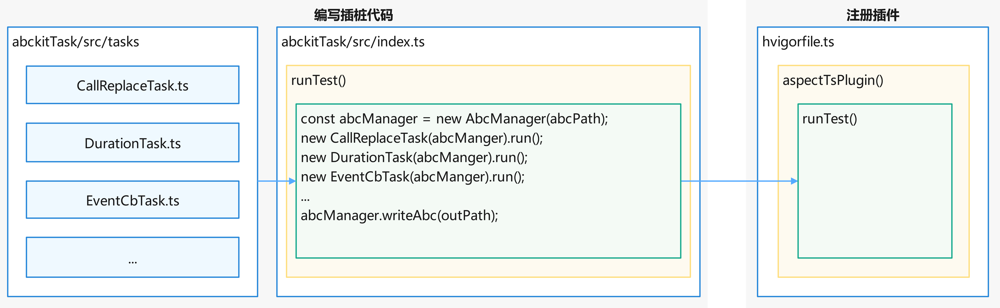

# 基于AbcKitTS实现字节码插桩

更新时间：2026-05-11 03:18:30

来源：https://developer.huawei.com/consumer/cn/doc/best-practices/bpta-abckitts-implements-instrumentation

##### 概述

AbcKitTS是一款专为方舟字节码设计的TypeScript字节码分析与修改工具库。它提供了简洁而强大的字节码操作API，让开发者能够精确定位目标方法、拦截API调用、注入回调逻辑，并支持灵活的字节码指令创建与修改，从而实现高效的切面编程。本文将从实际业务场景出发，深入剖析AbcKitTS在切面编程中的高频应用模式，分享最佳实践与实现技巧。
 
同时，针对轻量化的业务需求，可以参考基于装饰器配置的[基于Aspect插件库实现切面编程](https://developer.huawei.com/consumer/cn/doc/best-practices/bpta-aspect-implements-aop)——它完全封装了底层的字节码技术，让开发者以声明式的方式快速实现切面功能，真正做到"零侵入"式开发。
 
 

##### 实现原理

在深入实践之前，建议先通过官方文档了解[方舟字节码](https://developer.huawei.com/consumer/cn/doc/harmonyos-guides/arkts-bytecode)的基本原理，并掌握[Disassembler反汇编工具](https://developer.huawei.com/consumer/cn/doc/harmonyos-guides/tool-disassembler)的基础技能，这将有助于更好地理解后续内容。
 
 

##### 底层架构

AbcKitTS是基于C++版[libabckit](https://gitcode.com/openharmony/arkcompiler_runtime_core/tree/master/libabckit)方舟字节码工具库的TypeScript封装，旨在提升开发者的字节码插桩效率。通过提供易用的API接口，它将底层复杂的字节码操作抽象为简洁的开发体验。
 
 

##### 核心设计：扁平化的元数据模型

AbcKitTS通过AbcManager统一管理字节码文件，并提供链式查询API供开发者快速定位目标方法。其元数据模型在设计上独具匠心：底层虽然遵循源程序的"树形结构"，但对外提供了扁平化的查询视图，极大地简化了数据检索过程。
 
> [!NOTE]
> AbcManager是字节码操作统一管理器，其核心功能包括加载、查询和修改字节码。

 
以namespace a { namespace b { ... } }的嵌套结构为例，在AbcModule的AbcNamespace[]列表中会保存为两条独立的命名空间数据，开发者无需进行嵌套遍历即可直接访问。
 
元数据结构详解：
 
  
| 节点类型 | 对应关系 | 设计特点 |
| --- | --- | --- |
| AbcModule | ets/ts源文件 | 包含文件内所有命名空间、类、顶层函数（包括匿名回调函数）； 持有特殊的func_main_0入口函数，记录文件顶层的语句执行及声明。 |
| AbcNamespace | 命名空间 | 采用扁平化设计，仅持有该命名空间内的顶层函数，其内部的类统一由AbcModule持有。 |
| AbcClass | 类定义 | 持有类方法，但不包含方法内部定义的匿名回调函数，后者被保存在AbcModule中。 |
| AbcFunction | 函数/方法 | 可遍历Block块，也可直接遍历指令。底层解析时，实际是从外层Block到内层Instruction的顺序逐层解析。 |
| Block | 代码块 | 函数体由多个Block构成（至少3个：startBlock、endBlock及startBlock的后继块）； 支持代码分支语句（如if-else、try-catch）构建，常用于入参校验、返回值校验、异常捕捉等代码结构改造场景。 |
| Instruction | 指令序列 | 字节码的基本执行单元，绝大多数插桩功能通过创建或修改指令完成。 |
 
 

##### 指令操作：IsaKit的设计要点

IsaKit是AbcKitTS提供的核心指令操作工具，用于操作方法的Block及Instruction。
 


 

使用时需要特别注意：
 
- 作用域限定：IsaKit必须通过AbcFunction实例获取，不同方法拥有独立的IsaKit实例。
- 避免混淆：在回调函数分析等场景中，切勿跨方法混用IsaKit，否则可能导致指令操作错乱。

 

 
 
本文主要内容如下：
- [开发流程](#section1179862361313)：介绍所有场景通用的开发流程。
- [场景示例](#section21172491410)：通过实际开发中的场景，介绍基于AbcKitTS的基本使用方法。
生命周期函数打点
- 函数耗时统计
- 隐私API监控
- 方法调用点替换
- 关键属性修改
- 事件监听埋点
- 方法入参校验

 - [示例代码](#section129251397148)：本文引用的工程代码。

 
 

##### 开发流程

开发者要使用AbckitTS对HarmonyOS工程进行插桩，需要完成两个步骤：**编写插桩代码**和**注册插件**。其中，插桩代码的编写会根据具体业务逻辑而有所不同，本文将在[场景示例](#section21172491410)中根据不同业务场景详细介绍实现方法。
 


 
 

##### 编写插桩代码

编写TypeScript插桩代码时，可以在项目根目录下新建TS子工程，用于开发插桩逻辑代码。
```json
.
├──entry/src/main/ets                 // entry module
├──abckitTask                         // abckitTask directory
│  └──src 
│  │  ├──task                     
│  │  │  └──CallReplaceTask.ts        // instrumentation code
│  │  └──index.ts                     // instrumentation Entry Point
│  └──package.json                    // Node.js configuration
│  └──tsconfig.json                   // TypeScript project connfiguration
├──hvigorfile.ts                      // registering a Plug-in
├──...
└──README.md
```
 
 
1. 初始化插桩任务工程，配置package.json。

  
```json
{
  "name": "abckit-ts-task",
  "version": "1.0.0",
  "description": "",
  "main": "index.js",
  "scripts": {
    "test": "echo \"Error: no test specified\" && exit 1"
  },
  "author": "",
  "license": "ISC",
  "devDependencies": {
    "@types/node": "^25.5.0",
    "typescript": "^5.9.3"
  },
  "dependencies": {
    "@hadss/abckit-ts": "1.0.0-rc.0"
  }
}
```
 配置tsconfig.json。

  
```json
{
  "compilerOptions": {
    "target": "ES6",
    "moduleResolution": "node",
    "module": "commonjs",
    "esModuleInterop": true,
    "allowSyntheticDefaultImports": true,
    "outDir": "./dist",
    "rootDir": "./src",
    "strict": true
  },
  "include": [
    "src/**/*"
  ],
  "exclude": [
    "node_modules"
  ]
}
```
 安装依赖：

  
```text
npm install
```

2. 编写插桩任务。
3. 编写入口脚本。

  这里推荐使用worker_threads子线程方式执行插桩任务，可以避免DevEco Studio、Hvigor、Native跨环境调用可能产生的内存访问异常的问题。

  
```ts
import { CallReplaceTask } from './task/CallReplaceTask';
import { DurationTask } from './task/DurationTask';
import { EventCbTask } from './task/EventCbTask';
import { KeyAttributeModifyTask } from './task/KeyAttributeModifyTask';
import { LifeCycleTask } from './task/LifeCycleTask';
import { MethodParameterValidateTask } from './task/MethodParameterValidateTask';
import { PrivacyApiScanTask } from './task/PrivacyApiScanTask';
import { AbcManager } from '@hadss/abckit-ts';

const fs = require('fs');
const abcPath = process.argv[2]
const outPath = `${abcPath}.bak`

export function runTest(abcPath: string, outPath: string): void {
  const abcManger = new AbcManager(abcPath);
  new DurationTask(abcManger).run();
  new EventCbTask(abcManger).run();
  new CallReplaceTask(abcManger).run();
  new KeyAttributeModifyTask(abcManger).run();
  new LifeCycleTask(abcManger).run();
  new MethodParameterValidateTask(abcManger).run();
  new PrivacyApiScanTask(abcManger).run();
  abcManger.writeAbc(outPath);
  fs.renameSync(outPath, abcPath);
}

try {
  runTest(abcPath, outPath);

  process.exit(0)
} catch (err) {
  console.error('error: ', err instanceof Error ? err.message : err)
  process.exit(1)
}
```

4. 编译构建abckitTask工程。

  
```text
cd abckitTask && npx tsc
```
 至此，Hvigor Plugin准备好了插桩任务调用入口dist/index.js。
 

##### 注册插件

AbcKitTS插桩接口基于Hvigor插件开发，具体流程可参考[《开发Hvigor插件》](https://developer.huawei.com/consumer/cn/doc/harmonyos-guides/ide-hvigor-plugin)文档。
 
本最佳实践基于hvigorfile脚本开发，在hvigorfile.ts中定义aspectPlugin()函数。
 
```ts
import { hvigor, HvigorNode, HvigorPlugin } from '@ohos/hvigor';
import { appTasks, OhosPluginId, OhosHapContext, OhosHspContext, OhosHarContext } from '@ohos/hvigor-ohos-plugin';

const { spawnSync } = require('child_process');

type OhosContext = OhosHapContext | OhosHspContext | OhosHarContext;

export default {
  system: appTasks,
  plugins: [
    aspectPlugin(),
  ],
};

function aspectPlugin(): HvigorPlugin {
  return {
    pluginId: 'aspectPlugin',
    apply(node: HvigorNode) : void {
      hvigor.nodesEvaluated(async () => {
        const hotReload = hvigor.getParameter().getExtParam('hotReload');
        if (hotReload) {
          return;
        }
        node.subNodes(subNode => {
          const context = (
            subNode.getContext(OhosPluginId.OHOS_HAP_PLUGIN) ??
            subNode.getContext(OhosPluginId.OHOS_HSP_PLUGIN) ??
            subNode.getContext(OhosPluginId.OHOS_HAR_PLUGIN)
          ) as OhosContext | undefined;
          if (!context) {
            return;
          }
          context.transformAbc(async (abcPath: string, config: any) => {
            console.log("[Final] Abckit Task Start! ");
            const child = spawnSync('node', ['./abckitTask/dist/index.js', abcPath]);
            if (child.status !== 3221225477 && child.status !== 0) {
              throw new Error(child.status);
            }
            console.log("[Final] Abckit Task Completed! ABC File generated.");
          });
        });
      });
    },
  };
}
```
 
 
> [!NOTE]
> 1. AbcKitTS不支持HotReload模式。 2. OHOS_HAR_PLUGIN、OHOS_HSP_PLUGIN和OHOS_HAP_PLUGIN分别对应har、hsp和hap三种包类型。 3. transformAbc API基于Hvigor框架，用于处理abc文件路径。 4. 为避免DevEco Studio、Hvigor和Native环境调用时可能出现的内存访问异常，建议使用worker_threads子线程执行插桩任务。

 

##### 场景示例

**场景一：生命周期函数打点**
 
**场景描述：**
 
在开发过程中，精准定位组件行为往往需要对其生命周期进行监控。通过在关键生命周期函数中打点，开发者可以有效追踪组件行为，从而快速定位问题。
 
以下示例以组件CompA为例，在aboutToAppear生命周期函数中进行插桩。
 
ArkTS源码如下所示：
 
```ArkTS
aboutToAppear(): void {
  // Insert here: Set message to `Module[path: &entry/src/main/ets/pages/scene/LifeCycle&] - struct[name: ComponentA]
  // - aboutToAppear is executed.`
}
```
 
**实现步骤：**
 1. 初始化AbcManager实例。
2. 定位目标函数。
3. 执行前置插桩操作。
4. 输出abc文件。代码如下：

  
```ts
class Context {
  static readonly PROJECT_MODULE: string = 'entry';
  static readonly QUERY_PATH: string = 'src/main/ets/pages/scene/LifeCycle';
  static readonly QUERY_CLASS_NAME: string = 'ComponentA';
  static readonly QUERY_FUNCTION_NAME: string = 'aboutToAppear';
  static readonly ATTRIBUTE_NAME: string = 'message';
  static apiCallLog(moduleName: string, className: string): string {
    return `Module[path: ${moduleName}] - struct[name: ${className}] - aboutToAppear is executed.`;
  }
}

export class LifeCycleTask {
  manager: AbcManager;
  targetFunc: AbcFunction | null = null;

  /**
   * step1. init AbcManager
   *
   * @param manager AbcManager
   */
  constructor(manager: AbcManager) {
    this.manager = manager;
  }

  run(): void {
    this.getTargetFunction();
    this.transform();
    this.manager.flush();
  }

  /**
   * step2. Position objective function
   */
  getTargetFunction(): void {
    const functions = this.manager.query()
      .projectModule(Context.PROJECT_MODULE)
      .path(Context.QUERY_PATH)
      .className(Context.QUERY_CLASS_NAME)
      .functionName(Context.QUERY_FUNCTION_NAME)
      .getFunction();
    if (functions.length === 0) {
      throw new Error('LifeCycle Task function not found');
    }
    this.targetFunc = functions[0];
  }

  /**
   * step3. Perform pre-instrumentation.
   */
  transform(): void {
    if (!this.targetFunc) {
      return;
    }
    const isaKit = this.targetFunc.getIsaKit();
    const instructions: Instruction[] = [];
    const params = this.targetFunc.getParameters();
    const moduleName = this.targetFunc.getParentModule().getName();
    const className = this.targetFunc.getParentClass() == null ? '' : this.targetFunc.getParentClass().getName();
    const loadStringInst = isaKit.createLdaString(Context.apiCallLog(moduleName, className));
    const stobjbynameInst = isaKit.createStObjByName(loadStringInst, Context.ATTRIBUTE_NAME, params[params.length - 1]);
    instructions.push(loadStringInst);
    instructions.push(stobjbynameInst);
    this.targetFunc.insertBefore(instructions);
    this.targetFunc.apply();
  }
}
```

 
**场景二：函数耗时统计**
 
**场景描述：**
 
开发者可以通过对函数定义点进行环绕插桩，定位源码中的性能问题。
 
以下示例将对组件CompA中的aboutToAppear方法进行环绕插桩， 统计方法运行耗时。
 
ArkTS源码如下所示：
 
```ArkTS
async aboutToAppear(): Promise<void> {
  // Insert here
  // Assign startTime with Date.now()
  await this.pseudoSyncOperation();
  // Assign endTime with Date.now()
  // Set message to `durations(ms): ${endTime}-${startTime}`
}
```
 
**实现步骤：**
 1. 初始化AbcManager实例。
2. 定位目标函数。
3. 执行环绕插桩操作。
4. 输出abc文件。
 
代码如下：
 
```ts
class Context {
  static readonly PROJECT_MODULE: string = 'entry';
  static readonly QUERY_PATH: string = 'src/main/ets/pages/scene/FunctionDuration';
  static readonly QUERY_CLASS_NAME: string = 'CompA';
  static readonly QUERY_FUNCTION_NAME: string = 'aboutToAppear';
  static readonly API_IMPORT_NAME: string = 'geoLocationManager';
  static readonly API_FUNCTION_NAME: string = 'getCurrentLocation';
  static readonly REPLACE_MESSAGE: string = 'duration(ms): ';
  static readonly ATTRIBUTE_NAME: string = 'message';
  static readonly REPLACE_IMPORT_NAME: string = 'Date';
  static readonly REPLACE_FUNCTION_NAME: string = 'now';
}

export class DurationTask {
  manager: AbcManager;
  targetFunc: AbcFunction | null = null;

  /**
   * step1. init AbcManager
   *
   * @param manager AbcManager
   */
  constructor(manager: AbcManager) {
    this.manager = manager;
  }

  run(): void {
    this.getTargetFunction();
    this.doTransform();
    this.manager.flush();
  }

  /**
   * step3. Perform the wraparound instrumentation operation.
   */
  doTransform(): void {
    const startTimeInst = this.doInsertBefore();
    this.doInsertAfter(startTimeInst);
    this.targetFunc?.apply();
  }

  doInsertAfter(startTimeInst: Instruction): void {
    if (!this.targetFunc) {
      return;
    }
    const isaKit = this.targetFunc.getIsaKit();
    for (const inst of this.targetFunc.getInstructions()) {
      const isReturn = isaKit.iGetOpcode(inst) === IsaApiDynamicOpcode.ABCKIT_ISA_API_DYNAMIC_OPCODE_RETURN ||
        isaKit.iGetOpcode(inst) === IsaApiDynamicOpcode.ABCKIT_ISA_API_DYNAMIC_OPCODE_RETURNUNDEFINED;
      if (isReturn) {
        const afterInsts = this.createAfterInsts(startTimeInst, isaKit);
        isaKit.iInsertBefore(inst, afterInsts);
      }
    }
  }

  createAfterInsts(startTimeInst: Instruction, isaKit: IsaKit): Instruction[] {
    const instructions: Instruction[] = [];
    if (!this.targetFunc) {
      return instructions;
    }

    const endTimeInsts = this.createTimeInstructions();
    const subInst = isaKit.createSub2(startTimeInst, endTimeInsts[endTimeInsts.length - 1]);

    const durationStrInst = isaKit.createLdaString(Context.REPLACE_MESSAGE);
    const addInst = isaKit.createAdd2(subInst, durationStrInst);

    const params = this.targetFunc.getParameters();
    const stobjbynameInst = isaKit.createStObjByName(addInst, Context.ATTRIBUTE_NAME, params[params.length - 1]);

    instructions.push(...endTimeInsts);
    instructions.push(...[subInst, durationStrInst, addInst, stobjbynameInst]);
    return instructions;
  }

  doInsertBefore(): Instruction {
    const startTimeInsts = this.createTimeInstructions();
    this.targetFunc?.insertBefore(startTimeInsts);
    return startTimeInsts[startTimeInsts.length - 1];
  }

  createTimeInstructions(): Instruction[] {
    const instructions: Instruction[] = [];
    if (!this.targetFunc) {
      return instructions;
    }
    const isaKit = this.targetFunc.getIsaKit();
    const tryldglobalbyname = isaKit.createTryLdGlobalByName(Context.REPLACE_IMPORT_NAME);
    const ldobjbyname = isaKit.createLdObjByName(tryldglobalbyname, Context.REPLACE_FUNCTION_NAME);
    const callthis0 = isaKit.createCallThis0(ldobjbyname, tryldglobalbyname);

    instructions.push(tryldglobalbyname);
    instructions.push(ldobjbyname);
    instructions.push(callthis0);

    return instructions;
  }

  /**
   * step2. Position objective function
   */
  getTargetFunction(): void {
    const functions = this.manager.query()
      .projectModule(Context.PROJECT_MODULE)
      .path(Context.QUERY_PATH)
      .className(Context.QUERY_CLASS_NAME)
      .functionName(Context.QUERY_FUNCTION_NAME)
      .getFunction();
    if (functions.length === 0) {
      throw new Error('Duration Task function not found.');
    }
    this.targetFunc = functions[0];
  }
}
```
 
**场景三：隐私API监控**
 
**场景描述：**
 
开发者可以通过对调用点位置进行分析埋点，实现对重点API接口的调用监控。
 
以下示例对地理位置获取操作进行调用监控，对geoLocationManager.getCurrentLocation()方法调用进行前置插桩。
 
ArkTS源码如下所示：
 
```ArkTS
getLocation(): void {
  const request: geoLocationManager.SingleLocationRequest = {
    locatingPriority: geoLocationManager.LocatingPriority.PRIORITY_LOCATING_SPEED,
    locatingTimeoutMs: CommonConstants.LOCATING_TIMEOUT_MS
  };
  // Insert here: Set message to `Module[path: &entry/src/main/ets/pages/scene/PrivacyApi&]
  // - struct[name: getLocation] - getCurrentLocation is executed.`
  geoLocationManager.getCurrentLocation(request).then((location: geoLocationManager.Location) => {
    this.longitude = location.longitude;
    this.latitude = location.latitude;
  }).catch((err: BusinessError) => {
    Logger.error(TAG, `getLocation failed, code: ${err.code}, message: ${err.message}`);
    LocationErrorUtil.locationFailedAlert(this.getUIContext(), err.code);
  });
}
```
 
**实现步骤：**
 1. 初始化AbcManager实例。
2. 收集目标函数。
3. 扫描函数指令，定位API调用点。
4. 执行前置插桩操作。
5. 输出abc文件。代码如下：

  
```ts
class Context {
  static readonly PROJECT_MODULE: string = 'entry';
  static readonly QUERY_PATH: string = 'src/main/ets/pages/scene/PrivacyApi';
  static readonly QUERY_CLASS_NAME: string = 'PrivacyApiPage';
  static readonly QUERY_FUNCTION_NAME: string = 'getLocation';
  static readonly API_IMPORT_NAME: string = 'geoLocationManager';
  static readonly API_FUNCTION_NAME: string = 'getCurrentLocation';
  static readonly ATTRIBUTE_NAME: string = 'message';
  static apiCallLog(moduleName: string, className: string): string {
    return `Module[path: ${moduleName}] - struct[name: ${className}] - getCurrentLocation is executed.`;
  }
}

export class PrivacyApiScanTask {
  manager: AbcManager;
  targetFunc: AbcFunction | null = null;

  /**
   * step1. init AbcManager
   *
   * @param manager AbcManager
   */
  constructor(manager: AbcManager) {
    this.manager = manager;
  }

  run(): void {
    this.getTargetFunction();
    this.transform();
    this.manager.flush();
  }

  /**
   * step2. Collect objective functions
   */
  getTargetFunction(): void {
    const functions = this.manager.query()
      .projectModule(Context.PROJECT_MODULE)
      .path(Context.QUERY_PATH)
      .className(Context.QUERY_CLASS_NAME)
      .functionName(Context.QUERY_FUNCTION_NAME)
      .getFunction();
    if (functions.length === 0) {
      throw new Error('PrivacyApiScan Task function not found');
    }
    this.targetFunc = functions[0];
  }

  isTargetApiCall(callInst: Instruction, params: { importName: string; functionName: string }): boolean {
    if (!this.targetFunc) {
      return false;
    }
    if (!this.targetFunc.getIsaKit().iIsCall(callInst)) {
      return false;
    }

    const input0 = this.targetFunc.getIsaKit().iGetInput(callInst, 0);
    const isTargetFunction = input0 && this.targetFunc.getIsaKit().iGetOpcode(input0) ===
      IsaApiDynamicOpcode.ABCKIT_ISA_API_DYNAMIC_OPCODE_LDOBJBYNAME &&
      this.targetFunc.getIsaKit().iGetString(input0) === params.functionName;
    if (!isTargetFunction) {
      return false;
    }

    const input1 = this.targetFunc.getIsaKit().iGetInput(callInst, 1);
    if (!input1) {
      return false;
    }
    const isTargetImport = this.targetFunc.getIsaKit().iGetOpcode(input1) ===
      IsaApiDynamicOpcode.ABCKIT_ISA_API_DYNAMIC_OPCODE_LDEXTERNALMODULEVAR &&
      this.targetFunc.getIsaKit().iGetImportDescriptor(input1).getAlias() === params.importName;
    return isTargetImport;
  }

  /**
   * step3. Scans function instructions to locate API call points.
   * step4. Perform pre-instrumentation operations.
   */
  transform(): void {
    const instructions = this.targetFunc?.getInstructions();
    if (!instructions || !this.targetFunc) {
      return;
    }

    for (const inst of instructions) {
      if (!this.isTargetApiCall(inst, { importName: Context.API_IMPORT_NAME, functionName: Context.API_FUNCTION_NAME })) {
        continue;
      }

      const isaKit = this.targetFunc.getIsaKit();
      const instructionsInsert: Instruction[] = [];
      const params = this.targetFunc.getParameters();
      const moduleName = this.targetFunc.getParentModule().getName();
      const loadStringInst = isaKit.createLdaString(Context.apiCallLog(moduleName, this.targetFunc.getName()));
      const stobjbynameInst = isaKit.createStObjByName(loadStringInst, Context.ATTRIBUTE_NAME, params[params.length - 1]);
      instructionsInsert.push(loadStringInst);
      instructionsInsert.push(stobjbynameInst);

      isaKit.iInsertBefore(inst, instructionsInsert);
    }
    this.targetFunc?.apply();
  }
}
```

 
> [!NOTE]
> 调用点分析通常不确定调用点位置，因此需要对范围内的方法进行全量指令扫描，范围限定越精确，定位调用点耗时越少。

 
**场景四：方法调用点替换**
 
**场景描述：**
 
业务逻辑开发过程中，源码或三方库可能需要紧急修复异常，开发者可以通过调用点替换来增强API功能。
 
以下示例将系统API geoLocationManager.getCurrentLocation()调用替换为自定义的GeoUtils.getLocation()方法。
 
ArkTS源码如下所示：
 
geoLocationManager.getCurrentLocation()为待替换API。
 
```ArkTS
getLocation(): void {
  const request: geoLocationManager.SingleLocationRequest = {
    locatingPriority: geoLocationManager.LocatingPriority.PRIORITY_LOCATING_SPEED,
    locatingTimeoutMs: CommonConstants.LOCATING_TIMEOUT_MS
  };
  // Replace here: Replace geoLocationManager.getCurrentLocation with GeoUtils.getLocation
  geoLocationManager.getCurrentLocation(request).then((location: geoLocationManager.Location) => {
    this.longitude = location.longitude;
    this.latitude = location.latitude;
    this.message = TimeUtil.getNowWithHMS() + Context.MESSAGE_INFO;
  }).catch((err: BusinessError) => {
    Logger.error(TAG, `getLocationAddress failed, code: ${err.code}, message: ${err.message}`);

    if (err.message === CommonConstants.CALL_TOO_FAST) {
      this.message = TimeUtil.getNowWithHMS() + ': ' + err.message;
    } else {
      LocationErrorUtil.locationFailedAlert(this.getUIContext(), err.code);
    }
  });
}
```
 
GeoUtils.getLocation()为替换API。
 
```ArkTS
export class GeoUtils {
  private static lastInvokeTime: number = PageConstants.CONSTANT_VALUE_ZERO;
  private static readonly MIN_INTERVAL: number = PageConstants.MINI_INTERVAL;

  static async getLocation(
    request?: geoLocationManager.CurrentLocationRequest | geoLocationManager.SingleLocationRequest
  ): Promise<geoLocationManager.Location> {
    const now = new Date().getTime();
    if (now - GeoUtils.lastInvokeTime < GeoUtils.MIN_INTERVAL) {
      return Promise.reject(new Error(CommonConstants.CALL_TOO_FAST));
    }

    GeoUtils.lastInvokeTime = now;
    try {
      return await geoLocationManager.getCurrentLocation(request);
    } catch (error) {
      throw new Error('Location retrieval failed');
    }
  }

  static getLastInvokeTime(): number {
    return GeoUtils.lastInvokeTime;
  }

  static resetLastInvokeTime(): void {
    GeoUtils.lastInvokeTime = PageConstants.CONSTANT_VALUE_ZERO;
  }

  static init(): void {
  }
}
```
 
**实现步骤：**
 1. 初始化AbcManager实例。
2. 定位目标函数。
3. 扫描函数指令，定位API调用点。
4. 引入外部替换API模块。
5. 执行替换插桩操作。
6. 输出abc文件。
 
代码如下：
 
```ts
class Context {
  static readonly PROJECT_MODULE: string = 'entry';
  static readonly ASPECT_PATH: string = 'src/main/ets/common/GeoUtils';
  static readonly ASPECT_FUNCTION_NAME: string = 'getLocation';
  static readonly ASPECT_IMPORT_NAME: string = 'GeoUtils';
  static readonly QUERY_PATH: string = 'src/main/ets/pages/scene/CallReplace';
  static readonly QUERY_FUNCTION_NAME: string = 'getLocation';
  static readonly API_IMPORT_NAME: string = 'geoLocationManager';
  static readonly API_FUNCTION_NAME: string = 'getCurrentLocation';
  static readonly REPLACE_IMPORT_NAME: string = 'GeoUtils';
}

export class CallReplaceTask {
  manager: AbcManager;
  targetFunc: AbcFunction | null = null;
  aspectFunc: AbcFunction | null = null;
  importDescriptor: ImportDescriptor | null = null;

  /**
   * step1. init AbcManager
   *
   * @param manager AbcManager
   */
  constructor(manager: AbcManager) {
    this.manager = manager;
  }

  run(): void {
    this.getTargetFunction();
    this.getAspectFunction();
    this.getImportDescriptor();
    this.doTransform();
    this.manager.flush();
  }

  /**
   * step4. Scans function instructions to locate API call points.
   * step5. Perform the replacement and instrumentation operation.
   */
  doTransform(): void {
    if (!this.targetFunc || !this.importDescriptor || !this.aspectFunc) {
      return;
    }

    const isaKit = this.targetFunc.getIsaKit();
    const insts = this.targetFunc.getInstructions();

    if (!insts) {
      return;
    }

    for (const inst of insts) {
      if (!this.isTargetApiCall(inst,
        { importName: Context.API_IMPORT_NAME, functionName: Context.API_FUNCTION_NAME })) {
        continue;
      }
      const importDesc = isaKit.createLdExternalModuleVar(this.importDescriptor);
      const parentClass = this.aspectFunc.getParentClass();

      if (!parentClass) {
        continue;
      }

      const myAspect =
        isaKit.createThrowUndefinedIfHoleWithName(importDesc, parentClass.getName());
      const replaceAdd = isaKit.createLdObjByName(myAspect, this.aspectFunc.getName());
      isaKit.iInsertBefore(inst, [importDesc, myAspect, replaceAdd]);
      isaKit.iSetInput(inst, 0, replaceAdd);
      isaKit.iSetInput(inst, 1, importDesc);
    }
    this.targetFunc.apply();
  }

  isTargetApiCall(callInst: Instruction, params: { importName: string; functionName: string }): boolean {
    if (!this.targetFunc) {
      return false;
    }
    const isaKit = this.targetFunc.getIsaKit();
    if (!isaKit.iIsCall(callInst)) {
      return false;
    }

    const input0 = isaKit.iGetInput(callInst, 0);
    const isTargetFunction =
      input0 && isaKit.iGetOpcode(input0) === IsaApiDynamicOpcode.ABCKIT_ISA_API_DYNAMIC_OPCODE_LDOBJBYNAME &&
        isaKit.iGetString(input0) === params.functionName;
    if (!isTargetFunction) {
      return false;
    }

    const input1 = isaKit.iGetInput(callInst, 1);
    if (!input1) {
      return false;
    }
    const isTargetImport =
      isaKit.iGetOpcode(input1) === IsaApiDynamicOpcode.ABCKIT_ISA_API_DYNAMIC_OPCODE_LDEXTERNALMODULEVAR &&
        isaKit.iGetImportDescriptor(input1).getAlias() === params.importName;

    return isTargetImport;
  }

  getImportDescriptor(): void {
    if (!this.targetFunc || !this.aspectFunc) {
      return;
    }
    const isa = this.targetFunc.getIsaKit();
    this.importDescriptor =
      isa.getOrAddImportDescriptor(this.targetFunc.getParentModule(), this.aspectFunc.getParentModule(),
        Context.REPLACE_IMPORT_NAME,
        Context.REPLACE_IMPORT_NAME);
  }

  /**
   * step3. Introduce an external API replacement module
   */
  getAspectFunction(): void {
    const functions = this.manager.query()
      .projectModule(Context.PROJECT_MODULE)
      .path(Context.ASPECT_PATH)
      .functionName(Context.ASPECT_FUNCTION_NAME)
      .getFunction();
    if (functions.length === 0) {
      throw new Error('aspect function not found');
    }
    this.aspectFunc = functions[0];
  }

  /**
   * step2. Position objective function
   */
  getTargetFunction(): void {
    const functions = this.manager.query()
      .projectModule(Context.PROJECT_MODULE)
      .path(Context.QUERY_PATH)
      .functionName(Context.QUERY_FUNCTION_NAME)
      .getFunction();
    if (functions.length === 0) {
      throw new Error('CallReplace Task function not found.');
    }
    this.targetFunc = functions[0];
  }
}
```
 
**场景五：关键属性修改**
 
**场景描述：**
 
当三方框架出现运行时缺陷，某些属性的配置不符合预期，开发者可以通过对字节码指令的修改，修复相关问题。
 
以下示例通过对字节码指令的编辑，实现对message属性的修改。
 
ArkTS源码如下所示：
 
```ArkTS
changeMessage(): void {
  this.logInfo = Context.MESSAGE_INFO;
  // Insert here: Set this.message to "This is New Title"
}
```
 
**实现步骤：**
 1. 初始化AbcManager实例。
2. 定位目标函数。
3. 执行指令编辑操作。
4. 输出abc文件。代码如下：

  
```ts
class Context {
  static readonly PROJECT_MODULE: string = 'entry';
  static readonly QUERY_PATH: string = 'src/main/ets/pages/scene/KeyAttribute';
  static readonly QUERY_CLASS_NAME: string = 'KeyAttributePage';
  static readonly QUERY_FUNCTION_NAME: string = 'changeMessage';
  static readonly REPLACE_MESSAGE: string = 'This is New Title!';
  static readonly ATTRIBUTE_NAME: string = 'message';
}

export class KeyAttributeModifyTask {
  manager: AbcManager;
  targetFunc: AbcFunction | null = null;

  /**
   * step1. init AbcManager
   *
   * @param manager AbcManager
   */
  constructor(manager: AbcManager) {
    this.manager = manager;
  }

  run(): void {
    this.getTargetFunction();
    this.transform();
    this.manager.flush();
  }

  /**
   * step2. Position objective function
   */
  getTargetFunction(): void {
    const functions = this.manager.query()
      .projectModule(Context.PROJECT_MODULE)
      .path(Context.QUERY_PATH)
      .className(Context.QUERY_CLASS_NAME)
      .functionName(Context.QUERY_FUNCTION_NAME)
      .getFunction();
    if (functions.length === 0) {
      throw new Error('KeyAttributeModify Task function not found');
    }
    this.targetFunc = functions[0];
  }

  /**
   * step3. Perform the instruction editing operation.
   */
  transform(): void {
    if (!this.targetFunc) {
      return;
    }
    const isaKit = this.targetFunc.getIsaKit();
    const instructions: Instruction[] = [];
    const params = this.targetFunc.getParameters();
    const loadStringInst = isaKit.createLdaString(Context.REPLACE_MESSAGE);
    const stobjbynameInst = isaKit.createStObjByName(loadStringInst, Context.ATTRIBUTE_NAME, params[params.length - 1]);
    instructions.push(loadStringInst);
    instructions.push(stobjbynameInst);
    this.targetFunc.insertBefore(instructions);
    this.targetFunc.apply();
  }
}
```

 
**场景六：点击事件埋点**
 
**场景描述：**
 
开发者可通过在点击事件回调函数中插桩，对用户点击行为进行监控和统计，实现用户行为数据的自动采集。
 
以下示例对Button组件的onClick()事件回调函数进行前置插桩。
 
ArkTS源码如下所示：
 
```ArkTS
Button($r('app.string.event_onclick'))
  .attributeModifier(new ButtonStyles())
  .onClick(() => {
    // Insert here: Set message to `Module[path: &entry/src/main/ets/pages/scene/EventCallbackBeforeTs&]
    // -onclick event is triggered.`
  });
```
 
**实现步骤：**
 1. 初始化AbcManager实例。
2. 收集目标函数。
3. 扫描函数指令，定位回调函数。
4. 执行前置插桩操作。
5. 输出abc文件。
 
代码如下：
 
```ts
class Context {
  static readonly PROJECT_MODULE: string = 'entry';
  static readonly QUERY_PATH: string = 'src/main/ets/pages/scene/EventCallbackBeforeTs';
  static readonly QUERY_FUNCTION_NAME: string = 'initialRender';
  static readonly API_IMPORT_NAME: string = 'Button';
  static readonly API_FUNCTION_NAME: string = 'onClick';
  static readonly ATTRIBUTE_NAME: string = 'message';

  static apiCallLog(moduleName: string): string {
    return `Module[path: ${moduleName}] - onclick event is triggered.`;
  }
}

export class EventCbTask {
  manager: AbcManager;
  targetFuncs: AbcFunction[] = [];

  /**
   * step1. init AbcManager
   *
   * @param manager AbcManager
   */
  constructor(manager: AbcManager) {
    this.manager = manager;
  }

  run(): void {
    this.getTargetFunction();
    const targetCbFuncs: AbcFunction[] = [];
    for (const func of this.targetFuncs) {
      this.collectCallBackFuncs(func, targetCbFuncs);
    }

    for (const cbFunc of targetCbFuncs) {
      this.doTransform(cbFunc);
    }
    this.manager.flush();
  }

  /**
   * step4. Perform pre-instrumentation operations.
   *
   * @param cbFunc AbcFunction
   */
  doTransform(cbFunc: AbcFunction): void {
    const moduleName = cbFunc.getParentModule().getName();
    const isaKit = cbFunc.getIsaKit();
    for (const inst of cbFunc.getInstructions()) {
      const isReturn = isaKit.iGetOpcode(inst) === IsaApiDynamicOpcode.ABCKIT_ISA_API_DYNAMIC_OPCODE_RETURN ||
        isaKit.iGetOpcode(inst) === IsaApiDynamicOpcode.ABCKIT_ISA_API_DYNAMIC_OPCODE_RETURNUNDEFINED;
      if (isReturn) {
        const ldlexvarInst = isaKit.createLdLexVar(0, 0);
        const loadStringInst = isaKit.createLdaString(Context.apiCallLog(moduleName));
        const stobjbynameInst = isaKit.createStObjByName(loadStringInst, Context.ATTRIBUTE_NAME, ldlexvarInst);
        const instructions: Instruction[] = [];
        instructions.push(ldlexvarInst);
        instructions.push(loadStringInst);
        instructions.push(stobjbynameInst);
        isaKit.iInsertBefore(inst, instructions);
      }
    }

    cbFunc.apply();
  }

  /**
   * step3. Scans function instructions to locate the callback function.
   *
   * @param targetFunc AbcFunction
   * @param targetCbFuncs AbcFunction[]
   */
  collectCallBackFuncs(targetFunc: AbcFunction, targetCbFuncs: AbcFunction[]): void {
    const instructions = targetFunc.getInstructions();
    const isaKit = targetFunc.getIsaKit();
    for (const inst of instructions) {
      if (!this.isTargetApiCall(targetFunc, inst, { importName: Context.API_IMPORT_NAME, functionName: Context.API_FUNCTION_NAME })) {
        continue;
      }
      const cbFunc = this.getCbFunc(inst, isaKit);
      if (!cbFunc) {
        throw new Error('Failed to get callback function');
      }
      targetCbFuncs.push(cbFunc);
    }
  }

  isTargetApiCall(targetFunc: AbcFunction, callInst: Instruction,
    params: { importName: string; functionName: string }): boolean {
    const isaKit = targetFunc.getIsaKit();
    if (!isaKit.iIsCall(callInst)) {
      return false;
    }

    const input0 = isaKit.iGetInput(callInst, 0);
    if (!input0) {
      return false;
    }
    const isTargetFunction = input0 && isaKit.iGetOpcode(input0) === IsaApiDynamicOpcode.ABCKIT_ISA_API_DYNAMIC_OPCODE_LDOBJBYNAME &&
      isaKit.iGetString(input0) === params.functionName;
    if (!isTargetFunction) {
      return false;
    }
    const input1 = isaKit.iGetInput(callInst, 1);
    if (!input1) {
      return false;
    }
    const isTargetImport = isaKit.iGetOpcode(input1) === IsaApiDynamicOpcode.ABCKIT_ISA_API_DYNAMIC_OPCODE_TRYLDGLOBALBYNAME &&
      isaKit.iGetString(input1) === params.importName;
    return isTargetImport;
  }

  getCbFunc(callInst: Instruction, isaKit: IsaKit): AbcFunction | undefined {
    const inputs = isaKit.iGetInputs(callInst);
    for (const input of inputs) {
      if (isaKit.iGetOpcode(input) === IsaApiDynamicOpcode.ABCKIT_ISA_API_DYNAMIC_OPCODE_DEFINEFUNC) {
        return isaKit.iGetFunction(input) ?? undefined;
      }
    }
    return undefined;
  }

  /**
   * step2. Collect the objective function.
   */
  getTargetFunction(): void {
    const functions = this.manager.query()
      .projectModule(Context.PROJECT_MODULE)
      .path(Context.QUERY_PATH)
      .functionName(Context.QUERY_FUNCTION_NAME)
      .getFunction();
    if (functions.length === 0) {
      throw new Error('EventCb Task function not found');
    }
    const children = functions[0].getNestedAnonymousCallbacks();
    if (children.length === 0) {
      throw new Error('EventCb Task initialRender function has no nested anonymous callback');
    }
    this.targetFuncs.push(...children);
  }
}
```
 
> [!NOTE]
> initialRender 函数是鸿蒙应用页面级渲染的入口函数，onClick回调通常以匿名函数形式嵌套在其中。

 
**场景七：方法入参校验**
 
**场景描述：**
 
在开发过程中，方法入参的合法性校验是保证程序健壮性的重要手段。当需要在不修改源码的情况下对方法参数进行统一校验，或对三方库的方法调用进行监控时，可以通过字节码插桩技术实现。
 
以下示例通过字节码插桩，实现在saveUser方法入口处校验age属性的合法性（age>=0 and age<=150）。
 
```ArkTS
saveUser(name: string, age: number): void {
  // Insert here
  // Check if age < 0 or age > 150, assign message to "save user failed, age abnormal" and return
  this.message = 'name:' + name + ' ' + 'age:' + age + '\n';
}
```
 
**实现步骤：**
 1. 初始化AbcManager实例。
2. 定位目标函数。
3. 执行block插桩操作。
4. 输出abc文件。代码如下：

  
```ts
class Context {
  static readonly PROJECT_MODULE: string = 'entry';
  static readonly QUERY_PATH: string = 'src/main/ets/pages/scene/MethodParameter';
  static readonly QUERY_CLASS_NAME: string = 'MethodParameterPage';
  static readonly QUERY_FUNCTION_NAME: string = 'saveUser';
  static readonly REPLACE_MESSAGE: string = 'save user failed, age abnormal.';
  static readonly ATTRIBUTE_NAME: string = 'message';
  static readonly AGE_MAX: number = 150;
}

export class MethodParameterValidateTask {
  manager: AbcManager;
  targetFunc: AbcFunction | null = null;

  /**
   * step1. init AbcManager
   *
   * @param manager AbcManager
   */
  constructor(manager: AbcManager) {
    this.manager = manager;
  }

  run(): void {
    this.getTargetFunction();
    this.transform();
    this.manager.flush();
  }

  /**
   * step2. Position objective function
   */
  getTargetFunction(): void {
    const functions = this.manager.query()
      .projectModule(Context.PROJECT_MODULE)
      .path(Context.QUERY_PATH)
      .className(Context.QUERY_CLASS_NAME)
      .functionName(Context.QUERY_FUNCTION_NAME)
      .getFunction();
    if (functions.length === 0) {
      throw new Error('MethodParameterValidate Task function not found');
    }
    this.targetFunc = functions[0];
  }

  /**
   * step3. Perform block instrumentation.
   */
  transform(): void {
    if (!this.targetFunc) {
      return;
    }
    const isaKit = this.targetFunc.getIsaKit();

    const instructions: Instruction[] = [];
    const params = this.targetFunc.getParameters();
    if (params.length < 3) {
      return;
    }
    const loadStringInst = isaKit.createLdaString(Context.REPLACE_MESSAGE);
    const stobjbynameInst = isaKit.createStObjByName(loadStringInst, Context.ATTRIBUTE_NAME, params[2]);
    instructions.push(loadStringInst);
    instructions.push(stobjbynameInst);
    instructions.push(isaKit.createReturnUndefined());

    const startBlock = isaKit.bGetStartBlock();
    const succBlocks = isaKit.bGetSuccBlocks(startBlock);
    const const0 = isaKit.iCreateConstantU64(0);
    const const02 = isaKit.iCreateConstantU64(0);

    const trueBB = succBlocks[0];
    isaKit.bEraseSuccBlock(startBlock, 0);
    const falseBB = isaKit.bCreateEmptyBlock();
    isaKit.bAppendSuccBlock(falseBB, isaKit.bGetEndBlock());
    isaKit.bAddInstructionsBack(falseBB, instructions);

    const ifBB = isaKit.bCreateEmptyBlock();
    const lessInst = isaKit.createLess(const0, params[params.length - 1]);
    const callruntimeTrueInst = isaKit.createCallRuntimeIsTrue(lessInst);
    const ifInst =
      isaKit.createIf(callruntimeTrueInst, IsaApiDynamicConditionCode.ABCKIT_ISA_API_DYNAMIC_CONDITION_CODE_CC_EQ);
    isaKit.iSetInput(ifInst, 1, const02);

    const ifBB2 = isaKit.bCreateEmptyBlock();
    const const150 = isaKit.iCreateConstantU64(Context.AGE_MAX);
    const lessInst2 = isaKit.createGreater(const150, params[params.length - 1]);
    const callruntimeFalseInst2 = isaKit.createCallRuntimeIsFalse(lessInst2);
    const ifInst2 =
      isaKit.createIf(callruntimeFalseInst2, IsaApiDynamicConditionCode.ABCKIT_ISA_API_DYNAMIC_CONDITION_CODE_CC_NE);
    isaKit.iSetInput(ifInst2, 1, const02);

    isaKit.bAddInstructionsBack(ifBB, [lessInst, callruntimeTrueInst, ifInst]);
    isaKit.bAddInstructionsBack(ifBB2, [lessInst2, callruntimeFalseInst2, ifInst2]);
    isaKit.bAppendSuccBlock(startBlock, ifBB);
    isaKit.bAppendSuccBlock(ifBB, ifBB2);
    isaKit.bAppendSuccBlock(ifBB, falseBB);
    isaKit.bAppendSuccBlock(ifBB2, trueBB);
    isaKit.bAppendSuccBlock(ifBB2, falseBB);

    this.targetFunc.apply();
  }
}
```

 
----结束↵
 
 

##### 示例代码

- [基于AbcKitTS实现字节码插桩](https://gitcode.com/HarmonyOS_Samples/abckit-ts)
