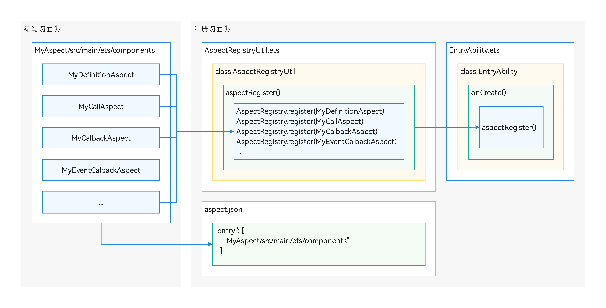
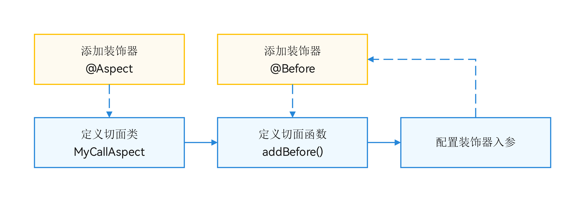
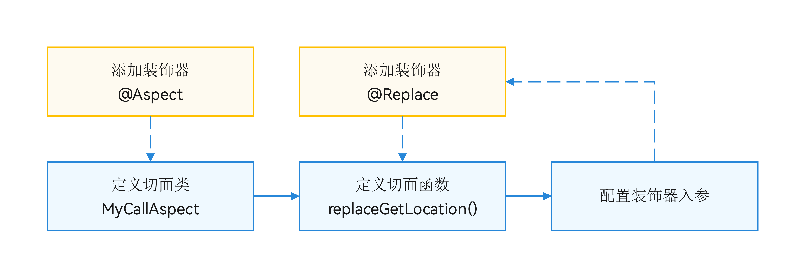

# 基于Aspect插件库实现切面编程

更新时间：2026-05-18 00:55:31

来源：https://developer.huawei.com/consumer/cn/doc/best-practices/bpta-aspect-implements-aop

#### 概述
[Aspect](https://gitcode.com/OpenHarmony-ApplicationTPC/aspect)是面向HarmonyOS应用工程的AOP（面向切面编程）插件库，允许开发者在不修改业务核心代码的情况下，对代码进行增强。在实际开发中，开发者可以使用Aspect来模块化实现生命周期函数插桩、事件监听、API调用替换等通用功能。本文主要以实际开发中的各项场景为例，介绍Aspect插件的最佳实践。如需了解如何安装配置与快速上手，可参考[Aspect快速开始](https://gitcode.com/OpenHarmony-ApplicationTPC/aspect/blob/master/README.md)。
Aspect插件库底层对
进行了封装，帮助开发者减少对字节码查找和修改细节内容的关注，提高插桩开发效率。其主要功能特性包括：
- 装饰器标记：使用装饰器标记自定义切面类和切面方法，配置插桩任务，实现字节码插桩。
- 方法定义点插桩：支持方法定义点的前置和后置插桩。
- API调用点插桩：支持API调用点的前置、后置和替换插桩。
- UI组件交互事件插桩：支持UI组件交互事件回调函数的前置和后置插桩。
- API异步回调插桩：支持API异步回调函数的前置、后置和替换插桩。
在开始之前，建议了解HarmonyOS应用开发基础并准备好HarmonyOS开发环境和项目工程。
本文主要内容如下：
- [开发流程](#section2075611281159)：介绍所有场景通用的开发流程。
- [不同场景的切面类开发](#section7558828115214)：通过实际开发中的场景，介绍Aspect插件的基本使用方法。ArkUI组件生命周期函数埋点隐私API调用监控API调用点替换增强API Promise.then回调函数替换UI组件事件监听

#### 开发流程
开发者要使用Aspect插件对HarmonyOS工程进行插桩，需要进行编写切面类和注册切面类两个步骤。其中切面类的编写会因场景不同而略有差异，本文将在[不同应用场景的切面类开发](#section7558828115214)中详细介绍。



#### 编写切面类
切面类可以写在工程源码的模块里，也可以写在另外创建的自定义模块里。此处的切面类选择写在自定义MyAspect模块里。

```ts
.
├──entry/src/main/ets                 // entry模块
│  └──... 
├──MyAspect/src/main/ets              // MyAspect模块
│  ├──aop                             // 各类切面逻辑实现
│  │  ├──call 
│  │  │  └──MyCallAspect.ets          // 方法调用点切面
│  │  ├──callback 
│  │  │  └──MyCallbackAspect.ets      // Promise.then回调切面
│  │  ├──definition 
│  │  │  └──MyDefinitionAspect.ets    // 方法定义点切面
│  │  └──eventcallback 
│  │     └──MyEventCallbackAspect.ets // 事件回调切面
│  └──AspectRegistryUtil.ets          // 切面注册工具
├──aspect.json                        // aspect配置文件
├──...
└──README.md
```

#### 注册切面类
切面类编写完成后，需要进行注册才可以生效，原因是源码在编译构建过程中，如果文件（这里为声明的切面类）未被引用，编译器的优化操作会导致字节码中不包含该文件内容。
注册流程如下：
1. 在切面类文件的同一个模块下，添加文件AspectRegistryUtil.ets。
2. 在AspectRegistryUtil.ets中定义一个函数aspectRegister()。
3. 在aspectRegister()中，使用AspectRegistry.register()注册切面类。// Step 1: Create file MyAspect/src/main/ets/AspectRegistryUtil.ets
import { AspectRegistry } from '@hadss/aspect';
import { MyCallAspect } from './aop/call/MyCallAspect';
import { MyCallbackAspect } from './aop/callback/MyCallbackAspect';
import { MyDefinitionAspect } from './aop/definition/MyDefinitionAspect';
import { MyEventCallbackAspect } from './aop/eventcallback/MyEventCallbackAspect';

// Step 2: Declare a function aspectRegister()
export function aspectRegister(): void {
  // Step 3: Register Aspect classes
  AspectRegistry.register(MyDefinitionAspect);
  AspectRegistry.register(MyCallAspect);
  AspectRegistry.register(MyCallbackAspect);
  AspectRegistry.register(MyEventCallbackAspect);
}
4. 在目标模块的EntryAbility.ets中引入aspectRegister()，并在onCreate()中调用。这里主要是确保编译构建时未被引用的切面类能够编译进字节码文件中。onCreate(want: Want, launchParam: AbilityConstant.LaunchParam): void {
  aspectRegister(); // Step 4: call aspectRegister
  try {
 this.context.getApplicationContext().setColorMode(ConfigurationConstant.ColorMode.COLOR_MODE_NOT_SET);
  } catch (err) {
 Logger.error(TAG, `Failed to set colorMode. Cause: ${JSON.stringify(err)}`);
  }
  HMRouterMgr.init({ context: this.context });
  Logger.info(TAG, 'Ability onCreate');
}
5. 在项目根目录配置aspect.json，如果文件不存在需要手动创建。{ProjectRootDir} 
. 
├── ... 
├── build-profile.json5 
├── oh-package.json5 
└── aspect.json  其中key值对应插桩目标模块名（通常为entry或hsp模块），value值对应切面类路径的列表。 // aspect.json 
{ 
  "entry": [ 
 "MyAspect/src/main/ets/aop" 
  ] 
}

#### 不同应用场景的切面类开发
#### ArkUI组件生命周期函数埋点
**场景描述**
开发者可以在目标方法的定义点插入切面方法的调用。例如，此处将对自定义组件CompA的生命周期函数aboutToAppear()方法进行前置插桩。插桩后，相当于在aboutToAppear()方法体首行前插入了MyDefinitionAspect.addBefore(joinPoint)的调用语句。
以下是定义点ArkTS源码示例：

```ArkTS
@Component
struct CompA {
  @StorageLink('logList') logList: string[] = [];

  aboutToAppear(): void {
    // Aspect will insert here: MyDefinitionAspect.addBefore(joinPoint)
    this.logList.push(ResourceUtil.getFormatString(this.getUIContext(), $r('app.string.card_definition_aboutToAppear'),
      TimeUtil.getNowWithHMS()));
  }

  build() {
    Column() {
      Button(`CompA`)
        .stateStyles({
          normal: {
            .backgroundColor($r('sys.color.comp_background_tertiary'))
            .fontColor($r('sys.color.font_emphasize'))
          }
        })
        .attributeModifier(new ButtonStyles())
    }
  }
}
```

**开发步骤**


1. 定义类MyDefinitionAspect，添加装饰器@Aspect将其标记为切面类。
2. 在切面类MyDefinitionAspect中定义方法addBefore()，使用@Before将其标记为前置插桩切面方法。
3. 配置装饰器的入参，以便在目标API方法体首行插入切面逻辑。装饰器入参配置： insertType: InsertType.DEFINITION：指定切面插入类型为定义点。scan：配置定义点的扫描范围，指定模块、路径、类和指定方法。 代码如下： @Before({
  insertType: InsertType.DEFINITION,
  scan: {
 module: 'entry',
 path: 'src/main/ets/pages/definition/DefinitionBefore',
 className: 'CompA',
 methodName: 'aboutToAppear'
  }
})
static addBefore(joinPoint: JoinPoint): void {
  let logList: string[] = AppStorage.get<Array&lt;string&gt;>('logList') ?? [];
  logList.push(ResourceUtil.getFormatStringWithoutContext(\$r('app.string.card_definition_before'),
 TimeUtil.getNowWithHMS()));
  logList.push(ResourceUtil.getFormatStringWithoutContext(\$r('app.string.card_location_params_list'),
 joinPoint?.className ?? '', joinPoint.moduleName ?? ''));
  MyDefinitionAspect.logListLink = AppStorage.link('logList');
  MyDefinitionAspect.logListLink.set(logList);
}

#### 隐私API调用监控
**场景描述**
开发者可以在目标API的调用点插入切面方法的调用。例如，此处将对隐私API geoLocationManager.getCurrentLocation()的调用点进行前置插桩，以监控位置信息的调用情况。插桩后，相当于在调用该方法的代码行之前插入了MyCallAspect.addBefore(joinPoint)。
以下是调用点ArkTS源码示例：

```ArkTS
getLocation(): void {
  const request: geoLocationManager.SingleLocationRequest = {
    locatingPriority: geoLocationManager.LocatingPriority.PRIORITY_LOCATING_SPEED,
    locatingTimeoutMs: CommonConstants.LOCATING_TIMEOUT_MS
  };
  this.logList.push(ResourceUtil.getFormatString(this.getUIContext(), $r('app.string.card_location_start'),
    TimeUtil.getNowWithHMS()));
  // Aspect will insert here: MyCallAspect.addBefore(joinPoint)
  geoLocationManager.getCurrentLocation(request).then((location: geoLocationManager.Location) => {
    this.longitude = location.longitude;
    this.latitude = location.latitude;
    this.logList.push(ResourceUtil.getFormatString(this.getUIContext(), $r('app.string.card_location_then'),
      TimeUtil.getNowWithHMS()));
  }).catch((err: BusinessError) => {
    Logger.error(TAG, `getLocation failed, code: ${err.code}, message: ${err.message}`);
    LocationErrorUtil.locationFailedAlert(this.getUIContext(), err.code);
  });
  this.logList.push(ResourceUtil.getFormatString(this.getUIContext(), $r('app.string.card_location_end'),
    TimeUtil.getNowWithHMS()));
}
```

**开发步骤**


1. 定义类MyCallAspect，添加装饰器@Aspect将其标记为切面类。
2. 在切面类MyCallAspect中定义方法addBefore()，使用@Before将其标记为前置插桩切面方法。
3. 配置装饰器的入参，以便在目标API调用前插入切面逻辑。装饰器入参配置： insertType: InsertType.CALL：指定切面插入类型为调用点。scan：配置调用点的扫描范围，指定模块和路径。api：配置目标API，包括模块、导入名称和方法名称。 代码如下： @Before({
  insertType: InsertType.CALL,
  scan: {
 module: 'entry',
 path: 'src/main/ets/pages/call/CallBefore',
  },
  api: {
 module: '@ohos:geoLocationManager',
 importName: 'geoLocationManager',
 functionName: 'getCurrentLocation',
  }
})
static addBefore(joinPoint: JoinPoint): void {
  let logList: string[] = AppStorage.get<Array&lt;string&gt;>('logList') ?? [];
  logList.push(ResourceUtil.getFormatStringWithoutContext(\$r('app.string.card_location_before'),
 TimeUtil.getNowWithHMS()));
  logList.push(ResourceUtil.getFormatStringWithoutContext(\$r('app.string.card_location_params_list'),
 joinPoint?.className ?? '', joinPoint.moduleName ?? ''));
  MyCallAspect.logListLink = AppStorage.link('logList');
  MyCallAspect.logListLink.set(logList);
}

#### API调用点替换增强
**场景描述**
开发者可以在不修改业务代码的前提下，以原API调用点为切入点，将目标API替换为切面方法。
示例中，对CallbackReplacePage类中的getLocation()方法里geoLocationManager.getCurrentLocation()的方法进行替换。替换后，相当于将geoLocationManager.getCurrentLocation()方法的代码换成MyCallAspect.replaceGetLocation()。
以下是调用点ArkTS源码示例：

```ArkTS
getLocationAddress(): void {
  this.logList.push(ResourceUtil.getFormatString(this.getUIContext(), $r('app.string.card_location_start'),
    TimeUtil.getNowWithHMS()));
  // Aspect will replace: entire statement geoLocationManager.getCurrentLocation with MyCallAspect.replaceGet(this.request)
  geoLocationManager.getCurrentLocation(this.request).then((location: geoLocationManager.Location) => {
    this.longitude = location.longitude;
    this.latitude = location.latitude;
    this.logList.push(ResourceUtil.getFormatString(this.getUIContext(), $r('app.string.card_location_then'),
      TimeUtil.getNowWithHMS()));
  }).catch((err: BusinessError) => {
    Logger.error(TAG, `getLocationAddress failed, code: ${err.code}, message: ${err.message}`);
    LocationErrorUtil.locationFailedAlert(this.getUIContext(), err.code);
  });
  this.logList.push(ResourceUtil.getFormatString(this.getUIContext(), $r('app.string.card_location_end'),
    TimeUtil.getNowWithHMS()));
}
```

**开发步骤**


1. 定义类MyCallAspect，添加装饰器@Aspect将其标记为切面类。
2. 在切面类MyCallAspect中定义方法replaceGetLocation()，使用@Replace将其标记为替换插桩切面方法。 切面方法的参数和返回类型需要与目标方法保持一致。
3. 配置装饰器的入参，以便将目标API调用替换为切面方法。装饰器入参配置： insertType: InsertType.CALL：指定切面插入类型为调用点。scan：配置调用点的扫描范围，指定模块和路径。api：配置目标API，包括模块、导入名称和方法名称。 代码如下： @Replace({
  insertType: InsertType.CALL,
  scan: {
 module: 'entry',
 path: 'src/main/ets/pages/call/CallReplace',
  },
  api: {
 module: '@ohos:geoLocationManager',
 importName: 'geoLocationManager',
 functionName: 'getCurrentLocation',
  }
})
static async replaceGetLocation(request?: geoLocationManager.CurrentLocationRequest
  | geoLocationManager.SingleLocationRequest): Promise&lt;geoLocationManager.Location&gt; {
  let logList: string[] = AppStorage.get<Array&lt;string&gt;>('logList') ?? [];
  logList.push(ResourceUtil.getFormatStringWithoutContext(\$r('app.string.card_location_replace'),
 TimeUtil.getNowWithHMS(), 31.2304, 121.4737));
  // Return sample data
  return Promise.resolve({
 longitude: 121.4737,
 latitude: 31.2304,
 altitude: 5.0,
 accuracy: 10.0,
 timeStamp: new Date().getTime(),
 direction: 0,
 speed: 0
  } as geoLocationManager.Location);
}

#### API Promise.then回调函数替换
**场景描述**
开发者可以将Promise对象异步调用的then()/catch()回调函数替换为切面方法。例如，对geoLocationManager.getCurrentLocation().then()的回调函数进行替换插桩。插桩后，相当于该回调函数的代码逻辑替换为了MyCallbackAspect.getAddress()。
以下是ArkTS源码示例：

```ArkTS
getLocation(): void {
  // Aspect will replace: entire statement in getCurrentLocation.then() with MyCallbackAspect.getAddress(location)
  geoLocationManager.getCurrentLocation(this.request).then((location: geoLocationManager.Location) => {
    this.longitude = location.longitude;
    this.latitude = location.latitude;
    this.logList.push(ResourceUtil.getFormatString(this.getUIContext(), $r('app.string.card_location_get'),
      TimeUtil.getNowWithHMS()));
  }).catch((err: BusinessError) => {
    Logger.error(TAG, `getLocationAddress failed, code: ${err.code}, message: ${err.message}`);
    LocationErrorUtil.locationFailedAlert(this.getUIContext(), err.code);
  });
}
```

**开发步骤**


1. 定义类MyCallbackAspect，添加装饰器@Aspect将其标记为切面类。
2. 在切面类MyCallbackAspect中定义方法getAddress()，使用@Replace将其标记为替换插桩切面方法。 切面方法的参数和返回类型需要与目标方法保持一致。
3. 配置装饰器的入参，以便将目标异步回调函数替换为切面方法。装饰器入参配置： insertType: InsertType.CALLBACK：指定切面插入类型为异步回调函数。scan：配置异步回调函数的扫描范围，指定模块和路径。api：配置目标API，包括模块、导入名称和方法名称。 代码如下： @Replace({
  insertType: InsertType.CALLBACK,
  scan: {
 module: 'entry',
 path: 'src/main/ets/pages/callback/CallbackReplace',
  },
  api: {
 module: '@ohos:geoLocationManager',
 importName: 'geoLocationManager',
 functionName: 'getCurrentLocation.then',
  }
})
static getAddress(location: geoLocationManager.Location): void {
  let logList: string[] = AppStorage.get<Array&lt;string&gt;>('logList') ?? [];
  logList.push(ResourceUtil.getFormatStringWithoutContext(\$r('app.string.card_location_callback_replace'),
 TimeUtil.getNowWithHMS()));
  try {
 const reverseGeocodeRequest: geoLocationManager.ReverseGeoCodeRequest = {
 latitude: location.latitude,
 longitude: location.longitude,
 maxItems: 1
 };
 geoLocationManager.getAddressesFromLocation(reverseGeocodeRequest, (err, data) => {
 if (data) {
 const address: string = data[0]?.placeName || '';
 logList.push(ResourceUtil.getFormatStringWithoutContext(\$r('app.string.card_location_callback_replace_address'),
 address));
 } else {
 hilog.error(0xFF00, 'MyAspect',
 `getAddressesFromLocation failed, code: ${err?.code}, message: ${err?.message}`);
 }
 });
  } catch (error) {
 hilog.error(0xFF00, 'MyAspect', `getAddress failed, code: ${error.code}, message: ${error.message}`);
  }
}

#### UI组件事件监听
**场景描述**
开发者可以在基于ArkUI的组件（例如Button，Text）的事件回调函数（例如onClick()，onTouch()）内插入切面方法的调用。
示例中，此处对EventCallbackBeforePage类的Button组件下onClick()事件进行前置插桩，相当于在onClick()回调函数首行插入了MyEventCallbackAspect.addBefore(JoinPoint)。
ArkTS源码如下所示：

```ArkTS
Button($r('app.string.event_onclick'))
  .attributeModifier(new ButtonStyles())
  .onClick(() => {
    // Aspect will insert here: MyEventCallbackAspect.addBefore(joinPoint)
    this.logList.push(ResourceUtil.getFormatString(this.getUIContext(), $r('app.string.card_callback_click'),
      TimeUtil.getNowWithHMS()));
  });
```

**开发步骤**


1. 定义类MyEventCallbackAspect，添加装饰器@Aspect将其标记为切面类。
2. 在切面类MyEventCallbackAspect中定义方法addBefore()，使用@Before将其标记为前置插桩切面方法，其中切面方法就是实际监听的业务代码。
3. 配置装饰器的入参，以便在目标API调用前插入切面逻辑。装饰器入参配置： insertType: InsertType.EVENT_CALLBACK：指定切面插入类型为事件回调。scan：配置调用点的扫描范围，指定模块和路径。event：配置目标事件，包括组件名、事件名称。 代码如下： @Before({
  insertType: InsertType.EVENT_CALLBACK,
  scan: {
 module: 'entry',
 path: 'src/main/ets/pages/eventcallback/EventCallbackBefore',
  },
  event: {
 component: 'Button',
 eventFunction: 'onClick',
  }
})
static addBefore(joinPoint: JoinPoint): void {
  let logList: string[] = AppStorage.get<Array&lt;string&gt;>('logList') ?? [];
  logList.push(ResourceUtil.getFormatStringWithoutContext(\$r('app.string.card_event_callback_before'),
 TimeUtil.getNowWithHMS()));
  logList.push(ResourceUtil.getFormatStringWithoutContext(\$r('app.string.card_location_params_list'),
 joinPoint?.className ?? '', joinPoint.moduleName ?? ''));
  MyEventCallbackAspect.logListLink = AppStorage.link('logList');
  MyEventCallbackAspect.logListLink.set(logList);
}

#### 总结
本文主要介绍了开发者如何使用Aspect插件库，通过编写和注册切面类，实现不同场景下的字节码插桩。其核心在于根据不同场景的需要编写切面类、切面方法，并配置相应的装饰器入参。如需进一步了解如何使用Aspect插件库，可以参考以下文档：
- [装饰器使用指南](https://gitcode.com/OpenHarmony-ApplicationTPC/aspect/blob/master/docs/AnnotationGuide.md)
- [常见问题](https://gitcode.com/OpenHarmony-ApplicationTPC/aspect/blob/master/docs/FAQ.md)
- [获取切入点上下文信息](https://gitcode.com/OpenHarmony-ApplicationTPC/aspect/blob/master/docs/JoinPointGuide.md)
- [从源码构建插件](https://gitcode.com/OpenHarmony-ApplicationTPC/aspect/blob/master/docs/BuildFromSource_win.md)

#### 示例代码
[基于Aspect插件库实现切面编程](https://gitcode.com/HarmonyOS_Samples/aspect/tree/master)