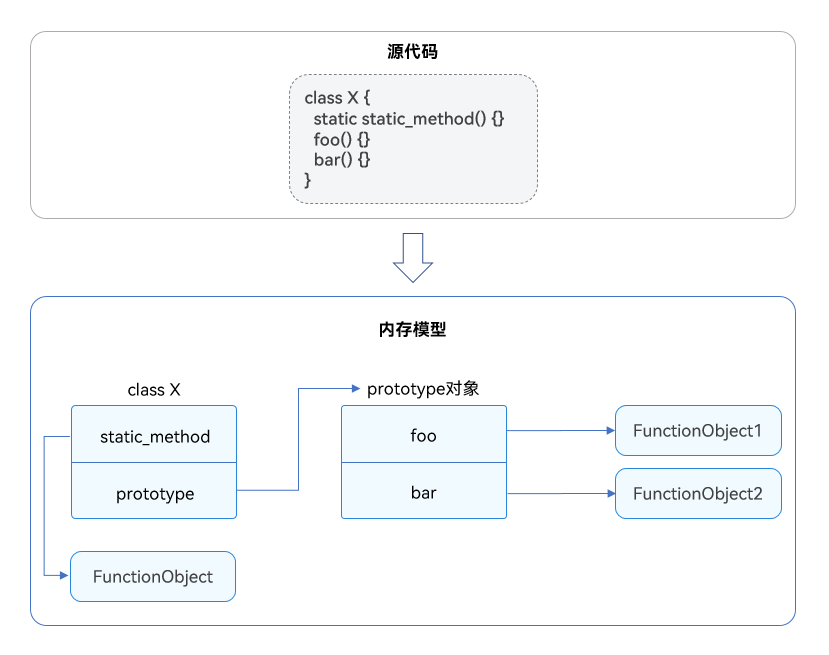
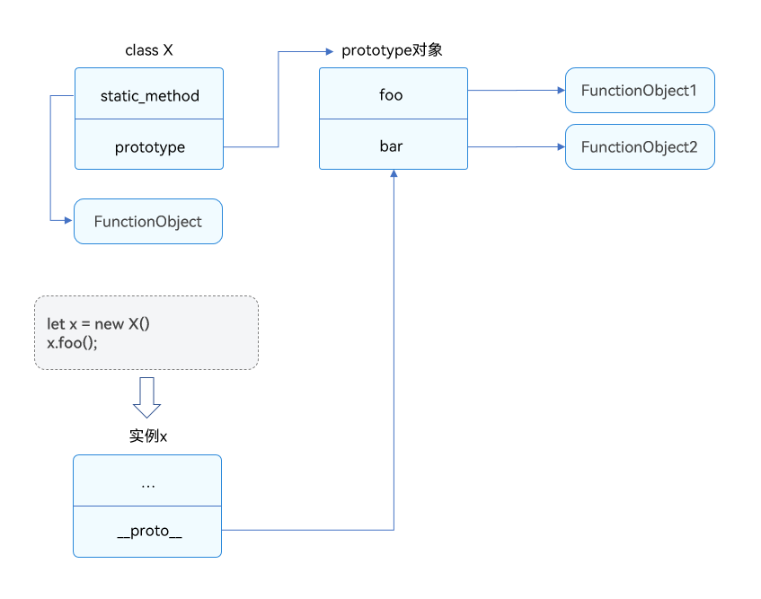
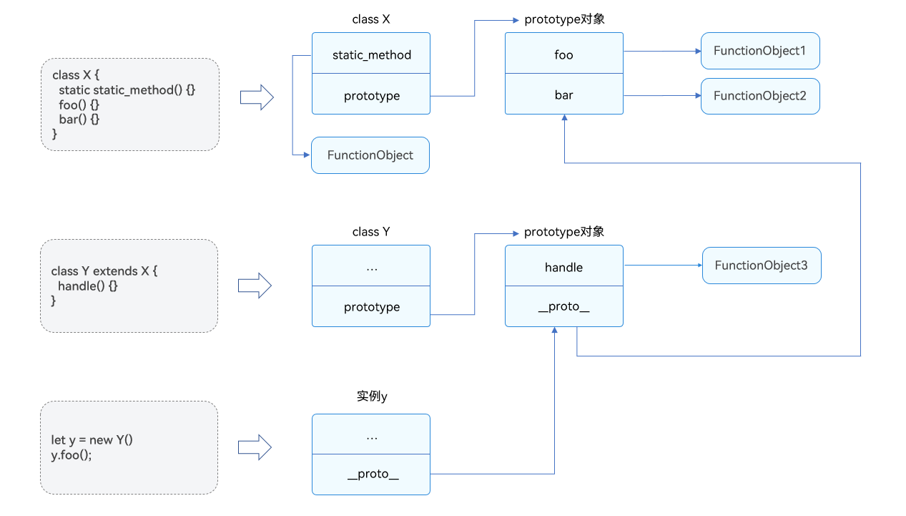
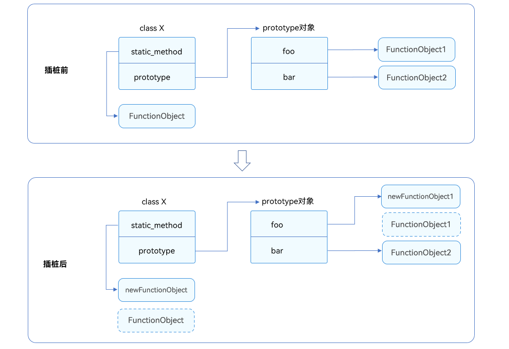

# 应用切面编程设计

更新时间：2026-03-12 08:45:02

来源：https://developer.huawei.com/consumer/cn/doc/best-practices/bpta-application-aspect-programming-design

## 概述


切面编程（AOP）通过预编译和运行期间的动态代理来实现程序功能的统一维护。AOP将程序的关注点分离，通过插入代码实现横切关注点，从而隔离业务逻辑的各个部分，降低耦合度，提高可维护性和可重用性，进而提升开发效率。

在AOP中，定义切面（aspect）封装横切关注点，无需直接修改业务逻辑代码。这种方式在不修改源代码的前提下添加功能，常用于剥离业务代码和非业务代码，如参数校验、日志记录、性能统计等，以实现更好的代码解耦。

HarmonyOS主要通过插桩机制来实现切面编程，并提供了Aspect类，该类包含addBefore()、addAfter()和replace()接口。这些接口允许在运行时对类方法进行前置插桩、后置插桩和替换实现，为开发者提供了更加灵活的操作方式。在具体业务场景中，不同的需求可能需要不同的埋点功能和日志记录。通过调用addBefore()、addAfter()和replace()接口，可以实现对类方法的各种功能增强和定制化需求：

- [方法参数校验](#section087691214917)，可以在方法执行前或执行后进行参数校验，确保参数和返回值的合法性。
- [统计方法执行次数、时间](#section2641205324412)，可以在方法执行前后插入统计逻辑，记录执行时间和次数。通过组合使用addBefore()和addAfter()接口，可以方便地实现方法执行情况的监控和统计，为性能优化提供数据支持。
- [校验方法返回值](#section1160718122503)，可以对方法的返回值进行校验。在addAfter()的回调参数中，第二个参数为原方法的返回值，可校验该返回值。
- [在方法中校验成员变量](#section9742181635910)，在方法执行时，检查成员变量以确保数据完整和准确，从而及时发现并处理潜在问题。
- [替换方法实现](#section188512613119)，使用AOP的replace()接口，动态替换原有方法的实现逻辑。这种机制可在不改变原有方法调用的情况下，实现方法功能的替换或增强，便于项目功能扩展。
- [替换子类继承的方法实现](#section7971133114214)，可以利用replace()接口以子类为targetClass参数，替换子类方法的实现。
- [拉起应用时获取目标包名信息](#section636212218413)，可以在应用启动时获取并记录目标包名信息。通过调用addBefore()接口，实现应用启动过程的监控和记录，为性能优化和故障排查提供帮助。
- [对系统SDK的接口插桩](#section8383163112217)，通过使用addBefore()接口，可以对系统SDK的接口进行插桩或者替换。


本文将介绍对应接口的基本原理，并具体说明如何在上述业务场景中使用运行时插桩接口对类方法进行埋点和添加日志。


## 插桩原理介绍


addBefore()、addAfter()、replace()接口的原理基于class的ECMAScript语义，即类的静态方法是类的属性，类的实例方法是类的原型对象(prototype)的属性。

图1 class的ECMAScript语义示意




### 原理解析


类的实例有一个属性__proto__（称为原型），它是指向类的prototype的引用，如图2所示。实例调用方法时，会通过__proto__找到类的prototype，再在prototype中找到方法并执行。类的原型对象prototype被所有实例共享，因此修改原型对象中的方法会影响所有实例。

图2 类的实例化示意




原型对象也有原型_proto_。类的继承通过原型实现。实例方法调用时，会在原型链上查找方法，找到后执行调用。具体如图3所示。

图3 类的原型与继承




插桩和替换的操作是将回调参数与原方法组合成新函数，再用新函数替换原方法。具体如图4所示。

图4 插桩和替换原理示意图




### 接口原理的伪代码示例


addBefore: 类方法前插桩

```ts
// Instrument before class method execution
static addBefore(targetClass, methodName, isStatic, before): void {
  let target =  isStatic ? targetClass : targetClass.prototype;
  let origin = target[methodName];
  // Define a new function that first executes "before" and then executes the old method.
  let newFunc = function (...args) {
    before(this, ...args);
    return origin.bind(this)(...args);
  }
  // Replace the method with a new function
  target[methodName] = newFunc;
}
```

addAfter: 类方法后插桩

```ts
// Instrument after class method execution
static addAfter(targetClass, methodName, isStatic, after) : void {
  let target =  isStatic ? targetClass : targetClass.prototype;
  let origin = target[methodName];
  // Define a new function that first executes the old method, then executes after.
  let newFunc = function (...args) {
    let ret = origin.bind(this)(...args);
    return after(this, ret, ...args);
  }
  // Replace the method with a new function
  target[methodName] = newFunc;
}
```

replace: 替换类方法

```ts
static replace(targetClass, methodName, isStatic, instead) : void {
  let target =  isStatic ? targetClass : targetClass.prototype;
  // Define a new function that only executes "instead" inside.
  let newFunc = function (...args) {
    return instead(this, ...args);
  }
  // Replace the method with a new function
  target[methodName] = newFunc;
}
```


## 场景1：方法参数校验


业务开发团队忽略了参数的合法性，运维团队发现了这一问题，需要紧急修复。由于让业务开发团队修改的流程较为复杂，运维团队决定临时通过插桩的方式为方法添加参数合法性校验的逻辑。

业务开发团队开发了基础能力模块，并将能力封装在类A中。在应用集成基础能力模块时，发现需要对类A的方法加入参数校验逻辑，以应对非法输入。因此，运维团队决定在临时修复过程中，通过插桩的方式临时添加参数合法性校验逻辑，以确保系统的稳定性和安全性。


### 场景描述


在addBefore()接口的回调参数中，可以访问原方法的参数，因此可以利用addBefore()在方法前插入参数校验逻辑。这是运行时行为，需要在addBefore()执行后生效，通常在应用入口调用该接口进行插桩。


### 开发步骤


1. 在class A中，封装其基础能力，此处为获取数组指定下标的元素。
```ts
// baseAbility.ts
export class A {
  getElementByIndex<T>(arr: Array<T>, idx: number): T {
    return arr[idx];
  }
}
```
2. 在主界面中集成基础能力，并校验参数类型、判断下标是否越界。
```ts
// index.ets
import { util } from '@kit.ArkTS';
import { A } from '../components/baseAbility';

@Entry
@Component
struct Index {
  build() {
    // UI code
  }
}

util.Aspect.addBefore(A, 'getElementByIndex', false,
// Check the parameters
(instance: A, arr: Object, idx: number) => {
  if (!(arr instanceof Array)) {
    throw Error('arg arr is expected to be an array');
  }
  if (!(Number.isInteger(idx) && idx >= 0)) {
    throw Error('arg idx is expected to be a non-negative integer');
  }
  if (idx >= arr.length) {
    throw Error('arg idx is expected to be smaller than arr.length');
  }
});
// The original method is executed
let buffer: Array<number> = [1, 2, 3, 5];
let that = new A();
that.getElementByIndex(buffer, -1);
that.getElementByIndex(buffer, 5);
that.getElementByIndex(123 as Object as Array<number>, 5)
```


## 场景2：统计方法执行次数、时间


在性能分析或调试场景中，性能管控团队需统计应用运行过程中调用某个方法的次数或执行时间。如果要求业务开发团队临时修改源代码并重新打包，效率低下且业务团队可能无法提供足够的人力支持。因此，性能管控团队需临时插入一个插桩，以获取所需信息。


### 场景描述


在方法前插入调用次数自增的逻辑，addBefore()可用于统计调用次数。执行时间统计时，使用addBefore()记录开始时间，addAfter()记录结束时间。

利用闭包变量或覆盖每次执行的变量存储执行次数和时间。


### 开发步骤


1. 统计执行次数。
```ts
// somePackage.ets
export class Test {
  foo() {}
}
```

```ts
// index.ets
import { util } from '@kit.ArkTS';
import { Test } from '../components/somePackage';

@Entry
@Component
struct Index {
  build() {
    // UI code
  }
}
util.TextDecoder.toString();
// increment call count
let countFoo = 0;
util.Aspect.addBefore(Test, 'foo', false, () => {
  countFoo++;
});
// Invoke and print logs
new Test().foo();
console.log('countFoo = ', countFoo);
// [LOG]: "countFoo = ", 1
let a = new Test();
a.foo()
console.log('countFoo = ', countFoo);
// [LOG]: "countFoo = ", 2
function bar(a: Test) {
  a.foo();
  console.log('countFoo = ', countFoo);
  new Test().foo();
  console.log('countFoo = ', countFoo);
}
bar(a);
// [LOG]: "countFoo = ", 3
// [LOG]: "countFoo = ", 4
console.log('countFoo = ', countFoo);
// [LOG]: "countFoo = ", 4
```
2. 统计执行时间。
```ts
// somePackage1.ets
export class Test1 {
  doSomething() {
    // instance method
    // ...
  }
  static test() {
    // static method
    // ...
  }
}
```

```ts
// index2.ets
import {util} from '@kit.ArkTS';
import { Test1 } from '../components/somePackage1';

@Entry
@Component
struct Index {
  build() {
    // UI code
  }
}
// Print the time before and after the insertion, and encapsulate the insertion action into an interface
function addTimePrinter(targetClass: Object, methodName: string, isStatic: boolean) {
  let t1 = 0;
  let t2 = 0;
  util.Aspect.addBefore(targetClass, methodName, isStatic, () => {
    t1 = new Date().getTime();
  });
  util.Aspect.addAfter(targetClass, methodName, isStatic, () => {
    t2 = new Date().getTime();
    console.log("t2---t1 = " + (t2 - t1).toString());
  });
}
// Add the logic for printing the execution time to the doSomething instance method of Test
addTimePrinter(Test1, 'doSomething', false);
new Test1().doSomething()
// Add the logic for printing the execution time to the test static method of the test
addTimePrinter(Test1, 'test', true);
Test1.test()
```


> [!NOTE]
> 不推荐使用该方式统计多个线程执行的函数，以免造成方法次数变量或执行时间变量的写冲突。


## 场景3：校验方法返回值


在应用中使用三方库提供的方法时，建议对方法的返回值进行校验。


### 场景描述


在addAfter的回调参数中，第二个参数为原方法的返回值，可校验该返回值。


> [!NOTE]
> addAfter回调返回值会代替原方法的返回值。


### 开发步骤


1. 对三方库方法返回的网址进行校验，校验不通过的抛出异常。
```ts
// someThirdParty.ets
export class WebHandler {
  getWebAddrHttps(): string {
    let ret = 'http';
    // ...
    return ret;
  }
}
```

```ts
// index.ets
import {util} from '@kit.ArkTS';
import { WebHandler } from '../components/someThirdParty';

@Entry
@Component
struct Index {
  build() {
    // UI code
  }
}
util.Aspect.addAfter(WebHandler, 'getWebAddrHttps', false, (instance: WebHandler, ret: string) => {
  if (!ret.startsWith('https')) {
    throw Error('Handler\'s method \'getWebAddrHttps\': return value does not start with \'https\'');
  }
  // Verification is correct, remember to return the original method's return value.
  return ret;
});
new WebHandler().getWebAddrHttps();
```


## 场景4：在方法中校验成员变量


在方法执行时，检查成员变量以确保数据完整和准确，从而及时发现并处理潜在问题。


### 场景描述


在addBefore()的回调参数中，第一个参数是原方法的this对象，可以获取成员变量或调用成员方法，实现对成员变量的实时监测和校验。


### 开发步骤


1. 在getInfo()方法中校验Person类的name和age属性是否正常。
```ts
// somePackage.ets
export class Person {
  name: string;
  age: number;
  constructor(n: string, a: number) {
    this.name = n;
    this.age = a;
  }
  getInfo(): string {
    return 'name: ' + this.name + ', ' + 'age: ' + this.age.toString();
  }
}
```

```ts
// index.ets
import {util} from '@kit.ArkTS';
import { Person } from '../components/somePackage';

@Entry
@Component
struct Index {
  build() {
    // UI code
  }
}
// Verify the name and age members
util.Aspect.addBefore(Person, 'getInfo', false, (instance: Person) => {
  if (instance.name.length == 0) {
    throw Error('empty name');
  }
  if (instance.age < 0) {
    throw Error('invalid age');
  }
});
new Person('c', -1).getInfo();
```


## 场景5：替换方法实现


在特定情况下需要对原方法进行替换，以确保应用程序的正常运行和性能优化。例如，方法的实现调用了禁用的接口，或者方法的性能表现不佳需要进行改进。


### 场景描述


replace()的第四个参数是回调函数，该回调函数会代替原方法执行。回调函数的第一个参数是this对象，从第二个参数开始依次是原方法的参数。通过replace()的回调参数，可以获取原方法的所有执行上下文，从而实现对原方法执行过程的全面控制和定制。


### 开发步骤


1. 修改foo()方法中的打印日志。
```ts
export class Test2 {
  foo(arg: string) {
    console.log(arg);
  }
}
```

```ts
// index.ets
import {util} from '@kit.ArkTS';
import { Test2 } from '../components/somePackage';

@Entry
@Component
struct Index {
  build() {
    // UI code
  }
}
new Test2().foo('123');
// [LOG]: "123"
// replace the original method
util.Aspect.replace(Test2, 'foo', false, (instance: Test2, arg: string) => {
  console.log(arg + ' __replaced implementation');
});
new Test2().foo('123');
// [LOG]: "123 __replaced implementation"
```


## 场景6：替换子类继承的方法实现


子类调用父类方法时，如果需要修改子类的方法实现，应确保不影响父类，从而避免影响其他继承该父类的子类。


### 场景描述


利用replace()接口以子类为targetClass参数，替换子类方法的实现。

这一操作的底层原理是基于JavaScript的原型链机制。通过replace()接口，新函数会被放置到子类的原型上。这样当执行子类的方法时，原型链机制会首先在子类原型上查找新函数来执行，而不会执行父类的方法，也不会影响到父类的其他子类。


### 案例一：替换子类一方法实现


1. Base有两个子类Child1和Child2，两个子类都继承了foo()方法。需要修改Child1的foo()的实现，但不影响Base和Child2的foo()方法。
```ts
// base.ets
export class Base {
  foo() {
    console.log('hello');
  }
}
```

```ts
// child1
import { Base } from './base';
export class Child1 extends Base {}
```

```ts
// child.ets
import { Base } from './base';
export class Child extends Base {
  // Inherit the getCurrentLocation method of the parent class
}
```


### 案例二：获取实时位置信息


1. Child类继承了Base类的获取实时位置方法，但测试发现Child类的getCurrentLocation()方法在实际场景中调用非常频繁，需要控制调用频率。采取的措施是修改Child类的getCurrentLocation()方法的实现，通过缓存位置信息来减少系统接口的调用次数。具体实现为：如果从上次调用到现在的时间不足60秒，则直接返回缓存的位置信息；否则，调用系统接口获取新的位置信息并更新缓存。
```ts
import { geoLocationManager } from '@kit.LocationKit';
export class Base1 {
  getCurrentLocation() {
    return geoLocationManager.getCurrentLocation();
  }
}
```

```ts
// child.ets
import { Base1 } from './base';
export class Child extends Base1 {
  // inherit the getCurrentLocation method from the parent class
}
```

```ts
// index.ets
import { util } from '@kit.ArkTS';
import { geoLocationManager } from "@kit.LocationKit";
import { Child } from '../components/child';

@Entry
@Component
struct Index {
  build() {
    // UIcode
  }
}
let cached_location: Object | undefined;
let time: number | undefined;
util.Aspect.replace(Child, 'getCurrentLocation', false, () => {
  let newTime = new Date().getTime();
  // Real-time location can be called at most once per minute.
  if (!cached_location || !time || newTime - time > 60000) {
    time = newTime;
    cached_location = geoLocationManager.getCurrentLocation();
  }
  // Return cached location information
  return cached_location;
});
new Child().getCurrentLocation()
```


> [!NOTE]
> 访问设备的位置信息，必须申请以下权限，并且获得用户授权：
>  ohos.permission.LOCATIONohos.permission.APPROXIMATELY_LOCATION 具体方法可参考[向用户申请授权](https://developer.huawei.com/consumer/cn/doc/harmonyos-guides/request-user-authorization)。


## 场景7：拉起应用时获取目标包名信息


在应用跳转时，需获取目标应用的包名，以实现对目标应用的识别与监控，确保跳转操作的安全性和准确性。


### 场景描述


在EntryAbility的onCreate()方法中，对UIAbilityContext类的startAbility()方法进行插桩，以获取Want参数的bundleName属性。由于UIAbilityContext是系统提供的类且没有导出，无法直接导入，因此可以通过EntryAbility的context成员（该成员从UIAbility继承而来）获取UIAbilityContext类对象，然后在onCreate()方法中完成插桩操作。这样可以实现对目标方法的监控和定制，以满足特定需求。


### 开发步骤


1. 通过类实例的constructor属性获取类对象。
```ts
// EntryAbility.ets
import { AbilityConstant, UIAbility, Want } from '@kit.AbilityKit';
import { hilog } from '@kit.PerformanceAnalysisKit';
import { util } from '@kit.ArkTS';
// Obtain the target package name
export default class EntryAbility extends UIAbility {
  onCreate(want: Want, launchParam: AbilityConstant.LaunchParam): void {
    hilog.info(0x0000, 'testTag', '%{public}s', ' onCreate');
    util.Aspect.addBefore(
      this.context.constructor,
      'startAbility',
      false,
      (instance: Object, wantParam: Want) => {
        console.info(
          'UIAbilityContext startAbility: want.bundleName is ' +
            wantParam.bundleName,
        );
      },
    );
    this.context.startAbility(want, () => {});
  }
  // Other related configurations
  // ...
}
```


## 场景8： 对系统SDK的接口插桩


应用出于业务需求，可能需要对系统SDK的接口进行插桩或者替换。util.Aspect要求被插桩的是类和类方法，因此需要确保参数是运行时存在的类。


### 场景描述


系统SDK的接口暴露有以下两种方式：

- 场景1：直接暴露类和类方法，外部通过类的实例化或者实例调用系统能力，如AppStorage、UIAbilityContext等。
- 场景2：声明namespace，并在namespace内暴露方法，如window、router等。


对于第一种场景，可以接将类名、类方法名传给util.Aspect。如果类未导出，仅有类的示例，可参考场景7，通过实例的构造方法返回传参。

对于第二种场景，应用可以将该接口自行包装成类，再使用util.Aspect进行插桩。


### 开发步骤


1. 对于场景2，以window.createWindow()插桩为例，可以将window的相关需要插桩的方法封装成包装类，再对包装类进行插桩。
```ts
// WindowWrap.ets

import { window } from '@kit.ArkUI';
import { util } from '@kit.ArkTS';

export class WindowWrap {
  private static instance: WindowWrap = new WindowWrap();

  private constructor() {}

  public static getInstance() {
    return WindowWrap.instance;
  }

  public createWindow() {
    let config: window.Configuration = {
      name: 'test',
      windowType: window.WindowType.TYPE_DIALOG,
    };
    window.createWindow(config, () => {
      // do something
    });
  }
}

util.Aspect.addBefore(
  WindowWrap,
  'createWindow',
  false,
  (instance: WindowWrap): void => {
    console.info('addBefore createWindow');
  },
);
```


## 附录：接口使用注意事项


1. 插桩的目标类通常需要导入。对于没有导出的场景，如果有实例，可以通过实例的constructor属性获取目标类。
2. 插桩的目标方法名不得混淆，以确保插桩接口的正确运行。
3. 对父类进行插桩会影响所有子类；对子类进行插桩不会影响父类（无论方法是否继承自父类），但会影响该子类的所有子类。
4. 接口的第四个参数是回调函数，回调函数的第一个参数是执行方法调用的this对象。如果通过该对象调用原方法且没有退出机制，容易导致无限递归。若需调用原方法，建议在接口调用前将其存储起来。不推荐的用法如下示例。
```ts
class Test {
  foo() {}
}
util.Aspect.addBefore(Test, 'foo', false, (instance: Test) => {
  instance.foo();
});
// Infinite recursion
new Test().foo();
```
 如果有需要调用原方法的场景，实现方法参考如下示例。
```ts
class Test {
  foo() {}
}
// Save the original method implementation first
let originalFoo = new Test().foo;
util.Aspect.addBefore(Test, 'foo', false, (instance: Test) => {
  // If the original method does not use this, you can directly call the originalFoo () method.
  // If this is used in the original method, bind should be used to bind the instance, but there will be a compilation warning originalFoo.bind (instance);
});
```


1. 不推荐对ArkUI的struct进行方法插桩、替换。因为ArkUI的struct从设计上是一种介于函数和类之间的特殊存在，在编译时会进行中间码的转换，该转换可能会导致开发态的对象、方法在运行时并不存在，导致插桩、替换失败。虽然目前struct底层实现是类，使用接口可能也不会导致编译报错，但是仍然不推荐对struct的方法插桩/替换实现，因为可能随着ArkUI的演进，底层实现会改变，从而导致一些难以预料的问题。以下代码是错误示例。
```ts
// Counterexample
@Component
struct Index {
  foo() {}
  build() {};
}

util.Aspect.replace(Index, 'foo', false, () => {
  // ...
});
util.Aspect.replace(Index, 'build', false, () => {
  // ...
});
```


1. 由于addAfter()的回调参数的返回值会劫持原方法的返回值，因此需要在回调参数中返回与原方法匹配的返回值。如果不修改返回值，请直接返回原方法的返回值（即回调参数的第二个参数）。
```ts
// Example of unrecommended usage:
class Test {
  foo(): string {
    return 'hello';
  }
}

util.Aspect.addAfter(Test, 'foo', false, () => {
  console.log('execute foo');
});

// The correct usage example is as follows:
class Test1 {
  foo(): string {
    return 'hello';
  }
}

util.Aspect.addAfter(Test1, 'foo', false, (instance: Test, ret: string) => {
  console.log('execute foo');
  return ret; // Return the return value of the original method
});
```


1. 接口不限制对系统提供的类方法进行插桩。只要类和方法在运行时是实际存在的对象，并且方法的属性描述符的writable字段为true，就可以使用对应接口进行插桩和替换。

> [!NOTE]
> 如果类方法的属性描述符的writable字段为false，比如冻结(freeze) 的场景， 则不能调用接口操作这个类方法。
>  方法的属性描述符的writable字段默认为true。


2. 使用Aspect类接口进行插桩，对AoT和JIT编译后的性能没有明显影响。
