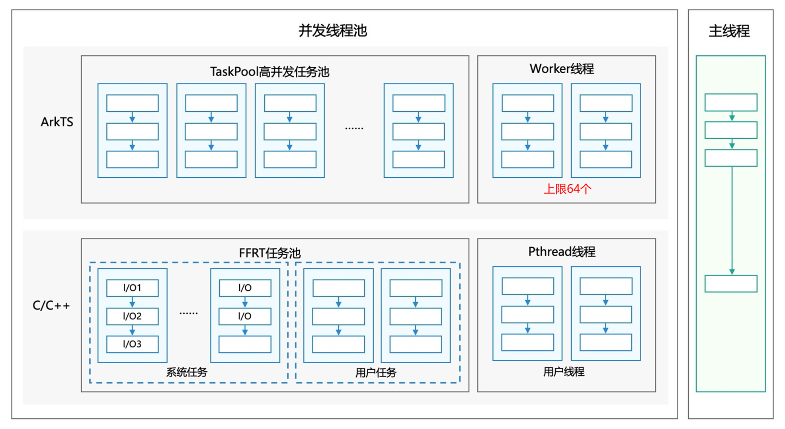
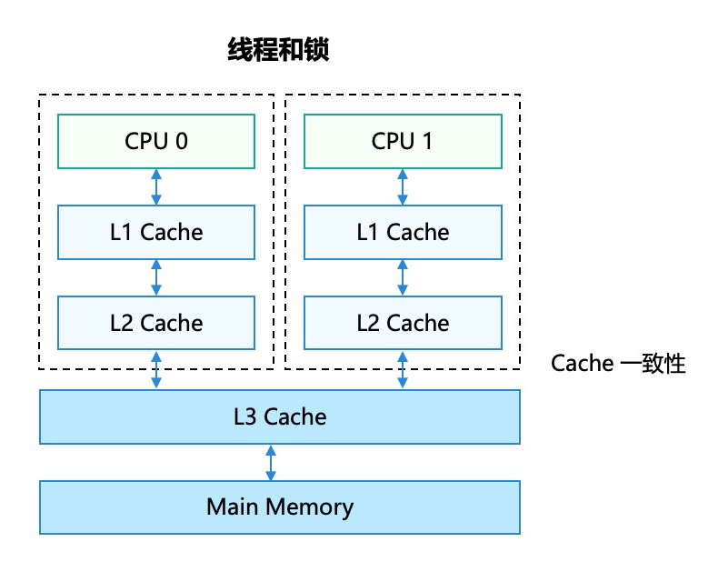
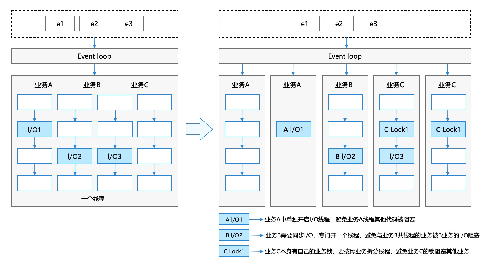
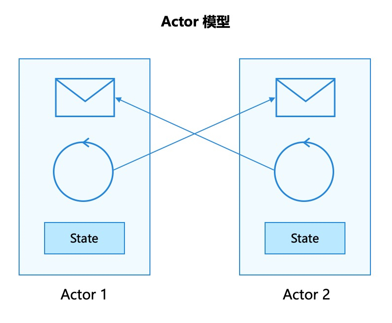
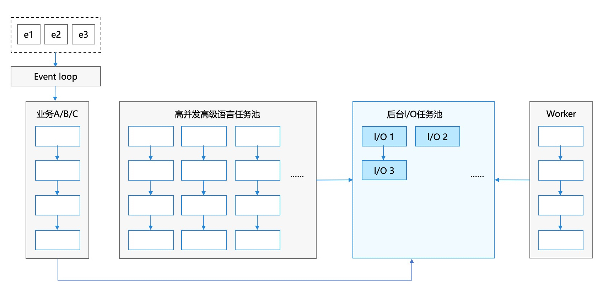

# 应用并发设计

更新时间：2026-03-12 08:45:02

来源：https://developer.huawei.com/consumer/cn/doc/best-practices/bpta-app-concurrency-design

#### 概述

 
ArkTS是HarmonyOS APP的开发语言，它在保持TypeScript（简称TS）基本语法风格的基础上，一方面规范强化静态检查提升开发者代码的规范性；另一方面基于TypeScript增强了一些特性提升开发体验和执行效率，尤其是在并发能力上的提升。
 
本文档主要面向HarmonyOS APP的设计人员或开发人员，介绍应用在并行任务方案设计过程中，可能会遇到的典型场景以及对应的推荐设计方案，同时给出了方案的关键点及参考案例。
 

#### 典型业务场景

根据当前HarmonyOS APP开发过程中遇到的实际并发业务场景，总结提炼出如下典型场景，可供更多APP参考，设计其并发业务方案。
  
| 场景编号 | 场景分类 | 场景名称 | 简述 |
| 1 | 并发能力选择 | 耗时任务并发执行场景 | 相对独立的耗时任务放到单独的子线程中执行，推荐TaskPool |
| 2 | 并发能力选择 | 常驻任务并发执行场景 | 常驻的耗时任务放到单独的子线程中执行，推荐Worker |
| 3 | 并发能力选择 | 传统共享内存并发业务 | 开发共享内存并发业务，推荐TaskPool和Worker的API |
| 4 | 并发能力选择 | 长时任务并发执行场景 | 长时间运行的任务不独占线程执行，推荐TaskPool长时任务 |
| 5 | 并发任务管理 | 多任务关联执行（串行顺序依赖） | 有顺序的任务不希望并发执行 |
| 6 | 并发任务管理 | 多任务关联执行（树状依赖） | 任务存在依赖关系，等待依赖执行完再调度 |
| 7 | 并发任务管理 | 多任务同步等待结果（任务组） | 多个任务等待全部结果返回后再进行后续操作 |
| 8 | 并发任务管理 | 多任务优先级调度 | 设置不同任务的优先级 |
| 9 | 并发任务管理 | 任务延时调度 | 任务延时调度 |
| 10 | 线程间通信 | 同语言线程间通信（ArkTS内） | 介绍ArkTS线程间通信机制 |
| 11 | 线程间通信 | 跨语言多线程通信（C++与ArkTS） | 介绍C++与ArkTS线程间通信机制 |
| 12 | 线程间通信 | 线程间模块共享（单例模式） | 介绍进程内单例场景 |
| 13 | 线程间通信 | 线程间不可变数据共享 | 介绍不可变数据共享场景 |
| 14 | 线程间通信 | 生产者与消费者模式 | 介绍生产者与消费者模式 |
 
 
 

#### 并发能力整体架构

 

#### 并发能力概述

并发能力框架如下：
 



 
- **主线程：**执行UI业务、不耗时操作、单次I/O任务，与其他ArkTS线程共享系统I/O线程池，不阻塞ArkTS线程。
- **TaskPool****高并发任务池：**执行耗时任务，封装任务入口，统计模块负载，开发者无需管理线程生命周期。
- **Worker****线程：**执行常驻任务，CPU密集型、耗时任务，限制线程个数为64。
- **FFRT****任务池：**1. 系统任务，如异步I/O任务，由系统分发到FFRT线程，开发者无需关注。

2. 用户任务：开发者创建的C/C++耗时任务，支持负载均衡及线程生命周期管理。
- **Pthread****线程：**采用C/C++开发的模块，后台运行或耗时的ArkTS无关业务，不限制线程个数。

 
 

#### 并发模型与业界模型的差异

 

#### 共享内存并发模型




 
共享内存模型采用线程和锁的并发机制，不同线程共享内存并通过锁保护临界区。对于包含I/O操作或锁的业务，为防止阻塞，需开启多个线程执行不同业务。线程情况如下图所示：
 



 
因此，应用经常存在几百个线程，增加调度开销和内存占用。
 
 

#### ArkTS并发模型




 
ArkTS采用内存隔离的线程模型，不同线程间通过消息通信，线程内无锁化运行。业务内部的I/O操作由系统分发到后台的I/O任务池，不阻塞ArkTS上层逻辑，线程情况如下图所示。
 



 
异步I/O不阻塞ArkTS线程，TaskPool及I/O线程池由系统管理，提升能效。
 
ArkTS语言支持了TaskPool和Worker的并发能力，接下来简单介绍TaskPool和Worker的功能。
 
TaskPool的运作机制可参考[TaskPool简介](https://developer.huawei.com/consumer/cn/doc/harmonyos-guides/taskpool-introduction)，TaskPool提供任务分发入口，支持分发任务到不同优先级队列。TaskPool底层管理一定数量的工作线程，从队列获取任务执行。工作线程根据任务数量及线程数量自动扩缩容，保证执行效率。工作线程容量无法无限制扩充，上限数量为核心数减1。
 
Worker的运作机制可参考[Worker简介](https://developer.huawei.com/consumer/cn/doc/harmonyos-guides/worker-introduction)，空任务的Worker线程的内存占用大约2MB左右，因此需要控制线程的数量，避免内存过大。
 
 

#### ArkTS与传统共享内存并行化的差异

通过并发模型对比，ArkTS中的异步I/O操作分发到I/O任务池，不阻塞执行。Java需大量线程进行阻塞I/O操作，导致线程数较多。
 
ArkTS采用内存隔离的并发模型，不支持跨线程共享对象，必须进行线程间数据通信。Java可以直接访问不同线程的对象，但需要使用锁确保数据的线程安全。
 
 

#### 并发能力选择

 

#### 概述

不同的业务场景使用不同的并发能力，本章对常见场景进行分类，介绍各类场景的HarmonyOS APP开发方案。
 
 

#### 耗时任务并发执行场景

- **场景描述**在应用业务实现过程中，对于相对独立的耗时任务，如果在主线程中执行会阻塞主线程的UI业务，导致卡顿丢帧等问题，影响用户体验。需要将这些独立的耗时任务放到单独的子线程中执行。典型的耗时任务包括CPU密集型任务、I/O密集型任务和同步任务。

  常见的业务场景如下所示：

| 常见业务场景 | 具体业务描述 | 场景类型 |

| 常见业务场景 | CPU密集型 | 具体业务描述 | I/O密集型 | 同步任务 |

| 图片/视频编解码 | 将图片或视频进行编解码再展示 | √ | √ | × |

| 压缩/解压缩 | 对本地压缩包进行解压操作，或者本地文件的压缩操作 | √ | √ | × |

| JSON解析 | 对JSON字符串的序列化和反序列化操作 | √ | × | × |

| 模型运算 | 对数据进行模型运算分析等 | √ | × | × |

| 网络下载 | 密集网络请求下载资源、图片、文件等 | × | √ | × |

| 数据库操作 | 将聊天记录、页面布局信息、音乐列表信息等保存到数据库，或者应用二次启动时，读取数据库展示相关信息 | × | √ | × |

  上述业务场景均为独立的耗时任务，任务执行周期短，与外部交互较少，仅包含有限的输入和输出。这些任务可以分发到后台线程执行，再获取结果。使用TaskPool可以简化开发工作量，避免管理复杂的生命周期，防止线程泛滥。开发者只需将这些独立任务放入TaskPool队列，等待结果即可。
- **实现方案介绍**ArkTS提供了任务池（TaskPool）的并发能力，可以将独立的耗时任务分发到子线程中执行，满足上述业务场景并行化执行的诉求，开发者只需要如下三个步骤即可完成任务并发编程。实现方案介绍：

  步骤一：将需要在子线程执行的任务封装成一个@Concurrent修饰的函数。

  步骤二：通过TaskPool的任务执行接口将任务分发到子线程。

  步骤三：异步执行结束后在宿主线程接收结果，进行后续处理。
- **业务实现中的关键点**1. TaskPool中执行的任务需要考虑通信开销。由于TaskPool采用内存隔离的并发模型，对象跨线程传输存在性能开销，需控制线程间传递对象的大小及交互频率（200 KB的典型耗时约1 ms）。

2. TaskPool中执行的任务不能因阻塞导致执行时间过长（非异步任务的执行时间不应超过3分钟）。执行时间超过3分钟的任务会占据任务池中的线程，导致其他任务无法调度，因此系统会回收这些任务。

  网络下载、文件访问等异步I/O操作由系统分发到I/O线程池，不受上述规则约束。

3. TaskPool中执行的任务不能有上下文依赖。TaskPool任务在子线程中执行，与宿主线程上下文环境不同，因此需确保任务的独立性，内部实现的依赖应通过参数传入或通过[ArkTS模块化](https://developer.huawei.com/consumer/cn/doc/harmonyos-guides/arkts-runtime-module)导入的方式完成。
- **案例参考**
```ArkTS
import { BusinessError } from '@kit.BasicServicesKit';
import { hilog } from '@kit.PerformanceAnalysisKit';
import { taskpool } from '@kit.ArkTS';

// ...
@Concurrent
async function foo(a: number, b: number) {
  return a + b;
}

function executeTaskPool() {
  taskpool.execute(foo, 1, 2).then((ret: Object) => { // Result processing
    hilog.info(DOMAIN, TAG, FORMAT, 'Return:' + ret);
  }).catch((err: BusinessError) => {
    hilog.error(DOMAIN, TAG, FORMAT, `taskpool execute error. Cause code: ${err.code},message: ${err.message}`);
  });
}
```

- **与业界方案特殊差异说明**业界均采用线程池方案，与TaskPool无特殊差异。
- **不推荐应用实现方式**不建议用Worker实现独立的耗时任务。

 
 

#### 常驻任务并发执行场景

- **场景描述**在应用业务实现过程中，对于长耗时（大于3分钟）且并发量较小的常驻任务场景，使用Worker在后台线程中运行这些耗时逻辑，避免阻塞主线程而导致丢帧卡顿等影响用户体验的问题。

  常驻任务不是指可以在后台保活运行的任务，而是指相比于短时任务，运行时间更长的任务，其生命周期可能与主线程一致。

  常见的业务场景如下所示：

| 常见业务场景 | 具体业务描述 | 场景类型 |

| 游戏中台场景 | 启动子线程作为游戏业务的主逻辑线程，UI线程只负责渲染 | 常驻任务 |

| 产线硬件压测 | 需要阻塞调用硬件能力，做老化测试，阻塞式 | 阻塞任务 |
- **实现方案介绍**ArkTS提供了Worker的并发能力，支持Worker线程与宿主线程之间进行通信，开发者需要主动创建或关闭Worker线程。实现方案介绍：

  步骤一：创建Worker对象；

  步骤二：在Worker线程中绑定Worker对象，并处理需要在子线程执行的逻辑；

  步骤三：宿主线程可以与子线程双向通信，处理数据。
- **业务实现中的关键点**1. Worker的生命周期需要开发者自行维护由于Worker一旦创建不会主动销毁，若不处于任务状态会持续运行，这会导致资源浪费。因此，需要及时关闭空闲的Worker。

2. 同时运行的Worker子线程数量限制为64个。

3. Worker的一些监听事件的回调onmessage是宿主线程接收来自其创建的Worker发送的消息时被调用的事件处理程序，处理程序在宿主线程中执行。

  onerror表示Worker执行过程中发生异常时被调用的事件处理程序，该处理程序在宿主线程中执行。

  onmessageerror表示当Worker对象接收到无法序列化的消息时，在宿主线程中执行的事件处理程序。

  onexit表示Worker销毁时的事件处理程序，该处理程序在宿主线程中执行。
- **参考链接**[@ohos.worker (启动一个Worker)](https://developer.huawei.com/consumer/cn/doc/harmonyos-references/js-apis-worker)
- **与业界方案特殊差异说明**与业界方案一致，均采用独立线程执行常驻任务。
- **不推荐应用实现方式**常驻任务不建议作为任务分发给TaskPool。

 
 

#### 传统共享内存并发业务

- **场景描述**在当前的HarmonyOS应用开发过程中，多数应用是通过共享内存模型语言（如Java）开发的原型应用迁移过来的。其中，并发多线程是差异较大的部分，开发者在应用初期调研阶段需要考虑并发的差异，并设计应用的架构。
- **实现方案介绍**ArkTS语言的并发多线程开发，推荐使用TaskPool和Worker的API进行开发。

  TaskPool适用于独立任务，任务在线程中执行，无需关注线程生命周期。为了线程池调度效率，不建议执行常驻任务。

  Worker适用于长时间占据线程的任务，需要主动管理线程生命周期。
- **业务实现中的关键点**应用开发时，若不频繁进行I/O操作，无需开启独占线程。

  在并发场景下，注意内存隔离线程模型的差异，确保子线程任务独立，减少与外部的数据交互，降低性能开销。

  如果需要使用内存共享，可以通过Node-API到C++层进行，或定义Sendable对象实现线程间数据共享。
- **与业界方案特殊差异说明**Java上的并发多使用内存共享的跨线程对象访问。HarmonyOS APP开发时，注意内存隔离线程模型差异。
- **不推荐应用实现方式**控制并发任务的粒度，避免频繁跨线程交互。

 
 

#### 长时任务并发执行场景

 
- **场景描述**在应用业务实现过程中，对于需要长时间运行的独立耗时任务，如果放在主线程中执行会阻塞UI业务，导致卡顿和丢帧，影响用户体验。应将这个独立的长时任务放到单独的子线程中执行。

  典型的长时任务场景如下所示：

| 常见业务场景 | 具体业务描述 |

| 定期传感器数据采集 | 周期性采集一些传感器信息（例如位置信息、速度传感器等），应用运行阶段常驻运行。 |

| Socket端口信息监听 | 长时间监听Socket数据，不定时需要响应处理。 |

  上述业务场景均为独立的长时任务，每个任务的执行周期较长，与外部的交互较为简单。将这些任务分发到后台线程后，需要不定期响应以获取结果。使用TaskPool可以简化开发工作量，避免管理复杂的生命周期和线程泛滥。开发者只需将独立的长时任务放入TaskPool队列，然后等待结果即可。
- **实现方案介绍**ArkTS提供了任务池（TaskPool）的并发能力，可以将长时间任务分发到子线程中执行，满足上述业务场景并行化执行的需求。开发者只需以下三个步骤即可完成任务并发编程。实现方案如下：

  第一步：将需要在子线程执行的任务封装成一个@Concurrent修饰的函数；

  第二步：通过TaskPool的长时任务执行接口将任务分发到子线程；

  第三步：任务执行过程中，不定期接收数据，返回给宿主线程处理。
- **业务实现中的关键点**长时任务与阻塞任务不同，它运行周期较长，但每次执行不会长时间阻塞线程。因此，不建议将需要独占线程的任务封装为长时任务。
- **案例参考**
```ArkTS
import { BusinessError } from '@kit.BasicServicesKit';
import { hilog } from '@kit.PerformanceAnalysisKit';
import { taskpool } from '@kit.ArkTS';
const DOMAIN = 0x0000;
const TAG = 'ConcurrencyCapabilitySelection2';
const FORMAT = '%{public}s';
@Concurrent
async function foo() {
  try {
    // Long listening and other tasks
    taskpool.Task.sendData();
  } catch (err) {
    hilog.error(0x0000, 'TAG', '%{public}s', `sendData failed. Cause code: ${err.code},message: ${err.message}`);
  }
}

function executeTaskPool() {
  let longTask: taskpool.LongTask = new taskpool.LongTask(foo);
  longTask.onReceiveData((msg: Object) => {
    // Listening callback
    hilog.info(DOMAIN, TAG, FORMAT, `onReceiveData, ${msg}`);
  });

  taskpool.execute(longTask).then(() => {
    hilog.info(DOMAIN, TAG, FORMAT, 'execute success');
  }).catch((err: BusinessError) => {
    hilog.error(DOMAIN, TAG, FORMAT, `taskpool execute error. Cause code: ${err.code},message: ${err.message}`);
  });
}
```

- **与业界方案特殊差异说明**业界通常使用单独的线程池，HarmonyOS使用可调度的任务。
- **不推荐应用实现方式**对于非驻留的长期任务，不建议使用Worker实现。

  
> [!NOTE]
> 长时任务是指长时间不间断运行的独立任务，例如监听某个事件，发起执行后不会再接收发起方的输入。虽然也可以使用Worker（推荐用于常驻后台任务），但更推荐使用TaskPool，因为TaskPool更方便且资源消耗更低。 TaskPool和Worker的实现特点对比 。


 

#### 并发任务管理

 

#### 概述

目前已提供多种任务执行方式，可以管理任务的执行顺序和优先级。本章节将对需要控制任务执行方式的场景进行分类，并分别介绍各类任务执行场景下的HarmonyOS APP开发方案设计。
 
 

#### 多任务关联执行（串行顺序依赖）

- **场景描述**在应用业务实现过程中，使用串行队列机制，使多个任务按特定顺序依次执行，避免并发和乱序。串行队列确保任务执行顺序与数据一致性，防止多线程竞争和死锁，简化多线程编程，适用于后置任务依赖前置任务的场景。

  常见的业务场景如下所示：

| 常见业务场景 | 具体业务描述 |

| API执行队列 | 调用模块接口，存在执行顺序要求 |

| 渲染指令队列 | 操作DOM树、渲染等，需要按顺序执行 |

| 启动时遍历程序包 | 启动遍历小程序包、清理包、资源加载等串行操作 |
- **实现方案介绍**ArkTS 提供串行队列（SequenceRunner）功能，可以将多个任务加入到串行队列中，使任务按顺序执行。此外，还可以创建多组串行队列进行分组管理，以满足上述场景的串行执行需求。以下步骤介绍了如何创建和执行串行任务队列。

  步骤一：创建需要串行执行的任务task_1 ~ task_n；

  步骤二：创建串行队列runner；

  步骤三：按照需要执行的顺序，依次将任务添加至runner内。
- **业务实现中的关键点**1. 添加到串行队列的任务，不支持添加依赖addDependency；额外添加的任务依赖可能导致串行队列冲突，即使添加的依赖本身遵循串行队列顺序也会被拦截。

2. 添加到串行队列的任务，同样也受TaskPool执行任务的约束与限制；当串行队列任务执行失败或被取消时，后续任务仍会执行。
- **案例参考**
```ArkTS
import { BusinessError } from '@kit.BasicServicesKit';
import { hilog } from '@kit.PerformanceAnalysisKit';
import { taskpool } from '@kit.ArkTS';
// ...
@Concurrent
function additionDelay(delay: number): void {
  let start: number = new Date().getTime();
  while (new Date().getTime() - start < delay) {
    continue;
  }
}

@Concurrent
function waitForRunner(resString: string): string {
  return resString;
}

async function seqRunner() {
  let result: string = '';
  let task1: taskpool.Task = new taskpool.Task(additionDelay, 300);
  let task2: taskpool.Task = new taskpool.Task(additionDelay, 200);
  let task3: taskpool.Task = new taskpool.Task(additionDelay, 100);
  let task4: taskpool.Task = new taskpool.Task(waitForRunner, 50);

  let runner: taskpool.SequenceRunner = new taskpool.SequenceRunner();
  runner.execute(task1).then(() => {
    result += 'a';
  }).catch((err: BusinessError) => {
    hilog.error(DOMAIN, TAG, FORMAT, `taskpool execute error. Cause code: ${err.code},message: ${err.message}`);
  });

  runner.execute(task2).then(() => {
    result += 'b';
  }).catch((err: BusinessError) => {
    hilog.error(DOMAIN, TAG, FORMAT, `taskpool execute error. Cause code: ${err.code},message: ${err.message}`);
  });

  runner.execute(task3).then(() => {
    result += 'c';
  }).catch((err: BusinessError) => {
    hilog.error(DOMAIN, TAG, FORMAT, `taskpool execute error. Cause code: ${err.code},message: ${err.message}`);
  });

  await runner.execute(task4).catch((err: BusinessError) => {
    hilog.error(DOMAIN, TAG, FORMAT, `taskpool execute error. Cause code: ${err.code},message: ${err.message}`);
  });
  hilog.info(DOMAIN, TAG, FORMAT, 'SequenceRunner: result is :' + result);
}
```

- **与业界方案特殊差异说明**对于串行队列中任务执行失败后的处理，业界尚无统一规范。

  当前HarmonyOS APP开发中，即使某个任务执行失败，后续任务仍然会继续执行。如果后续任务依赖上一个任务的结果输出，开发者需考虑任务失败场景的异常处理。

 
 

#### 多任务关联执行（树状依赖）

- **场景描述**任务依赖机制用于管理并发任务的执行顺序。通过任务依赖，可以指定一个任务在另一个任务完成后才能执行，从而构建复杂的任务执行流程。任务依赖帮助开发者控制任务间的依赖关系，确保任务按预期顺序执行。在TaskPool中，任务依赖通过调用[addDependency()](https://developer.huawei.com/consumer/cn/doc/harmonyos-references/js-apis-taskpool#adddependency11)和[removeDependency()](https://developer.huawei.com/consumer/cn/doc/harmonyos-references/js-apis-taskpool#removedependency11)方法实现。

  常见的业务场景如下所示：

| 常见业务场景 | 具体业务描述 | 场景类型 |

| 常见业务场景 | CPU密集型 | 具体业务描述 | I/O密集型 | 同步任务 |

| 图片解码 | 解析一张大图，将大图数据拆成n份并放到n个任务中执行，执行完后通过这n个任务都依赖的一个任务对结果进行处理并返回 | √ | √ | × |

| 数据库操作 | A任务执行需要B任务执行结果。B任务执行完将结果更新到数据库，再执行依赖B的A任务，A任务从数据库中获取B任务结果 | × | √ | × |

| 网络下载 | A任务下载数据，B任务对数据进行处理。B任务执行依赖A任务结果 | × | √ | × |
- **实现方案介绍**TaskPool提供[addDependency()](https://developer.huawei.com/consumer/cn/doc/harmonyos-references/js-apis-taskpool#adddependency11)和[removeDependency()](https://developer.huawei.com/consumer/cn/doc/harmonyos-references/js-apis-taskpool#removedependency11)两个接口，用于设置任务的依赖关系。默认情况下，任务不依赖其他任务。

  TaskPool维护任务依赖关系列表，调用[addDependency()](https://developer.huawei.com/consumer/cn/doc/harmonyos-references/js-apis-taskpool#adddependency11)/[removeDependency()](https://developer.huawei.com/consumer/cn/doc/harmonyos-references/js-apis-taskpool#removedependency11)更新列表。任务执行前查询列表，若任务依赖其他任务，则等待依赖任务完成；若任务被其他任务依赖，任务执行结束将依赖任务加入队列。
- **业务实现中的关键点**1. 合理设置任务依赖关系。如果两个任务的执行不依赖对方的结果，则无需设置依赖关系。

2. 设置依赖关系时，应确保高优先级任务不依赖于低优先级任务，以防止高优先级任务的优先级设置失效。

3. 任务依赖与任务组、串行队列的交互表现如下：- 已经执行过的任务不能设置依赖关系。

 - 任务组中的任务不能设置依赖关系。

 - 串行队列中的任务不能设置依赖关系。

 - 具有依赖关系的任务执行结束后不能再次执行。

 - 具有依赖关系的任务不能放入任务组。

 - 具有依赖关系的任务不能放入串行队列。
- **案例参考**
```ArkTS
import { taskpool } from '@kit.ArkTS';
import { hilog } from '@kit.PerformanceAnalysisKit';
import { BusinessError } from '@kit.BasicServicesKit';

// ...
@Concurrent
function updateSAB(args: Uint32Array) {
  if (args[0] == 0) {
    args[0] = 100;
    return 100;
  } else if (args[0] == 100) {
    args[0] = 200;
    return 200;
  } else if (args[0] == 200) {
    args[0] = 300;
    return 300;
  }
  return 0;
}

function executeTaskPool() {
  let sab = new SharedArrayBuffer(20);
  let typedArray = new Uint32Array(sab);
  let task1 = new taskpool.Task(updateSAB, typedArray);
  let task2 = new taskpool.Task(updateSAB, typedArray);
  let task3 = new taskpool.Task(updateSAB, typedArray);
  try {
    task1.addDependency(task2);
    task2.addDependency(task3);
  } catch (err) {
    hilog.error(DOMAIN, TAG, FORMAT, `sendData failed. Cause code: ${err.code},message: ${err.message}`);
  }

  taskpool.execute(task1).then((res: object) => {
    hilog.info(DOMAIN, TAG, FORMAT, 'taskpool:: execute task1 res: ' + res);
  }).catch((err: BusinessError) => {
    hilog.error(DOMAIN, TAG, FORMAT, `taskpool execute error. Cause code: ${err.code},message: ${err.message}`);
  });

  taskpool.execute(task2).then((res: object) => {
    hilog.info(DOMAIN, TAG, FORMAT, 'taskpool:: execute task2 res: ' + res);
  }).catch((err: BusinessError) => {
    hilog.error(DOMAIN, TAG, FORMAT, `taskpool execute error. Cause code: ${err.code},message: ${err.message}`);
  });

  taskpool.execute(task3).then((res: object) => {
    hilog.info(DOMAIN, TAG, FORMAT, 'taskpool:: execute task3 res: ' + res);
  }).catch((err: BusinessError) => {
    hilog.error(DOMAIN, TAG, FORMAT, `taskpool execute error. Cause code: ${err.code},message: ${err.message}`);
  });
}
```

- **与业界方案特殊差异说明**业界实现的多数任务依赖机制，与TaskPool提供的任务依赖机制表现无明显差异。

 
 

#### 多任务同步等待结果（任务组）

- **场景描述**多个任务并发执行，所有任务完成后统一返回完整结果。若任意任务失败或取消，整个任务结果将失败。

| 常见业务场景 | 具体业务描述 | 场景类型 |

| 图片解析生成直方图 | 一张图片，为了并发加速，拆分成多个ArrayBuffer进行解析，在所有任务解析完成后统一返回结果将解析结果拼成一个完整的直方图进行渲染 | CPU密集型 |
- **实现方案介绍**任务组能力目前通过TaskPool模块提供，以图片生成直方图为例进行介绍。

  步骤一：定义并发函数（@Concurrent function），将承载图片数据的ArrayBuffer的解析逻辑封装在一个并发函数中；

  步骤二：遍历ArrayBuffer，每个ArrayBuffer对应构造一个并发解析任务，将这些任务都添加到任务组中；

  步骤三：通过TaskPool执行任务组，并在回调函数中执行直方图的拼接逻辑或异常处理逻辑。
- **业务实现中的关键点**1. 任务组任务应达成统一目的，输出统一结果。

2. 任务组的结果在所有任务执行结束后统一返回，因此需要先执行完的任务优先处理的场景不要使用任务组。
- **案例参考**
```ArkTS
import { BusinessError } from '@kit.BasicServicesKit';
import { hilog } from '@kit.PerformanceAnalysisKit';
import { taskpool } from '@kit.ArkTS';

// ...
// Define asynchronous tasks
@Concurrent
function imageProcessing(arrayBuffer: ArrayBuffer): ArrayBuffer {
  // Here add business logic, the input is ArrayBuffer, and the output is an ArrayBuffer storing the parsed results.
  let message: ArrayBuffer = arrayBuffer;
  return message;
}

let taskGroup: taskpool.TaskGroup = new taskpool.TaskGroup();
let TASK_POOL_CAPACITY: number = 10;

function histogramStatistic(pixelBuffer: ArrayBuffer): void {
  // Add tasks to the task group
  let byteLengthOfTask: number = pixelBuffer.byteLength / TASK_POOL_CAPACITY;
  for (let i = 0; i < TASK_POOL_CAPACITY; i++) {
    let dataSlice: ArrayBuffer = (i === TASK_POOL_CAPACITY - 1) ? pixelBuffer.slice(i * byteLengthOfTask) :
    pixelBuffer.slice(i * byteLengthOfTask, (i + 1) * byteLengthOfTask);
    let task: taskpool.Task = new taskpool.Task(imageProcessing, dataSlice);
    try {
      taskGroup.addTask(task);
    } catch (err) {
      hilog.error(DOMAIN, TAG, FORMAT, `addTask failed. Cause code: ${err.code},message: ${err.message}`);
    }
  }
  try {
    taskpool.execute(taskGroup, taskpool.Priority.HIGH).then((res: Object[]): void | Promise<void> => {
      // Result data processing
      hilog.info(DOMAIN, TAG, FORMAT, `res:${res}`);
    }).catch((error: BusinessError) => {
      hilog.error(DOMAIN, TAG, FORMAT, `taskpool excute error: ${error}`);
    });
  } catch (error) {
    hilog.error(DOMAIN, TAG, FORMAT, `taskpool excute error: ${error}`);
  }
}
```


 
 

#### 多任务优先级调度

- **场景描述**优先级反映了任务在当前业务场景下的重要性。在并发场景中，系统和线程池的资源是有限的。在资源固定的情况下，系统会优先分配更多资源处理高优先级任务，确保这些任务的即时性，而低优先级任务的调度会相应延迟。TaskPool 提供了多任务优先级调度机制，帮助开发者根据业务需求合理设置优先级。

  常见的业务场景如下所示：

| 常见业务场景 | 具体业务描述 | 场景类型 |

| 常见业务场景 | CPU密集型 | 具体业务描述 | I/O密集型 | 即时性 |

| 处理高分辨率图片数据，处理时间约为500毫秒 | 拍摄输入或美化图片时，会将图片数据放在TaskPool中处理，并需要在一定毫秒内将数据返回主线程渲染。为保证任务的即时性，避免影响用户体验，可以设置高优先级使任务被优先调度。 | √ | × | √ |

| 日志落盘 | 将业务日志信息写到文件或数据库中，优先级较低。 | × | √ | × |
- **实现方案介绍**

  TaskPool提供四种优先级属性：HIGH、MEDIUM、LOW 和 IDLE。

  目前，仅taskpool.Task支持优先级属性设置，function类型不支持。默认优先级为MEDIUM。开发者可通过taskpool.execute()接口显式指定优先级。

  TaskPool 对高、中、低优先级任务的调度比例为 5:5:1。具体来说，每调用 5 个高优先级任务后会调用 1 个中优先级任务，每调用 5 个中优先级任务后会调用 1 个低优先级任务。通过配置这一比例关系，确保高优先级任务优先执行，同时中优先级任务得到合理调度，低优先级任务不会被忽略。

  优先级机制与QoS（quality-of-service）底层对接，3种属性对应不同的线程优先级。高优先级任务在TaskPool队列中优先调度，并在CPU调度中获得更多系统资源。

  [Priority](https://developer.huawei.com/consumer/cn/doc/harmonyos-references/js-apis-taskpool#priority)的IDLE优先级是用来标记需要在后台运行的耗时任务（例如数据同步、备份。），它的优先级别是最低的。这种优先级标记的任务只会在所有线程都空闲的情况下触发执行，并且只会占用一个线程来执行。
- **业务实现中的关键点**1. 合理设置高优先级任务的数量。如果在特定场景下高优先级任务过多，任务池将无法有效区分优先级差异，导致优先级调度可能退化为按入队顺序执行。此外，高优先级任务会抢占系统资源，影响其他线程和应用的执行。

2. 依赖多个任务的执行时需要考虑优先级的分配。避免高优先级任务依赖低优先级任务的执行，以防止优先级倒置。
- **案例参考**
```ArkTS
import { BusinessError } from '@kit.BasicServicesKit';
import { hilog } from '@kit.PerformanceAnalysisKit';
import { taskpool } from '@kit.ArkTS';

// ...
function executeTaskPool(bufferArray: ArrayBuffer): void {
  taskpool.execute(execColorInfo, bufferArray, taskpool.Priority.HIGH).catch((error: BusinessError) => {
    hilog.error(DOMAIN, TAG, FORMAT, `taskpool excute error: ${error}`);
  });
}

@Concurrent
async function execColorInfo(bufferArray: ArrayBuffer): Promise<ArrayBuffer> {
  if (!bufferArray) {
    return new ArrayBuffer(0);
  }
  const newBufferArr = bufferArray;
  let colorInfo = new Uint8Array(newBufferArr);
  let PIXEL_STEP = 2;
  for (let i = 0; i < colorInfo?.length; i += PIXEL_STEP) {
    // data processing
  }
  hilog.info(0x0000, 'ConcurrentTaskManagement4', '%{public}s', `execColorInfo success`);
  return newBufferArr;
}
```

- **与业界方案特殊差异说明**业界普遍提供了优先级机制，与TaskPool中的优先级没有显著差异。
- **不推荐应用实现方式**不推荐过多设置高优先级或不合理优先级。

 
 

#### 任务延时调度

- **场景描述**在应用业务实现过程中，不是所有任务都需立刻执行，部分任务需延时一段时间后才需执行。

  常见的业务场景如下所示：

| 常见业务场景 | 具体业务描述 |

| 缓存业务延时执行，不影响冷启动耗时 | 应用启动时，存在大量低优先级任务，例如二级界面的资源下载等，需设置3秒后执行，防止影响冷启动耗时。 |
- **实现方案介绍**TaskPool提供了延时执行的能力。目前，仅taskpool.Task支持延时执行。开发者只需以下三个步骤即可完成延时实现。

  步骤一：创建Task对象；

  步骤二：调用taskpool.executeDelayed实现延时执行，依次填写延时时间delayTime、执行任务task和任务优先级priority（不填默认为MEDIUM）。

  步骤三：接收延时任务返回的数据并作处理。
- **业务实现中的关键点**1. 非必需情况下不建议使用任务延时调度。在业务复杂的场景中使用任务延时调度可能会导致结果处理时序问题，进而影响应用业务的正常运行。

2. 不建议将多个任务延时到同一时间执行。这可能导致任务排队，从而影响部分任务在指定延时时间后立即执行。
- **案例参考**
```ArkTS
import { BusinessError } from '@kit.BasicServicesKit';
import { hilog } from '@kit.PerformanceAnalysisKit';
import { taskpool } from '@kit.ArkTS';

// ...
@Concurrent
function concurrentTask(num: number): number {
  hilog.info(0x0000, 'TAG', '%{public}s', 'Add the task that needs to be executed with delay');
  return num;
}

function executeTaskPool() {
  // create a task
  let task: taskpool.Task = new taskpool.Task(concurrentTask, 100);
  // Delayed execution of task
  taskpool.executeDelayed(3000, task, taskpool.Priority.HIGH).then((value: Object) => {
    // Processing delayed task results
    hilog.info(DOMAIN, TAG, FORMAT, 'taskpool result: ' + value);
  }).catch((err: BusinessError) => {
    hilog.error(DOMAIN, TAG, FORMAT, `taskpool execute error. Cause code: ${err.code},message: ${err.message}`);
  });
}
```

- **与业界方案特殊差异说明**业界大部分提供了任务延时调度功能，与TaskPool中的任务延时调度无明显差异。
- **不推荐应用实现方式**在非必须场景中，不建议使用任务延时调度，以防止延时结果处理不当。

 
 

#### 线程间通信

 

#### 概述

线程间通信指并发多线程间的数据交换，已支持ArkTS、C++等开发语言。不同语言和线程间的通信场景将在下文详细展开。
 
 

#### 同语言线程间通信（ArkTS内）

- **场景描述**ArkTS线程包含主线程、TaskPool线程和Worker线程，这些线程可以通过不同接口通信。

  常见业务场景如下所示：

| 常见业务场景 | 具体业务描述 |

| 宿主JS线程与TaskPool线程 | 使用TaskPool分发任务到子线程。TaskPool子任务与其宿主线程之间需要通信的场景 |

| 宿主JS线程与Worker线程 | 使用Worker启动子线程，执行任务。Worker子线程与其宿主线程之间需要通信的场景 |

| 任意JS线程与任意JS线程 | 描述其他任意两个JS线程需要通信的场景 |
- **实现方案介绍**

| 跨线程交互场景 | 通信方式 | 通信优先级 |

| 宿主JS线程到TaskPool线程 | 参数传递后分发任务，过程中不支持正向通信。 | 支持 |

| TaskPool线程到宿主JS线程 | 结果返回时，sendData触发宿主线程的异步回调，底层实现为uv_async_send。 | 不支持 |

| 宿主JS线程到Worker线程 | 采用postMessage和onmessage进行异步通信 | 不支持 |

| Worker线程到宿主JS线程 | 异步方式：使用postMessage和onmessage进行异步通信 同步方式：Worker线程可以同步调用宿主线程注册的方法并返回结果。 | 不支持 |

| 任意JS线程与任意JS线程 | 使用@ohos.emitter实现双向异步通信功能。 | 支持 |
- **业务实现中的关键点**推荐使用TaskPool和Worker的接口进行ArkTS线程通信。
- **参考链接**[@ohos.worker (启动一个Worker)](https://developer.huawei.com/consumer/cn/doc/harmonyos-references/js-apis-worker)

  [@ohos.taskpool（启动任务池）](https://developer.huawei.com/consumer/cn/doc/harmonyos-references/js-apis-taskpool)

  [@ohos.events.emitter (Emitter)](https://developer.huawei.com/consumer/cn/doc/harmonyos-references/js-apis-emitter)
- **与业界方案特殊差异说明**线程通信采用消息循环的机制，与业界一致。

 
 

#### 跨语言多线程通信（C++与ArkTS）

- **场景描述**ArkTS线程包含ArkTS运行环境，包括主线程、TaskPool线程和Worker线程。HarmonyOS支持通过Node-API开发C++业务，开发者可以在C++层创建线程，因此C++线程需要与ArkTS线程通信。

  常见业务场景如下所示：

| 常见业务场景 | 具体业务描述 |

| ArkTS线程（ArkTS）与pthread线程 | ArkTS线程的ArkTS部分与pthread线程的通信场景 |

| ArkTS线程（C++部分） 与 pthread线程 | ArkTS线程的C++部分与pthread线程的通信场景 |

| pthread线程与pthread线程 | C++线程间的通信场景 |
- **实现方案介绍**

| 跨线程交互场景 | 通信方式 | 通信优先级 |

| ArkTS线程（ArkTS）到pthread线程 | 不支持，需要转到C++ | 不涉及 |

| pthread线程到ArkTS线程（ArkTS） | 使用napi_threadsafe_function通信。 | 支持 |

| pthread线程到 ArkTS线程（C++部分） | 使用napi_threadsafe_function通信。 | 支持 |

| ArkTS线程（C++部分）到pthread线程 | 开发者自定义 | 开发者自定义行为 |

| pthread线程与pthread线程 | 开发者自定义 | 开发者自定义行为 |
- **案例参考**
```cpp
// napi_init.cpp
struct CallbackData {
    napi_env env;
    napi_async_work asyncWork = nullptr;
    napi_threadsafe_function tsfn = nullptr;
    int32_t data = -1;
};

static void CallJs(napi_env env, napi_value jsCb, void *context, void *data) {
    CallbackData *callbackData = reinterpret_cast<CallbackData *>(data);
    napi_value global;
    assert(napi_get_global(env, &global) == napi_ok);
    napi_value number;
    assert(napi_create_int32(env, callbackData->data, &number) == napi_ok);
    assert(napi_call_function(env, global, jsCb, 1, &number, nullptr) == napi_ok);
}
static void NativeThread(void *data) {
    CallbackData *callbackData = reinterpret_cast<CallbackData *>(data);
    /* Cross-thread call */
    {
        assert(napi_acquire_threadsafe_function(callbackData->tsfn) == napi_ok);

        callbackData->data = 123456;
        napi_status status = napi_call_threadsafe_function(callbackData->tsfn, callbackData, napi_tsfn_blocking);
        assert(status == napi_ok);
    }
}
static void ThreadFinished(napi_env env, void *data, [[maybe_unused]] void *context) {
    CallbackData *callbackData = reinterpret_cast<CallbackData *>(data);

    assert(napi_release_threadsafe_function(callbackData->tsfn, napi_tsfn_release) == napi_ok);
    ;
    callbackData->asyncWork = nullptr;
    callbackData->tsfn = nullptr;
    delete callbackData;
}
static napi_value NativeCall(napi_env env, napi_callback_info info) {
    napi_value resourceName = nullptr;
    CallbackData *callbackData = new CallbackData;
    callbackData->env = env;

    napi_value jsCb = nullptr;
    size_t argc = 1;

    assert(napi_get_cb_info(env, info, &argc, &jsCb, nullptr, nullptr) == napi_ok);
    assert(argc == 1);

    assert(napi_create_string_utf8(env, "Call thread-safe function from c++ thread", NAPI_AUTO_LENGTH, &resourceName) ==
           napi_ok);
    napi_status status;
    status = napi_create_threadsafe_function(env, jsCb, nullptr, resourceName, 0, 1, callbackData, ThreadFinished,
                                             callbackData, CallJs, &(callbackData->tsfn));
    assert(status == napi_ok);
    return nullptr;
}
```
 
```ArkTS
import { hilog } from '@kit.PerformanceAnalysisKit';
import nativeModule from 'libentry.so';
// ...
@Component
export struct InterThreadCommunication1 {
  build() {
    NavDestination() {
      Column() {
        Button($r('app.string.multithreaded_communication_title'))
          .width('100%')
          .onClick(() => {
            nativeModule.nativeCall((a: number) => {
              hilog.info(DOMAIN, TAG, FORMAT, 'Received data from thread-function: %{public}d', a);
            })
            hilog.info(DOMAIN, TAG, FORMAT, `click nativeCall success`);
          })
      }
      // ...
    }
    .title($r('app.string.multithreaded_communication_title'))
  }
}
```

- **与业界方案特殊差异说明**1. Java与C++通信时，业界使用JNI调用，与Node-API机制类似。

2. Java与C++通信时，业界支持C++线程通过attach方式反射调用Java方法。HarmonyOS APP开发时需通过napi_threadsafe_function异步通信。
- **不推荐应用实现方式**不建议在C++层增加wait等同步机制，这会导致卡死或掉帧等问题。

 
 

#### 线程间模块共享（单例模式）

- **场景描述**进程的唯一ArkTS实例初始化流程复杂，整体耗时较长。如果在主线程中进行初始化，会导致应用启动时间延长并阻塞主线程的执行。因此，建议将这些实例的初始化流程放在ArkTS子线程中进行。初始化完成后，主线程可以直接使用该实例。

  常见的业务场景如下所示：

| 常见业务场景 | 具体业务描述 |

| SDK初始化 | 在ArkTS子线程中调用API的Init初始化得到一个单例对象，完成后传给其他ArkTS线程使用 |
- **实现方案介绍（方案一）**步骤一：使用C++单例模式封装，并在上层封装JS壳，子线程中进行初始化。

  步骤二：初始化完成后通知主线程，主线程导入并使用该单例对象。

  


- **业务实现中的关键点**1. JS模块对象模块定义的导出对象即为使用者导入时获得的对象。

  JS模块对象中的JS函数通过Node-API方法绑定到模块的Native静态方法。调用JS函数时，实际会调用Native静态方法来提供功能。

2. Native Instance模块对象的成员对象（ExternalReference）通过Native Class的GetCurrentInstance（标准单例实现）获取，进程内同模块均指向同一个Native单例。此设计适用于已有线程安全C++类的Native实现，Native成员方法需进行同步保护。

  该模块对象即使包含其他JS成员，也类似于“局部变量”，即线程间不共享。

3. Native静态方法Native静态方法提供对应模块的Native功能实现。通过napi_get_cb_info获取JS绑定函数的`this`对象，从而通过this获取绑定在JS模块对象上的Native实例，再调用Native实例对应的Native成员方法，即可完成对应功能的实现。

  
> [!NOTE]
> 同上，方法实现中不能进行非线程安全的全局变量操作。


4. 生命周期问题模块对象通常在主线程退出时进行析构。

  若需精细化控制，可以绑定finalizeCallback进行管理。线程对象回收时，该线程会调用析构方法。
- **案例参考**
```cpp
// napi_init.cpp
class Singleton {
public:
    static Singleton &GetInstance() {
        static Singleton instance;
        return instance;
    }
    static napi_value GetAddress(napi_env env, napi_callback_info info) {
        uint64_t addressVal = reinterpret_cast<uint64_t>(&GetInstance());
        napi_value napiAddress = nullptr;
        napi_create_bigint_uint64(env, addressVal, &napiAddress);
        return napiAddress;
    }
    static napi_value GetSetSize(napi_env env, napi_callback_info info) {
        std::lock_guard<std::mutex> lock(Singleton::GetInstance().numberSetMutex_);
        uint32_t setSize = Singleton::GetInstance().numberSet_.size();
        napi_value napiSize = nullptr;
        napi_create_uint32(env, setSize, &napiSize);
        return napiSize;
    }
    static napi_value Store(napi_env env, napi_callback_info info) {
        size_t argc = 1;
        napi_value args[1] = {nullptr};
        napi_get_cb_info(env, info, &argc, args, nullptr, nullptr);
        if (argc != 1) {
            napi_throw_error(env, "ERROR: ", "store args number must be one");
            return nullptr;
        }
        napi_valuetype type = napi_undefined;
        napi_typeof(env, args[0], &type);
        if (type != napi_number) {
            napi_throw_error(env, "ERROR: ", "store args is not number");
            return nullptr;
        }
        std::lock_guard<std::mutex> lock(Singleton::GetInstance().numberSetMutex_);
        uint32_t value = 0;
        napi_get_value_uint32(env, args[0], &value);
        Singleton::GetInstance().numberSet_.insert(value);
        return nullptr;
    }

private:
    Singleton() {}                                    // Private constructor to prevent external instantiation of objects
    Singleton(const Singleton &) = delete;            // Do not copy the constructor
    Singleton &operator=(const Singleton &) = delete; // The assignment operator is prohibited

public:
    std::unordered_set<uint32_t> numberSet_{};
    std::mutex numberSetMutex_{};
};
```
 
```ArkTS
import { BusinessError } from '@kit.BasicServicesKit';
import { hilog } from '@kit.PerformanceAnalysisKit';
import { taskpool } from '@kit.ArkTS';
import singleton from 'libentry.so';

// ...
@Concurrent
function getAddress() {
  let address = singleton.getAddress();
  hilog.info(0x0000, 'TAG', '%{public}s', 'taskpool:: address is ' + address);
}

@Concurrent
function store(a: number, b: number, c: number) {
  let size = singleton.getSetSize();
  hilog.info(0x0000, 'TAG', '%{public}s', 'set size is ' + size + ' before store');
  singleton.store(a);
  singleton.store(b);
  singleton.store(c);
  size = singleton.getSetSize();
  hilog.info(0x0000, 'TAG', '%{public}s', 'set size is ' + size + ' after store');
}

@Component
export struct InterThreadCommunication2 {
  build() {
    NavDestination() {
      Column() {
        Button($r('app.string.singleton_pattern_title'))
          .width('100%')
          .onClick(() => {
            let address = singleton.getAddress();
            hilog.info(DOMAIN, TAG, FORMAT, `host thread address is ${address}`);
            let task1 = new taskpool.Task(getAddress);
            taskpool.execute(task1).catch((err: BusinessError) => {
              hilog.error(DOMAIN, TAG, FORMAT,
                `taskpool execute error. Cause code: ${err.code},message: ${err.message}`);
            });

            let task2 = new taskpool.Task(store, 1, 2, 3);
            taskpool.execute(task2).catch((err: BusinessError) => {
              hilog.error(DOMAIN, TAG, FORMAT,
                `taskpool execute error. Cause code: ${err.code},message: ${err.message}`);
            });

            let task3 = new taskpool.Task(store, 4, 5, 6);
            taskpool.execute(task3).catch((err: BusinessError) => {
              hilog.error(DOMAIN, TAG, FORMAT,
                `taskpool execute error. Cause code: ${err.code},message: ${err.message}`);
            });
          })
      }
      // ...
    }
    .title($r('app.string.singleton_pattern_title'))
  }
}
```

- **实现方案介绍（方案二）**步骤一：使用ArkTS对象定义Sendable类的单例，封装为共享模块（进程内共享），并在子线程中初始化。

  步骤二：初始化完成后通知主线程，主线程使用该单例对象。
- **业务实现中的关键点**Sendable类需要满足一定的约束，可参考[@Sendable装饰器](https://developer.huawei.com/consumer/cn/doc/harmonyos-guides/arkts-sendable#sendable装饰器)。
- **案例参考**
```ArkTS
// Demo.ets
"use shared"

@Sendable
export class Demo {
  private static instance: Demo;

  private constructor() {
  }

  public static getInstance(): Demo {
    if (!Demo.instance) {
      Demo.instance = new Demo();
    }
    return Demo.instance;
  }

  public init(): void {
    // initialization logic
  }
}
```
 
```ArkTS
import { BusinessError } from '@kit.BasicServicesKit';
import { hilog } from '@kit.PerformanceAnalysisKit';
import { taskpool } from '@kit.ArkTS';
import { Demo } from './Demo';
const DOMAIN = 0x0000;
const TAG = 'InterThreadCommunication3';
const FORMAT = '%{public}s';
@Concurrent
function initSingleton(): void {
  let demo = Demo.getInstance();
  demo.init();
  hilog.info(0x0000, 'InterThreadCommunication3', '%{public}s', `initSingleton success`);
  // Notify the main thread that initialization is complete
}

async function executeTaskPool(): Promise<void> {
  let task = new taskpool.Task(initSingleton);
  await taskpool.execute(task).then(() => {
    hilog.info(0x0000, 'InterThreadCommunication3', '%{public}s', `executeTaskPool success`);
  }).catch((err: BusinessError) => {
    hilog.error(DOMAIN, TAG, FORMAT, `taskpool execute error. Cause code: ${err.code},message: ${err.message}`);
  });
}
```

- **与业界方案特殊差异说明**Java存在ClassLoader机制，所有类型是静态且唯一的，因此可以方便地导入类并支持单例模式。而在HarmonyOS APP开发中，需要借助共享模块来保证类只加载一次，确保唯一性。

 
 

#### 线程间不可变数据共享

- **场景描述**定义为Sendable类型的对象在发送到其他TS线程后可被多线程读写，开发者需要通过异步锁机制进行管理。为确保数据在多线程访问时的准确性，可以使用锁机制或使对象变为只读。

  以下是一些常见的业务场景：

| 常见业务场景 | 具体业务描述 |

| 全局环境变量共享 | 应用启动时生成的资源加载入口、配置参数和全局变量等不需要更新的变量，可通过冻结能力冻结后共享到多个ArkTS子线程 |

| 一次性产物不可变共享 | 业务阶段性生成的页面布局数据，在工作线程生成后传输并缓存在UI线程，缓存后不会修改，可能会多次作为UI渲染的输入使用 |
- **实现方案介绍**通过冻结API，将共享对象变为只读。

  步骤一：定义业务逻辑，生成所需的Sendable对象。

  步骤二：发送到其他ArkTS线程前，使用Object.Freeze API冻结该对象。

  步骤三：通过taskpool或worker的消息通信机制将对象共享到其他ArkTS线程。
- **业务实现中的关键**冻结后的对象不可修改，尝试修改将导致抛出ArkTS异常。
- **案例参考**以全局环境变量共享为例：

  
```ArkTS
import { hilog } from '@kit.PerformanceAnalysisKit';
import { worker } from '@kit.ArkTS';
import { freezeObj } from './freezeObj';
// ...
@Sendable
export class GlobalConfig {
  // Some configuration properties and methods
  init() {
    // Initialization-related logic
    freezeObj(this) // Freeze the current object after initialization is completed.
  }
}

function executeTaskPool() {
  try {
    let globalConfig = new GlobalConfig();
    globalConfig.init();
    const workerInstance = new worker.ThreadWorker('entry/ets/workers/Worker.ets`', { name: 'Worker1' });
    workerInstance.postMessage(globalConfig);
    hilog.info(DOMAIN, TAG, FORMAT, `executeTaskPool success`);
  } catch (err) {
    hilog.error(DOMAIN, TAG, FORMAT, `postMessage failed. Cause code: ${err.code},message: ${err.message}`);
  }
}
```
 
```ArkTS
// The worker file path is: entry/ets/workers/Worker.ets
// Worker.ets
import { MessageEvents, ThreadWorkerGlobalScope, worker } from '@kit.ArkTS';
import { GlobalConfig } from '../pages/InterThreadCommunication4';
import { hilog } from '@kit.PerformanceAnalysisKit';

const workerPort: ThreadWorkerGlobalScope = worker.workerPort;
workerPort.onmessage = (e: MessageEvents) => {
  let globalConfig: GlobalConfig = e.data;
  hilog.info(0x0000, 'TAG', '%{public}s', `globalConfig: ${globalConfig}`);
  // use the globalConfig object
}
```
 
```ts
// freezeObj.ts
export function freezeObj(obj: any) {
  Object.freeze(obj);
}
```

- **与业界方案特殊差异说明**内存共享模型中，Java/C++对象在不同线程间均可见。Sendable对象需要将对象引用发送到其他线程才能使用。

 
 

#### 生产者与消费者模式

- **场景描述**生产者与消费者模式表现为以下几个特征：

1. 生产者可以是单个或多个，同时并发地生产数据。

2. 消费者可以单个或多个并发地消费数据；

3. 存在一个数据缓存区。生产者将数据存储在缓存区，消费者从缓存区取数据。缓存区满时通知生产者停止生产，缓存区空时通知消费者休眠。

  常见的业务场景如下所示：

| 常见业务场景 | 具体业务描述 | 场景类型 |

| 阅读应用页面预加载 | 用户每次翻页或跳转后，需要预加载多张前后页。将前后页的加载请求缓存到一个加载队列中，并并发执行队列中的页面布局解析任务。 | CPU密集型+IO密集型 |

| 本地文件上传 | 用户在主线程中一次上传一个或多个文件。上传文件的请求被存储在上传队列中，并发处理队列中的文件上传到云端。 | CPU密集型+IO密集型 |
- **实现方案介绍**以阅读应用场景为例：

  步骤一：用户每次翻页时，系统会生成多个前后页的预加载请求。

  步骤二：通过网络接口从云端下载多个页面的原始数据。

  步骤三：通过taskpool并发解析页面原始数据生成page对象。page对象描述页面布局和组成部分。

  步骤四：taskpool执行结果返回到UI线程的缓存队列。

  步骤五：渲染缓存队列中临近当前页的page对象。
- **业务实现中的关键**1. 如果Page对象回到主线程仅需使用其中的数据，可以考虑通过序列化在线程间传递。如果Page对象引用了多个自定义类型的对象，为了将其完整地返回UI线程，需要将其定义为Sendable类型的对象。

2. 如果页面原始数据是TS线程间共享的，可以在UI线程执行下载任务（异步并发，不阻塞UI线程）。如果不是，则需在taskpool工作线程中执行下载，

3. 对时延敏感的场景不建议使用并发模块处理相关逻辑。并发功能可将负载从UI线程转移到工作线程，但会增加时延（并发不排队时约为500μs）。
- **与业界方案特殊差异说明**1. 内存共享模型如Java/C++对象在不同线程间可见。ArkTS的线程间内存隔离模型中，对象在不同线程间使用需要序列化（拷贝），Sendable对象需要将对象引用发送到其他线程才可使用。

2. Sendable对象存在较多约束，尽量只将必须共享的对象定义为Sendable对象，普通ArkTS对象持有Sendable对象并串联整个流程。

 
 

#### 示例代码

- [基于Sendable实现多线程功能](https://gitcode.com/harmonyos_samples/UseSendable)
