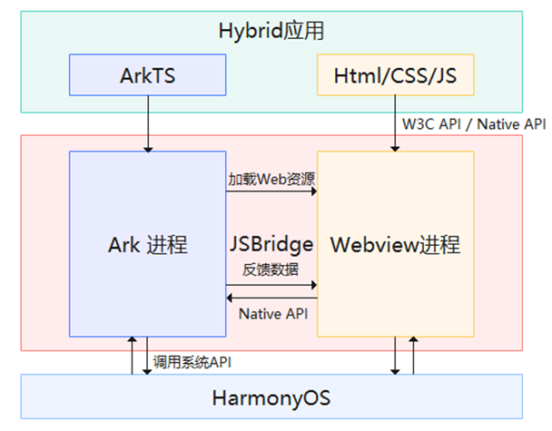
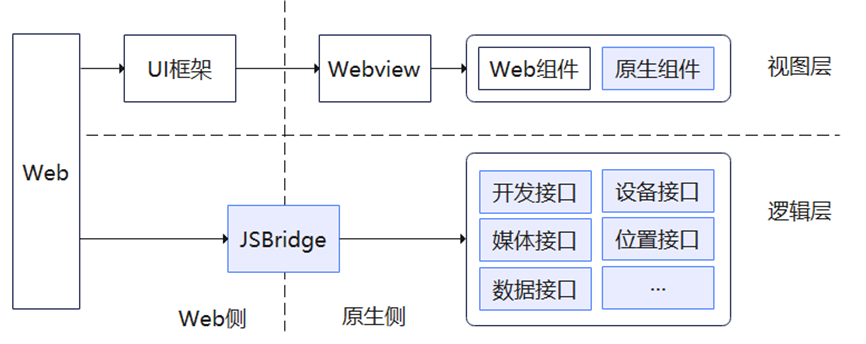
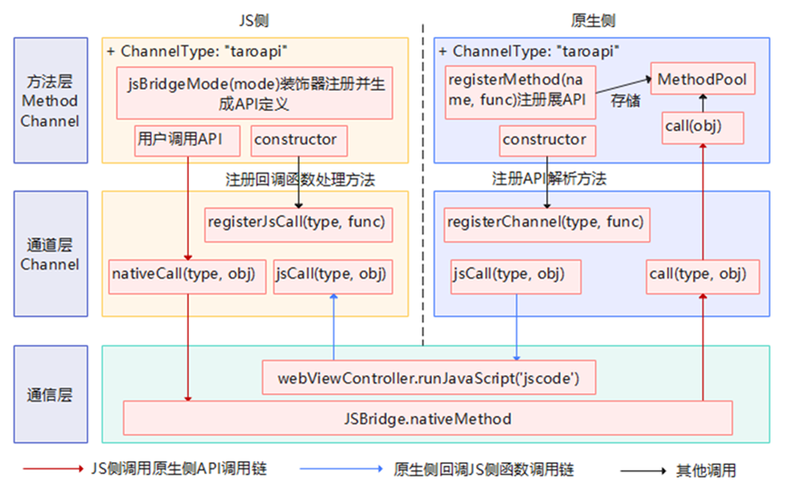
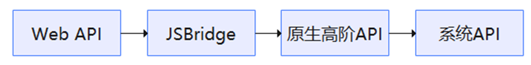
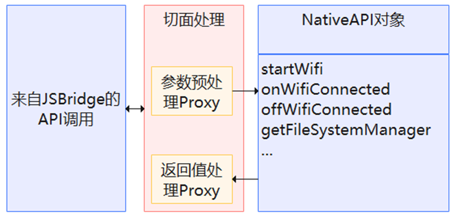
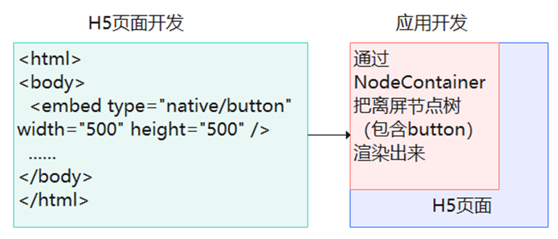
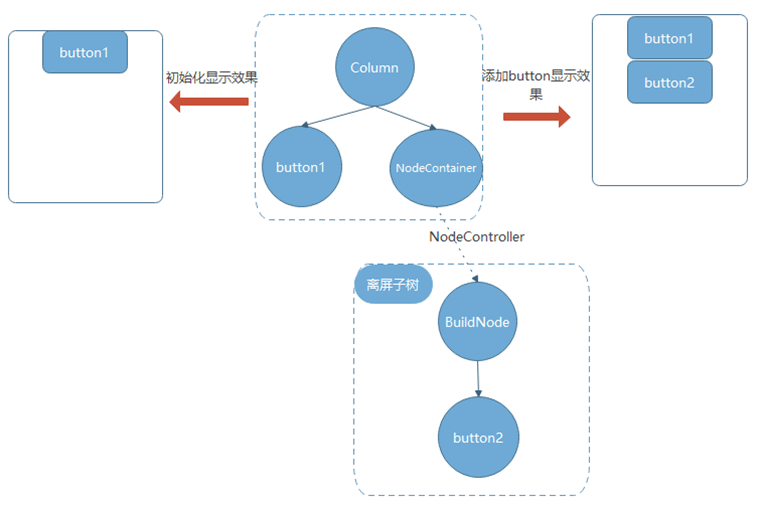

# ArkWeb渲染框架适配

更新时间：2026-03-12 08:45:02

来源：https://developer.huawei.com/consumer/cn/doc/best-practices/bpta-arkweb_rendering_framework

#### 概述

Hybrid应用开发是介于Web应用和系统应用两者之间的应用开发技术，兼具“系统应用良好交互体验”的优势和“Web应用跨平台开发”的优势。其主要原理是由Native通过JSBridge通道提供统一的API，然后用Html/CSS实现界面，JS来写业务逻辑，能够调用系统API，最终的页面在WebView中显示。
 
 

#### Hybrid应用鸿蒙化方案

 

#### 整体架构




 1. Ark进程：由ArkTS引擎提供运行时，具备调用系统API的能力。应用启动从Ark进程进入，完成EntryAbility的初始化并创建HarmonyOS应用页面。Ark进程可以动态或者静态创建Webview运行时环境，并加载html/css/js资源文件。
2. Webview进程：默认支持标准W3C API，对ArkTS侧资源的访问有限制。Webview渲染能力主要由Web组件提供。用户可以通过Web组件的属性配置是否开启同层渲染能力、是否允许执行JavaScript脚本等。
3. JSBridge：上述两种进程的通讯机制，允许数据双向流动。Webview进程通过JSBridge通道访问拓展API。
 
 

#### 方案设计

Hybrid应用鸿蒙化方案主要集中在双端通信JSBridge实现、拓展接口实现和基于同层渲染的原生组件实现。JSBridge是前端与ArkTS进行双向通信的桥梁。通过JSBridge，前端应用能访问到ArkTS侧实现的拓展接口，实现更丰富的业务功能。视图层方面，可以使用系统提供的同层渲染能力，把部分性能要求比较高的前端组件改成ArkTS实现，以达到更好的体验效果。下图蓝色背景的方框图展示了上述三点所处的框架位置：
 



 
 

#### 业务实现中的关键点

Hybrid应用鸿蒙化方案主要围绕双端通信、API鸿蒙化、组件鸿蒙化三方面进行开发。双端通信：JS侧使用ArkTS的通道，是鸿蒙化的基石；API鸿蒙化：针对JS侧平台相关的API，提供一套HarmonyOS版本的实现；组件鸿蒙化：针对Web组件，以同层渲染的方式提供替代组件，以提升组件的性能与交互体验。
 
 

#### 双端通信

JSBridge扮演Webview进程与ArkUI主进程沟通的桥梁，是一种双向通信的机制。HarmonyOS系统提供Web组件以及@ohos.web.webview等ArkWeb API来进行Web开发。可以通过WebMessagePort以及javaScriptProxy代理的方式实现JSBridge。
 1. WebMessagePort是一种比较基础的消息发送以及接收机制，支持的消息类型为string和ArrayBuffer，具体业务消息内容的封装和解析需要从零设计，存在上手难、工作量大的特点。
2. JavaScriptProxy代理机制注入ArkUI主进程对象（如命名为native）到Webview中，在Webview的window上生成对应代理对象，业务可以直接调用该代理对象的方法，相关的操作将作用到ArkUI主进程的native对象。代码实例如下：
```ArkTS
// Web component loading H5.
Web({ src: this.param.path, controller: this.webController })
  .zoomAccess(false)
  .width(Const.WEB_CONSTANT_WIDTH)
  .aspectRatio(1)
  .margin({
    left: Const.WEB_CONSTANT_MARGIN_LEFT, right: Const.WEB_CONSTANT_MARGIN_RIGHT,
    top: Const.WEB_CONSTANT_MARGIN_TOP
  })
  .onErrorReceive((event) => {
    if (event?.error.getErrorInfo() === 'ERR_INTERNET_DISCONNECTED') {
      this.getUIContext().getPromptAction().showToast({
        message: $r('app.string.internet_err'),
        duration: Const.WEB_CONSTANT_DURATION
      });
    }
    if (event?.error.getErrorInfo() === 'ERR_CONNECTION_TIMED_OUT') {
      this.getUIContext().getPromptAction().showToast({
        message: $r('app.string.internet_err'),
        duration: Const.WEB_CONSTANT_DURATION
      });
    }
  })
  .onProgressChange((event) => {
    if (event?.newProgress === Const.WEB_CONSTANT_PROGRESS_MAX) {
      this.isLoading = false;
      clearInterval(this.intervalLoading);
      this.intervalLoading = -1;
    }
  })
  .javaScriptProxy({
    object: this.linkObj,
    name: 'linkObj',
    methodList: ['messageFromHtml'],
    controller: this.webController
  })
```

 
前端可以使用native.makePhoneCall(..) 的方式进行调用。且方法的参数支持基本类型、字典对象、函数等，对于JSBridge的设计提供了便利。关于Web.javaScriptProxy()以及WebviewController.registerJavaScriptProxy()的使用方法可以参考《[前端页面调用应用侧函数](https://developer.huawei.com/consumer/cn/doc/harmonyos-guides/web-in-page-app-function-invoking)》。
 
通过对比，javaScriptProxy注入对象的方式构造JSBridge是一个比较好的技术选型。建议JSBridge的实现基于注入机制进行设计，并考虑分层设计来提高其通用性和灵活性，下图展示一种分层设计思路：
 



 1. 通信层：对上层屏蔽具体的通信机制，主要负责Web侧和ArkTS侧数据的传递，但不解析数据的业务含义，不关注传递的数据内容。数据可以序列化为字符串进行传递或者以object对象进行传递。使用javaScriptProxy代理机制实现的通信层代码示例如下：
```ArkTS
// Web component loading H5.
Web({ src: this.param.path, controller: this.webController })
  .zoomAccess(false)
  .width(Const.WEB_CONSTANT_WIDTH)
  .aspectRatio(1)
  .margin({
    left: Const.WEB_CONSTANT_MARGIN_LEFT, right: Const.WEB_CONSTANT_MARGIN_RIGHT,
    top: Const.WEB_CONSTANT_MARGIN_TOP
  })
  .onErrorReceive((event) => {
    if (event?.error.getErrorInfo() === 'ERR_INTERNET_DISCONNECTED') {
      this.getUIContext().getPromptAction().showToast({
        message: $r('app.string.internet_err'),
        duration: Const.WEB_CONSTANT_DURATION
      });
    }
    if (event?.error.getErrorInfo() === 'ERR_CONNECTION_TIMED_OUT') {
      this.getUIContext().getPromptAction().showToast({
        message: $r('app.string.internet_err'),
        duration: Const.WEB_CONSTANT_DURATION
      });
    }
  })
  .onProgressChange((event) => {
    if (event?.newProgress === Const.WEB_CONSTANT_PROGRESS_MAX) {
      this.isLoading = false;
      clearInterval(this.intervalLoading);
      this.intervalLoading = -1;
    }
  })
  .javaScriptProxy({
    object: this.linkObj,
    name: 'linkObj',
    methodList: ['messageFromHtml'],
    controller: this.webController
  })
```

2. 通道层（Channel）：允许注册多种方法层通道。该层的JS侧实现负责把方法层的API信息对象（包含名称、参数、返回值类型等信息）打包成通信层识别的信息数据，交给通信层传递到ArkTS侧。ArkTS侧的实现包含两个主要功能，一个是把信息数据解包出API的信息，并交给ArkTS侧的方法层调用具体的API；另外一个功能就是执行jsCall，ArkTS侧通过WebviewController .runJavaScript()方法在执行JS侧的回调函数。在JS侧，nativeCall()方法提供打包转换能力。如下面示例：

  
```text
function openDialog() {
  linkObj.messageFromHtml(prizesArr[prizesPosition]);
}
```
 在ArkTS侧，通过runJavaScript()执行JS侧方法：

  
```ArkTS
Button($r('app.string.btnValue'))
  .fontSize(Const.WEB_CONSTANT_BUTTON_FONT_SIZE)
  .fontColor($r('app.color.start_window_background'))
  .margin({ top: Const.WEB_CONSTANT_BUTTON_MARGIN_TOP })
  .width(Const.WEB_CONSTANT_BUTTON_WIDTH)
  .height(Const.WEB_CONSTANT_BUTTON_HEIGHT)
  .backgroundColor($r('app.color.blue'))
  .borderRadius(Const.WEB_CONSTANT_BUTTON_BORDER_RADIUS)
  .onClick(() => {
    this.webController.runJavaScript('startDraw()');
  })
```

3. 方法层（MethodChannel）：可以针对一类API格式封装成一种MethodChannel。同种MethodChannel的API具备一致的参数规范、返回值规范，比如小程序API规范，这样便于把API的调用信息封装成结构化的信息对象，供给通道层进行传递。
 
JSBridge的设计是否合理关系到应用的性能，开发者也可以考虑是否需要批量缓存请求再统一发送请求来减少请求次数，或者把不变的请求结果进行缓存等等。
 
 

#### API鸿蒙化

H5业务设计中除了使用W3C API外，还可以使用ArkTS侧API拓展来访问设备。如下图所示：
 



 
系统高阶API是对系统API的一层封装，实现更符合业务要求的接口。拓展API的规范设计具有较大的灵活性，建议对API的参数，返回值类型格式进行限制，使用基本类型或者简单的字典对象，尽量避免使用复杂的类型的参数或返回值，可以参考比较成熟的小程序框架，其规范格式可以分成三种类型：
 1. func(paramObj), 其中 paramObj包含基本类型的数据属性以及success/fail/complete()回调函数。
2. on/offFunc(callback), 注册和移除监听函数。
3. getXxManager(): obj, 获取某类功能的全局单例管理器，如文件管理器。管理器的方法也遵守上述两点规范。
 
设计过程中可以把API都汇聚到一个对象作为属性字段存在，方便在切面视角增加统一的参数、返回值加工处理，拦截处理。示意图如下：
 



 
 

#### 组件鸿蒙化

HarmonyOS提供同层渲染能力把原生组件直接渲染到WebView层级，从而获得更大的灵活性以及性能上获得更好表现。开发者可通过Web组件同层渲染相关属性来进行控制：enableNativeEmbedMode开关控制；onNativeEmbedLifecycleChange处理同层渲染生命周期：CREATE/UPDATE/DESTROY；onNativeEmbedGestureEvent处理交互事件。同层渲染功能要求前端页面文件中显式使用embed标签，并且embed标签内type必须以“native/”开头。使用Vue等框架可以方便地进一步封装embed标签生成自定义组件，并增加更多属性、事件和方法，通过JSBridge与ArkTS侧进行同步。在ArkTS侧，对应地需要自定义实现一个原生组件或者使用系统内置组件，通过NodeContainer组件进行动态挂载。同层渲染的原理如下：
 
开发角度：前端页面开发者使用&lt;embed&gt;标签来表示使用原生组件；应用开发者使用NodeContainer关联离屏节点树，使用makeNode()接口在H5页面上渲染出组件。
 



 
离屏节点动态上下树：
 



 
1）开发者初始构建一个NodeContainer对象表示一个空的占位符。NodeContainer里面内容为空时，在初始化的时候大小为0，不参与布局。
 
2）NodeController持有buildnode对象，通过makeNode()接口将buildnode对象返回给NodeContainer，来实现动态上树。
 
3） NodeController里面rebuild()方法，触发NodeContainer重新调用makeNode()接口。 makeNode()接口若返回空，则实现动态下树。
 
使用H5结合embed标签示例：
 
```text
<div>
    <div id="bodyId">
        <embed id="nativeSearch" type = "native/component" width="100%" height="100%" src="view"/>
    </div>
</div>
```
 
在ArkTS侧，可以扩展NodeController来统一管理同层渲染节点。其makeNode()接口实现示例如下：
 
```ArkTS
import { PRODUCT_DATA } from '../viewmodel/GoodsViewModel';
import { ProductDataModel } from '../model/GoodsModel';
import { BuilderNode, FrameNode, NodeController, NodeRenderType } from '@kit.ArkUI';
import { webview } from '@kit.ArkWeb';

// Margin vertical
const MARGIN_VERTICAL: number = 8;
// Font weight
const FONT_WEIGHT: number = 500;
// Placeholder
const PLACEHOLDER: ResourceStr = $r('app.string.embed_search');

declare class Params {
  width: number;
  height: number;
}

declare class NodeControllerParams {
  surfaceId: string;
  type: string;
  renderType: NodeRenderType;
  embedId: string;
  width: number;
  height: number;
}

class SearchNodeController extends NodeController {
  private rootNode: BuilderNode<[Params]> | undefined | null = null;
  private embedId: string = "";
  private surfaceId: string = "";
  private renderType: NodeRenderType = NodeRenderType.RENDER_TYPE_DISPLAY;
  private componentWidth: number = 0;
  private componentHeight: number = 0;
  private componentType: string = "";

  /**
   * 设置渲染参数
   * 
   * @param params 渲染参数
   */
  setRenderOption(params: NodeControllerParams): void {
    this.surfaceId = params.surfaceId;
    this.renderType = params.renderType;
    this.embedId = params.embedId;
    this.componentWidth = params.width;
    this.componentHeight = params.height;
    this.componentType = params.type;
  }

  /**
   * 创建节点
   *
   * @param uiContext UIContext
   * @returns 节点
   */
  makeNode(uiContext: UIContext): FrameNode | null {
    this.rootNode = new BuilderNode(uiContext, { surfaceId: this.surfaceId, type: this.renderType });
    if (this.componentType === 'native/component') {
      this.rootNode.build(wrapBuilder(searchBuilder), { width: this.componentWidth, height: this.componentHeight });
    }
    return this.rootNode.getFrameNode();
  }

  setBuilderNode(rootNode: BuilderNode<Params[]> | null): void {
    this.rootNode = rootNode;
  }

  getBuilderNode(): BuilderNode<[Params]> | undefined | null {
    return this.rootNode;
  }

  updateNode(arg: Object): void {
    this.rootNode?.update(arg);
  }

  getEmbedId(): string {
    return this.embedId;
  }

  postEvent(event: TouchEvent | undefined): boolean {
    return this.rootNode?.postTouchEvent(event) as boolean;
  }
}
@Component
struct SearchComponent {
  @Prop params: Params;
  controller: SearchController = new SearchController()

  build() {
    Column({ space: MARGIN_VERTICAL }) {
      Text($r("app.string.embed_mall"))
        .fontSize($r('app.string.ohos_id_text_size_body4'))
        .fontWeight(FONT_WEIGHT)
        .fontFamily('HarmonyHeiTi-Medium')
      Row() {
        Search({ placeholder: PLACEHOLDER, controller: this.controller })
          .backgroundColor(Color.White)
      }
      .width($r("app.string.embed_full_percent"))
      .margin($r("app.integer.embed_row_margin"))

      Grid() {
        ForEach(PRODUCT_DATA, (item: ProductDataModel, index: number) => {
          GridItem() {
            Column({ space: MARGIN_VERTICAL }) {
              Image(item.imageRes).width($r("app.integer.embed_image_size"))
              Row({ space: MARGIN_VERTICAL }) {
                Text(item.title)
                  .fontSize($r('app.string.ohos_id_text_size_body1'))
                  .width(100)
                  .maxLines(1)
                  .textOverflow({ overflow: TextOverflow.Ellipsis })
                Text(item.price)
                  .fontSize($r('app.string.ohos_id_text_size_body1'))
                  .width(50)
                  .maxLines(1)
              }
            }
            .backgroundColor($r('app.color.ohos_id_color_background'))
            .alignItems(HorizontalAlign.Center)
            .justifyContent(FlexAlign.Center)
            .width($r("app.string.embed_full_percent"))
            .height($r("app.string.embed_full_percent"))
            .borderRadius($r('app.string.ohos_id_corner_radius_default_m'))
          }
        }, (item: ProductDataModel, index: number) => index.toString())
      }
      .columnsTemplate('1fr 1fr')
      .rowsTemplate('1fr 1fr 1fr')
      .rowsGap($r('app.string.ohos_id_elements_margin_vertical_m'))
      .columnsGap($r('app.string.ohos_id_elements_margin_vertical_m'))
      .width($r("app.string.embed_full_percent"))
      .height($r("app.string.embed_sixty_percent"))
      .backgroundColor($r('app.color.ohos_id_color_sub_background'))
    }
    .padding($r('app.string.ohos_id_card_margin_start'))
    .width(this.params.width)
    .height(this.params.height)
  }
}
@Builder
function searchBuilder(params: Params) {
  SearchComponent({ params: params })
    .backgroundColor($r('app.color.ohos_id_color_sub_background'))
}

@Entry
@Component
struct Index {
  browserTabController: WebviewController = new webview.WebviewController();
  @State componentIdArr: Array<string> = [];
  private nodeControllerMap: Map<string, SearchNodeController> = new Map();

  build() {
    Stack() {
      ForEach(this.componentIdArr, (componentId: string) => {
        NodeContainer(this.nodeControllerMap.get(componentId));
      }, (embedId: string) => embedId)
      Web({ src: $rawfile("embed_view.html"), controller: this.browserTabController })
        .backgroundColor($r('app.color.ohos_id_color_sub_background'))
        .zoomAccess(false)
        .enableNativeEmbedMode(true)
        .onNativeEmbedLifecycleChange((embed) => {
          const componentId = embed.info?.id?.toString() as string
          if (embed.status === NativeEmbedStatus.CREATE) {
            let nodeController = new SearchNodeController();
            nodeController.setRenderOption({
              surfaceId: embed.surfaceId as string,
              type: embed.info?.type as string,
              renderType: NodeRenderType.RENDER_TYPE_TEXTURE,
              embedId: embed.embedId as string,
              width: this.getUIContext().px2vp(embed.info?.width),
              height: this.getUIContext().px2vp(embed.info?.height)
            });
            nodeController.rebuild();
            this.nodeControllerMap.set(componentId, nodeController);
            this.componentIdArr.push(componentId);
          } else if (embed.status === NativeEmbedStatus.UPDATE) {
            let nodeController = this.nodeControllerMap.get(componentId);
            nodeController?.updateNode({
              text: 'update',
              width: this.getUIContext().px2vp(embed.info?.width),
              height: this.getUIContext().px2vp(embed.info?.height)
            } as ESObject);
            nodeController?.rebuild();
          } else {
            let nodeController = this.nodeControllerMap.get(componentId);
            nodeController?.setBuilderNode(null);
            nodeController?.rebuild();
          }
        })
        .onNativeEmbedGestureEvent((touch) => {
          this.componentIdArr.forEach((componentId: string) => {
            let nodeController = this.nodeControllerMap.get(componentId);
            if (nodeController?.getEmbedId() === touch.embedId) {
              nodeController?.postEvent(touch.touchEvent);
            }
          })
        })
    }
  }
}
```
 
实现中可以使用map容器把embedType和离屏节点的builder()函数进行关联，当makeNode()执行时，取出embedType对应的builder()函数来创建rootNode节点，最后把rootNode节点关联的FrameNode返回，达到离屏节点动态上树、H5渲染出原生组件的效果。同层渲染可以参考文档《[同层渲染绘制Video和Button组件](https://developer.huawei.com/consumer/cn/doc/harmonyos-guides/web-same-layer)》
 
 

#### 示例代码

- [基于Web组件实现随机抽奖功能](https://gitcode.com/HarmonyOS_Codelabs/WebComponent)
- [基于ArkWeb实现系统原生组件渲染至H5页面上](https://gitcode.com/harmonyos_samples/arkweb-same-level-rendering)
