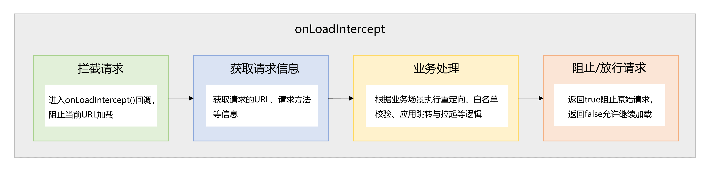
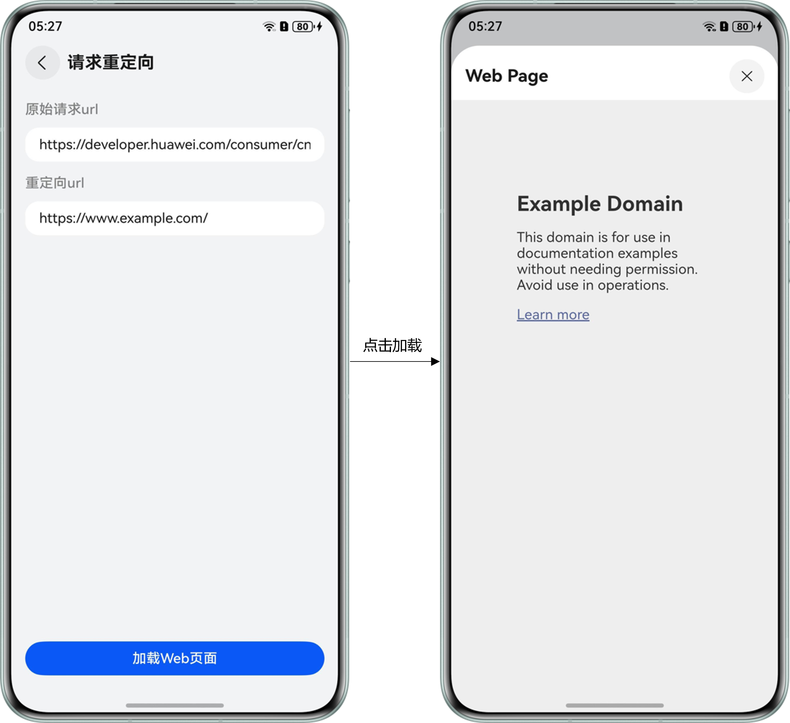
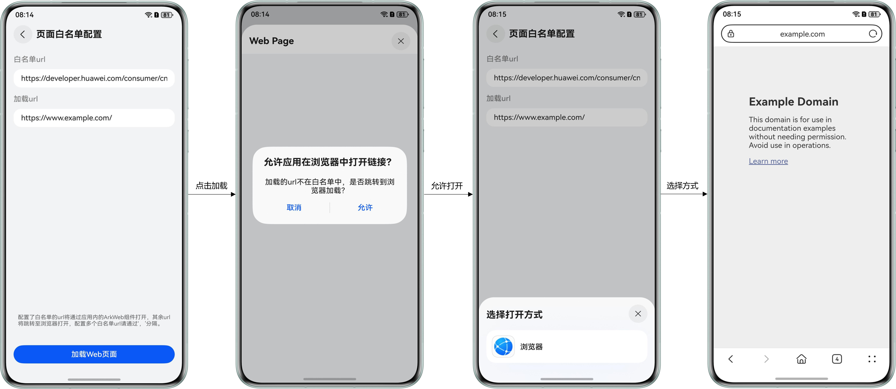
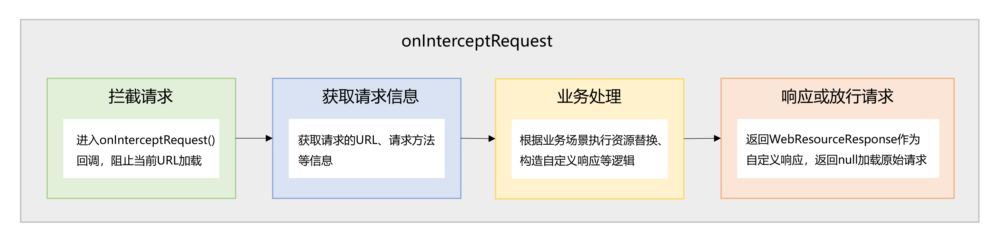
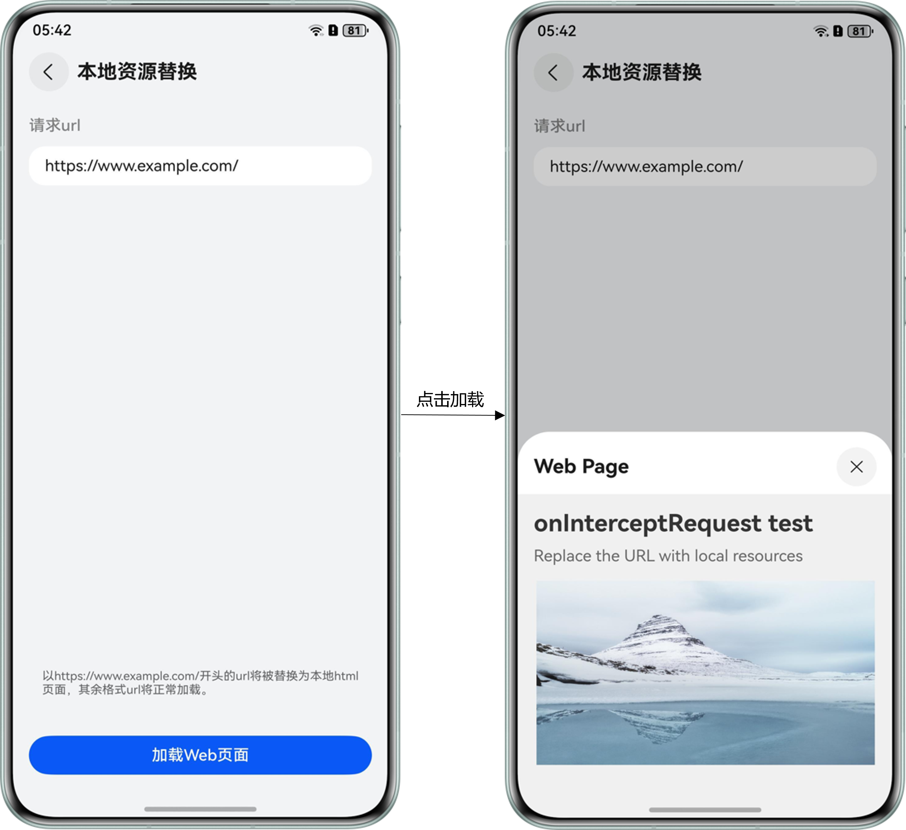
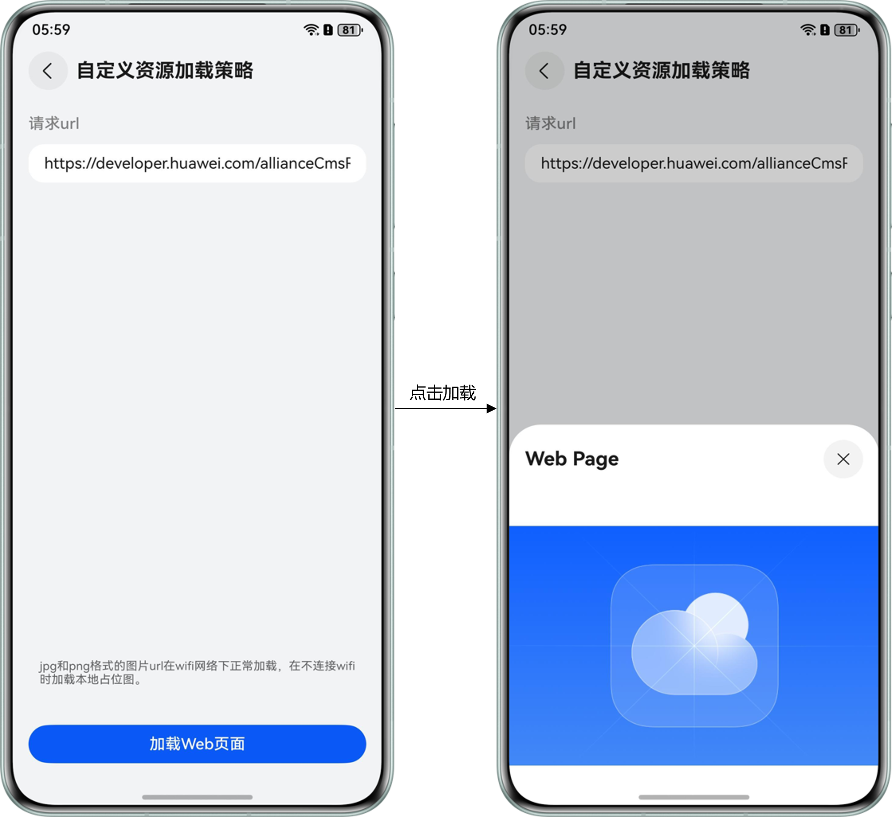
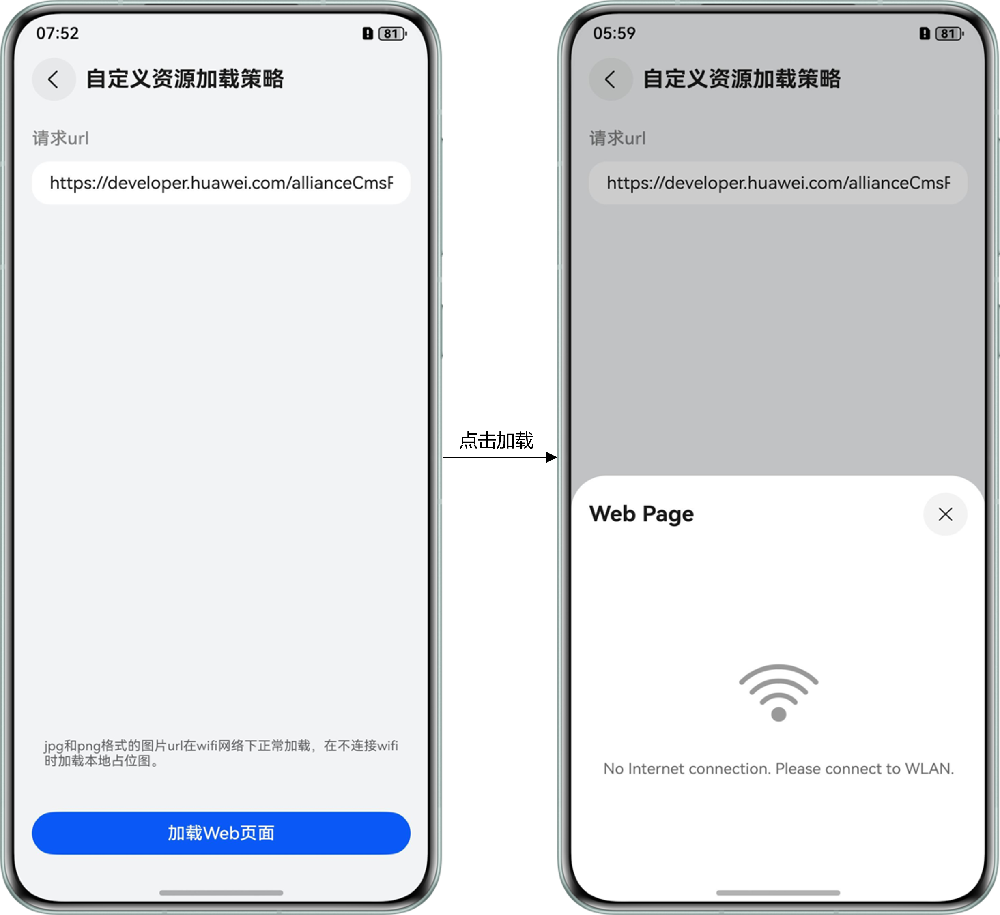
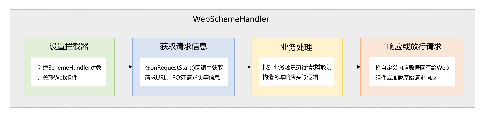
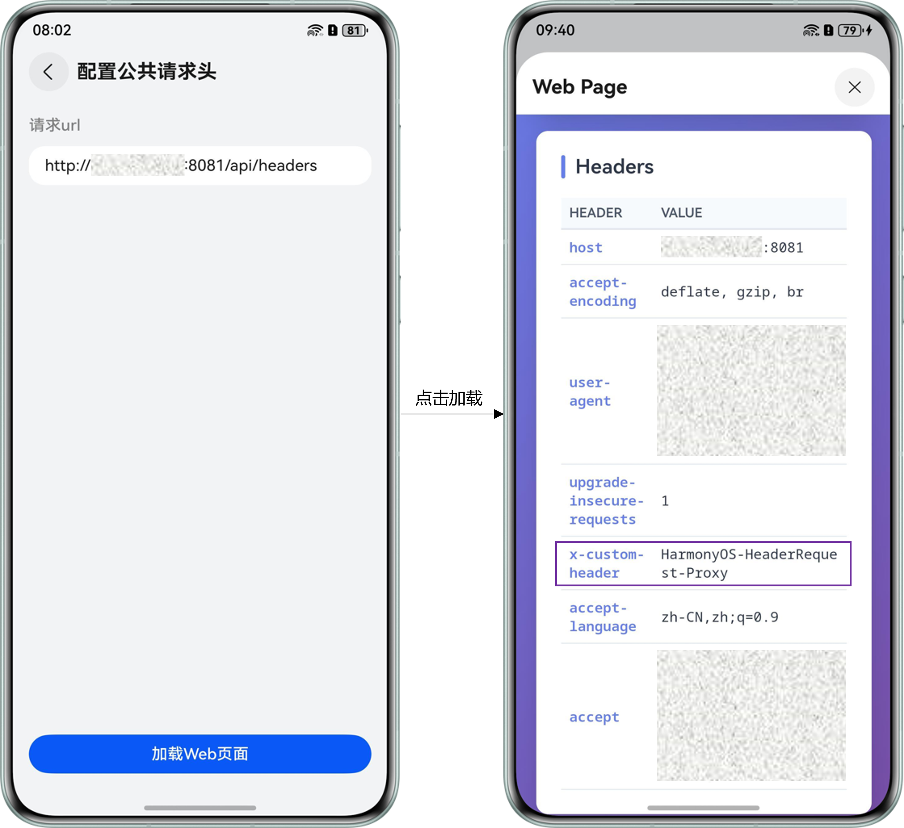

# Web组件拦截能力的使用

更新时间：2026-05-18 00:55:31

来源：https://developer.huawei.com/consumer/cn/doc/best-practices/bpta-web-interceptor

**   


#### 概述

[ArkWeb](https://developer.huawei.com/consumer/cn/doc/harmonyos-guides/web-component-overview?ha_source=sousuo&ha_sourceId=89000251)（方舟Web）提供的Web组件支持在应用嵌入网页访问功能。在实际使用过程中，网页内的大量图片、视频等静态资源容易造成用户流量消耗过快，同时，嵌入的恶意脚本也会拖慢网页加载速度，影响用户体验。为此，可以利用Web组件的拦截能力，使用本地资源副本替换高频访问的静态资源，并基于黑名单机制拦截恶意脚本的加载，从而有效提升网页加载效率，优化用户体验。
 
ArkWeb提供了多种拦截能力，使开发者能够监控、修改和记录网络请求及其响应，有助于实现业务功能的自定义与性能提升等。这些能力在拦截时机、拦截范围和拦截效果等方面存在差异，因此适用于不同的开发场景。本文将介绍三种基于Web组件的拦截方案，并提供各方案在典型应用场景中的实例，帮助开发者更好地掌握ArkWeb拦截能力的选择和使用。
 
 

#### 原理介绍

应用可通过[onLoadIntercept()](https://developer.huawei.com/consumer/cn/doc/harmonyos-references/arkts-basic-components-web-events#onloadintercept10)接口拦截Web组件的页面跳转，或通过[onInterceptRequest()](https://developer.huawei.com/consumer/cn/doc/harmonyos-references/arkts-basic-components-web-events#oninterceptrequest9)接口和[WebSchemeHandler](https://developer.huawei.com/consumer/cn/doc/harmonyos-references/arkts-apis-webview-webschemehandler)机制拦截Web组件发起的网络请求。这三种拦截方案存在一定的差异，以下为具体原理和使用场景介绍。
  
| 使用场景 | 页面跳转控制 | 网络请求拦截 |
| --- | --- | --- |
| 方案 | onLoadIntercept | onInterceptRequest | WebSchemeHandler |
| --- | --- | --- | --- |
| 典型应用场景 | 应用的跳转与拉起请求重定向页面白名单配置 | 本地资源替换自定义资源加载策略提示恶意请求 | 除支持onInterceptRequest的应用场景外，还支持： 配置公共请求头跨域请求POST请求拦截 |
| 拦截时机 | Web组件加载url之前 | 请求发起前 |
| 拦截范围 | 页面主URL的请求（包括页面中iframe的导航行为，不包括子资源的请求） | 页面主URL的请求和子资源的请求 |
| 数据访问能力 | 支持获取请求的URL、是否为主frame等相关信息，具体参考WebResourceRequest | 除支持获取请求的URL、是否为主frame等相关信息外，还支持获取POST请求体和buffer类型数据，具体参考WebSchemeHandlerRequest |
| 拦截效果 | 可以拦截或放行Web组件发起当前请求 | 可以拦截当前请求并返回自定义响应，或者放行当前请求并返回原始响应 |
 
 
三种拦截方案的不同特性，对应着不同的使用场景。下面将分别提供这三种方案的使用指导，开发者可根据实际应用场景选择合适的拦截方案。
 
 

#### 方案选择指导

**onLoadIntercept**
 
**定位**：用于拦截Web组件的URL加载行为，进行页面跳转控制。
 
 
**核心用法**：
 
- **[应用的跳转与拉起](https://developer.huawei.com/consumer/cn/doc/best-practices/bpta-web-app-jump-and-pull-up)**：拦截特定地址的请求，拉起指定应用或跳转其他页面处理，用于实现拦截支付类标签链接跳转到支付应用进行支付，或拦截地址类标签链接跳转到地图类应用进行导航等。

 
- **[请求重定向](#section103591931490)**：拦截特定地址的请求，并将访问重定向到新的目标地址，用于在域名更换或登录引导时，将用户访问跳转到正确的页面。

 
- **[页面白名单配置](#section1367693510110)**：配置链接黑名单/白名单，拦截/放行指定URL请求，确保Web组件的请求在信任范围内，用于实现阻止用户访问危险网页等功能。

 
**使用策略**：相较于其他两种拦截方案，onLoadIntercept的主要目标是拦截页面跳转行为，而非替换请求内容。因此，在需要中断页面跳转的情况下，可选择使用本方案。
 

 
**onInterceptRequest**
 
**定位**：用于拦截Web组件的URL加载行为，进行网络请求拦截。
 
**核心用法**
 
- **[本地资源替换](#section29637307122)**：将频繁使用的静态资源缓存至本地，在访问这些资源时，返回本地响应，用于提升页面的加载速度和响应性能。

 
- **[自定义资源加载策略](#section766911191316)**：拦截特定资源请求（如图片、视频等），在Wi-Fi和移动网络下分别加载高清资源和压缩资源，用于实现数据消耗与用户体验的平衡。
- **提示恶意请求**：拦截已知恶意请求，返回空数据或提示信息作为请求响应，用于阻止恶意脚本的加载。

 
**使用策略**：onInterceptRequest支持通过文件句柄、Resource资源、ByteBuffer或String的方式替换请求内容，要求开发者一次性提供完整的请求内容。在需要拦截网络请求并向Web组件返回特定响应的业务场景下，可选择本方案。相较于基于WebSchemeHandler的拦截方案，本方案的实现更加轻量。
 

 
**WebSchemeHandler**
 
**定位**：用于拦截Web组件的URL加载行为，进行网络请求拦截。
 
**核心用法**：
 
除支持onInterceptRequest的核心用法外，还支持：
 
- **[配置公共请求头](#section736313281410)**：拦截特定地址的网络请求，注入认证信息后转发给服务端，用于协助服务端识别请求的用户身份并验证其访问权限。
- **跨域请求**：拦截Web组件发起的跨域请求，转发至远端服务器，将跨域请求结果配置到自定义响应中，返回给Web组件，用于解决依赖多元数据交互的Web应用的跨域问题。
- **POST请求拦截**：拦截POST请求，根据请求内容动态生成响应，用于实现表单提交处理等功能。

 
**使用策略**：相较于基于onInterceptRequest的拦截方案，WebSchemeHandler不仅具备其全部功能，还提供了更灵活的流式处理能力，允许开发者通过ByteBuffer逐步提供请求内容，并且能够获取请求的上传内容，如POST请求的数据。在需要拦截网络请求，获取更多请求内容或进行流式处理等复杂业务场景下，建议采用本方案。
 

#### 基于onLoadIntercept()拦截能力的使用

Web组件在加载URL前会触发[onLoadIntercept()](https://developer.huawei.com/consumer/cn/doc/harmonyos-references/arkts-basic-components-web-events#onloadintercept10)回调，用于判断是否拦截此次请求。基于该回调，可以实现[请求重定向](#section103591931490)或[页面白名单配置](#section1367693510110)功能。
 
图1 **基于onLoadIntercept()的请求拦截流程图**


 
 

#### 请求重定向

请求重定向的典型应用是在网站改版或登录状态管理等场景中，将用户访问自动跳转到正确的页面。
 
**运行效果**
 
图2 **请求重定向**


 
**实现原理**
 
在Web组件的[onLoadIntercept()](https://developer.huawei.com/consumer/cn/doc/harmonyos-references/arkts-basic-components-web-events#onloadintercept10)回调中获取请求的URL，若URL满足重定向条件，则通过[WebviewController.loadUrl()](https://developer.huawei.com/consumer/cn/doc/harmonyos-references/arkts-apis-webview-webviewcontroller#loadurl)加载重定向页面。
 
**开发步骤**
 1. 获取请求的URL。
```ArkTS
/**
 * Processes the load intercept event
 * Returns true if loading should be blocked (redirect performed), false to allow
 */
processLoadIntercept(event: OnLoadInterceptEvent): boolean {
  const requestUrl = event.data.getRequestUrl();
  // ...
}
```

2. 判断URL是否满足重定向条件。
```ArkTS
/**
 * Checks if the URL needs to be intercepted and redirected
 */
shouldInterceptUrl(requestUrl: string): boolean {
  if (!this.redirectUrl) {
    return false;
  }
  const normalizedRequest = this.normalizeUrl(requestUrl);
  const normalizedRedirect = this.normalizeUrl(this.redirectUrl);
  const isRedirectTarget = normalizedRequest === normalizedRedirect;
  return !isRedirectTarget;
}

/**
 * Normalizes the URL
 */
private normalizeUrl(url: string): string {
  return url
    .replace(/^(?:[a-zA-Z]+:)?\/\//, '')
    .replace(/\/+$/, '')
    .trim();
}
```

3. 若满足重定向条件，通过[WebviewController.loadUrl()](https://developer.huawei.com/consumer/cn/doc/harmonyos-references/arkts-apis-webview-webviewcontroller#loadurl)加载重定向页面。
```ArkTS
/**
 * Processes the load intercept event
 * Returns true if loading should be blocked (redirect performed), false to allow
 */
processLoadIntercept(event: OnLoadInterceptEvent): boolean {
  // ...

  if (this.shouldInterceptUrl(requestUrl)) {
    // Perform redirect
    const redirected = this.performRedirect();
    return redirected; // Block original URL if redirect successful
  }

  return false; // Allow loading
}

/**
 * Performs the redirect operation
 */
performRedirect(): boolean {
  try {
    this.controller.loadUrl(this.redirectUrl);
    // ...
    return true;
  } catch (error) {
    // ...
    return false;
  }
}
```

 
 

#### 页面白名单配置

页面白名单配置的典型应用是通过限制访问来源，仅允许可信来源接入系统，来防止非授权访问和网络攻击。
 
**运行效果**
 
图3 **页面白名单配置**


 
**实现原理**
 
在Web组件的[onLoadIntercept()](https://developer.huawei.com/consumer/cn/doc/harmonyos-references/arkts-basic-components-web-events#onloadintercept10)回调中获取请求的URL，若URL不属于白名单链接，则跳转到浏览器打开请求页面。
 
**开发步骤**
 1. 配置页面白名单链接。
```ArkTS
Web({ src: this.loadingUrl, controller: this.controller })
  .onLoadIntercept((event) => {
    // Update whitelist URLs before intercepting
    this.viewModel?.setWhitelistUrls(this.whitelistUrlArr.map(url => url.toString()));
    // ...
  })
```
 
```ArkTS
/**
 * Updates the whitelist URLs
 */
setWhitelistUrls(urls: string[]): void {
  this.whitelistDomains = urls
    .map(url => this.extractDomain(url))
    .filter(domain => domain.length > 0);
}

/**
 *  Extract the domain name from a URL
 */
private extractDomain(url: string): string {
  let normalized = url.trim().toLowerCase();
  // ...
  normalized = normalized
    .replace(/^(?:[a-z0-9+.-]+:)?\/\//, '') // strip protocol-like prefixes
    .split(/[/?#]/)[0]; // drop everything after domain
  return normalized.replace(/:+$/, '').replace(/\/+$/, '');
}
```

2. 获取请求的URL。
```ArkTS
/**
 * Processes the load intercept event
 * Returns true if loading should be blocked, false to allow
 */
processLoadIntercept(event: OnLoadInterceptEvent): boolean {
  const requestUrl = event.data.getRequestUrl();
  // ...
}
```

3. 判断URL是否属于白名单链接。
```ArkTS
/**
 * Checks if a URL is in the whitelist
 */
isUrlInWhitelist(requestUrl: string): boolean {
  const requestDomain = this.extractDomain(requestUrl);
  if (!requestDomain) {
    return false;
  }
  return this.whitelistDomains.includes(requestDomain);
}
```

4. 若不属于白名单链接，通过弹窗提示是否跳转到浏览器打开。
```ArkTS
/**
 * Processes the load intercept event
 * Returns true if loading should be blocked, false to allow
 */
processLoadIntercept(event: OnLoadInterceptEvent): boolean {
  // ...
  // Check if URL is in whitelist
  if (this.isUrlInWhitelist(requestUrl)) {
    this.allowAllForCurrentLoad = true;
    return false; // Allow loading and subsequent requests
  }

  // URL not in whitelist, show dialog
  this.showDialog(requestUrl);
  return true; // Block loading
}
```

5. 点击确认，在浏览器中加载请求页面。
```ArkTS
/**
 * Open URL in external browser
 */
private openInBrowser(url: string): void {
  // ...

  const want: Want = {
    uri: url,
    action: 'ohos.want.action.viewData',
    entities: ['entity.system.browsable'],
    parameters: {
      'ohos.ability.params.showDefaultPicker': true
    }
  };
  // ...
  const context: common.UIAbilityContext = this.uiContext.getHostContext()! as common.UIAbilityContext;
  context.startAbility(want)
    .then(() => {
      if (this.config?.onOk) {
        this.config?.onOk(this.targetUrl)
      }
      // ...
    })
    .catch((err: BusinessError) => {
      // ...
    });
}
```

 
 

#### 基于onInterceptRequest()拦截能力的使用

Web组件在加载URL之前会触发[onInterceptRequest()](https://developer.huawei.com/consumer/cn/doc/harmonyos-references/arkts-basic-components-web-events#oninterceptrequest9)回调，用于判断是否拦截此次请求并返回自定义响应数据。基于该回调，可以实现[本地资源替换](#section29637307122)或[自定义资源加载策略](#section766911191316)。
 
图4 **基于onInterceptRequest()的请求拦截流程图**


 
 

#### 本地资源替换

本地资源替换的典型应用是将部分频繁使用且变动较小的远程静态资源缓存至本地，以提升页面的加载速度和响应性能。
 
**运行效果**
 
图5 **本地资源替换**


 
**实现原理**
 
在Web组件的[onInterceptRequest()](https://developer.huawei.com/consumer/cn/doc/harmonyos-references/arkts-basic-components-web-events#oninterceptrequest9)回调中获取网络请求信息，通过网络请求资源与本地资源的映射关系，获取对应的本地资源并将其设置给[WebResourceResponse](https://developer.huawei.com/consumer/cn/doc/harmonyos-references/arkts-basic-components-web-webresourceresponse)作为请求响应。
 
**开发步骤**
 1. 配置网络请求资源和本地资源的映射关系，以及本地资源与相应MIME类型的映射关系。
```ArkTS
// Map between domain names and local files
schemeMap = new Map([
  ['https://www.example.com/', 'index.html'],
  ['https://www.example.com/mountain.png', 'mountain.png']
]);
// Map between local files and format mimeType
mimeTypeMap = new Map([
  ['index.html', 'text/html'],
  ['mountain.png', 'image/png']
]);
  Web({ src: this.requestUrl, controller: this.controller })
    .onInterceptRequest((event) => {
      // Update scheme map before intercepting
      this.viewModel?.updateMappings(this.schemeMap, this.mimeTypeMap);
      // ...
    })
```
 
```ArkTS
/**
 * Updates the scheme and mime type mappings
 */
updateMappings(schemeMap: Map<string, string>, mimeTypeMap: Map<string, string>): void {
  this.schemeMap = schemeMap;
  this.mimeTypeMap = mimeTypeMap;
}
```

2. 获取请求的URL。
```ArkTS
/**
 * Processes the intercepted request and returns local resource response if applicable
 * Returns null if request should be allowed through
 */
processRequest(event: OnInterceptRequestEvent | null): WebResourceResponse | null {
  // ...
  const requestUrl = event.request.getRequestUrl();
  // ...
}
```

3. 通过映射关系获取本地资源。
```ArkTS
/**
 * Processes the intercepted request and returns local resource response if applicable
 * Returns null if request should be allowed through
 */
processRequest(event: OnInterceptRequestEvent | null): WebResourceResponse | null {
  // ...
  const key = this.getUrlSchemeFromMap(requestUrl);

  if (key.length === 0) {
    return null; // No match, allow original request
  }

  const rawfileName = this.schemeMap.get(key);
  if (!rawfileName) {
    return null;  // Invalid mapping, allow original request
  }

  const mimeType = this.mimeTypeMap.get(rawfileName);
  if (!mimeType) {
    return null; // Invalid mapping, allow original request
  }
  // ...
}
/**
 * Gets the matching URL scheme key from the map
 */
getUrlSchemeFromMap(prefix: string): string {
  let matchedKey: string = '';
  let maxLength: number = 0;
  const urlOrigin = this.getUrlOrigin(prefix);
  const urlFileName = this.getFileName(prefix);

  // Find the longest matching key to prioritize specific paths over general ones
  for (let key of this.schemeMap.keys()) {
    // 1. Direct prefix match
    if (prefix.startsWith(key) && key.length > maxLength) {
      matchedKey = key;
      maxLength = key.length;
      continue;
    }

    // 2. Same-domain file name match
    const keyFileName = this.getFileName(key);
    if (keyFileName.length === 0) {
      continue;
    }
    if (key.startsWith(urlOrigin) && keyFileName === urlFileName && key.length > maxLength) {
      matchedKey = key;
      maxLength = key.length;
    }
  }

  return matchedKey;
}
```

4. 构建[WebResourceResponse](https://developer.huawei.com/consumer/cn/doc/harmonyos-references/arkts-basic-components-web-webresourceresponse)，设置并返回本地资源作为请求响应。
```ArkTS
/**
 * Processes the intercepted request and returns local resource response if applicable
 * Returns null if request should be allowed through
 */
processRequest(event: OnInterceptRequestEvent | null): WebResourceResponse | null {
  // ...
  // Create response with local file
  return this.createLocalResourceResponse(rawfileName, mimeType);
}
/**
 * Creates a response with local file data
 */
createLocalResourceResponse(rawfileName: string, mimeType: string): WebResourceResponse {
  const response = new WebResourceResponse();
  response.setResponseHeader([{
    headerKey: 'Connection',
    headerValue: 'keep-alive'
  }]);
  response.setResponseData($rawfile(rawfileName));
  response.setResponseEncoding('utf-8');
  response.setResponseMimeType(mimeType);
  response.setResponseCode(200);
  response.setReasonMessage('OK');
  response.setResponseIsReady(true);
  return response;
}
```

 
 

#### 自定义资源加载策略

自定义资源加载策略的典型应用是在Wi-Fi网络环境下加载高清图片，而在非Wi-Fi网络环境下加载压缩图片或本地占位图，以实现数据消耗与体验优化的平衡。
 
**运行效果**
 
图6 **Wi-Fi网络环境下加载图片资源**


 
图7 **非Wi-Fi网络环境下加载本地占位图**


 
**实现原理**
 
在Web组件的[onInterceptRequest()](https://developer.huawei.com/consumer/cn/doc/harmonyos-references/arkts-basic-components-web-events#oninterceptrequest9)回调中获取网络请求信息，对于图片资源请求，判断当前是否处于Wi-Fi网络环境下。若非Wi-Fi网络环境，则将本地占位图设置给[WebResourceResponse](https://developer.huawei.com/consumer/cn/doc/harmonyos-references/arkts-basic-components-web-webresourceresponse)作为请求响应。
 
**开发步骤**
 1. 判断当前网络环境，若处于Wi-Fi网络环境下，则直接返回原始请求响应。
```ArkTS
/**
 * Processes the intercepted request and returns appropriate response
 * Returns null if request should be allowed through
 */
processRequest(event: OnInterceptRequestEvent | null): WebResourceResponse | null {
  // ...
  // If WiFi network, allow original network request
  if (this.isWifiNetwork()) {
    return null;
  }
  // ...
}
/**
 * Checks if currently connected to a Wi-Fi network
 */
isWifiNetwork(): boolean {
  try {
    const netHandle = connection.getDefaultNetSync();
    const netData = connection.getNetCapabilitiesSync(netHandle);
    return netData.bearerTypes.includes(connection.NetBearType.BEARER_WIFI);
  } catch (error) {
    // ...
    return false;
  }
}
```

2. 获取请求的URL。
```ArkTS
/**
 * Processes the intercepted request and returns appropriate response
 * Returns null if request should be allowed through
 */
processRequest(event: OnInterceptRequestEvent | null): WebResourceResponse | null {
  // ...
  const requestUrl = event.request.getRequestUrl();

  // ...
}
```

3. 判断请求类型，若非图片资源请求，则直接返回原始请求响应。
```ArkTS
/**
 * Processes the intercepted request and returns appropriate response
 * Returns null if request should be allowed through
 */
processRequest(event: OnInterceptRequestEvent | null): WebResourceResponse | null {
  // ...
  // Only intercept image requests
  if (!this.isImageRequestUrl(requestUrl)) {
    return null; // Not an image, allow original request
  }
  // ...
}
/**
 * Checks if a URL request is for an image
 */
isImageRequestUrl(url: string): boolean {
  for (let format of this.imageFormatList) {
    if (url.endsWith(format)) {
      return true;
    }
  }
  return false;
}
```

4. 构建[WebResourceResponse](https://developer.huawei.com/consumer/cn/doc/harmonyos-references/arkts-basic-components-web-webresourceresponse)，对于非Wi-fi网络环境下的图片资源请求，设置并返回本地占位图作为请求响应。
```ArkTS
/**
 * Processes the intercepted request and returns appropriate response
 * Returns null if request should be allowed through
 */
processRequest(event: OnInterceptRequestEvent | null): WebResourceResponse | null {
  // ...
  // Replace with placeholder image
  return this.createPlaceholderResponse();
}
/**
 * Creates a placeholder image response for non-WiFi networks
 */
createPlaceholderResponse(): WebResourceResponse {
  const response = new WebResourceResponse();
  response.setResponseHeader([{
    headerKey: 'Connection',
    headerValue: 'keep-alive'
  }]);
  response.setResponseData($rawfile(CommonConstants.IMAGE_NO_WLAN));
  response.setResponseEncoding('utf-8');
  response.setResponseMimeType('image/png');
  response.setResponseCode(200);
  response.setReasonMessage('OK');
  response.setResponseIsReady(true);
  return response;
}
```

 
 

#### 基于WebSchemeHandler拦截能力的使用

为当前Web组件设置[WebSchemeHandler](https://developer.huawei.com/consumer/cn/doc/harmonyos-references/arkts-apis-webview-webschemehandler)，可以拦截指定协议的请求，获得请求信息并返回自定义响应数据。基于[WebSchemeHandler](https://developer.huawei.com/consumer/cn/doc/harmonyos-references/arkts-apis-webview-webschemehandler)机制，可以实现[配置公共请求头](#section736313281410)等场景。
 
图8 **基于WebSchemeHandler的请求拦截流程图**


 
 

#### 配置公共请求头

配置公共请求头的典型应用是在网络访问的过程中，在请求头中携带认证信息，使服务端能够识别用户身份并验证其访问权限。
 
**运行效果**
 
图9 **配置公共请求头



 
**实现原理**
 
通过[WebviewController](https://developer.huawei.com/consumer/cn/doc/harmonyos-references/arkts-apis-webview-webviewcontroller)将[WebSchemeHandler](https://developer.huawei.com/consumer/cn/doc/harmonyos-references/arkts-apis-webview-webschemehandler)设置给当前Web组件后，在[WebSchemeHandler.onRequestStart()](https://developer.huawei.com/consumer/cn/doc/harmonyos-references/arkts-apis-webview-webschemehandler#onrequeststart12)回调中拦截网络请求，并为其添加公共请求头，然后通过[rcp](https://developer.huawei.com/consumer/cn/doc/harmonyos-references/remote-communication-rcp)将请求转发到服务端。
 
**开发步骤**
 1. 通过[WebviewController](https://developer.huawei.com/consumer/cn/doc/harmonyos-references/arkts-apis-webview-webviewcontroller)将[WebSchemeHandler](https://developer.huawei.com/consumer/cn/doc/harmonyos-references/arkts-apis-webview-webschemehandler)设置给Web组件。
```ArkTS
// Bind interceptor to HTTP
controller.setWebSchemeHandler('http', this.schemeHandler);
```

2. 在[WebSchemeHandler.onRequestStart()](https://developer.huawei.com/consumer/cn/doc/harmonyos-references/arkts-apis-webview-webschemehandler#onrequeststart12)回调中拦截网络请求。
```ArkTS
// Set up request interceptor
this.schemeHandler.onRequestStart((request: webview.WebSchemeHandlerRequest,
  resourceHandler: webview.WebResourceHandler) => {
  // Process request
  const handled = this.model.processRequest(request, resourceHandler);
  return handled;
});
```

3. 为网络请求添加自定义的公共请求头，并通过rcp.[createSession()](https://developer.huawei.com/consumer/cn/doc/harmonyos-references/remote-communication-rcp#createsession)创建HTTP会话。
```ArkTS
/**
 * Creates an RCP session for the next outbound request.
 */
private createSession(headers: Record<string, string>): void {
  try {
    // Create RCP session
    const sessionConfig: rcp.SessionConfiguration = {
      headers: headers
    };
      
    this.session = rcp.createSession(sessionConfig);
  } catch (error) {
    // ...
  }
}
```

4. 通过[rcp](https://developer.huawei.com/consumer/cn/doc/harmonyos-references/remote-communication-rcp)将请求转发到服务端获取请求响应。
```ArkTS
/**
 * Sends GET or HEAD requests via the RCP session.
 */
private forwardGetRequest(
  targetUrl: string,
  headers: Record<string, string>,
  resourceHandler: webview.WebResourceHandler,
): void {
  try {
    // ...
    this.createSession(headers);

    this.session?.get(targetUrl).then((response: rcp.Response) => {
      // ...
      this.handleResponse(response, resourceHandler);
      this.session?.close();
    }).catch((error: BusinessError) => {
      // ...
    });
  } catch (error) {
    // ...
  }
}
```

5. 调用[didReceiveResponse()](https://developer.huawei.com/consumer/cn/doc/harmonyos-references/arkts-apis-webview-webresourcehandler#didreceiveresponse12)和[didReceiveResponseBody()](https://developer.huawei.com/consumer/cn/doc/harmonyos-references/arkts-apis-webview-webresourcehandler#didreceiveresponsebody12)将构造的响应头和响应体传递给拦截的请求。
```ArkTS
/**
 * Maps the RCP response to a WebSchemeHandlerResponse.
 */
private handleResponse(
  response: rcp.Response,
  resourceHandler: webview.WebResourceHandler,
): void {
  try {
    const webResponse = new webview.WebSchemeHandlerResponse();
    webResponse.setStatus(response.statusCode || 200);
    webResponse.setStatusText('OK');
    // ...
    webResponse.setMimeType(mimeType);
    webResponse.setEncoding(encoding);
    webResponse.setNetErrorCode(WebNetErrorList.NET_OK);

    // Set CORS headers
    webResponse.setHeaderByName('Access-Control-Allow-Origin', '*', true);
    webResponse.setHeaderByName('Access-Control-Allow-Credentials', 'true', true);
    webResponse.setHeaderByName('Access-Control-Allow-Methods', 'GET, POST, PUT, DELETE, PATCH, OPTIONS', true);
    webResponse.setHeaderByName('Access-Control-Allow-Headers', 'Content-Type, Authorization, X-Custom-Header', true);

    // ...
    resourceHandler.didReceiveResponse(webResponse);
    resourceHandler.didReceiveResponseBody(response.body);
    // ...
  } catch (error) {
    // ...
  }
}
```

6. 调用[didFinish()](https://developer.huawei.com/consumer/cn/doc/harmonyos-references/arkts-apis-webview-webresourcehandler#didfinish12)通知Web组件被拦截的请求已经完成。
```ArkTS
/**
 * Maps the RCP response to a WebSchemeHandlerResponse.
 */
private handleResponse(
  response: rcp.Response,
  resourceHandler: webview.WebResourceHandler,
): void {
  try {
    // ...
    resourceHandler.didFinish();
  } catch (error) {
    // ...
  }
}
```

 
 

#### 常见问题

 

#### Web组件是否支持拦截前端页面的router.push()方法？

不支持。Web组件目前仅提供网络请求的拦截方法，而前端页面的router.push()方法不会触发新的网络请求，因此无法被拦截。
 
 

#### Web组件支持异步判断是否拦截网络请求吗？

不支持。Web组件不支持异步判断是否拦截网络请求，但是可以在拦截网络请求后，异步处理响应数据，具体可参考[onInterceptRequest()示例代码](https://developer.huawei.com/consumer/cn/doc/harmonyos-references/arkts-basic-components-web-events#oninterceptrequest9)。
 
 

#### Web组件是否支持拦截Ajax原始响应？

不支持。Web组件目前仅提供网络请求的拦截方法，无法拦截请求的响应。然而，可以通过[onInterceptRequest()](https://developer.huawei.com/consumer/cn/doc/harmonyos-references/arkts-basic-components-web-events#oninterceptrequest9)回调或[WebSchemeHandler](https://developer.huawei.com/consumer/cn/doc/harmonyos-references/arkts-apis-webview-webschemehandler)机制自定义响应。
 
 

#### 示例代码

- [实现基于Web组件的请求拦截功能](https://gitcode.com/harmonyos_samples/web-interceptor)
