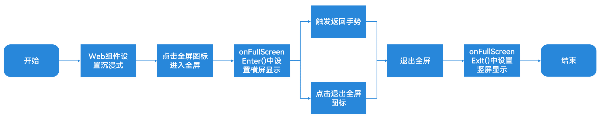
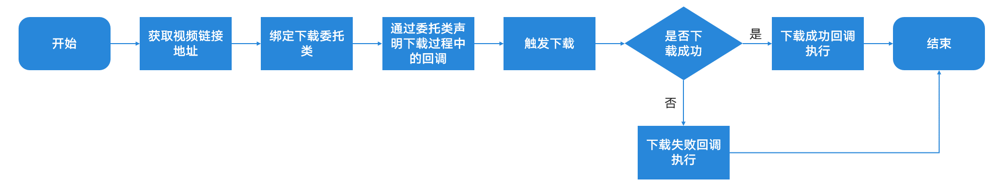

# Web页面视频适配

更新时间：2026-03-26 08:46:30

来源：https://developer.huawei.com/consumer/cn/doc/best-practices/bpta-video-adaptation-based-web

## 概述


在Web页面中，通常会包含一些像图片、视频一类的媒体资源，在使用Web组件加载这一类页面时，就会遇到视频播放适配的问题，本文汇总了以下常见的Web页面内视频适配场景：

- [全屏播放视频](#section6164167185112)：默认情况下视频点击全屏播放后，会以竖屏的形式进行播放，导致视频画面较小影响用户体验，通过适配全屏播放视频，可以让用户拥有更好的视频观看体验。
- [长按复制视频链接](#section17915201314510)：Web页面内视频无法通过有效的方式快速地在用户间分享，限制了内容的分享传播，通过适配长按复制视频链接，可以让用户快速精确地获得视频地址，更好地促进应用内容传播。
- [长按下载视频](#section101341622115114)：H5提供的video标签默认带有保存功能，但是在使用Web组件加载时，下载按钮实际不可用，不便于用户保存感兴趣的视频内容，通过适配长按下载视频，可以让Web页面内的视频便捷地保存到本地设备。


## 全屏播放视频


### 场景描述


默认情况下，网页中的视频点击全屏按钮后，会在移动设备上以竖屏形式播放视频，同时也无法兼容手势返回，对于用户而言，竖屏播放视频画面有限，更希望视频能够以横屏全屏的形式播放，同时使用手势返回后，只退出全屏播放，而不是返回到桌面，在这种情况下，就需要开发者对Web视频做全屏播放的适配。

图1 默认情况下进入视频全屏播放效果


### 实现原理


图2 Web页面适配全屏播放视频流程图




全屏播放视频首先需要Web页面做沉浸式展示，才能保证在进入全屏显示后，视频能够在非安全区展示。具体实现可以参考开发应用沉浸式效果。

为解决点击全屏后视频竖屏显示的问题，需要在Web页面进入全屏的事件回调onFullScreenEnter()中，通过手动setPreferredOrientation()接口将屏幕设置为横屏显示。

为保证退出全屏后，页面继续保持正常的竖屏显示，需要在Web页面退出全屏的事件回调onFullScreenExit()中，手动通过setPreferredOrientation()接口将屏幕设置为竖屏显示。

需要注意的是，在页面进入全屏后，需要兼容通过返回手势触发退出全屏的逻辑，具体实现上，需要在触发手势返回的事件回调中，首先判断当前应用是否处于全屏显示，若处于则触发退出全屏，返回手势触发有以下两类。

- 若为入口页面，则可在[onBackPress()](https://developer.huawei.com/consumer/cn/doc/harmonyos-references/ts-custom-component-lifecycle#onbackpress)页面生命周期函数中，通过调用[exitFullScreen()](https://developer.huawei.com/consumer/cn/doc/harmonyos-references/arkts-apis-webview-nativemediaplayerbridge#exitfullscreen12)退出全屏。
- 若为使用Navigation加载的页面，则可在NavDestination的[onBackPressed()](https://developer.huawei.com/consumer/cn/doc/harmonyos-references/ts-basic-components-navdestination#onbackpressed10)回调中，同样通过调用[exitFullScreen()](https://developer.huawei.com/consumer/cn/doc/harmonyos-references/arkts-apis-webview-nativemediaplayerbridge#exitfullscreen12)退出全屏。


图3 Web页面适配全屏播放效果


### 实现步骤


进入全屏播放

1. Web页面实现时需要注意进行非安全区内容避让，Web组件在加载Web页面时通过[expandSafeArea()](https://developer.huawei.com/consumer/cn/doc/harmonyos-references/ts-universal-attributes-expand-safe-area#expandsafearea)扩展其安全区域，从而让视频沉浸式显示。
```ts
Web({
  src: $rawfile(/zh/.test(this.language) ? 'index_cn.html' : 'index_en.html'),
  controller: this.webController,
})
  // ...
  .expandSafeArea([SafeAreaType.SYSTEM]);
```
2. 自定义改变设备横竖屏状态函数，此处定义了changeOrientation()函数，在函数内通过[setPreferredOrientation()](https://developer.huawei.com/consumer/cn/doc/harmonyos-references/arkts-apis-window-window#setpreferredorientation9)接口改变屏幕方向。
```ts
@Entry
@Component
struct Index {
  // ...
  private windowClass: window.Window | null = null;
  private context: common.UIAbilityContext = context as common.UIAbilityContext;
  // ...
  aboutToAppear(): void {
    window.getLastWindow(this.context).then((windowClass) => this.windowClass = windowClass);
    // ...
  }

  /**
  * Changes the preferred orientation of the window.
  *
  * @param orientation - The preferred orientation to set. This should be a value from the `window.Orientation` enum.
  * @returns void - This function does not return any value.
  */
  changeOrientation(orientation: window.Orientation) {
    this.windowClass?.setPreferredOrientation(orientation);
  }

  // ...

  build() {
    // ...
  }
```
3. 设置Web组件的[onFullScreenEnter()](https://developer.huawei.com/consumer/cn/doc/harmonyos-references/arkts-basic-components-web-events#onfullscreenenter9)方法，在方法内通过刚刚定义的changeOrientation()方法改变设备的横竖屏状态，设置屏幕方向为[window.Orientation.LANDSCAPE](https://developer.huawei.com/consumer/cn/doc/harmonyos-references/js-apis-display#orientation10)（横屏显示模式）。此时需要存储event中的[handler](https://developer.huawei.com/consumer/cn/doc/harmonyos-references/arkts-basic-components-web-i#fullscreenenterevent12)，该函数句柄中存储了退出全屏的方法[exitFullScreen()](https://developer.huawei.com/consumer/cn/doc/harmonyos-references/arkts-basic-components-web-fullscreenexithandler#exitfullscreen9)。
```ts
@Entry
@Component
struct Index {
  // ...
  private isFullScreen: boolean = false;
  private handler: FullScreenExitHandler | null = null;
  // ...

  build() {
    Column() {
      Web({
        src: $rawfile(/zh/.test(this.language) ? 'index_cn.html' : 'index_en.html'),
        controller: this.webController
      })
      // ...
      .onFullScreenEnter((event) => {
        this.handler = event.handler;
        this.changeOrientation(window.Orientation.LANDSCAPE);
        this.isFullScreen = true;
      })
      // ...

    }
  }
}
```


退出全屏播放

1. 设置Web组件的[onFullScreenExit()](https://developer.huawei.com/consumer/cn/doc/harmonyos-references/arkts-basic-components-web-events#onfullscreenexit9)回调，在回调内通过changeOrientation()方法改变设备的横竖屏状态，设置屏幕方向为[window.Orientation.PORTRAIT](https://developer.huawei.com/consumer/cn/doc/harmonyos-references/js-apis-display#orientation10)（竖屏显示模式）。
```ts
Web({
  src: $rawfile(/zh/.test(this.language) ? 'index_cn.html' : 'index_en.html'),
  controller: this.webController,
})
  // ...
  .onFullScreenExit(() => {
    this.changeOrientation(window.Orientation.PORTRAIT);
    this.isFullScreen = false;
  });
```
2. 处理手势返回，以下以首页返回为例，需要在[onBackPress()](https://developer.huawei.com/consumer/cn/doc/harmonyos-references/ts-custom-component-lifecycle#onbackpress)页面生命周期函数中，判断当前是否处于全屏显示状态，若处于全屏显示，则调用之前存储的handler中的[exitFullScreen()](https://developer.huawei.com/consumer/cn/doc/harmonyos-references/arkts-basic-components-web-fullscreenexithandler#exitfullscreen9)退出全屏。
```ts
onBackPress(): boolean | void {
  if (this.isFullScreen && this.handler) {
    this.handler.exitFullScreen();
    return true;
  }
  return false;
}
```


## 长按复制视频链接


### 场景描述


长按复制视频链接经常被应用于社交分享的场景，用户在应用内看到感兴趣的视频内容希望分享给周边的人，通过长按希望分享的视频选中“复制视频链接地址”选项，可以帮助用户快捷准确地获取到视频的链接地址。

图4 长按复制视频链接地址效果图


### 实现原理


长按复制视频链接功能在实现上有以下两个关键部分。

- 长按菜单功能主要依靠[bindPopup()](https://developer.huawei.com/consumer/cn/doc/harmonyos-references/ts-universal-attributes-popup#bindpopup)实现，该方法能为组件绑定popup弹窗，并通过布尔类型的状态变量控制弹窗的打开关闭，开发者可以通过设置[CustomPopupOptions](https://developer.huawei.com/consumer/cn/doc/harmonyos-references/ts-universal-attributes-popup#custompopupoptions8类型说明)定制弹窗内容与样式。
- 复制视频链接功能主要依靠[onContextMenuShow()](https://developer.huawei.com/consumer/cn/doc/harmonyos-references/arkts-basic-components-web-events#oncontextmenushow9)回调，该回调会在长按特定页面元素（图片、视频、链接等）时被调用，其事件参数中会携带长按元素的相关属性，对于视频而言，可通过[event.param.getSourceUrl()](https://developer.huawei.com/consumer/cn/doc/harmonyos-references/arkts-basic-components-web-webcontextmenuparam#getsourceurl9)获取到视频地址，并通过改变弹窗控制的状态变量来打开弹窗。在点击“复制视频链接地址”时将该链接地址通过[setData()](https://developer.huawei.com/consumer/cn/doc/harmonyos-references/js-apis-pasteboard#setdata9)方法写入系统剪贴板。


### 开发步骤


1. 定义弹窗内容组件，此处使用[Menu](https://developer.huawei.com/consumer/cn/doc/harmonyos-references/ts-basic-components-menu)作为弹窗内容，通过循环渲染menus菜单数据生成对应的菜单列表。
```ts
//src/main/ets/view/CustomPopupMenu.ets

/**
* A custom popup menu Builder.
*
* @param uri - The URI for which the popup menu will be built.
* @param context - The UI context in which the popup menu will be used. This should be an instance of `common.UIAbilityContext`.
* @param openDownloadDialog - A function that, when called, will open a download dialog.
* @param closeDownloadDialog - A function that, when called, will close the download dialog.
* @param changeIsShow - A function that, when called, will change the visibility of certain UI elements.
*/
@Builder
export function customPopupMenuBuilder(
uri: string,
context: common.UIAbilityContext,
openDownloadDialog: Function,
closeDownloadDialog: Function,
changeIsShow: Function
) {
  Column() {
    Menu() {
      ForEach(menus, (menu: MenuItem) => {
        MenuItem({
          content: menu.text
        })
        .height(singlePopupHeight)
        .onClick(() => {
          try {
            menu.caller && menu.caller(uri, context, openDownloadDialog, closeDownloadDialog);
            changeIsShow();
          } catch (e) {
            hilog.error(0x000, Constants.TAG, `some error happened, ${JSON.stringify(e)}`);
          }
        })
      }, (menu: MenuItem) => menu.id)
    }
    .width(popupWidth)
  }
}
```
2. 定义isShow作为弹窗显示控制的状态变量，并为Web组件绑定popup弹窗。
```text
const uiContext: UIContext | undefined = AppStorage.get('uiContext');
let context = uiContext!.getHostContext();
@Entry
@Component
struct Index {
@State isShow: boolean = false;
// ...

build() {
Column() {
Web({
src: $rawfile(/zh/.test(this.language) ? 'index_cn.html' : 'index_en.html'),
controller: this.webController
})
// ...
.bindPopup(this.isShow, {
builder: customPopupMenuBuilder(
this.linkUrl,
this.context,
this.openDownloadDialog,
this.closeDownloadDialog,
this.changeIsShow,
),
enableArrow: false,
placement: Placement.TopLeft,
offset: getOffset(this.webWidth, this.webHeight,
this.pressPosX, this.pressPosY),
onStateChange: (e) => {
if (!e.isVisible) {
this.isShow = false;
this.result?.closeContextMenu();
}
}
})
// ...

}
}
}
```
3. 使用Web组件的[onContextMenuShow()](https://developer.huawei.com/consumer/cn/doc/harmonyos-references/arkts-basic-components-web-events#oncontextmenushow9)事件，当触发自定义弹窗时，通过事件参数[event.param.getSourceUrl()](https://developer.huawei.com/consumer/cn/doc/harmonyos-references/arkts-basic-components-web-webcontextmenuparam#getsourceurl9)获取到Web视频链接地址。
```ts
@Entry
@Component
struct Index {
  @State isShow: boolean = false;
  // ...

  build() {
    Column() {
      Web({
        src: $rawfile(/zh/.test(this.language) ? 'index_cn.html' : 'index_en.html'),
        controller: this.webController
      })
      // ...
      .onContextMenuShow((event) => {
        if (!event) {
          return false;
        }
        // ...
        this.linkUrl = event.param.getSourceUrl();
        this.isShow = true;
        return true;
      })
      // ...

    }
  }
}
```
4. 将获取的链接地址通过[setData()](https://developer.huawei.com/consumer/cn/doc/harmonyos-references/js-apis-pasteboard#setdata9)方法写入到系统剪贴板，即可完成视频地址的复制。
```ts
/**
 * Copies a URI to the system clipboard.
 *
 * @param uri - The URI to be copied to the clipboard. This should be a valid string representing a URI.
 * @returns void - This function does not return any value.
 */
export function copyLink(uri: string) {
  const pasteData = pasteboard.createData('text/plain', uri);
  pasteboard.getSystemPasteboard().setData(pasteData, (err) => {
    if (err) {
      hilog.error(0x000, Constants.TAG, JSON.stringify(err));
      return;
    }
    context1.showToast({
      message: $r('app.string.copy_success'),
    });
  });
}
```


## 长按下载视频


### 场景描述


长按下载视频经常用于提供给用户本地缓存感兴趣的视频内容的能力，用户可以直接长按感兴趣的视频内容打开弹窗，选择“下载视频”将其保存到设备本地，下载后的视频也可以通过社交分享渠道进行分享。


### 实现原理


图5 长按下载视频整体适配流程图




长按视频区域后，可通过在onContextMenuShow()接口中的事件参数event.param.getSourceUrl()获取到视频链接地址。

开发者可参考使用Web组件的下载能力，通过绑定WebDownloadDelegate委托类进行下载控制与状态感知，该类会通过以下四个回调注册方法通知下载状态。

- [onBeforeDownload()](https://developer.huawei.com/consumer/cn/doc/harmonyos-references/arkts-apis-webview-webdownloaddelegate#onbeforedownload11)：下载开始前的回调注册方法，方法内通常用于做下载前的校验，同时在该方法内还需要通过WebDownloadItem.start('xxx')方式指定下载路径。
- [onDownloadUpdated()](https://developer.huawei.com/consumer/cn/doc/harmonyos-references/arkts-apis-webview-webdownloaddelegate#ondownloadupdated11)：下载过程中的回调注册方法，方法内通常用于维护下载过程中的状态变量，例如下载进度、下载速度等信息，并将这些信息可视化地呈现给用户。
- [onDownloadFailed()](https://developer.huawei.com/consumer/cn/doc/harmonyos-references/arkts-apis-webview-webdownloaddelegate#ondownloadfailed11)：下载失败的回调注册方法，方法内通常需要进行下载失败的逻辑处理，例如序列化已下载数据便于恢复下载、向用户提示下载失败等。
- [onDownloadFinish()](https://developer.huawei.com/consumer/cn/doc/harmonyos-references/arkts-apis-webview-webdownloaddelegate#ondownloadfinish11)：下载成功的回调注册方法，方法内用于注册下载成功后的处理逻辑，例如分享给其他用户、保存到相册等。


通过Web组件关联的WebviewController调用startDownload()并传入视频链接地址触发下载。

图6 长按下载视频效果图


### 开发步骤


1. 通过Web组件的[onContextMenuShow()](https://developer.huawei.com/consumer/cn/doc/harmonyos-references/arkts-basic-components-web-events#oncontextmenushow9)事件，在事件参数event中通过[event.param.getSourceUrl()](https://developer.huawei.com/consumer/cn/doc/harmonyos-references/arkts-basic-components-web-webcontextmenuparam#getsourceurl9)获取到视频链接地址。
```ts
@Entry
@Component
struct Index {
  @State isShow: boolean = false;
  // ...

  build() {
    Column() {
      Web({
        src: $rawfile(/zh/.test(this.language) ? 'index_cn.html' : 'index_en.html'),
        controller: this.webController
      })
      // ...
      .onContextMenuShow((event) => {
        if (!event) {
          return false;
        }
        // ...
        this.linkUrl = event.param.getSourceUrl();
        this.isShow = true;
        return true;
      })
      // ...

    }
  }
}
```
2. 通过[setDownloadDelegate()](https://developer.huawei.com/consumer/cn/doc/harmonyos-references/arkts-apis-webview-webdownloadmanager#setdownloaddelegate11)为Web组件关联的控制器WebviewController绑定下载委托类WebDownloadDelegate。
```ts
export class WebDownloadManager extends AbstractWebDownloadManager
implements ControllerManager {
  // ...
  // Define the download delegate instance.
  private delegate: webview.WebDownloadDelegate = new webview.WebDownloadDelegate();

  // ...
  public start(controllerName: string, path: string, url: string): Promise<string> {
    return new Promise((resolve, reject) => {
      const controller = this.getController(controllerName);
      // ...
      // Associate the download delegate with the webview controller.
      controller?.setDownloadDelegate(this.delegate);
      // ...
    } catch (error) {
      hilog.error(0x0000, 'testTag', 'Execution failed, code = %{public}d, message = %{public}s',
      error.code, error.message);
    }
  });
}

// ...
}
```
3. 为WebDownloadDelegate下载委托类设置相关事件回调。下载开始前需要指定文件的存储路径，开发者可通过UIAbilityContent上的filesDir传入[应用沙箱目录](https://developer.huawei.com/consumer/cn/doc/harmonyos-guides/app-sandbox-directory)作为下载地址，通过WebDownloadItem的[start()](https://developer.huawei.com/consumer/cn/doc/harmonyos-references/arkts-apis-webview-webdownloaditem#start11)方法传入下载路径即可完成配置。
```ts
this.delegate.onBeforeDownload((webDownloadItem: webview.WebDownloadItem) => {
  this.currentTask = webDownloadItem;
  this.sourcePath = path + '/' + webDownloadItem.getSuggestedFileName();
  this.currentTask.start(this.sourcePath);
  // Specify the download path before downloading.
  this.taskStatus = webDownloadItem.getState();
});
```
4. 任务下载过程中，开发者可按需维护下载相关信息，例如此处维护了下载的进度downloadProgress与下载速度downloadSpeed提供给UI组件进行展示，下载进度通过webDownloadItem调用[getPercentComplete()](https://developer.huawei.com/consumer/cn/doc/harmonyos-references/arkts-apis-webview-webdownloaditem#getpercentcomplete11)方法获取，下载速度通过webDownloadItem调用[getCurrentSpeed()](https://developer.huawei.com/consumer/cn/doc/harmonyos-references/arkts-apis-webview-webdownloaditem#getcurrentspeed11)方法获取。
```ts
this.delegate.onDownloadUpdated((webDownloadItem: webview.WebDownloadItem) => {
  this.currentTask = webDownloadItem;
  // maintain download progress.
  this.downloadProgress = webDownloadItem.getPercentComplete();
  this.downloadSpeed = webDownloadItem.getCurrentSpeed();
  this.taskStatus = webDownloadItem.getState();
});
```
5. 当任务下载成功后，开发者可以向用户提示下载完成，并按需执行后续的业务逻辑。例如将视频分享给其他软件或保存到其他位置，此处以用户提示下载完成为例。
```ts
this.delegate.onDownloadFinish((webDownloadItem: webview.WebDownloadItem) => {
  this.taskStatus = webDownloadItem.getState();
  resolve(this.sourcePath);
});
```
6. WebDownloadDelegate也提供了下载失败的事件回调，并提供了序列化下载任务的方法，开发者可以使用[serialize()](https://developer.huawei.com/consumer/cn/doc/harmonyos-references/arkts-apis-webview-webdownloaditem#serialize11)方法将下载失败的任务进行序列化，便于之后恢复下载。
```ts
this.delegate.onDownloadFailed((webDownloadItem: webview.WebDownloadItem) => {
  // Serialize the download data when the download fails to resume the download.
  this.failedData = webDownloadItem.serialize();
  this.taskStatus = webDownloadItem.getState();
  reject(new Error('download failed'));
});
```
7. 在合适的时机首先通过webview.WebDownloadManager上的[setDownloadDelegate()](https://developer.huawei.com/consumer/cn/doc/harmonyos-references/arkts-apis-webview-webdownloadmanager#setdownloaddelegate11)方法重新绑定下载委托类，再通过[deserialize()](https://developer.huawei.com/consumer/cn/doc/harmonyos-references/arkts-apis-webview-webdownloaditem#deserialize11)将失败数据反序列化，最后通过[resumeDownload()](https://developer.huawei.com/consumer/cn/doc/harmonyos-references/arkts-apis-webview-webdownloadmanager#resumedownload11)方法恢复下载任务，被恢复任务会自动开始下载。
```ts
// Provides an external interface for resuming downloads.
public resume() {
  const state = this.currentTask.getState();
  if (state === webview.WebDownloadState.CANCELED) {
    webview.WebDownloadManager.setDownloadDelegate(this.delegate);
    try {
      webview.WebDownloadManager.resumeDownload(webview.WebDownloadItem.deserialize(this.failedData));
    } catch (error) {
      hilog.error(0x0000, 'testTag', 'Execution failed, code = %{public}d, message = %{public}s',
      error.code, error.message);
    }
  }
}
```

 通过WebviewController提供的startDownload()方法并传入获取到的视频链接来启动下载。
```ts
controller?.startDownload(url);
```


## 总结


本文提供了Web页面内视频的相关适配实践，包括解决视频全屏播放默认竖屏、获取到视频链接地址并写入到剪贴板、通过Web组件提供的相关能力下载网页视频，开发者可结合本文根据实际业务需求进行Web页面内视频的适配。


## 示例代码


- [基于Web的视频处理](https://gitcode.com/harmonyos_samples/BestPracticeSnippets/tree/master/VideoProcessBaseWeb)
