# Native侧实现文件访问

更新时间：2026-03-12 08:45:02

来源：https://developer.huawei.com/consumer/cn/doc/best-practices/bpta-file-native-side

## 概述


在对文件处理性能要求高的场景中，Native侧访问文件处理数据比在ArkTS侧操作文件有更高的效率和更快的响应，例如处理大文件、复杂的文件操作以及实时通信等低时延场景。根据文件位置的不同，应用在Native侧访问文件可以分为以下三种类型：

- 类型一：访问应用沙箱内的文件进行读写操作，主要是通过沙箱路径进行访问。
- 类型二：访问应用资源文件进行读操作，可以通过传递资源管理器进行访问。
- 类型三：访问系统公共目录中的文件进行读写操作，可以使用文件picker来获取文件描述符。


本文将针对这三种场景给出具体的实现方案。


## 访问应用沙箱文件


应用沙箱是一种以安全防护为目的的隔离机制，避免数据受到恶意路径穿越访问。在这种沙箱的保护机制下，应用可见的目录范围即为“应用沙箱目录”，沙箱中的文件就需要通过沙箱路径去进行访问。Native侧获取沙箱路径的方案有两种：

- 方案一：ArkTS侧[获取沙箱路径](https://developer.huawei.com/consumer/cn/doc/harmonyos-guides/application-context-stage#获取应用文件路径)传递给Native侧访问文件。
- 方案二：Native侧直接[拼接沙箱路径](https://developer.huawei.com/consumer/cn/doc/harmonyos-guides/app-sandbox-directory#应用沙箱路径和真实物理路径的对应关系)访问文件。


### 方案一：ArkTS侧获取沙箱路径传递给Native侧访问文件


图1 ArkTS侧获取沙箱路径传递给Native侧访问文件示意图

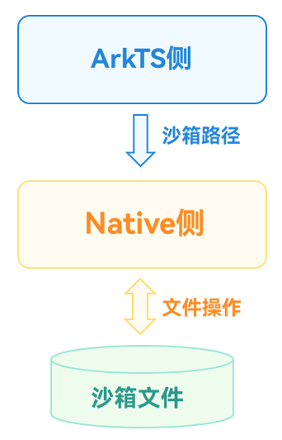


实现方案

这里以访问沙箱文件并写入文本的场景为例，实现方案分为Native侧定义操作文件的方法和ArkTS侧调用该方法两部分。

第一部分：在Native侧定义一个方法，用于接收沙箱路径并将文本写入到文件中。

1. 通过Node-API接口将沙箱路径和要写入文本的内容传递到Native侧。
```text
napi_get_value_string_utf8(env, argv[0], pathBuf, sizeof(pathBuf), &pathSize);
napi_get_value_string_utf8(env, argv[1], contentsBuf, sizeof(contentsBuf), &contentsSize);
```
2. 通过指定的路径打开文件。
```cpp
FILE *fp;
fp = fopen(pathBuf, "w");
```
3. 使用C标准库的文件操作函数写入文件。
```cpp
//Write a file using the file operation function of the C standard library.
fprintf(fp, "%s", contentsBuf);
```
4. 完整代码如下所示：
```cpp
// entry/src/main/cpp/FileAccessMethods.cpp
static napi_value TransferSandboxPath(napi_env env, napi_callback_info info) {
  size_t argc = 2;
  napi_value argv[2] = {nullptr};
  napi_get_cb_info(env, info, &argc, argv, nullptr, nullptr);
  //Convert the sandbox path and the contents of the text to be written into C-side variables through the Node-API interface.
  size_t pathSize, contentsSize;
  char pathBuf[BUFFER_SIZE], contentsBuf[BUFFER_SIZE];
  napi_get_value_string_utf8(env, argv[0], pathBuf, sizeof(pathBuf), &pathSize);
  napi_get_value_string_utf8(env, argv[1], contentsBuf, sizeof(contentsBuf), &contentsSize);
  //Open the file through the specified path.
  snprintf(pathBuf, sizeof(pathBuf), "%s/TransferSandboxPath.txt", pathBuf);
  FILE *fp;
  fp = fopen(pathBuf, "w");
  if (fp == nullptr) {
    OH_LOG_Print(LOG_APP, LOG_ERROR, DOMAIN, TAG, "Open file error!");
    return nullptr;
  }
  OH_LOG_Print(LOG_APP, LOG_INFO, DOMAIN, TAG, "Open file successfully!");
  //Write a file using the file operation function of the C standard library.
  fprintf(fp, "%s", contentsBuf);
  fclose(fp);
  return nullptr;
}
```
5. 将该[C++接口与ArkTS接口进行绑定和映射](https://developer.huawei.com/consumer/cn/doc/harmonyos-guides/use-napi-process#native侧方法的实现)，同时在index.d.ts文件中，提供该接口方法以便于ArkTS侧调用。
```ts
export const transferSandboxPath: (path: string, contents: string) => void;
```


第二部分：在Native侧访问沙箱文件写数据的功能实现后，在ArkTS侧调用该方法。

1. 引用Native侧相应的so库。
```ts
import FileAccess from 'libfile_access.so';
```
2. 在ArkTS侧获取沙箱路径。
```ts
private sandboxFilesDir: string = this.getUIContext().getHostContext()!.filesDir;
```
3. 获取到沙箱路径后，将该路径传递给Native侧，同时传递需要写入的内容。
```ts
FileAccess.transferSandboxPath(this.sandboxFilesDir, content);
```


通过上述步骤，实现了在Native侧通过ArkTS侧传递的沙箱路径访问与操作应用沙箱文件的方案。

效果展示

图2 ArkTS侧传递沙箱路径到Native侧方案效果展示

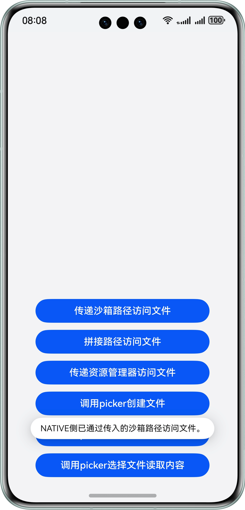


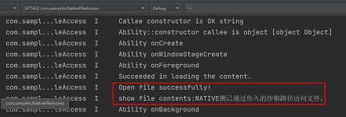


### 方案二：Native侧直接拼接沙箱路径访问文件


图3 Native侧直接拼接沙箱路径访问文件示意图

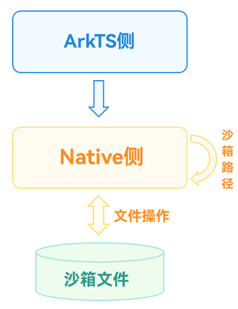


实现方案

这里同样以访问沙箱文件并写入文本的场景为例，实现方案分为Native侧定义操作文件的方法和ArkTS侧调用该方法两部分。

第一部分：在Native侧定义一个方法，用于拼接沙箱路径并将文本写入到文件中。

1. 根据实际文件位置[拼接沙箱路径](https://developer.huawei.com/consumer/cn/doc/harmonyos-guides/app-sandbox-directory#应用沙箱路径和真实物理路径的对应关系)。
```cpp
char pathBuf[READ_SIZE] = {0};
strncpy(pathBuf,FILE_PATH,READ_SIZE);
```
2. 将要写入文本的内容通过Node-API接口传递到Native侧。
```cpp
napi_get_value_string_utf8(env, argv[0], contentsBuf, sizeof(contentsBuf), &contentsSize);
```
3. 通过指定的路径打开文件。
```cpp
//Open the file through the specified path.
FILE *fp;
fp = fopen(pathBuf, "w");
```
4. 使用C标准库的文件操作函数写入文件。
```cpp
//Write a file using the file operation function of the C standard library.
fprintf(fp, "%s", contentsBuf);
```
5. 完整代码如下所示：
```cpp
static napi_value SplicePath(napi_env env, napi_callback_info info) {
  size_t argc = 1;
  napi_value argv[1] = {nullptr};
  napi_get_cb_info(env, info, &argc, argv, nullptr, nullptr);
  //Splice the sandbox path according to the actual file location.
  size_t contentsSize;
  char pathBuf[READ_SIZE] = {0};
  strncpy(pathBuf,FILE_PATH,READ_SIZE);
  //Convert the contents of the text to be written into C-side variables through the Node-API interface.
  char contentsBuf[BUFFER_SIZE];
  napi_get_value_string_utf8(env, argv[0], contentsBuf, sizeof(contentsBuf), &contentsSize);
  //Open the file through the specified path.
  FILE *fp;
  fp = fopen(pathBuf, "w");
  if (fp == nullptr) {
    OH_LOG_Print(LOG_APP, LOG_ERROR, DOMAIN, TAG, "Open file error!");
    return nullptr;
  }
  OH_LOG_Print(LOG_APP, LOG_INFO, DOMAIN, TAG, "Open file successfully!");
  //Write a file using the file operation function of the C standard library.
  fprintf(fp, "%s", contentsBuf);
  fclose(fp);
  return nullptr;
}
```
6. 将该[C++接口与ArkTS接口进行绑定和映射](https://developer.huawei.com/consumer/cn/doc/harmonyos-guides/use-napi-process#native侧方法的实现)，同时在index.d.ts文件中，提供该接口方法。
```ts
export const splicePath: (contents: string) => void;
```


第二部分：Native侧访问沙箱文件写数据的功能实现后，在ArkTS侧调用该方法。

1. 引用Native侧相应的so库。
```ts
import FileAccess from 'libfile_access.so';
```
2. 在ArkTS侧调用该接口实现文件写入的操作。
```ts
FileAccess.splicePath(content);
```


通过上述步骤，实现了在Native侧通过拼接沙箱路径访问与操作应用沙箱文件的方案。

效果展示

图4 Native侧拼接沙箱路径方案效果展示

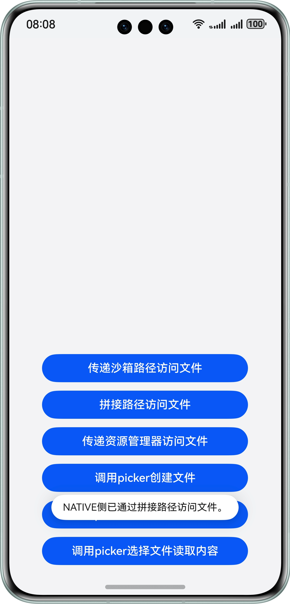


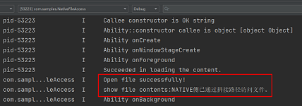


## 访问应用包内资源文件


Native侧可以通过Resource Manager操作应用资源文件中的Rawfile目录和文件，这里以Native侧读取Rawfile文件内容的场景为例介绍该方案。

图5 Native侧访问应用资源文件方案示意图

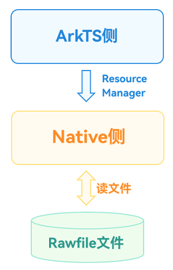


实现方案

实现方案分为Native侧定义操作文件的方法和ArkTS侧调用该方法两部分。

第一部分：在Native侧定义一个读取文件的方法，注意使用Resource Manager需要引用头文件rawfile/raw_file_manager.h，并在工程的cmakelists.txt文件中链接动态库librawfile.z.so。

1. 将传入的Resource Manager对象转换为Native对象。
```cpp
//Convert the incoming resource manager object into a Native object.
NativeResourceManager *mNativeResMgr = OH_ResourceManager_InitNativeResourceManager(env, argv[0]);
```
2. 将传入的文件名通过Node-API接口传递到Native侧。
```cpp
//Convert the passed-in file name into a C-side variable through the Node-API interface.
napi_get_value_string_utf8(env, argv[1], fileNameBuf, sizeof(fileNameBuf), &fileNameSize);
```
3. 通过资源对象打开文件。
```cpp
//Open a file through a resource object
RawFile *rawFile = OH_ResourceManager_OpenRawFile(mNativeResMgr, fileNameBuf);
```
4. 通过资源对象读取文件内容。
```cpp
//Read the file content through the resource object
long len = OH_ResourceManager_GetRawFileSize(rawFile);
std::unique_ptr<char[]> data = std::make_unique<char[]>(len);
OH_ResourceManager_ReadRawFile(rawFile, data.get(), len);
```
5. 完整代码如下所示。
```cpp
static napi_value TransferResourceMgr(napi_env env, napi_callback_info info) {
  size_t argc = 2;
  napi_value argv[2] = {nullptr};
  napi_get_cb_info(env, info, &argc, argv, nullptr, nullptr);
  //Convert the incoming resource manager object into a Native object.
  NativeResourceManager *mNativeResMgr = OH_ResourceManager_InitNativeResourceManager(env, argv[0]);
  size_t fileNameSize;
  char fileNameBuf[BUFFER_SIZE];
  //Convert the passed-in file name into a C-side variable through the Node-API interface.
  napi_get_value_string_utf8(env, argv[1], fileNameBuf, sizeof(fileNameBuf), &fileNameSize);
  //Open a file through a resource object
  RawFile *rawFile = OH_ResourceManager_OpenRawFile(mNativeResMgr, fileNameBuf);
  if (rawFile != nullptr) {
    OH_LOG_Print(LOG_APP, LOG_INFO, DOMAIN, TAG, "OH_ResourceManager_OpenRawFile success.");
  }
  //Read the file content through the resource object
  long len = OH_ResourceManager_GetRawFileSize(rawFile);
  std::unique_ptr<char[]> data = std::make_unique<char[]>(len);
  OH_ResourceManager_ReadRawFile(rawFile, data.get(), len);
  OH_ResourceManager_CloseRawFile(rawFile);
  OH_ResourceManager_ReleaseNativeResourceManager(mNativeResMgr);
  napi_value contents;
  napi_create_string_utf8(env, data.get(), len, &contents);
  return contents;
}
```
6. 将该[C++接口与ArkTS接口进行绑定和映射](https://developer.huawei.com/consumer/cn/doc/harmonyos-guides/use-napi-process#native侧方法的实现)，同时在index.d.ts文件中，提供该接口方法。
```ts
export const transferResourceMgr: (
  resMgr: resourceManager.ResourceManager,
  path: string,
) => string;
```


第二部分：Native侧访问Rawfile文件读数据的功能实现后，在ArkTS侧调用该方法。

1. 引用Native侧相应的so库。
```ts
import FileAccess from 'libfile_access.so';
```
2. 在ArkTS侧获取Resource Manager。
```ts
private resMgr: resourceManager.ResourceManager = this.getUIContext().getHostContext()!.resourceManager;
```
3. 在ArkTS侧调用该接口传递Resource Manager和文件名并读取返回的文件内容。
```ts
let rawfileContext = FileAccess.transferResourceMgr(
  this.resMgr,
  FileNameList[2],
);
```


通过上述步骤，实现了在Native侧通过ArkTS侧传递的Resource Manager访问与读取应用资源文件的方案。

效果展示

图6 ArkTS侧传递resource manager到Native侧方案效果展示

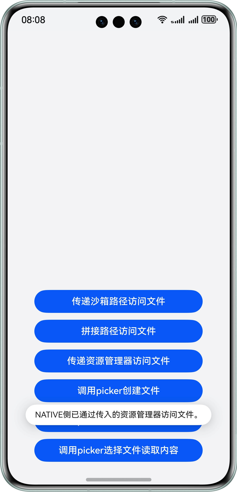


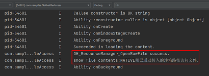


## 访问公共目录文件


系统公共目录下储存的是用户文件，应用对用户文件的操作需要提前获取用户授权，或由用户操作完成。可以通过系统预置的文件选择器（FilePicker）实现该能力，目前主要有创建文件、写入和读取三类操作，创建文件可以直接使用picker，针对Native侧，有如下两种场景：

- 场景一：写数据到公共目录文件。
- 场景二：从公共目录文件中读取数据。


### 场景一：写数据到公共目录文件


场景描述

ArkTS侧通过文件picker在公共目录下创建文件，并传递文件描述符到Native侧，Native侧通过文件描述符打开文件并将数据写入到文件中。

图7 Native侧写入公共目录文件场景示意图

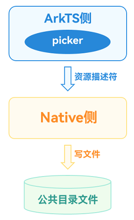


实现方案

实现方案分为Native侧定义操作文件的方法和ArkTS侧调用该方法两部分。

第一部分：在Native侧定义一个方法，用于接收文件描述符并将数据写入到文件中，注意使用文件描述符操作文件需要引用头文件unistd.h。

1. 将传入的文件描述符和要写入文件的内容通过Node-API接口传递到Native侧。
```cpp
//Convert the incoming file descriptor and the contents to be written into the file into C-side variables.
napi_get_value_uint32(env, argv[0], &fd);
napi_get_value_string_utf8(env, argv[1], contentsBuf, sizeof(contentsBuf), &contentsSize);
```
2. 使用C标准库的文件操作函数写入文件。
```cpp
//Write a file using the file operation function of the C standard library.
size_t buffSize = write(fd, contentsBuf, contentsSize);
```
3. 根据write函数的返回值判断操作是否成功。
```cpp
std::string res;
//According to the return value of the write function, judge whether the operation returns the result successfully.
napi_value contents;
if (buffSize == -1) {
  res = "Write File Failed!";
  OH_LOG_Print(LOG_APP, LOG_ERROR, DOMAIN, TAG, "%s", res.c_str());
} else {
  res = "Write File Successfully!!!";
  OH_LOG_Print(LOG_APP, LOG_INFO, DOMAIN, TAG, "%s", res.c_str());
}
napi_create_string_utf8(env, res.c_str(), sizeof(res), &contents);
return contents;
```
4. 完整代码如下所示：
```cpp
static napi_value WriteFileUsingPickerFd(napi_env env, napi_callback_info info) {
  size_t argc = 2;
  napi_value argv[2] = {nullptr};
  napi_get_cb_info(env, info, &argc, argv, nullptr, nullptr);

  unsigned int fd = -1;
  size_t contentsSize;
  char contentsBuf[BUFFER_SIZE];
  //Convert the incoming file descriptor and the contents to be written into the file into C-side variables.
  napi_get_value_uint32(env, argv[0], &fd);
  napi_get_value_string_utf8(env, argv[1], contentsBuf, sizeof(contentsBuf), &contentsSize);
  ftruncate(fd, 0);
  //Write a file using the file operation function of the C standard library.
  size_t buffSize = write(fd, contentsBuf, contentsSize);
  std::string res;
  //According to the return value of the write function, judge whether the operation returns the result successfully.
  napi_value contents;
  if (buffSize == -1) {
    res = "Write File Failed!";
    OH_LOG_Print(LOG_APP, LOG_ERROR, DOMAIN, TAG, "%s", res.c_str());
  } else {
    res = "Write File Successfully!!!";
    OH_LOG_Print(LOG_APP, LOG_INFO, DOMAIN, TAG, "%s", res.c_str());
  }
  napi_create_string_utf8(env, res.c_str(), sizeof(res), &contents);
  return contents;
}
```
5. 将该[C++接口与ArkTS接口进行绑定和映射](https://developer.huawei.com/consumer/cn/doc/harmonyos-guides/use-napi-process#native侧方法的实现)，同时在index.d.ts文件中，提供该接口方法。
```ts
export const writeFileUsingPickerFd: (fd: number, contents: string) => string;
```


第二部分：Native侧访问公共目录文件写数据的功能实现后，在ArkTS侧调用该方法。

1. 引用Native侧相应的so库。
```ts
import FileAccess from 'libfile_access.so';
```
2. 在ArkTS侧拉起picker选择文件并将文件描述符传入Native接口中。
```ts
async function WriteFileByPicker(contents: string): Promise<string> {
  //Configure picker Selection Information
  const documentSelectOptions = new picker.DocumentSelectOptions();
  documentSelectOptions.maxSelectNumber = 1;
  documentSelectOptions.fileSuffixFilters = ['.txt'];

  let uris: Array<string> = [];
  const documentViewPicker = new picker.DocumentViewPicker();
  //Pull up the picker selection file
  return await documentViewPicker
    .select(documentSelectOptions)
    .then((documentSelectResult: Array<string>) => {
      uris = documentSelectResult;
      let uri: string = uris[0];
      let path: string = new fileUri.FileUri(uri).path;
      Logger.info(`Open The File path is [${uri}]`);
      let file = fs.openSync(path, fs.OpenMode.WRITE_ONLY);
      //Call the native method to write a file
      let res = FileAccess.writeFileUsingPickerFd(file.fd, contents);
      fs.closeSync(file.fd);
      return res;
    })
    .catch((error: BusinessError) => {
      Logger.error(
        `Open The file failed, error code is [${error.code}], error message is [${error.message}]`,
      );
      return 'Write Failed by Picker';
    });
}
```


通过上述步骤，实现了在Native侧通过ArkTS侧picker传递的文件资源描述符访问公共目录文件并写入内容的方案。

效果展示

图8 Native侧写公共目录文件场景方案效果展示

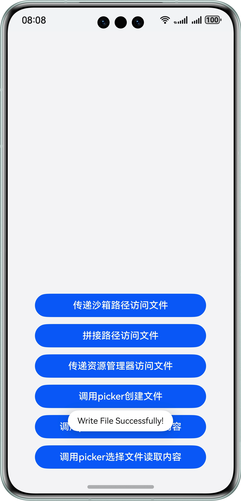


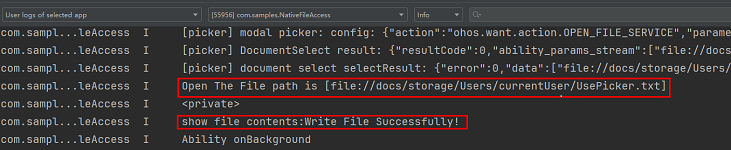


### 场景二：从公共目录文件中读取数据


场景描述

ArkTS侧通过文件picker选择文件，并传递文件描述符到Native侧，Native侧通过文件描述符打开文件并读取文件数据。

图9 Native侧读取公共目录文件场景示意图

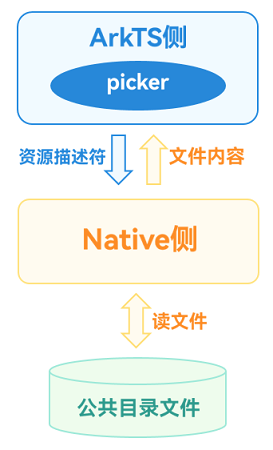


实现方案

实现方案分为Native侧定义操作文件的方法和ArkTS侧调用该方法两部分。

第一部分：在Native侧定义一个方法，用于接收文件描述符并将数据写入到文件中，注意使用文件描述符操作文件需要引用头文件unistd.h。

1. 将传入的文件描述符通过Node-API接口传递到Native侧。
```cpp
//Convert the incoming file descriptor into a C-side variable.
napi_get_value_uint32(env, argv[0], &fd);
```
2. 使用C标准库的文件操作函数读取文件。
```cpp
//Use the file operation function of the C standard library to read the file.
char buff[READ_SIZE];
size_t buffSize = read(fd, buff, sizeof(buff));
```
3. 判断读取是否成功并返回文件内容。
```cpp
//Judge whether the reading is successful or not and return the file content.
napi_value contents;
if (buffSize == -1) {
  OH_LOG_Print(LOG_APP, LOG_ERROR, DOMAIN, TAG, "Read File Failed!!!");
} else {
  OH_LOG_Print(LOG_APP, LOG_INFO, DOMAIN, TAG, "Read File Successfully!!!");
  napi_create_string_utf8(env, buff, buffSize, &contents);
}
return contents;
```
4. 完整代码如下所示：
```cpp
// entry/src/main/cpp/FileAccessMethods.cpp
static napi_value ReadFileUsingPickerFd(napi_env env, napi_callback_info info) {
  size_t argc = 1;
  napi_value argv[1] = {nullptr};
  napi_get_cb_info(env, info, &argc, argv, nullptr, nullptr);

  unsigned int fd = -1;
  //Convert the incoming file descriptor into a C-side variable.
  napi_get_value_uint32(env, argv[0], &fd);
  //Use the file operation function of the C standard library to read the file.
  char buff[READ_SIZE];
  size_t buffSize = read(fd, buff, sizeof(buff));
  //Judge whether the reading is successful or not and return the file content.
  napi_value contents;
  if (buffSize == -1) {
    OH_LOG_Print(LOG_APP, LOG_ERROR, DOMAIN, TAG, "Read File Failed!!!");
  } else {
    OH_LOG_Print(LOG_APP, LOG_INFO, DOMAIN, TAG, "Read File Successfully!!!");
    napi_create_string_utf8(env, buff, buffSize, &contents);
  }
  return contents;
}
```
5. 将该[C++接口与ArkTS接口进行绑定和映射](https://developer.huawei.com/consumer/cn/doc/harmonyos-guides/use-napi-process#native侧方法的实现)，同时在index.d.ts文件中，提供该接口方法。
```ts
export const readFileUsingPickerFd: (fd: number) => string;
```


第二部分：Native侧访问公共目录文件读数据的功能实现后，在ArkTS侧调用该方法。

1. 引用Native侧相应的so库。
```ts
import FileAccess from 'libfile_access.so';
```
2. 在ArkTS侧拉起picker选择文件并将文件描述符传入Native接口中。
```ts
async function ReadFileByPicker(): Promise<string> {
  //Configure picker Selection Information
  const documentSelectOptions = new picker.DocumentSelectOptions();
  documentSelectOptions.maxSelectNumber = 1;
  documentSelectOptions.fileSuffixFilters = ['.txt'];
  //Pull up the picker selection file
  let uris: Array<string> = [];
  const documentViewPicker = new picker.DocumentViewPicker();
  return await documentViewPicker
    .select(documentSelectOptions)
    .then((documentSelectResult: Array<string>) => {
      uris = documentSelectResult;
      let uri: string = uris[0];
      let path: string = new fileUri.FileUri(uri).path;
      Logger.info(`The Opened File path is [${uri}]`);
      let file = fs.openSync(path, fs.OpenMode.READ_ONLY);
      //Call the native method to read the file.
      let res = FileAccess.readFileUsingPickerFd(file.fd);
      fs.closeSync(file.fd);
      return res;
    })
    .catch((error: BusinessError) => {
      Logger.error(
        `Open The file failed, error code is [${error.code}], error message is [${error.message}]`,
      );
      return 'Read Failed by Picker!';
    });
}
```


通过上述步骤，实现了在Native侧通过ArkTS侧picker传递的文件资源描述符访问公共目录文件并读取内容的方案。

效果展示

图10 Native侧读公共目录文件场景方案效果展示

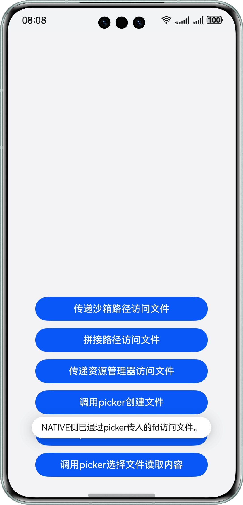


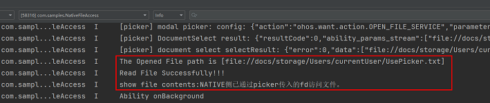


## 示例代码


- [实现Native侧文件访问](https://gitcode.com/harmonyos_samples/NativeFileAccess)
