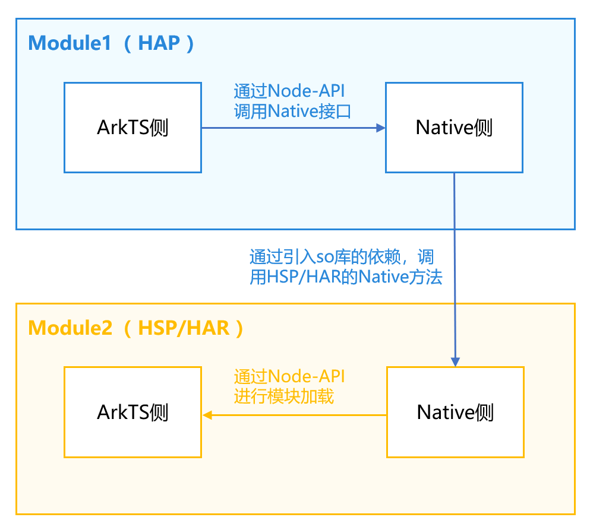
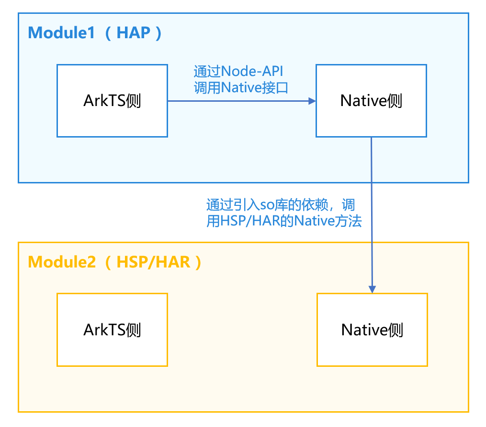
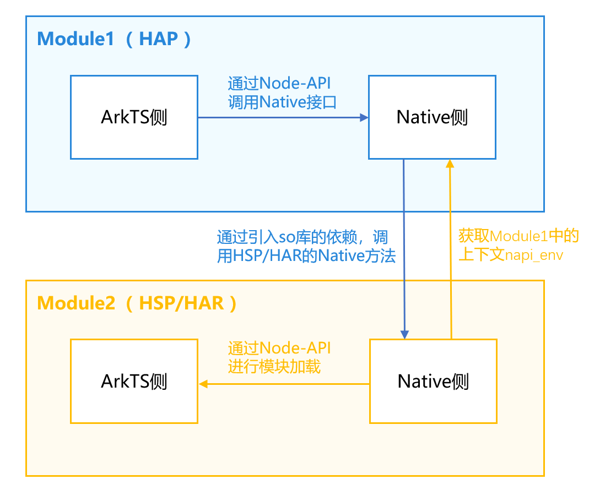
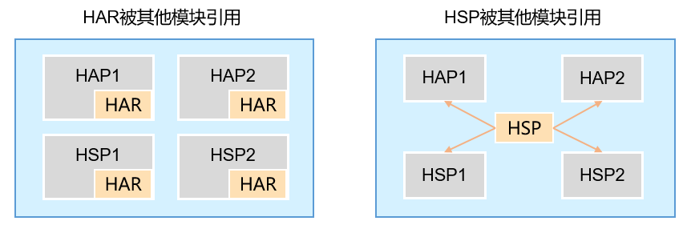

# Native侧跨HAR/HSP模块接口调用

更新时间：2026-03-12 08:45:02

来源：https://developer.huawei.com/consumer/cn/doc/best-practices/bpta-cross-module-reference

**   


#### 概述

在大型应用开发中，应用通常会分为多个业务模块，业务模块常会以HSP或HAR包的形式提供SDK能力，这些SDK往往会提供Native接口给HAP模块的Native层直接调用，从而实现应用的复杂功能。而如何在Native侧跨HAR/HSP模块进行接口调用，是开发者经常遇到的问题。本文将介绍Native侧跨HAR/HSP模块调用两种典型场景，包括调用Native方法和调用ArkTS方法，以方便开发者更好的掌握Native侧跨模块调用的能力。
 
- [Native侧跨HAR/HSP模块调用Native方法](#section470062115417)
- [Native侧跨HAR/HSP模块调用ArkTS方法](#section1485574818153)

 
 

#### 实现原理

如图1所示，Native侧跨HAR/HSP模块调用原理主要包括以下步骤。
 1. 在Module1（HAP）模块中，ArkTS侧通过Node-API调用Native接口。
2. Module1（HAP）模块Native侧调用Module2（HSP/HAR）模块Native方法。
- 被调用方
在Module2（HSP/HAR）模块中，创建头文件，并在build-profile.json5中配置头文件导出。

3. 在Module2（HSP/HAR）模块的CMakeLists.txt中进行配置，将源文件配置到so中。
- 调用方1. 在Module1（HAP）模块的oh-package.json5文件配置引入Module2（HSP/HAR）模块。

2. 在Module1（HAP）模块的CMakeLists.txt中，配置引入Module2的so文件。

3. 引入Module2（HSP/HAR）模块的头文件后，就可以调用Module2（HSP/HAR）模块的Native方法。

 - 在Module2（HSP/HAR）模块中，Native侧通过Node-API接口进行模块加载，从而调用ArkTS方法。

 
图1 **Native侧跨HAR/HSP模块调用原理图**


 
 

#### Native侧跨HAR/HSP模块调用Native方法

 
如下图所示，Native侧跨HAR/HSP模块调用Native方法的调用链路为Module1 ArkTS -> Module1 Native -> Module2 Native。在HarmonyOS项目中，Native侧跨模块调用Native方法实际就是C++侧调用，需要配置编译链接依赖。其实现的关键是在Module2（HSP/HAR）模块的build-profile.json5中，配置头文件导出，并在CMakeLists.txt中进行配置，将源文件配置到so中。
 
图2 **Native侧跨HAR/HSP模块调用Native方法**


 

#### 开发流程

Native侧跨HAR/HSP模块调用Native方法时，需要实现Module1（HAP）的ArkTS 侧调用Module1（HSP/HAR）的Native 侧、Module1（HAP）的Native 侧调用Module2（HSP/HAR）的Native 侧。在当前场景下，跨模块调用HAR模块和HSP模块的方式相同，当前以跨模块调用HAR模块为例，详细流程如下所示。
 1. 开发者需要创建Module2（HAR）模块staticModule，详细创建流程可以参考[创建库模块](https://developer.huawei.com/consumer/cn/doc/harmonyos-guides/ide-har#section643521083015)。
1. 在Module2中新建C++文件napi_har.cpp，再新建其头文件napi_har.h，并定义Native方法。napi_har.cpp代码如下所示。

  
```cpp
#include "napi/native_api.h"
#include "napi_har.h"

double harNativeAdd(double a, double b) {
    return a + b;
}
```
 napi_har.h代码如下所示。

  
```cpp
// staticModule\src\main\cpp\napi_har.h
#ifndef CROSSMODULEREFERENCE_NAPI_HAR_H
#define CROSSMODULEREFERENCE_NAPI_HAR_H
#include <js_native_api_types.h>
// ...
double harNativeAdd(double a, double b);
napi_value harArkTSAdd(double a, double b);
#endif //CROSSMODULEREFERENCE_NAPI_HAR_H
```

1. 在Module2中的build-profile.json5中配置头文件导出。如果不做当前headerPath的配置，会导致Module1引用不到Module2的头文件。
```json
{
  "apiType": "stageMode",
  "buildOption": {
    "externalNativeOptions": {
      "path": "./src/main/cpp/CMakeLists.txt",
      "arguments": "",
      "cppFlags": "",
      "abiFilters": ["x86_64", "arm64-v8a"]
    },
    "nativeLib": {
      "headerPath": "./src/main/cpp"
    },
    // ...
}
```

1. 在Module2的CMakeLists.txt中配置将源文件打包到so。
```cpp
# staticModule\src\main\cpp\CMakeLists.txt
add_library(add SHARED napi_init.cpp napi_har.cpp)
```

1. 在Module2模块创建后，需要在Module1的oh-package.json5文件中配置对应的依赖。如下所示，staticModule为新创建的HAR模块的文件名，static_module为HAR模块的名称。
```json
{
  "name": "entry",
  "version": "1.0.0",
  "description": "Please describe the basic information.",
  "main": "",
  "author": "",
  "license": "",
  "dependencies": {
    "libentry.so": "file:./src/main/cpp/types/libentry",
    "static_module": "file:../staticModule",
    // ...
  }
}
```

1. 在Module1中的CMakeLists.txt中配置so依赖。
```text
# entry\src\main\cpp\CMakeLists.txt
target_link_libraries(entry PUBLIC libace_napi.z.so static_module::add shared_module::calc)
```
 
> [!TIP]
> static_module::add中第一个参数static_module是module2的模块名称，第二个参数add是module2编译出来的so名称（不需要带上lib）。默认情况下，module2的模块名称与so名称相同，为了方便说明，在本案例中将so名称修改成了add。

1. 在Module1的napi_init.cpp中导入Module2的头文件napi_har.h，并调用其Native方法harNativeAdd()。
1. 在Module1的Native侧调用Module2的invokeHarNative()方法。
```cpp
// entry\src\main\cpp\napi_init.cpp
static napi_value invokeHarNative(napi_env env, napi_callback_info info)
{
    size_t argc = 2;
    napi_value args[2] = {nullptr};

    napi_get_cb_info(env, info, &argc, args , nullptr, nullptr);

    napi_valuetype valuetype0;
    napi_typeof(env, args[0], &valuetype0);

    napi_valuetype valuetype1;
    napi_typeof(env, args[1], &valuetype1);

    double value0;
    napi_get_value_double(env, args[0], &value0);

    double value1;
    napi_get_value_double(env, args[1], &value1);

    napi_value sum;

    napi_create_double(env, harNativeAdd(value0, value1), &sum);

    return sum;
}
```

1. 在Module1的ArkTS侧调用Native侧的invokeHarNative()方法。
```ArkTS
Button($r('app.string.call_har_native_method'))
  .fontSize(16)
  .width('100%')
  .margin({ top: 12 })
  .onClick(() => {
    this.getUIContext().getPromptAction().showToast({
      message: 'HarNative method call succeed, result is ' + napi.invokeHarNative(2, 3).toString()
    });
  })
```

 
 

#### 实现效果

图3 **Native侧调用HAR模块的Native方法**


 
 

#### Native侧跨HAR/HSP模块调用ArkTS方法

如下图所示，Native侧跨HAR/HSP模块调用ArkTS方法是[Native侧跨HAR/HSP模块调用Native方法](#section470062115417)的基础上调用ArkTS方法。其关键是在Module2中获取Module1中的上下文napi_env，并根据上下文napi_env加载模块、调用对应的ArkTS方法。
 
图4 **Native侧跨HAR/HSP模块调用ArkTS方法


 
 
 

#### 开发流程

Native侧跨HAR/HSP模块调用ArkTS方法具体实现方法如下所示。
 1. 在完成[Native侧跨HAR/HSP模块调用Native方法](#section470062115417)后，在Module1中新增invokeHarArkTS()方法以准备调用HAR模块的ArkTS方法。
2. 在Module2的Native侧，新增setHarEnv()方法，用以传递napi_env，并在头文件中进行配置，代码如下所示。napi_har.h代码如下所示。

  
```cpp
// staticModule\src\main\cpp\napi_har.h
#ifndef CROSSMODULEREFERENCE_NAPI_HAR_H
#define CROSSMODULEREFERENCE_NAPI_HAR_H
#include <js_native_api_types.h>
napi_env g_main_env;
void setHarEnv(napi_env env);
double harNativeAdd(double a, double b);
napi_value harArkTSAdd(double a, double b);
#endif //CROSSMODULEREFERENCE_NAPI_HAR_H
```
 napi_har.cpp代码如下所示。

  
```cpp
// staticModule\src\main\cpp\napi_har.cpp
void setHarEnv(napi_env env) {
    g_main_env = env;
}
```

1. 在Module1中的napi_init.cpp中的Init()方法中调用setHarEnv()方法将Module1中的napi_env传递到Module2中。
```cpp
// entry\src\main\cpp\napi_init.cpp
EXTERN_C_START
static napi_value Init(napi_env env, napi_value exports)
{
    napi_property_descriptor desc[] = {
        { "add", nullptr, Add, nullptr, nullptr, nullptr, napi_default, nullptr },
        { "invokeHarNative", nullptr, invokeHarNative, nullptr, nullptr, nullptr, napi_default, nullptr },
        { "invokeHarArkTS", nullptr, invokeHarArkTS, nullptr, nullptr, nullptr, napi_default, nullptr },
        { "invokeHspNative", nullptr, invokeHspNative, nullptr, nullptr, nullptr, napi_default, nullptr },
        { "invokeHspArkTS", nullptr, invokeHspArkTS, nullptr, nullptr, nullptr, napi_default, nullptr }
    };
    napi_define_properties(env, exports, sizeof(desc) / sizeof(desc[0]), desc);
    setHarEnv(env);
     // ...
    return exports;
}
EXTERN_C_END
```

1. 在Module2中创建ArkTS方法，提供给Module2的Native侧调用。
```ArkTS
// staticModule\src\main\ets\utils\Util.ets
export function add(a: number, b: number): number {
  return a + b;
}
```

1. 在Module2模块的build-profile.json5文件中进行以下配置。
```ArkTS
{
  "apiType": "stageMode",
  "buildOption": {
    // ...
    "arkOptions" : {
      "runtimeOnly" : {
        "sources": [
          "./src/main/ets/utils/Util.ets"
        ]
      }
    }
  },
  // ...
}
```

1. 在Module2的Native侧调用ArkTS方法，并配置到头文件中。详细步骤如下所示。
- 通过napi_load_module_with_info()加载模块，其中，第二个参数是待加载的ets文件的路径，第三个参数是bundleName+模块名。

2. 使用napi_get_named_property()获取模块导出的add()方法。

3. 使用napi_call_function()调用add()方法。

  napi_har.cpp代码如下所示。

  
```cpp
// staticModule\src\main\cpp\napi_har.cpp
napi_value harArkTSAdd(double a, double b) {
    napi_env env = g_main_env;
    napi_value module;
    napi_status status = napi_load_module_with_info(env, "static_module/src/main/ets/utils/Util", "com.example.crossmodulereference/entry", &module);
    if (napi_ok != status) {
        return 0;
    }
    
    napi_value addFunc;
    napi_get_named_property(env, module, "add", &addFunc);
    
    napi_value addResult;
    napi_value argv[2] = {nullptr, nullptr};
    napi_create_double(env, a, &argv[0]);
    napi_create_double(env, b, &argv[1]);
    napi_call_function(env, module, addFunc, 2, argv, &addResult);
    
    return addResult;
}
```


1. 在module1的Native侧调用module2的harArkTSAdd()方法。
```cpp
// entry\src\main\cpp\napi_init.cpp
static napi_value invokeHarArkTS(napi_env env, napi_callback_info info)
{
    size_t argc = 2;
    napi_value args[2] = {nullptr};

    napi_get_cb_info(env, info, &argc, args , nullptr, nullptr);

    napi_valuetype valuetype0;
    napi_typeof(env, args[0], &valuetype0);

    napi_valuetype valuetype1;
    napi_typeof(env, args[1], &valuetype1);

    double value0;
    napi_get_value_double(env, args[0], &value0);

    double value1;
    napi_get_value_double(env, args[1], &value1);
    
    return harArkTSAdd(value0, value1);
}
```

1. 在Module1的ArkTS侧调用Native侧的invokeHarArkTS()方法。
```ArkTS
Button($r('app.string.call_har_ArkTS_method'))
  .fontSize(16)
  .width('100%')
  .margin({ top: 12 })
  .onClick(() => {
    this.getUIContext().getPromptAction().showToast({ message: 'HarArkTS method call succeed, result is '
      + napi.invokeHarArkTS(2, 3).toString() });
  })
```

 
 

#### 实现效果

**图5 **Native侧调用HAR模块的ArkTS方法



 
 

#### 常见问题

 

#### 跨HSP模块调用和跨HAR模块调用的区别

HSP模块和HAR模块被调用时，主要的区别在Module2 Native调用Module2 ArkTS中，在调用napi_load_module_with_info加载模块时的入参有一些区别，其他的流程都是一样的。
 1. 被调用模块Module2是HAR
 
如图所示，编译构建后，HAR模块被打包到各个模块之中，所以其入口模块仍然是HAP模块，napi_load_module_with_info中第2个参数的模块名称要填HAP模块中oh-package.json5中定义的依赖HAR的名称，而不是HAR模块的实际名称。
 


 1. 被调用模块Module2是HSP
 
当被调用模块Module2是HSP，HSP是独立的模块，其入口模块就是HSP本模块，所以napi_load_module_with_info第2个参数的模块名就是它自己的模块名。
 
 

#### 是否支持直接依赖HAR模块和HSP模块的三方so（即依赖传递问题）？

当前HAR模块和HSP模块都不支持依赖传递。
 
 

#### 多包依赖同一so时，最终打包后的so有多少份？

如果多个HAR模块同时依赖commonHar的so，同一模块的同名so在打包后可以通过覆盖策略只保留一份。
 
如果多个HSP模块同时依赖commonHar的so，在编译构建时，会将依赖的so编译打包到最终的编译产物里，所以每一个.hsp文件都会有一个so。
 
 

#### 报错找不到HAR/HSP模块的ArkTS文件

**问题现象**
 
调用HAR/HSP模块的ArkTS文件时，可能会遇到以下报错：
 
```text
Error message:Cannot find module 'staticModule/src/main/ets/utils/Util' imported from 'com.xxxx.crossmodulereference/entry'.
```
 
**可能原因**
 
可能原因是工程级的build-profile.json5中的useNormalizedOHMUrl设置参数为false。
 
**解决措施**
 
在调用模块Module1的build-profile.json5里面添加如下配置。
 
```json
// ...
  "buildOption": {
    // ...
    "arkOptions" : {
      "runtimeOnly" : {
        "packages": [
          "static_module"
        ]
      }
    }
  },
  // ...
```
 
 

#### 示例代码

- [Native侧跨HAR/HSP模块调用](https://gitcode.com/harmonyos_samples/CrossModuleReference)
