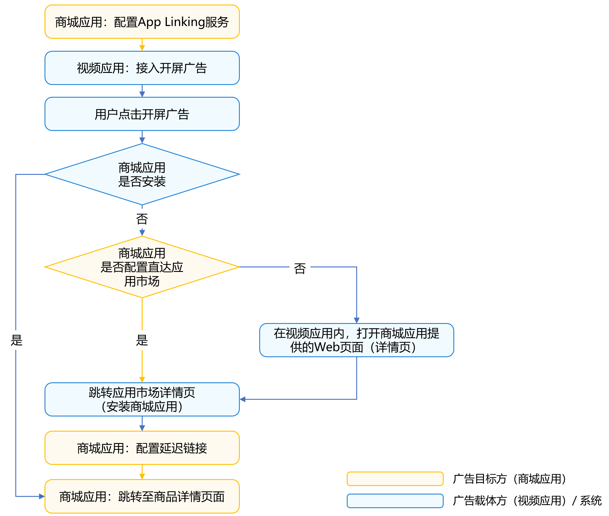

# 广告跳转

更新时间：2026-03-12 08:45:02

来源：https://developer.huawei.com/consumer/cn/doc/best-practices/bpta-ads-jump

## 概述

在移动应用或Web开发中，广告跳转是一种常见的商业模式，通过引导用户点击广告并跳转到目标页面（例如应用下载、商品详情、活动页等）来实现流量变现或推广。

典型场景：例如视频应用作为广告载体，用户在开屏广告中点击商品广告后，系统自动跳转到商城应用的商品详情页。这样既提升了广告转化率，也优化了用户体验。

本文以广告目标方（如商城应用）的开发为主，介绍商城应用如何通过App Linking技术，支持视频应用等外部广告载体高效拉起商城应用商品页，并完善未安装、延迟跳转等各种链路，从而实现完整的广告变现闭环。

## 实现原理

广告跳转链路涉及两个应用，具体如下：

- 广告载体方（如视频应用）：承担广告展示与落地页跳转功能。
- 广告目标方（如商城应用）：被外部应用拉起，承接点击流量至商品详情页。

广告跳转的流程图如下所示。

跳转过程基于App Linking能力，分为几种情况：

1. 商城应用已安装 用户在视频应用广告页点击商品，系统通过App Linking直接拉起商城应用并跳转到指定商品详情页。
2. 商城应用未安装，配置直达应用市场 点击广告后由系统自动跳转至商城应用在应用市场的详情页，用户下载安装后，首次打开即可通过延迟链接直接定位到对应商品页。
3. 商城应用未安装，未配置直达应用市场 点击广告后，系统拉起商城应用的Web页面（商品详情页），用户可直接浏览或通过页面引导下载安装商城应用。后续如完成安装，仍能保留原始跳转意图，实现直达商品页。

## 开发步骤

1. [配置App Linking服务](https://developer.huawei.com/consumer/cn/doc/best-practices/bpta-social-share#section109826570198)。
- 在AGC（AppGallery Connect）后台为商城应用开通[App Linking](https://developer.huawei.com/consumer/cn/doc/harmonyos-guides/app-linking-startup)能力，正确配置商品详情页的深度链接与参数。
- 确认所有需要被广告载体（如视频应用）跳转的页面均能通过App Linking唯一链接定位。
2. 开发商品详情Web页面
- 实现商品详情的Web页面，保证当商城应用未安装时，点击跳转链接可以展示同样的商品信息。
- 在Web页面中，可以提供“打开商城应用”“下载商城应用”等引导按钮，增强用户转化率。
- 参考[Web页面开发与部署](https://developer.huawei.com/consumer/cn/doc/best-practices/bpta-social-share#section157709544229)完成部署与配置。

> [!NOTE]
> 如果广告载体方（如视频应用）希望在自身应用内直接打开商城应用的商品详情Web页面，可以在调用[openLink()](https://developer.huawei.com/consumer/cn/doc/harmonyos-references/js-apis-inner-application-uiabilitycontext#openlink12)接口时，将参数appLinkingOnly设置为true。这样当无法拉起商城应用时，系统不会自动跳转到浏览器打开Web页面，而是通过失败回调返回结果。
>          广告载体方（如视频应用）可在回调中自行处理异常，例如手动跳转到商城应用的商品详情Web页面，实现更灵活的跳转控制。

3. 配置直达应用市场能力（可选）
- 若目标是让用户优先安装商城应用以获得完整体验，建议在App Linking配置中启用[直达应用市场](https://developer.huawei.com/consumer/cn/doc/harmonyos-guides/applinking-direct-to-ag)能力。
- 用户点击广告，如果商城应用未安装，将直接进入商城应用的应用市场页面，无须经过Web中转。
4. 实现延迟链接能力
- 配置并实现[延迟链接](https://developer.huawei.com/consumer/cn/doc/harmonyos-guides/applinking-deferredlink)（Deferred Link）功能。
- 用户在广告链路中下载安装商城应用后，首次打开应用可自动恢复跳转到指定商品页，保证广告流量完整转化。
5. 向广告载体方（如视频应用）提供标准App Linking跳转链接 将每一个商品的App Linking链接提供给广告载体（如视频应用），广告点击后调用openLink()接口进行跳转。
