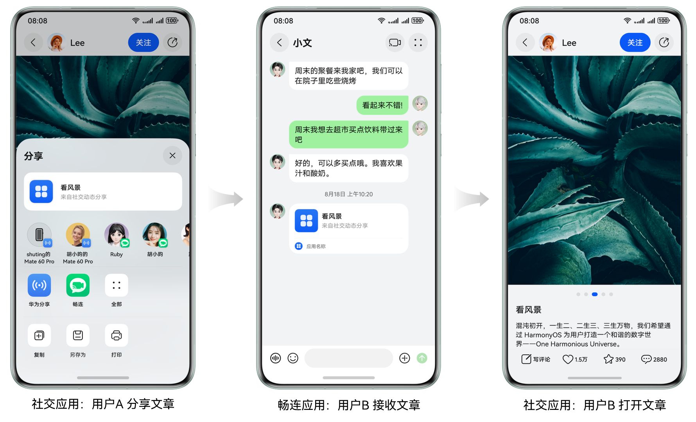
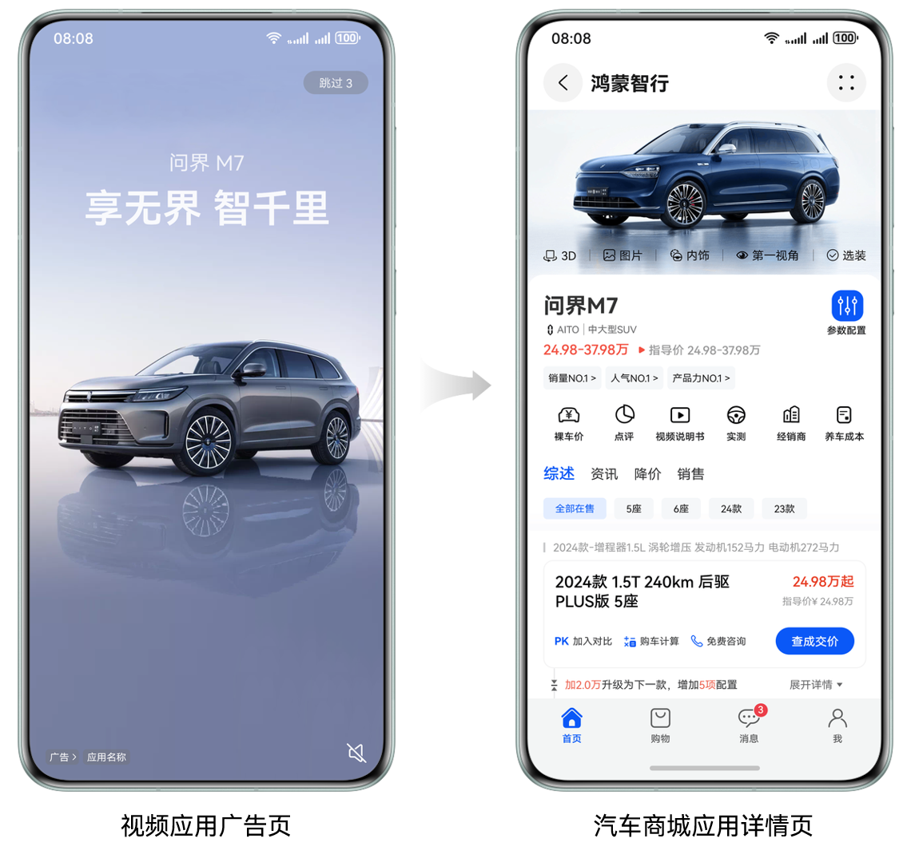
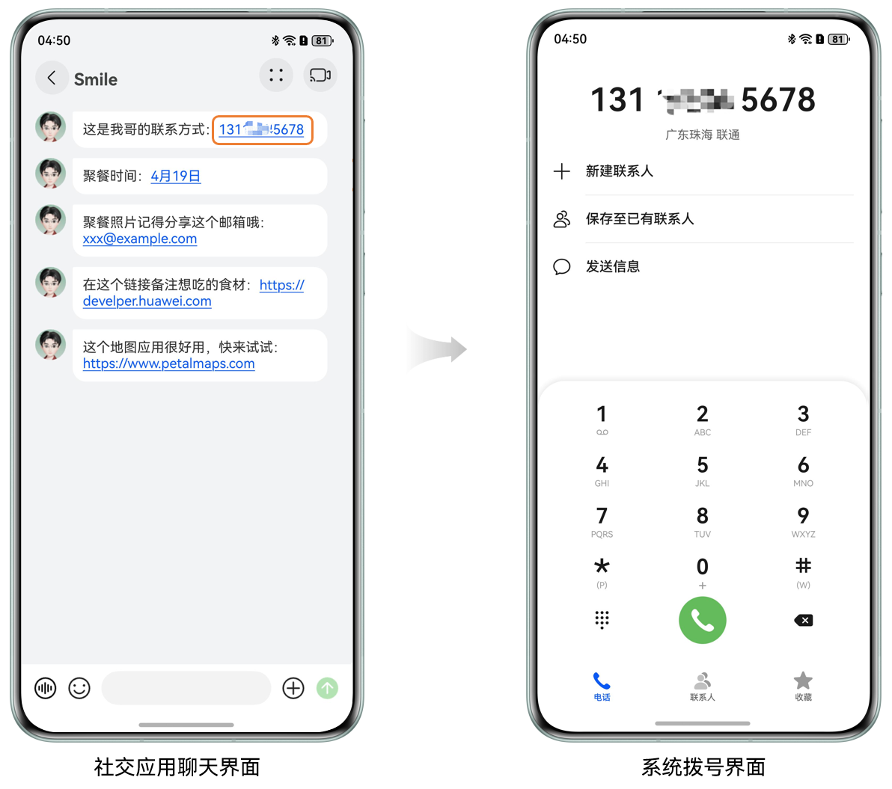
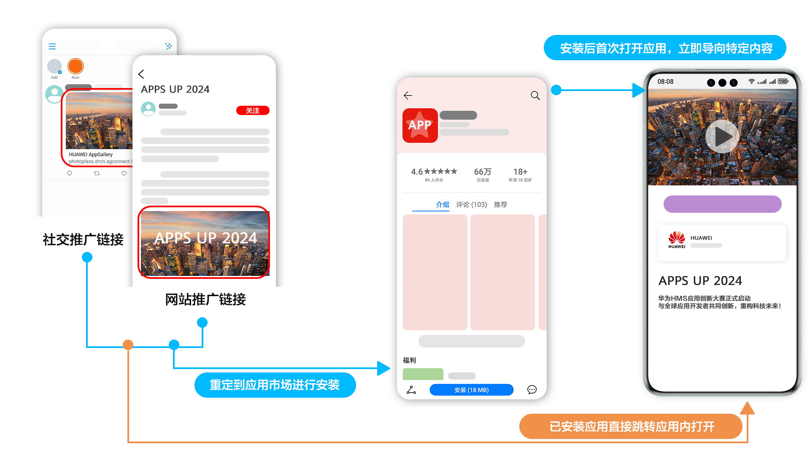

# 应用间跳转实践概览

更新时间：2026-05-22 09:46:30

来源：https://developer.huawei.com/consumer/cn/doc/best-practices/bpta-link-between-apps-overview

**   

#### 概述

在移动生态中，用户常常需要跨多个应用完成一次完整任务（例如“浏览-下单-支付-分享”）。如果每一步都要手动切换应用，体验将被频繁中断。系统提供的“应用间跳转能力”通过统一的链接协议和系统级路由，实现“一键直达”的流畅体验，显著提升用户效率和满意度，从而提升应用转化率与用户留存率。
 
常见用户场景包括：
 
- 用户在浏览资讯应用时点击商品链接，直接跳转至电商应用的商品详情页。
- 社交媒体中分享的内容链接，一键跳转至原应用的具体内容页面。
- 扫描线下二维码，直接打开应用内的活动或会员页面。
- 日程邀请链接，一键添加日程至系统日历。

 
根据目标应用的确定性，应用间跳转可分为两大类：
 
- 拉起指定应用：直接跳转到指定应用及其具体页面。例如，A应用跳转到B应用的商品详情页。
- 拉起指定类型应用：按功能意图让系统推荐可承接任务的应用，用户自主选择。例如，导航时由用户挑选任一地图应用。

 
本文将结合典型应用场景，详细介绍各类跳转方式的原理与实现方案。
 
 

#### 典型场景

 

#### 社交分享跳转

用户在社交应用中看到感兴趣的内容（文章、图片、视频等），希望与好友分享。好友收到分享链接后，点击可直接跳转至原应用的具体内容页面，无需繁琐的搜索过程。例如：
 1. 用户A在社交应用中看到一篇文章，通过分享功能发送给好友B。
2. 好友B点击链接后，直接打开社交应用并定位到该篇文章，而非应用首页。
 
图1 **用户B点击链接跳转到详情页的效果图**

 
通过系统分享面板，将包含App Linking的链接分享给好友，实现一键直达原内容。详细请参见[社交分享跳转](https://developer.huawei.com/consumer/cn/doc/best-practices/bpta-social-share)。
 
 

#### 广告跳转

用户在浏览器、社交媒体或其他渠道看到广告，点击后希望直达应用内的商品详情页、活动页或优惠券领取页等。例如：
 1. 用户在视频应用启动时看到一则电商促销广告。
2. 点击广告后直接打开电商应用并跳转至促销活动页面，用户无需在应用内搜索或导航，大幅提升下单转化率。
 
图2 **点击视频应用广告跳转汽车商城应用详情**

 
通过App Linking实现从广告链接到应用特定页面的精准跳转，提高营销转化率。详细请参见[广告跳转](https://developer.huawei.com/consumer/cn/doc/best-practices/bpta-ads-jump)。
 
 

#### 特殊文本识别跳转

应用能识别聊天内容、邮件或文档中的特殊文本（例如地址、电话号码、日期等），点击后直接调用相应系统应用进行操作。例如：
 1. 用户在聊天界面中收到一个电话号码文本。
2. 系统自动将其识别为可点击的链接。
3. 用户点击电话号码后直接打开系统拨号界面，方便用户拨打电话。
 
图3 **点击聊天界面电话号码拉起系统拨号界面

 

 
 
通过系统的文本识别能力，识别其中的特殊文本，从而实现从文本到功能的直接跳转。详细请参见[特殊文本识别跳转](https://developer.huawei.com/consumer/cn/doc/best-practices/bpta-special-text-recognition)。
 
 

#### 技术实现方案

 

#### 拉起指定应用

拉起指定应用是指明确指定目标应用进行跳转的场景。系统提供两种主要实现方式：
 
**应用链接（App Linking和Deep Linking）**
 
- [App Linking](https://developer.huawei.com/consumer/cn/doc/harmonyos-guides/app-linking-startup)：通过域名校验和HTTPS协议，实现更安全可靠的跳转。当目标方未安装时，可以打开Web网页内容，为用户提供更好的体验。
- [Deep Linking](https://developer.huawei.com/consumer/cn/doc/harmonyos-guides/deep-linking-startup)：实现相对简单，但存在被恶意仿冒的风险。当目标方未安装时，用户体验往往不佳，容易遇到报错情况。

 
相较于Deep Linking，App Linking有如下优势：
 
- 安全性：通过端云安全鉴权和域名校验，确保只有合法应用被拉起。
- 直达体验：无需二次确认，直接跳转到应用内指定页面。
- 直达应用市场：[通过直达应用市场能力跳转至应用市场下载详情页](https://developer.huawei.com/consumer/cn/doc/harmonyos-guides/applinking-direct-to-ag)，未安装应用时可跳转至应用市场应用详情页。
- 延迟链接：[通过延迟链接跳转至应用详情页](https://developer.huawei.com/consumer/cn/doc/harmonyos-guides/applinking-deferredlink)，支持应用安装后恢复之前的跳转意图。

 

 
基于安全性和用户体验的全面考量，建议优先采用App Linking技术。与Deep Linking相比，App Linking提供了更高的安全性，避免了仿冒风险，并提升了用户在应用间跳转时的整体使用体验。
 
**系统应用跳转**
 
系统提供了一些能力和接口，在确保访问安全的前提下，可以让开发者快捷地实现系统应用跳转，例如跳转设置、应用市场、钱包、电话、日历、联系人等系统应用。详细请参见[拉起系统应用](https://developer.huawei.com/consumer/cn/doc/harmonyos-guides/system-app-startup)。
 
 

#### 拉起指定类型应用

在某些场景下，开发者希望基于用户意图而非特定应用实现功能，例如使用任意一款支持的地图应用导航。
 
在该场景下开发者并不指定某个具体应用，而是以用户意图的角度，由系统查询出当前设备内符合条件的所有应用，由用户自行选择在哪个应用中执行后续逻辑。实际的业务场景例如用户A给用户B分享了一个地理位置，用户B点击该消息后，系统会查询出设备内已安装的所有地图导航类的应用，由用户自行选择在哪个应用中执行后续操作。详细请参见[拉起指定类型应用](https://developer.huawei.com/consumer/cn/doc/harmonyos-guides/start-intent-panel)。
