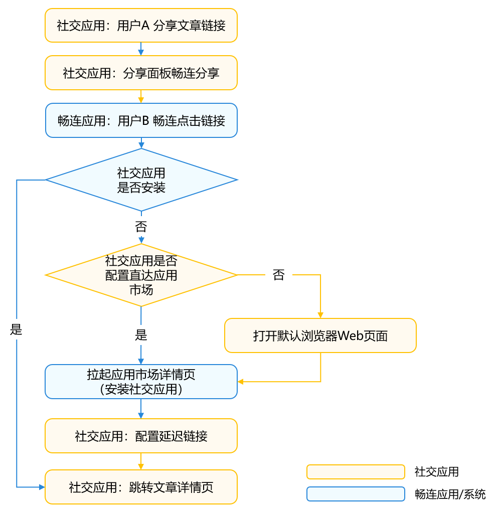
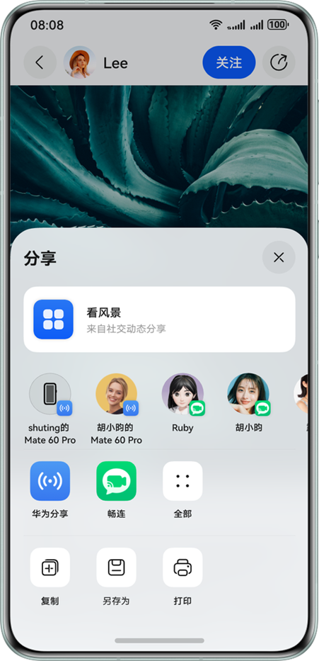
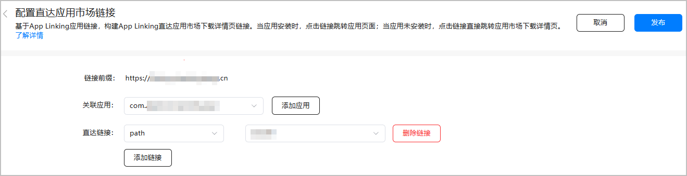
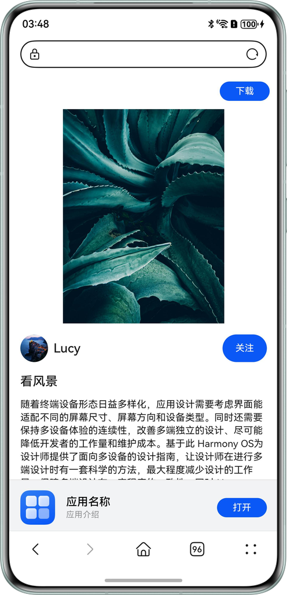
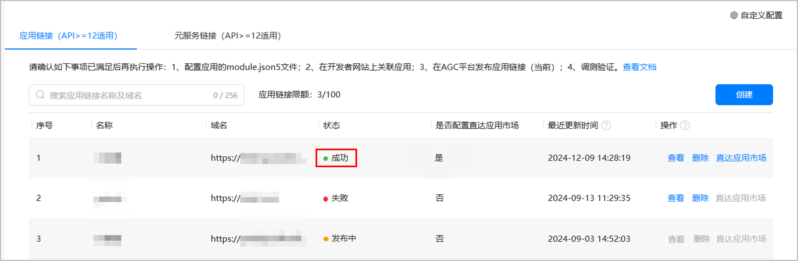
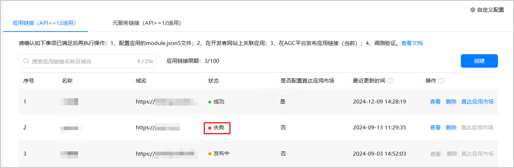

# 社交分享跳转

更新时间：2026-05-18 00:55:31

来源：https://developer.huawei.com/consumer/cn/doc/best-practices/bpta-social-share

#### 概述
随着内容社交和移动应用的发展，用户越来越习惯于通过社交平台快捷地分享文章、商品或活动等内容，并期待受邀好友能够“一键直达”目标内容。为满足这一需求，系统提供了[App Linking](https://developer.huawei.com/consumer/cn/doc/harmonyos-guides/app-linking-startup)技术，实现高效、安全且用户体验极佳的社交分享跳转。
应用场景举例：
- 用户在社交应用中分享文章、商品或活动页面给好友，好友点击链接后自动拉起目标应用对应详情页。
- 当好友未装目标应用时，自动跳转应用市场，一键安装后首次打开即直达目标内容页面。
- 若不希望强制用户安装，可跳转到浏览器中打开Web页面，让用户直接访问对应内容，并可引导安装应用以获取更完整体验。

#### 典型场景
App Linking 支持三种典型跳转场景，根据用户设备状态智能路由。

#### 场景一：目标应用已安装
用户点击分享链接后，系统直接拉起目标应用并定位到内容详情页，无需经过浏览器中转，实现一键直达，极大提高便捷度和转化率。


#### 场景二：目标应用未安装，已配置直达应用市场
当用户未安装目标应用且开发者配置了[直达应用市场](https://developer.huawei.com/consumer/cn/doc/harmonyos-guides/applinking-direct-to-ag)功能时，点击链接将直接跳转到应用市场的应用详情页。
安装完成后，首次打开应用将通过[延迟链接](https://developer.huawei.com/consumer/cn/doc/harmonyos-guides/applinking-deferredlink)功能自动导航至原始分享内容，无需用户重新搜索或操作。


#### 场景三：目标应用未安装，未配置直达应用市场（有Web页面）
用户点击链接后，系统通过浏览器打开Web页面，用户可直接查看内容。
在Web页面可提供“下载”按钮，引导用户安装应用获取更佳体验，安装后仍可通过[延迟链接](https://developer.huawei.com/consumer/cn/doc/harmonyos-guides/applinking-deferredlink)直达原内容。


> [!NOTE] 说明
> 对于不提供Web页面的应用，建议开启直达应用市场功能，避免因无法访问内容而造成体验断裂。

#### 实现原理
App Linking基于HTTPS域名校验和云端配置，自动判断目标应用是否安装、是否提供Web页面，并做出最优跳转：
- 唯一绑定与安全防护：每个分享链接与内容和目标应用强关联，有效杜绝劫持与伪造。
- 智能路由：系统根据设备状态，自动选择拉起本地应用、跳转应用市场或打开浏览器Web页面。
- [延迟链接](https://developer.huawei.com/consumer/cn/doc/harmonyos-guides/applinking-deferredlink)还原：即便用户经历先装应用再首次启动，也能还原到用户首次点开的具体内容页，极大提升转化率。
社交分享应用跳转的流程图如下所示。


上图展示了从用户分享内容到好友接收并跳转的完整流程。系统根据接收方设备状态，自动选择最佳路径，确保无论哪种情况，用户都能获得连贯流畅的体验。
1. 用户A在社交应用中生成App Linking分享链接。
2. 用户B收到并点击链接，系统根据设备环境做出相应处理（跳转目标应用/应用市场/浏览器Web页面）。
3. 若中间跳转市场并安装，首次打开App可自动直达内容页，保证体验闭环。
本文将详细介绍社交分享应用使用App Linking实现跳转的开发步骤，可根据业务需求决定是否配置直达应用市场的跳转路径。社交应用主要开发步骤如下：
- [配置App Linking服务](#section109826570198)
- [接入分享面板](#section2364187182115)
- 应用内处理并跳转指定页面
- 配置直达应用市场与延迟链接（可选）
- [Web页面开发与部署（可选）](#section157709544229)

#### 开发步骤
#### 配置App Linking服务
1. [开通App Linking服务](https://developer.huawei.com/consumer/cn/doc/harmonyos-guides/applinking-enable-applinking)。
2. [建立域名与应用关联关系](https://developer.huawei.com/consumer/cn/doc/harmonyos-guides/app-linking-startupapp#建立域名与应用关联关系)。
3. [在AGC为应用创建关联的网址域名](https://developer.huawei.com/consumer/cn/doc/harmonyos-guides/app-linking-startupapp#在agc为应用创建关联的网址域名)。
4. [在module.json5中配置关联的网址域名](https://developer.huawei.com/consumer/cn/doc/harmonyos-guides/app-linking-startupapp#在modulejson5中配置关联的网址域名)。 // entry/src/main/module.json5
{
  "module": {
 // ...
 "abilities": [
 {
 "name": "EntryAbility",
 // ...
 "exported": true,
 "skills": [
 {
 "entities": [
 "entity.system.home",
 // entities must contain "entity.system.browsable"
 "entity.system.browsable"
 ],
 "actions": [
 "ohos.want.action.home",
 // Actions must contain "ohos.want.action.viewData"
 "ohos.want.action.viewData"
 ],
 "uris": [
 {
 // The scheme must be configured as https
 "scheme": "https",
 // The host must be configured as the associated domain name
 "host": "******",
 "path": ""
 }
 ],
 // domainVerify must be set to true
 "domainVerify": true
 }
 ]
 }
 ],
 // ...
  }
}
5. 验证应用被拉起效果。 对应用进行手动签名。 编译打包，并安装应用至调试设备。 可以通过如下命令查询应用域名校验结果。 hdc shell hidumper -s AppDomainVerifyManager 运行hidumper命令后，即可在控制台上看到success消息。 BundleName:
  appIdentifier: 123456789
 domain verify status:
 https://www.example.com: success 将生成的App Linking链接保存到备忘录应用中。通过在备忘录应用中点击该链接，可以一键拉起对应的社交应用，以此来测试该社交应用是否能够成功通过App Linking链接被启动。此方法可用于验证App Linking配置的正确性以及应用的响应情况。

#### 接入分享面板
社交应用可通过集成[Share Kit（分享服务）](https://developer.huawei.com/consumer/cn/doc/harmonyos-guides/share-introduction)拉起分享面板，用于分享文章详情的App Linking链接。接收方点击链接后可直接跳转至目标应用。详细请参见[分享App Linking直达应用](https://developer.huawei.com/consumer/cn/doc/harmonyos-guides/share-utd-link#分享app-linking直达应用)。


分享内容类型设为utd.UniformDataType.HYPERLINK，content字段传递生成的App Linking链接（带内容唯一标识）。

```ArkTS
import { BusinessError } from '@kit.BasicServicesKit';
import { common } from '@kit.AbilityKit';
import { systemShare } from '@kit.ShareKit';
import { uniformTypeDescriptor } from '@kit.ArkData';
import { Logger } from '../common/Logger';
// ...
// entry/src/main/ets/pages/Detail.ets
@Entry
@Component
struct Detail {
  // ...
  private async share() {
    try {
      let context: common.UIAbilityContext = this.getUIContext().getHostContext() as common.UIAbilityContext;
      // ...
      // To construct ShareData, you need to configure a valid data message
      let shareData: systemShare.SharedData = new systemShare.SharedData({
        // The type of data shared is a link
        utd: uniformTypeDescriptor.UniformDataType.HYPERLINK,
        // The shared App Linking link is replaced with the real address here
        content: `https://hello.dra.agchosting.link?aid=${this.article?.aId}`,
        // ...
      });
      // The sharing panel is displayed
      let controller: systemShare.ShareController = new systemShare.ShareController(shareData);
      controller.show(context, {
        previewMode: systemShare.SharePreviewMode.DEFAULT,
        selectionMode: systemShare.SelectionMode.SINGLE
      })
      // ...
    } catch (err) {
      let error = err as BusinessError;
      Logger.error(TAG, `share err, code: ${error.code}, mesage: ${error.message}`);
    }
  }

  // ...
}
```

#### 应用内处理并跳转指定页面
当用户点击分享链接并拉起应用时，跳转到文章详情页有以下两种情况：
1. 应用未在后台运行：如果应用从冷启动开始（即不在后台），需要在onCreate()方法中获取链接中的文章唯一标识符aid。 // entry/src/main/ets/entryability/EntryAbility.ets
import { BusinessError } from '@kit.BasicServicesKit';
import { AbilityConstant, ConfigurationConstant, UIAbility, Want } from '@kit.AbilityKit';
import { hilog } from '@kit.PerformanceAnalysisKit';
import { window } from '@kit.ArkUI';
import { url } from '@kit.ArkTS';
import { Logger } from '../common/Logger';

const DOMAIN = 0x0000;
const TAG = 'EntryAbilityLogTag';

export default class EntryAbility extends UIAbility {
  private mAid: string = '';

  private getAid(want: Want): string {
 let uri = want?.uri;
 let aid: string = '';
 // Parse the parameters to obtain the app linking
 if (uri) {
 try {
 let urlObject = url.URL.parseURL(want?.uri);
 aid = urlObject.params.get('aid') as string;
 hilog.info(DOMAIN, 'testTag', '%{public}s', `getAid aid:${aid}`);
 } catch (err) {
 let error = err as BusinessError;
 Logger.error(TAG, `onAddForm err, code: ${error.code}, mesage: ${error.message}`);
 }
 }
 return aid;
  }

  onCreate(want: Want, launchParam: AbilityConstant.LaunchParam): void {
 hilog.info(DOMAIN, 'testTag', '%{public}s', 'Ability onCreate');
 try {
 this.context.getApplicationContext().setColorMode(ConfigurationConstant.ColorMode.COLOR_MODE_NOT_SET);
 } catch (err) {
 let error = err as BusinessError;
 Logger.error(TAG, `setColorMode err, code: ${error.code}, mesage: ${error.message}`);
 }
 this.mAid = this.getAid(want);
  }

  // ...
} 在onWindowStageCreate()回调中使用windowStage.loadContent()方法加载详情页的URL为“pages/Detail”。 // entry/src/main/ets/entryability/EntryAbility.ets
onWindowStageCreate(windowStage: window.WindowStage): void {

  let pageUrl: string = 'pages/Index';
  if (this.mAid && this.mAid !== '') {
 pageUrl = 'pages/Detail';
 AppStorage.setOrCreate('aid', this.mAid);
  }

  windowStage.loadContent(pageUrl, (err) => {
 if (err.code) {
 hilog.error(DOMAIN, 'testTag', 'Failed to load the content. Cause: %{public}s', JSON.stringify(err));
 return;
 }
 try {
 // ...
 hilog.info(DOMAIN, 'testTag', 'Succeeded in loading the content.');
 } catch (err) {
 let error = err as BusinessError;
 Logger.error(TAG, `loadContent err, code: ${error.code}, mesage: ${error.message}`);
 }
  });
}
2. 应用已在后台运行：如果应用已经在后台，它将从后台切换到前台。此时，需要在onNewWant()方法中获取链接中的文章唯一标识符aid，保存到AppStorage。 export default class EntryAbility extends UIAbility {
  private mAid: string = '';

  private getAid(want: Want): string {
 // ...
  }

  // ...
  onNewWant(want: Want, launchParam: AbilityConstant.LaunchParam): void {
 let aid: string = this.getAid(want);
 if(aid){
 AppStorage.setOrCreate('aid',aid);
 AppStorage.setOrCreate('newWantFlag',true);
 }
  }

  // ...
} 在首页通过StorageLink获取aid，并通过UIContext.getRouter().pushUrl()方法进行页面跳转。 @StorageLink('newWantFlag') @Watch('newWantFlagChange') isNewWant: boolean = false;

newWantFlagChange() {
  if (this.isNewWant && AppStorage.has('aid')) {
 let aid: string = AppStorage.get('aid') as string;
 if (aid) {
 this.isNewWant = false;
 this.getUIContext().getRouter().pushUrl({
 url: 'pages/Detail',
 params: {
 aid: aid
 }
 }).catch((error: BusinessError) => {
 Logger.error(TAG, `pushUrl err, code: ${error.code}, mesage: ${error.message}`);
 });
 }
  }
}
3. 获取到文章唯一标识aid之后，在详情页加载文章详情数据。 // entry/src/main/ets/pages/Detail.ets
@Entry
@Component
struct Detail {
  // ...
  private article: Article | undefined;

  aboutToAppear(): void {
 if (this.aid && this.aid !== '') {
 this.article = getArticleById(this.aid);
 } else {
 let params = this.getUIContext().getRouter().getParams() as Record<string, string>;
 this.article = getArticleById(params.aid);
 }
  }

  // ...
}

#### 配置直达应用市场与延迟链接（可选）
为提升用户未安装应用时的体验，可配置[直达应用市场](https://developer.huawei.com/consumer/cn/doc/harmonyos-guides/applinking-direct-to-ag)功能，引导用户下载安装应用。
在AGC控制台的App Linking服务中，开启"直达应用市场"功能。


配置完成后，当用户点击畅连中分享的App Linking链接时，若设备未安装目标应用，系统将直接跳转至应用市场的应用详情页，支持一键下载安装。


同时，需要实现[延迟链接](https://developer.huawei.com/consumer/cn/doc/harmonyos-guides/applinking-deferredlink)功能，确保安装后首次启动可直达内容。
安装完应用之后，开发者可以在用户首次打开应用时，使用延迟链接，可以直接跳转到文章详情，这一流程不仅优化了用户体验，还有助于提升链接的转化率。


通过deferredLink.[popDeferredLink()](https://developer.huawei.com/consumer/cn/doc/harmonyos-references/applinking-deferredlink-api#popdeferredlink)接口获取原始App Linking链接，并根据解析该链接直接跳转至对应的内容详情页。

```ArkTS
// entry/src/main/ets/pages/Index.ets
import { BusinessError } from '@kit.BasicServicesKit';
import { deferredLink } from '@kit.AppLinkingKit';
import { url } from '@kit.ArkTS';
import { Logger } from '../common/Logger';
// ...
@Entry
@Component
struct Index {
  // ...
  aboutToAppear(): void {
    // Get the deferred link parameter and go to the details page
    deferredLink.popDeferredLink().then((link: string) => {
      Logger.info(TAG, `Succeeded in getting deferred link, result: ${link}`);
      if (link) {
        // Get the link parameters
        let urlObject = url.URL.parseURL(link);
        let aid = urlObject.params.get('aid') as string;
        // Go to the details component
        this.getUIContext().getRouter().pushUrl({
          url: 'pages/Detail',
          params: {
            aid: aid
          }
        });
      }
    }).catch((error: BusinessError) => {
      Logger.error(TAG, `Failed to get deferred link. code: ${error.code}, message: ${error.message}`);
    });
  }
  // ...
}
```

#### Web页面开发与部署（可选）
当应用未安装且未配置直达应用市场时，系统会打开浏览器Web页面。合理的Web页面开发是完善用户体验的关键环节，特别是与[延迟链接](https://developer.huawei.com/consumer/cn/doc/harmonyos-guides/applinking-deferredlink)结合使用。
**Web页面UA适配**
首先，需要准确识别HarmonyOS设备，以实现合适的跳转和内容适配。HarmonyOS设备的User-Agent（UA）字符串中通常包含特定的标识信息。开发者应解析UA字符串，结合系统类型（例如OS名称）和版本号进行判断。
如果未正确适配UA，可能导致以下问题：
- 页面无法正确识别设备类型，影响后续的应用跳转逻辑。
- 用户被错误跳转到不适合的下载或支持页面。
- 错误的文件提供（如直接提供APK下载而非对应平台软件）。
通过UserAgent中的{OSName}字段识别HarmonyOS系统，同时通过UserAgent中的{OSName}和{OSVersion}字段识别HarmonyOS系统及版本。

```js
function matchHarmonyOS() {
  // Determine whether the recognition system is HarmonyOS.
  const isHarmonyOS = /OpenHarmony/i.test(navigator.userAgent);
  // Get system version number
  const matches = navigator.userAgent.match(/OpenHarmony (\d+\.?\d*)/);
  return isHarmonyOS && matches?.length && Number(matches[1]) >= 5;
}

function openLink() {
  if (matchHarmonyOS()) {
    // Launch the application through app linking.
    // ...
  } else {
    // Redirect logic for other platforms
  }
}
```

详细请参见[User-Agent开发指导](https://developer.huawei.com/consumer/cn/doc/harmonyos-guides/web-default-useragent)。
**实现智能跳转逻辑**
Web页面需提供两个关键功能：
1. “打开”按钮 - 尝试拉起已安装的应用。
2. “下载”按钮 - 引导未安装用户前往应用市场。


当应用已安装时，点击“打开”按钮，可以直接跳转社交应用，直达文章详情页。跳转链接使用前面[配置App Linking服务](#section109826570198)中配置的链接，例如“https://www.example.com/”，通过设置window.location.href属性进行页面跳转。

```js
function openLink() {
  if (matchHarmonyOS()) {
    // Launch the application through app linking.
    // Replace with a real usable app linking link.
    window.location.href = 'https://www.example.com?aid=' + aid;
  } else {
    // Redirect logic for other platforms
  }
}
```

当用户未安装社交应用时，点击“下载”按钮，可以直接跳转到应用市场详情页，方便用户下载安装应用，开发者可以使用应用市场的App Linking链接，通过设置window.location.href属性进行页面跳转。

```js
function toAppgallery() {
  // Replace with a real usable application market app linking link.
  window.location.href = 'https://appgallery.huawei.com/app/detail?id=com.huawei.hmsapp.books';
}
```

**延迟链接与Web页面结合**
Web页面与延迟链接的结合是创建完整用户体验的关键。当用户通过Web页面安装应用后，可通过[延迟链接](https://developer.huawei.com/consumer/cn/doc/harmonyos-guides/applinking-deferredlink)实现首次打开应用时自动跳转到原始内容。

> [!NOTE] 说明
> 为确保App Linking正常工作，需要注意：  Web页面域名应与App Linking配置的域名不同，否则系统将优先使用浏览器打开链接。 建议部署架构： 主域名（https://www.example.com）配置为App Linking域名，部署引导页。 子域名（https://m.example.com/detail）：部署实际内容页面。 引导页通过重定向将用户引导至内容页。

#### 常见问题
#### 如何查看App Linking是否在AGC上配置成功
1. 登录[AppGallery Connect](https://developer.huawei.com/consumer/cn/service/josp/agc/index.html)，点击“开发与服务”。
2. 在项目列表中点击HarmonyOS应用所在的项目。
3. 在左侧导航栏中选择“增长 > App Linking”菜单栏查看App Linking链接地址的配置状态，若为成功则表明AGC上App Linking配置成功。



#### AGC中App Linking显示配置失败如何解决
**问题现象**
App Linking菜单栏查看App Linking链接地址的配置状态如下图，显示红色圆点并文本提示失败。


**解决措施**
- 首先，显示 App Linking 状态失败并不一定意味着配置错误。也有可能是配置正确，但 AppGallery Connect（AGC）未及时更新。若不确定是否为此问题，可以采取删除链接后重新添加的方式。如果问题依旧存在，那么大概率是服务器配置问题。
- applinking.json配置文件配置错误，请参考[建立域名与应用关联关系](https://developer.huawei.com/consumer/cn/doc/harmonyos-guides/app-linking-startupapp#建立域名与应用关联关系)进行配置。
- App Linking地址仅支持https链接、若为http链接，请自行申请SSL证书。
- 检查配置文件所处的文件目录与文件权限确保外部可以访问。
若上述检查无误，建议求助网站运维侧人员，共同解决。

#### AGC上显示了配置成功，但是配置到目标方后无法拉起如何解决
**问题现象**
AGC上显示链接地址配置成功，但是配置到目标方后，尝试使用openLink()或其他拉起方式，应用并未成功拉起。
**可能原因**
1. AGC配置App Linking链接时以“/”结尾。
2. 目标方中module.json5配置的链接与AGC配置链接不一致导致无法拉起。
3. 应用未手动从AGC上申请证书签名进行应用签名。
4. 开发者所处的网络有访问限制。
5. module.json5配置文件配置错误。
**解决措施**
1. 检查AGC上配置AppLinking链接地址，当前该链接不支持末尾以“/”结尾，检查AGC配置的链接地址末尾是否多了“/”。
2. 检查module.json5中配置的链接地址与AGC中配置的链接地址是否一致，如AGC中配置了“https://www.huawei.com”而在代码中使用了“https://developer.huawei.com”。
3. 开发者请参考[验证应用被拉起效果](https://developer.huawei.com/consumer/cn/doc/harmonyos-guides/app-linking-startupapp#验证应用被拉起效果)在AGC上手动申请证书与Profile进行手动签名。
4. 重新更换其他网络。
5. 请对照以下代码检查module.json5配置是否满足要求。 // entry/src/main/module.json5
{
  "module": {
 // ...
 "abilities": [
 {
 "name": "EntryAbility",
 // ...
 "exported": true,
 "skills": [
 {
 "entities": [
 "entity.system.home",
 // entities must contain "entity.system.browsable"
 "entity.system.browsable"
 ],
 "actions": [
 "ohos.want.action.home",
 // Actions must contain "ohos.want.action.viewData"
 "ohos.want.action.viewData"
 ],
 "uris": [
 {
 // The scheme must be configured as https
 "scheme": "https",
 // The host must be configured as the associated domain name
 "host": "******",
 "path": ""
 }
 ],
 // domainVerify must be set to true
 "domainVerify": true
 }
 ]
 }
 ],
 // ...
  }
}

#### 社交应用的链接点击后，打开的浏览器Web页面显示异常
**问题现象**
社交应用的链接点击后，打开的浏览器Web页面显示空白、无法正常交互，或页面加载异常。
**可能原因**
1. Web页面的User-Agent（后续简称为UA）标识未适配HarmonyOS设备或浏览器环境，导致兼容性问题。
2. 对应的Web页面可能未完全开发或存在错误（如资源加载失败、后端服务异常等）。
3. 链接地址错误，导致无法正确加载目标页面。
**解决措施**
1. 适配UA标识。确保Web页面适配了HarmonyOS设备和配套浏览器的UA标识，以正确识别设备并跳转到对应页面或平台。详细请参见[User-Agent开发指导](https://developer.huawei.com/consumer/cn/doc/harmonyos-guides/web-default-useragent)。
2. 检查页面开发完整性。确认页面资源是否正常加载，后端接口是否返回正确数据。
3. 验证链接地址。确保社交应用的聊天界面中发送的链接地址正确无误。

#### Web页面跳转跨应用页面异常
**问题现象**
用户点击社交应用的聊天界面中的链接进入Web页面后，尝试从该应用的Web A页面跳转到跨应用的Web B页面时发生异常（例如A应用的宽带充值页面跳转B应用的支付页面，在B应用的支付页面使用时发生异常）。
- 页面跳转失败，停留在当前页面。
- 跳转后页面加载错误或显示空白。
**可能原因**
1. 目标Web B页面的UA标识未适配HarmonyOS设备或浏览器环境，导致兼容性问题。
2. 目标Web B页面资源加载失败。
**解决措施**
1. 适配UA标识。确保Web B页面适配了HarmonyOS设备和配套浏览器的UA标识，以正确识别设备并跳转到对应页面或平台。详细请参见[User-Agent开发指导](https://developer.huawei.com/consumer/cn/doc/harmonyos-guides/web-default-useragent)。
2. 检查Web B页面的资源加载情况。

#### Web页面跳转应用异常
**问题现象**
用户从社交应用的聊天界面中的链接跳转到Web页面后，尝试通过页面操作跳转应用时发生异常，例如：
1. 点击“打开”按钮后无反应。
2. 点击“下载”按钮后跳转到错误平台，或提示直接下载APK包。
**可能原因**
1. 点击“打开”按钮无反应，可能是因为目标应用未正确配置跳转逻辑（例如App Linking），或者配置过程中存在错误。
2. 点击“打开”按钮无反应，Web页面使用链接不正确。
3. 目标应用未安装，点击“下载”按钮，触发应用下载逻辑跳转到应用下载的Web页面，但如果Web页面未正确适配HarmonyOS设备的UA标识，导致跳转到错误平台，或提示直接下载APK包。
**解决措施**
- 检查跳转逻辑。确保Web页面跳转的目标应用正确配置了App Linking。详细请参见[配置App Linking服务](#section109826570198)。
- 检查Web页面“打开”跳转地址的正确性。使用正确的App Linking跳转地址。
- 适配UA标识。确保Web页面适配了HarmonyOS设备和配套浏览器的UA标识，以正确识别设备并跳转到对应页面或平台。详细请参见[User-Agent开发指导](https://developer.huawei.com/consumer/cn/doc/harmonyos-guides/web-default-useragent)。

#### 示例代码
- [基于App Linking实现社交分享跳转](https://gitcode.com/harmonyos_samples/SocialShareJump)