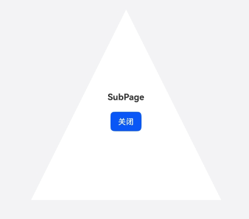
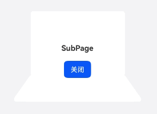
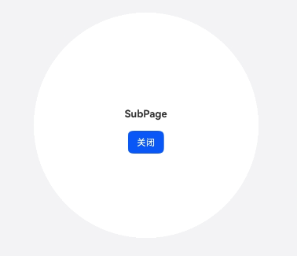

# PC/2in1异形窗口

更新时间：2026-05-22 09:46:30

来源：https://developer.huawei.com/consumer/cn/doc/best-practices/bpta-2in1-window-shape

**   


#### 概述

 
一般情况下，UI开发都是在矩形窗口上操作，但在PC/2in1设备上，应用还可以使用各类异形窗口来展现交互内容。这里的异形是指除默认矩形以外的形状，包括但不限于圆形、三角形以及其他不规则的形状等。开发者通过使用这些异形形状的窗口，结合窗口中的内容展示UI交互的多样性，一定程度上能够提升应用体验。类似的示例有：文字应用中的放大镜、带指示箭头的气泡框、提供辅助功能的悬浮窗等。
 
本文主要介绍在PC/2in1设备上实现异形窗口。根据窗口的形状类别，可分为以下场景：
 
- [图形形状窗口](#section6137113512381)
- [不规则形状窗口](#section42071254407)

 

#### 实现原理

在创建窗口时，ArkUI以宽、高为参数描绘窗口初始大小，其形状默认为矩形，可以通过设置掩码改变窗口最终呈现的形状。
 
该掩码是一个二维数组，其大小对应初始窗口的宽和高，所以可以把该数组中的元素与窗口中的像素一一对应起来；数组中的每一项值只能是0或1，其中数字0表示窗口对应位置的像素是透明的，数字1代表对应像素不透明。
 
简单来说，掩码即是由数字1描绘的窗口形状点阵图。具体使用可参考[setWindowMask()](https://developer.huawei.com/consumer/cn/doc/harmonyos-references/arkts-apis-window-window#setwindowmask12)接口。
 
 

#### 开发流程

1. 创建异形子窗口或悬浮窗，设置窗口的位置、大小等属性，设置窗口加载的page页面。
2. 根据待实现的异形形状，计算出与其对应的二维数组掩码，对目标窗口设置该掩码。
3. 根据逻辑需要，显示目标异形窗口。
 
> [!NOTE]
> 掩码windowMask二维数组的大小需要与窗口初始宽、高一致，且每项值只能是0或1，否则设置的形状不会生效。

 

#### 图形形状窗口

 

#### 场景案例

 
待开发的异形窗口，其形状是具有一定规则的几何图形，通过描述语言能得到精确且唯一的形状。本节以下面两种形状的实现为例进行说明：直径为500的圆形；底500、高500的等腰三角形。
 

#### 创建子窗口

在得到异形窗口前，需要先创建一个默认的矩形窗口，开发步骤如下：
 1. 为使用setWindowMask()等接口，需要额外配置syscap.json文件，在模块/src/main目录下，创建syscap.json文件，填入以下内容：

  
```json
// entry/src/main/syscap.json
{
  "devices": {
    "general": [
      "2in1"
    ]
  },
  "development": {
    "addedSysCaps": [
      "SystemCapability.Window.SessionManager"
    ]
  }
}
```

2. 具体代码中，使用createSubWindow()创建子窗口（参考[设置应用子窗口](https://developer.huawei.com/consumer/cn/doc/harmonyos-guides/application-window-stage#设置应用子窗口)），或使用createWindow()接口创建悬浮窗（参考[设置悬浮窗受限开放](https://developer.huawei.com/consumer/cn/doc/harmonyos-guides/application-window-stage#设置全局悬浮窗受限开放)），设置窗口的位置、大小及其他属性等，然后使用setUIContent()接口设置窗口加载的page页面。

  
```ArkTS
windowStage = AppStorage.get('windowStage');
if (windowStage === null) {
  hilog.error(0x0000, 'Sample', 'Failed to create the subwindow. Cause: windowStage is null');
  return;
}
const windowWidth = 500;
const windowHeight = 500;
try {
  subWindow = await windowStage!.createSubWindow('mySubWindow');
  subWindow.moveWindowTo(300, 300);
  subWindow.resize(windowWidth, windowHeight);
  subWindow.setUIContent('pages/SubPage');
  // ...
  subWindow.showWindow();
} catch (exception) {
  hilog.error(0x0000, 'Sample', 'Failed to create sub window. Cause: ' + JSON.stringify(exception));
}
```

 
 

#### 设置窗口形状

1. 根据要实现的异形窗口形状，计算二维数组掩码windowMask。

  
- 以下是以原矩形中点为圆心、直径为500的圆。最终效果见圆形子窗口效果。
```ArkTS
function fillCircle(array: number[][], x: number, y: number, radius: number): void {
  for (let i = x - radius; i <= x + radius; i++) {
    for (let j = y - radius; j <= y + radius; j++) {
      const distSquared = (i - x)**2 + (j - y)**2;
      if (distSquared <= radius**2 && i >= 0 && j >= 0 && i < array.length && j < array[0].length) {
        array[i][j] = 1;
      }
    }
  }
}

async function getCircleMask(width: number, height: number): Promise<number[][]> {
  const radius = Math.min(width, height) / 2;
  const maskArray: number[][] = new Array(height).fill(null).map(() => new Array(width).fill(0));
  fillCircle(maskArray, height / 2, width / 2, radius);
  return maskArray;
}
```


2. 以下以原矩形宽为底边、原矩形高为高的等腰三角形。最终效果见三角形子窗口效果。
```ArkTS
function fillTriangle(array: number[][], base: number, height: number): void {
  // i < height-10 in order to remove the round corner
  for (let i = 0; i < height - 10; i++) {
    for (let j = 0; j < base; j++) {
      if (j >= base / 2 - base / 2 * i / height && j <= base / 2 + base / 2 * i / height) {
        array[i][j] = 1;
      }
    }
  }
}

async function getTriangleMask(width: number, height: number): Promise<number[][]> {
  const maskArray: number[][] = new Array(height).fill(null).map(() => new Array(width).fill(0));
  fillTriangle(maskArray, width, height);
  return maskArray;
}
```


3. 使用setWindowMask(windowMask)接口，设置窗口形状。

  
```ArkTS
async function setWindowShape(win: window.Window, width: number,
  height: number, getMaskFunc: (w: number, h: number, picPath?: string) => Promise<number[][]>,
  picPath?: string): Promise<void> {
  const windowMask = await getMaskFunc(width, height, picPath);
  if (canIUse('SystemCapability.Window.SessionManager')) {
    try {
      win.setWindowMask(windowMask);
    } catch (e) {
      let err = e as BusinessError;
      hilog.error(0x0000, 'Simple', `failed code=${err.code}, message=${err.message}`);
    }
  } else {
    hilog.info(0x0000, 'Simple', 'can not use SessionManager syscap');
  }
}

/**
 * Set the window with circle shape
 * @param win The target window
 * @param width The original window width
 * @param height The original window height
 */
export async function setWindowCircleShape(win: window.Window, width: number,
  height: number): Promise<void> {
  setWindowShape(win, width, height, getCircleMask)
}

/**
 * Set the window with triangle shape
 * @param win The target window
 * @param width The original window width
 * @param height The original window height
 */
export async function setWindowTriangleShape(win: window.Window, width: number,
  height: number): Promise<void> {
  setWindowShape(win, width, height, getTriangleMask)
}
```


4. 使用showWindow()接口显示异形子窗口。

  
```ArkTS
subWindow.showWindow();
```


  

  #### 实现效果

  图1 **圆形子窗口效果**



  图2 **三角形子窗口效果**


  

  #### 不规则形状窗口

  

  #### 场景案例

  待开发的异形窗口，呈现出不规则的形状。这种情况通常先由设计人员提供图形文件，开发人员以文件为输入，基于ArkUI提供的图片处理能力，转化为相应的形状掩码，最后实现不规则的窗口形状。

  图3 **不规则示例图**



  本节以上图为例说明不规则形状窗口的实现过程。

  

  #### 开发步骤

  首先同样需要先[创建子窗口](#section10343161441819)，然后再依以下步骤开发。

1. 读取图片文件，将其转化为pixelMap数据。

  
```ArkTS
/**
 * Convert image to PixelMap object
 */
export async function image2PixelMap(Context: Context, icon: string, w: number, h: number): Promise<image.PixelMap> {
  try {
    const rawFileDescriptor: resourceManager.RawFileDescriptor = Context.resourceManager.getRawFdSync(icon);
    const imageSource: image.ImageSource = image.createImageSource(rawFileDescriptor);
    const pixelMap: Promise<PixelMap> = imageSource.createPixelMap({
      editable: false,
      desiredPixelFormat: image.PixelMapFormat.BGRA_8888,
      desiredSize: { width: w, height: h }
    });
    imageSource.release()
    return pixelMap;
  } catch (e) {
    let err = e as BusinessError;
    hilog.error(0x0000, 'Simple', `failed code=${err.code}, message=${err.message}`);
  }
  return new Promise<image.PixelMap>((resolve, reject) => {
    reject('null')
  });
}
```


2. 从pixelMap数据中取出颜色信息数组，将每个像素的透明度单独提取至allPixels，再转化生成为对应形状的二维数组掩码maskArray。

  
```ArkTS
export async function getPicMask(Context: Context,width: number, height: number, picPath: string): Promise<number[][]> {
  const maskArray: number[][] = new Array(height).fill(null).map(() => new Array(width).fill(0));
  const pixelMap: image.PixelMap = await image2PixelMap(Context, picPath, width, height);
  const pixelArrayBuffer: ArrayBuffer = new ArrayBuffer(width * height * 4);
  await pixelMap.readPixelsToBuffer(pixelArrayBuffer);
  const allPixels: number[] = [];
  const unit8Pixels: Uint8Array = new Uint8Array(pixelArrayBuffer);
  for (let i = 0, j = 0; i < unit8Pixels.length; i += 4, j++) {
    // unit8Pixels[i+3] is alpha channel of BGRA_8888
    allPixels[j] = unit8Pixels[i + 3] > 0 ? 1 : 0;
  }
  pixelMap.release()
  let k = 0;
  for (let i = 0; i < height; i++) {
    for (let j = 0; j < width; j++) {
      maskArray[i][j] = allPixels[k++];
    }
  }
  return maskArray;
}
```


3. 使用setWindowMask(windowMask)接口，设置窗口形状。

  
```ArkTS
async function setWindowShape(win: window.Window, width: number,
  height: number, getMaskFunc: (w: number, h: number, picPath?: string) => Promise<number[][]>,
  picPath?: string): Promise<void> {
  const windowMask = await getMaskFunc(width, height, picPath);
  if (canIUse('SystemCapability.Window.SessionManager')) {
    try {
      win.setWindowMask(windowMask);
    } catch (e) {
      let err = e as BusinessError;
      hilog.error(0x0000, 'Simple', `failed code=${err.code}, message=${err.message}`);
    }
  } else {
    hilog.info(0x0000, 'Simple', 'can not use SessionManager syscap');
  }
}
/**
 * Set the window with pic shape
 * @param win The target window
 * @param width The original window width
 * @param height The original window height
 * @param picPath The pic path in rawfile
 */
export async function setWindowPicShape(win: window.Window, Context: Context, width: number,
  height: number, picPath: string): Promise<void> {
  setWindowShape(win, width, height, (w, h, picPath) => {
    return getPicMask(Context,w, h, picPath!)
  }, picPath)
}
```


4. 使用showWindow()接口显示异形子窗口。

  
```ArkTS
subWindow.showWindow();
```


  

  #### 实现效果

  图4 **不规则形状子窗口效果




  

  #### **示例代码**

  
[实现PC/2in1异形窗口](https://gitcode.com/harmonyos_samples/special-window-shape)
