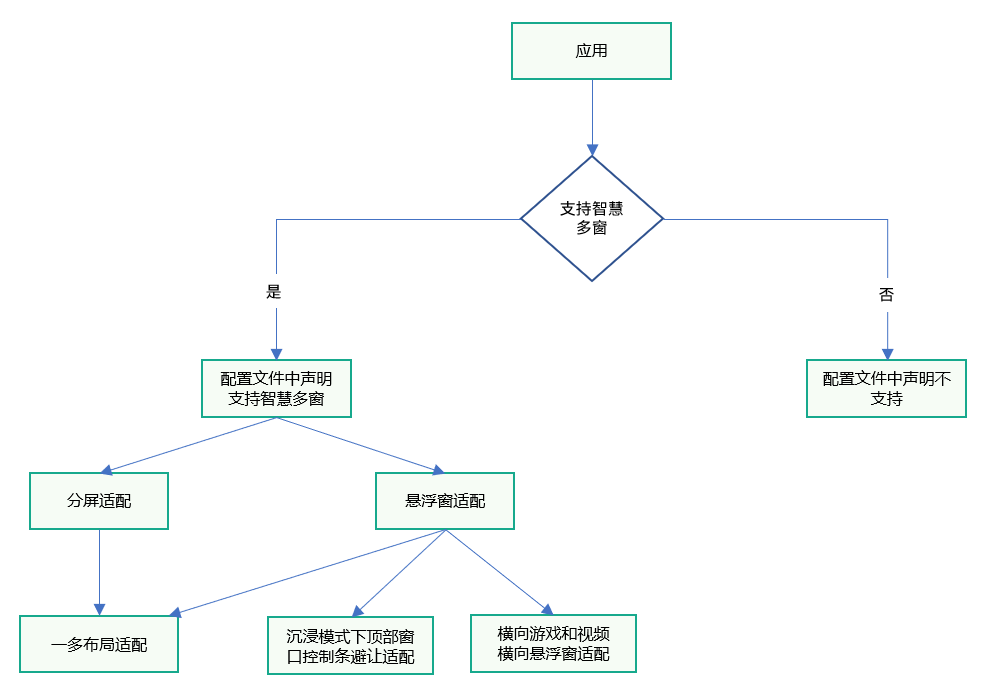
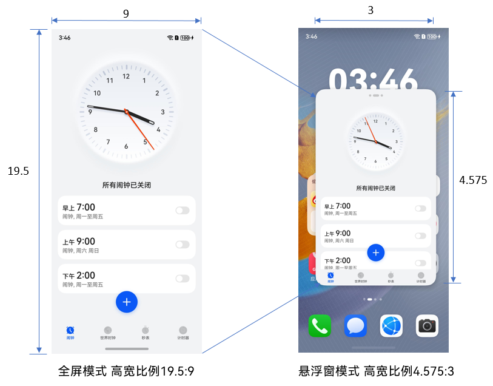
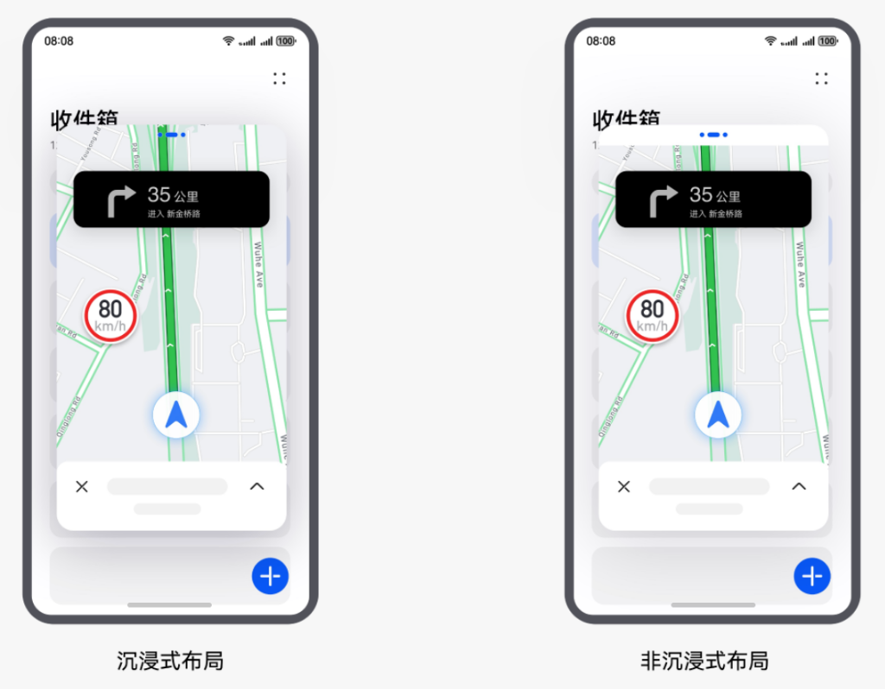

# 智慧多窗

更新时间：2026-05-22 09:46:30

来源：https://developer.huawei.com/consumer/cn/doc/best-practices/bpta-multi-window-practice

#### 概述
智慧多窗是一种多任务处理解决方案，允许用户在同一时间、同一屏幕上以悬浮窗或分屏的方式同时运行多个应用窗口。在智慧多窗的显示模式下，用户可以根据自己的需求，合理安排应用窗口的位置和大小。目前智慧多窗的形式，主要包含悬浮窗和分屏。
- **悬浮窗**：设备屏幕上悬浮的、非全屏的应用窗口。一般用于在已有全屏任务运行的基础上，临时处理另一个任务，或短时间多任务并行使用。如浏览网页的同时回复消息。
- **分屏**：分屏一般用于两个应用长时间并行使用的场景。例如边看购物攻略、边浏览商品；边看视频、边玩游戏；看学习类视频的同时做笔记等。
由于应用从全屏进入智慧多窗（悬浮窗/分屏）模式后，窗口尺寸、宽高比例会发生变化，往往会产生一些布局的适配问题。例如，分屏后页面内容显示不全无法滑动、视频被压缩导致宽高比不正确，应用开启悬浮窗后内容和状态栏的重叠区域无法响应用户操作等。
本文将主要介绍悬浮窗/分屏布局适配方案，以及智慧多窗开发过程中的一些常见问题以及解决方案，来帮助开发者快速适配智慧多窗布局开发，提升用户使用体验。
在阅读本文前开发者可以先了解下关于智慧多窗的UX设计规范，具体可以参考[多窗口交互](https://developer.huawei.com/consumer/cn/doc/design-guides/system-features-multi-window-interaction-0000001795392917)。

#### 智慧多窗适配方案
悬浮窗和分屏功能是由系统提供的能力，不需要开发者单独开发功能，所以开发者只需要考虑应用悬浮或者分屏之后应用界面的适配问题。
首先开发者需要考虑应用是否需要支持悬浮窗/分屏能力，如果确定应用需要支持悬浮窗/分屏能力，则需要考虑布局适配问题，进行布局一多适配。在一些特殊的场景下，比如沉浸模式下，顶部窗口控制条遮挡住了重要信息或者重叠区域有事件需要响应的时候，需要考虑控制条的避让适配；横向游戏和视频需要考虑横向悬浮窗适配。开发者可以参考下面的流程图进行智慧多窗适配。



#### 配置声明支持智慧多窗
当应用需要配置是否支持悬浮窗/分屏能力时，可以通过在module.json5配置文件中[abilities标签](https://developer.huawei.com/consumer/cn/doc/harmonyos-guides/module-configuration-file#abilities标签)下添加supportWindowMode字段来实现，supportWindowMode属性主要标识当前UIAbility所支持的窗口模式，详细请参见[应用声明支持智慧多窗](https://developer.huawei.com/consumer/cn/doc/harmonyos-guides/multi-window-support)。

#### 一多布局适配
在使用多窗口功能时，窗口的尺寸会发生变化，可能影响布局。以下是两种情况的具体描述：
- **进入分屏模式**：当手机设备进入分屏模式时，窗口高度缩小为原来的1/2或1/3，宽度保持不变。由于内容页面大小未作相应调整，垂直方向的内容可能被截断，且页面无法滚动查看完整内容。
- **进入竖向悬浮窗模式**：在这种模式中，窗口内容会根据窗口大小进行等比缩放。但是，窗口的高宽比变为3:4.575，这与全屏模式（通常为16:9或4:3）的比例不同。纵向比例相对于横向较小，这也可能导致内容截断现象。
这种对比说明，在多窗口使用时，需要特别注意布局的可视性和内容的可访问性，以确保用户体验。

> [!NOTE] 说明
> 关于不同设备悬浮窗宽高比、应用分屏窗口高度比例详细请参见应用布局适配智慧多窗。


针对应用进入悬浮窗/分屏出现的页面内容截断、挤压、堆叠等问题，开发者可以参考[一次开发，多端部署](https://developer.huawei.com/consumer/cn/doc/best-practices/bpta-multi-device-overview)中关于页面开发的[多设备界面开发](https://developer.huawei.com/consumer/cn/doc/best-practices/bpta-multi-device-page)，通过[自适应布局](https://developer.huawei.com/consumer/cn/doc/best-practices/bpta-multi-device-adaptive-layout)和[响应式布局](https://developer.huawei.com/consumer/cn/doc/best-practices/bpta-multi-device-responsive-layout)**，**来使应用自适应窗口的大小变化。例如示例[布局适配问题](#section3687216112915)节：界面被截断，无法上下滑动，使用了一多的[延伸能力](https://developer.huawei.com/consumer/cn/doc/best-practices/bpta-multi-device-adaptive-layout#延伸能力)。

#### 沉浸模式下顶部窗口控制条避让适配
沉浸式布局是指应用布局不避让状态栏、导航栏以及智慧多窗顶部横条，这可能发生组件与顶部横条的重叠，导致文字遮挡、点击事件冲突等情况。


顶部横条的避让可通过以下两种方式适配，具体可以参考[顶部窗口控制条避让适配智慧多窗](https://developer.huawei.com/consumer/cn/doc/harmonyos-guides/multi-window-controlbar-adapt)。
- **使用窗口的避让能力**：通过[setWindowLayoutFullScreen()](https://developer.huawei.com/consumer/cn/doc/harmonyos-references/arkts-apis-window-window#setwindowlayoutfullscreen9)设置窗口布局是否为沉浸式布局。沉浸式布局是指应用布局不避让状态栏、导航栏以及智慧多窗顶部横条，这可能发生组件与顶部横条的重叠，导致文字遮挡、点击事件冲突等情况。非沉浸式布局是指布局避让状态栏、导航栏以及智慧多窗顶部横条，组件不会与其重叠。因此可设置setWindowLayoutFullScreen()接口的参数为false使窗口的布局为非沉浸式布局。
- **应用主动避让**：应用不使用窗口避让能力（即设置窗口为沉浸式布局），还通过[getWindowAvoidArea()](https://developer.huawei.com/consumer/cn/doc/harmonyos-references/arkts-apis-window-window#getwindowavoidarea9)接口可获取屏幕顶部需要规避的矩阵区域topRect，获取到该值后应用可对应做布局避让。同时可通过[on('avoidAreaChange')](https://developer.huawei.com/consumer/cn/doc/harmonyos-references/arkts-apis-window-window#onavoidareachange9)监听系统规避区域变化以进行布局的动态调整。
顶部横条的避让具体实践可以参考：[沉浸模式下顶部窗口控制条避让问题](#section533165015358)。

#### 横向游戏和视频横向悬浮窗适配
悬浮窗默认是竖向的，但是对于横向游戏和视频应用，横向的悬浮窗体验会更好。开发者可以通过在module.json5配置文件中abilities标签下的preferMultiWindowOrientation属性增加“landscape”或者“landscape_auto”配合API以声明应用支持横向悬浮窗或上下分屏模式。

```json
{
  "module": {
    // ...
    "abilities": [
      {
        "name": "EntryAbility",
        // ...
        "preferMultiWindowOrientation": "landscape_auto"
      }
    ],
    // ...
  }
}
```

preferMultiWindowOrientation属性主要标识当前UIAbility多窗布局方向，具体可以参考[应用声明支持智慧多窗](https://developer.huawei.com/consumer/cn/doc/harmonyos-guides/multi-window-support)中关于preferMultiWindowOrientation的属性的描述**。**当设置preferMultiWindowOrientation属性为“landscape_auto”表示多窗布局动态可变为横向，需要配合API（[enableLandscapeMultiWindow](https://developer.huawei.com/consumer/cn/doc/harmonyos-references/arkts-apis-window-window#enablelandscapemultiwindow12) / [disableLandscapeMultiWindow](https://developer.huawei.com/consumer/cn/doc/harmonyos-references/arkts-apis-window-window#disablelandscapemultiwindow12)）使用，建议视频类应用配置，视频播放界面适配横屏悬浮窗效果图如下，具体使用可以参考：[横向悬浮窗适配问题](#section4595191593711)。


#### 常见问题
为了帮助开发者快速对智慧多窗进行布局适配，下面列举了一些常见的智慧多窗布局适配问题，接下来介绍如何使用前面讲到的一些适配方案来解决这些问题。
下面将常见问题分为以下三类，开发者可以使用前面对应的适配方案进行适配：
- 布局适配问题：这类问题一般是由于进入分屏/悬浮窗时，由于窗口高度缩小，导致的布局混乱、被截断等问题。
- 沉浸模式下顶部窗口控制条避让问题：在沉浸模式下，应用分屏后视图和悬浮窗顶部重合的区域无法响应操作的问题。
- 横屏悬浮窗适配问题：对于横向游戏和视频应用横向的悬浮窗体适配问题。

#### 布局适配问题
1. 界面被截断，无法上下滑动。问题现象 应用分屏后内容显示不全，无法通过上下滑动展示未显示的内容。   优化前示例代码如下： @Component
export struct Question1Incorrect {
  build() {
 NavDestination() {
 Column({ space: 12 }) {
 Text('Text1')
 .fontSize(50)
 .width('100%')
 .textAlign(TextAlign.Center)
 .height(350)
 .backgroundColor(Color.Brown)

 Text('Text2')
 .fontSize(50)
 .width('100%')
 .textAlign(TextAlign.Center)
 .height(350)
 .backgroundColor(Color.Orange)
 }
 // ...
 }
 // ...
  }
} 可能原因 应用只适配了全屏大小，当应用分屏/悬浮窗后，窗口会变小，导致页面显示不全，超出窗口的区域无法显示。 解决措施 使用一多的延伸能力，增加Scroll组件，让列表或者文字区域可以按照指定方向滑动，优化后示例代码如下： @Component
export struct Question1Correct {
  build() {
 NavDestination() {
 Scroll() {
 Column({ space: 12 }) {
 Text('Text1')
 .fontSize(50)
 .width('100%')
 .textAlign(TextAlign.Center)
 .height(350)
 .backgroundColor(Color.Brown)

 Text('Text2')
 .fontSize(50)
 .width('100%')
 .textAlign(TextAlign.Center)
 .height(350)
 .backgroundColor(Color.Orange)
 }
 }
 // ...
 }
 // ...
  }
} 优化后效果如下图所示。
2. Xcomponent视频画面在分屏页面显示不全。问题现象 视频播放界面分屏后，视频被截断显示不全。  可能原因 在进入分屏页面，窗口的height变成了屏幕的1/2，应用没有对这种情况进行适配，导致Xcomponent宽度没变为之前的1/2导致视频形变。优化前示例代码如下： @Component
export struct Question2Incorrect {
  @State aspect: number = 9 / 16; // default video height/width ratio value
  @State xComponentWidth: number = this.getUIContext().px2vp(display.getDefaultDisplaySync().width);
  @State xComponentHeight: number = this.getUIContext().px2vp(display.getDefaultDisplaySync().width * this.aspect);
  // ...

  build() {
 NavDestination() {
 Stack() {
 XComponent({ id: 'video_player_id', type: XComponentType.SURFACE, controller: this.xComponentController })
 // ...
 .width(this.xComponentWidth)
 .height(this.xComponentHeight)
 }
 .width('100%')
 .height('100%')
 .backgroundColor(Color.Black)
 }
 .hideTitleBar(true)
  }
} 解决措施 使用布局约束的aspectRatio属性指定XComponent组件的宽高比，设置aspectRatio属性后，组件宽高会受父组件内容区大小限制。 @Component
export struct Question2Correct {
  @State aspect: number = 9 / 16; // default video width/height ratio value
  // ...

  build() {
 NavDestination() {
 Stack() {
 XComponent({ id: 'video_player_id', type: XComponentType.SURFACE, controller: this.xComponentController })
 // ...
 .aspectRatio(this.aspect)
 }
 .width('100%')
 .height('100%')
 .backgroundColor(Color.Black)
 }
 // ...
  }
} 优化后效果如下图所示。
3. Video组件在分屏状态下截断。问题现象 Video组件在分屏状态下，视频播放界面被截断显示不全。  优化前示例代码如下： @Component
export struct Question3Incorrect {
  build() {
 NavDestination() {
 Column() {
 Video({ src: \$rawfile('testVideo2.mp4') })
 .height('100%')
 .width('100%')
 .autoPlay(true)
 .controls(false)
 }
 .height('100%')
 .width('100%')
 }
 .hideTitleBar(true)
  }
} 可能原因 给Video组件宽高设置的均为100%，Video组件默认保持宽高比进行缩小或者放大，使得视频铺满屏幕。当应用分屏后，由于窗口宽度不变，高度变为原来的1/2，Video组件的高度会超出窗口高度，导致视频显示不全。 解决措施 给Video组件设置.objectFit(ImageFit.Contain)属性，使视频保持宽高进行缩小或者放大，使得视频完全显示在Video组件边界内，优化后示例代码如下： @Component
export struct Question3Correct {
  build() {
 NavDestination() {
 Column() {
 Video({ src: \$rawfile('testVideo2.mp4') })
 // ...
 .objectFit(ImageFit.Contain)
 }
 .height('100%')
 .width('100%')
 }
 .hideTitleBar(true)
  }
} 优化后效果如下图所示。
4. 子组件超出父组件的范围。问题现象 子组件显示超出了父组件范围，无法通过上下滑动显示完全。  优化前示例代码如下： @Component
export struct Question4Incorrect {

  @Builder
  customDialogComp() {
 Column() {
 Text('Top')
 // ...

 Scroll() {
 Text('Middle')
 // ...
 }
 .layoutWeight(1)

 Text('Bottom')
 // ...
 }
 .height(500)
 .justifyContent(FlexAlign.SpaceBetween)
  }

  build() {
 // ...
  }
} 可能原因 子组件设置为了固定值，当应用分屏的时候，屏幕高度变为原来的1/2，父组件高度会随之变小。如果此时子组件高度大于父组件，就会导致子组件无法完全显示。 解决措施 子组件使用constraintSize约束子组件跟随父容器的大小，建议用子组件占用父组件的高度百分比，而不是绝对值，优化后示例代码如下： @Builder
customDialogComp() {
  Column() {
 Text('Top')
 // ...

 Scroll() {
 Text('Middle')
 // ...
 }
 .layoutWeight(1)

 Text('Bottom')
 // ...
  }
  .height(500)
  .justifyContent(FlexAlign.SpaceBetween)
  .constraintSize({
 maxHeight: '90%'
  })
} 优化后效果如下图所示：
5. Image组件在分屏状态下显示异常。问题现象 应用进入分屏后，随着窗口变小，Image组件显示不全，页面布局显示异常。  优化前示例代码如下： @Component
export struct Question5Incorrect {
  build() {
 NavDestination() {
 Flex({ direction: FlexDirection.Column, alignItems: ItemAlign.Center }) {
 Text("Login Page")
 // ...
 Text("Login in to access more services")
 // ...

 Image(\$r('app.media.login_pic'))
 // ...

 Column() {
 TextInput({ placeholder:  "Account" })
 // ...

 TextInput({ placeholder:"Password" })
 // ...
 }
 // ...

 Button(\$r('app.string.login'))
 // ...
 }
 // ...
 }
 // ...
  }
} 可能原因 在进入分屏页面，窗口的height变成了屏幕的1/2，导致image组件的height变小，image图片形变。 解决措施 推荐开发者通过一多的隐藏能力来实现，按照其预设的显示优先级，随容器组件尺寸变化显示或隐藏，通过设置布局优先级（displayPriority属性）来控制显隐。示例代码如下： @Component
export struct Question5Correct {
  build() {
 NavDestination() {
 Flex({ direction: FlexDirection.Column, alignItems: ItemAlign.Center }) {
 Text("Login Page")
 // ...
 .displayPriority(4)

 Text("Login in to access more services")
 // ...
 .displayPriority(3)

 Image(\$r('app.media.login_pic'))
 // ...
 .displayPriority(2)

 Column() {
 TextInput({ placeholder: "Account" })
 // ...

 TextInput({ placeholder: "Password" })
 // ...
 }
 // ...
 .displayPriority(5)
 // ...
 Button(\$r('app.string.login'))
 // ...
 .displayPriority(5)
 }
 // ...
 }
 // ...
  }
} 优化后效果如下图所示：
6. 弹窗布局错乱。问题现象 进入分屏后弹窗页面内容显示错乱，底部按钮挡住弹窗内容。  优化前示例代码如下： @CustomDialog
struct CustomDialogComp1 {
  controller: CustomDialogController = new CustomDialogController({ 'builder': '' });

  build() {
 Column() {
 Text(\$r('app.string.welcome'))
 // ...

 Column() {
 Scroll() {
 Text(\$r('app.string.dialog_content'))
 // ...
 }
 }

 Row({ space: 12 }) {
 Button(\$r('app.string.disagree'))
 // ...
 Button(\$r('app.string.agree'))
 // ...
 }
 .height(56)
 .alignItems(VerticalAlign.Top)
 .position({
 bottom: 0,
 left: 0
 })
 }
 .constraintSize({
 maxHeight: '80%'
 })
 // ...
  }
} 可能原因 应用未考虑分屏窗口尺寸变小的情况，弹窗高度设置为固定值，且底部按钮使用position属性设置了固定位置，导致整体布局错乱。 解决措施 使用constraintSize属性给弹窗高度限定最大值，同时使用Scroll组件包裹弹窗内容区域（一多的延伸能力），通过给内容区域的Column组件设置layoutWeight（一多的占比能力）属性，使其占据剩余空间，使操作按钮居于底部显示。当内容高度超过内容区域高度的时候可以滚动进行查看，优化后示例代码如下： @CustomDialog
struct CustomDialogComp {
  controller: CustomDialogController = new CustomDialogController({ 'builder': '' });

  build() {
 Column() {
 Text(\$r('app.string.welcome'))
 // ...

 Column() {
 Scroll() {
 Text(\$r('app.string.dialog_content'))
 // ...
 }
 }
 .layoutWeight(1)

 Row({ space: 12 }) {
 Button(\$r('app.string.disagree'))
 // ...
 Button(\$r('app.string.agree'))
 // ...
 }
 .height(56)
 .alignItems(VerticalAlign.Top)
 }
 .constraintSize({
 maxHeight: '80%'
 })
 .height(400)
 // ...
  }
} 优化后效果如下图所示。

#### 沉浸模式下顶部窗口控制条避让问题
**沉浸式应用在悬浮窗场景下顶部操作栏无法操作**
**问题现象**
应用分屏后视图和悬浮窗顶部重合的区域无法响应操作。


优化前示例代码如下：

```ArkTS
@Component
export struct Question7Incorrect {
  private windowClass: window.Window | undefined = undefined;

  aboutToAppear(): void {
    try {
      this.windowClass=(this.getUIContext().getHostContext() as common.UIAbilityContext).windowStage.getMainWindowSync();
      this.windowClass.setSpecificSystemBarEnabled('status', false).catch((error:BusinessError) => {
        Logger.error(TAG, `setSpecificSystemBarEnabled err, code: ${error.code}, message: ${error.message}`);
      });
    } catch (err) {
      let error = err as BusinessError;
      Logger.error(TAG, `aboutToAppear err, code: ${error.code}, message: ${error.message}`);
    }
  }

  aboutToDisappear(): void {
    this.windowClass?.setSpecificSystemBarEnabled('status', true).catch((error:BusinessError) => {
      Logger.error(TAG, `setSpecificSystemBarEnabled err, code: ${error.code}, message: ${error.message}`);
    });
  }

  build() {
    NavDestination() {
      Stack() {
        // ...

        Row() {
          Image($r('app.media.icon_pause'))
            // ...
            .onClick(() => {
              try {
                this.getUIContext().getPromptAction().showToast({
                  message: 'Action success'
                });
              } catch (err) {
                let error = err as BusinessError;
                Logger.error(TAG, `showToast err, code: ${error.code}, message: ${error.message}`);
              }
            })
        }
        .height('100%')
        .width('100%')
        .justifyContent(FlexAlign.End)
        .alignItems(VerticalAlign.Top)
      }
    }
    .hideTitleBar(true)
  }
}
```

**可能原因**
沉浸式应用顶部没有避让，导致悬浮窗顶部bar与应用的顶部区域重叠，重叠区域中的按钮无法响应点击事件。
**解决措施**
通过[getWindowAvoidArea](https://developer.huawei.com/consumer/cn/doc/harmonyos-references/arkts-apis-window-window#getwindowavoidarea9)接口可获取屏幕顶部需要规避的矩阵区域topRect，获取到该值后应用可对应做布局避让。同时可通过[on('avoidAreaChange')](https://developer.huawei.com/consumer/cn/doc/harmonyos-references/arkts-apis-window-window#onavoidareachange9)监听系统规避区域变化以进行布局的动态调整。具体可以参考[顶部窗口控制条避让适配智慧多窗](https://developer.huawei.com/consumer/cn/doc/harmonyos-guides/multi-window-controlbar-adapt)，优化后示例代码如下：

```ArkTS
@Component
export struct Question7Correct {
  private windowClass: window.Window | undefined = undefined;
  @State topSafeHeight: number = 0;
  @State windowStatus: WindowStatusType = window.WindowStatusType.FULL_SCREEN;

  aboutToAppear(): void {
    try {
      this.windowClass=(this.getUIContext().getHostContext() as common.UIAbilityContext).windowStage.getMainWindowSync();
      this.windowClass.setSpecificSystemBarEnabled('status', false).catch((error:BusinessError) => {
        Logger.error(TAG, `setSpecificSystemBarEnabled err, code: ${error.code}, message: ${error.message}`);
      });
      this.windowStatus = this.windowClass.getWindowStatus();

      if (this.windowStatus === window.WindowStatusType.FLOATING) {
        this.topSafeHeight = this.getUIContext()
          .px2vp(this.windowClass.getWindowAvoidArea(window.AvoidAreaType.TYPE_SYSTEM).topRect.height);
      }

      this.windowClass.on('windowStatusChange', data => {
        if (data === window.WindowStatusType.FLOATING) {
          this.topSafeHeight =
            this.getUIContext()
              .px2vp(this.windowClass?.getWindowAvoidArea(window.AvoidAreaType.TYPE_SYSTEM).topRect.height);
        } else {
          this.topSafeHeight = 0;
        }
      })
    } catch (err) {
      let error = err as BusinessError;
      Logger.error(TAG, `aboutToAppear err, code: ${error.code}, message: ${error.message}`);
    }
  }

  aboutToDisappear(): void {
    this.windowClass?.setSpecificSystemBarEnabled('status', true).catch((error:BusinessError) => {
      Logger.error(TAG, `setSpecificSystemBarEnabled err, code: ${error.code}, message: ${error.message}`);
    });
  }

  build() {
    // ...
  }
}
```

优化后效果如下图所示。


#### 横向悬浮窗适配问题
**视频播放未适配横向悬浮窗**
**问题现象**
视频或者游戏类应用在横屏模式下，开启悬浮窗后，页面没有适配横屏，导致内容显示不全或者观看体验不好。


优化前示例代码如下：

```ArkTS
@Component
export struct Question8Incorrect {
  build() {
    NavDestination() {
      Column() {
        Video({ src: $rawfile('testVideo1.mp4') })
          .height('100%')
          .width('100%')
          .autoPlay(true)
          .objectFit(ImageFit.Contain)
          .controls(false)
      }
      .height('100%')
      .width('100%')
    }
    .hideTitleBar(true)
  }
}
```

**可能原因**
悬浮窗默认是竖屏，需要应用主动适配横屏的属性值。
**解决措施**
开发者可以通过在module.json5配置文件中abilities标签下的preferMultiWindowOrientation属性增加“landscape_auto”。

```json
{
  "module": {
    // ...
    "abilities": [
      {
        "name": "EntryAbility",
        // ...
        "preferMultiWindowOrientation": "landscape_auto"
      }
    ],
    // ...
  }
}
```

该场景下多窗布局动态可变为横向，需要配合API（enableLandscapeMultiWindow / disableLandscapeMultiWindow）使用。

```ArkTS
@Component
export struct Question8Correct {
  private windowClass: window.Window | undefined = undefined;

  aboutToAppear(): void {
    try {
      this.windowClass=(this.getUIContext().getHostContext() as common.UIAbilityContext).windowStage.getMainWindowSync();
      this.windowClass.enableLandscapeMultiWindow().catch((error:BusinessError) => {
        Logger.error(TAG, `enableLandscapeMultiWindow err, code: ${error.code}, message: ${error.message}`);
      });
    } catch (err) {
      let error = err as BusinessError;
      Logger.error(TAG, `aboutToAppear err, code: ${error.code}, message: ${error.message}`);
    }


  }

  aboutToDisappear(): void {
    this.windowClass?.disableLandscapeMultiWindow().catch((error:BusinessError) => {
      Logger.error(TAG, `disableLandscapeMultiWindow err, code: ${error.code}, message: ${error.message}`);
    });
  }

  build() {
    // ...
  }
}
```

优化后效果如下图所示。


#### 总结
智慧多窗中的悬浮窗和分屏能力是系统提供的，开发者不需要人为进行功能开发，但是开发者需要重点关注是悬浮窗/分屏模式下的应用的布局适配问题。下面总结了一些常见的布局适配经验：
- 如果应用不需要使用悬浮窗/分屏能力，建议只声明supportWindowMode的值为“fullscreen”。
- 开发者可以参考[一次开发，多端部署概览](https://developer.huawei.com/consumer/cn/doc/best-practices/bpta-multi-device-overview)中关于页面开发的[多设备界面开发](https://developer.huawei.com/consumer/cn/doc/best-practices/bpta-multi-device-page)，避免应用在使用悬浮窗/分屏能力时，页面出现截断、挤压、堆叠等现象。
- 通过[setWindowLayoutFullScreen()](https://developer.huawei.com/consumer/cn/doc/harmonyos-references/arkts-apis-window-window#setwindowlayoutfullscreen9)方法来动态的设置应用是否沉浸，从而确认是否规避状态栏。
- 在悬浮窗模式下，通过[on('avoidAreaChange')](https://developer.huawei.com/consumer/cn/doc/harmonyos-references/arkts-apis-window-window#onavoidareachange9)方法来获取状态栏高度，使应用内容区域规避状态栏。