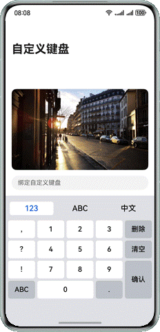
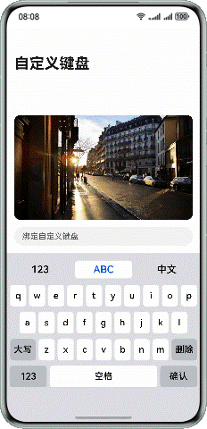
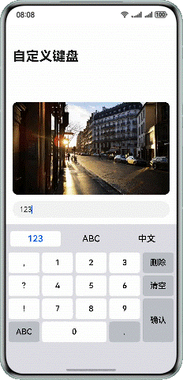
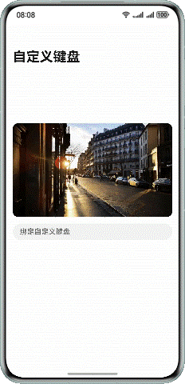

# 自定义键盘

更新时间：2026-03-12 08:45:02

来源：https://developer.huawei.com/consumer/cn/doc/best-practices/bpta-custom-keyboard

**   


#### 概述

自定义键盘是一种简易的键盘替代系统默认键盘，允许用户根据实际业务场景和习惯偏好，调整键盘的布局和位置、添加额外的功能键，使输入更加便捷和舒适，从而提升整体的用户体验。同时自定义键盘也可以增强用户输入的安全性，避免敏感信息被截取或者泄露。
 
本文将从以下几个方面介绍自定义键盘的实现和使用：
 
- [自定义键盘的实现](#section2059651742117)
- [自定义键盘和系统键盘的切换](#section20427115971010)
- [自定义键盘的布局避让](#section3179730192019)
- [自定义键盘实现防截屏](#section193891441919)

 
 

#### 自定义键盘的实现

自定义键盘的实现包括以下几个步骤：
 
- [自定义键盘布局实现](#section131317262217)
- [输入控件绑定自定义键盘布局](#section147941149222)
- [自定义键盘输入控制](#section19880122132213)
- [自定义键盘光标控制](#section15636163317224)
- [自定义键盘弹出与收起](#section173493918225)

 
 

#### 自定义键盘布局实现

自定义键盘的布局以自定义组件的方式呈现，根据具体业务场景由开发者实现。自定义键盘的高度通过自定义组件根节点的height属性设置，宽度不可设置，默认为屏幕宽度。
 
```ArkTS
@Component
export struct CustomKeyboard {
  // ...
  build() {
    Column() {
      // ...
    }
    // ...
    .height(this.getKeyboardHeightVp())
    // ...
  }
}
```
 
以Grid方式实现数字键盘布局示例：
 
图1 ****


```ArkTS
@Component
export struct NumberKeyboard {
  @Consume inputText: string;
  @Consume keyboardController: KeyboardController;
  layoutOptions: GridLayoutOptions = {
    regularSize: [1, 1],
    irregularIndexes: [14, 16],
    onGetIrregularSizeByIndex: (index: number) => {
      if (index === 14) {
        return [2, 1];
      }
      return [1, 2];
    }
  };

  build() {
    Grid(undefined, this.layoutOptions) {
      ForEach(numberKeyboardData, (item: Menu) => {
        GridItem() {
          Button(item.text, { type: ButtonType.Normal })
            .fontColor(Color.Black)
            .backgroundColor(item.backgroundColor)
            .borderRadius(Constants.KEYBOARD_BUTTON_RADIUS)
            .fontSize(Constants.KEYBOARD_BUTTON_FONTSIZE_18)
            .padding(0)
            .width(item.width)
            .height(item.height)
            .onClick(() => {
              this.inputText = this.keyboardController.onInput(item.text);
            })
        }
      }, (item: Menu) => JSON.stringify(item))
    }
    .columnsTemplate('1fr 1fr 1fr 1fr 1fr')
    .rowsGap($r('app.float.number_keyboard_grid_gap'))
    .columnsGap($r('app.float.number_keyboard_grid_gap'))
  }
}
```
 
 
 

#### 输入控件绑定自定义键盘布局

输入控件（TextArea、TextInput、RichEditor、Search）支持通过[customKeyboard](https://developer.huawei.com/consumer/cn/doc/harmonyos-references/ts-basic-components-textinput#customkeyboard10)属性绑定自定义键盘布局。绑定自定义键盘后，输入控件获取焦点时，不会拉起系统键盘，而是加载指定的自定义键盘。本文后续以TextInput控件为例进行介绍。
 
图2 ****


 
代码示例如下：
 
```ArkTS
build() {
    Column() {
      TextInput({
        placeholder: 'Bind Custom Keyboard',
        text: this.inputText,
        controller: this.textInputController
      })
        // ...
        .customKeyboard(this.isCustomKeyboardAttach ? this.customKeyboard() : null)
          // ...
    }
  }
  @Builder
  customKeyboard() {
    CustomKeyboard()
  }
}
```
 
 

#### 监听键盘弹出与收起

 
在输入组件内,使用@Link和@Watch('onChangeKeyboard')修饰isKeyboardShown；
 
当键盘状态变化后,会调用onChangeKeyboard,此时要收起键盘,则执行和键盘控制器绑定的文字输入控制器的stopEditing。
 
```ArkTS
@Component
export struct TextInputComponent {
  // ...
  @Link @Watch('onChangeKeyboard') isKeyboardShown: boolean;
  // ...
  onChangeKeyboard() {
    if (this.isKeyboardShown === false) {
      this.textInputController.stopEditing();
    }
  }

  // ...
}
```
 
输入组件内有两个事件：
 
onFocus代表获得焦点,用户点击输入组件的时候,输入组件会获得焦点从而弹出键盘,此时设定isKeyboardShown为true,表示弹起;
 
onBlur代表失去焦点,当输入组件失去焦点,会被调用, 此时设为isKeyboardShown为false,表示收起; 
```ArkTS
.onBlur(() => {
  this.isKeyboardShown = false;
  // ...
})
.onFocus(() => {
  this.isKeyboardShown = true;
  // ...
})
```
 
 
页面内的isKeyboardShown要和输入组件TextInputComponent 建立双向绑定,用来监听isKeyboardShown变化,响应键盘的弹出与收起.
```ArkTS
@Entry
@Component
struct MainPage {
  // ...
  @State isKeyboardShown: boolean = false;
  // ...
  build() {
    Navigation() {
      Column() {
        // ...
      }
      // ...
    }
    .onClick(() => {
      if (this.isKeyboardShown) {
        this.isKeyboardShown = false;
      }
    })
    .mode(NavigationMode.Stack)
    .titleMode(NavigationTitleMode.Full)
    .title($r('app.string.main_page_title'))
  }
}
```
 
 

#### 在横竖屏切换时设置键盘高度

 
在键盘组件 CustomKeyboard.ets 引入方向检测与动态高度，在键盘组件内对应位置处理。
 
引入 @ohos.display ，新增 @State isLandscape 保存当前方向。
 
在 aboutToAppear 注册监听器 display.on('change') ，在aboutToDisappear 注销监听器，方向变化时调用 updateOrientation(), 通过 display.getDefaultDisplaySync() 判断 width > height 判定横屏。
 
```ArkTS
@Component
export struct CustomKeyboard {
  // ...

  aboutToAppear(): void {
    this.updateOrientation();
    try {
      display.on('change', this.onDisplayChange);
    } catch (e) {
      // ignore
    }
  }

  aboutToDisappear(): void {
    try {
      display.off('change', this.onDisplayChange);
    } catch (e) {
      // ignore
    }
  }

  private updateOrientation() {
    try {
      const d = display.getDefaultDisplaySync();
      this.isLandscape = d.width > d.height;
    } catch (e) {
      this.isLandscape = false;
    }
  }
  // ...
}
```
 
重写 getKeyboardHeightVp() ，判断设备为平板的时候，按照平板的比例给予，横屏0.33，竖屏0.22的屏幕高度占比，手机的话固定为0.36的占比高度。
 
```ArkTS
@Component
export struct CustomKeyboard {
  // ...

  private getKeyboardHeightVp(): number | Resource {
    try {
      const d = display.getDefaultDisplaySync();
      const ui = this.getUIContext();
      const screenHeightVp = ui.px2vp(d.height);
      const shortSideVp = ui.px2vp(Math.min(d.width, d.height));
      // Approximate judgment for tablet/large screen
      const isLargeScreen = shortSideVp >= 600;
      // Phone: Portrait/Landscape 36% (no orientation switching supported)
      // Tablet: Portrait 22%, Landscape 33% (reduce height to adapt to large screen)
      const ratio = isLargeScreen
          ? (this.isLandscape ? 0.33 : 0.22)
          :  0.36;
  
      return Math.floor(screenHeightVp * ratio);
    } catch (e) {
      return $r('app.float.keyboard_total_height');
    }
  }
  // ...
}
```
 
修改组件高度，将键盘组件的 .height(...) 改为 .height(this.getKeyboardHeightVp()) 以采用动态计算值。
```ArkTS
@Component
export struct CustomKeyboard {
  // ...
  build() {
    // ...
    // ...
    .padding({ left: $r('app.float.keyboard_padding'), right: $r('app.float.keyboard_padding') })
    .height(this.getKeyboardHeightVp())
    .width('100%')
    .backgroundColor($r('app.color.keyboard_background_color'))
  }
}
```
 
 

#### 自定义键盘输入控制

自定义键盘可以拦截手势事件，通过对状态变量的修改，实现文本的输入。
 
图3 ****


 
以英文键盘为例，监听EnglishButton的onClick事件，修改状态变量。
 
```ArkTS
@Component
struct EnglishButton {
  @Consume inputText: string;
  // ...

  build() {
    Button({ type: ButtonType.Normal })
    // ...
    .onClick(() => {
      this.inputText = this.keyboardController.onInput(this.getEnglishText(this.item));
    })
  }
}
```
 
通过对状态变量inputText的修改，实现文本输入。
 
```ArkTS
@Component
export struct TextInputComponent {
  @Provide inputText: string = '';
  // ...
  build() {
    Column() {
      TextInput({
        placeholder: 'Bind Custom Keyboard',
        text: this.inputText,
        controller: this.textInputController
      })
        // ...
    }
  }
  // ...
}
```
 
 

#### 自定义键盘光标控制

通过监听TextInput的[onTextSelectionChange](https://developer.huawei.com/consumer/cn/doc/harmonyos-references/ts-basic-components-textinput#ontextselectionchange10)生命周期，获取初始光标位置，文本输入后，调用TextInputController的[caretPosition](https://developer.huawei.com/consumer/cn/doc/harmonyos-references/ts-basic-components-textinput#caretposition8)方法，设置最终光标位置。
 
图4 ****


 
获取光标位置：
 
```ArkTS
TextInput({
  placeholder: 'Bind Custom Keyboard',
  text: this.inputText,
  controller: this.textInputController
})
  // ...
  .onTextSelectionChange((start: number, end: number) => {
    this.keyboardController.setCaretPosition(start, end);
  })
    // ...
```
 
设置光标位置：
 
```ArkTS
onChange(value: string) {
  this.text = value;
  if (this.keyboardType !== 'System') {
    this.textInputController?.caretPosition(this.targetCaretPos);
  }
}
```
 
 

#### 自定义键盘弹出与收起

通过对焦点进行控制，可以实现键盘的弹出和收起，参考[软键盘的弹出收起和监听](https://developer.huawei.com/consumer/cn/doc/best-practices/bpta-keyboard-layout-adapt#section117216355229)。
 
开发者也可以通过TextInputController的[stopEditing](https://developer.huawei.com/consumer/cn/doc/harmonyos-references/ts-basic-components-textinput#stopediting10)方法控制键盘关闭，下面的自定义键盘示例中，点击确认按键关闭自定义键盘。
 
图5 ****


```ArkTS
onInput(value: string | Resource): string {
  // ...

  switch (value.id) {
    // ...
    case $r('app.string.keyboardButton_finish').id:
      this.textInputController?.stopEditing();
      break;
  // ...
  }
  return this.text;
}
```
 
 
 

#### 自定义键盘和系统键盘的切换

当需要实现同一个输入框内可以切换自定义键盘和系统键盘时，可以通过如下方式实现：
 
Tab栏点击“123”、“ABC”按钮，this.isCustomKeyboardAttach为true，TextInput绑定自定义键盘；点击“中文”按钮，this.isCustomKeyboardAttach为false，切换系统键盘。
 
图6 ****


```ArkTS
TextInput({
  placeholder: 'Bind Custom Keyboard',
  text: this.inputText,
  controller: this.textInputController
})
  // ...
  .customKeyboard(this.isCustomKeyboardAttach ? this.customKeyboard() : null)
```
 
 
 

#### 自定义键盘的布局避让

 

#### 使用系统提供的自定义键盘避让功能

为了确保输入框不被自定义键盘挡住，系统默认提供了输入框避让自定义键盘的能力。在TextInput组件的customKeyboard属性设置[supportAvoidance](https://developer.huawei.com/consumer/cn/doc/harmonyos-references/ts-basic-components-richeditor#keyboardoptions12)为true，开启系统提供的自定义键盘避让功能。键盘的避让机制和常见问题的解决方法，可以参考[软键盘布局适配场景介绍](https://developer.huawei.com/consumer/cn/doc/best-practices/bpta-keyboard-layout-adapt#section08221814182316)。
 
图7 ****


```ArkTS
// entry/src/main/ets/view/TextInputComponent.ets
TextInput({
  placeholder: 'Bind Custom Keyboard',
  text: this.inputText,
  controller: this.textInputController
})
  .customKeyboard(this.customKeyboard(), { supportAvoidance: true })
    // ...
```
 
 
 
系统默认的自定义键盘避让功能只能保证输入框不被遮挡，输入框下方的组件可能会被自定义键盘挡住，如上图中所示，输入框下方的tab栏被自定义键盘挡住。为解决这一问题，需要开发者自己实现自定义键盘的避让功能。
 

#### 开发者自己实现自定义键盘的避让功能

开发者需要监听自定义键盘根节点的onAreaChange生命周期，获取自定义键盘的高度，根据实际场景设置布局的避让。
 
图8 **



 
监听自定义键盘布局的onAreaChange生命周期，通过newValue.height获取自定义键盘弹出时的高度，根据实际业务场景计算布局避让高度avoidHeight。
 
```ArkTS
@Component
export struct CustomKeyboard {
  // ...
  build() {
    Column() {
      // ...
    }
    .onAreaChange((oldValue: Area, newValue: Area) => {
      this.customKeyboardHeight = Number(newValue.height);
      let avoidHeight: number = (this.isCustomKeyboardAttach ? this.customKeyboardHeight : this.systemKeyboardHeight)
        - this.bottomRectHeight;
      this.keyboardController.changeAvoidHeight(avoidHeight);
    })
    // ...
  }
}
```
 
通过[emitter](https://developer.huawei.com/consumer/cn/doc/harmonyos-references/js-apis-emitter)的方式，发送自定义键盘高度变化的通知。
 
```ArkTS
changeAvoidHeight(value: number) {
  let event: emitter.InnerEvent = {
    eventId: Constants.AVOID_EVENT_ID
  };
  let eventData: emitter.EventData = {
    data: {
      'avoidHeight': value
    }
  };
  emitter.emit(event, eventData);
}
```
 
接收到高度变化通知后，根据实际业务场景，设置页面的避让高度。
 
```ArkTS
@Entry
@Component
struct MainPage {
  @State bottomPadding: number = 210;
  @State isKeyboardShown: boolean = false;
  aboutToAppear(): void {
    let event: emitter.InnerEvent = {
      eventId: 1
    }
    emitter.on(event, (eventData: emitter.EventData) => {
      if (eventData.data) {
        let avoidHeight: number = eventData.data['avoidHeight'];
        if (avoidHeight === 0) {
          this.bottomPadding = 210;
        } else {
          this.bottomPadding = avoidHeight;
        }
      }
    })
  }
  build() {
    Navigation() {
      Column() {
        // ...
      }
      .padding({ bottom: this.bottomPadding })
      // ...
    }
    .onClick(() => {
      if (this.isKeyboardShown) {
        this.isKeyboardShown = false;
      }
    })
    .mode(NavigationMode.Stack)
    .titleMode(NavigationTitleMode.Full)
    .title($r('app.string.main_page_title'))
  }
}
```
 
 

#### 自定义键盘实现防截屏

用户使用自定义键盘输入敏感信息时，可以设置禁止截屏，有效防止他人在未经许可的情况下获取用户的敏感信息，从而保护用户的隐私安全。具体实现参考[如何实现防截屏功能](https://developer.huawei.com/consumer/cn/doc/harmonyos-faqs/faqs-arkui-3)。
 
 

#### 示例代码

- [实现自定义键盘功能](https://gitcode.com/harmonyos_samples/CustomizeKeyboard)
