# 软键盘布局适配

更新时间：2026-05-18 00:55:31

来源：https://developer.huawei.com/consumer/cn/doc/best-practices/bpta-keyboard-layout-adapt

#### 概述
软键盘是用户进行交互的重要途径之一，同时软键盘的弹出和收起，可能会影响到正在显示的UI元素，影响用户体验，出现如下常见的软键盘布局适配问题：
- 重要信息被软键盘遮挡：当软键盘弹出时，输入框或其它重要UI元素可能会被键盘遮挡，导致用户无法看到或访问它们。
- 软键盘弹出导致布局错位：内容可能会不恰当上移，影响用户体验。
- 软键盘弹出导致弹窗过度上抬：弹窗被键盘上顶，造成不好的体验。
本文将介绍以下知识帮助开发者了解软键盘的弹出和收起的控制、避让机制以及软键盘常见问题的解决方法。

#### 软键盘的弹出收起和监听
用户点击输入框时，软键盘默认弹出。但在特定场景下，需要对软键盘的弹出和收起进行控制，如点击空白区域收起软键盘，进入页面时输入框主动获焦。开发者还需根据软键盘状态和高度调整页面布局。

#### 主动获焦弹出软键盘
有时候进入页面，希望页面中的输入框能主动获焦并且弹出软键盘，方便用户直接输入，例如，点击应用首页的搜索框，进入应用搜索页面。


可以通过将输入框的defaultFocus设置为true来实现。

```ArkTS
TextInput()
  .defaultFocus(true)
```

#### 代码控制弹出软键盘
开发者可以使用FocusController的[requestFocus()](https://developer.huawei.com/consumer/cn/doc/harmonyos-references/arkts-apis-uicontext-focuscontroller#requestfocus12)方法，通过组件的id将焦点转移到组件树对应的实体节点，并且弹出软键盘。例如，表情面板切换到文本输入时，点击表情图标拉起系统软键盘，便于用户直接输入。

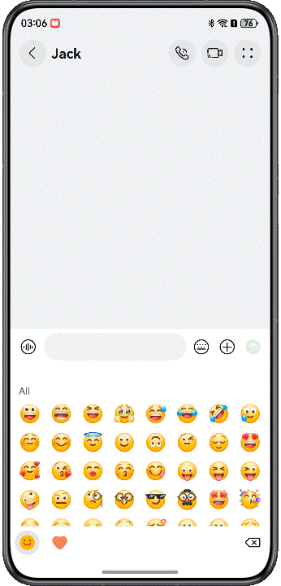
示例如下：

```ArkTS
TextInput({ placeholder: 'Please enter a contact name' })
  .id('input1')

Button('login')
  .onClick(() => {
    this.getUIContext().getFocusController().requestFocus('input1');
  })
```


> [!CAUTION] 说明
> 


> 使用requestFocus需要保证TextInput组件已经挂载完成，应避免在组件未创建的情况下使用。

#### 代码控制收起软键盘
通过全局的焦点控制对象FocusController的[clearFocus()](https://developer.huawei.com/consumer/cn/doc/harmonyos-references/arkts-apis-uicontext-focuscontroller#clearfocus12)方法，软键盘收起，例如在下面的搜索页面中，点击搜索按钮时软键盘收起。

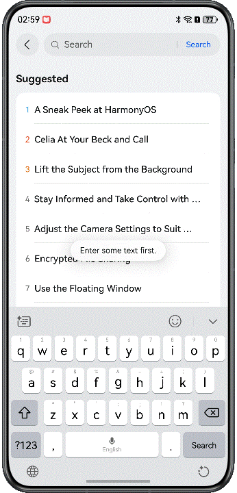
示例代码如下：

```ArkTS
Button('Search')
  .onClick(() => {
    this.getUIContext().getFocusController().clearFocus();
  })
```

此外，开发者可调用[stopEditing()](https://developer.huawei.com/consumer/cn/doc/harmonyos-references/ts-basic-components-textinput#stopediting10)方法来关闭键盘，该方法需为输入框单独绑定一个TextInputController对象。在存在多个输入框的场景下，需要绑定多个TextInputController对象，使用起来较为繁琐，推荐改用clearFocus()方法来解除焦点。

```ArkTS
@Component
struct StopEditingCpt {
  private controller: TextInputController = new TextInputController();

  build() {
    Column() {
      TextInput({ placeholder: 'Input', controller: this.controller })

      Button('Search')
        .onClick(() => {
          this.controller.stopEditing();
        })
    }
  }
}
```

#### 监听获取软键盘高度
开发者可以通过获取软键盘高度、监听软键盘的弹出和收起状态，调整组件位置以适配界面或显示隐藏某些组件。通过[window](https://developer.huawei.com/consumer/cn/doc/harmonyos-references/js-apis-window)模块的[on('keyboardHeightChange')](https://developer.huawei.com/consumer/cn/doc/harmonyos-references/arkts-apis-window-window#onkeyboardheightchange7)方法开启软键盘高度变化的监听，实时获取软键盘高度。例如下面这个示例软键盘弹起后显示表情栏，软键盘收起后隐藏表情栏。

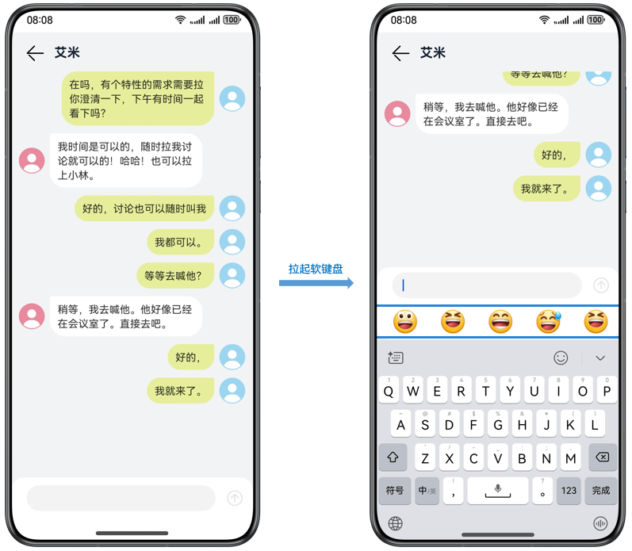
上面效果图的实现示例代码如下，通过[on('keyboardHeightChange')](https://developer.huawei.com/consumer/cn/doc/harmonyos-references/arkts-apis-window-window#onkeyboardheightchange7)方法实时获取软键盘高度（返回值为整数，单位为px），并赋值给变量keyboardHeight。当keyboardHeight为0的时候表示软键盘处于收起状态，此时隐藏表情栏；keyboardHeight不为0的时候表示软键盘处于弹出状态，此时显示表情栏。

```ArkTS
import { window } from '@kit.ArkUI';
import { BusinessError } from '@kit.BasicServicesKit';
import { hilog } from '@kit.PerformanceAnalysisKit';

@Entry
@Component
struct GetKeyboardHeightDemo {
  @State keyboardHeight: number = 0; // Soft keyboard height

  aboutToAppear(): void {
    try {
      window.getLastWindow(this.getUIContext().getHostContext()).then(currentWindow => {
        currentWindow.on('keyboardHeightChange', (data: number) => {
          this.keyboardHeight = this.getUIContext().px2vp(data);
        })
      })
    } catch (error) {
      let err = error as BusinessError;
      hilog.error(0x0000, 'GetKeyboardHeightDemo',
        `getLastWindow failed, error code=${err.code}, message=${err.message}`);
    }
  }

  build() {
    Column() {
      // ...
      TextInput()

      if (this.keyboardHeight > 0) {
        Row() { // Emoji
          // ...
        }

        // ...
      }
    }
  }
}
```

#### 监听获取安全区域高度
通过[window](https://developer.huawei.com/consumer/cn/doc/harmonyos-references/arkts-apis-window)模块的[on('avoidAreaChange')](https://developer.huawei.com/consumer/cn/doc/harmonyos-references/arkts-apis-window-window#onavoidareachange9)方法开启当前窗口系统规避区变化的监听，获取内容可视区域大小，同时也可以监听软键盘的弹出收起。根据软键盘弹出后的可视区域大小，动态调整布局中组件的高度以适配界面。具体运用可以参考[软键盘避让常见问题](https://developer.huawei.com/consumer/cn/doc/best-practices/bpta-keyboard-layout-adapt#section085404710246)中**通过监听软键盘弹出，实现软键盘避让**示例。

```ArkTS
import { KeyboardAvoidMode, window } from '@kit.ArkUI';
import { UIAbility } from '@kit.AbilityKit';
import { BusinessError } from '@kit.BasicServicesKit';
import { hilog } from '@kit.PerformanceAnalysisKit';

@Entry
@Component
struct GetSafeAreaHeightDemo {
  @State screenHeight: number = 0; // The height of the safe area
  @State isKeyBoardHidden: boolean = false; // Whether the soft keyboard is hidden

  aboutToAppear(): void {
    try {
      window.getLastWindow(this.getUIContext().getHostContext()).then(currentWindow => {
        let property = currentWindow.getWindowProperties();
        let avoidArea = currentWindow.getWindowAvoidArea(window.AvoidAreaType.TYPE_KEYBOARD);
        // Initialize the display area height
        this.screenHeight = this.getUIContext()
          .px2vp(property.windowRect.height - avoidArea.topRect.height - avoidArea.bottomRect.height);
        // Enables the monitoring of changes in the avoidance zone of the current window
        currentWindow.on('avoidAreaChange', data => {
          if (data.type !== window.AvoidAreaType.TYPE_KEYBOARD) {
            return;
          }
          if (data.area.bottomRect.height <= 0) {
            this.isKeyBoardHidden = true;
          } else {
            this.isKeyBoardHidden = false;
          }
          this.screenHeight = this.getUIContext()
            .px2vp(property.windowRect.height - data.area.topRect.height - data.area.bottomRect.height);
          hilog.info(0x0000, 'GetSafeAreaHeightDemo', `screen height is: ${this.screenHeight}`);
        })
      })
    } catch (error) {
      let err = error as BusinessError;
      hilog.error(0x0000, 'GetSafeAreaHeightDemo',
        `getLastWindow failed, error code=${err.code}, message=${err.message}`);
    }
  }

  build() {
    Column() {
      TextInput()
    }
  }
}
```

#### 软键盘避让机制
解决软键盘的界面适配问题，首先需要了解在HarmonyOS系统中软键盘的避让机制是怎么样的。

#### 软键盘默认避让效果
为了确保输入框不被软键盘挡住，系统默认提供了输入框避让软键盘的能力，结合下面这个输入框列表，介绍软键盘避让的主要表现形式。

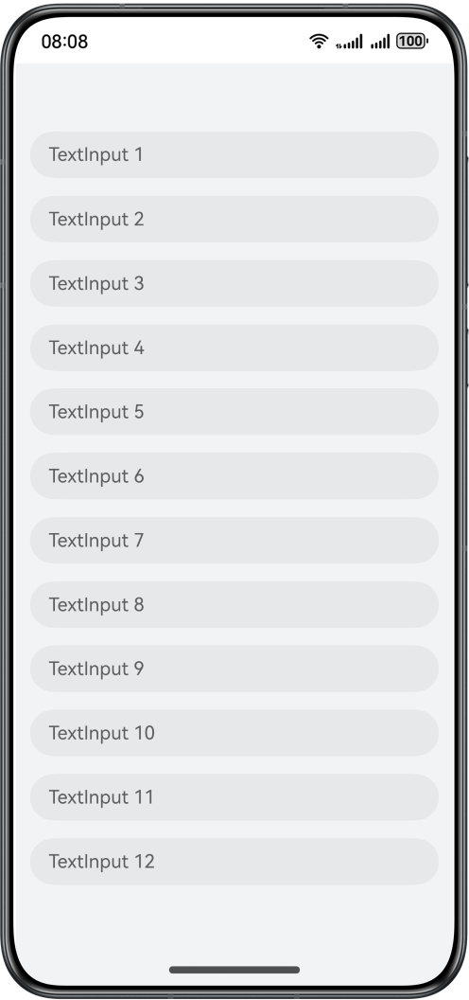
默认情况下，系统针对输入框位置，执行安全避让策略，保证输入框不会被软键盘遮挡：
- 如果当前输入框不会被软键盘遮挡，则不上抬组件，如图所示点击输入框1，组件不会上抬。
- 当前输入框会被软键盘遮挡，则上抬组件至刚好在软键盘上方显示完整的输入框，输入框上方的组件会跟着抬起，下方的组件不会露出。

| 描述 | 如果当前输入框不会被软键盘遮挡，则不上抬组件，如图所示点击输入框1，组件不会上抬。 | 如果当前输入框会被软键盘遮挡，则上抬组件至刚好在软键盘上方显示完整的输入框，输入框上方的组件会跟着抬起，下方的组件不会露出，可以看到输入框11下方的输入框12不会露出。 |
| --- | --- | --- |
| 效果图 |  |  |

**弹窗内输入框避让规则**
弹窗避让可以通过BaseDialogOptions，设置弹窗的避让模式KeyboardAvoidMode，当设置为默认避让Default模式时，如果软键盘弹出会覆盖输入框，弹窗整体会上抬，并且为了UX美观，会存在默认的间隔，默认大小为16vp。

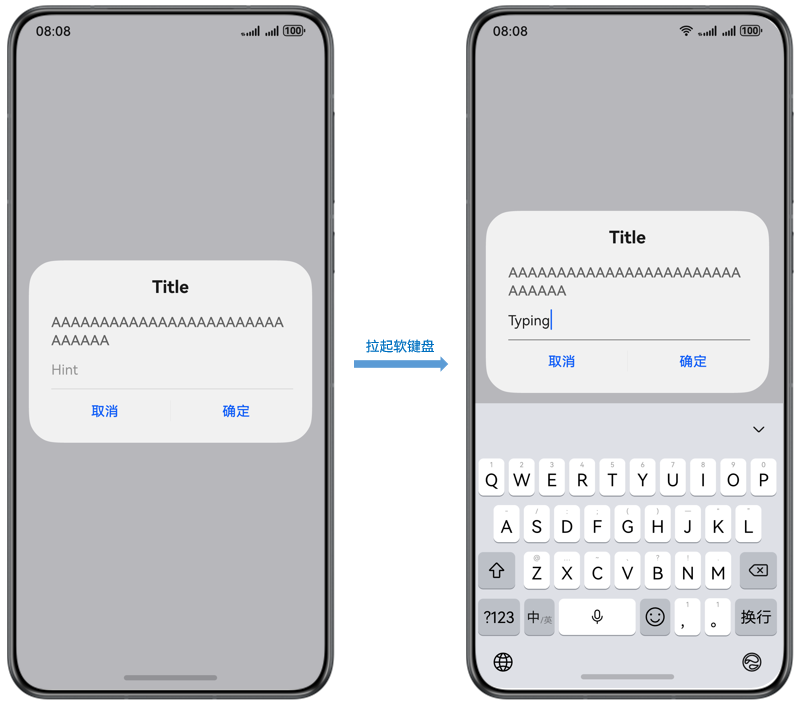
系统默认的软键盘避让形式仅能确保输入框不被遮挡，但输入框下方的组件可能会被软键盘遮挡。要解决此问题，需要了解软键盘的避让模式。

#### 软键盘避让模式
当用户在输入时，为了确保输入框不会被键盘遮挡，系统提供了避让模式来解决这一问题。开发者可以通过[setKeyboardAvoidMode](https://developer.huawei.com/consumer/cn/doc/harmonyos-references/ts-universal-attributes-expand-safe-area#setkeyboardavoidmode11)控制虚拟键盘抬起时页面的避让模式，键盘抬起时默认页面避让模式为上抬模式，下面列举了几种常见的避让模式。
- 上抬模式（KeyboardAvoidMode.OFFSET）：为了避让软键盘，Page内容会整体上抬。如下示例代码，软键盘弹出时，页面整体上抬：import { KeyboardAvoidMode, window } from '@kit.ArkUI';
import { UIAbility } from '@kit.AbilityKit';

export default class EntryAbility extends UIAbility {
  onWindowStageCreate(windowStage: window.WindowStage): void {
 windowStage.loadContent('pages/GetSafeAreaHeightDemo', (err) => {
 // Lift up mode
 windowStage.getMainWindowSync().getUIContext().setKeyboardAvoidMode(KeyboardAvoidMode.OFFSET);
 });
  }
} 示意效果如下，上抬整个页面实现软键盘避让：
- 压缩模式（KeyboardAvoidMode.RESIZE）：当软键盘高度改变时，调整Page大小。Page下设置百分比宽高的组件会跟随压缩，直接设置宽高的组件保持固定大小。设置KeyboardAvoidMode.RESIZE时，expandSafeArea([SafeAreaType.KEYBOARD],[SafeAreaEdge.BOTTOM])不生效。export default class EntryAbility extends UIAbility {
  onWindowStageCreate(windowStage: window.WindowStage): void {
 windowStage.loadContent('pages/GetSafeAreaHeightDemo', (err) => {
 // Compression mode
 windowStage.getMainWindowSync().getUIContext().setKeyboardAvoidMode(KeyboardAvoidMode.RESIZE);
 });
  }
} 示意效果如下，通过压缩内容区域高度实现软键盘避让：
- 不避让模式（KeyboardAvoidMode.NONE）：软键盘将直接覆盖页面UI，不会触发界面布局调整。例如在全屏沉浸式场景（游戏/视频播放器等），为保障用户体验的完整性，开发者可以使用KeyboardAvoidMode.NONE模式。aboutToAppear(): void {
  this.getUIContext().setKeyboardAvoidMode(KeyboardAvoidMode.NONE);
}
**光标避让**
上抬模式和压缩模式还包括KeyboardAvoidMode.OFFSET_WITH_CARET和KeyboardAvoidMode.RESIZE_WITH_CARET两种。当输入框的光标位置发生变化时，系统会自动触发相应的界面避让行为，确保光标始终处于可视区域内，具体可以参考[光标避让](https://developer.huawei.com/consumer/cn/doc/harmonyos-guides/arkts-common-components-text-input#光标避让)。
**弹窗类组件避让模式**
弹窗类组件（如Dialog、Popup、Menu、BindSheet等）避让模式有KeyboardAvoidMode.DEFAULT（避让）和KeyboardAvoidMode**.**NONE（不避让）两种，通过[BaseDialogOptions](https://developer.huawei.com/consumer/cn/doc/harmonyos-references/js-apis-promptaction#basedialogoptions11)中的keyboardAvoidMode属性，灵活控制是否避让软键盘。
若未指定弹窗避让模式，则其避让行为受页面避让模式影响。例如当通过setKeyboardAvoidMode()方法设置页面避让模式为KeyboardAvoidMode**.**NONE时，则弹窗也不会避让软键盘。

```ArkTS
this.getUIContext().getPromptAction().openCustomDialog({
  builder: () => {
    this.customDialogBuilder();
  },
  alignment: DialogAlignment.Bottom,
  width: '100%',
  // Set not avoid keyboard
  keyboardAvoidMode: KeyboardAvoidMode.NONE,
});
```

#### 设置组件不避让软键盘
前面介绍了避让模式，组件会为了避让软键盘而移动。有时希望组件不避让软键盘，例如在上抬模式下，希望顶部标题栏不移动。这种需求如何实现？这就需要了解[安全区域](https://developer.huawei.com/consumer/cn/doc/harmonyos-references/ts-universal-attributes-expand-safe-area)和[expandSafeArea](https://developer.huawei.com/consumer/cn/doc/harmonyos-references/ts-universal-attributes-expand-safe-area#expandsafearea)属性了。
通过[expandSafeArea](https://developer.huawei.com/consumer/cn/doc/harmonyos-references/ts-universal-attributes-expand-safe-area#expandsafearea)属性支持组件不改变布局情况下扩展其绘制区域至安全区外，当设置expandSafeArea属性type为SafeAreaType.KEYBOARD的时候，即expandSafeArea([SafeAreaType.KEYBOARD])，系统会将软键盘区域视作安全区，从而不会避让软键盘。如果开发者希望某些组件不避让软键盘，可以给组件设置expandSafeArea属性。组件避让软键盘的示例效果如下，软键盘弹出时页面整体上抬，自定义标题栏固定不动，具体实现可以参考[软键盘弹出导致布局错位](https://developer.huawei.com/consumer/cn/doc/best-practices/bpta-keyboard-layout-adapt#section20196428133211)的示例。

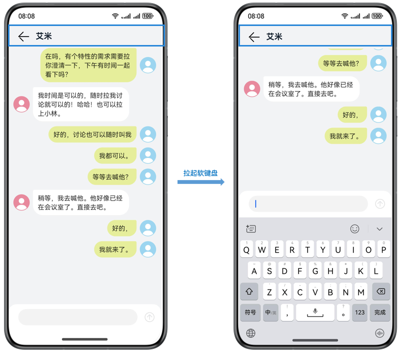

#### 软键盘避让常见问题
下面列举常见的软键盘适配问题，帮助开发者了解软键盘的适配方法。

#### 重要信息被软键盘遮挡
例如下面这个电子邮件示例，内容包括标题栏、内容区域和底部操作栏。点击输入内容的输入框时，软键盘会遮挡底部操作栏，影响用户体验。具体如下图所示。

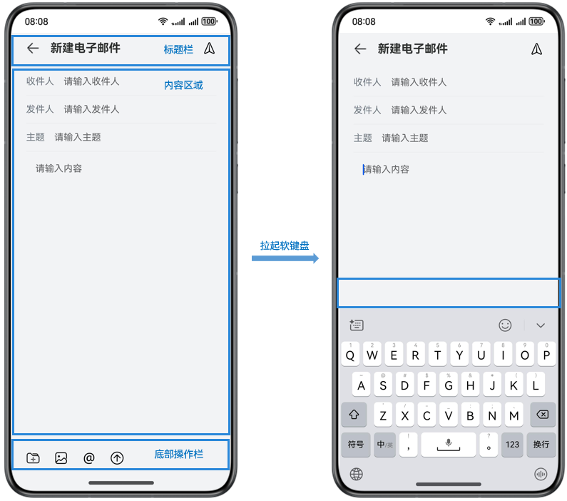
对应的示例代码如下，其中标题栏和底部操作栏都是固定的高度56，内容区域高度是非固定高度layoutWeight(1)，自适应高度。

```ArkTS
@Component
export struct MailPage {
  // ...

  build() {
    Column() {
      this.NavigationTitle()
      this.EmailContent()
      this.BottomToolbar()
    }
    // ...
  }

  @Builder
  NavigationTitle() {
    Row() {
      // ...
    }
    .width('100%')
    .height("56vp")
    // ...
  }

  @Builder
  BottomToolbar() {
    Row({ space: 12 }) {
      // ...
    }
    .width('100%')
    .height("56vp")
    // ...
  }

  @Builder
  EmailContent() {
    Column() {
      // ...
    }
    .width('100%')
    .layoutWeight(1)
    // ...
  }
}
```

开发者可以通过设置软键盘的避让模式为KeyboardAvoidMode.RESIZE（压缩模式），来解决底部操作栏被遮挡的问题，设置该属性后，软键盘的避让会通过压缩内容区域的高度来实现。示例代码如下：

```ArkTS
aboutToAppear(): void {
  this.getUIContext().setKeyboardAvoidMode(KeyboardAvoidMode.RESIZE);
}

aboutToDisappear(): void {
  this.getUIContext().setKeyboardAvoidMode(KeyboardAvoidMode.OFFSET);
}
```

需要注意的是内容区域高度的设置需要用百分比的方式实现，效果图如下：

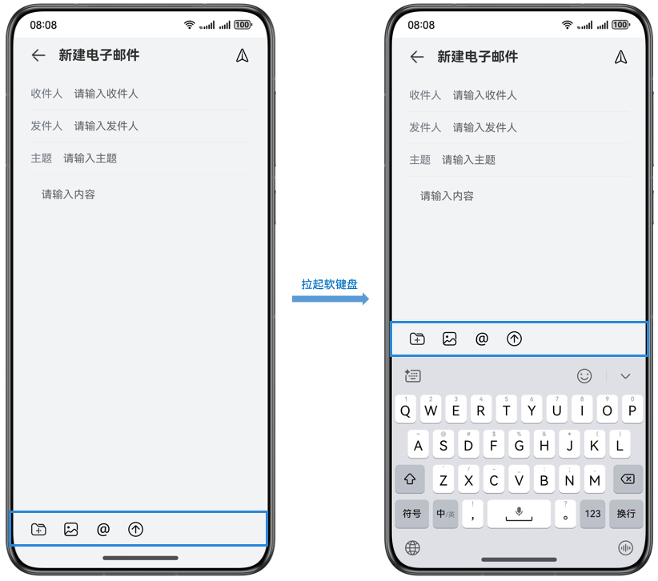
**通过监听软键盘弹出，实现软键盘避让**
上面这个示例开发者还可以通过window模块的[getWindowAvoidArea](https://developer.huawei.com/consumer/cn/doc/harmonyos-references/arkts-apis-window-window#getwindowavoidarea9)方法，监听获取软键盘弹出，获取安全显示区域高度动态设置页面高度。示例代码如下：

```ArkTS
import { CommonConstants as Const } from '../common/constants/CommonConstants';
import { window } from '@kit.ArkUI';
import { BusinessError } from '@kit.BasicServicesKit';
import { hilog } from '@kit.PerformanceAnalysisKit';

@Entry
@Component
struct MailHomePage2 {
  @State message: string = 'Hello World';
  @State screenHeight: number = 0;
  @State isKeyBoardHidden: boolean = false;

  aboutToAppear(): void {
    try {
      window.getLastWindow(this.getUIContext().getHostContext()).then(currentWindow => {
        let property = currentWindow.getWindowProperties();
        let avoidArea = currentWindow.getWindowAvoidArea(window.AvoidAreaType.TYPE_SYSTEM);
        // Initialize the display area height
        this.screenHeight = this.getUIContext().px2vp(property.windowRect.height - avoidArea.topRect.height - avoidArea.bottomRect.height);
        // Monitor the ejection and retraction of the soft keyboard
        currentWindow.on('avoidAreaChange', async data => {
          if (data.type !== window.AvoidAreaType.TYPE_KEYBOARD) {
            return;
          }
          if (data.area.bottomRect.height <= 0) {
            this.isKeyBoardHidden = true;
          } else {
            this.isKeyBoardHidden = false;
          }
          this.screenHeight = this.getUIContext().px2vp(property.windowRect.height - avoidArea.topRect.height - data.area.bottomRect.height);
        })
      })
    } catch (error) {
      let err = error as BusinessError;
      hilog.error(0x0000, 'MailHomePage2', `getLastWindow failed, error code=${err.code}, message=${err.message}`);
    }
  }

  build() {
    Column() {
      this.NavigationTitle()
      this.EmailContent()
      this.BottomToolbar()
    }
    .width('100%')
    .height(this.screenHeight) // Dynamically sets the viewport height
    .expandSafeArea([SafeAreaType.KEYBOARD])
    .backgroundColor('#F1F3F5')
  }
  // ...
}
```

当系统的避让机制无法满足开发者需求时，开发者可以监听软键盘弹出，根据获取的安全区域或软键盘高度，调整布局大小和位置以避让软键盘。

#### 软键盘弹出导致布局错位
**内容向上滚动避让，顶部固定**
例如下面这样的一个聊天界面，顶部是一个自定义的标题，下方为可滚动聊天消息区域，底部是消息输入框，示例代码如下：

```ArkTS
@Entry
@Component
export struct ContactPage {
  // ...

  build() {
    Row() {
      Column() {
        Row() {
          // ...
        }
        // ...
        .height('12%')
        // ...
        .expandSafeArea([SafeAreaType.KEYBOARD])
        .zIndex(1)
        // ...

        List() {
          // ...
        }
        .height('76%')
        // ...

        Column() {
          // ...
        }
        .height('12%')
        // ...
      }
      .width('100%')
      // ...
    }
    .height('100%')
  }
}
```

由于软键盘避让默认为上抬模式，会将整个页面向上抬起，因此标题也会被顶上去，如图所示。

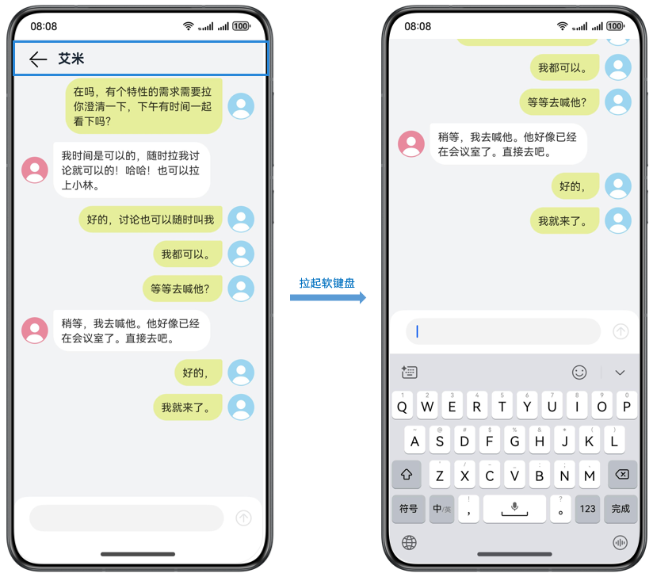
现在需求是希望顶部标题固定，点击底部输入框软键盘弹起的时候，标题不上抬，只有内容区域上抬。效果图如下：

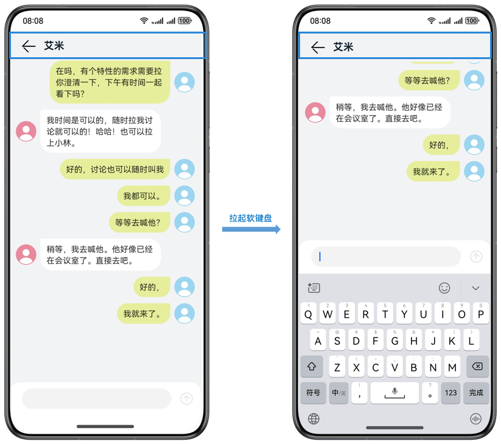
想要顶部标题不被软键盘向上抬，需要给对应的组件设置 .expandSafeArea([SafeAreaType.KEYBOARD])属性，使标题组件不避让键盘，示例代码如下：

```ArkTS
@Entry
@Component
export struct ContactPage {
  // ...

  build() {
    Row() {
      Column() {
        Row() {
          // ...
        }
        // ...
        .height('12%')
        // ...
        .expandSafeArea([SafeAreaType.KEYBOARD])
        .zIndex(1)
        // ...

        List() {
          // ...
        }
        .height('76%')
        // ...

        Column() {
          // ...
        }
        .height('12%')
        // ...
      }
      .width('100%')
      // ...
    }
    .height('100%')
  }
}
```

具体实现可以参考Sample代码[Keyboard](https://gitcode.com/harmonyos_samples/keyboard)。

#### 软键盘弹出导致弹窗过度上抬
**自定义弹窗被键盘顶起**** ，影响用户体验**
在软键盘系统避让机制中介绍过，弹窗为避让软键盘会整体向上抬，这样可能会影响用户体验。比如下面这个评论列表的弹窗，使用@CustomDialog实现的，示例代码如下：

```ArkTS
@CustomDialog
struct CommentDialog {
  listData: string[] = ['comments1', 'comments2', 'comments3', 'comments4', 'comments5', 'comments6', 'comments7', 'comments8'];
  controller?: CustomDialogController;


  build() {
    Column() {
      Text('comments')
        .fontSize(20)
        .fontWeight(FontWeight.Medium)


      List() {
        ForEach(this.listData, (item: string) => {
          ListItem() {
            Text(item)
              .height(80)
              .fontSize(20)
          }
        }, (item: string) => item)
      }
      .scrollBar(BarState.Off)
      .width('100%')
      .layoutWeight(1)


      TextInput({ placeholder: 'Please input content' })
        .height(40)
        .width('100%')
    }
    .padding(12)
  }
}


@Entry
@Component
struct CustomDialogDemo {
  dialogController: CustomDialogController | null = new CustomDialogController({
    builder: CommentDialog(),
    alignment: DialogAlignment.Bottom,
    cornerRadius: 0,
    width: '100%',
    height: '80%'
  })


  build() {
    Column() {
      Button('click me')
        .onClick(() => {
          if (this.dialogController !== null) {
            this.dialogController.open();
          }
        })
    }
    .height('100%')
    .width('100%')
    .justifyContent(FlexAlign.Center)
  }
}
```

当用户点击弹窗底部的输入框的时候，弹窗会整体上抬，输入框上抬的距离也过多。

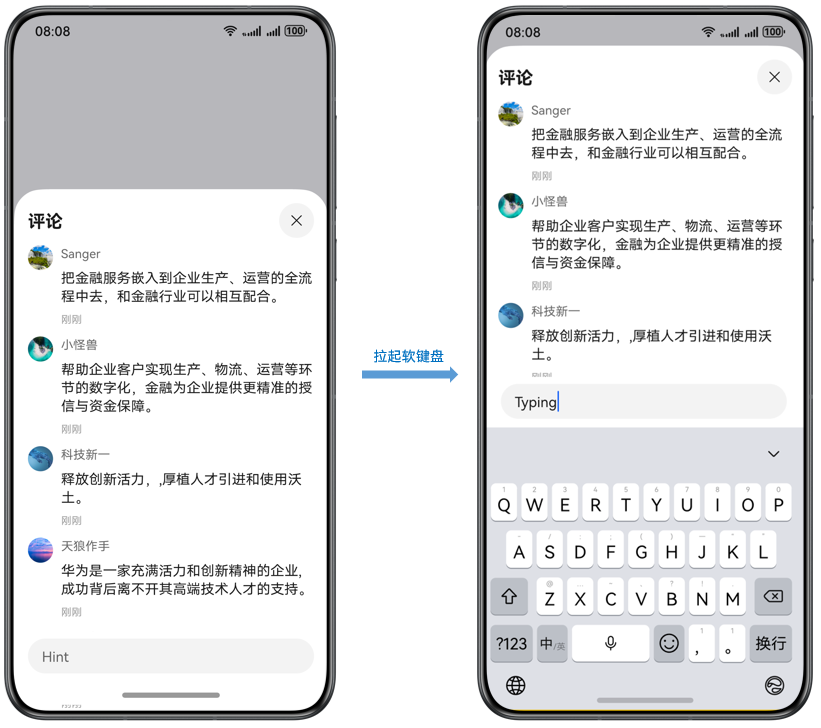
为了解决以上问题，可以通过设置NavDestination的mode为NavDestinationMode.DIALOG弹窗类型，此时整个NavDestination默认透明显示，示例代码如下：

```ArkTS
@Entry
@Component
struct NavDestinationModeDemo {
  @Provide('NavPathStack') pageStack: NavPathStack = new NavPathStack()

  @Builder
  PagesMap(name: string) {
    if (name === 'DialogPage') {
      DialogPage()
    }
  }

  build() {
    Navigation(this.pageStack) {
      Column() {
        Button('click me')
          .onClick(() => {
            this.pageStack.pushPathByName('DialogPage', '');
          })
      }
      .height('100%')
      .width('100%')
      .justifyContent(FlexAlign.Center)
    }
    .mode(NavigationMode.Stack)
    .navDestination(this.PagesMap)
  }
}

@Component
export struct DialogPage {
  @Consume('NavPathStack') pageStack: NavPathStack;
  listData: string[] = ['评论1', '评论2', '评论3', '评论4', '评论5', '评论6', '评论7', '评论8'];

  build() {
    NavDestination() {
      Stack({ alignContent: Alignment.Bottom }) {
        Column() {
          Text('评论')
            .fontSize(20)
            .fontWeight(FontWeight.Medium)

          List() {
            ForEach(this.listData, (item: string) => {
              ListItem() {
                Text(item)
                  .height(80)
                  .fontSize(20)
              }
            }, (item: string) => item)
          }
          .scrollBar(BarState.Off)
          .width('100%')
          .layoutWeight(1)

          TextInput({ placeholder: 'Please input content' })
            .height(40)
            .width('100%')
        }
        .backgroundColor(Color.White)
        .height('75%')
        .width('100%')
        .padding(12)
      }
      .height('100%')
      .width('100%')
    }
    .backgroundColor('rgba(0,0,0,0.2)')
    .hideTitleBar(true)
    .mode(NavDestinationMode.DIALOG)
  }
}
```

还需设置软键盘避让模式为压缩模式，示例代码如下：

```ArkTS
import { UIAbility } from "@kit.AbilityKit";
import { window, KeyboardAvoidMode } from "@kit.ArkUI";

export default class EntryAbility extends UIAbility {
  onWindowStageCreate(windowStage: window.WindowStage): void {
    windowStage.loadContent('pages/GetSafeAreaHeightDemo', (err) => {
      // Compression mode
      windowStage.getMainWindowSync().getUIContext().setKeyboardAvoidMode(KeyboardAvoidMode.RESIZE);
    });
  }
}
```

运行效果如下，点击输入框后，内容区域会进行压缩，弹窗整体不会发生上抬。

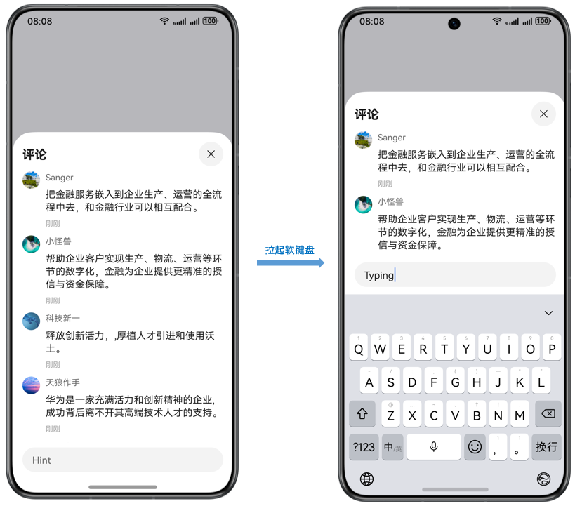
关于评论回复场景的实现，可以参考：[评论回复弹窗](https://developer.huawei.com/consumer/cn/doc/best-practices/bpta-comment-reply-pop-up-window)。

#### 设置软键盘和弹窗组件距离
弹窗类组件默认避让模式下，软键盘弹起之后弹窗组件之间16vp间隔，开发者可以通过弹窗参数[BaseDialogOptions](https://developer.huawei.com/consumer/cn/doc/harmonyos-references/js-apis-promptaction#basedialogoptions11)中keyboardAvoidDistance，调整弹窗组件与软键盘之间的避让距离。设置软键盘间距时，需要将keyboardAvoidMode值设为KeyboardAvoidMode.DEFAULT。

```ArkTS
this.getUIContext().getPromptAction().openCustomDialog({
  builder: () => {
    this.customDialogBuilder();
  },
  alignment: DialogAlignment.Bottom,
  width: '100%',
  // Set the distance between the soft keyboard and custom dialog to 0
  keyboardAvoidDistance:LengthMetrics.vp(0)
});
```

#### Web组件内容输入框
针对由Web组件内容输入组件拉起软键盘以及避让软键盘的内容，可以参考：[Web组件对接软键盘](https://developer.huawei.com/consumer/cn/doc/harmonyos-guides/web-docking-softkeyboard)。

#### 示例代码
- [实现软键盘弹出功能](https://gitcode.com/harmonyos_samples/keyboard)