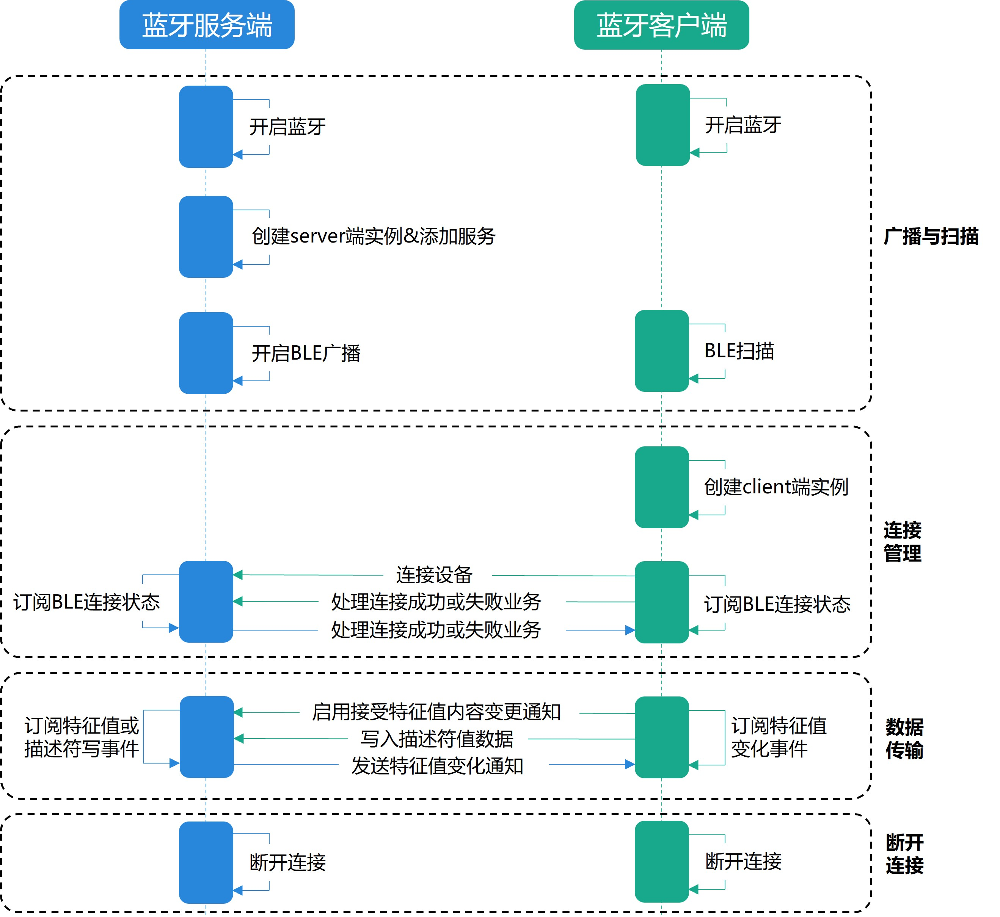
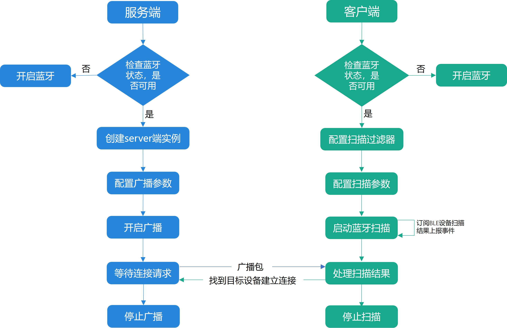

# 低功耗蓝牙基础使用

更新时间：2026-03-12 08:45:02

来源：https://developer.huawei.com/consumer/cn/doc/best-practices/bpta-bluetooth-low-energy

## 概述


蓝牙（Bluetooth）是一种无线通信技术，被广泛应用于各种电子设备之间的短距离连接与数据传输。而低功耗蓝牙（Bluetooth Low Energy，简称 BLE）是一种能够在低功耗条件下进行通信的蓝牙技术，支持发起BLE扫描、发送BLE广播报文以及基于通用属性协议（Generic Attribute Profile，GATT）的连接与数据传输。与传统蓝牙相比，BLE功耗更低，适用于需要长时间运行的低功耗设备，例如智能手表、健康监测设备、智能家居等。

本文针对BLE开发，以心跳监控仪场景为例，主要介绍蓝牙扫描管理、蓝牙连接状态管理和蓝牙设备特征值同步三个场景，并分别从服务端和客户端描述其相关实现。


## 实现原理


实现低功耗蓝牙通信的主要步骤如下：

1. 广播与扫描阶段：服务端创建[GattServer](https://developer.huawei.com/consumer/cn/doc/harmonyos-references/js-apis-bluetooth-ble#gattserver)实例，定义服务特征并配置广播参数，验证蓝牙状态后启动广播，使自身可被发现；客户端确保蓝牙开启，设置扫描过滤条件，注册设备发现回调并启动扫描，收集可连接设备。
2. 连接管理阶段：服务端调用[on('connectionStateChange')](https://developer.huawei.com/consumer/cn/doc/harmonyos-references/js-apis-bluetooth-ble#onconnectionstatechange)订阅GATT profile协议的连接状态变化事件，管理连接生命周期；客户端基于扫描到的服务端广播地址创建[GattClientDevice](https://developer.huawei.com/consumer/cn/doc/harmonyos-references/js-apis-bluetooth-ble#gattclientdevice)实例，调用[on('BLEConnectionStateChange')](https://developer.huawei.com/consumer/cn/doc/harmonyos-references/js-apis-bluetooth-ble#onbleconnectionstatechange)订阅GATT profile协议的连接状态变化事件，发起连接请求，成功后获取服务与特征，启用特征值通知功能，为数据传输做准备。
3. 数据传输阶段：服务端订阅描述符写请求事件，准备数据（如心率值），通过特征通知机制向已连接客户端发送数据；客户端监听特征值变化事件，接收并解析数据内容，根据业务需求更新用户界面或执行相应逻辑。
4. 断开连接阶段：服务端在连接状态回调中处理断开事件，可以停止广播并清理资源；客户端主动断开连接，关闭GATT客户端，注销监听器，重置连接状态，可选择将设备ID持久化以便后续自动重连。





### 关键技术


实现BLE通信能力主要需要使用@ohos.bluetooth.ble (蓝牙ble模块)、@ohos.bluetooth.access (蓝牙access模块)中提供的API能力，服务端主要使用开启蓝牙、创建服务器实例、发送BLE广播、特征值变化通知等API；客户端主要使用开启蓝牙、订阅BLE设备扫描结果、BLE设备扫描、蓝牙连接、订阅蓝牙低功耗设备的特征值变化、订阅蓝牙低功耗设备的连接状态变化事件、持久化存储蓝牙设备的虚拟MAC地址等API。


### 开发流程


在需要使用低功耗蓝牙进行通信的场景中：

服务端

1. 检查蓝牙是否开启，若未开启则调用[enableBluetooth()](https://developer.huawei.com/consumer/cn/doc/harmonyos-references/js-apis-bluetooth-access#accessenablebluetooth)接口开启蓝牙；
2. 调用[createGattServer()](https://developer.huawei.com/consumer/cn/doc/harmonyos-references/js-apis-bluetooth-ble#blecreategattserver)接口创建[GattServer](https://developer.huawei.com/consumer/cn/doc/harmonyos-references/js-apis-bluetooth-ble#gattserver)实例，即表示创建GATT连接中的服务端；
3. 调用[addService()](https://developer.huawei.com/consumer/cn/doc/harmonyos-references/js-apis-bluetooth-ble#addservice)接口在服务端添加服务；
4. 调用[startAdvertising()](https://developer.huawei.com/consumer/cn/doc/harmonyos-references/js-apis-bluetooth-ble#blestartadvertising)接口开始发送BLE广播，向连接的客户端设备提供数据；
5. 调用[on('connectionStateChange')](https://developer.huawei.com/consumer/cn/doc/harmonyos-references/js-apis-bluetooth-ble#onconnectionstatechange)方法在服务端订阅GATT profile协议的连接状态变化事件；
6. 调用[notifyCharacteristicChanged()](https://developer.huawei.com/consumer/cn/doc/harmonyos-references/js-apis-bluetooth-ble#notifycharacteristicchanged)接口，在服务端特征值发生变化时，主动通知已连接的客户端设备。


客户端

1. 检查蓝牙是否开启，若未开启则调用[enableBluetooth()](https://developer.huawei.com/consumer/cn/doc/harmonyos-references/js-apis-bluetooth-access#accessenablebluetooth)接口开启蓝牙；
2. 调用[on('BLEDeviceFind')](https://developer.huawei.com/consumer/cn/doc/harmonyos-references/js-apis-bluetooth-ble#onbledevicefind15)接口订阅BLE设备扫描结果上报事件，并调用[startBLEScan()](https://developer.huawei.com/consumer/cn/doc/harmonyos-references/js-apis-bluetooth-ble#blestartblescan)接口发起BLE扫描流程；
3. 调用[createGattClientDevice(deviceId)](https://developer.huawei.com/consumer/cn/doc/harmonyos-references/js-apis-bluetooth-ble#blecreategattclientdevice)接口，基于扫描到的服务端的广播地址创建[GattClientDevice](https://developer.huawei.com/consumer/cn/doc/harmonyos-references/js-apis-bluetooth-ble#gattclientdevice)实例，即表示创建GATT连接中的客户端；
4. 调用[on('BLEConnectionStateChange')](https://developer.huawei.com/consumer/cn/doc/harmonyos-references/js-apis-bluetooth-ble#onbleconnectionstatechange)接口订阅GATT profile协议的连接状态变化事件，随后调用[connect()](https://developer.huawei.com/consumer/cn/doc/harmonyos-references/js-apis-bluetooth-ble#connect)接口发起连接远端BLE设备；
5. 当[on('BLEConnectionStateChange')](https://developer.huawei.com/consumer/cn/doc/harmonyos-references/js-apis-bluetooth-ble#onbleconnectionstatechange)回调函数返回的连接状态为[STATE_CONNECTED](https://developer.huawei.com/consumer/cn/doc/harmonyos-references/js-apis-bluetooth-constant#profileconnectionstate)时，调用[getServices()](https://developer.huawei.com/consumer/cn/doc/harmonyos-references/js-apis-bluetooth-ble#getservices)进行服务发现，获取服务端设备支持的所有服务；
6. [getServices()](https://developer.huawei.com/consumer/cn/doc/harmonyos-references/js-apis-bluetooth-ble#getservices)发现服务后，调用[setCharacteristicChangeNotification()](https://developer.huawei.com/consumer/cn/doc/harmonyos-references/js-apis-bluetooth-ble#setcharacteristicchangenotification)启用接收服务端特征值内容变更通知，并调用[on('BLECharacteristicChange')](https://developer.huawei.com/consumer/cn/doc/harmonyos-references/js-apis-bluetooth-ble#onblecharacteristicchange)接口订阅蓝牙低功耗设备的特征值变化事件；
7. 启用接收服务端特征值内容变更通知成功后，客户端调用[writeCharacteristicValue()](https://developer.huawei.com/consumer/cn/doc/harmonyos-references/js-apis-bluetooth-ble#writecharacteristicvalue)或[writeDescriptorValue()](https://developer.huawei.com/consumer/cn/doc/harmonyos-references/js-apis-bluetooth-ble#writedescriptorvalue)向指定的服务端特征值或描述符写入数据。


## 蓝牙扫描管理


### 场景描述


在日常生活中，BLE设备无处不在。当用户开启手机上的蓝牙设备发现功能时，常常会发现周围存在数十甚至上百个BLE广播设备。若无有效的管理机制，应用将面临以下挑战：

- 资源消耗过大，处理大量无关设备会增加额外的CPU和电量消耗；
- 用户体验不佳，设备列表过长，用户难以找到目标设备；
- 连接成功率降低，在复杂的BLE环境中，难以准确识别目标设备。


在本示例代码中，模拟了心率监测场景，用户只需连接到特定的心率监测设备，而非环境中的所有BLE设备。此时，BLE扫描管理就显得尤为重要。通过使用自定义扫描过滤器，可以实现：

- 仅显示支持心率服务的设备；
- 过滤掉非目标厂商的设备；
- 减少UI刷新频率，提高应用响应速度；
- 降低功耗，延长设备电池寿命。


这样的管理机制使用户能够快速找到并连接到正确的心率监测设备，提升使用体验。


### 实现原理


在BLE通信的扫描阶段，服务端与客户端遵循明确的工作流程，以实现高效设备发现。

服务端（如心率监测设备）首先初始化BLE服务，配置广播参数，其中关键步骤是设置服务UUID（如心率服务0000180D）和自定义制造商数据，随后开始周期性广播。这种广播不仅包含标准服务标识，还嵌入了特定的制造商ID（如0x027D）与数据模式，为客户端提供精准过滤的基础，确保在复杂的无线环境中能被正确识别。

在此基础上，客户端启动受控的扫描过程：先确认蓝牙功能已启用，然后创建定制化扫描过滤器，该过滤器匹配目标服务UUID、制造商ID及特定数据模式。通过配置低功耗扫描模式与合理间隔，平衡发现速度与电量消耗。当扫描捕获到广播包时，系统依据过滤条件自动筛选，仅将匹配设备回调至应用层，应用进一步对结果进行去重和缓存，最终在UI上呈现精简后的可用设备列表。

值得注意的是，BLE广播和扫描为高功耗操作，应用应在适当时机主动停止这些过程。例如，客户端成功连接至目标设备后应立即停止扫描；服务端完成预期连接或达到预设时间上限后应及时停止广播。这种功耗意识不仅能显著延长设备电池寿命，亦是专业蓝牙应用开发的关键实践。

这种协同工作机制大幅提升了BLE连接效率。服务端的精准广播与客户端的智能过滤形成互补，避免了传统全量扫描带来的资源浪费。当用户在应用中看到设备列表时，背后已完成多层筛选：硬件层过滤掉非BLE设备，协议层过滤掉不匹配服务的设备，应用层进一步通过制造商数据确认目标设备身份。这种分层过滤策略不仅加速了设备发现过程，也显著降低了系统功耗，为后续的连接与数据传输奠定了高效基础。





关键技术

服务端：

1. 调用[access.getState()](https://developer.huawei.com/consumer/cn/doc/harmonyos-references/js-apis-bluetooth-access#accessgetstate)接口查询设备的蓝牙状态，根据返回的[BluetoothState](https://developer.huawei.com/consumer/cn/doc/harmonyos-references/js-apis-bluetooth-access#bluetoothstate)值判断蓝牙是否开启，若未开启则调用[enableBluetooth()](https://developer.huawei.com/consumer/cn/doc/harmonyos-references/js-apis-bluetooth-access#accessenablebluetooth)接口开启蓝牙；
2. 调用[startAdvertising()](https://developer.huawei.com/consumer/cn/doc/harmonyos-references/js-apis-bluetooth-ble#blestartadvertising11-1)接口，开启广播，只有服务端先开启广播，客户端才能搜索到设备；
3. 完成广播后，调用[stopAdvertising()](https://developer.huawei.com/consumer/cn/doc/harmonyos-references/js-apis-bluetooth-ble#blestopadvertising)接口，停止广播。


客户端：

1. 调用[access.getState()](https://developer.huawei.com/consumer/cn/doc/harmonyos-references/js-apis-bluetooth-access#accessgetstate)接口查询设备的蓝牙状态，根据返回的[BluetoothState](https://developer.huawei.com/consumer/cn/doc/harmonyos-references/js-apis-bluetooth-access#bluetoothstate)值判断蓝牙是否开启，若未开启则调用[enableBluetooth()](https://developer.huawei.com/consumer/cn/doc/harmonyos-references/js-apis-bluetooth-access#accessenablebluetooth)接口开启蓝牙；
2. 调用[startBLEScan()](https://developer.huawei.com/consumer/cn/doc/harmonyos-references/js-apis-bluetooth-ble#blestartblescan)接口，通过[ScanOptions](https://developer.huawei.com/consumer/cn/doc/harmonyos-references/js-apis-bluetooth-ble#scanoptions)参数设置扫描参数配置，通过Array参数设置扫描结果的过滤策略集合，进行扫描，同时调用[on('BLEDeviceFind')](https://developer.huawei.com/consumer/cn/doc/harmonyos-references/js-apis-bluetooth-ble#bleonbledevicefind)方法订阅BLE设备扫描结果上报事件，处理扫描结果；
3. 调用[connect()](https://developer.huawei.com/consumer/cn/doc/harmonyos-references/js-apis-bluetooth-ble#connect)接口连接远端BLE设备；
4. 调用[stopBLEScan()](https://developer.huawei.com/consumer/cn/doc/harmonyos-references/js-apis-bluetooth-ble#blestopblescan)接口停止蓝牙扫描。开发者可根据具体业务需求，在适当时机停止蓝牙扫描，例如扫描到目标设备后或断开连接时。


### 实现流程


服务端


1. 开启广播前，需要先查询蓝牙是否可用，根据返回结果[BluetoothState](https://developer.huawei.com/consumer/cn/doc/harmonyos-references/js-apis-bluetooth-access#bluetoothstate)的值来判断蓝牙是否开启，当取值是STATE_ON 或STATE_TURNING_ON返回true，表示蓝牙已开启。
```ts
/**
* Check whether Bluetooth is enabled or turning on.
* @returns True if enabled or turning on; false otherwise.
*/
private isBluetoothEnabled(): boolean {
  let state: access.BluetoothState = access.BluetoothState.STATE_OFF;
  try {
    state = access.getState();
  } catch (error) {
    Logger.error(`BluetoothServerModel, isBluetoothEnabled failed, error info: ${JSON.stringify(error)}`);
  }
  Logger.info(`isBluetoothEnabled: state = ${state}`);
  if (state === access.BluetoothState.STATE_ON || state === access.BluetoothState.STATE_TURNING_ON) {
    return true;
  }
  return false;
}
```
2. 如果蓝牙未开启，服务端设备需要调用[access.enableBluetooth()](https://developer.huawei.com/consumer/cn/doc/harmonyos-references/js-apis-bluetooth-access#accessenablebluetooth)接口开启蓝牙。
```ts
access.enableBluetooth();
```
3. 调用[createGattServer()](https://developer.huawei.com/consumer/cn/doc/harmonyos-references/js-apis-bluetooth-ble#blecreategattserver)创建一个Gatt服务的实例，并调用[addService()](https://developer.huawei.com/consumer/cn/doc/harmonyos-references/js-apis-bluetooth-ble#addservice)接口，添加服务。服务添加成功后，调用[startAdvertising()](https://developer.huawei.com/consumer/cn/doc/harmonyos-references/js-apis-bluetooth-ble#blestartadvertising)接口开始广播。
```ts
/**
* Start BLE advertising and initialize a simple Heart Rate service.
* Also registers connection and descriptor write listeners.
* @returns `StartAdvertiserResult` status code.
*/
startAdvertiser(): StartAdvertiserResult {
  if (!this.isBluetoothEnabled()) {
    this.enableBluetooth();
    return StartAdvertiserResult.BLUETOOTH_ENABLING;
  }
  if (!this.isStateChangeListening) {
    // Register Bluetooth state change listener.
    this.onBTStateChange();
  }
  if (this.mGattServer) {
    Logger.warn('[BluetoothServerModel] Existing GATT server detected. Releasing previous instance before starting a new one.');
    // Release GATT server resources and reset state flags.
    this.releaseGattServer();
  }
  // ...
  this.mGattServer = ble.createGattServer();
  this.onDescriptorWriteChange();
  // ...
  // Construct server-side service data.
  const service: ble.GattService = {
    serviceUuid: BLE_SERVICE_UUID,
    isPrimary: true,
    characteristics: characteristics,
    includeServices: []
  }
  try {
    this.mGattServer.addService(service);
  } catch (err) {
    Logger.error(`addService: err = ${JSON.stringify(err)}`);
    this.releaseGattServer();
    return StartAdvertiserResult.FAILURE;
  }
  try {
    // Register connection state change listener on GATT server.
    this.onConnectStateChange();
    // ...
    ble.startAdvertising(setting, advData, advResponse);
    return StartAdvertiserResult.SUCCESS;
  } catch (err) {
    Logger.error(`startAdvertiser: err = ${JSON.stringify(err)}`);
    this.releaseGattServer();
  }
  return StartAdvertiserResult.FAILURE;
}
```
 如下表格为本文以心跳监控仪场景为例，对应示例代码中使用部分常量的说明，包括自定义厂商数据及蓝牙技术联盟（SIG）定义的标准服务、特征值和描述符。

| 项 | 值 | 备注 |
| --- | --- | --- |
| 服务 UUID（BLE_SERVICE_UUID） | 0000180D-0000-1000-8000-00805F9B34FB | 标准的Heart Rate Service（心率服务）UUID，用于心率监测设备。 |
| 特征 UUID（BLE_CHARACTERISTIC_UUID） | 00002A37-0000-1000-8000-00805F9B34FB | 标准的Heart Rate Measurement Characteristic（心率测量特征值）UUID，用于传输心率数据。 |
| 描述符 UUID（BLE_DESCRIPTOR_UUID） | 00002902-0000-1000-8000-00805F9B34FB | 标准的Client Characteristic Configuration Descriptor（客户端特征值配置描述符）UUID，用于控制客户端对服务端特征值通知（Notify）或指示（Indication）的订阅状态。 |
| 厂商 ID（CUSTOM_MANUFACTURE_ID） | 0x027D | 可自定义，在客户端发起BLE扫描时，该数据可用于配置扫描结果的过滤策略。 |
| 厂商数据 | [0x01, 0x02, 0x03, 0x04]（掩码 [FF,FF,00,00]） | 可自定义，在客户端发起BLE扫描时，该数据可用于配置扫描结果的过滤策略。 |

4. 广播目的达成后（如被目标设备扫描到），调用[stopAdvertising()](https://developer.huawei.com/consumer/cn/doc/harmonyos-references/js-apis-bluetooth-ble#blestopadvertising)接口，停止广播。
```ts
/**
* Stop BLE advertising and disable Bluetooth (for demo cleanup).
*/
stopAdvertiser() {
  if (!this.mGattServer) {
    Logger.warn('[BluetoothServerModel] stopAdvertiser invoked but GATT server is not initialized.');
    return;
  }
  this.offBTStateChange();
  try {
    ble.stopAdvertising();
  } catch (err) {
    Logger.error(`stopAdvertiser: err = ${JSON.stringify(err)}`);
  }
  this.releaseGattServer();
  this.cachedDeviceId = '';
  this.notifyDeviceIdChanged();
}
```


客户端

1. 客户端设备使用蓝牙功能时，同样需要开启蓝牙，开启方法与[服务端](#li384712431593)相同。开启蓝牙后，调用[startBLEScan()](https://developer.huawei.com/consumer/cn/doc/harmonyos-references/js-apis-bluetooth-ble#blestartblescan)接口启动BLE扫描流程。扫描时，可通过配置过滤策略集合Array和扫描参数[ScanOptions](https://developer.huawei.com/consumer/cn/doc/harmonyos-references/js-apis-bluetooth-ble#scanoptions)，主动扫描发现周围广播中特定类型的低功耗蓝牙设备。
```ts
/**
* Start BLE scan with custom filter;
* @returns `StartBLEScanResult` status code.
*/
startBLEScan(): StartBLEScanResult {
  clearTimeout(this.mTimeoutID);
  this.mTimeoutID = -1;
  if (!this.isBluetoothEnabled()) {
    Logger.info('startBLEScan: bluetooth is disable');
    this.enableBluetooth();
    return StartBLEScanResult.BLUETOOTH_ENABLING;
  }
  this.onBLEDeviceFind();
  const ret = this.startBLEScanInner();
  if (ret) {
    // BLE Scanning Timeout Protection
    this.startScanTimeoutCountdown();
  }
  return ret ? StartBLEScanResult.SUCCESS : StartBLEScanResult.FAILURE;
}
```

```ts
/**
* Internal helper to start scanning using a custom filter.
* @returns True if scan started successfully.
*/
private startBLEScanInner(): boolean {
  try {
    const scanFilter = this.createCustomScanFilter();
    const scanOptions: ble.ScanOptions = {
      interval: 500,
      dutyMode: ble.ScanDuty.SCAN_MODE_LOW_POWER,
      matchMode: ble.MatchMode.MATCH_MODE_AGGRESSIVE
    }
    ble.startBLEScan([scanFilter], scanOptions);
    return true;
  } catch (err) {
    Logger.error(`startBLEScanInner: err = ${JSON.stringify(err)}`);
  }
  return false;
}

/**
* Create a custom scan filter that matches the demo server's manufacturer data and service UUID.
* @returns ble.ScanFilter object.
*/
private createCustomScanFilter(): ble.ScanFilter {
  // Manufacturer data broadcast by the server.
  const manufactureValueBuffer: Uint8Array = new Uint8Array([1, 2, 3, 4]);
  // Mask: 0xFF means match required, 0x00 means ignore that position.
  const manufactureDataMask: Uint8Array = new Uint8Array([0xFF, 0xFF, 0x00, 0x00]);
  const scanFilter: ble.ScanFilter = {
    serviceUuid: BLE_SERVICE_UUID,
    manufactureId: CUSTOM_MANUFACTURE_ID,
    manufactureData: manufactureValueBuffer.buffer,
    manufactureDataMask: manufactureDataMask.buffer
  }
  return scanFilter;
}
```


> [!NOTE]
> 在发起BLE扫描并构建[ScanFilter](https://developer.huawei.com/consumer/cn/doc/harmonyos-references/js-apis-bluetooth-ble#scanfilter)扫描过滤器时，建议根据具体业务需求设定过滤条件，以精准捕获符合特定条件的广播数据包。典型过滤维度包括但不限于：
>  制造商ID（manufactureId）、制造商数据（manufactureData）及掩码（manufactureDataMask）服务UUID（serviceUuid）及掩码（serviceUuidMask）服务数据（serviceData）及掩码（serviceDataMask） 此外，不建议使用真实MAC地址（deviceId）作为过滤条件，原因如下：
>  信息安全机制：BLE底层会对真实MAC地址进行特殊处理，生成虚拟MAC地址（随机地址）。若在代码中使用真实MAC地址作为过滤条件，则无法匹配到设备。地址可能改变：设备取消配对或蓝牙服务下电时，随机MAC地址会变更，导致过滤失效。 综上所述，在发起BLE扫描时，通过合理配置这些过滤参数，可以有效降低无效数据接收率，提升扫描效率，减少系统资源消耗。


 onBLEDeviceFind方法中通过[ble.on('BLEDeviceFind')](https://developer.huawei.com/consumer/cn/doc/harmonyos-references/js-apis-bluetooth-ble#bleonbledevicefind)订阅BLE设备扫描结果上报事件，并将扫描到的设备存放到可用设备列表中。
```ts
/**
* Device discovery handler; de-duplicates、 update and insert devices.
* @param arr List of scan results.
*/
private BLEDeviceFindFunc = (arr: Array<ble.ScanResult>): void => {
  if (!arr.length) {
    return;
  }
  for (const result of arr) {
    let deviceId: string = result.deviceId;
    if (!deviceId) {
      continue;
    }
    let deviceName: string = result.deviceName;
    if (!deviceName) {
      try {
        let data: ArrayBuffer = result.data;
        deviceName = util.TextDecoder.create('utf-8', {
          ignoreBOM: true
      }).decodeToString(new Uint8Array(data), { stream: false });
      } catch (error) {
        Logger.error(`decode deviceName fail: ${JSON.stringify(error)}`);
      }
    }
    this.upsertAvailableDevice(deviceId, deviceName);
  }
}

/**
* Subscribe to BLE device discovery events.
*/
private onBLEDeviceFind() {
  try {
    ble.on('BLEDeviceFind', (arr: Array<ble.ScanResult>) => {
      this.BLEDeviceFindFunc(arr);
    });
  } catch (err) {
    Logger.info(`onBLEDeviceFind: err = ${JSON.stringify(err)}`);
  }
}
```
2. 扫描到设备后，用户选择对应的蓝牙设备进行连接。
```ts
/**
* Internal helper to connect, set listeners, and update state to CONNECTING.
* @param gattClientDevice Target GATT client device.
* @returns True if connect() call was issued without throwing.
*/
private connectInner(gattClientDevice: ble.GattClientDevice): boolean {
  try {
    if (!gattClientDevice) {
      return false;
    }
    this.onBLEConnectionStateChange();
    this.onBLECharacteristicChange();
    this.markConnectionState(ConnectionState.STATE_CONNECTING);
    gattClientDevice.connect();
    return true;
  } catch (err) {
    Logger.error(`connectInner: err = ${JSON.stringify(err)}`);
    return false;
  }
}
```
3. 根据具体业务需求，在适当时机调用[stopBLEScan()](https://developer.huawei.com/consumer/cn/doc/harmonyos-references/js-apis-bluetooth-ble#blestopblescan)接口停止蓝牙扫描。
```ts
/**
* Stop BLE scanning and remove discovery callbacks.
* @returns `StopBLEScanResult` status code.
*/
stopBLEScan(): StopBLEScanResult {
  clearTimeout(this.mTimeoutID);
  this.mTimeoutID = -1;
  this.offBLEDeviceFind();
  // This method calls ble.stopBLEScan() to stop the BLE scan.
  const ret = this.stopBLEScanInner();
  return ret ? StopBLEScanResult.SUCCESS : StopBLEScanResult.FAILURE;
}
```


为优化资源利用并降低功耗，应及时停止BLE扫描/广播，其合理时机包括但不限于：

- 目的达成，客户端发现目标设备并建立连接后，应立即停止扫描；服务端在成功连接后可考虑降低广播频率或完全停止。
- 用户离开场景，例如示例代码中客户端的aboutToDisappear()生命周期方法中的逻辑，当用户离开设备列表页面时，应停止扫描并关闭GATT连接。
- 超时保护，设置合理的扫描超时阈值（如[示例代码](#li1575819531669)中的SCAN_TIMEOUT_MS常量），超过时限自动停止，以防止异常情况下的资源泄露。
- 用户显式操作，提供UI控件（如“停止扫描”按钮），允许用户手动终止过程。


实施建议：通过主动管理BLE扫描/广播的启停时机，可有效降低设备功耗，同时避免内存泄漏和连接冲突等异常情况。建议结合具体业务场景，建立包含状态监听、超时处理、用户交互的完整资源管理闭环。


## 蓝牙连接状态管理


### 场景描述


蓝牙连接状态管理能够实时监测蓝牙连接的质量，包括信号强度、数据传输速率和误码率等指标。蓝牙设备连接后，常遇到服务端与客户端连接状态变化的情况，例如客户端连接后，服务端停止广播导致连接中断。针对此类问题，在蓝牙设备开发过程中，应对蓝牙连接状态进行有效管理。

在使用BLE通信服务时，用户期望实现“一次配对，持久连接”的无缝体验，而非每次使用时重复繁琐的搜索配对流程。此时，BLE连接状态管理可通过固化对端设备的虚拟MAC地址，实现智能自动重连机制。该机制在应用重启或系统恢复后，无需用户重复扫描建立连接，可快速与之前已连接的蓝牙设备重新建立连接，显著提升应用的专业性和使用便捷性，为用户提供稳定可靠的蓝牙连接体验。


### 实现原理


在服务端与客户端进行连接操作时，需注册相应的监听事件，例如监听蓝牙设备开关状态和蓝牙状态变化。当状态发生变化时，可通过回调函数处理相应逻辑。

关键技术

服务端：

1. 调用[on('stateChange')](https://developer.huawei.com/consumer/cn/doc/harmonyos-references/js-apis-bluetooth-access#accessonstatechange)方法订阅蓝牙设备开关状态事件；
2. 调用[on('connectionStateChange')](https://developer.huawei.com/consumer/cn/doc/harmonyos-references/js-apis-bluetooth-ble#onconnectionstatechange)方法订阅GATT profile协议的连接状态变化事件。


客户端：

1. 调用[on('stateChange')](https://developer.huawei.com/consumer/cn/doc/harmonyos-references/js-apis-bluetooth-access#accessonstatechange)方法订阅蓝牙设备开关状态事件；
2. 调用[on('BLEConnectionStateChange')](https://developer.huawei.com/consumer/cn/doc/harmonyos-references/js-apis-bluetooth-ble#onbleconnectionstatechange)方法订阅GATT profile协议的连接状态变化事件；
3. 当[on('BLEConnectionStateChange')](https://developer.huawei.com/consumer/cn/doc/harmonyos-references/js-apis-bluetooth-ble#onbleconnectionstatechange)方法返回的状态值为[STATE_CONNECTED](https://developer.huawei.com/consumer/cn/doc/harmonyos-references/js-apis-bluetooth-constant#profileconnectionstate)时，调用[addPersistentDeviceId()](https://developer.huawei.com/consumer/cn/doc/harmonyos-references/js-apis-bluetooth-access#accessaddpersistentdeviceid16)方法持久化存储蓝牙设备的虚拟MAC地址；
4. 当应用启动或者页面显示时，调用[getPersistentDeviceIds()](https://developer.huawei.com/consumer/cn/doc/harmonyos-references/js-apis-bluetooth-access#accessgetpersistentdeviceids16)方法获取应用持久化存储过的蓝牙虚拟MAC地址，并向对端设备发起连接。


### 实现流程


服务端


1. 调用[access.on('stateChange')](https://developer.huawei.com/consumer/cn/doc/harmonyos-references/js-apis-bluetooth-access#accessonstatechange)方法订阅蓝牙设备开关状态事件。服务端需先监听系统蓝牙开关状态，确保在蓝牙开启时提供BLE服务。若蓝牙被关闭，服务端应及时释放GATT服务资源，避免资源浪费和异常状态。
```ts
/**
* Internal: Bluetooth adapter state change handler to reflect enable/disable.
* @param data Current Bluetooth state.
*/
private stateChangeFunc = (data: access.BluetoothState): void => {
  if (data === access.BluetoothState.STATE_ON) {
    this.cachedBluetoothEnable = true;
    this.notifyBluetoothEnableChanged(true);
  } else if (data === access.BluetoothState.STATE_OFF) {
    this.cachedBluetoothEnable = false;
    this.notifyBluetoothEnableChanged(false);
    this.notifyEnabledMap.clear();
    this.cachedDeviceId = '';
    this.notifyDeviceIdChanged();
  }
}

/**
* Register Bluetooth state change listener.
*/
private onBTStateChange() {
  if (this.isStateChangeListening) {
    return;
  }
  try {
    access.on('stateChange', this.stateChangeFunc);
    this.isStateChangeListening = true;
  } catch (err) {
    this.isStateChangeListening = false;
    Logger.error(`onBTSateChange: err = ${JSON.stringify(err)}`);
  }
}
```
2. 调用[on('connectionStateChange')](https://developer.huawei.com/consumer/cn/doc/harmonyos-references/js-apis-bluetooth-ble#onconnectionstatechange)订阅GATT profile协议的连接状态变化事件。服务端通过GATT服务器实例监听连接状态变化，当有设备连接或断开时，更新内部状态并通知UI层。特别地，在设备连接成功时，服务端记录客户端的设备ID，为后续数据传输（如心率通知）做准备；在设备断开时，清理相关状态，并提供友好的断连提示。
```ts
/**
* Internal: Connection state change handler to track the connected device id.
* @param data Connection state payload.
*/
private connectionStateChangeFunc = (data: ble.BLEConnectionChangeState): void => {
  if (data) {
    if (data.state === constant.ProfileConnectionState.STATE_CONNECTED) {
      let deviceId = data.deviceId;
      this.notifyEnabledMap.set(deviceId, false);
      this.cachedDeviceId = deviceId;
      this.notifyDeviceIdChanged();
    } else if (data.state === constant.ProfileConnectionState.STATE_DISCONNECTED) {
      const deviceId = data.deviceId;
      this.notifyEnabledMap.delete(deviceId);
      this.cachedDeviceId = '';
      this.notifyDeviceIdChanged();
      CommonUtils.showToast(CommonUtils.getUIContext(), $r('app.string.disconnection_prompt'));
    }
  }
}

/**
* Register connection state change listener on GATT server.
*/
private onConnectStateChange() {
  if (!this.mGattServer || this.isConnectStateChangeListening) {
    return;
  }
  try {
    this.mGattServer.on('connectionStateChange', this.connectionStateChangeFunc);
    this.isConnectStateChangeListening = true;
  } catch (err) {
    Logger.error(`connectInner: err = ${JSON.stringify(err)}`);
    this.isConnectStateChangeListening = false;
  }
}
```


客户端

1. 调用[access.on('stateChange')](https://developer.huawei.com/consumer/cn/doc/harmonyos-references/js-apis-bluetooth-access#accessonstatechange)订阅蓝牙设备开关状态事件。客户端需监听蓝牙开关状态，蓝牙开启时自动触发设备扫描流程，避免用户手动操作；蓝牙关闭时，清理已发现设备列表及当前连接状态，防止UI显示不一致。此主动状态管理确保应用行为与系统蓝牙状态同步，提供流畅的用户体验。
```ts
/**
* Bluetooth adapter state change listener.
* @param data New Bluetooth state.
*/
private stateChangeFunc = (data: access.BluetoothState): void => {
  if (data === access.BluetoothState.STATE_ON) {
    this.bluetoothEnabled = true;
    this.notifyBluetoothStateChanged(true);
    this.startBLEScan();
  } else if (data === access.BluetoothState.STATE_OFF) {
    // Clear discovered device list and current connection status.
    // ...
  }
}

/**
* Subscribe to Bluetooth adapter state changes.
*/
private subscribeBTStateChange() {
  if (this.isBTStateChangeSubscribed) {
    return;
  }
  try {
    access.on('stateChange', this.stateChangeFunc);
    this.isBTStateChangeSubscribed = true;
  } catch (err) {
    this.isBTStateChangeSubscribed = false;
    Logger.error(`onBTSateChange: err = ${JSON.stringify(err)}`);
  }
}
```
2. 使用[on('BLEConnectionStateChange')](https://developer.huawei.com/consumer/cn/doc/harmonyos-references/js-apis-bluetooth-ble#onbleconnectionstatechange)订阅GATT profile协议的连接状态变化事件，并调用[addPersistentDeviceId()](https://developer.huawei.com/consumer/cn/doc/harmonyos-references/js-apis-bluetooth-access#accessaddpersistentdeviceid16)方法持久化存储蓝牙设备的虚拟MAC地址。客户端通过GattClientDevice实例监听连接状态变化，当连接成功时，将对端设备的虚拟MAC地址通过[addPersistentDeviceId()](https://developer.huawei.com/consumer/cn/doc/harmonyos-references/js-apis-bluetooth-access#accessaddpersistentdeviceid16)接口固化到系统存储中。这一步骤至关重要，它使应用在下次启动时无需重新扫描，可直接使用已保存的设备ID发起连接，显著提升连接效率。同时，客户端还将启用特征值通知功能，为后续数据传输做准备。
```ts
/**
* Handler for connection state changes emitted by ble.GattClientDevice.
* @param data BLE connection state payload.
*/
private BLEConnectionStateChangeFunc = async (data: ble.BLEConnectionChangeState): Promise<void> => {
  let state: constant.ProfileConnectionState = data.state;
  if (data) {
    if (state === constant.ProfileConnectionState.STATE_CONNECTED) {
      await this.handleGattConnected();
    } else if (state === constant.ProfileConnectionState.STATE_DISCONNECTED) {
      this.handleGattDisconnected();
      Logger.warn(`GATT link disconnected. GattDisconnectReason reason code: ${data.reason}`);
    } else if (state === constant.ProfileConnectionState.STATE_CONNECTING) {
      Logger.info(`GATT link is connecting.`);
    }
  }
}
```

```ts
/**
* Subscribe to connection state changes on the current GATT client device.
*/
private onBLEConnectionStateChange() {
  if (!this.mGattClientDevice) {
    return;
  }
  try {
    this.mGattClientDevice.on('BLEConnectionStateChange', this.BLEConnectionStateChangeFunc);
  } catch (err) {
    Logger.error(`onBLEConnectionStateChange: err = ${JSON.stringify(err)}`);
  }
}

/**
* Handle successful GATT connection: update state, persist device and enable notifications.
*/
private async handleGattConnected(): Promise<void> {
  this.markConnectionState(ConnectionState.STATE_CONNECTED);
  this.mLastConnectedDevice = this.cloneDevice(this.mConnectBluetoothDevice);
  this.notifyLastConnectedDeviceChanged();
  this.savePersistentDeviceId(this.mConnectBluetoothDevice.deviceId);
  // Stop scanning after connection.
  this.stopBLEScan();
  await this.enableHeartRateNotification();
}

/**
* Save a random device id to system persistent list if valid and not already saved.
* @param deviceId Random device address to persist.
*/
private savePersistentDeviceId(deviceId: string | undefined) {
  // Validate whether the deviceId to be persisted is legal.
  // ...
  access.addPersistentDeviceId(deviceId)
  .then(() => {
    this.syncPersistentDeviceIds();
  })
  .catch((err: BusinessError) => {
    Logger.warn(`Failed to persist Bluetooth device virtual MAC address, error info: ${JSON.stringify(err)}`)
  })
}
```
3. 使用[getPersistentDeviceIds()](https://developer.huawei.com/consumer/cn/doc/harmonyos-references/js-apis-bluetooth-access#accessgetpersistentdeviceids16)方法获取应用持久化存储过的蓝牙虚拟MAC地址，实现BLE自动重连。当应用启动或页面重新显示时，客户端会从系统获取所有持久化的设备ID，优先尝试与最近连接的设备建立连接。同时会自动处理连接超时和失败重试逻辑，并在UI上提供连接状态反馈。这一机制实现了快速回连体验，用户无需记忆上次连接的设备，也无需重复扫描配对操作，显著提升了应用的易用性。同时，连接失败时会自动清理无效的持久化ID，确保下次启动时不会尝试连接无效设备。
```ts
/**
* Try to auto-reconnect using system persistent device ids.
* Only attempts the first id to keep behavior predictable.
* @returns True if a connection attempt was initiated.
*/
async tryAutoReconnect(): Promise<boolean> {
  // Prevent multiple concurrent reconnection attempts
  let isReconnecting: boolean = false;
  if (this.mIsAutoReconnecting) {
    return isReconnecting;
  }
  this.mIsAutoReconnecting = true;
  try {
    // Retrieves the previously persisted Bluetooth virtual MAC addresses by calling the `getPersistentDeviceIds()` method.
    const ids = this.syncPersistentDeviceIds();
    // ...
    // Get the most recent device ID
    const targetId = ids[0];
    // Retrieve device name and update UI state related
    // ...
    try {
      this.mGattClientDevice = ble.createGattClientDevice(targetId);
      const ret = this.connectInner(this.mGattClientDevice);
      isReconnecting = ret;
      if (!ret) {
        this.resetConnectionState();
      }
    } catch (error) {
      Logger.error(`BluetoothClientModel, createGattClientDevice failed, error info: ${JSON.stringify(error)}`);
    }
  } catch (error) {
    Logger.error(`[BluetoothClientModel.tryAutoReconnect] ${JSON.stringify(error)}`);
  } finally {
    this.mIsAutoReconnecting = false;
  }
  return isReconnecting;
}
```


## 蓝牙设备特征值同步


### 场景描述


在BLE通信中，特征值是数据的基本单元，用于存储或传输特定类型的数据实体。许多蓝牙设备常需实时传输数据，例如，运动传感器将加速度、陀螺仪等数据传输至手机应用。如果特征值不同步，可能导致数据延迟、丢失或顺序错误，从而使接收端（如手机应用）无法准确分析运动状态，如在运动步数统计中可能出现少计或多计步数的情况。


### 实现原理


在服务端与客户端连接成功后，服务端通过调用相关接口主动通知客户端特征值的变化；而客户端需要调用接口向服务端来订阅特征值变化，当特征值变化时，客户端即可接收相关变化信息。此外，在低功耗蓝牙通信过程中，确保接口调用顺序正确是保障数据传输可靠性的关键，错误的调用顺序会导致操作阻塞或通信失败。

关键技术

服务端：

1. 调用[notifyCharacteristicChanged()](https://developer.huawei.com/consumer/cn/doc/harmonyos-references/js-apis-bluetooth-ble#notifycharacteristicchanged)方法，主动通知已连接的客户端设备特征值的变化。


客户端：

1. 调用[on('BLEConnectionStateChange')](https://developer.huawei.com/consumer/cn/doc/harmonyos-references/js-apis-bluetooth-ble#onbleconnectionstatechange)，订阅GATT profile协议的连接状态变化事件；
- 根据回调返回的连接状态信息处理不同连接状态下的业务逻辑。
- 当[ProfileConnectionState](https://developer.huawei.com/consumer/cn/doc/harmonyos-references/js-apis-bluetooth-constant#profileconnectionstate)连接状态为“已连接”时：首先调用[getServices()](https://developer.huawei.com/consumer/cn/doc/harmonyos-references/js-apis-bluetooth-ble#getservices)进行服务发现，获取服务端设备支持的所有服务；
- 随后调用[setCharacteristicChangeNotification()](https://developer.huawei.com/consumer/cn/doc/harmonyos-references/js-apis-bluetooth-ble#setcharacteristicchangenotification)，启用接收服务端特征值内容变更通知的能力；
- 在启用接收服务端特征值内容变更通知成功后，才能调用下一次读取或写入操作，如[readCharacteristicValue()](https://developer.huawei.com/consumer/cn/doc/harmonyos-references/js-apis-bluetooth-ble#readcharacteristicvalue)、[readDescriptorValue()](https://developer.huawei.com/consumer/cn/doc/harmonyos-references/js-apis-bluetooth-ble#readdescriptorvalue)、[writeCharacteristicValue()](https://developer.huawei.com/consumer/cn/doc/harmonyos-references/js-apis-bluetooth-ble#writecharacteristicvalue)、[writeDescriptorValue()](https://developer.huawei.com/consumer/cn/doc/harmonyos-references/js-apis-bluetooth-ble#writedescriptorvalue)、[setCharacteristicChangeNotification()](https://developer.huawei.com/consumer/cn/doc/harmonyos-references/js-apis-bluetooth-ble#setcharacteristicchangenotification)和[setCharacteristicChangeIndication()](https://developer.huawei.com/consumer/cn/doc/harmonyos-references/js-apis-bluetooth-ble#setcharacteristicchangeindication)。
2. 当[ProfileConnectionState](https://developer.huawei.com/consumer/cn/doc/harmonyos-references/js-apis-bluetooth-constant#profileconnectionstate)连接状态为“已断开连接”时：
- 更新连接状态；
- 打印GATT链路断开的原因日志信息。
3. 调用[on('BLECharacteristicChange')](https://developer.huawei.com/consumer/cn/doc/harmonyos-references/js-apis-bluetooth-ble#onblecharacteristicchange)订阅蓝牙低功耗设备的特征值变化事件。
- 在特征值变化事件中实现对蓝牙设备特征值变化的监听和处理功能（如心率特征变化等）。


流程时序总结


| 步骤 | 操作 | 依赖条件 | 未满足影响 |
| --- | --- | --- | --- |
| 1. 连接建立 | [on('BLEConnectionStateChange')](https://developer.huawei.com/consumer/cn/doc/harmonyos-references/js-apis-bluetooth-ble#onbleconnectionstatechange) -> [STATE_CONNECTED](https://developer.huawei.com/consumer/cn/doc/harmonyos-references/js-apis-bluetooth-constant#profileconnectionstate) | 创建[GattClientDevice](https://developer.huawei.com/consumer/cn/doc/harmonyos-references/js-apis-bluetooth-ble#gattclientdevice)实例 | 后续操作均无法执行 |
| 2. 注册通知监听 | [setCharacteristicChangeNotification()](https://developer.huawei.com/consumer/cn/doc/harmonyos-references/js-apis-bluetooth-ble#setcharacteristicchangenotification) | 1. 需要先调用[getServices()](https://developer.huawei.com/consumer/cn/doc/harmonyos-references/js-apis-bluetooth-ble#getservices)，获取到server端所有支持的能力，且需包含指定的入参特征值UUID； 2. 异步回调结果返回后，才能调用下一次读取或者写入操作。 | 通知无法触发，操作阻塞 |
| 3. 特征值或者描述符写入 | [writeCharacteristicValue()](https://developer.huawei.com/consumer/cn/doc/harmonyos-references/js-apis-bluetooth-ble#writecharacteristicvalue)或者[writeDescriptorValue()](https://developer.huawei.com/consumer/cn/doc/harmonyos-references/js-apis-bluetooth-ble#writedescriptorvalue) | 1. 已建立GATT连接； 2. 已成功注册特征值监听； 3. 依赖上一次异步操作完成，包括通知、读取、写入等接口； 4. 写入的数据格式正确。 | 通信失败或忽略配置 |


### 实现流程


服务端

1. 调用[notifyCharacteristicChanged()](https://developer.huawei.com/consumer/cn/doc/harmonyos-references/js-apis-bluetooth-ble#notifycharacteristicchanged)，特征值发生变化时，主动通知已连接的客户端设备。
```ts
/**
* Notify a connected client with a heart rate value.
* @param deviceId Target device random address.
* @param heartRate Heart rate (bpm) to send.
*/
notifyCharacteristicChanged(deviceId: string, heartRate: number) {
  // Validate deviceId and GattServer for legitimacy
  // ...
  const sanitizedHeartRate = Math.max(0, Math.min(255, heartRate));
  const notifyCharacteristic: ble.NotifyCharacteristic = {
    serviceUuid: BLE_SERVICE_UUID,
    characteristicUuid: BLE_CHARACTERISTIC_UUID,
    characteristicValue: CommonUtils.byteArray2ArrayBuffer([0x00, sanitizedHeartRate]),
    confirm: false
  }
  this.mGattServer.notifyCharacteristicChanged(deviceId, notifyCharacteristic, (err: BusinessError) => {
    if (err) {
      Logger.error(`notifyCharacteristicChanged callback failed: err = ${JSON.stringify(err)}`);
    } else {
      Logger.info(`[BluetoothServerModel] Heart rate notify success, device=${deviceId}, value=${sanitizedHeartRate}`);
    }
  })
}
```


客户端

1. 调用[setCharacteristicChangeNotification()](https://developer.huawei.com/consumer/cn/doc/harmonyos-references/js-apis-bluetooth-ble#setcharacteristicchangenotification)接口，向服务端发送设置通知此特征值请求。
```ts
/**
* Handler for connection state changes emitted by ble.GattClientDevice.
* @param data BLE connection state payload.
*/
private BLEConnectionStateChangeFunc = async (data: ble.BLEConnectionChangeState): Promise<void> => {
  let state: constant.ProfileConnectionState = data.state;
  if (data) {
    if (state === constant.ProfileConnectionState.STATE_CONNECTED) {
      await this.handleGattConnected();
    } else if (state === constant.ProfileConnectionState.STATE_DISCONNECTED) {
      this.handleGattDisconnected();
      Logger.warn(`GATT link disconnected. GattDisconnectReason reason code: ${data.reason}`);
    } else if (state === constant.ProfileConnectionState.STATE_CONNECTING) {
      Logger.info(`GATT link is connecting.`);
    }
  }
}
```

```ts
/**
* Subscribe to connection state changes on the current GATT client device.
*/
private onBLEConnectionStateChange() {
  if (!this.mGattClientDevice) {
    return;
  }
  try {
    this.mGattClientDevice.on('BLEConnectionStateChange', this.BLEConnectionStateChangeFunc);
  } catch (err) {
    Logger.error(`onBLEConnectionStateChange: err = ${JSON.stringify(err)}`);
  }
}

/**
* Handle successful GATT connection: update state, persist device and enable notifications.
*/
private async handleGattConnected(): Promise<void> {
  // ...
  // Stop scanning after connection.
  this.stopBLEScan();
  await this.enableHeartRateNotification();
}

// ...

/**
* Enable heart rate notifications by toggling notification and writing CCC descriptor.
*/
private async enableHeartRateNotification(): Promise<void> {
  const device = this.mGattClientDevice;
  if (!device) {
    Logger.warn('[BluetoothClientModel.enableHeartRateNotification] GATT client device unavailable.');
    return;
  }
  try {
    const services: ble.GattService[] = await device.getServices();
    // Perform filtering operations to precisely locate target characteristic values and their configuration descriptors within the GATT service structure
    // ...
    const descriptorObj: BLEDescriptor = {
      serviceUuid: descriptor.serviceUuid,
      characteristicUuid: descriptor.characteristicUuid,
      descriptorUuid: descriptor.descriptorUuid,
      descriptorValue: CommonUtils.byteArray2ArrayBuffer([0x01, 0x00])
    };
    device.setCharacteristicChangeNotification(characteristic, true, (err: BusinessError) => {
      if (err) {
        Logger.error(`NotifyCharacteristicChanged callback failed, error info: ${JSON.stringify(err)}`)
      } else {
        device.writeDescriptorValue(descriptorObj).then(() => {
          Logger.info(`The descriptor for the BLE peripheral device has been successfully written.`);
        }).catch(() => {
          Logger.warn(`Failed to writes the descriptor of a BLE peripheral device.`);
        })
      }
    });
    Logger.info('[BluetoothClientModel.enableHeartRateNotification] Notification enabled successfully.');
  } catch (error) {
    Logger.error(`BluetoothClientModel, enableHeartRateNotification failed, error info:${JSON.stringify(error)}`);
  }
}
```
2. 订阅蓝牙低功耗设备的特征值变化事件[on('BLECharacteristicChange')](https://developer.huawei.com/consumer/cn/doc/harmonyos-references/js-apis-bluetooth-ble#onblecharacteristicchange)。需要先调用[setCharacteristicChangeNotification()](https://developer.huawei.com/consumer/cn/doc/harmonyos-references/js-apis-bluetooth-ble#setcharacteristicchangenotification)接口或[setCharacteristicChangeIndication()](https://developer.huawei.com/consumer/cn/doc/harmonyos-references/js-apis-bluetooth-ble#setcharacteristicchangeindication)接口才能接收server端的通知。
```ts
/**
* Characteristic change handler that parses a simple HR Measurement (Flags, HR).
* @param data Characteristic payload event.
*/
private BLECharacteristicChangeFunc = (data: ble.BLECharacteristic): void => {
  let characteristicValue: ArrayBuffer = data.characteristicValue;
  let byteArr = CommonUtils.arrayBuffer2ByteArray(characteristicValue);
  if (!byteArr || byteArr.length < 2) {
    Logger.warn(`[BluetoothClientModel.BLECharacteristicChangeFunc] Invalid heart rate payload: ${JSON.stringify(byteArr)}`);
    return;
  }
  let heartRate = byteArr[1];
  this.currentHeartRate = heartRate;
  this.notifyHeartRateChanged(heartRate);
}

/**
* Register a listener for characteristic value changes.
*/
private onBLECharacteristicChange() {
  if (!this.mGattClientDevice) {
    return;
  }
  try {
    this.mGattClientDevice.on('BLECharacteristicChange', this.BLECharacteristicChangeFunc);
  } catch (error) {
    Logger.error(`BluetoothClientModel, onBLECharacteristicChange failed, error info:${JSON.stringify(error)}`);
  }
}
```


## 常见问题


### 设备连接后调用getServices()获取不到数据


通过on('BLEConnectionStateChange')接口订阅GATT profile协议的连接状态变化事件，当返回的状态值ProfileConnectionState为STATE_CONNECTED时，表示本端与对端蓝牙设备间的Profile已成功连接。随后，调用getServices()获取服务端设备支持的所有服务能力。


### 扫描获取的deviceId与真实地址不同


基于信息安全考虑，此处获取的设备地址为虚拟MAC地址，真实MAC地址不直接暴露。

在API 16及后续版本中，HarmonyOS提供了无需配对即可将蓝牙虚拟MAC地址固化的API接口：access.addPersistentDeviceId()。

由于应用通过蓝牙扫描获取到的未配对或未固化（参考如下说明）的设备MAC地址为虚拟随机地址，若需该虚拟随机地址不发生改变，可调用addPersistentDeviceId()接口持久化存储虚拟随机地址。


> [!NOTE]
> 使用蓝牙虚拟MAC地址固化API需申请ohos.permission.PERSISTENT_BLUETOOTH_PEERS_MAC权限，并在ACL权限审核通过后方可使用。使用此接口时，开发者应明确该虚拟随机地址对应的对端蓝牙设备真实地址保持不变。若对端设备地址变更，持久化保存的地址信息也将失效，无法继续使用。蓝牙虚拟MAC地址固化的API接口比喻：想象你常去的咖啡店会给熟客发放一张专属会员卡（虚拟MAC地址）。未固化场景：每次进店，店员都会给你随机更换新卡（虚拟地址变化），你需要反复证明自己是熟客（重新扫描连接）。固化后场景：店员将你的会员卡号永久记录在系统中（addPersistentDeviceId()）。今后进店，直接刷旧卡（原虚拟地址），系统自动识别你的身份（快速回连），无需重新办理会员卡（无需重复扫描）。


### 蓝牙数据传输报错失败


请检查应用逻辑，确认双端通信发送新消息需等待前次操作回调完成，例如有如下场景需要注意：

- [getServices()](https://developer.huawei.com/consumer/cn/doc/harmonyos-references/js-apis-bluetooth-ble#getservices)必须在建立GATT连接后优先调用，且需在其完成服务发现后，才能执行后续特征值/描述符操作（如读写、订阅通知等）。
- [setCharacteristicChangeNotification()](https://developer.huawei.com/consumer/cn/doc/harmonyos-references/js-apis-bluetooth-ble#setcharacteristicchangenotification)异步回调结果返回后，才能调用下一次读取或者写入操作，如[readCharacteristicValue()](https://developer.huawei.com/consumer/cn/doc/harmonyos-references/js-apis-bluetooth-ble#readcharacteristicvalue)、[readDescriptorValue()](https://developer.huawei.com/consumer/cn/doc/harmonyos-references/js-apis-bluetooth-ble#readdescriptorvalue)、[writeCharacteristicValue()](https://developer.huawei.com/consumer/cn/doc/harmonyos-references/js-apis-bluetooth-ble#writecharacteristicvalue)、[writeDescriptorValue()](https://developer.huawei.com/consumer/cn/doc/harmonyos-references/js-apis-bluetooth-ble#writedescriptorvalue)、[setCharacteristicChangeNotification()](https://developer.huawei.com/consumer/cn/doc/harmonyos-references/js-apis-bluetooth-ble#setcharacteristicchangenotification)和[setCharacteristicChangeIndication()](https://developer.huawei.com/consumer/cn/doc/harmonyos-references/js-apis-bluetooth-ble#setcharacteristicchangeindication)。
- [writeCharacteristicValue()](https://developer.huawei.com/consumer/cn/doc/harmonyos-references/js-apis-bluetooth-ble#writecharacteristicvalue)或者[writeDescriptorValue()](https://developer.huawei.com/consumer/cn/doc/harmonyos-references/js-apis-bluetooth-ble#writedescriptorvalue)异步回调结果返回后，才能调用下一次读取或者写入操作，如[readCharacteristicValue()](https://developer.huawei.com/consumer/cn/doc/harmonyos-references/js-apis-bluetooth-ble#readcharacteristicvalue)、[readDescriptorValue()](https://developer.huawei.com/consumer/cn/doc/harmonyos-references/js-apis-bluetooth-ble#readdescriptorvalue)、[writeCharacteristicValue()](https://developer.huawei.com/consumer/cn/doc/harmonyos-references/js-apis-bluetooth-ble#writecharacteristicvalue)、[writeDescriptorValue()](https://developer.huawei.com/consumer/cn/doc/harmonyos-references/js-apis-bluetooth-ble#writedescriptorvalue)、[setCharacteristicChangeNotification()](https://developer.huawei.com/consumer/cn/doc/harmonyos-references/js-apis-bluetooth-ble#setcharacteristicchangenotification)和[setCharacteristicChangeIndication()](https://developer.huawei.com/consumer/cn/doc/harmonyos-references/js-apis-bluetooth-ble#setcharacteristicchangeindication)。


### 使用connection.pairDevice()发起设备配对并成功后，如何通过代码调用取消配对


基于信息安全考虑，目前不支持通过代码取消配对。若需取消配对，可引导用户进入蓝牙设置页面手动操作。打开系统蓝牙设置页面的方法如下：

```ts
/**
* Opens the system Bluetooth settings page.
* This method uses HarmonyOS Ability framework to launch the system settings ability specifically for Bluetooth configuration.
*/
private openBlueToothSettingsPage() {
  const context: common.UIAbilityContext = this.getUIContext().getHostContext() as common.UIAbilityContext;
  const want: Want = {
    bundleName: 'com.huawei.hmos.settings',
    abilityName: 'com.huawei.hmos.settings.MainAbility',
    uri: 'bluetooth_entry'
  };
  context.startAbility(want).catch((err: BusinessError) => {
    console.error(`Failed to open bluetooth settings, error info: ${JSON.stringify(err)}`);
  });
}
```


## 示例代码


- [基于低功耗蓝牙实现设备间连接通信的能力](https://gitcode.com/HarmonyOS_Samples/BluetoothLowEnergy)
