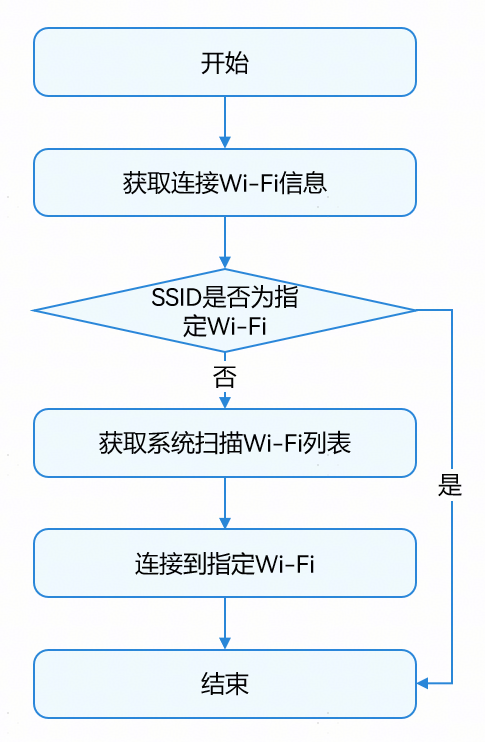
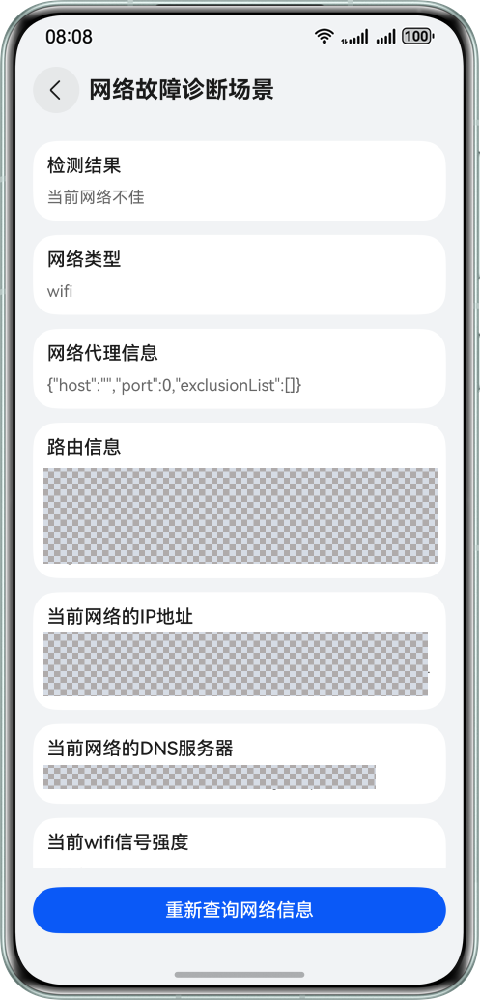

# 网络信息查询与连接管理

更新时间：2026-05-22 09:46:30

来源：https://developer.huawei.com/consumer/cn/doc/best-practices/bpta-common-network-query

#### 概述
[Network Kit](https://developer.huawei.com/consumer/cn/doc/harmonyos-references/network-api)提供常用的网络信息查询与连接管理功能，包括获取网络类型、检查网络可用性、监听网络状态变化、查询Wi-Fi及蜂窝网络信息等。这些能力帮助开发者灵活应对复杂多变的网络环境，精准实现各类场景需求，显著提升用户的网络使用体验。

#### 连接到指定网络场景
#### 场景描述
在特定业务场景中（如企业或校园内网），应用必须通过指定的网络连接到专用服务器以获取关键数据。若连接指定网络失败，将直接导致网络配置中断、身份认证受阻或核心资源无法访问，从而中断业务流程。
本章将通过以下示例，介绍如何连接到指定的Wi-Fi。该示例具备以下功能：
- 判断设备是否已连接到指定的Wi-Fi
- 获取系统扫描的Wi-Fi列表
- 通过点击Wi-Fi列表连接到相应的Wi-Fi
**图1 **连接到指定网络效果图

#### 实现方案
连接到指定Wi-Fi场景主要通过[@ohos.wifiManager (WLAN)](https://developer.huawei.com/consumer/cn/doc/harmonyos-references/js-apis-wifimanager)模块结合[@ohos.net.connection (网络连接管理)](https://developer.huawei.com/consumer/cn/doc/harmonyos-references/js-apis-net-connection)模块相关API来实现。通过@ohos.wifiManager模块检查Wi-Fi是否启用，获取系统扫描的Wi-Fi列表，选中指定Wi-Fi后发起连接请求；通过@ohos.net.connection模块检测网络连通性，判断是否需要进行登录认证（如 Portal 认证）才能正常访问网络。流程图如下：

#### 开发步骤
1. 网络权限声明在进行网络相关操作前，需在应用的module.json5配置文件中声明所需权限。涉及的权限包括： ohos.permission.GET_NETWORK_INFO：用于获取网络信息，如默认网络、网络类型等。 ohos.permission.GET_WIFI_INFO：用于获取Wi-Fi相关信息，如Wi-Fi是否打开、Wi-Fi列表等。 ohos.permission.SET_WIFI_INFO：用于执行Wi-Fi连接操作。ohos.permission.INTERNET：用于访问Internet网络。 {
  "module": {
 // ...
 "requestPermissions": [
 {
 "name": "ohos.permission.INTERNET",
 // ...
 },
 {
 "name": "ohos.permission.GET_NETWORK_INFO",
 // ...
 },
 {
 "name": "ohos.permission.SET_WIFI_INFO",
 // ...
 },
 {
 "name": "ohos.permission.GET_WIFI_INFO",
 // ...
 },
 // ...
 ]
  }
}
2. 获取Wi-Fi信息，判断是否连接到指定Wi-Fi先使用getDefaultNetSync()接口判断默认网络是否连接，并通过getNetCapabilitiesSync()方法获取默认连接网络类型。若网络类型为Wi-Fi，则使用getLinkedInfoSync()方法获取当前连接的Wi-Fi信息，该信息包含SSID等内容。将获取到的SSID与指定Wi-Fi的SSID进行比对，若一致则表示已连接到指定Wi-Fi。 checkNetwork(): void {
  try {
 // Use the synchronization method to obtain the default activated data network handle (default network)
 let netHandle = connection.getDefaultNetSync();
 if (netHandle.netId === 0) {
 // If there is no network connected, the netid of the obtained netHandler is 0
 showToast(this.uiContext, \$r('app.string.no_network_tips'));
 return;
 }
 // Obtain the capability information of the network corresponding to the netHandle
 let netCapability = connection.getNetCapabilitiesSync(netHandle);
 let networkCap = netCapability.networkCap || [];
 let bearerTypes: connection.NetBearType[] = netCapability.bearerTypes;
 let isWifi = bearerTypes.includes(connection.NetBearType.BEARER_WIFI);
 if (!isWifi) {
 showToast(this.uiContext, \$r('app.string.network_is_not_wifi'));
 return;
 }
 // The network type is WIFI to get network connection information
 let linkedInfo = wifiManager.getLinkedInfoSync();
 let ssid: string = linkedInfo.ssid;
 if (ssid === TARGET_WIFI_SSID) {
 // Connected to the target wifi
 // ...
 } else {
 showToast(this.uiContext, \$r('app.string.not_connected_spec_wifi'));
 }
  } catch (err) {
 let error = err as BusinessError;
 Logger.error(TAG, `checkNetwork err, code: ${error.code}, message: ${error.message}`);
  }
} 通过getNetCapabilitiesSync()方法获取网络能力信息对象，其networkCap属性包含网络的具体能力。若networkCap中包含connection.NetCap.NET_CAPABILITY_VALIDATED，则表示网络具备访问互联网的能力（即网络可用）；若networkCap中包含connection.NetCap.NET_CAPABILITY_PORTAL，则说明网络需要认证登录之后才能正常使用。 if (ssid === TARGET_WIFI_SSID) {
  // Connected to the target wifi
  if (networkCap.includes(connection.NetCap.NET_CAPABILITY_VALIDATED)) {
 showToast(this.uiContext, \$r('app.string.connected_to_spec_wifi'));
  } else if (networkCap.includes(connection.NetCap.NET_CAPABILITY_PORTAL)) {
 // Login verification is required for the current network
 showToast(this.uiContext, \$r('app.string.network_need_auth'));
  } else {
 showToast(this.uiContext, \$r('app.string.result_network_unavailable'));
  }
} else {
  showToast(this.uiContext, \$r('app.string.not_connected_spec_wifi'));
}
3. 获取系统扫描Wi-Fi列表在获取Wi-Fi列表之前，需要通过isWifiActive()方法判断Wi-Fi开关是否已打开。如果已打开，则通过调用getScanInfoList()方法获取系统扫描附近的Wi-Fi网络，并返回一个包含所有扫描到的Wi-Fi信息的数组。数组中的每个元素包含了Wi-Fi的SSID、加密类型、信号强度等详细信息。 getScanList(): void {
  try {
 let isWifiActive = wifiManager.isWifiActive();
 if (!isWifiActive) {
 showToast(this.uiContext, \$r('app.string.turn_on_wlan_tips'));
 return;
 }
 this.getLinkedInfo();
 let temp = wifiManager.getScanInfoList();
 if (temp.length > 0) {
 // Remove duplicate WiFi data
 this.scanInfoList = this.uniqueBySsid(temp);
 Logger.info(TAG, `getScanList length: ${this.scanInfoList.length}`);
 }
  } catch (err) {
 let error = err as BusinessError;
 Logger.error(TAG, `getScanList err, code: ${error.code}, message: ${error.message}`);
  }
}
4. 连接到指定Wi-Fi首先，创建一个包含要连接的Wi-Fi的SSID、密码及安全类型（如WPA2_PSK）等信息的Wi-Fi配置对象，使用addCandidateConfig()方法，传入该配置对象以添加候选网络配置。然后，调用connectToCandidateConfig()方法发起连接请求。 connectWifi() {
  // Add a candidate network
  let config: wifiManager.WifiDeviceConfig = {
 ssid: this.ssid,
 preSharedKey: this.wifiPassword,
 securityType: this.securityType
  }

  try {
 wifiManager.addCandidateConfig(config).then(result => {
 Logger.info(TAG, `addCandidateConfig success, networkId: ${result}`);
 // Connect to a certain wifi
 wifiManager.connectToCandidateConfig(result);
 });
  } catch (err) {
 Logger.error(TAG, `connectWifi error: ${JSON.stringify(err)}`);
  }
}

#### 网络状态感知场景
#### 场景描述
本章以网络视频播放场景为例，围绕网络状态感知展开，介绍如何在监听到网络状态变化后，动态调整视频播放行为，以优化播放体验。本章实现的网络视频播放优化体验如下：
- 当网络从Wi-Fi切换到蜂窝网络，及时暂停播放，并提醒用户已切换到蜂窝网络，以避免产生流量费用。
- 当网络从蜂窝切换到的Wi-Fi时，自动播放之前暂停的视频，让用户无需手动操作即可继续观看。
- 当监听到弱网状态时，提示用户当前网络不佳。同时，系统可能会根据当前的网络质量情况切换网络。
- 当监听到网络中断时，提示用户检查网络连接，以避免视频突然中断带来的不良体验。

#### 实现方案
网络状态感知的实现方案以实时监测网络状态变化并联动视频播放业务的调整为核心，主要依赖于[@ohos.net.connection（网络连接管理）](https://developer.huawei.com/consumer/cn/doc/harmonyos-references/js-apis-net-connection)模块和[netQuality（网络质量）](https://developer.huawei.com/consumer/cn/doc/harmonyos-references/networkboost-netquality)模块来实现。本章重点介绍网络视频播放时对网络状态变化的感知，视频播放的具体实现可参考[示例代码](#section14109114818615)章节。为避免网络波动影响播放流畅性，建议开发者进行缓存处理。
网络状态的监听主要通过以下接口实现：
- [on('netCapabilitiesChange')](https://developer.huawei.com/consumer/cn/doc/harmonyos-references/js-apis-net-connection#onnetcapabilitieschange)：订阅网络能力变化事件，当网络类型切换（如从Wi-Fi切换到蜂窝网络）、网络状态从无到有等，该事件将被触发。
- [on('netLost')](https://developer.huawei.com/consumer/cn/doc/harmonyos-references/js-apis-net-connection#onnetlost)：订阅网络丢失事件，当网络严重中断或正常断开时触发该事件。
- [on('netUnavailable')](https://developer.huawei.com/consumer/cn/doc/harmonyos-references/js-apis-net-connection#onnetunavailable)：订阅网络不可用事件，当网络不可用时触发该事件。
- [on('netAvailable')](https://developer.huawei.com/consumer/cn/doc/harmonyos-references/js-apis-net-connection#onnetavailable)：订阅网络可用事件，当网络可用时触发该事件。
- [netQuality.on( 'netSceneChange')](https://developer.huawei.com/consumer/cn/doc/harmonyos-references/networkboost-netquality#netqualityon-netscenechange)：订阅网络场景信息，如从正常网络进入到弱网环境。
以视频播放场景为例，网络状态感知体验如下：

| 网络状态感知 | 网络类型变化 | 网络能力变化 |  |  |  |  |
| --- | --- | --- | --- | --- | --- | --- |
| Wi-Fi切蜂窝 | 蜂窝切换Wi-Fi | 弱网场景 | 网络断开 | 网络不可用 | 网络可用 |  |
| 应用处理 | 暂停播放，提示将使用流量播放 | 正常播放 | 弹窗提示网络不佳。（开发者可以提供切换视频清晰度播放的功能，在弱网场景下提示用户切换清晰度。） | 弹窗提示网络已断开，视频加载失败后展示错误页面 | 弹窗提示网络不可用，视频加载失败后展示错误页面 | 和网络类型变化规格一致 |

#### 开发步骤
1. 订阅网络可用/不可用事件使用on('netAvailable')订阅网络可用事件通知，接收到网络可用通知时，检测当前网络是否具备访问Internet的能力。若网络能正常访问Internet且此前因网络问题导致播放失败，则重置播放器并继续播放视频。 import { connection } from '@kit.NetworkKit'; // Create a NetConnection object
this.netCon = connection.createNetConnection();
// Subscribe to a network available event that triggers when the network is available
this.netCon.on('netAvailable', (data: connection.NetHandle) => {
  Logger.info(TAG, `on netAvailable, Succeeded to get netAvailable: ${JSON.stringify(data)}`);
  this.isNetAvailable = NetworkUtil.isNetworkAvailable();
  this.isCellular = NetworkUtil.isCellular();
  if (this.isNetAvailable && this.isPlayError && !this.isCellular) {
 this.controller.reset();
  }
}); public static isNetworkAvailable(): boolean {
  try {
 let netHandle = connection.getDefaultNetSync();
 if (netHandle.netId === 0) {
 // If there is no network connected, the netid of the obtained netHandler is 0
 return false;
 }
 let netCapability = connection.getNetCapabilitiesSync(netHandle);
 let networkCaps: connection.NetCap[] = netCapability.networkCap || [];
 return networkCaps.includes(connection.NetCap.NET_CAPABILITY_VALIDATED);
  } catch (err) {
 let error = err as BusinessError;
 Logger.error(TAG, `getNetworkType err, errCode: ${error.code}, error mesage: ${error.message}`);
  }
  return false;
} 使用on('netUnavailable')订阅网络不可用事件通知，接收到网络不可用事件时，使用Toast弹窗提示用户网络不可用。 // Subscribe to a network unavailability event that triggers when the network is unavailable
this.netCon.on('netUnavailable', () => {
  Logger.info(TAG, 'on netUnavailable, Succeeded to get unavailable net event');
  this.isNetAvailable = false;
  showToast(this.uiContext, \$r('app.string.result_network_unavailable'));
});
2. 订阅网络能力变化事件通过on('netCapabilitiesChange')方法可以订阅Wi-Fi和蜂窝网络切换的事件通知，当网络切换为蜂窝时暂停播放，否则继续播放视频。 // Subscribe to network capability change events that trigger when network capability changes,
// such as from no network to network with network, or when switching from WIFI to cellular
this.netCon.on('netCapabilitiesChange', (data: connection.NetCapabilityInfo) => {
  Logger.info(TAG, `on netCapabilitiesChange, Succeeded to get netCapabilitiesChange: ${JSON.stringify(data)}`);
  if (data.netCap.bearerTypes.includes(connection.NetBearType.BEARER_CELLULAR)) {
 // For cellular networks, pause playback
 this.isCellular = true;
 this.isShowController = false;
 this.controller.pause();
 showToast(this.getUIContext(), \$r('app.string.current_cellular_tips'))
 this.isShowGoOn = true;
  } else {
 this.isCellular = false;
 this.isShowController = true;
 this.controller.start();
 this.isShowGoOn = false;
  }
}); 从Wi-Fi切换为蜂窝网络效果图如下：
3. 订阅网络丢失事件通过on('netLost')方法可以订阅网络丢失的事件通知，使用Toast提示用户网络已断开。 // Subscribe to a network loss event, triggered when the network is severely interrupted or normally disconnected,
// and the network interruption pauses playback
this.netCon.on('netLost', (data: connection.NetHandle) => {
  Logger.info(TAG, `on netLost, Succeeded to get netLost: ${JSON.stringify(data)}`);
  this.isNetAvailable = false;
  this.isCellular = false;
  showToast(this.uiContext, \$r('app.string.network_disconnect_tips'));
}); 网络断开时效果图：  当网络断开时，将继续播放视频缓存；缓存播放完毕后，将触发Video组件的onError方法。若此时网络仍未连接，需提示用户检查网络。 Video({ src: this.videoUrl, controller: this.controller })
// ...
  .onError(() => {
 Logger.error(TAG, 'Video onError');
 this.lastTime = this.currentTime;
 this.isShowController = false;
 this.isPlayError = true;
 this.isPlaying = false;
 this.isNetAvailable = NetworkUtil.isNetworkAvailable();
  }) 播放错误时效果图
4. 订阅网络状态变化通知接下来需要调用register()接口，用来订阅指定的网络状态变化通知，该接口需在on()方法调用之后使用。例如，若指定的网络可用，将触发on('netAvailable')、on('netCapabilitiesChange')回调；若超时时间内网络不可用，将触发on('netUnavailable')回调。若断网，将触发on('netLost')回调。 this.netCon.register((error: BusinessError) => {
  if (error) {
 Logger.error(TAG, `networkListen fail: ${JSON.stringify(error)}`);
  }
});
5. 订阅网络场景变化使用netQuality.on('netSceneChange')方法订阅网络场景变化通知，当网络为弱信号场景（weakSignal）或者拥塞场景（congestion）时，使用Toast弹窗提示用户当前网络不佳。建议开发者实现多种不同清晰度资源切换的功能，在此场景下，提示用户切换清晰度。 import { netQuality } from '@kit.NetworkBoostKit';
  onNetSceneChange() {
 // Subscribe to network scene information
 try {
 netQuality.on('netSceneChange', (list: netQuality.NetworkScene[]) => {
 Logger.info(TAG, `on netSceneChange, Succeeded receive netSceneChange info: ${list.length}`);
 if (list.length > 0) {
 list.forEach((networkScene) => {
 if (networkScene.scene === 'weakSignal' || networkScene.scene === 'congestion') {
 this.promptAction.showToast({ message: \$r('app.string.network_bad_tips') });
 }
 });
 }
 });
 } catch (err) {
 Logger.error(TAG, `on netSceneChange err: ${JSON.stringify(err)}`);
 }
  }
6. 取消订阅网络变化/取消订阅场景变化通知在退出页面时，通过调用unregister()取消订阅网络状态变化通知，使用netQuality.off('netSceneChange')取消订阅场景变化。 aboutToDisappear(): void {
  // Unsubscribe from network status changes
  this.netCon?.unregister((err: BusinessError) => {
 if (err) {
 Logger.error(TAG, `unregister failed, err: ${JSON.stringify(err)}`);
 }
  });
  // Unsubscribe from network scenario information
  try {
 netQuality.off('netSceneChange');
  } catch (err) {
 Logger.error(TAG, `off netSceneChange err: ${JSON.stringify(err)}`);
  }
}

#### 获取Wi-Fi信息
#### 场景描述
在公司考勤中，有些企业使用基于WLAN定位的网络打卡方式。员工需连接公司指定Wi-Fi，应用获取Wi-Fi的MAC地址后方可打卡。本章将介绍如何获取该MAC地址。
**图2 **获取Wi-Fi MAC地址效果图

#### 实现方案
使用[@ohos.geoLocationManager (位置服务)](https://developer.huawei.com/consumer/cn/doc/harmonyos-references/js-apis-geolocationmanager)模块的[getCurrentWifiBssidForLocating()](https://developer.huawei.com/consumer/cn/doc/harmonyos-references/js-apis-geolocationmanager#geolocationmanagergetcurrentwifibssidforlocating14)方法获取当前连接的Wi-Fi MAC地址（Bssid）。通过将获取的MAC地址与业务服务端保存的Wi-Fi MAC地址进行比对，判断打卡是否成功。关于业务服务端的实现逻辑需要开发者自己实现，本文不做介绍。

> [!NOTE] 说明
> 需要注意的是，虽然@ohos.wifiManager的getLinkedInfo()也能获取当前连接Wi-Fi的MAC地址（Bssid），但需要申请ohos.permission.GET_WIFI_PEERS_MAC权限（仅系统应用可申请）才能返回真实地址，否则为随机地址，因此不推荐用于Wi-Fi打卡和其他需要真实MAC地址的场景。

#### 开发步骤
1. 检查WLAN连接状态通过wifiManager.isWifiActive()和wifiManager.isConnected()分别获取WLAN开关的状态和连接状态，确保已经连接了Wi-Fi网络。 import { wifiManager } from '@kit.ConnectivityKit';
  isWiFiConnected(): boolean {
 try {
 if (!wifiManager.isWifiActive()) {
 showToast(this.getUIContext(), \$r('app.string.turn_on_wlan_tips'));
 return false;
 }

 if (wifiManager.isConnected()) {
 return true;
 } else {
 showToast(this.getUIContext(), \$r('app.string.wifi_not_connect_tips'));
 return false;
 }
 } catch (err) {
 let error = err as BusinessError;
 Logger.error(TAG, `checkWifiStatus err, errCode: ${error.code}, error mesage: ${error.message}`);
 }
 return false;
  }
2. 申请位置信息权限获取当前连接Wi-Fi的MAC地址（Bssid）需要申请位置权限ohos.permission.LOCATION和ohos.permission.APPROXIMATELY_LOCATION，首先在module.json5中声明位置权限。 {
  "module": {
 // ...
 "requestPermissions": [
 // ...
 {
 "name": "ohos.permission.LOCATION",
 // ...
 },
 {
 "name": "ohos.permission.APPROXIMATELY_LOCATION",
 // ...
 }
 ]
  }
} 动态申请位置权限。 import { abilityAccessCtrl, bundleManager, Permissions } from '@kit.AbilityKit';
  async requestPermissions(): Promise&lt;number&gt; {

 return new Promise((resolve, reject) => {
 try {
 const permissions: Permissions[] = ['ohos.permission.LOCATION', 'ohos.permission.APPROXIMATELY_LOCATION'];
 const accessManager = abilityAccessCtrl.createAtManager();
 const bundleFlags = bundleManager.BundleFlag.GET_BUNDLE_INFO_WITH_APPLICATION;
 const bundleInfo = bundleManager.getBundleInfoForSelfSync(bundleFlags);
 const grantStatus = accessManager.checkAccessTokenSync(bundleInfo.appInfo.accessTokenId, permissions[0]);
 if (grantStatus === abilityAccessCtrl.GrantStatus.PERMISSION_GRANTED) {
 resolve(0);
 return;
 }
 accessManager.requestPermissionsFromUser(this.getUIContext().getHostContext(), permissions).then((data) => {
 Logger.info(TAG, `request permissions result: ${JSON.stringify(data)}`);
 let grantStatus: number[] = data.authResults;
 if (grantStatus.length > 0 && grantStatus[0] === 0) {
 Logger.info(TAG, 'request permissions granted');
 resolve(0);
 } else {
 Logger.info('request permissions denied');
 showToast(this.getUIContext(), \$r('app.string.no_location_permission_tips'));
 resolve(-1);
 }
 }).catch((error: BusinessError) => {
 Logger.error(TAG, `request permissions exception, Catch error:${JSON.stringify(error)}`);
 reject(error);
 })
 } catch (err) {
 let error = err as BusinessError;
 Logger.error(TAG, `requestPermissions err, errCode: ${error.code}, error mesage: ${error.message}`);
 }
 });
  }
3. 获取连接Wi-Fi的MAC地址使用geoLocationManager.getCurrentWifiBssidForLocating()方法获取Wi-Fi的MAC地址。 import { geoLocationManager } from '@kit.LocationKit';
  getWiFiBssid() {
 if (this.isWiFiConnected()) {
 this.requestPermissions().then(result => {
 if (result === 0) {
 Logger.info(TAG, 'request location permissions success');
 try {
 let bssid: string = geoLocationManager.getCurrentWifiBssidForLocating();
 Logger.info(TAG, `getCurrentWifiBssidForLocating wifi bssid success: ${bssid}`);
 this.macAddress = bssid;
 } catch (error) {
 Logger.error(TAG, `getCurrentWifiBssidForLocatingerror: ${JSON.stringify(error)}`);
 }
 }
 });
 }
  }

#### 网络故障诊断分析场景
#### 场景描述
用户在使用应用的网络功能时，网络故障（如无法访问、加载缓慢、连接中断）是常见的问题。为了方便定位问题，需要获取路由、网络类型、代理、DNS、网关、运营商及信号强度、时延等信息。通过分析这些数据，可以判断问题出在设备、运营商还是服务器，从而采取相应措施恢复网络和应用的正常运行。
本章将介绍一些常见网络信息的获取，主要包含以下信息：
- 网络类型
- 网络代理信息
- 路由信息
- 当前网络的IP地址
- 当前网络的DNS服务器
- 当前Wi-Fi信号强度
- 当前设备Wi-Fi MAC地址
- 蜂窝网络制式
- 蜂窝主卡的Radio是否打开
- 运营商名称
- 蜂窝网络是否处于漫游状态
- 蜂窝网络信号强度
- 网络时延

#### 实现方案
主要通过以下模块的相关API获取网络故障诊断场景所需的网络信息：
- [@ohos.net.connection (网络连接管理)](https://developer.huawei.com/consumer/cn/doc/harmonyos-references/js-apis-net-connection)：用于获取网络的基本信息，如网络类型、IP 地址、网关、DNS 服务器等。通过[getNetCapabilitiesSync()](https://developer.huawei.com/consumer/cn/doc/harmonyos-references/js-apis-net-connection#connectiongetnetcapabilitiessync10)方法获取网络能力信息，包括网络类型、网络是否可用等；[getConnectionPropertiesSync()](https://developer.huawei.com/consumer/cn/doc/harmonyos-references/js-apis-net-connection#connectiongetconnectionpropertiessync10)方法获取网络配置信息，包括 IP、网关、DNS等
- [@ohos.wifiManager (WLAN)](https://developer.huawei.com/consumer/cn/doc/harmonyos-references/js-apis-wifimanager)：获取Wi-Fi网络的信号强度、设备MAC地址等信息。使用[getLinkedInfoSync()](https://developer.huawei.com/consumer/cn/doc/harmonyos-references/js-apis-wifimanager#wifimanagergetlinkedinfosync18)方法获取当前连接Wi-Fi的信号强度（rssi属性）和MAC 地址（bssid属性）。
- [@ohos.telephony.radio (网络搜索)](https://developer.huawei.com/consumer/cn/doc/harmonyos-references/js-apis-radio)：获取蜂窝网络的相关信息，如运营商名称、网络制式、信号强度、是否处于漫游状态以及主卡Radio是否打开等。例如，[getOperatorNameSync()](https://developer.huawei.com/consumer/cn/doc/harmonyos-references/js-apis-radio#radiogetoperatornamesync10)方法获取运营商名称，[getSignalInformationSync()](https://developer.huawei.com/consumer/cn/doc/harmonyos-references/js-apis-radio#radiogetsignalinformationsync10)方法获取信号强度信息和网络制式。
- [netQuality(网络质量)](https://developer.huawei.com/consumer/cn/doc/harmonyos-references/networkboost-netquality)：提供网络质量实时评估、网络场景识别以及弱信号预测等能力。使用[netQuality.on( 'netQosChange')](https://developer.huawei.com/consumer/cn/doc/harmonyos-references/networkboost-netquality#netqualityon-netqoschange)订阅网络质量信息，包含信号强度、下载速度、网络时延等。
本章提供了网络故障诊断分析场景的检测项和规格，以下内容仅供参考，开发者可根据自身业务需求选择检测项并定义规格。
- 网络可用性是否可用：如果不可用，则检测结果为网络不可用。
- 网络是否连接：如果未连接，则检测结果为网络未连接。
- 网络信号强度：如果Wi-Fi低于-70dbm，蜂窝信号强度低于-100dbm，则检测结果为当前网络不佳。
- 时延：如果rttMs>100ms，则检测结果为当前网络不佳。
- 下载速度：如果下载速度小于<1MB/s，则检测结果为当前网络不佳。
以上检测项都未异常，则检测结果为网络正常。其中信号强度、时延和下载速度的获取，通过开启下载任务[request.agent.create()](https://developer.huawei.com/consumer/cn/doc/harmonyos-references/js-apis-request#requestagentcreate10-1)，取10秒的平均值。

#### 开发步骤
1. 获取网络连接信息该步骤整合了通过@ohos.net.connection模块可获取的各类网络基础连接信息，通过getNetCapabilitiesSync()方法获取网络类型和是否可用。 checkNetAvailable(): void {
  try {
 let netHandle = connection.getDefaultNetSync();
 if (netHandle.netId === 0) {
 // If there is no network connected, the netid of the obtained netHandler is 0
 this.hasNetwork = false;
 this.checkResult = \$r('app.string.result_network_not_connect');
 return;
 }
 this.hasNetwork = true;
 let netCapability = connection.getNetCapabilitiesSync(netHandle);
 let bearerTypes: connection.NetBearType[] = netCapability.bearerTypes;
 let netCaps: connection.NetCap[] = netCapability.networkCap || [];
 this.networkType = NetworkUtil.getNetworkTypeStr(bearerTypes[0]);
 this.isNetAvailable = netCaps.includes(connection.NetCap.NET_CAPABILITY_VALIDATED);
 if (this.isNetAvailable) {
 this.checkResult = \$r('app.string.result_network_available');
 } else {
 this.checkResult = \$r('app.string.result_network_unavailable');
 }
  } catch (err) {
 let error = err as BusinessError;
 Logger.error(TAG, `getNetworkType err, errCode: ${error.code}, error mesage: ${error.message}`);
  }
} 通过getConnectionPropertiesSync()方法获取路由信息、IP信息、DNS服务信息，通过getDefaultHttpProxy()方法获取代理信息。 getConnectionInfo(): void {
  try {
 let netHandle = connection.getDefaultNetSync();
 let properties = connection.getConnectionPropertiesSync(netHandle);
 // route info
 let routes = properties.routes || [];
 // ip address info
 let addresses = properties.linkAddresses || [];
 // dns service info
 let dnses = properties.dnses || [];
 // ...
 // get proxy info
 connection.getDefaultHttpProxy().then((data: connection.HttpProxy) => {
 Logger.info(TAG, `getDefaultHttpProxy success, data: ${JSON.stringify(data)}`);
 this.proxyInfo = JSON.stringify(data);
 }).catch((error: BusinessError) => {
 Logger.error(TAG, `getDefaultHttpProxy err, code: ${error.code}, mesage: ${error.message}`);
 });
  } catch (err) {
 let error = err as BusinessError;
 Logger.error(TAG, `getConnectionInfo err, code: ${error.code}, message: ${error.message}`);
  }
}
2. 获取Wi-Fi信息通过@ohos.wifiManager模块的getLinkedInfoSync()方法获取信号强度和MAC地址信息，这些信息对诊断Wi-Fi连接不稳定、信号弱等问题至关重要。 getWifiInfo(): void {
  try {
 let linkInfo = wifiManager.getLinkedInfoSync();
 this.wifiSignal = `${linkInfo.rssi}dBm`;
 this.wifiMac = linkInfo.macAddress;
  } catch (err) {
 let error = err as BusinessError;
 Logger.error(TAG, `getWifiRssi err, code: ${error.code}, message: ${error.message}`);
  }
}
3. 获取蜂窝网络信息通过@ohos.telephony.radio模块获取蜂窝网络相关信息。 使用radio.getOperatorNameSync()方法获取运营商名称。使用radio.isRadioOn()方法检查蜂窝主卡的Radio是否开启。使用radio.getNetworkState()方法判断蜂窝网络是否处于漫游状态。使用radio.getSignalInformationSync()方法获取蜂窝网络信号强度和网络制式。 async getCellularInfo(): Promise&lt;void&gt; {
  try {
 let primarySlotId = await radio.getPrimarySlotId();
 // Get the carrier name
 this.operatorName = radio.getOperatorNameSync(primarySlotId);
 // Whether the radio on the cellular main card is turned on
 this.isRadioOn = await radio.isRadioOn(primarySlotId);
 let networkState = await radio.getNetworkState(primarySlotId);
 // Determine whether the cellular network is roaming
 this.isRoaming = networkState.isRoaming + '';
 let signalInfos: radio.SignalInformation[] = radio.getSignalInformationSync(primarySlotId);
 if (signalInfos.length > 0) {
 let signalInfo = signalInfos[0];
 // Get cellular network signal strength
 this.cellularSignal = signalInfo.dBm + 'dBm';
 // Get the cellular network standard
 this.cellularType = NetworkUtil.getCellularTypeStr(signalInfo.signalType);
 }
  } catch (err) {
 let error = err as BusinessError;
 Logger.error(TAG, `getCellularInfo err, errCode: ${error.code}, error mesage: ${error.message}`);
  }
}
4. 检测网络质量首先判断网络是否连接和是否可用，如果未连接或者不可用，则显示网络未连接和网络不可用的结果。 checkNetAvailable(): void {
  try {
 let netHandle = connection.getDefaultNetSync();
 if (netHandle.netId === 0) {
 // If there is no network connected, the netid of the obtained netHandler is 0
 this.hasNetwork = false;
 this.checkResult = \$r('app.string.result_network_not_connect');
 return;
 }
 this.hasNetwork = true;
 let netCapability = connection.getNetCapabilitiesSync(netHandle);
 let bearerTypes: connection.NetBearType[] = netCapability.bearerTypes;
 let netCaps: connection.NetCap[] = netCapability.networkCap || [];
 this.networkType = NetworkUtil.getNetworkTypeStr(bearerTypes[0]);
 this.isNetAvailable = netCaps.includes(connection.NetCap.NET_CAPABILITY_VALIDATED);
 if (this.isNetAvailable) {
 this.checkResult = \$r('app.string.result_network_available');
 } else {
 this.checkResult = \$r('app.string.result_network_unavailable');
 }
  } catch (err) {
 let error = err as BusinessError;
 Logger.error(TAG, `getNetworkType err, errCode: ${error.code}, error mesage: ${error.message}`);
  }
} 如果有网络连接，则开启下载任务用于网络质量测试，下载任务持续时间为10秒。 queryNetworkInfo() {
  this.checkNetAvailable();
  if (!this.hasNetwork) {
 this.clearContent();
 return;
  }
  this.getConnectionInfo();
  this.getWifiInfo();
  this.getCellularInfo();

  if (this.timeoutId === -1 && TEST_DOWNLOAD_URL !== '') {
 this.checkResult = \$r('app.string.result_is_checking');
 // Start download file
 NetworkUtil.downloadFile(this.context, TEST_DOWNLOAD_URL, this.cachePath);
 this.timeoutId = setTimeout(() => {
 // Remove download task after 10 seconds
 NetworkUtil.removeTask();
 this.timeoutId = -1;
 }, 10000)
  }
} 在下载任务期间，通过netQuality模块的on('netQosChange')接口实时监听网络质量变化，获取时延、下载速度等关键指标。并计算10秒内的平均下载速度、平均时延、Wi-Fi和蜂窝的平均信号强度。并根据这些指标和规格数据对比，获取检测结果，数据规格参考实现方案小节。 onQosChange(): void {
  try {
 netQuality.on('netQosChange', (list: netQuality.NetworkQos[]) => {
 if (list.length > 0) {
 list.forEach(async (qos) => {
 // ...
 if (this.timeoutId !== -1 && TEST_DOWNLOAD_URL !== '') {
 let wifiRssi = NetworkUtil.getWifiSignalRssi();
 let cellularRssi = await NetworkUtil.getCellularSignalRssi();
 this.totalSpeed += qos.linkDownRate;
 this.totalRttMs += qos.rttMs;
 this.totalWifiRssi += wifiRssi;
 this.totalCellularRssi += cellularRssi;
 this.rttMsTimes += 1;
 }
 if ((this.timeoutId === -1) && (this.rttMsTimes !== 0) && (TEST_DOWNLOAD_URL !== '')) {
 // Average download speed
 let avgSpeed = this.totalSpeed / 8 / 1024 / 1024 / 10;
 // Average latency
 let avgRttMs = this.totalRttMs / this.rttMsTimes;
 // Average wifi signal strength
 let avgWifiRssi = this.totalWifiRssi / this.rttMsTimes;
 // Average cellular signal strength
 let avgCellularRssi = this.totalCellularRssi / this.rttMsTimes;
 // ...
 if (avgSpeed < 1 || avgRttMs > 100) {
 this.checkResult = \$r('app.string.network_bad_tips');
 return;
 }
 // The network is considered poor when the WiFi signal strength is below -70dBm
 // or the cellular network signal strength is below -100dBm
 if ((this.networkType === 'wifi' && avgWifiRssi < -70) ||
 (this.networkType === 'cellular' && avgCellularRssi < -100)) {
 this.checkResult = \$r('app.string.network_bad_tips');
 } else {
 this.checkResult = \$r('app.string.result_network_normal');
 }
 }
 });
 }
 });
  } catch (err) {
 let error = err as BusinessError;
 Logger.error(TAG, `on netQosChange err, code: ${error.code}, message: ${error.message}`);
  }
}

#### 示例代码
- [实现常见网络信息查询](https://gitcode.com/harmonyos_samples/network-query)