# 一次开发，多端部署概览

更新时间：2026-03-26 08:46:30

来源：https://developer.huawei.com/consumer/cn/doc/best-practices/bpta-multi-device-overview

本文介绍了“一次开发，多端部署”（后文中简称为“一多”）的定义、目标等，同时从体验设计、页面开发、功能开发等角度，端到端的给出了指导，帮助开发者快速开发出适配多种类型设备的应用。在应用开发前，开发者应尽可能全面考虑应用支持多设备的情况，避免在后期加入新的类型设备时对应用架构进行大幅调整。


## 背景


随着终端产品形态多样化和规模增长，未来每个人和每个家庭所拥有的智能终端数量也将不断增加，多个设备之间的连接和协同将变得更加重要，通过发挥不同形态设备的各自优势，为用户带来体验跃升。用户在使用设备时，将从当前“以设备为中心”，逐渐过渡到“以场景为中心”，各个设备在同一场景下贡献自身的价值特性，实现跨设备的互助和协作，应用服务在多个设备之间协同完成任务。

而作为应用开发者，广泛的设备类型也能为应用带来广大的潜在用户群体。但是如果一个应用需要在多个设备上提供同样的内容，则需要适配不同的屏幕尺寸和硬件，开发成本较高。HarmonyOS系统面向多终端提供了“一次开发，多端部署”（后文中简称为“一多”）的能力，让开发者可以基于一套设计，高效构建多端可运行的应用。


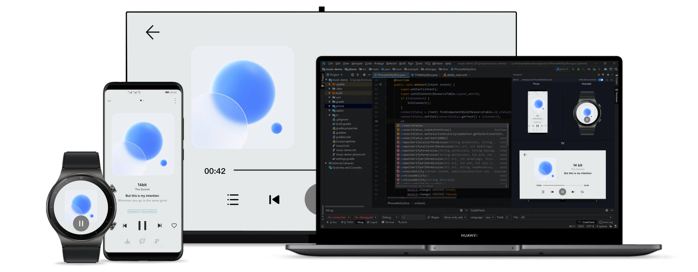


## 章节概要


本文档各章节简介如下：

- 概览说明本文的目的，并介绍了“一多”的背景、定义、目标、以及用于指导后续开发的一些基础知识。
- [从一个例子开始](https://developer.huawei.com/consumer/cn/doc/best-practices/bpta-multi-device-start)：通过示例介绍“一多”应用的开发过程，让开发者对“一多”有个直观认识。
- [多设备体验设计](https://developer.huawei.com/consumer/cn/doc/best-practices/bpta-multi-device-design-principles)：介绍了应用UX设计理念，重点阐述了设计初期的原则与要点，思考多设备设计中的差异性、一致性、灵活性与兼容性。
- [多设备界面开发](https://developer.huawei.com/consumer/cn/doc/best-practices/bpta-multi-device-page)和[多设备功能开发](https://developer.huawei.com/consumer/cn/doc/best-practices/bpta-multi-device-function)：介绍了“一多”能力，其中每个能力都提供了代码示例和UX效果，让开发者可以快速学习“一多”能力。
- [多设备工程部署](https://developer.huawei.com/consumer/cn/doc/best-practices/bpta-multi-device-ide)：介绍了从工程角度如何开始开发应用，让开发者可以直接上手创建多设备应用的工程，是后面学习“一多”能力的上手基础。
- [多设备界面开发案例](https://developer.huawei.com/consumer/cn/doc/best-practices/bpta-multi-device-ui-development)：提供了各种业务场景下的一多案例，帮助开发者从实际业务角度学习一多应用开发。


## 关键技术


为了实现“一套代码工程，一次开发上架，多端按需部署”，在开发一多应用时，需要解决以下三个基础问题：

- 页面如何适配不同屏幕尺寸和色彩风格。
- 功能如何兼容不同设备的系统能力，如NFC、SIM卡支持等。
- 如何组织代码工程以实现一套代码多端部署。


针对上述三个问题，HarmonyOS从页面适配、功能兼容和代码部署三个方面提供了相应的解决方案：


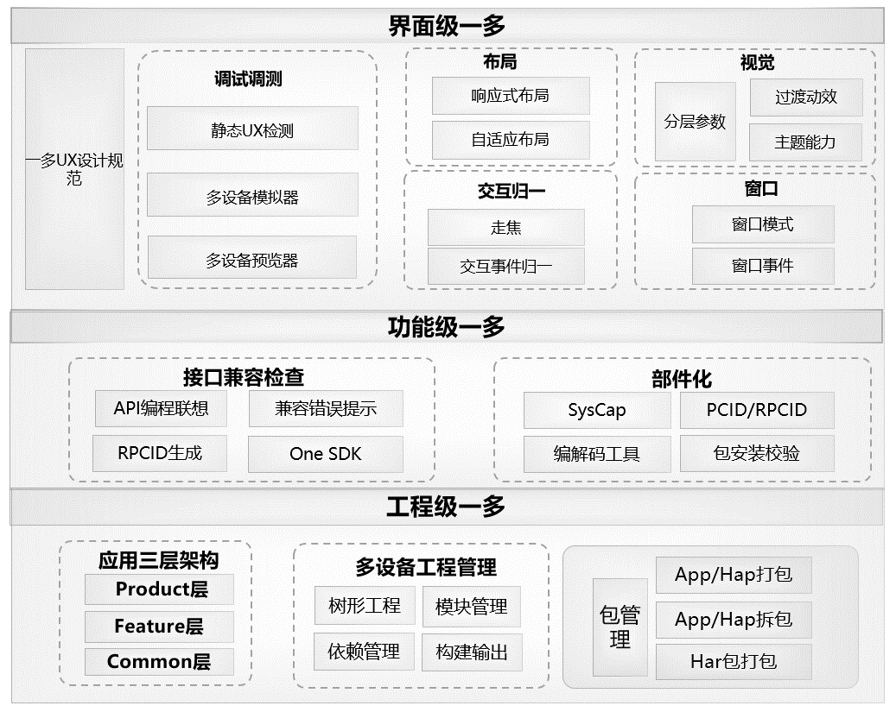


- 工程级一多：应用采用三层架构设计，结合工程管理与包管理能力，实现工程代码的统一管理与多设备按需部署。
- 功能级一多：在工程级一多的基础上，通过API Capability绑定机制，提升功能模块的灵活性与代码复用率。
- 界面级一多：在功能级一多的支撑下，依托UI一多能力，包括典型布局、响应式与自适应布局，以及统一的视觉与交互设计，实现界面在多设备上的自适应展示与一致体验。


说明

- 小屏幕场景，如手表，以及屏幕比例特殊的场景，如PuraX外屏，由于应用设计布局差异显著，无法通过一套布局调整实现适配。


- 多数场景下，页面复杂度过高，通过界面级一多能力使用一套代码直接实现页面的成本较高，且代码可读性较差。因此，需要单独设计UX，并使用if-else断点单独实现一套布局或创建设备的hap包（工程级多层架构）。如下图所示，以手表为例，单独创建HAP包以实现手表布局。


- 少数场景下，使用自适应与响应式能力，通过UX设计图进行说明。以puraX外屏为例，整体采用栅格布局实现，具体组件内的细节差异通过响应式能力的断点进行判断。
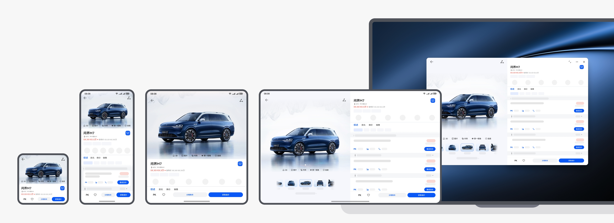


## 开发路径


应用在需求明确后，开发过程通常包含：体验设计（包含界面UX设计、业务功能设计）、架构设计、界面开发、功能开发等步骤。实现一多应用同样遵循这一流程，本指导内容也据此编排。通过运用HarmonyOS的系统能力，构建完整的技术路径，从而实现“一套代码工程，一次开发上架，多端按需部署”，达成“支撑开发者快速高效的开发支持多种终端设备形态的应用，实现对不同设备兼容的同时，提供跨设备的流转、迁移和协同的分布式体验”的目标。


### 体验设计


支持一多的应用开发，建议在产品设计的早期阶段就纳入多设备适配的考量，通过统一规划实现跨终端的功能布局与用户体验一致性。

UX设计原则应该考虑多设备的“差异性”、“一致性”、“灵活性”和“兼容性”。

一多开发中的UX体验设计详细内容，可参见多设备体验设计。


### 架构设计


为了实现“一次开发，多端部署”的开发理念，HarmonyOS应用需要基于一套代码工程，一次编译构建支持华为手机、PC/2in1等1+8全场景设备，所以良好的应用架构设计至关重要。为了解决这些问题，开发者应关注分层和模块化的架构设计，通过分层和模块化，理清业务逻辑，减少代码耦合，实现灵活部署和模块级复用，满足手机、折叠屏、平板和PC等多设备部署。


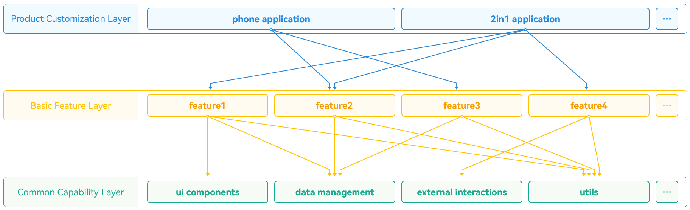


- 产品定制层 面向不同设备和场景的个性化需求，涵盖UI设计、资源配置及交互逻辑。作为用户直接交互的界面，具备灵活调整与扩展能力，适配多样应用场景。
- 基础特性层 位于公共能力层之上，封装独立功能模块与业务逻辑，具有高内聚、低耦合、易定制等特点，为产品定制层提供基础功能支撑，并支持灵活部署。


- 公共能力层 提供通用能力支撑，包括UI组件、数据管理、工具库等共享资源，保障系统的稳定性与可维护性，为基础特性层与产品定制层提供统一服务支持。


架构设计的详细原理，可参见分层架构设计和模块化设计。


### 页面开发


- 窗口适配 在一多开发过程中，开发者需要适配多种不同窗口类型，并关注同一窗口类型在不同设备上的差异化属性，如尺寸规格、系统区域限制、是否支持沉浸式显示、自由窗口是否包含标题栏等。为确保应用在多设备上的良好兼容性，需重点关注以下几个方面： 横竖屏切换策略与实现方案：根据不同设备的使用场景和用户习惯，制定合理的屏幕旋转控制逻辑，并实现适配。
- 窗口沉浸式页面的适配方式：针对沉浸式体验需求，合理配置状态栏、导航栏的隐藏与交互逻辑，提升视觉完整性。
- PC/2in1设备中的自由窗口适配：包括窗口化布局、标题栏显示控制、全屏沉浸式体验的实现，以保障桌面级交互的流畅性和一致性。


在本文的多设备窗口形态章节，有详细的开发实践原理和步骤。
断点和响应式布局
响应式布局是指页面内的元素能够根据窗口尺寸自动调整。响应式布局中最常使用的特征是窗口宽度，因此系统侧将窗口宽度划分为不同的范围（称为断点）。当窗口宽度从一个断点变化到另一个断点时，改变页面布局（如将页面内容从单列排布调整为双列排布甚至三列排布等）以获得更好的显示效果。


在本文的响应式布局章节，详细介绍了如何实现界面响应式布局变化。
交互归一
在多设备应用开发中，交互体验是关键质量指标。面对触控屏、鼠标、键盘、遥控器等多种输入方式，需考虑不同设备的交互适配。

交互归一是一种适配多设备输入的交互响应框架，将各类输入行为统一为标准化事件，确保界面在不同设备上保持一致的交互体验。开发者只需调用统一接口，无需为每种设备单独适配，从而简化开发流程。


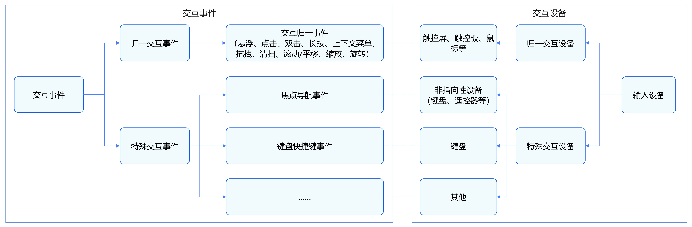


在本文的多设备交互章节，将详细介绍交互事件的开发实践。


### 功能开发


系统能力（即SystemCapability，缩写为SysCap）指操作系统中每一个相对独立的特性，如蓝牙、WIFI、NFC、摄像头等，都是系统能力之一。每个系统能力对应多个API，随着目标设备是否支持该系统能力共同存在或消失。

开发多设备应用时，工程中默认的要求能力集是多个设备支持能力集的交集，默认的联想能力集是多个设备支持能力集的并集。只有当应用要求能力集是设备支持能力集的子集的时候，应用才可以在该设备上分发、安装和运行。因此，开发一多应用时，需要借助SysCap机制，在各个环节中加以拦截或管控，保证应用可以在设备上正常安装和使用。

在本文的多设备功能开发章节，有详细的多设备功能开发实践介绍。


## 场景案例


依托HarmonyOS提供的“一次开发，多端部署”能力，开发者可基于一套代码体系高效适配多个垂直业务场景，实现跨设备、跨形态的应用部署。通过灵活运用该系统级特性，不仅能够覆盖手机、平板、智能穿戴等多种终端形态，还可快速响应金融、医疗、教育、交通等不同行业的多样化需求，全面提升应用开发效率与落地质量。


### 业务场景案例


一多在多个场景下进行适配，得到更好的浏览交互体验。以下是具体垂类场景应用给出了场景内典型页面的设计开发建议，方便设计师和开发者进行更有针对性的参考和选用。

- 影音娱乐类 长视频、短视频、直播、音乐等类型的应用或业务场景很常见。这类场景的核心都是沉浸式的视频播放和互动，围绕此核心场景，此类应用有如下特点：海量视频内容资源（一目十行）；沉浸式视频播放状态（持续粘性）；简单的信息架构，层级扁平（适合做特殊设计优化）；快捷的手势交互，易学，沉浸感强（操作流）；注重作者与观赏者的互动（社交因素）；探索延展相关业务：多方同台直播、视频内商品推广（商业机会）。
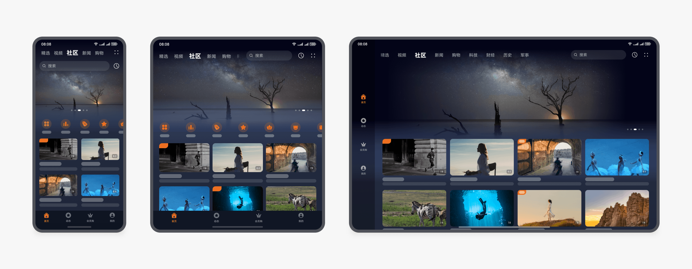
场景案例最佳实践：[多设备长视频界面](https://developer.huawei.com/consumer/cn/doc/best-practices/multi-video-app)。
- 社交通讯类 社交通讯类场景主要包括社交动态、IM 对话、通话、会议等类型的应用和场景。此类场景旨在让用户享受高效的浏览和互动交互。需要避免因为部分元素显示过大，导致大屏幕上交互效率降低。建议重点关注首页、详情页、对话页、通话页等，有针对性地适配以提高用户体验。
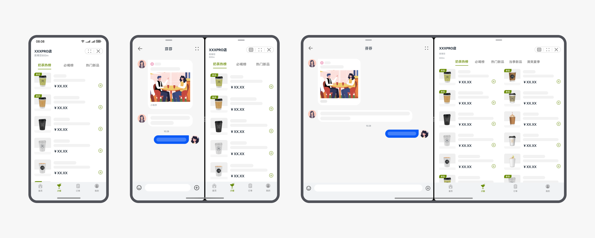
场景案例最佳实践：[多设备即时通讯界面](https://developer.huawei.com/consumer/cn/doc/best-practices/multi-communication-app)。
- 新闻阅读类 新闻阅读类应用，本质是信息的聚合。首页和详情页是此类应用的典型核心场景。在宽屏设备中，首页需要进行延伸布局、重复布局等适配，以确保浏览效率更高；详情页使用左右布局往往能获得更舒适的阅读方式，达到边看边评的效果。


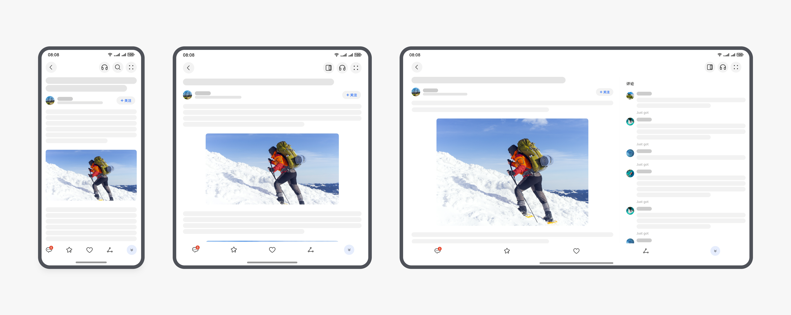
场景案例最佳实践：[多设备新闻阅读界面](https://developer.huawei.com/consumer/cn/doc/best-practices/multi-news-read)。
- 电商购物类 购物、买菜等服务类型的应用或业务场景，旨在让用户享受高效的浏览和互动。这类场景的核心是浏览商品、商品比价、直播购，因此，在大屏设备上可以向用户展示更多的商品选择，提供更轻便高效的交互体验。此类应用有如下特点：界面布局舒适美观、展示更多的商品信息、高效的详情对比、快捷流畅的界面交互、关键信息无干扰。
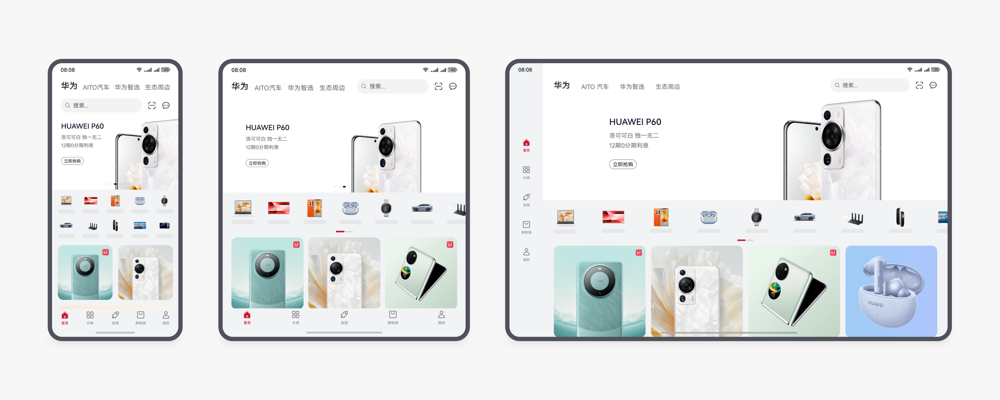
场景案例最佳实践：[多设备购物比价界面](https://developer.huawei.com/consumer/cn/doc/best-practices/multi-shopping-price-comparison)。
- 便捷生活类 便捷生活类场景主要包括点餐、观影、看攻略等。此类场景在宽屏上可以让用户拥有更高效和流畅的使用体验。

场景案例最佳实践：[多设备便捷生活界面](https://developer.huawei.com/consumer/cn/doc/best-practices/multi-convenient-life)。
- 旅游住宿类 旅游住宿、订票类场景通常包含火车/飞机订票、订酒店、查询票务信息等核心功能，围绕此核心功能，此类场景旨在让用户拥有流畅沉浸的用户体验，提供更轻便高效的交互体验。
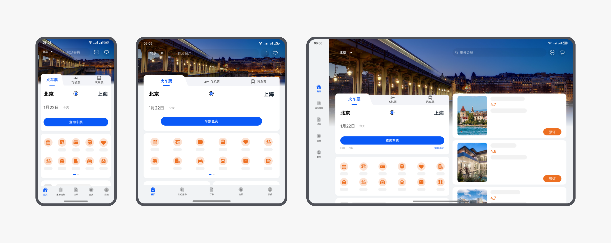
场景案例最佳实践：[多设备旅行订票界面](https://developer.huawei.com/consumer/cn/doc/best-practices/multi-travel-accommodation)。
- 出行导航类 出行导航类场景通常包含查询地点信息、路线建议、导航、打车等核心功能，用户可以通过悬浮面板体验到面板与底层地图间的交互，围绕此核心场景，此类应用有如下特点：手机使用底部半模态面板，其他设备上使用侧边半模态面板；面板支持多档位高度滑动调节；面板默认高度，需要依据屏幕尺寸的不同而有所区分，充分发挥屏幕尺寸优势；折叠屏&平板上侧边的半模态面板支持用户自行拖拽至左侧或右侧位置；建议折叠屏和平板等宽屏设备上，Tab放置在半模态面板内。
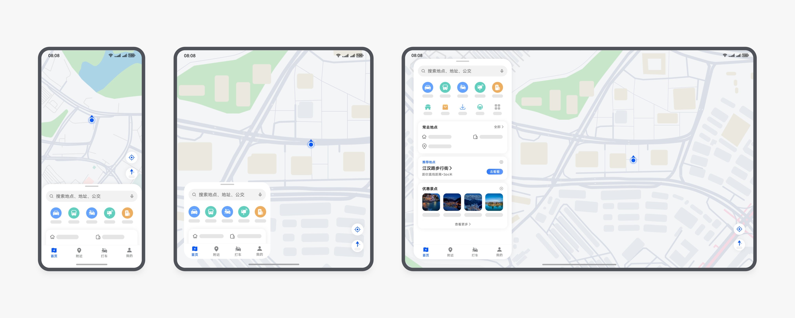
场景案例最佳实践：[多设备地图导航界面](https://developer.huawei.com/consumer/cn/doc/best-practices/multi-travel-navigation)。


### 设备场景案例


对于不同的设备，一多适配可以有效利用他们的硬件特性带来更好的体验，例如折叠屏的悬停、平板和PC/2in1的大屏等。

- 折叠屏适配 折叠屏产品具有独特的悬停态，即用户可以将产品半折后立在桌面上，实现免手持的体验。悬停态场景非常适合不需要频繁进行交互的任务，例如视频通话、播放视频、拍照、听歌等。


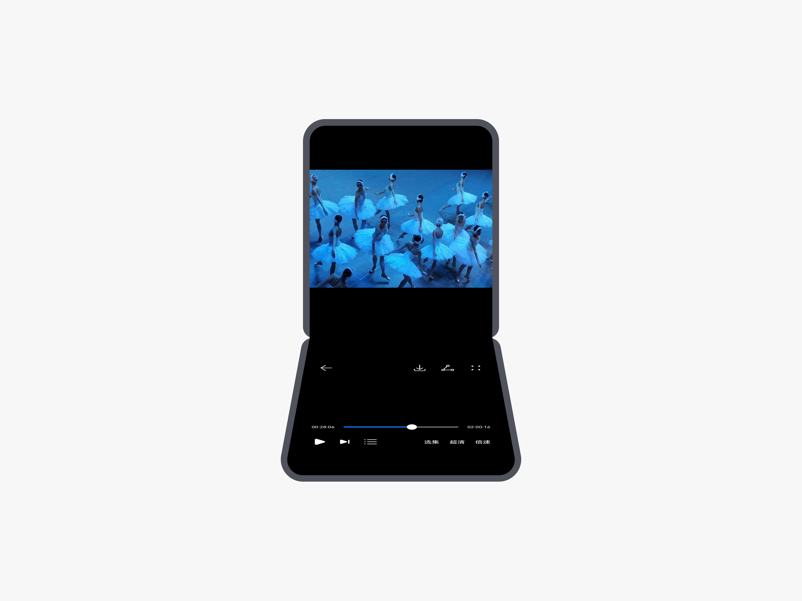
展开态不应出现页面跳转、操作步骤增加、操作更复杂等体验下降的情况；不应破坏应用内原有的沉浸式体验，避免仅仅为了扩充内容，或强制应用分屏而过度改变用户体验和用户习惯；在折叠态和展开态之间切换时，需要保证当前任务的连续性。切换之前的任务和相关状态能保存、延续，或能够快速恢复，给用户提供连续的体验。不发生闪退、重启等异常。
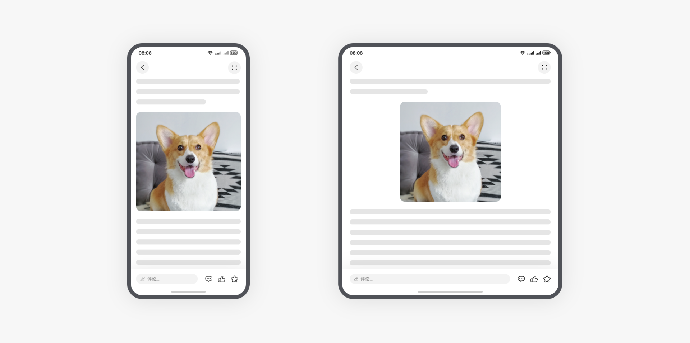
折叠屏适配的详细开发步骤，请参见[折叠屏悬停态](https://developer.huawei.com/consumer/cn/doc/best-practices/bpta-folded-hover)和设备场景[折叠屏应用开发](https://developer.huawei.com/consumer/cn/doc/best-practices/bpta-foldable-guide)。
- 多端设备支持 针对不同设备的特性，在开发过程中需充分考虑其硬件能力与使用场景，从而进行有针对性的设计与适配。 以平板和PC为例，作为HarmonyOS“1+8”全场景生态中的重要终端，它们在学习、办公和娱乐等日常场景中发挥着关键作用。要开发体验更优的应用，开发者需首先了解这些设备的独特特性： 大屏高分辨率：相比手机，屏幕更大、分辨率更高，可承载更丰富的内容展示与信息布局。
- 横竖屏支持：可根据用户习惯自由切换横向或纵向显示。
- 多窗口模式：支持全屏显示或自由窗口布局，提升多任务处理效率
- 键鼠输入：兼容键盘与鼠标操作，满足桌面级交互需求。


设备维度的特性适配，具体的开发步骤可参见多端设备支持相关内容：手机、平板、电脑和穿戴。


## 基础知识


为了更好的阅读后面的章节，本小节主要介绍了一些基础知识，方便开发者理解内容。


### 方舟开发框架


方舟开发框架（简称：ArkUI）提供开发者进行应用UI开发时所必须的能力。

方舟开发框架提供了两种开发范式，分别是基于JS扩展的类Web开发范式（后文中简称为“类Web开发范式”）和基于ArkTS的声明式开发范式（后文中简称为“声明式开发范式”）。

- **声明式开发范式**：采用TS语言并进行声明式UI语法扩展，从组件、动效和状态管理三个维度提供了UI绘制能力。UI开发更接近自然语义的编程方式，让开发者直观地描述UI界面，不必关心框架如何实现UI绘制和渲染，实现极简高效开发。同时，选用有类型标注的TS语言，引入编译期的类型校验，更适用大型的应用开发。
- **类Web开发范式**：采用经典的HML、CSS、JavaScript三段式开发方式。使用HML标签文件进行布局搭建，使用CSS文件进行样式描述，使用JavaScript文件进行逻辑处理。UI组件与数据之间通过单向数据绑定的方式建立关联，当数据发生变化时，UI界面自动触发更新。此种开发方式，更接近Web前端开发者的使用习惯，快速将已有的Web应用改造成方舟开发框架应用。主要适用于界面较为简单的中小型应用开发。


两种开发范式的对比如下：


| 开发范式名称 | 语言生态 | UI更新方式 | 适用场景 | 适用人群 |
| --- | --- | --- | --- | --- |
| 声明式开发范式 | ArkTS语言 | 数据驱动更新 | 复杂度较大、团队合作度较高的程序 | 移动系统应用开发人员、系统应用开发人员 |
| 类Web开发范式 | JS语言 | 数据驱动更新 | 界面较为简单的中小型应用和卡片 | Web前端开发人员 |


> [!NOTE]
> 声明式开发范式占用内存更少，**更推荐开发者选用声明式开发范式来搭建应用UI界面**。


### 工程结构


HarmonyOS应用的分层架构设计基于一套代码工程，支持华为手机、PC/2in1等1+8全场景设备，实现了“一次开发，多端部署”的开发理念，包括产品定制层、基础特性层和公共能力层，构建了清晰、高效、可扩展的设计架构。“一多”推荐在应用开发过程中使用如下的“三层工程结构”。


- common（公共能力层） 存放公共基础能力，包括公共UI组件、数据管理、外部交互和工具库等共享功能。应用可调用这些公共能力。 提供稳定可靠的功能支持，确保应用的稳定性和可维护性。 common层可编译成一个或多个HAR包或HSP包，其只可以被products和features依赖，不可以反向依赖。
- features（基础特性层） 位于公共能力层之上，用于存放相对独立的功能UI和业务逻辑实现。每个功能模块都具备高内聚、低耦合、可定制的特点，支持产品的灵活部署。 为产品定制层提供稳健且丰富的基础功能支持，包括UI组件和基础服务。公共能力层为其提供通用功能和服务。 为了增强系统的可扩展性和维护性，基础特性层对功能进行了模块化处理。例如，应用底部导航栏的每个选项都是一个独立的业务模块。
- products（产品定制层） 专注于满足不同设备或使用场景的个性化需求，包括UI设计、资源和配置，以及特定场景的交互逻辑和功能特性。 products层各个子目录各自编译为一个Entry类型的HAP包，作为应用主入口。products层不可以横向调用。 作为应用的入口，是用户直接互动的界面。为了满足特定需求，产品定制层可以灵活调整和扩展，以适应各种使用场景。


代码工程结构抽象后一般如下所示：

```text
/application
├── common # 可选。公共能力层, 编译为HAR包或HSP包
├── features # 可选。基础特性层
│   ├── feature1 # 子功能1, 编译为HAR包或HSP包或Feature类型的HAP包
│   ├── feature2 # 子功能2, 编译为HAR包或HSP包或Feature类型的HAP包
│   └── ...
└── products # 必选。产品定制层
├── wearable # 智能穿戴泛类目录, 编译为Entry类型的HAP包
├── default # 默认设备泛类目录, 编译为Entry类型的HAP包
└── ...
```


> [!NOTE]
> 部署模型不同，相应的代码工程结构也有差异。部署模型A和部署模型B的主要差异点集中在products层：部署模型A在products目录下同一子目录中做功能和特性集成；部署模型B在products目录下不同子目录中对不同的产品做差异化的功能和特性集成。
>                  开发阶段应考虑**不同类型设备间最大程度的复用代码**，以减少开发及后续维护的工作量。
>                  整个代码工程最终构建出一个[应用程序包](https://developer.huawei.com/consumer/cn/doc/harmonyos-guides/application-package-overview)，发布到应用市场中。
>         参考链接：分层架构设计。


### 应用程序包结构


在进行应用开发时，一个应用通常包含一个或多个Module。Module是应用/元服务的基本功能单元，包含了源代码、资源文件、第三方库及应用/元服务配置文件，每一个Module都可以独立进行编译和运行。

Module分为“Ability”和“Library”两种类型：

- “Ability”类型的Module编译后生成[HAP包](https://developer.huawei.com/consumer/cn/doc/harmonyos-guides/hap-package)。
- “Library”类型的Module编译后生成[HAR包](https://developer.huawei.com/consumer/cn/doc/harmonyos-guides/har-package)或[HSP包](https://developer.huawei.com/consumer/cn/doc/harmonyos-guides/in-app-hsp)。


应用以APP Pack形式发布，其包含一个或多个HAP包。HAP是应用安装的基本单位，HAP可以分为Entry和Feature两种类型：

- Entry类型的HAP：应用的主模块。在同一个应用中，同一设备类型只支持一个Entry类型的HAP，通常用于实现应用的入口界面、入口图标、主特性功能等。
- Feature类型的HAP：应用的动态特性模块。Feature类型的HAP通常用于实现应用的特性功能，一个应用程序包可以包含一个或多个Feature类型的HAP，也可以不包含。


> [!NOTE]
> 关于Entry类型的HAP包、Feature类型的HAP包、HAR包、HSP包以及APP Pack的详细介绍请参考[Stage模型应用程序包结构](https://developer.huawei.com/consumer/cn/doc/harmonyos-guides/application-package-structure-stage)。


### 部署模型


“一多”有两种部署模型：

- **部署模型A**：不同类型的设备上按照一定的工程结构组织方式，通过一次编译生成**相同**的HAP（或HAP组合）。
- **部署模型B**：不同类型的设备上按照一定的工程结构组织方式，通过一次编译生成**不同**的HAP（或HAP组合）。


开发者可以从应用UX设计及应用功能两个维度，结合具体的业务场景，考虑选择哪种部署模型。当然，也可以借助设备类型分类，快速做出判断。

从屏幕尺寸、输入方式及交互距离三个维度考虑，可以将常用类型的设备分为不同泛类：

- 手机、平板
- 车机、智慧屏
- 智能穿戴
- ……

> [!NOTE]
> 当应用完成一多能力适配后，在手机与车机协同场景，使用超级桌面将手机应用流转到车机屏幕上，无需重新适配即可兼容车机屏幕显示。


对于相同泛类的设备，优先选择部署模型A，对于不同泛类设备，优先选择部署模型B。


> [!NOTE]
> 应用在不同泛类设备上的UX设计或功能相似时，可以使用部署模型A。
>                  应用在同一泛类不同类型设备上UX设计或功能差异非常大时，可以使用部署模型B，但同时也应审视应用的UX设计及功能规划是否合理。
>                  本小节引入部署模型A和部署模型B的概念是为了方便开发者理解。实际上在开发多设备应用时，如果目标设备类型较多，往往是部署模型A和部署模型B混合使用。
>                  不管采用哪种部署模型，都应该采用一次编译。
