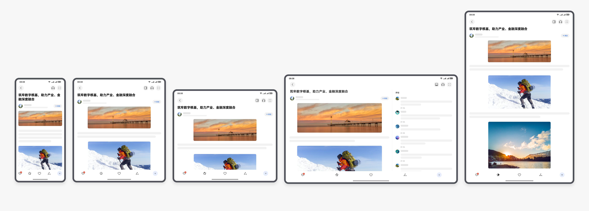

# 多设备体验设计

更新时间：2026-03-12 08:45:02

来源：https://developer.huawei.com/consumer/cn/doc/best-practices/bpta-multi-device-design-principles

支持一多的应用开发，建议在产品设计的早期阶段就纳入多设备适配的考量，通过统一规划实现跨终端的功能布局与用户体验一致性。
 
随着终端设备形态日益多样化，应用设计需要考虑界面能适配不同的屏幕尺寸、屏幕方向和设备类型。同时还需要保持多设备体验的连续性，改善多端独立的设计，尽可能降低开发者的工作量和维护成本。基于此 HarmonyOS 为设计师提供了面向多设备的设计指南，让设计师在进行多端设计时有一套科学的方法，最大程度减少设计的工作量，保障多端设计在一定程度的一致性。同时 HarmonyOS 也提供了对应的技术能力，帮助开发者快速地进行多端应用设计。
 

 
结合用户在多端设备上的历史交互习惯、各场景下的使用诉求等，进行了一些设计方法的总结，主要包括如下几个部分：
 
- 基础要求：在多设备应用设计中需要遵守的基础体验要求，如果不满足基础要求，则会极大损害用户的使用体验。
- 响应式布局：针对常见界面元素，提出了适用于宽屏设备的响应式布局设计范式，避免因简单拉伸或放大带来的体验问题。
- 增值体验：在多设备应用设计中，应结合场景差异，灵活考虑用户体验的变化，在适配基础上提供更具价值的体验升级。
- 场景化设计参考：针对具体垂直场景中的典型应用，提供了场景内代表性页面的设计建议，便于设计师有针对性地参考与选用。

 
UX设计原则应该考虑多设备的“差异性”、“一致性”、“灵活性”和“兼容性”。
 
详细规范请参见[设计理念](https://developer.huawei.com/consumer/cn/doc/design-guides/design-concepts-0000001795698445)。对应到具体的垂域案例设计，请参见[应用设计最佳实践](https://developer.huawei.com/consumer/cn/doc/design-guides/practices-overview-0000001746498066)。
