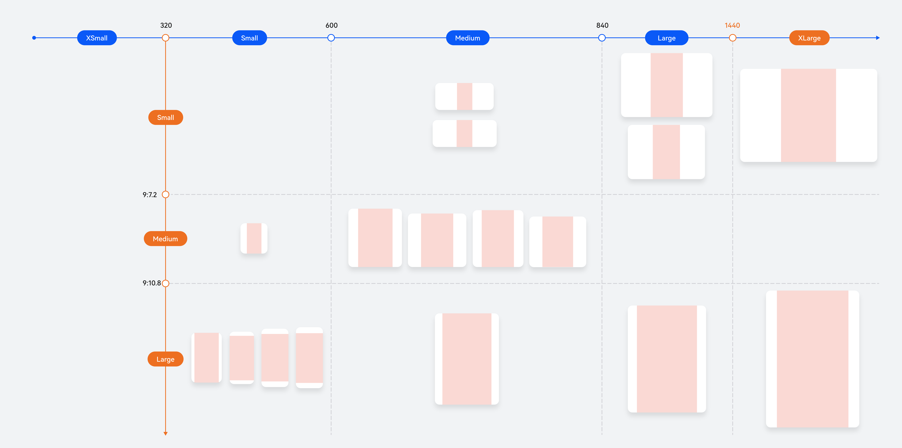
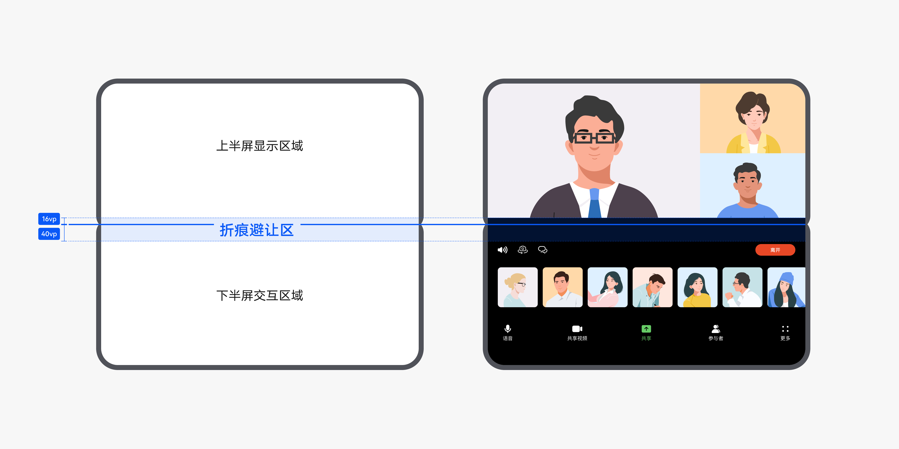

# 多设备适配屏幕差异

更新时间：2026-03-17 02:20:01

来源：https://developer.huawei.com/consumer/cn/doc/best-practices/bpta-multi-device-screen-diff

#### 概述

多设备适配技术旨在解决跨设备界面一致性问题，如在折叠屏开合、窗口自由调整等场景中保障布局完整性。其核心策略在于通过动态布局调整和响应式设计，消除屏幕尺寸差异导致的截断与留白问题，并确保交互状态切换时的视觉连续性。
 
本文主要面向中高级开发者。开始之前，建议先了解[一次开发，多端部署](https://developer.huawei.com/consumer/cn/doc/best-practices/bpta-multi-device-overview)、[断点](https://developer.huawei.com/consumer/cn/doc/best-practices/bpta-multi-device-responsive-layout#section1532120147301)等知识点。
 
本文主要内容如下：
 
- [适配多设备屏幕差异](#section82114465127)：根据多设备屏幕的差异，建议页面适配不同尺寸的屏幕，具体可参考[页面适配不同尺寸屏幕](#section103508214132)；在短视频等场景下，建议考虑视频在多设备下的沉浸式体验和尺寸适配，具体可参考[视频适配不同尺寸屏幕](#section1452572513130)。
- [适配折叠设备屏幕](#section2079763671319)：开发者在适配折叠设备屏幕时，除了页面需要适配不同尺寸屏幕外，建议适配：[开合连续](#section16541144511135)和[悬停态](#section32851531135)。

 
 

#### 适配多设备屏幕差异

 

#### 页面适配不同尺寸屏幕

页面适配不同尺寸屏幕的本质，是适配不同尺寸的窗口——无论是手机、折叠屏、平板还是电脑，其屏幕差异最终都体现为应用显示窗口宽高、比例的差异。因此，适配的核心应基于窗口属性抽象出响应式能力，通过“[断点](https://developer.huawei.com/consumer/cn/doc/best-practices/bpta-multi-device-responsive-layout#section1532120147301)适配”实现界面随窗口尺寸动态调整，确保在任意窗口规格下均能稳定显示，详情可参考[通过断点刷新UI](https://developer.huawei.com/consumer/cn/doc/best-practices/bpta-multi-device-responsive-layout#section175001836203617)。通过一次性基于断点的布局适配，即可支持分屏、悬浮窗、自由窗口等多种窗口模式，确保界面在不同形态间平滑、连续地响应变化。效果图如下：
 

 
开发多设备界面时，不同屏幕类型常用的响应式布局可参考[屏幕类型布局场景](https://developer.huawei.com/consumer/cn/doc/best-practices/bpta-multi-device-screen-layout)，包含[直板机竖屏](https://developer.huawei.com/consumer/cn/doc/best-practices/bpta-multi-device-screen-layout#section1919517165814)、[大屏横屏](https://developer.huawei.com/consumer/cn/doc/best-practices/bpta-multi-device-screen-layout#section6493354468)等常见窗口形态和[小方形屏](https://developer.huawei.com/consumer/cn/doc/best-practices/bpta-multi-device-screen-layout#section1395830175918)等特殊窗口形态的适配。
 
 

#### 视频适配不同尺寸屏幕

视频适配不同尺寸屏幕，旨在确保各类宽高比的视频在多种设备屏幕上均能呈现良好效果，避免拉伸变形或关键内容被过度裁切。为提升视频观看体验，可通过全屏展示、弱化界面干扰，使用户更加专注于视频内容。效果图如下：
 

 

 
为了实现这一效果，需考虑不同尺寸视频在不同尺寸窗口上的适配规则。从视频的宽高比出发，可分为9:16和非9:16两种类型。
 
> [!NOTE]
> 本章节的适配规则适用于宽度大于320vp的窗口。

 
 
**适配宽高比非9:16的视频**
 
宽高比非9:16的视频包括竖向视频（高>宽）或横向视频（宽>高），红色区域为推荐的视频显示区域，适配建议如下图所示，其中横向坐标为窗口宽高比。
 

 
**适配宽高比为9:16的视频**
 
当视频宽高比为9:16时，其在断点区间的适配效果图如下图所示，红色区域为推荐的视频显示区域。
 

 
当横向断点为sm、纵向断点为lg时，由于设备尺寸的差异，存在不同的适配建议。具体如下图所示，其中横坐标为窗口宽高比。
 

对于不满足横向断点为sm、纵向断点为lg的其他窗口尺寸，建议顶部状态栏和底部Tab栏均采用沉浸式设计，内容区高度=窗口高度，内容区宽度=内容区高度×视频宽高比。
 
**获取窗口信息**
 
如前述章节所述，在视频适配不同窗口尺寸时，需获取窗口尺寸信息、避让区信息等参数用于计算。以下列举的方法将在适配过程中使用：
 
- 使用[getWindowProperties()](https://developer.huawei.com/consumer/cn/doc/harmonyos-references/arkts-apis-window-window#getwindowproperties9)方法，返回的对象中windowRect.width和windowRect.height分别表示窗口的宽度和高度；
- 使用[getWindowAvoidArea()](https://developer.huawei.com/consumer/cn/doc/harmonyos-references/arkts-apis-window-window#getwindowavoidarea9)方法，返回的[AvoidArea](https://developer.huawei.com/consumer/cn/doc/harmonyos-references/arkts-apis-window-i#avoidarea7)对象可获得当前设备的避让区域信息；
- 屏幕窗口尺寸可能会发生变化，比如在自由窗口模式下可任意调整窗口大小，需使用[on('windowSizeChange')](https://developer.huawei.com/consumer/cn/doc/harmonyos-references/arkts-apis-window-window#onwindowsizechange7)监听窗口尺寸的变化。当窗口尺寸变化时，应依据适配规则重新计算内容区域的尺寸，确保视频展示效果良好；
- 系统避让区可能会发生变化，例如窗口从全屏模式切换至悬浮窗模式，需要使用[on('avoidAreaChange')](https://developer.huawei.com/consumer/cn/doc/harmonyos-references/arkts-apis-window-window#onavoidareachange9)监听系统避让区的尺寸变化，避让区尺寸变化时，应依据适配规则重新计算内容区域的尺寸；

 
以上适配建议的实现示例代码可参考[基于adaptive_video的短视频适配](https://developer.huawei.com/consumer/cn/doc/best-practices/bpta-short-video-base-adaptivevideo)。
 

#### 适配折叠设备屏幕

折叠设备通常具有支持独立显示的两块或多块屏幕，例如Mate X5、Mate XT和MateBook Fold等。开发者在适配折叠设备屏幕时，除了页面适配不同尺寸屏幕外，还需关注两个特殊点：[开合连续](#section16541144511135)和[悬停态](#section32851531135)。
 
 

#### 开合连续

[开合连续](https://developer.huawei.com/consumer/cn/doc/best-practices/bpta-foldable-guide#section186893019118)指应用在各种屏幕和窗口状态间切换时页面内容连续，切换之前的任务和相关状态能保存、延续，或能够快速恢复，给用户提供连续的体验。具体可参考[适配应用界面开合连续](https://developer.huawei.com/consumer/cn/doc/best-practices/bpta-foldable-guide#section186893019118)。
 
 

#### 悬停态

折叠屏在悬停态下可平稳放置于桌面，实现免手持体验，适用于视频通话、播放视频、拍照及听歌等无需频繁交互的场景。设计规范可参照[悬停态](https://developer.huawei.com/consumer/cn/doc/design-guides/foldable-0000002352875141#section183378919119)。设备在悬停态时，应用需避开中间折痕区域，并对上下两个界面进行悬停适配，重新布局。悬停状态的实现方案可参考[折叠屏悬停态](https://developer.huawei.com/consumer/cn/doc/best-practices/bpta-folded-hover)。
 
 

