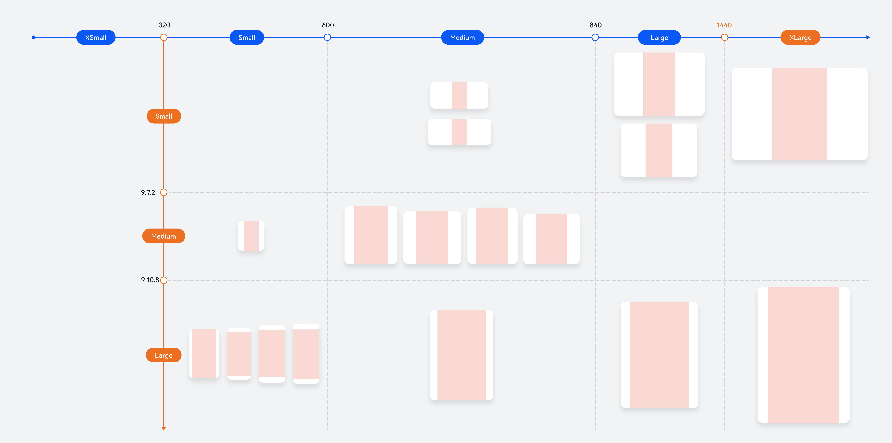
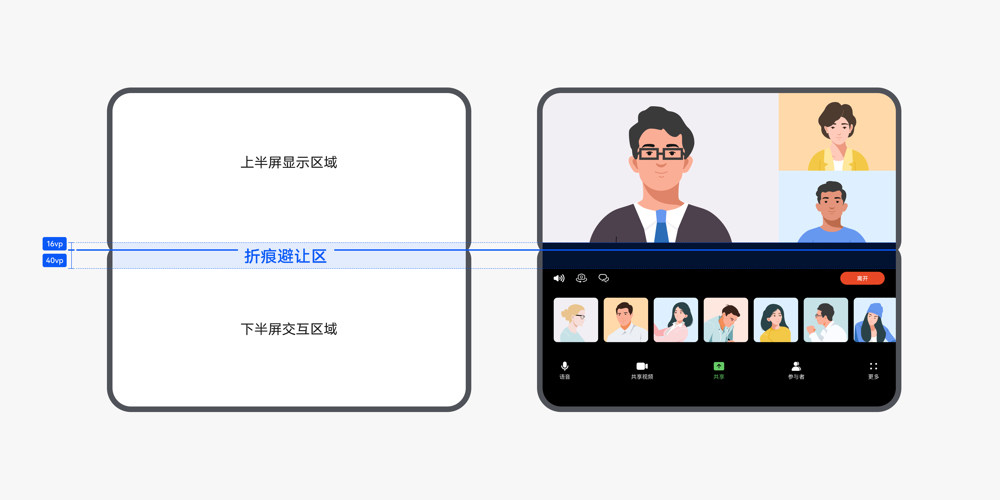

# 多设备适配屏幕差异

更新时间：2026-06-12 07:22:00

来源：https://developer.huawei.com/consumer/cn/doc/best-practices/bpta-multi-device-screen-diff

#### 概述

多设备适配技术旨在解决跨设备界面一致性问题，如在折叠屏开合、窗口自由调整等场景中保障布局完整性。其核心策略在于通过动态布局调整和响应式设计，消除屏幕尺寸差异导致的截断与留白问题，并确保交互状态切换时的视觉连续性。
 
本文主要面向中高级开发者。开始之前，建议先了解[一次开发，多端部署](https://developer.huawei.com/consumer/cn/doc/best-practices/bpta-multi-device-overview)、[断点](https://developer.huawei.com/consumer/cn/doc/best-practices/bpta-multi-device-responsive-layout#section1532120147301)等知识点。
 
本文主要内容如下：
 
- [适配多设备屏幕差异](#section82114465127)：根据多设备屏幕的差异，建议页面适配不同尺寸的屏幕，具体可参考[页面适配不同尺寸屏幕](#section103508214132)；在短视频等场景下，建议考虑视频在多设备下的沉浸式体验和尺寸适配，具体可参考[视频适配不同尺寸屏幕](#section1452572513130)。
- [适配折叠设备屏幕](#section2079763671319)：开发者在适配折叠设备屏幕时，除了页面需要适配不同尺寸屏幕外，建议适配：[开合连续](#section16541144511135)和[悬停态](#section32851531135)。

 
 

#### 适配多设备屏幕差异

 

#### 页面适配不同尺寸屏幕

页面适配不同尺寸屏幕的本质，是适配不同尺寸的窗口——无论是手机、折叠屏、平板还是电脑，其屏幕差异最终都体现为应用显示窗口宽高、比例的差异。因此，适配的核心应基于窗口属性抽象出响应式能力，通过“[断点](https://developer.huawei.com/consumer/cn/doc/best-practices/bpta-multi-device-responsive-layout#section1532120147301)适配”实现界面随窗口尺寸动态调整，确保在任意窗口规格下均能稳定显示，详情可参考[通过断点刷新UI](https://developer.huawei.com/consumer/cn/doc/best-practices/bpta-multi-device-responsive-layout#section175001836203617)。通过一次性基于断点的布局适配，即可支持分屏、悬浮窗、自由窗口等多种窗口模式，确保界面在不同形态间平滑、连续地响应变化。效果图如下：
 


 
开发多设备界面时，不同屏幕类型常用的响应式布局可参考[屏幕类型布局场景](https://developer.huawei.com/consumer/cn/doc/best-practices/bpta-multi-device-screen-layout)，包含[直板机竖屏](https://developer.huawei.com/consumer/cn/doc/best-practices/bpta-multi-device-screen-layout#section1919517165814)、[大屏横屏](https://developer.huawei.com/consumer/cn/doc/best-practices/bpta-multi-device-screen-layout#section6493354468)等常见窗口形态和[小方形屏](https://developer.huawei.com/consumer/cn/doc/best-practices/bpta-multi-device-screen-layout#section1395830175918)等特殊窗口形态的适配。
 
 

#### 视频适配不同尺寸屏幕

视频适配不同尺寸屏幕，旨在确保各类宽高比的视频在多种设备屏幕上均能呈现良好效果，避免拉伸变形或关键内容被过度裁切。为提升视频观看体验，可通过全屏展示、弱化界面干扰，使用户更加专注于视频内容。效果图如下：
 


 

 
为了实现这一效果，需考虑不同尺寸视频在不同尺寸窗口上的适配规则。从视频的宽高比出发，可分为9:16和非9:16两种类型。
 
> [!NOTE]
> 本章节的适配规则适用于宽度大于320vp的窗口。

 
 
**适配宽高比非9:16的视频**
 
宽高比非9:16的视频包括竖向视频（高>宽）或横向视频（宽>高），红色区域为推荐的视频显示区域，适配建议如下图所示，其中横向坐标为窗口宽高比。
 



 
**适配宽高比为9:16的视频**
 
当视频宽高比为9:16时，其在断点区间的适配效果图如下图所示，红色区域为推荐的视频显示区域。
 


 
当横向断点为sm、纵向断点为lg时，由于设备尺寸的差异，存在不同的适配建议。具体如下图所示，其中横坐标为窗口宽高比。
 


对于不满足横向断点为sm、纵向断点为lg的其他窗口尺寸，建议顶部状态栏和底部Tab栏均采用沉浸式设计，内容区高度=窗口高度，内容区宽度=内容区高度×视频宽高比。
 
**获取窗口信息**
 
如前述章节所述，在视频适配不同窗口尺寸时，需获取窗口尺寸信息、避让区信息等参数用于计算。以下列举的方法将在适配过程中使用：
 
- 使用[getWindowProperties()](https://developer.huawei.com/consumer/cn/doc/harmonyos-references/arkts-apis-window-window#getwindowproperties9)方法，返回的对象中windowRect.width和windowRect.height分别表示窗口的宽度和高度；
- 使用[getWindowAvoidArea()](https://developer.huawei.com/consumer/cn/doc/harmonyos-references/arkts-apis-window-window#getwindowavoidarea9)方法，返回的[AvoidArea](https://developer.huawei.com/consumer/cn/doc/harmonyos-references/arkts-apis-window-i#avoidarea7)对象可获得当前设备的避让区域信息；
- 屏幕窗口尺寸可能会发生变化，比如在自由窗口模式下可任意调整窗口大小，需使用[on('windowSizeChange')](https://developer.huawei.com/consumer/cn/doc/harmonyos-references/arkts-apis-window-window#onwindowsizechange7)监听窗口尺寸的变化。当窗口尺寸变化时，应依据适配规则重新计算内容区域的尺寸，确保视频展示效果良好；
- 系统避让区可能会发生变化，例如窗口从全屏模式切换至悬浮窗模式，需要使用[on('avoidAreaChange')](https://developer.huawei.com/consumer/cn/doc/harmonyos-references/arkts-apis-window-window#onavoidareachange9)监听系统避让区的尺寸变化，避让区尺寸变化时，应依据适配规则重新计算内容区域的尺寸；

 
以上适配建议的实现示例代码可参考[基于adaptive_video的短视频适配](https://developer.huawei.com/consumer/cn/doc/best-practices/bpta-short-video-base-adaptivevideo)。
 

#### 适配折叠设备屏幕

折叠设备通常具有支持独立显示的两块或多块屏幕，例如Mate X5、Mate XT和MateBook Fold等。开发者在适配折叠设备屏幕时，除了页面适配不同尺寸屏幕外，还需关注两个特殊点：[开合连续](#section16541144511135)和[悬停态](#section32851531135)。
 
 

#### 开合连续

开合连续指应用在各种屏幕和窗口状态间切换时页面内容连续，切换之前的任务和相关状态能保存、延续，或能够快速恢复，给用户提供连续的体验。主要标准有页面不发生改变和焦点不发生偏移，具体可参考[开合接续](https://developer.huawei.com/consumer/cn/doc/design-guides/foldable-0000002352875141#section5560057912)。应用页面和功能相关的开合连续能力建议使用断点实现，并通过[window.on('windowSizeChange')](https://developer.huawei.com/consumer/cn/doc/harmonyos-references/arkts-apis-window-window#onwindowsizechange7)接口监听。
 
display提供了折叠状态监听的接口，这些接口建议使用在某些应用功能的适配上，比如[适配设备悬停态](#section1223242181220)、[设置多设备上相机预览画面比例](https://developer.huawei.com/consumer/cn/doc/best-practices/bpta-multi-device-camera#section882216138497)，但不能用于页面布局的开合连续适配。
 
> [!NOTE]
> 不推荐使用折叠状态监听接口实现页面布局的响应式布局和接续，避免在窗口变化但折叠状态未改变的场景下布局未能及时调整，出现页面异常。 在双折叠开合过程中，各种监听回调的触发时序如下。 展开态->折叠态：foldStatusChange(悬停态) -> foldStatusChange(折叠态) -> foldDisplayModeChange -> windowSizeChange 折叠态->展开态：foldStatusChange(悬停态) -> foldDisplayModeChange -> windowSizeChange -> foldStatusChange(展开态)

 
常见的接口汇总如下。
  
| API | 说明 |
| --- | --- |
| getWindowWidthBreakpoint | 获取当前实例所在窗口的宽度断点 |
| getWindowHeightBreakpoint | 获取当前实例所在窗口的高度断点 |
| window.on('windowSizeChange') | 开启窗口尺寸变化的监听 |
| window.off('windowSizeChange') | 关闭窗口尺寸变化的监听 |
| display.isFoldable | 检查设备是否可折叠 |
| display.getCurrentFoldCreaseRegion | 在当前模式下获取折叠折痕区域 |
| display.getFoldStatus | 获取可折叠设备的当前折叠状态 |
| display.getFoldDisplayMode | 获取可折叠设备的显示模式 |
| display.on('foldStatusChange') | 开启折叠设备折叠状态变化的监听 |
| display.off('foldStatusChange') | 关闭折叠设备折叠状态变化的监听 |
| display.on('foldDisplayModeChange') | 开启折叠设备屏幕显示模式变化的监听 |
| display.off('foldDisplayModeChange') | 关闭折叠设备屏幕显示模式变化的监听 |
 
 
**开合页面后刷新UI布局效果**
 
双折叠开合状态变化时会伴随着窗口尺寸的变化，可通过注册on('windowSizeChange')事件监听器来捕获窗口尺寸变化，在回调函数中重新计算当前断点，通过断点变化更新UI布局，确保界面始终与当前窗口尺寸保持同步。这一机制能够有效处理设备展开/折叠、分屏模式切换以及屏幕旋转等多种场景下的界面适配需求，为用户提供流畅的双折叠使用体验。
 
```ArkTS
private onWindowSizeChange: (windowSize: window.Size) => void = (windowSize: window.Size) => {
  AppStorage.setOrCreate('currentWidthBreakpoint', this.uiContext!.getWindowWidthBreakpoint());
  AppStorage.setOrCreate('currentHeightBreakpoint', this.uiContext!.getWindowHeightBreakpoint());
};
```
 
触发断点变化回调后，需要通过断点更新UI布局实现双折叠开合前后布局连续，具体可参考[通过断点刷新UI](https://developer.huawei.com/consumer/cn/doc/best-practices/bpta-multi-device-responsive-layout#section175001836203617)。
 
**可滑动组件的阅读焦点不偏移**
 
对于双折叠开合连续使用场景，应用在完成折叠状态切换操作后，需确保[List](https://developer.huawei.com/consumer/cn/doc/harmonyos-references/ts-container-list)组件、[WaterFlow](https://developer.huawei.com/consumer/cn/doc/harmonyos-references/ts-container-waterflow)组件以及 [Scroll](https://developer.huawei.com/consumer/cn/doc/harmonyos-references/ts-container-scroll)组件等可滑动组件的阅读焦点不发生偏移。目前，这些组件依据折叠状态改变前的滑动偏移量来维持阅读焦点位置，然而，由于折叠状态切换前后，组件内部高度可能发生变化，即便滑动相同的偏移量，也难以达成阅读焦点不偏移的目标。因此，有必要针对上述可滑动组件采取特殊处理措施。
 


 
- List组件List组件可以通过[onScrollIndex()](https://developer.huawei.com/consumer/cn/doc/harmonyos-references/ts-container-list#onscrollindex)来监听子组件划入或划出List显示区域，可以获取到当前处于List显示区域头部的索引值。获取到头部索引值后，在监听双折叠状态变化的回调中，利用Scroller控制器提供的[scrollToIndex()](https://developer.huawei.com/consumer/cn/doc/harmonyos-references/ts-container-scroll#scrolltoindex)方法，使列表滑动到指定索引值的位置，从而保证阅读焦点不偏移，示例如下。

  在aboutToAppear中注册监听索引值变化的回调，触发刷新。

  
```ArkTS
aboutToAppear(): void {
  let callback: Callback<display.FoldStatus> = (data: display.FoldStatus) => {
    if (data === display.FoldStatus.FOLD_STATUS_EXPANDED) {
      this.barOpacity = 1;
      this.listScroller.scrollToIndex(this.currentIndex);
    } else if (data === display.FoldStatus.FOLD_STATUS_FOLDED) {
      this.listScroller.scrollToIndex(this.currentIndex);
    }
    hilog.info(0x0000, TAG, 'Listening enabled. Data: ' + JSON.stringify(data));
  };
  try {
    display.on('foldStatusChange', callback);
  } catch (error) {
    let err = error as BusinessError;
    hilog.error(0x0000, 'TestLog', `Failed to update fold status. Code: ${err.code}, message: ${err.message}`);
  }
}
```
 在List组件scrollToIndex()方法中更新索引值。

  
```ArkTS
List({
  space: CommonConstants.LIST_SPACE[0],
  scroller: this.listScroller,
}) {
  // ...
}
.onScrollIndex((start: number) => {
  this.currentIndex = start;
})
```

- WaterFlow组件WaterFlow组件需要根据场景进行特殊的判断，若双折叠状态改变前后，WaterFlow未改变展示列数，则系统默认使用改变前的滑动偏移量，以确保阅读焦点不发生偏移；若双折叠状态改变前后，WaterFlow改变了列数，则需要将[WaterFlowLayoutMode](https://developer.huawei.com/consumer/cn/doc/harmonyos-references/ts-container-waterflow#waterflowlayoutmode12枚举说明)改为SLIDING_WINDOW。修改后，系统将根据WaterFlow可展示区域的最小索引值，自动调整以确保阅读焦点不偏移。

  
```ArkTS
WaterFlow({ layoutMode: WaterFlowLayoutMode.SLIDING_WINDOW }) {
  LazyForEach(this.dataSource, (item: number) => {
    FlowItem() {
      Column() {
        Text('Num' + item).fontSize(12).height('16')
      }
    }
    .onAppear(() => {
      if (item + 20 == this.dataSource.totalCount()) {
        for (let i = 0; i < 100; i++) {
          this.dataSource.addLastItem();
        }
      }
    })
    .width('100%')
    .height(this.itemHeightArray[item % 100])
    .backgroundColor(this.colors[item % 5])
  }, (item: string) => item)
}
.columnsTemplate(this.waterFlowColumnsTemplate)
```

- Scroll组件Scroll组件会根据折叠前的滑动偏移量来保证阅读焦点不偏移，但Scroll组件无法做到List组件一样，根据列表项索引来保证阅读焦点不偏移。Scroll组件提供了[scrollBy()](https://developer.huawei.com/consumer/cn/doc/harmonyos-references/ts-container-scroll#scrollby9)方法，以实现滑动指定距离。开发者需要根据具体的业务场景，计算出需要滑动的距离，再通过scrollBy()方法，自行适配Scroll组件的阅读焦点不偏移。

 
 

#### 悬停态

折叠屏在悬停态下可平稳放置于桌面，实现免手持体验，适用于视频通话、播放视频、拍照及听歌等无需频繁交互的场景。设计规范可参照[悬停态](https://developer.huawei.com/consumer/cn/doc/design-guides/foldable-0000002352875141#section183378919119)。设备在悬停态时，应用需避开中间折痕区域，并对上下两个界面进行悬停适配，重新布局。悬停状态的实现方案可参考[折叠屏悬停态](https://developer.huawei.com/consumer/cn/doc/best-practices/bpta-folded-hover)。
 
 


