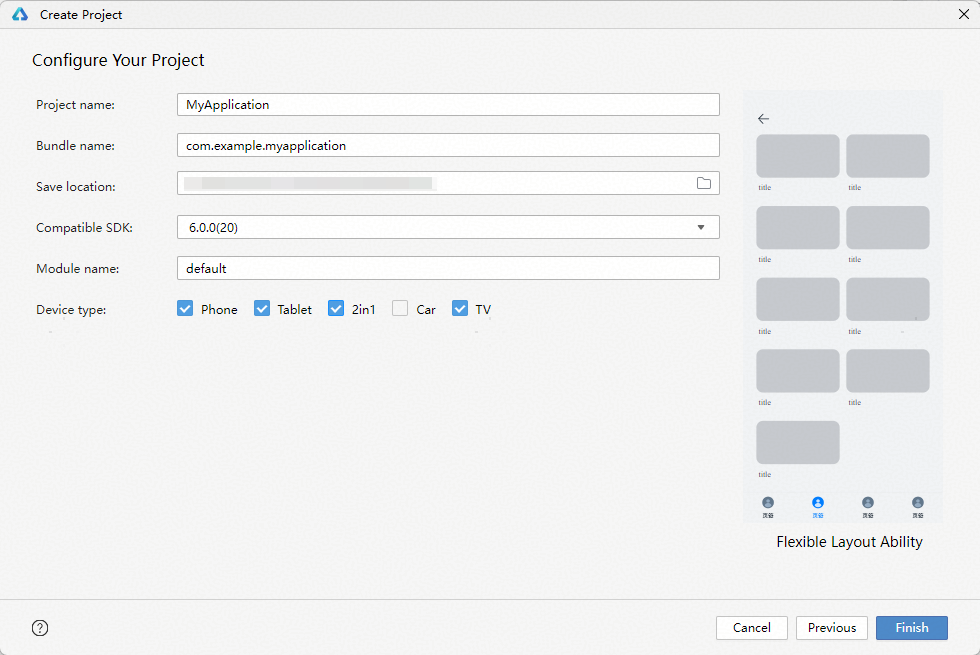
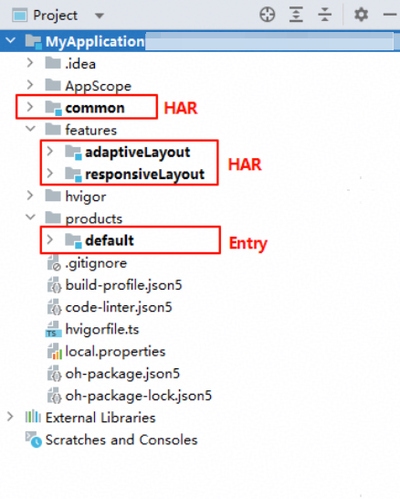
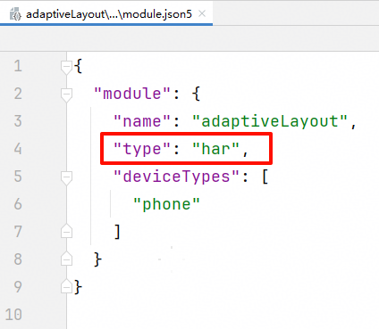
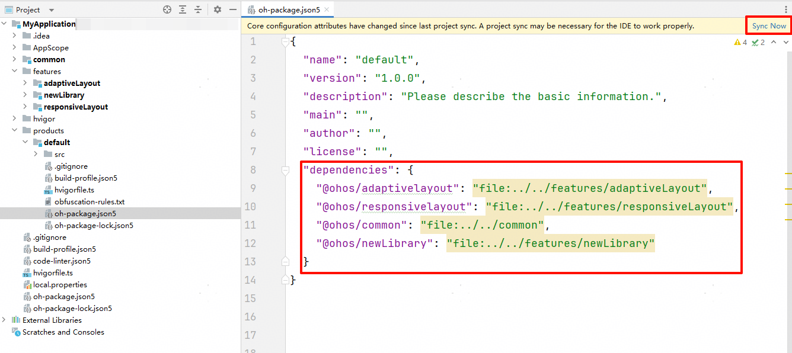
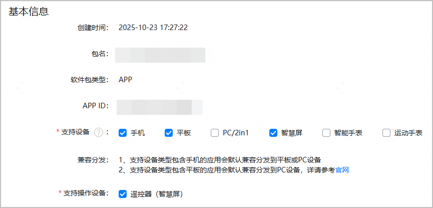

# 多设备工程部署与发布

更新时间：2026-03-12 08:45:02

来源：https://developer.huawei.com/consumer/cn/doc/best-practices/bpta-multi-device-ide

##### 概述

本章介绍一多应用在工程结构设计及应用上架配置中的方法。在开发[“一多”](https://developer.huawei.com/consumer/cn/doc/best-practices/bpta-multi-device-overview)应用时，除了需要针对手机、平板、电脑、智能穿戴、智慧屏等不同设备的硬件特性进行适配外，还需合理组织代码工程，以提升开发效率与部署灵活性。为保障多设备间一致的用户体验，系统提供了相应的配置能力。
 
> [!NOTE]
> 本章的内容基于DevEco Studio 6.0.0 Release版本进行介绍，如使用DevEco Studio其它版本，可能存在文档与产品功能界面不一致、操作不一致的情况，请以实际功能界面为准。

 
 

##### 创建三层架构工程

建议在应用开发过程中使用[架构设计](https://developer.huawei.com/consumer/cn/doc/best-practices/bpta-multi-device-overview#section73681810173312)中介绍的“三层架构工程”，在common层存放基础公共代码，features层存放相对独立的功能模块代码，products层存放完全独立的产品代码。通过在products层依赖features和common提供的公共能力，可最大化实现代码复用与职责分离。
 
“三层架构工程”将项目工程以common、features、products三个层级进行组织，以提升代码复用性与开发效率。工程结构示例如下所示：
 
```text
/application
 ├── common                  # 公共特性目录
 │
 ├── features                # 功能模块目录
 │   ├── feature1            # 子功能
 │   ├── feature2            # 子功能2
 │   └── ...                 # 子功能n
 │
 └── products                # 产品层目录
     ├── default             # 默认设备泛类目录
     ├── tv                  # 智慧屏泛类目录
     └── wearable            # 智能穿戴泛类目录
```
 
建议使用DevEco Studio直接创建出三层架构的新工程。在编译器创建工程弹框中选择Flexible Layout Ability工程模板，该模板可以创建跨设备应用开发的三层工程结构。更多工程模板介绍内容可参考[工程模板介绍](https://developer.huawei.com/consumer/cn/doc/harmonyos-guides/ide-template)。
 



 
配置工程名称、包名等基本信息，选择目标支持设备，完成设置后即可创建项目。
 



 
创建后的工程目录如下图所示：
 
- common层为[HAR](https://developer.huawei.com/consumer/cn/doc/harmonyos-guides/har-package)（Harmony Archive）类型的Module，提供通用组件和工具类等基础能力支撑；
- features层默认创建两个HAR类型的Module，用于封装独立的功能模块与业务逻辑，提升模块化程度与复用性；
- products层创建一个entry类型的[HAP](https://developer.huawei.com/consumer/cn/doc/harmonyos-guides/hap-package)（Harmony Ability Package）Module，作为应用的主入口模块，承载设备与场景差异化的个性化配置和启动逻辑。

 



 
根据业务需求，应用可以灵活规划新增或删除Module，具体操作步骤可以参考[添加/删除模块](https://developer.huawei.com/consumer/cn/doc/harmonyos-guides/ide-add-new-module)。
 
> [!NOTE]
> 在一多应用开发中，可以根据设备类型的设计差异选择是否创建独立HAP包。例如，手机和平板的布局与功能设计类似，可共用一个HAP包；而智慧屏（TV）和智能穿戴设备（Wearable）因与其他设备相比差异较大，建议分别创建独立的HAP包。

 
 

##### 修改Module类型及设备类型

**修改Module类型**
 
在新增Module时，可选择不同类型的Module进行创建。若需修改已创建Module的类型，只需编辑其module.json5配置文件中的"type"字段即可。"type"支持"entry/feature/har/shared"四个取值，分别表示应用的主模块、动态特性模块、静态共享包模块、动态共享包模块，开发者可参考[应用程序包开发与使用](https://developer.huawei.com/consumer/cn/doc/harmonyos-guides/application-package-dev)，根据具体使用场景来选择或修改Module的类型。
 



 
**修改设备类型**
 
在新增Module时，可指定该Module支持运行的设备类型；对于已创建的Module，可通过修改其module.json5配置文件中的"[deviceTypes](https://developer.huawei.com/consumer/cn/doc/harmonyos-guides/module-configuration-file#devicetypes标签)"字段，修改支持运行的设备类型，支持"phone/tablet/2in1/tv/wearable/car"，分别对应手机、平板、电脑、智慧屏、智能穿戴、智能座舱设备。修改后需要点击右上角的"Sync Now"，否则改动不会生效。
 



 
> [!TIP]
> module.json5配置文件中定义了Module的各项基本配置信息，更多字段的详细说明可参考 module.json5配置文件 。

 
 

##### 修改依赖关系

采用[架构设计](https://developer.huawei.com/consumer/cn/doc/best-practices/bpta-multi-device-overview#section73681810173312)中介绍的“三层架构工程”设计原则，在Module中引用其他Module时，需在其oh-package.json5文件中配置依赖关系。使用Flexible Layout Ability工程模板创建的三层架构，模板会默认配置好依赖关系。若要引入新的依赖关系，修改"dependencies"字段，添加新的依赖关系，格式为：
 
```text
"依赖名称": "本地相对路径"
```
 
配置完成后，在代码中可直接通过该依赖名称使用features或common的功能模块。
 
修改oh-package.json5文件后，请点击右上角的"Sync Now"，否则改动不会生效。更多详情参考[引用及管理共享包](https://developer.huawei.com/consumer/cn/doc/harmonyos-guides/ide-har-import)。
 


 
 

##### 配置增强启动页

启动页（Starting Window）在应用冷启动、进程未就绪或内容未加载完成时显示，是首个呈现给用户的界面。开发一多应用时，多端设备共用一套代码，由于不同设备的[断点](https://developer.huawei.com/consumer/cn/doc/best-practices/bpta-multi-device-responsive-layout#section1532120147301)存在差异，启动页在各端呈现的效果可能有所不同，如下表所示：
  
| 横向断点 | sm | md | lg | xl |
| --- | --- | --- | --- | --- |
| 效果图 |  |  |  |  |
 
 
系统提供增强启动页配置能力，旨在保障应用在多端设备上启动页体验的一致性，减少开发者的手动适配工作。开发者可根据设计需求配置启动资源，相应资源也具备根据窗口尺寸进行缩放的能力，更易于多设备适配设计。
 
增强启动页通过配置json文件的方式实现，json文件需要由开发者自行创建并放置到工程目录下，配置文件中可设置图标、插画、背景颜色、背景图片、品牌标识等多元化元素，有助于提升用户对产品的认知。详细的配置步骤可参考[配置增强启动页](https://developer.huawei.com/consumer/cn/doc/harmonyos-guides/launch-page-config#配置增强启动页)。
 
> [!NOTE]
> 增强启动页从API version 19开始支持，低版本下配置不会生效。

 
 

##### 发布一多应用

发布一多应用时，可以配置应用分发至多种设备。默认分发设备为创建项目时所选的设备类型，但可根据实际需求调整。只需发布一次，用户即可在所有支持的设备上安装和使用您的应用。详细的发布流程可参考[发布HarmonyOS应用](https://developer.huawei.com/consumer/cn/doc/app/agc-help-release-app-0000002271695230)。
 


 
构建的一多工程若包含多个根据设备区分的HAP，且在[配置支持设备](https://developer.huawei.com/consumer/cn/doc/app/agc-help-release-app-devicetype-0000002271592112)时一并勾选了相关设备，应用程序（.app文件）在流水线或应用市场上被解包为N个Entry类型的HAP，根据HAP中的deviceTypes声明的设备类型，分发到不同设备。
 


 
> [!NOTE]
> 请确保软件包中声明的支持设备范围（即module.json5文件中"deviceTypes"字段的枚举值）包含AppGallery Connect上最终勾选的设备类型。若声明范围小于勾选范围，超出部分将不会生效。若要新增支持的设备，可参考 修改Module类型及设备类型 。 在应用提交上架前可以修改分发的设备，应用一旦发布，升级版本只支持增加设备，无法删除已选择的设备。 当工程中存在多个entry类型的Module时，IDE会校验各Module所支持的设备类型，并确保每种设备仅归属于一个entry类型的Module，避免设备支持冲突。
