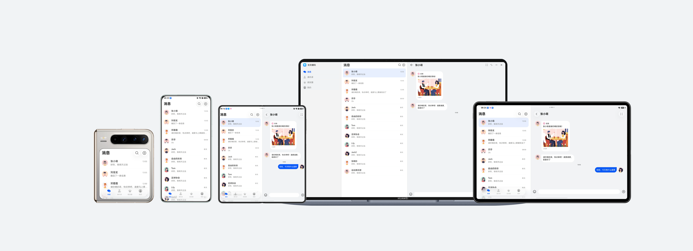

# 多设备即时通讯界面

更新时间：2026-05-22 09:46:30

来源：https://developer.huawei.com/consumer/cn/doc/best-practices/multi-communication-app

#### 概述

本文从当前常见的多设备应用场景中，选取即时通讯行业应用作为典型案例，详细介绍”一多”在实际开发中的应用。
 
即时通讯应用的核心功能是用户交互，主要功能模块包含对话聊天、通讯录和社交圈等交互功能。开发者在开发”一多”应用时，经常面临多端适配问题。本文针对即时通讯应用的常见多端适配问题，提供解决方案。
 
应用当前已适配的设备包括：直板机、双折叠（Mate X系列）、三折叠、阔折叠、平板和电脑。
 
> [!NOTE]
> 阅读本文前，开发者需熟悉 ArkUI（方舟UI框架） 和 一次开发，多端部署概览 相关知识。

 
下文将从UX设计、工程管理、页面开发三个角度，介绍即时通讯应用在多设备开发中的最佳实践。
 
- [UX设计](#section18771832172516)：介绍即时通讯应用的交互逻辑和通用设计要点，对于类似的设计要点，开发者可以直接参考。
- [工程管理](#section73711812196)：推荐“一多”项目采用分层架构，明确各层逻辑。同时，介绍即时通讯应用适用的三层架构配置。
- [移动端页面](#section202931220101020)和[电脑端页面](#section5748352172710)：遵循实际应用开发流程，以页面为基本单元，逐项讲解各页面在窗口适配、页面开发的设计思路与实现方法。

 
 

#### UX设计

即时通讯应用的UX设计可参考社交通讯类多设备响应式设计指南的[社交通讯类](https://developer.huawei.com/consumer/cn/doc/design-guides/responsive-design-examples2-0000001793536901)章节，设计参考图如下所示。
 



 
 

#### 工程管理

考虑到“一多”工程代码的复用性和可维护性，推荐开发者使用分层架构组织代码工程。分层架构将项目工程划分为产品定制层（products）、基础特性层（features）和公共能力层（common）三个层级，各层级权责明确且功能独立，为开发者提供了一套清晰、高效且可扩展的设计架构。关于分层架构的具体设计细节，可参考[分层架构设计](https://developer.huawei.com/consumer/cn/doc/best-practices/bpta-layered-architecture-design)。
 
 

#### 创建工程

建议开发者参考[多设备工程部署与发布](https://developer.huawei.com/consumer/cn/doc/best-practices/bpta-multi-device-ide)相关内容，掌握分层架构工程的创建与配置方法后，创建出模板项目工程。然后根据即时通讯应用的开发需求进行针对性修改，确保工程架构贴合实际业务需求。
 
 

#### 工程结构

即时通讯应用根据推荐的分层架构按照products、features、common三个层级组织代码工程。每个层级的设计如下：
 
- products层：即时通讯应用需要适配的设备包括直板机、双折叠（Mate X系列）、三折叠、阔折叠、平板和电脑。由于电脑设备的界面布局与其他设备差异较大，因此在products层单独创建名称为“pc”的HAP包作为电脑端的应用入口；而直板机、双折叠（Mate X系列）、三折叠、阔折叠和平板设备上的界面布局整体相似，部分差异可以通过“一多”的[自适应布局](https://developer.huawei.com/consumer/cn/doc/best-practices/bpta-multi-device-adaptive-layout)和[响应式布局](https://developer.huawei.com/consumer/cn/doc/best-practices/bpta-multi-device-responsive-layout)进行适配，因此在products层创建一个名称为“default”的HAP包作为这些设备的应用入口。
- features层：即时通讯应用主要包含三个核心业务模块，分别是消息（message）、社交（social）和用户详情（user）。在features层为三个业务模块分别创建对应的HAR包，供products层按需引用。三个业务模块相对独立，互不依赖，便于后续维护与迭代。
- common层：为实现代码复用、减少冗余，在common层集中存放公共常量、路由跳转工具以及窗口管理工具等需要被多个模块共用的基础能力，供其他模块统一调用。

 
工程结构如下：
 
```text
├──common
│  └──commonmultidevicecommunication                                     
│     └──src/main
│        ├──ets
│        │  ├──constants                      // 公共常量定义
│        │  ├──model                          // 公共model定义
│        │  ├──utils                          // 工具类
│        │  └──view                           // feature公共业务组件
│        └──resources                         // 公共资源
├──features                                   
│  ├──commonui                                // products公共业务组件模块
│  │  └──src/main
│  │     ├──ets
│  │     │  └──view                           // products公共业务组件
│  │     └──resources                         // 静态路由表资源
│  ├──message                                 // 消息模块
│  │  └──src/main
│  │     ├──ets
│  │     │  ├──model                          // 消息模块数据模型
│  │     │  ├──view                           // 消息模块组件
│  │     │  └──viewmodel                      // 消息模块视图模型
│  │     └──resources                         // 消息模块资源
│  ├──social                                  // 社交模块
│  │  └──src/main
│  │     ├──ets
│  │     │  ├──model                          // 社交模块数据模型
│  │     │  ├──view                           // 社交模块组件
│  │     │  └──viewmodel                      // 社交模块视图模型
│  │     └──resources                         // 社交模块资源
│  └──user                                    // 个人主页模块
│     └──src/main
│        ├──ets
│        │  ├──model                          // 个人主页模块数据模型
│        │  ├──view                           // 个人主页模块组件
│        │  └──viewmodel                      // 个人主页模块视图模型
│        └──resources                         // 个人主页模块资源
└──products                                    
  ├──default                                  // 手机/平板设备
  │  └──src/main
  │     ├──ets
  │     │  ├──entryability                    // 入口类
  │     │  ├──entrybackupability              // 应用数据备份恢复自定义拓展类
  │     │  └──pages                           // 入口页面
  │     └──resources                          // 资源文件
  └──pc                                       // PC设备
    └──src/main
       ├──ets
       │  ├──pages                           // 入口页面
       │  ├──pcability                       // 入口类
       │  └──pcbackupability                 // 应用数据备份恢复自定义拓展类
       └──resources                          // 资源文件
```
 
 

#### 移动端页面

本章介绍如何针对直板机、双折叠（Mate X系列）、三折叠、阔折叠和平板设备上的即时通讯应用，使用“一多”布局能力，实现页面层级“一套代码、多端适配”的目标。同时，介绍这些设备上的窗口适配方案。
 
 

#### 窗口适配

- 窗口模式适配设备支持全屏、分屏、悬浮窗和自由窗口模式，具体参见[窗口模式](https://developer.huawei.com/consumer/cn/doc/best-practices/bpta-multi-device-window-mode)。其中，分屏模式与悬浮窗通常无特殊设计，可通过系统方式进入。应用内监听窗口尺寸变化，[通过断点刷新UI](https://developer.huawei.com/consumer/cn/doc/best-practices/bpta-multi-device-responsive-layout#section175001836203617)，即可自动适配全屏、分屏、悬浮窗、自由窗口模式下的布局。
- 窗口方向可以通过[window.setPreferredOrientation()](https://developer.huawei.com/consumer/cn/doc/harmonyos-references/arkts-apis-window-window#setpreferredorientation9)设置窗口方向显示类型。窗口方向包含四种类型，分别是竖屏、横屏、反向竖屏和反向横屏。相关内容可参考[窗口方向](https://developer.huawei.com/consumer/cn/doc/best-practices/bpta-multi-device-window-direction)。在即时通讯应用中，通过module.json5配置文件，建议设置为FOLLOW_DESKTOP。
- 窗口沉浸式根据UX设计，需要实现不同窗口模式（全屏、分屏、悬浮窗、自由窗口）下的沉浸式效果，可参考[窗口沉浸式](https://developer.huawei.com/consumer/cn/doc/best-practices/bpta-multi-device-window-immersive)。推荐开发者使用组件级的沉浸方案[实现沉浸效果](https://developer.huawei.com/consumer/cn/doc/best-practices/bpta-multi-device-window-immersive#section180431120426)，同时需要进行动态安全区避让，确保沉浸式显示效果。自由窗口模式下使用[window.setWindowDecorVisible(false)](https://developer.huawei.com/consumer/cn/doc/harmonyos-references/arkts-apis-window-window#setwindowdecorvisible11)设置隐藏标题栏，仅保留右上角三键。此时，应用页面拓展至标题栏区域，实现沉浸式显示效果。

 
 

#### 消息页

即时通讯应用消息页主要用于展示消息列表、消息详情，满足用户聊天需求。根据功能设计，将消息页相关内容划分为5个区域，效果如下：
  
| 横向断点 | sm | md | lg |
| --- | --- | --- | --- |
| 消息页 |  |  |  |
 
 
**界面开发**
 
具体介绍及实现方案如下表所示：
  
| 区域编号 | 简介 | 实现方案 |
| --- | --- | --- |
| 1 | 顶部标题栏 | 使用响应式组件HdsNavDestination设置titleBar属性实现。在不同的设备宽度下组件自适应占满一屏。 |
| 2 | 消息列表 | 使用响应式组件List实现。通过响应式环境变量监听窗口尺寸布局断点（windowsizelayoutbreakpointinfo）变化，动态调整列表边距。 |
| 3 | 底部导航栏 | 使用响应式组件HdsTabs实现。通过barFloatingStyle属性设置页签悬浮样式。 |
| 4 | 消息详情 | 使用响应式组件Scroll实现。通过设置layoutWeight属性，当设备高度小于内容高度时，可滑动查看消息信息。 |
| 5 | 消息输入区域 | 使用沿水平方向布局容器组件Row嵌套媒体组件image实现。通过设置layoutWeight属性，消息输入框在不同断点下自适应拉伸。 |
| 6 | PC设备左侧导航栏 | 使用侧边栏容器SideBarContainer实现。通过设置showSideBar属性，确保侧边栏固定显示。 |
 
 
 

#### 通讯录页

即时通讯应用通讯录页主要用于展示通讯录列表、联系人主页，满足查看联系人需求。根据功能设计，将通讯录页相关内容划分为5个区域，效果如下：
  
| 横向断点 | sm | md | lg |
| --- | --- | --- | --- |
| 通讯录页 |  |  |  |
 
 
**界面开发**
 
具体介绍及实现方案如下表所示：
  
| 区域编号 | 简介 | 实现方案 |
| --- | --- | --- |
| 1 | 顶部标题栏 | 使用响应式组件HdsNavDestination设置titleBar属性实现。在不同的设备宽度下组件自适应占满一屏。 |
| 2 | 搜索栏 | 使用沿水平方向布局容器组件Row实现。通过设置layoutWeight属性，搜索框在不同断点下自适应拉伸。通过监听断点变化，实现响应式排列。 |
| 3 | 通讯录列表 | 使用堆叠容器Stack嵌套响应式组件List和AlphabetIndexer实现。通过监听断点变化，动态调整列表边距。 |
| 4 | 底部导航栏 | 使用响应式组件HdsTabs实现。通过barFloatingStyle属性设置页签悬浮样式。 |
| 5 | 联系人主页 | 使用响应式组件Scroll嵌套网格容器Grid实现。通过Grid的aspectRatio约束和设置image组件objectFit，使得Grid保持3列并横向自适应一屏。 |
 
 
 

#### 朋友圈页

即时通讯应用朋友圈页主要用于展示朋友圈列表，满足查看朋友动态分享的需求。根据功能设计，将朋友圈页相关内容划分为4个区域，效果如下：
  
| 横向断点 | sm | md | lg |
| --- | --- | --- | --- |
| 朋友圈页 |  |  |  |
 
 
**界面开发**
 
具体介绍及实现方案如下表所示：
  
| 区域编号 | 简介 | 实现方案 |
| --- | --- | --- |
| 1 | 顶部标题栏 | 使用响应式组件HdsNavDestination设置titleBar属性实现。在不同的设备宽度下组件自适应占满一屏。 |
| 2 | 朋友圈列表 | 使用响应式组件List嵌套网格容器Grid实现。通过Grid的aspectRatio约束和设置image组件objectFit，使得Grid保持3列并横向自适应一屏。 |
| 3 | 底部导航栏 | 使用响应式组件HdsTabs实现。通过barFloatingStyle属性设置页签悬浮样式。 |
 
 
 

#### 电脑端页面

本章介绍如何基于现有移动端界面开发方案，实现布局复用，高效完成电脑设备上即时通讯应用的界面开发。
 
 

#### 消息页

即时通讯应用消息页主要用于展示消息列表、消息详情，满足用户聊天需求。根据功能设计，将消息页相关内容划分为5个区域，效果如下：
 


 
**界面开发**
 
具体介绍及实现方案如下表所示：
  
| 区域编号 | 简介 | 实现方案 |
| --- | --- | --- |
| 1 | 顶部标题栏 | 复用移动端设备布局方案，同移动端消息页对应区域的布局实现方案一致。 |
| 2 | 消息列表 | 复用移动端设备布局方案，同移动端消息页对应区域的布局实现方案一致。 |
| 3 | 消息详情 | 复用移动端设备布局方案，同移动端消息页对应区域的布局实现方案一致。 |
| 4 | 消息输入区域 | 复用移动端设备布局方案，同移动端消息页对应区域的布局实现方案一致。 |
| 5 | PC设备左侧导航栏 | 使用侧边栏容器SideBarContainer实现。通过设置showSidebar属性，确保侧边栏固定显示。 |
 
 
 

#### 通讯录页

即时通讯应用通讯录页主要用于展示通讯录列表、联系人主页，满足查看联系人需求。根据功能设计，将通讯录页相关内容划分为5个区域，效果如下：
 


 
**界面开发**
 
具体介绍及实现方案如下表所示：
  
| 区域编号 | 简介 | 实现方案 |
| --- | --- | --- |
| 1 | 顶部标题栏 | 复用移动端设备布局方案，同移动端通讯录页对应区域的布局实现方案一致。 |
| 2 | 搜索栏 | 复用移动端设备布局方案，同移动端通讯录页对应区域的布局实现方案一致。 |
| 3 | 通讯录列表 | 复用移动端设备布局方案，同移动端通讯录页对应区域的布局实现方案一致。 |
| 4 | 联系人主页 | 复用移动端设备布局方案，同移动端通讯录页对应区域的布局实现方案一致。 |
| 5 | PC设备左侧导航栏 | 使用侧边栏容器SideBarContainer实现。通过设置showSideBar属性，确保侧边栏固定显示。 |
 
 
 

#### 朋友圈页

即时通讯应用朋友圈页主要用于展示朋友圈列表，满足查看朋友动态分享的需求。根据功能设计，将朋友圈页相关内容划分为4个区域，效果如下：
 


 
**界面开发**
 
具体介绍及实现方案如下表所示：
  
| 区域编号 | 简介 | 实现方案 |
| --- | --- | --- |
| 1 | PC设备左侧导航栏 | 使用侧边栏容器SideBarContainer实现。通过设置showSidebar属性，确保侧边栏固定显示。 |
| 2 | 系统自由多窗操作栏 | 使用window.setWindowDecorVisible(false)设置隐藏标题栏，仅保留右上角三键。 |
| 3 | 朋友圈列表 | 复用移动端设备布局方案，同移动端朋友圈页对应朋友圈列表布局实现方案一致。 |
 
 
 

#### 示例代码

- [多设备即时通讯界面](https://gitcode.com/HarmonyOS_Samples/MultiDeviceCommunication)
