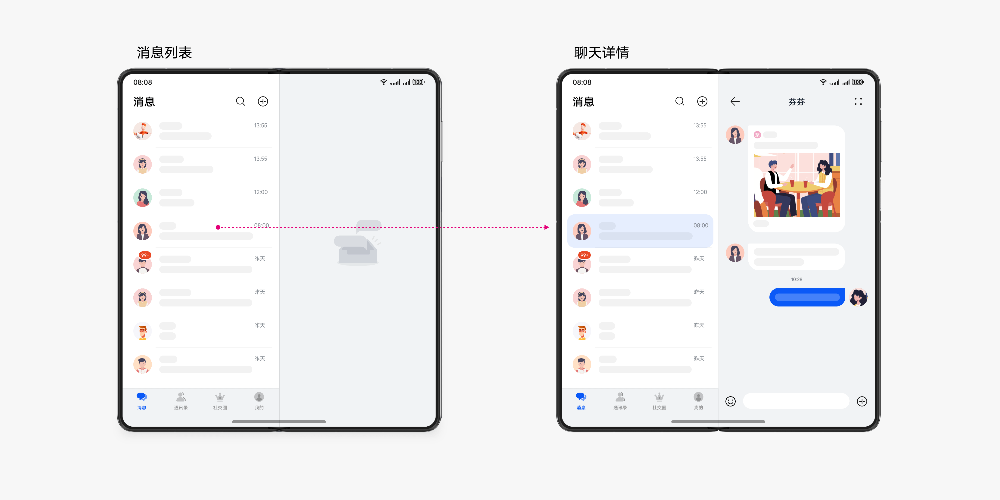

# 多设备即时通讯界面

更新时间：2026-03-26 08:46:30

来源：https://developer.huawei.com/consumer/cn/doc/best-practices/multi-communication-app

## 概述


本文从目前流行的垂类市场中，选择即时通讯应用作为典型案例详细介绍"一多"在实际开发中的应用。一多（一次开发多端部署）即时通讯应用的核心功能是用户交互，主要包含对话聊天、通讯录和社交圈等交互功能。开发者在开发“一多”应用时，经常会遇到多端适配的问题。本文针对即时通讯应用的常见多端适配问题，提供推荐解决方案。

- 聊天场景如何进行[页面开发](#section10532313132614)


当前系统支持的产品形态包括手机、折叠屏、平板。下文的具体实践将围绕这三种产品形态展开，从UX设计和页面开发两个角度提供符合“一多”的参考样例，并介绍“一多”即时通讯应用在开发过程中的最佳实践。

- [架构设计](#section73711812196)章节介绍一多项目的三层架构，开发者可以去相关链接了解。
- [UX设计](#section18771832172516)章节介绍即时通讯应用的聊天场景的交互逻辑，对于类似的设计要点，开发者可以直接拿来使用。
- [页面开发](#section10532313132614)章节主要介绍聊天场景的布局能力，介绍如何实现聊天场景，如何适配多设备。


> [!NOTE]
> 阅读本文前，开发者需熟悉[ArkUI（方舟UI框架）](https://developer.huawei.com/consumer/cn/doc/harmonyos-guides/arkui)和页面开发的“一多”能力（参考[一次开发，多端部署概览](https://developer.huawei.com/consumer/cn/doc/best-practices/bpta-multi-device-overview)）。下文将详细介绍它们在“一多”开发实践中如何使用。


## 架构设计


HarmonyOS的分层架构包括产品定制层、基础特性层和公共能力层，为开发者提供清晰、高效、可扩展的设计架构。更多详情请参考分层架构设计。


## UX设计


即时通讯应用包含聊天、通讯录和社交圈等交互功能。聊天页采用分栏布局设计，以下为聊天页的业务逻辑。





一多即时通讯场景包含以下设计能力：侧边导航、分栏。


## 页面开发


以聊天页为典型页面进行展开，聊天页中包含侧边导航与分栏布局的设计能力，本文着重介绍聊天页如何实现分栏布局。


### 布局能力


聊天页在不同断点下的UX效果如下，涉及的设计能力是侧边导航，分栏布局。侧边导航参考侧边导航，其中会有详细介绍。

在sm断点（手机/折叠屏折叠状态）需页面跳转，md/lg断点（折叠屏展开/平板）支持分栏布局。为了提高操作便捷性，在IM对话页面中使用分栏布局实现对话功能。

示意图如下：


| 示意图 | sm | md | lg |
| --- | --- | --- | --- |
| 设计能力点 |  |  |  |
| 效果图 |  |  |  |


在sm断点下，显示聊天列表页，点击某条聊天记录时跳转到聊天详情页面；在md和lg断点下，左侧显示聊天列表页，右侧显示聊天详情页。

在多端部署场景下，Navigation组件能够根据窗口大小自动适配。当窗口较大时，Navigation组件会自动切换为分栏展示效果。因此，本文中的分栏布局使用Navigation组件实现。

各个设备布局图如下所示：


| 示意图 | sm | md | lg |
| --- | --- | --- | --- |
| 效果图 | 参照上文表格 |  |  |
| 布局图 |  |  |  |


在Navigation组件中，定义了对话列表。出于封装的考虑，页面中不会使用NavRouter组件进行路由跳转，而是使用NavPathStack栈进行路由处理。因此，定义了pageInfo用于存储路由栈。当点击对话列表中的一条对话信息时，会向pageInfo中推送跳转路由。关系如下：
```text
Navigation(this.pageInfo) {
if (this.currentPageIndex === 0) {
Flex({ direction: FlexDirection.Column, justifyContent: FlexAlign.Center }) {
ConversationList({
currentConversationUserName: $currentConversationUserName,
currentContactUserName: $currentContactUserName
})
.flexGrow(1)
.width('100%')
HomeTab({ currentPageIndex: $currentPageIndex })
.width(Adaptive.HomeTabWidth(this.currentBreakpoint))
.height(Adaptive.HomeTabHeight(this.currentBreakpoint))
.visibility(this.currentBreakpoint !== 'lg' ? Visibility.Visible : Visibility.None)
}
.padding({
bottom: deviceInfo.deviceType !== 'tablet' && this.currentBreakpoint !== 'lg' ? '28vp' : '0vp'
})
.height('100%')
} else if (this.currentPageIndex === 1) {
Flex({ direction: FlexDirection.Column, justifyContent: FlexAlign.Center }) {
ContactsList({
currentContactUserName: $currentContactUserName,
currentConversationUserName: $currentConversationUserName,
currentContactUserIcon: $currentContactUserIcon
})
.flexGrow(1)
.width('100%')
HomeTab({ currentPageIndex: $currentPageIndex })
.width(Adaptive.HomeTabWidth(this.currentBreakpoint))
.height(Adaptive.HomeTabHeight(this.currentBreakpoint))
.visibility(this.currentBreakpoint !== 'lg' ? Visibility.Visible : Visibility.None)
}
.height('100%')
.padding({
bottom: deviceInfo.deviceType !== 'tablet' && this.currentBreakpoint !== 'lg' ? '28vp' : '0vp'
})
}
}
```


```text
List() {
ForEach(ConversationListData, (item: ConversationDataInterface, index: number) => {
ListItem() {
Row(){
ConversationItem(item)
}
.onClick(() => {
if (this.pageInfo && this.pageInfo.size() > 1) {
this.pageInfo.pop();
}
this.pageInfo.pushPath({ name: 'ConversationDetail' });
this.currentConversationUserName = item.name;
this.currentContactUserName = '';
this.currentIndex = index;
})
.backgroundColor(this.currentIndex === index ? '#33D8D8D8' : Color.White)
}
.height(Adaptive.ContactItemHeight(this.currentBreakpoint))
}, (item: ConversationDataInterface, index: number) => index + JSON.stringify(item))
}
```

此外，需要注意 Navigation 的模式和宽度在不同设备上有所不同。具体代码如下：

```text
@Provide('pageInfo') pageInfo: NavPathStack = new NavPathStack();
// ...

@Builder
PageMap(name: string) {
if (name === 'ConversationDetail') {
ConversationDetail({ currentConversationUserName: this.currentConversationUserName, currentFeatureIndex: 1});
} else if (name === 'ConversationDetailNone') {
ConversationDetailNone();
} else if (name === 'ContactsDetail') {
ContactsDetail({
currentContactUserName: this.currentContactUserName,
currentContactUserIcon: this.currentContactUserIcon
});
} else {
ConversationDetailNone();
}
}

build() {
Column() {
/**
* Home and contacts page
*/
Flex() {
HomeTab({ currentPageIndex: $currentPageIndex })
.width(Adaptive.HomeTabWidth(this.currentBreakpoint))
.backgroundColor('#F1F3F5')
.padding({
top: '180vp',
bottom: '180vp',
left: '22vp'
})
.visibility(this.currentBreakpoint === 'lg' ? Visibility.Visible : Visibility.None)
Navigation(this.pageInfo) {
if (this.currentPageIndex === 0) {
Flex({ direction: FlexDirection.Column, justifyContent: FlexAlign.Center }) {
ConversationList({
currentConversationUserName: $currentConversationUserName,
currentContactUserName: $currentContactUserName
})
.flexGrow(1)
.width('100%')
HomeTab({ currentPageIndex: $currentPageIndex })
.width(Adaptive.HomeTabWidth(this.currentBreakpoint))
.height(Adaptive.HomeTabHeight(this.currentBreakpoint))
.visibility(this.currentBreakpoint !== 'lg' ? Visibility.Visible : Visibility.None)
}
.padding({
bottom: deviceInfo.deviceType !== 'tablet' && this.currentBreakpoint !== 'lg' ? '28vp' : '0vp'
})
.height('100%')
} else if (this.currentPageIndex === 1) {
Flex({ direction: FlexDirection.Column, justifyContent: FlexAlign.Center }) {
ContactsList({
currentContactUserName: $currentContactUserName,
currentConversationUserName: $currentConversationUserName,
currentContactUserIcon: $currentContactUserIcon
})
.flexGrow(1)
.width('100%')
HomeTab({ currentPageIndex: $currentPageIndex })
.width(Adaptive.HomeTabWidth(this.currentBreakpoint))
.height(Adaptive.HomeTabHeight(this.currentBreakpoint))
.visibility(this.currentBreakpoint !== 'lg' ? Visibility.Visible : Visibility.None)
}
.height('100%')
.padding({
bottom: deviceInfo.deviceType !== 'tablet' && this.currentBreakpoint !== 'lg' ? '28vp' : '0vp'
})
}
}
.hideTitleBar(true)
.hideToolBar(true)
.navBarWidth(this.currentBreakpoint === 'lg' ? '44.5%' : '50%')
.navDestination(this.PageMap)
.mode(this.currentBreakpoint === 'sm' ? NavigationMode.Stack : NavigationMode.Split)
.width('100%')
}
.visibility(this.currentPageIndex === 0 || this.currentPageIndex === 1 ? Visibility.Visible : Visibility.None)

// ...
}
// ...
}
```

```text
@Component
export struct ConversationList {
@StorageProp('currentBreakpoint') currentBreakpoint: string = 'sm';
@Link currentConversationUserName: Resource;
@Link currentContactUserName: string;
@State private currentIndex: number = 0;
@Consume('pageInfo') pageInfo: NavPathStack;

build() {
Flex({ direction: FlexDirection.Column }) {
HomeTopSearch(HomeConstants.CONVERSATION_TITLE, this.currentBreakpoint)
List() {
ForEach(ConversationListData, (item: ConversationDataInterface, index: number) => {
ListItem() {
Row(){
ConversationItem(item)
}
.onClick(() => {
if (this.pageInfo && this.pageInfo.size() > 1) {
this.pageInfo.pop();
}
this.pageInfo.pushPath({ name: 'ConversationDetail' });
this.currentConversationUserName = item.name;
this.currentContactUserName = '';
this.currentIndex = index;
})
.backgroundColor(this.currentIndex === index ? '#33D8D8D8' : Color.White)
}
.height(Adaptive.ContactItemHeight(this.currentBreakpoint))
}, (item: ConversationDataInterface, index: number) => index + JSON.stringify(item))
}
.padding({
bottom: deviceInfo.deviceType !== 'tablet' && this.currentBreakpoint === 'lg' ? '28vp' : '0vp'
})
.backgroundColor(Color.White)
.width('100%')
.height('100%')
}
.height('100%')
.width('100%')
}
}
```


```text
@Component
export struct ConversationDetail {
@StorageProp('currentBreakpoint') currentBreakpoint: string = 'sm';
@Prop currentConversationUserName: string;
@Prop currentFeatureIndex: number;
@Consume('pageInfo') pageInfo: NavPathStack;

build() {
NavDestination() {
Flex({ direction: FlexDirection.Column }) {
ConversationDetailTopSearch({ currentConversationUserName: $currentConversationUserName, })
.height(Adaptive.ContactItemHeight(this.currentBreakpoint))
ConversationDetailItem({
receivedName: $currentConversationUserName,
isReceived: true,
content: $r('app.string.FF_take_tea'),
isAppletMsg: true,
currentFeatureIndex: $currentFeatureIndex
})
ConversationDetailItem({
receivedName: $currentConversationUserName,
isReceived: true,
content: $r('app.string.Speed'),
currentFeatureIndex: $currentFeatureIndex
})
ConversationDetailItem({
receivedName: $currentConversationUserName,
isReceived: false,
content: $r('app.string.happy_thing'),
currentFeatureIndex: $currentFeatureIndex
})
Blank()
ConversationDetailBottom()
}
.height('100%')
.width('100%')
.backgroundColor($r('app.color.background_color_grey'))
.padding({
bottom: deviceInfo.deviceType !== 'tablet' ? '28vp' : '0vp'
})
}
.hideTitleBar(true)
}
}
```


### 交互归一


系统已为不同类型的智能设备适配了相应的交互方式，实现了交互归一，因此，开发者无需额外关注用户的不同交互方式。

本场景中的交互归一方式如下（以触控屏为例）：

1、单指点击对应组件。

2、单指滑动List和Scroll组件。

3、走焦（详情请参考走焦规范）。


## 示例代码


- [多设备即时通讯界面](https://gitcode.com/harmonyos_codelabs/MultiDeviceCommunication)
