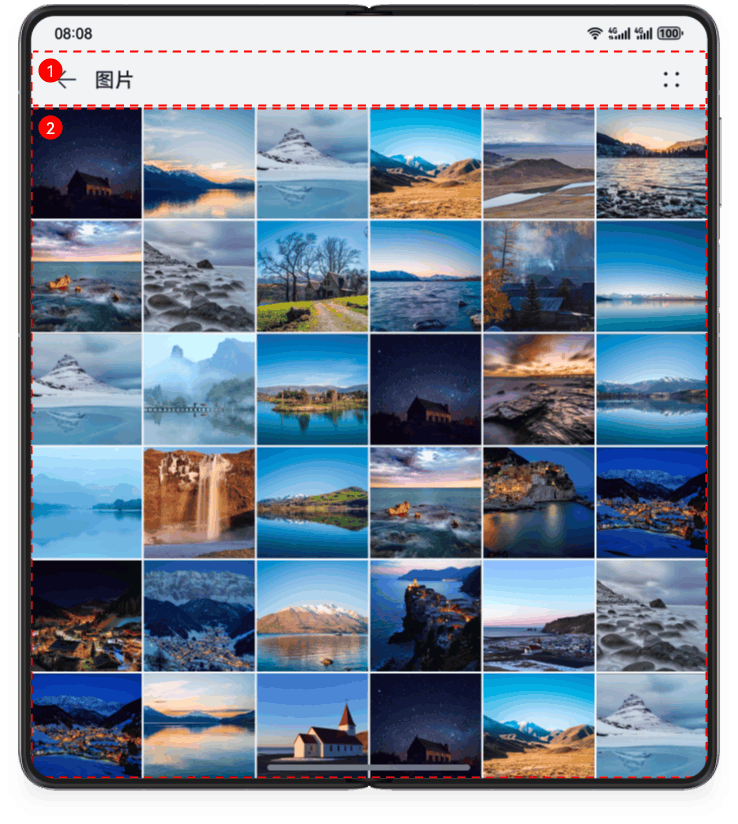
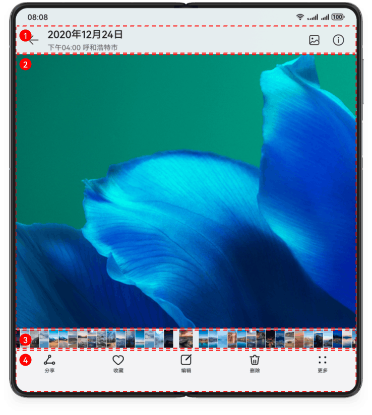
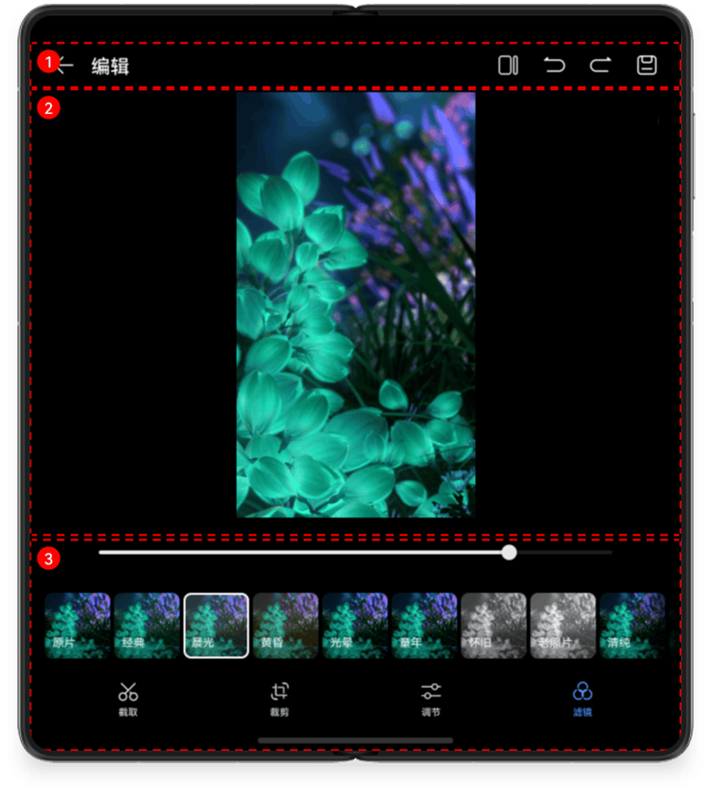

# 多设备图片美化界面

更新时间：2026-03-26 08:46:30

来源：https://developer.huawei.com/consumer/cn/doc/best-practices/multi-picture-app

## 概述


本文从目前流行的垂类市场中，选择图片美化应用作为典型案例详细介绍“一多”在实际开发中的应用。一多图片美化应用包含相册，大图预览，图片编辑功能。

本文的重点内容包括：

- [根据宽度自适应相册列数](#section12641735489)
- [双指缩放控制图片缩放](#section255214446101)


当前系统的产品形态包括手机、折叠屏、平板三种。本文从UX设计、架构设计和页面开发三个角度，提供符合“一多”设计原则的参考样例，介绍“一多”图片美化应用在开发过程中的最佳实践。

- [UX设计](#section206991621369)章节介绍图片美化应用的交互逻辑，类似的设计要点可以直接应用于其他项目。
- [架构设计](#section171321517134515)章节介绍一多项目的三层架构，开发者可以去相关文章或章节了解。
- [页面开发](#section12641735489)章节主要介绍图片美化三个页面的布局设计及如何实现。


> [!NOTE]
> 阅读本文前，开发者需熟悉[ArkUI（方舟UI框架）](https://developer.huawei.com/consumer/cn/doc/harmonyos-guides/arkui)和页面开发的“一多”能力（参考[一次开发，多端部署概览](https://developer.huawei.com/consumer/cn/doc/best-practices/bpta-multi-device-overview)）。下文将详细介绍它们在“一多”开发实践中如何使用。


## UX设计


本示例中的图片美化应用包含相册、大图预览、图片编辑页面。详细的UX设计可以参考拍摄美化类设计。


## 架构设计


HarmonyOS的分层架构主要包括三个层次：产品定制层、基础特性层和公共能力层，为开发者构建了一个清晰、高效、可扩展的设计架构。更多详情请参考分层架构设计。


## 页面开发


本章介绍图片美化应用中如何使用“一多”布局能力，完成页面层级的代码编写和多端适配，同时介绍图片美化应用中的交互开发。


### 布局能力


本节介绍每个页面区域的具体布局能力，帮助开发者从零开始进行图片美化应用的开发。

相册

相册页显示所有图片。通过观察相册页在折叠屏上的UX设计图，可以进行如下设计：

- 相册页的两个基础区域及其实现方案如下图所示：





相册页的2个基础区域介绍及实现方案如下表所示：


| 区域编号 | 简介 | 实现方案 |
| --- | --- | --- |
| 1 | 顶部返回 | 使用[自适应布局](https://developer.huawei.com/consumer/cn/doc/best-practices/bpta-multi-device-adaptive-layout)实现左侧返回图标、文字以及右侧图标。 |
| 2 | 相册列表 | 使用[网格布局](https://developer.huawei.com/consumer/cn/doc/best-practices/bpta-multi-device-page-layout#section1373617413916)实现相册列表。 |


示意图如下：


| 示意图 | sm | md | lg |
| --- | --- | --- | --- |
| 效果图 |  |  |  |


当组件区域宽度变化时，可以通过onAreaChange() 获取组件的相关信息，并调整相册列数。

```text
Flex({ direction: FlexDirection.Column }) {
// ...
.onAreaChange((oldValue: Area, newValue: Area) => {
this.gridColumn = this.getGridColumn(newValue.width);
})
// ...
}
```

```ts
// Change the number of Grid columns based on the width of the Grid component.
getGridColumn(value: Length): number {
  return Math.floor(2 * ((parseInt(JSON.stringify(value)) / 360) - 1) + 4);
}
```

大图预览

大图预览显示一张图片。观察大图预览页在折叠屏上的用户体验设计图，可以进行以下设计：

- 将大图预览页划分为4个区域，效果图如下：





大图预览页的4个基础区域及其实现方案如下表所示：


| 区域编号 | 简介 | 实现方案 |
| --- | --- | --- |
| 1 | 顶部返回 | 使用[自适应布局](https://developer.huawei.com/consumer/cn/doc/best-practices/bpta-multi-device-adaptive-layout)实现左侧返回图标、文字以及右侧图标。 |
| 2 | 图片展示 | 使用[Image](https://developer.huawei.com/consumer/cn/doc/harmonyos-references/ts-basic-components-image)组件展示图片。 |
| 3 | 相册滚动展示 | 使用[List](https://developer.huawei.com/consumer/cn/doc/harmonyos-references/ts-container-list)实现相册滚动展示。 |
| 4 | 图片操作 | 使用[自适应布局](https://developer.huawei.com/consumer/cn/doc/best-practices/bpta-multi-device-adaptive-layout)实现图标自适应摆放。 |


示意图如下：


| 示意图 | sm | md | lg |
| --- | --- | --- | --- |
| 效果图 |  |  |  |


图片编辑

在折叠屏中，可以切换图片区域和编辑操作区域的位置。观察折叠屏上的图片编辑页UX设计图，可以这样设计：

- 图片编辑页划分为3个区域，效果图如下：





- 区域2与区域3使用[Flex](https://developer.huawei.com/consumer/cn/doc/harmonyos-references/ts-container-flex)组件实现左右摆放与上下摆放的切换


图片编辑的3个基础区域及其实现方案如下表所示：


| 区域编号 | 简介 | 实现方案 |
| --- | --- | --- |
| 1 | 顶部返回 | 使用[自适应布局](https://developer.huawei.com/consumer/cn/doc/best-practices/bpta-multi-device-adaptive-layout)实现左侧返回图标、文字以及右侧图标。 |
| 2 | 图片展示 | 使用[Image](https://developer.huawei.com/consumer/cn/doc/harmonyos-references/ts-basic-components-image)组件展示图片。 |
| 3 | 编辑操作栏 | 使用[Flex](https://developer.huawei.com/consumer/cn/doc/harmonyos-references/ts-container-flex)组件实现编辑操作栏的自适应摆放。 |


示意图如下：


| 示意图 | sm | md | lg |
| --- | --- | --- | --- |
| 效果图 |  |  |  |


### 交互开发


针对不同类型的智能设备，交互方式包括触摸屏、鼠标、触控板等。单独适配各种交互方式会增加开发工作量并产生大量重复代码。为了解决这一问题，我们统一了各种交互方式的API，实现了多设备交互。常见的交互方式有触屏事件、键鼠事件、焦点事件。图片美化涉及的交互主要为图片的缩放。

双指缩放

在触控屏和触控板上，使用双指捏合或张开可实现缩放功能。本文有两处提到双指缩放操作：

- 相册页，双指缩放控制相册中图片列数变更。可以参考[多设备长视频界面](https://developer.huawei.com/consumer/cn/doc/best-practices/multi-video-app#zh-cn_topic_0000001744653537_section3198710114717)。
- 大图预览页，双指缩放控制图片的宽高变更。双指缩放使用[PinchGesture()](https://developer.huawei.com/consumer/cn/doc/harmonyos-references/ts-basic-gestures-pinchgesture) API实现， 当触发双指缩放时，可以实时获取缩放比例参数，传入[scale()](https://developer.huawei.com/consumer/cn/doc/harmonyos-references/ts-universal-attributes-transformation#scale) API（控制组件缩放的API）即可调整图片的比例。
```ts
Row() {
  Column() {
    Image($r('app.media.photo'))
    .autoResize(true)
  }
}
// ...
.scale({ x: this.scaleValue, y: this.scaleValue, z: 1 })
.gesture(PinchGesture({ fingers: 2 })
.onActionUpdate((event: GestureEvent | undefined) => {
  if (event) {
    this.scaleValue = this.pinchValue * event.scale;
  }
})
.onActionEnd(() => {
  this.pinchValue = this.scaleValue;
}))
```


## 示例代码


- [多设备图片美化界面](https://gitcode.com/harmonyos_codelabs/MultiPictureBeautification)
