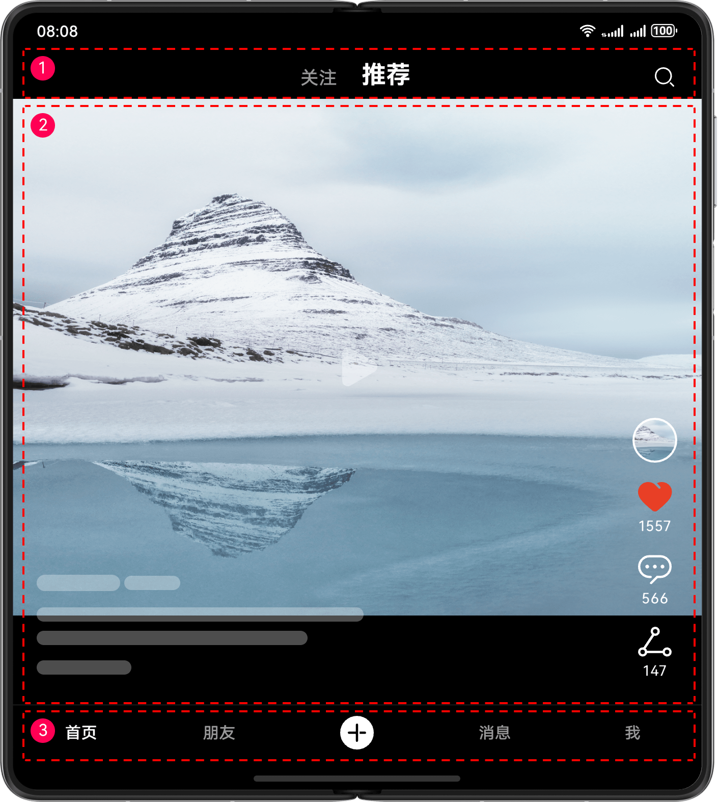

# 多设备短视频界面

更新时间：2026-07-14 02:11:31

来源：https://developer.huawei.com/consumer/cn/doc/best-practices/multi-short-video-app

#### 概述

本文从当前常见的多设备应用场景中，选取短视频行业应用作为典型案例，详细介绍“一多”在实际开发中的应用。
 
短视频应用的核心在于视频发布、浏览及用户互动；主要功能模块包括首页推荐、视频沉浸浏览、评论区详情和个人主页等。基于这些核心功能，本文选取推荐页、评论区和个人主页作为典型页面进行开发。开发过程遵循多设备的“差异性”、“一致性”、“灵活性”和“兼容性”原则，帮助开发者快速掌握“一多”开发能力，高效实现短视频应用的相关功能。
 
当前应用已适配的设备包括：直板机、双折叠（Mate X系列）、三折叠、阔折叠、平板、电脑、智慧屏和手表。
 
> [!NOTE]
> 在阅读本文前，建议开发者先了解 ArkUI（方舟UI框架） 和 一次开发，多端部署概览 相关知识。

 
下文将从UX设计、工程管理和页面开发三个角度，详细介绍短视频应用在实际开发中的最佳实践，为开发者提供可参考落地的思路。
 
- [UX设计](#zh-cn_topic_0000001744653537_section17797105112306)：介绍短视频应用的交互逻辑和通用设计要点，供同类短视频应用开发者直接参考
- [工程管理](#zh-cn_topic_0000001744653537_section189781175313)：推荐“一多”应用采用分层架构，通过清晰的目录结构组织工程，明确各层逻辑。同时，介绍短视频应用适用的架构配置。
- [移动端页面](#zh-cn_topic_0000001744653537_section7318163817529)、[电脑端页面](#section1415242321718)、[智慧屏页面](#section67231377369)和[智能穿戴页面](#section259716292206)：遵循实际应用开发流程，以页面为基本单元，详细讲解各页面在窗口适配、页面开发、交互开发及功能开发方面的设计思路与实现方法。

 
 

#### UX设计

短视频应用的UX设计可参考影音娱乐类多设备响应式设计指南的[短视频](https://developer.huawei.com/consumer/cn/doc/design-guides/responsive-design-examples1-0000001957369849#section286164710457)章节，设计参考图如下所示。
 



 
 

#### 工程管理

考虑到“一多”工程代码的复用性和可维护性，推荐开发者采用分层架构组织代码工程。分层架构将项目工程划分为产品定制层（products）、基础特性层（features）和公共能力层（common）三个层级，各层级权责清晰、职责明确，为开发者提供了一套清晰、高效且可扩展的设计架构。关于分层架构的具体设计细节，可参考[分层架构设计](https://developer.huawei.com/consumer/cn/doc/best-practices/bpta-layered-architecture-design)相关文档。
 
 

#### 创建工程

建议开发者参考[多设备工程部署与发布](https://developer.huawei.com/consumer/cn/doc/best-practices/bpta-multi-device-ide)相关内容，掌握分层架构工程的创建与配置方法，创建模板项目工程。根据短视频应用的开发需求进行针对性修改，确保工程架构贴合实际业务需求。
 
 

#### 工程结构

短视频应用采用分层推荐架构，将代码工程按products、features、common三个层级组织。各层级设计如下：
 
- products层：短视频应用需要适配的设备包括直板机、双折叠（Mate X系列）、三折叠、阔折叠、平板、电脑、智慧屏和手表。由于手表、电脑及智慧屏设备的界面布局与其他设备差异较大，因此在products层单独创建名称为“wearable”、“pc”及“tv”的HAP包，分别作为手表、电脑及智慧屏设备的应用入口；而直板机、双折叠（Mate X系列）、三折叠、阔折叠和平板设备上的界面布局整体相似，部分差异可通过“一多”[自适应布局](https://developer.huawei.com/consumer/cn/doc/best-practices/bpta-multi-device-adaptive-layout)和[响应式布局](https://developer.huawei.com/consumer/cn/doc/best-practices/bpta-multi-device-responsive-layout)进行适配，因此在products层创建一个名称为“default”的HAP包作为这些设备的应用入口。
- features层：短视频应用包含三个核心业务模块，分别为视频播放页（adaptive_video）、评论区（comment）和个人主页（individual）。在features层中，为各业务模块分别创建对应的HAR包，供products层按需引用。各业务模块相互独立，无依赖关系，便于后续维护与迭代。
- common层：为实现代码复用、减少冗余，在common层创建了一个基础（base）能力HAR包。该包集中存放了公共常量、断点工具、空白页组件、全局封装的导航组件、图文组件及窗口管理工具等需被多个模块共用的基础能力，供其他模块统一调用。

 
工程结构如下：
```ArkTS
├
├── common                                                 // 公共能力层
│   └── multishortvideobase
│       └── src
│           └── main
│               ├── ets
│               │   ├── components
│               │   │   ├── MSVEmptyComponent.ets          // 空页面公共组件
│               │   │   ├── MSVTabs.ets                    // Tabs公共组件
│               │   │   └── MSVTextIcon.ets                // 图文公共组件
│               │   ├── constants
│               │   │   └── CommonConstants.ets            // 公共常量
│               │   ├── model
│               │   │   └── MSVDataModel.ets               // 公共数据模型
│               │   └── utils
│               │       ├── AdaptiveImmersion.ets          // 以下为沉浸式相关算法文件
│               │       ├── ImmersionConstants.ets               
│               │       ├── ImmersionManager.ets                 
│               │       ├── ImmersionRules.ets                   
│               │       ├── Logger.ets                     // 打印日志
│               │       ├── WidthBreakpointType.ets        // 断点工具类
│               │       └── WindowUtil.ets                 // 窗口工具类
│               └── resources
├── features                                               // 基础特性层
│   ├── multishortvideoadaptivevideo                       // 视频播放层
│   │   └── src
│   │       └── main
│   │           ├── ets
│   │           │   ├── model
│   │           │   │   └── AvDataSourceModel.ets          // 视频播放数据模型
│   │           │   ├── view
│   │           │   │   ├── AdaptiveAVPlayer.ets           // 视频播放核心文件
│   │           │   │   └── AdaptiveVideo.ets              // 视频播放及控件层
│   │           │   └── viewModel
│   │           │       └── AvDataSourceViewModel.ets      // 视频播放数据
│   │           └── resources                              // 视频播放资源文件
│   ├── multishortvideocomment                             // 评论区
│   │   └── src
│   │       └── main
│   │           ├── ets
│   │           │   ├── model
│   │           │   │   ├── CommentDataModel.ets           // 评论区数据模型
│   │           │   │   └── ReplyDataModel.ets             // 评论区楼中楼回复数据模型
│   │           │   ├── view
│   │           │   │   └── Comment.ets                    // 评论区核心业务
│   │           │   └── viewmodel
│   │           │       └── CommentViewModel.ets           // 评论区数据
│   │           └── resources                              // 评论区资源文件
│   └── multishortvideoindividual                          // 个人作品页
│       └── src
│           └── main
│               ├── ets
│               │   ├── components
│               │   │   ├── Builders.ets                 
│               │   │   └── Individual.ets                 // 个人作品页
│               │   ├── model
│               │   │   └── WorksDataModel.ets             // 个人作品页数据模型
│               │   ├── view
│               │   │   ├── IndividualByRouter.ets         // 个人作品页路由
│               │   │   └── Works.ets                      // 个人作品页作品
│               │   └── viewmodel
│               │       ├── IndividualTabsViewModel.ets。  // 个人作品页数据
│               │       └── WorksViewModel.ets             // 作品数据
│               └── resources                              // 个人作品页资源文件
└── products                                               // 产品定制层
    ├── default                                            // 默认产品手机和平板
    │   └── src
    │       └── main
    │           ├── ets
    │           │   ├── components           
    │           │   │   ├── Builders.ets                   // 公共Builder
    │           │   │   └── SubTabsComponent.ets           // 子页签
    │           │   ├── defaultability
    │           │   │   └── MultiShortVideoDefaultAbility.ets
    │           │   ├── view
    │           │   │   ├── Index.ets                      // 主页
    │           │   │   └── SplitComment.ets               // 侧面板评论
    │           │   └── viewmodel
    │           │       ├── MainTabsViewModel.ets          // 主页签数据
    │           │       └── SubTabsViewModel.ets           // 子页签数据
    │           └── resources                              // 资源文件
    ├── pc                                                 // 电脑产品
    │   └── src
    │       └── main
    │           ├── ets
    │           │   ├── components
    │           │   │   └── Builders.ets                   // 公共Builder
    │           │   ├── model
    │           │   │   └── ContentParamsModel.ets         // 内容数据模型
    │           │   ├── pcability
    │           │   │   └── MultiShortVideoPcAbility.ets   // 默认入口
    │           │   ├── view
    │           │   │   ├── Index.ets                      // 主页
    │           │   │   └── SplitComment.ets               // 侧面板评论
    │           │   └── viewmodel
    │           │       └── MainTabsViewModel.ets          // 主页签数据
    │           └── resources                              // 资源文件
    ├── tv                                                 // 智慧屏产品
    │   └── src
    │       └── main
    │           ├── ets
    │           │   ├── components
    │           │   │   ├── Builders.ets                   // 公共Builder
    │           │   │   └── TvTabs.ets                     // 智慧屏Tabs
    │           │   ├── model
    │           │   │   └── ContentParamsModel.ets         // 内容数据模型
    │           │   ├── tvability
    │           │   │   └── MultiShortVideoTvAbility.ets   // 默认入口
    │           │   ├── view
    │           │   │   ├── Index.ets                      // 主页
    │           │   │   └── SplitComment.ets               // 侧面板评论
    │           │   └── viewmodel
    │           │       └── MainTabsViewModel.ets          // 主页签数据
    │           └── resources                              // 资源文件
    └── wearable                                           // 智慧穿戴产品
        └── src
            └── main
                ├── ets
                │   ├── components
                │   │   ├── Builders.ets                   // 公共Builder
                │   │   └── SubTabsComponent.ets           // 智慧屏Tabs
                │   ├── view
                │   │   └── Index.ets                      // 主页
                │   ├── viewmodel
                │   │   ├── MainTabsViewModel.ets          // 主页签数据
                │   │   └── SubTabsViewModel.ets           // 子页签数据
                │   ├── wearableability
                │   │   └── MultiShortVideoWearableAbility.ets
                └── resources                              // 资源文件
```
 
 
 

#### 移动端页面

本章介绍如何在直板机、双折叠（Mate X系列）、三折叠、阔折叠及平板设备上利用“一多”布局能力，优化短视频应用，以实现“一套代码、多端适配”的页面层级目标。同时，阐述上述设备的窗口适配方案，以及各页面的交互与功能开发方案。
 
 

#### 窗口适配

- 窗口模式适配设备支持全屏、分屏、悬浮窗和自由窗口模式，具体参见[窗口模式](https://developer.huawei.com/consumer/cn/doc/best-practices/bpta-multi-device-window-mode)。其中，分屏模式与悬浮窗无特殊设计，可通过系统方式进入。应用内监听窗口尺寸变化，[通过断点刷新UI](https://developer.huawei.com/consumer/cn/doc/best-practices/bpta-multi-device-responsive-layout#section175001836203617)，即可自动适配全屏、分屏、悬浮窗、自由窗口模式下的布局。
- 窗口方向在HAP包的module.json5文件中[abilities标签](https://developer.huawei.com/consumer/cn/doc/harmonyos-guides/module-configuration-file#abilities标签)下配置orientation属性为follow_desktop，详细信息参考窗口旋转中[其他方向类型](https://developer.huawei.com/consumer/cn/doc/harmonyos-guides/window-rotation#其他方向类型)的跟随桌面旋转模式。
- 窗口沉浸式根据UX设计，需实现不同窗口模式（全屏、分屏、悬浮窗、自由窗口）的沉浸式效果，可参考[窗口沉浸式](https://developer.huawei.com/consumer/cn/doc/best-practices/bpta-multi-device-window-immersive)方案。全屏、分屏和悬浮窗模式的沉浸式通过[window.setWindowLayoutFullscreen()](https://developer.huawei.com/consumer/cn/doc/harmonyos-references/arkts-apis-window-window#setwindowlayoutfullscreen9)实现。同时需进行动态安全区避以保证显示效果。自由窗口模式下使用[window.setWindowDecorVisible(false)](https://developer.huawei.com/consumer/cn/doc/harmonyos-references/arkts-apis-window-window#setwindowdecorvisible11)隐藏标题栏，仅保留右上角三键，使应用页面延展至标题栏区域实现沉浸式效果。

 
 

#### 首页

短视频应用首页主要用于快速浏览推送的短视频作品，满足用户观看需求。根据功能设计，将应用首页相关内容划分为4-5个区域，效果图如下：
 
  
| 横向（/纵向）断点 | sm/md | sm/lg | md | lg |
| --- | --- | --- | --- | --- |
| 首页-推荐页Tab |  |  |  |  |
 
 
**界面开发**
 
首页借助“一多”自适应布局的延伸能力、缩放能力和响应式布局的栅格系统，实现不同断点下的布局效果，具体介绍及实现方案如下表所示：
  
| 区域编号 | 简介 | 实现方案 |
| --- | --- | --- |
| 1 | 短视频播放区 | 使用响应式组件Swiper内嵌三方库adaptive_video实现。在不同断点下，视频自动沉浸式播放。 |
| 2 | 顶部页签及搜索框 | 使用Tabs组件及Image组件实现，图片固定在右侧，导航栏固定居中显示。 |
| 3 | 信息区及交互区 | 使用基础容器组件Row及Column嵌套组合，配合基础组件实现左侧作者及视频简介，右侧头像、点赞、评论及分享交互区。 |
| 4 | 音乐区 | 使用基础容器组件Column及Progress组件实现，宽度设置100%，自动横向撑满全屏。 |
| 5 | 底部页签 | 使用HdsTabs组件实现悬浮页签同时设置barFloatingStyle属性的systemMaterialEffect实现沉浸光感材质效果。 |
 
 

#### 评论页

短视频应用评论页主要用于用户互动，将应用评论页相关内容划分为3个区域，效果图如下：
  
| 横向（/纵向）断点 | sm/md | sm/lg | md | lg |
| --- | --- | --- | --- | --- |
| 评论页 |  |  |  |  |
 
 
**界面开发**
 
评论页在类直板机、折叠屏展开态及平板上的展示形式有所不同。在类直板机上，点击评论区按钮后，评论区以[半模态转场](https://developer.huawei.com/consumer/cn/doc/harmonyos-references/ts-universal-attributes-sheet-transition)方式从屏幕底部弹出；而在折叠屏展开态及平板上，采用[Navigation](https://developer.huawei.com/consumer/cn/doc/harmonyos-references/ts-basic-components-navigation)的分栏模式展示评论区，具体介绍及实现方案如下表所示：
  
| 区域编号 | 简介 | 实现方案 |
| --- | --- | --- |
| 1 | 标题区 | 类直板机使用半模态转场自带的标题区，其他类型设备使用Text组件及Image组件组合实现。 |
| 2 | 评论区 | 使用响应式组件List及Repeat循环渲染实现评论展示。 |
| 3 | 输入区 | 使用TextInput组件实现。通过layoutWeight属性实现自适应拉伸，确保在不同断点下均横向铺满屏幕。 |
 
 
 

#### 个人作品页

- 个人作品页

 
个人作品页主要用于展示作者的获赞、关注、作品量、朋友、个人简介及发布过的作品等信息。根据功能设计，个人作品页相关内容划分为2-3个区域，效果图如下：
  
| 横向（/纵向）断点 | sm/md | sm/lg | md | lg |
| --- | --- | --- | --- | --- |
| 个人作品页-切换页签进入 |  |  |  |  |
| 个人作品页-点击头像进入 |  |  |  |  |
 
 
**界面开发**
 
用户可通过点击头像或页签“我的”进入个人作品页。点击页签时，通过切换tabContent实现；点击头像时，在不同设备上的展示方式存在差异：类直板机采用路由跳转至新页面全窗口展示，折叠屏展开态及平板则使用[Navigation](https://developer.huawei.com/consumer/cn/doc/harmonyos-references/ts-basic-components-navigation)侧边面板分栏展示。页面布局通过在不同断点及入口条件下控制组件显示/隐藏，实现多设备适配。具体实现方案如下表所示：
 
**个人作品页**
 
  
| 区域编号 | 简介 | 实现方案 |
| --- | --- | --- |
| 1 | 账号信息及交互 | 不同断点交互按钮及账号信息的展示位置不同，通过点击头像进入个人作品页显示关闭按钮，通过页签点击我的进入个人作品页显示搜索及更多按钮。 |
| 2 | 作者简介 | 使用Text组件实现作者信息的展示。 |
| 3 | 作品区 | 使用网格容器Grid实现。通过columnsTemplate属性，动态调整不同断点下的显示列数。结合aspectRatio属性，实现视频预览图在不同断点下的自适应缩放。 |
 
 
> [!NOTE]
> 在md/lg断点下，点击头像从侧边面板分栏展示个人作品，并且不展示区域2的作者简介。

 

#### 电脑端页面

本章介绍如何基于现有移动端界面开发方案，实现代码逻辑与布局复用，高效完成电脑设备上短视频应用的界面开发。同时，详细阐述各页面交互开发的实现方案。
 
 

#### 首页

短视频应用首页主要为推荐精品短视频。根据功能设计，将应用首页相关内容划分为5个区域，效果图如下：
 
 


 

 
**界面开发**
 
电脑端首页的页签采用侧边栏布局，其他区域组件均引用features目录下的核心模块har包。
 
具体介绍及实现方案如下表所示：
  
| 区域编号 | 简介 | 实现方案 |
| --- | --- | --- |
| 1 | 短视频播放区 | 复用移动端界面，可参考移动端首页界面开发章节。 |
| 2 | 搜索框 | 使用Search组件固定在右侧实现搜索框。 |
| 3 | 信息区及交互区 | 使用基础容器组件Row及Column嵌套组合，配合基础组件实现左侧作者及视频简介，右侧头像、点赞、评论及分享交互区。 |
| 4 | 音乐区 | 使用基础容器组件Column及Progress组件实现，宽度设置百分百，自动横向撑满全屏。 |
| 5 | 侧边页签 | 使用SideBarContainer组件实现电脑端的侧边页签。 |
 
 
> [!NOTE]
> 电脑端页面因导航采用侧边页签设计，需进行单独适配。评论页及个人作品页均引用features目录下的核心模块har包，实现多端共用相同的核心模块代码。

 

#### 智慧屏页面

本章介绍如何基于现有移动端界面开发方案，实现代码逻辑与布局复用，高效完成智慧屏设备上短视频应用的界面开发。同时，详细阐述各页面交互开发的实现方案。
 
 

#### 首页

短视频应用首页主要推荐精选视频，满足用户观看需求。根据功能设计，将应用首页相关内容划分为4个区域，效果图如下：
 
 


 
**界面开发**
 
具体介绍及实现方案如下表所示：
  
| 区域编号 | 简介 | 实现方案 |
| --- | --- | --- |
| 1 | 短视频播放区 | 复用移动端界面，可参考移动端首页界面开发章节。 |
| 2 | 顶部页签及搜索框 | 使用repeat循环渲染及Image组件实现，搜索框固定在左侧，导航栏固定居中显示。 |
| 3 | 信息区及交互区 | 使用基础容器组件Row及Column嵌套组合，配合基础组件实现左侧作者及视频简介，右侧头像、点赞、评论及分享交互区。 |
| 4 | 音乐区 | 使用基础容器组件Column及Progress组件实现，宽度设置100%，自动横向撑满全屏。 |
 
 
> [!NOTE]
> 智慧屏页面仅需一级页签并悬浮于屏幕上方，因此需进行单独适配。评论页及个人作品页均引用features目录下的核心模块har包，以实现多端共用相同的核心模块代码。

 

#### 智能穿戴页面

本章介绍如何高效完成智能穿戴设备上短视频应用的界面开发。同时，详细阐述各页面交互开发的实现方案。
 
 

#### 首页

短视频应用首页主要推荐精选视频，满足用户观看需求。根据功能设计，将应用首页相关内容划分为4个区域，效果图如下：
 
 


 
**界面开发**
 
具体介绍及实现方案如下表所示：
  
| 区域编号 | 简介 | 实现方案 |
| --- | --- | --- |
| 1 | 短视频播放区 | 复用移动端界面，可参考移动端首页界面开发章节。 |
| 2 | 顶部页签 | 使用Tabs组件，导航栏固定居中显示。 |
| 3 | 信息区及交互区 | 使用基础容器组件Row及Column嵌套组合，配合基础组件实现左侧作者及视频简介，右侧点赞及评论交互区。 |
| 4 | 底部页签 | 使用Tabs组件，导航栏固定居中显示。 |
 
 

#### 示例代码

- [多设备短视频界面](https://gitcode.com/HarmonyOS_Samples/multi-short-video)
