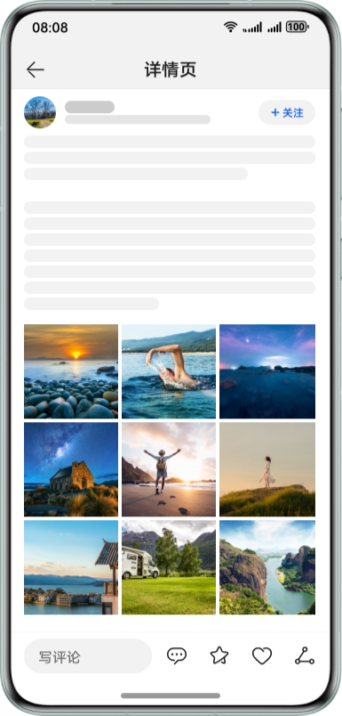
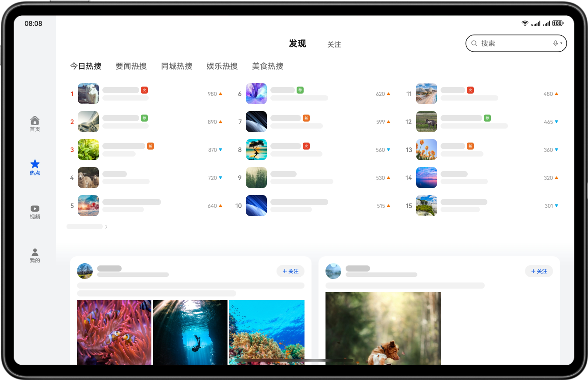
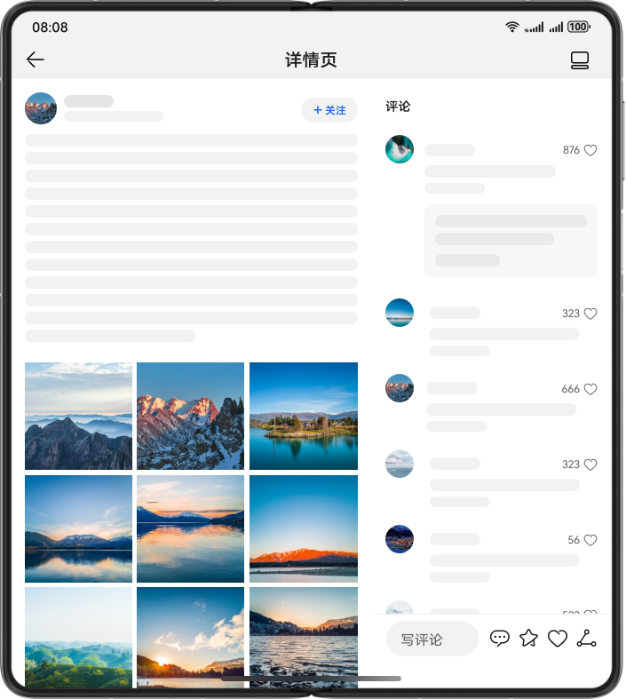

# 多设备社区评论界面

更新时间：2026-05-18 00:55:31

来源：https://developer.huawei.com/consumer/cn/doc/best-practices/multi-community-app

#### 概述

本文选择社区评论行业应用作为典型案例介绍“一多”在实际开发中的应用。社区评论应用的核心功能包括社区新闻浏览和热搜榜单查看。基于这些核心功能，案例实现了推荐热搜、热搜榜单、卡片详情、图片查看和输入评论等典型页面。文章重点介绍关键布局能力及对应实现。
 
> [!NOTE]
> 阅读本文前，开发者需熟悉 ArkUI（方舟UI框架） 和页面开发的“一多”能力（参考 一次开发，多端部署概览 ）。下文将详细介绍它们在“一多”开发实践中如何使用。

 
 

#### 架构设计

HarmonyOS的分层架构包括产品定制层、基础特性层和公共能力层，为开发者提供清晰、高效、可扩展的设计架构。更多详细请参考[分层架构设计](https://developer.huawei.com/consumer/cn/doc/best-practices/bpta-layered-architecture-design)。
 
 

#### UX设计

社交通讯类的多设备响应式设计指南，请参考[社交通讯类](https://developer.huawei.com/consumer/cn/doc/design-guides/responsive-design-examples2-0000001793536901)。
 
本章介绍社交通讯类应用中如何使用“一多”布局能力，完成页面层级的单页面和多端适配。下文将详细说明每个页面区域使用的具体布局能力，帮助开发者从零开始进行社交通讯类应用的开发。
 
热点页利用[响应式布局](https://developer.huawei.com/consumer/cn/doc/best-practices/bpta-multi-device-responsive-layout)中的[栅格](https://developer.huawei.com/consumer/cn/doc/best-practices/bpta-multi-device-responsive-layout#section1061332817545)布局能力，结合[WaterFlow](https://developer.huawei.com/consumer/cn/doc/harmonyos-references/ts-container-waterflow)容器，实现单列卡片变瀑布流卡片的一多布局能力。
 



 
在卡片详情页中，使用响应式布局的栅格布局，实现图文区域和评论区域的左右及上下布局，从而达到边看边评的图文阅读效果。
 



 
社区评论应用包含以下一多页面布局能力：侧边导航、[列表重复布局](#zh-cn_topic_0000001758831130_li118141522111817)、[动态卡片](#zh-cn_topic_0000001758831130_li1420045031813)、[边看边评](#zh-cn_topic_0000001758831130_li11692132514198)。侧边导航参考多设备长视频界面[首页](https://developer.huawei.com/consumer/cn/doc/best-practices/multi-video-app#section109591922155720)界面开发。
 
 

#### 页面开发

 

#### 布局能力

 
本章节选取页面关键区域进行布局能力介绍。
 
**热点页布局能力**
 
热点页提供搜索、热搜展示、信息阅读等功能，使用列表布局和动态卡片。
 



 
- 列表重复布局

 
竖向列表清晰明了地展示数据。在宽屏设备上，设计了列表重复布局以展示更多数据。
 
在进行有序数据展示时，使用[List](https://developer.huawei.com/consumer/cn/doc/harmonyos-references/ts-container-list)容器进行数据排列。通过设置List组件的布局方向listDirection和lanes属性并结合断点，实现在不同断点下显示不同列数。
  
| 示意图 | sm | md | lg |
| --- | --- | --- | --- |
| 设计能力点 |  |
| 效果图 |  |  |  |
 
 
```ArkTS
@Component
export struct HotColumnView {
  @StorageLink('currentBreakpoint') currentBreakpoint: string = 'sm';
  // ...

  @Builder
  HotListBuilder(index: number) {
    List() {
      ForEach(HOST_LIST_ARRAY[this.tab_index], (item: HotItemInterface) => {
        if (item.index > index * 5 && item.index <= (index + 1) * 5) {
          ListItem() {
            HotListItemView({
              item: item,
              showDetail: true,
              // ...
            })
          }
        }
      }, (item: HotItemInterface) => JSON.stringify(item))
    }
  }

  build() {
    Column() {
      Swiper() {
        ForEach([0, 1, 2], (item: number) => {
          this.HotListBuilder(item)
        }, (item: number) => JSON.stringify(item))
      }
      // ...
    }
    // ...
  }
}
```
 
- 动态卡片

 
信息卡片是显示内容的主体。使用竖向单列布局在宽屏设备上容易造成大量留白，影响视觉效果。在宽屏设备上展示两列布局可充实页面内容。瀑布流布局能紧密连接卡片，提供更紧凑的视觉效果。
 
动态卡片布局主要使用WaterFlow容器，在手机、折叠屏与平板设备间差异化显示。手机及折叠屏上竖向单列展示，通过分割线分隔卡片。平板设备上，WaterFlow容器显示2列，依赖断点控制。
  
| 示意图 | sm | md | lg |
| --- | --- | --- | --- |
| 设计能力点 |  |
| 效果图 |  |  |  |
 
 
```ArkTS
WaterFlow() {
  ForEach(this.cardArrayViewModel.cardArray, (item: CardItem, index: number) => {
    FlowItem() {
      Column() {
        MicroBlogView({
          cardItem: item,
          // ...
        })
        // ...

        CommentBarView({
          isShowInput: false,
          // ...
        })
      }
      // ...
    }
  }, (item: CardItem, index: number) => index + JSON.stringify(item))
}
.columnsTemplate(this.currentBreakpoint !== 'lg' ? '1fr' : '1fr 1fr')
```
 
**卡片详情区域**
 
卡片详情区域支持图文和评论在不同设备上显示上下或左右布局。
 


 
- 边看边评

 
为了优化图文内容和图片内容的展示效果，并支持同时浏览评论，在不同设备上进行了以下布局设计：手机采用上下布局，折叠屏支持内容区和评论区的上下及左右布局切换，平板设备固定为左右布局。
 
边看边评功能主要通过栅格布局实现。在手机设备上，图文区和评论区同时占满设备栅格，显示为图文区在上、评论区在下的布局。折叠屏的上下布局与左右布局切换使用控制栅格数量实现。左右布局控制图文区占用栅格数为3/5，评论区占用栅格数为2/5。修改图文区及评论区栅格数为5/5时，切换为上下布局。
 
在lg断点下为实现固定评论区宽度，使用[SideBarContainer](https://developer.huawei.com/consumer/cn/doc/harmonyos-references/ts-container-sidebarcontainer)容器重新构建页面布局。由于栅格布局与SideBarContainer容器无法兼容，使用断点分别控制两处实现的显示隐藏。
  
| 示意图 | sm | md | lg |
| --- | --- | --- | --- |
| 设计能力点 |  |
| 效果图 |  |  |  |
 
 
```ArkTS
@Component
export struct DetailPage {
  // ...
  build() {
    Stack() {
      Column() {
        DetailTitleView({ isShowedButton: this.isShowedButton })
        Scroll() {
          GridRow({ columns: { sm: 4, md: 5, lg: 12 } }) {
            GridCol({ span: { sm: 4, md: this.isFoldHorizontal ? 3 : 5, lg: 12 } }) {
              if ((this.isFoldHorizontal && this.currentBreakpoint === 'md')) {
                Scroll() {
                  MicroBlogView({
                    cardItem: this.cardItem,
                    index: this.selectCardIndex
                  })
                  // ...
                }
                // ...
              } else {
                MicroBlogView({
                  cardItem: this.cardItem,
                  index: this.selectCardIndex
                })
                // ...
              }
            }
            // ...

            GridCol({ span: { sm: 4, md: this.isFoldHorizontal ? 2 : 5, lg: 12 } }) {
              CommentListView()
            }
            // ...
          }
        }
        .visibility(this.currentBreakpoint === 'lg' ? Visibility.None : Visibility.Visible)
        // ...

        Column() {
          SideBarContainer() {
            Column() {
              CommentListView()
            }
            // ...

            Column() {
              Scroll() {
                MicroBlogView({
                  cardItem: this.cardItem,
                  index: this.selectCardIndex
                })
                // ...
              }
              // ...
            }
            .justifyContent(FlexAlign.Start)
          }
          // ...
        }
        .visibility(this.currentBreakpoint !== 'lg' ? Visibility.None : Visibility.Visible)
        // ...
      }
      // ...
    }
  }
  // ...
}
```
 

#### 交互事件处理

 
**文字缩放**
 
详情页正文内容支持捏合手势[PinchGesture](https://developer.huawei.com/consumer/cn/doc/harmonyos-references/ts-basic-gestures-pinchgesture)缩放文字大小。文字区域添加双指捏合手势事件，使用缩放比例计算文字大小及文字行高，实现双指缩放文字的功能。缩放事件输入方式参考[交互归一](https://developer.huawei.com/consumer/cn/doc/best-practices/bpta-multi-interaction#section088812013815)。
 
效果如图所示：
 


 
```ArkTS
@Component
export struct MicroBlogView {
  // ...
  build() {
    Column() {
      if (this.cardItem !== undefined) {
        // ...

        Row() {
          Text(this.cardItem.content)
            .fontSize(`${this.contentFontSize}fp`)
            .lineHeight(`${this.contentFontHeight}vp`)
            // ...
        }
        .gesture(
          PinchGesture({ fingers: 2 })
            .onActionUpdate((event?: GestureEvent) => {
              if (event && (this.isDetailPage || this.isPictureDetail)) {
                let tmp = this.pinchValue * event.scale;
                if (tmp > 1.45) {
                  tmp = 1.45;
                }
                if (tmp < 0.75) {
                  tmp = 0.75;
                }
                this.scaleValue = tmp;
                this.contentFontSize = 16 * this.scaleValue;
                this.contentFontHeight = 25.6 * this.scaleValue;
                this.pictureMarginTop = 8 * (this.scaleValue > 1 ? this.scaleValue : 1);
              }
            })
            .onActionEnd(() => {
              this.pinchValue = this.scaleValue;
            })
        )
        // ...
      }
    }
    // ...
  }
  // ...
}
```
 

#### 示例代码

 
- [多设备社区评论界面](https://gitcode.com/harmonyos_codelabs/MultiCommunityApplication)
