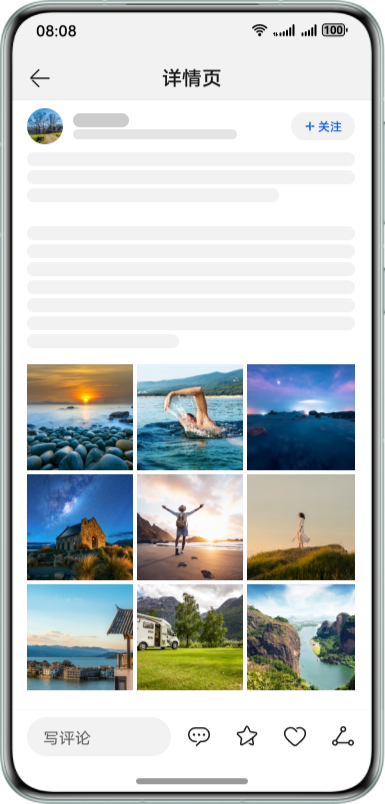

# 多设备社区评论界面

更新时间：2026-08-10 06:55:01

来源：https://developer.huawei.com/consumer/cn/doc/best-practices/multi-community-app

#### 概述

本文从当前常见的多设备应用场景中，选取社区评论应用作为典型案例，详细阐述“一多”理念在实际开发中的应用。社区评论应用的核心功能包括关注首页和热点页查看。基于这些核心功能，案例实现了关注页、热点页、社交详情、图片详情图片查看和输入评论等典型页面。文章重点介绍关键布局能力及对应实现。当前应用已适配的设备包括：直板机、双折叠（Mate X系列）、三折叠、阔折叠、平板和电脑。
 
> [!NOTE]
> 阅读本文前，建议开发者先了解 ArkUI（方舟UI框架） 和 一次开发，多端部署概览 相关知识。

 
下文将从UX设计、工程管理、页面开发三个方面，系统介绍多设备社区评论在实际开发中的最佳实践，为开发者提供可借鉴的实现思路。
 
- [UX设计](#section76351055155411)：介绍多设备社区评论应用的交互逻辑与通用的设计要点，开发者可直接参考同类设计要点。
- [工程管理](#section719020851716)：介绍“一多”工程所需配置，并推荐采用结构更清晰的三层架构。
- [移动端页面](#section202931220101020)和[电脑端页面](#section1774914524117)：遵循实际应用开发流程，以页面为基本单元，依次讲解窗口适配、页面开发的设计思路与实现方法。

 
 

#### UX设计

 
应用的UX设计可参考[社交通讯类](https://developer.huawei.com/consumer/cn/doc/design-guides/responsive-design-examples2-0000001793536901)的多设备响应式设计指南，设计参考图如下所示。
 

 



 

#### 工程管理

为确保“一多”工程代码的复用性与可维护性，建议开发者采用分层架构组织代码工程。该架构将项目划分为产品定制层（products）、基础特性层（features）和公共能力层（common）三个层级，各层级权责明确且功能独立，为开发者提供了清晰、高效且可扩展的设计方案。关于分层架构的具体设计细节，可参考[分层架构设计](https://developer.huawei.com/consumer/cn/doc/best-practices/bpta-layered-architecture-design)。
 
 

#### 创建工程

建议开发者参考[多设备工程部署与发布](https://developer.huawei.com/consumer/cn/doc/best-practices/bpta-multi-device-ide)相关内容，掌握分层架构工程的创建与配置方法后，创建模板项目工程。根据多设备社区评论的开发需求进行针对性修改，确保工程架构贴合实际业务需求。
 
 

#### 工程结构

多设备社区评论应用采用推荐的分层架构，将代码工程按products、features、common三个层级组织。各层级设计如下：
 
- product层：多设备社区应用需要适配的设备包括直板机、双折叠（Mate X系列）、三折叠、阔折叠、平板和电脑。由于电脑界面布局与其他设备差异较大，因此单独创建名为“pc”的HAP包作为电脑设备的应用入口；直板机、双折叠（Mate X系列）、三折叠、阔折叠及平板设备上的界面布局整体相似，部分差异可以通过“一多”的[自适应布局](https://developer.huawei.com/consumer/cn/doc/best-practices/bpta-multi-device-adaptive-layout)和[响应式布局](https://developer.huawei.com/consumer/cn/doc/best-practices/bpta-multi-device-responsive-layout)进行适配，为此创建名为“default”的HAP包作为这些设备的应用入口。
- features层：包含两个核心业务模块——社交（social）和内容（content）。为各模块分别创建对应HAR包，供products层按需引用。各模块相对独立，互不依赖，便于后续维护与迭代。
- common层：为实现代码复用并减少冗余，集中存放公共常量、日志工具类及窗口管理工具等基础能力，供其他模块统一调用。

 
工程结构如下：
 
```json
├──common
│  └──commonmulticommunityapplication                                     
│     └──src/main
│        ├──ets
│        │  ├──constants                      // 公共常量定义
│        │  ├──model                          // 公共model定义
│        │  ├──utils                          // 工具类
│        │  └──view                           // feature公共业务组件
│        └──resources                         // 公共资源
├──features                                   
│  ├──commonui                                // product公共业务组件模块
│  │  └──src/main
│  │     ├──ets
│  │     │  ├──view                           // product公共业务组件
│  │     │  └──viewmodel                      // product公共视图模型
│  │     └──resources                         // 公共业务组件模块资源
│  ├──contentcommunity                        // 内容社区模块
│  │  └──src/main
│  │     ├──ets
│  │     │  ├──model                          // 帖子数据模型
│  │     │  ├──view                           // 帖子组件
│  │     │  └──viewmodel                      // 帖子视图模型
│  │     └──resources                         // 帖子模块资源
│  └──socialcommunity                         // 社交社区模块
│     └──src/main
│        ├──ets
│        │  ├──model                          // 关注者/评论数据模型
│        │  ├──view                           // 关注者/评论组件
│        │  └──viewmodel                      // 关注者/评论视图模型
│        └──resources                         // 社交模块资源
├──product                                    
│  ├──default                                 // 手机/平板设备
│  │  └──src/main
│  │     ├──ets
│  │     │  ├──entryability                   // 入口类
│  │     │  ├──entrybackupability             // 应用数据备份恢复自定义拓展类
│  │     │  └──pages                          // 入口页面
│  │     └──resources                         // 资源文件
│  └──pc                                      // 电脑设备
│     └──src/main
│        ├──ets
│        │  ├──pages                          // 入口页面
│        │  ├──pcability                      // 入口类
│        │  └──pcbackupability                // 应用数据备份恢复自定义拓展类
│        └──resources                         // 资源文件
└──oh-package.json5                           // 工程依赖声明
```
 
 

#### 移动端页面

本章介绍如何针对直板机、双折叠（Mate X系列）、三折叠、阔折叠及平板设备上的多设备社区评论，利用“一多”布局能力，实现页面层级“一套代码、多端适配”的目标。同时，阐述这些设备上的窗口适配方案。
 
 

#### 窗口适配

- 窗口模式适配设备支持全屏、分屏、悬浮窗和自由窗口模式，具体参见[窗口模式](https://developer.huawei.com/consumer/cn/doc/best-practices/bpta-multi-device-window-mode)。其中，分屏模式与悬浮窗无需特殊设计，可通过系统方式进入。应用内监听窗口尺寸变化，[通过断点刷新UI](https://developer.huawei.com/consumer/cn/doc/best-practices/bpta-multi-device-responsive-layout#section175001836203617)，即可自动适配全屏、分屏、悬浮窗和自由窗口模式下的布局。
- 窗口方向在[model.json5配置文件](https://developer.huawei.com/consumer/cn/doc/harmonyos-guides/module-configuration-file)中将orientation字段设置为follow_desktop（跟随桌面的旋转模式），详情可参考[为应用配置旋转策略](https://developer.huawei.com/consumer/cn/doc/best-practices/bpta-multi-device-window-direction#section714419371037)。
- 窗口沉浸式根据UX设计，需实现不同窗口模式（全屏、分屏、悬浮窗、自由窗口）下的沉浸式效果，可参考[窗口沉浸式](https://developer.huawei.com/consumer/cn/doc/best-practices/bpta-multi-device-window-immersive)。推荐开发者使用[实现沉浸式效果](https://developer.huawei.com/consumer/cn/doc/best-practices/bpta-multi-device-window-immersive#section180431120426)中的组件级沉浸方案（组件设置页面沉浸），同时进行动态安全区避让，确保沉浸式显示效果。自由窗口模式下，使用[window.setWindowDecorVisible(false)](https://developer.huawei.com/consumer/cn/doc/harmonyos-references/arkts-apis-window-window#setwindowdecorvisible11)隐藏标题栏，仅保留右上角三键，使应用页面延伸至标题栏区域，实现沉浸式显示效果。

 
 

#### 关注页

社区评论应用首页作为业务入口。根据功能设计，关注页相关内容划分为4个区域，效果图如下：
  
| 横向断点 | sm | md | lg |
| --- | --- | --- | --- |
| 关注页 |  |  |  |
 
 
**界面开发**
 
具体介绍及实现方案如下表所示：
  
| 区域编号 | 简介 | 实现方案 |
| --- | --- | --- |
| 1 | 顶部页签栏 | 使用堆叠容器Stack嵌套自定义组件实现。通过点击或左右滑动切换“关注”与“发现”页签的内容。 |
| 2 | 全部关注(顶部/侧边) | 使用响应式组件List实现。 |
| 3 | 社交内容列表 | 使用响应式组件WaterFlow瀑布流容器实现。通过设置columnsTemplate布局列数，以实现在不同设备上展示不同列数。 |
| 4 | 底部导航栏 | 使用响应式组件HdsTabs实现。通过barFloatingStyle属性设置页签悬浮样式。 |
 
 
 

#### 热点页

热点页用于展示当前实时热点内容。根据功能设计，热点页相关内容划分为4个区域，效果图如下：
  
| 横向断点 | sm | md | lg |
| --- | --- | --- | --- |
| 热点页 |  |  |  |
 
 
**界面开发**
 
具体介绍及实现方案如下表所示：
  
| 区域编号 | 简介 | 实现方案 |
| --- | --- | --- |
| 1 | 顶部页签栏 | 使用堆叠容器Stack嵌套自定义组件实现。通过点击或左右滑动切换“实时”与“本地”页签的内容。 |
| 2 | 社交内容区 | 使用响应式组件WaterFlow瀑布流容器实现。通过设置columnsTemplate布局列数，以实现在不同设备上展示不同列数。 |
| 3 | 底部导航栏 | 使用响应式组件HdsTabs实现。通过barFloatingStyle属性设置页签悬浮样式。 |
 
 
 

#### 社交详情页

社交详情页。根据功能设计，社交详情页相关内容划分为4个区域，效果图如下：
  
| 横向断点 | sm | md | lg |
| --- | --- | --- | --- |
| 社交详情页 |  |  |  |
 
 
**界面开发**
 
具体介绍及实现方案如下表所.示：
  
| 区域编号 | 简介 | 实现方案 |
| --- | --- | --- |
| 1 | 顶部标题栏 | 使用响应式组件NavDestination设置title属性实现。在不同的设备宽度下组件自适应占满一屏。 |
| 2 | 社交内容区+图片展示区 | 常用基础组件+使用嵌套网格容器Grid实现。通过设置columnsTemplate布局列数，以实现在不同设备上展示不同列数。 |
| 3 | 社交评论区 | 使用可滚动的容器组件Scroll实现。 |
| 4 | 底部互动栏 | 使用响应式组件HdsTabs实现。通过barFloatingStyle属性设置页签悬浮样式。 |
 
 
 

#### 图片详情页

图片详情页。根据功能设计，图片详情页相关内容单独一个区域，效果图如下：
  
| 横向断点 | sm | md | lg |
| --- | --- | --- | --- |
| 图片详情页 |  |  |  |
 
 
**界面开发**
 
具体介绍及实现方案如下表所示：
  
| 区域编号 | 简介 | 实现方案 |
| --- | --- | --- |
| 1 | 图片展示页 | 图片自适应并占据整个页面展示。 |
 
 
 

#### 电脑端页面

本章介绍如何基于现有移动端界面开发方案，实现代码逻辑与布局复用，高效完成电脑设备上多设备社区的界面开发。
 
 

#### 关注页

社区评论应用首页作为业务入口，关注页相关内容划分为4个区域，效果图如下：
 


 
**界面开发**
 
具体介绍及实现方案如下表所示：
  
| 区域编号 | 简介 | 实现方案 |
| --- | --- | --- |
| 1 | 顶部页签栏 | 同移动端关注页对应区域的布局实现方案一致。 |
| 2 | 全部关注 | 同移动端关注页对应区域的布局实现方案一致。 |
| 3 | 社交内容列表 | 同移动端关注页对应区域的布局实现方案一致。 |
| 4 | 电脑设备左侧导航栏 | 使用侧边栏容器SideBarContainer实现。通过设置showSidebar属性，确保侧边栏固定显示。 |
 
 
 

#### 热点页

热点页用于展示当前实时热点内容。根据功能设计，热点页相关内容划分为4个区域，效果图如下：
 


 
**界面开发**
 
具体介绍及实现方案如下表所示：
  
| 区域编号 | 简介 | 实现方案 |
| --- | --- | --- |
| 1 | 顶部页签栏 | 同移动端热点页对应区域的布局实现方案一致。 |
| 2 | 社交内容区+社区评论区 | 同移动端热点页对应区域的布局实现方案一致。 |
| 3 | 电脑设备左侧导航栏 | 使用侧边栏容器SideBarContainer实现。通过设置showSidebar属性，确保侧边栏固定显示。 |
 
 
 

#### 社交详情页

根据功能设计，社交详情页相关内容划分为5个区域，效果图如下：
 


 
**界面开发**
 
具体介绍及实现方案如下表所示：
  
| 区域编号 | 简介 | 实现方案 |
| --- | --- | --- |
| 1 | 顶部标题栏 | 同移动端社交详情页对应区域的布局实现方案一致。 |
| 2 | 社交内容区+图片展示区 | 同移动端社交详情页对应区域的布局实现方案一致。 |
| 3 | 社交评论区 | 同移动端社交详情页对应区域的布局实现方案一致。 |
| 4 | 底部互动栏 | 同移动端社交详情页对应区域的布局实现方案一致。 |
| 5 | 电脑设备左侧导航栏 | 使用侧边栏容器SideBarContainer实现。通过设置showSidebar属性，确保侧边栏固定显示。 |
 
 
 

#### 图片详情页

图片详情页相关内容划分为1个区域，效果图如下：
 


 
**界面开发**
 
具体介绍及实现方案如下表所示：
  
| 区域编号 | 简介 | 实现方案 |
| --- | --- | --- |
| 1 | 图片展示页 | 同移动端图片详情页对应区域的布局实现方案一致。 |
 
 
 

#### 示例代码

- [多设备社区评论界面](https://gitcode.com/HarmonyOS_Samples/MultiCommunityApplication)
