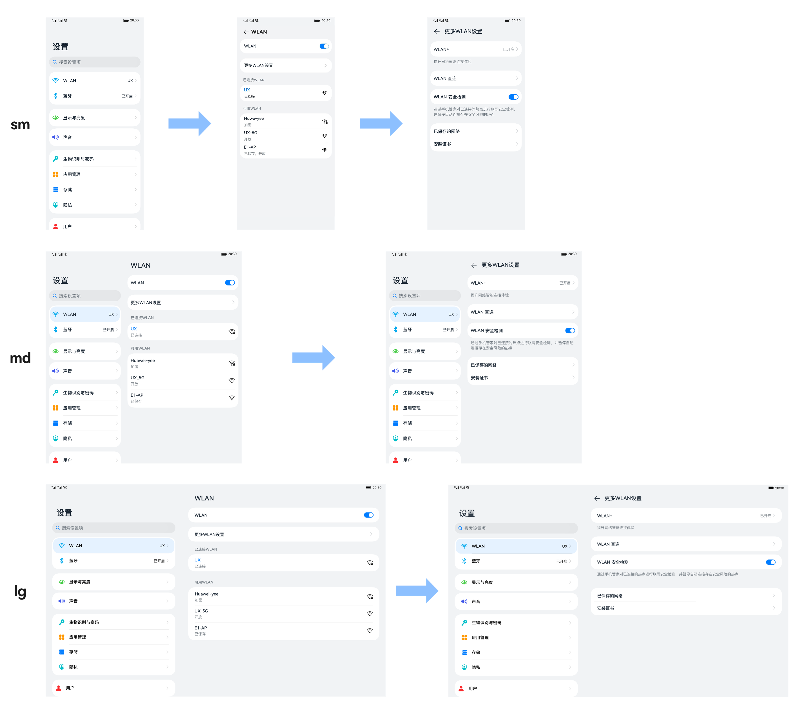
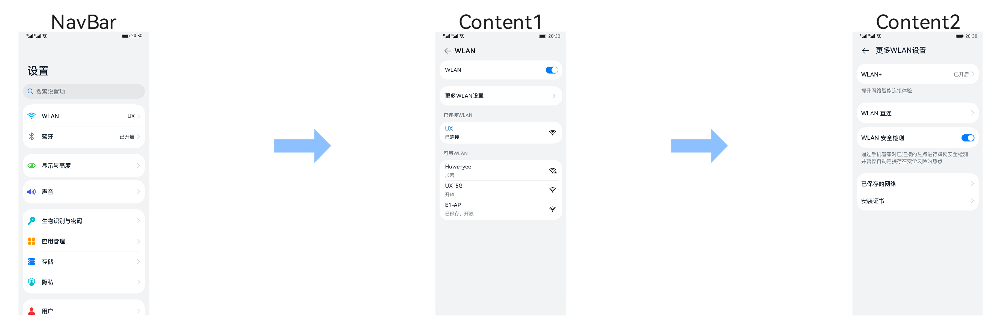
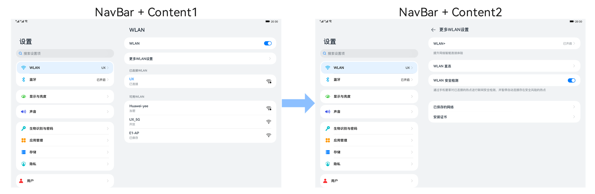
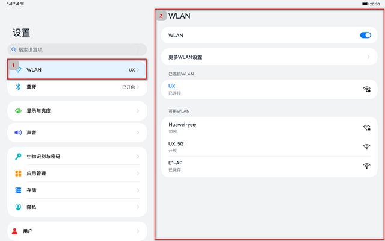
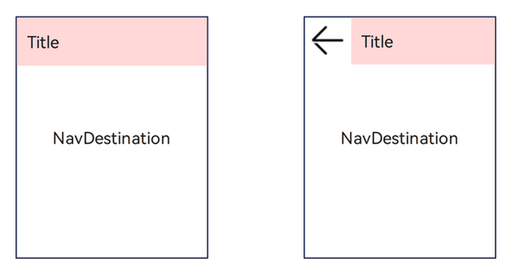
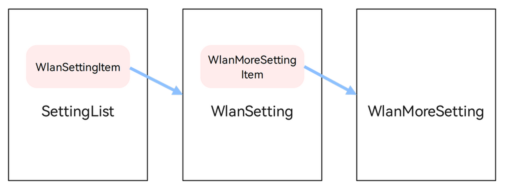

# 多设备设置界面

更新时间：2026-03-12 08:45:02

来源：https://developer.huawei.com/consumer/cn/doc/best-practices/bpta-multi-settings-application-page

本小节以“设置”应用页面为例，介绍如何使用自适应布局能力和响应式布局能力适配不同尺寸窗口。


## 页面设计


为充分利用屏幕尺寸优势，应用常常有在小屏设备上单栏显示，大屏设备上左右分两栏显示的设计，设置应用页面设计如下。





观察“设置”应用页面设计，不同断点下“设置主页”、“WLAN页面”和“更多WLAN设置页面”几乎完全一致，只是在sm断点下采用单栏显示，在md和lg断点下采用双栏显示。

在前面的典型页面场景中，已经介绍了如何分析及实现不同断点下设计相似的单个页面，本小节将展开介绍如何实现不同断点下存在单栏和双栏设计的场景。

为了方便读者理解，本小节将围绕以下三个问题进行介绍。

1. [如何实现单/双栏的显示效果](#如何实现单双栏的显示效果)
2. [如何实现点击跳转或刷新](#如何实现点击跳转或刷新)
3. [如何实现多级跳转](#如何实现多级跳转)


## 如何实现单/双栏的显示效果


开发者可以使用Row、Column、RowSplit等基础的组件，实现分栏显示的效果，但是需要较多的开发工作量。方舟开发框架在API 9重构了Navigation组件，开发者可以通过配置Navigation组件的属性，控制其按照单栏或双栏的效果进行显示。

Navigation组件由NavBar和Content两部分区域组成，支持Stack、Split以及Auto三种模式。Stack及Split模式下Navigation组件的表现如下图所示。

- Stack模式

- Split模式

- Auto模式 Auto模式是指Navigation组件可以根据应用窗口尺寸，自动选择合适的模式：窗口宽度小于520vp时，采用Stack模式显示；窗口宽度大于等于520vp时，采用Split模式显示。当窗口尺寸发生改变时，Navigation组件也会自动在Stack模式和Split模式之间切换。


> [!NOTE]
> Navigation组件提供的title、navBarWidth、navBarPosition等属性来调整其显示效果。Navigation组件样式的配置与其它组件类似，这里不做赘述。


设置主页的核心代码如下所示。Navigation组件默认处于Auto模式，其样式会根据应用窗口尺寸在单栏和双栏之间自动切换。

```text
import { SettingList } from 'settingItems';

const uiContext: UIContext | undefined = AppStorage.get('uiContext');
let storage: LocalStorage | undefined = uiContext!.getSharedLocalStorage();

@Entry(storage)
@Component
struct Index {
@LocalStorageProp('currentBreakpoint') curBp: string = 'sm';
@LocalStorageProp('windowWidth') windowWidth: number = 300;
@LocalStorageProp('isSplitMode') isSplitMode: boolean = false;
@Provide('pathInfos') pathStack: NavPathStack = new NavPathStack();

build() {
Navigation(this.pathStack) {
SettingList()
}
.title($r('app.string.settings'))
.mode(this.curBp !== 'sm' ? NavigationMode.Split : NavigationMode.Stack)
.navBarWidth(0.4 * this.windowWidth)
.hideToolBar(true)
.width('100%')
.height('100%')
.backgroundColor($r('sys.color.ohos_id_color_sub_background'))
}
}
```

```text
import { MainItem } from '../components/MainItem';
import { ItemGroup } from '../components/ItemGroup';
import { SearchBox } from '../components/SearchBox';
import { MoreConnectionsItem } from '../moreconnections/MoreConnectionsItem';
import { WlanSettingItem } from '../wlan/WlanSettingItem';

@Component
export struct SettingList {
@Builder CustomDivider() {
Divider()
.strokeWidth('1px')
.color($r('sys.color.ohos_id_color_list_separator'))
.margin({left: 48, right: 8})
}

build() {
List({space: 12}) {
ListItem() {
SearchBox()
}
.padding({top: 8, bottom: 8})
.width('100%')

ListItem() {
ItemGroup() {
WlanSettingItem()

this.CustomDivider()

MainItem({
title: $r('app.string.bluetoothTab'),
tag: $r('app.string.enabled'),
icon: $r('app.media.blueTooth'),
})

this.CustomDivider()

MainItem({
title: $r('app.string.mobileData'),
icon: $r('app.media.mobileData'),
})

this.CustomDivider()

MoreConnectionsItem()
}
}

ListItem() {
ItemGroup() {
MainItem({
title: $r('app.string.brightnessTab'),
icon: $r('app.media.displayAndBrightness'),
})
}
}

ListItem() {
ItemGroup() {
MainItem({
title: $r('app.string.volumeControlTab'),
icon: $r('app.media.volume'),
})
}
}

ListItem() {
ItemGroup() {
MainItem({
title: $r('app.string.biometricsAndPassword'),
icon: $r('app.media.biometricsAndPassword'),
})

this.CustomDivider()

MainItem({
title: $r('app.string.applyTab'),
icon: $r('app.media.application'),
})

this.CustomDivider()

MainItem({
title: $r('app.string.storageTab'),
icon: $r('app.media.storage'),
})

this.CustomDivider()

MainItem({
title: $r('app.string.security'),
icon: $r('app.media.security'),
})

this.CustomDivider()

MainItem({
title: $r('app.string.privacy'),
icon: $r('app.media.privacy'),
})
}
}

ListItem() {
ItemGroup() {
MainItem({
title: $r('app.string.usersAccountsTab'),
icon: $r('app.media.userAccounts'),
})

this.CustomDivider()

MainItem({
title: $r('app.string.systemTab'),
icon: $r('app.media.system'),
})

this.CustomDivider()

MainItem({
title: $r('app.string.aboutTab'),
icon: $r('app.media.aboutDevice'),
})
}
}

}
.padding({left: 12, right: 12})
.width('100%')
.height('100%')
.backgroundColor($r('sys.color.ohos_id_color_sub_background'))
}
}
```


## 如何实现点击跳转或刷新


Navigation组件通常搭配NavPathStack对象以及NavDestination组件一起使用：

- NavPathStack对象，用于管理页面。主要涉及页面跳转、页面返回、页面替换、页面删除、参数获取、路由拦截等功能。
- NavDestination组件用于实际刷新Navigation组件Content区域的显示。


### 点击跳转


NavPathStack对象用于控制Navigation组件中页面的跳转，通过Push相关的接口将指定的NavDestination页面信息入栈去实现页面跳转的功能。





结合设置应用的具体场景来看，点击上图1号小红框，跳转至2号红框WLAN页面，相应的核心代码实现如下。

```ts
import { MainItem } from '../components/MainItem';
import { WlanMoreSettingItem } from './WlanMoreSetting';
import { SubItemToggle } from '../components/SubItemToggle';
import { SubItemWifi } from '../components/SubItemWifi';
import { ItemGroup } from '../components/ItemGroup';
import { ItemDescription } from '../components/ItemDescription';
import { Logger } from '@ohos/common/Index';

const TAG = "WlanSettingItem"

@Component
export struct WlanSettingItem {
  @LocalStorageLink('selectedLabel') selectedLabel: string = '';
  @Consume('pathInfos') pathInfos: NavPathStack;

  build() {
    Column() {
      MainItem({
        title: $r('app.string.wifiTab'),
        tag: 'UX',
        icon: $r('app.media.wlan'),
        label: 'WLAN'
      })
      .onClick(() => {
        this.pathInfos.pushPath({ name: 'WlanSetting' });
        this.selectedLabel = 'WLAN';
      })
    }
  }
}

@Builder
export function WlanSettingBuilder() {
  WlanSetting();
}

@Component
struct WlanSetting {
  @State itemTitle: string = '';

  aboutToAppear() {
    try {
      this.itemTitle = this.getUIContext().getHostContext()!.resourceManager.getStringSync($r('app.string.wifiTab').id);
    } catch (err) {
      if (err.code) {
        Logger.error(TAG, `Failed to get item title. Cause: ${JSON.stringify(err)}`);
      }
    }
  }

  @Builder
  CustomDivider() {
    Divider()
    .strokeWidth('1px')
    .color($r('sys.color.ohos_id_color_list_separator'))
    .margin({ left: 12, right: 8 })
  }

  build() {
    NavDestination() {
      Column() {
        Column() {
          ItemGroup() {
            SubItemToggle({ title: $r('app.string.wifiTab'), isOn: true })
          }

          Row().height(16)

          ItemGroup() {
            WlanMoreSettingItem()
          }
        }
        .margin({ bottom: 19.5 })
        .flexShrink(0)

        Scroll() {
          Column() {
            ItemDescription({ description: $r('app.string.wifiTipConnectedWLAN') })
            .padding({
              left: 12,
              right: 12,
              bottom: 9.5
            })

            ItemGroup() {
              SubItemWifi({
                title: 'UX',
                subTitle: $r('app.string.wifiSummaryConnected'),
                isConnected: true,
                icon: $r('app.media.ic_wifi_signal_4_dark')
              })
            }

            Column() {
              ItemDescription({ description: $r('app.string.wifiTipValidWLAN') })
              .margin({
                left: 12,
                right: 12,
                top: 19.5,
                bottom: 9.5
              })

              ItemGroup() {
                SubItemWifi({
                  title: 'Huwe-yee',
                  subTitle: $r('app.string.wifiSummaryEncrypted'),
                  isConnected: false,
                  icon: $r('app.media.ic_wifi_lock_signal_4_dark')
                })

                this.CustomDivider()

                SubItemWifi({
                  title: 'UX-5G',
                  subTitle: $r('app.string.wifiSummaryOpen'),
                  isConnected: false,
                  icon: $r('app.media.ic_wifi_signal_4_dark')
                })

                this.CustomDivider()

                SubItemWifi({
                  title: 'E1-AP',
                  subTitle: $r('app.string.wifiSummarySaveOpen'),
                  isConnected: false,
                  icon: $r('app.media.ic_wifi_signal_4_dark')
                })
              }
            }
          }
        }
        .scrollable(ScrollDirection.Vertical)
        .scrollBar(BarState.Off)
        .width('100%')
        .flexShrink(1)
      }
      .width('100%')
      .height('100%')
      .padding({ left: 12, right: 12 })
    }
    .title(this.itemTitle)
    .backgroundColor($r('sys.color.ohos_id_color_sub_background'))
  }
}
```


### 显示刷新


NavDestination组件用于实际刷新Navigation组件Content区域的显示。

开发者可以通过NavDestination组件提供的如下属性，调整其最终显示效果：

- backgroundColor：设置NavDestination组件的背景色。
- title：自定义NavDestination组件的标题。
- hideTitleBar：隐藏NavDestination组件的标题栏。


特别的，Navigation组件会根据当前的状态决定是否在NavDestination组件标题栏起始部分自动添加返回键图标。当Navigation组件添加了返回键图标时，还可以自动响应及处理系统三键导航中的返回键事件。





## 如何实现多级跳转


多级跳转场景下，Navigation组件同样会根据当前的状态决定是否自动添加返回键图标及响应系统三键导航中的返回键事件。


| 一级页面 | 二级页面 |
| --- | --- |
|  |  |


结合具体场景，点击上图3号小红框，跳转至4号红框更多WLAN设置页面，其核心代码实现如下所示。

```text
import { SubItemArrow } from '../components/SubItemArrow'
import { SubItemToggle } from '../components/SubItemToggle'
import { ItemGroup } from '../components/ItemGroup'
import { ItemDescription } from '../components/ItemDescription'
import { Logger } from '@ohos/common/Index'

const TAG = "WlanMoreSetting"

@Component
export struct WlanMoreSettingItem {
@LocalStorageLink('selectedLabel') selectedLabel: string = '';
@Consume('pathInfos') pathInfos: NavPathStack;

build() {
SubItemArrow({ title: $r('app.string.moreWlanSettings') })
.onClick(() => {
this.pathInfos.pushPath({ name: 'WlanMoreSetting' });
this.selectedLabel = 'WLAN';
})
}
}

@Builder
export function WlanMoreSettingBuilder() {
WlanMoreSetting();
}

@Component
export struct WlanMoreSetting {

private getSettingTitle(): string {
let title = "";
try {
title = this.getUIContext().getHostContext()!.resourceManager.getStringSync($r('app.string.moreWlanSettings').id)
} catch(err) {
if (err.code) {
Logger.error(TAG, `Failed to get setting title. Cause: ${JSON.stringify(err)}`);
}
}
return title;
}

build() {
NavDestination() {
Scroll() {
Column() {
ItemGroup() {
SubItemArrow({
title: $r('app.string.wlanPlus'),
tag: $r('app.string.enabled')
})
}

ItemDescription({ description: $r('app.string.wlanPlusTip') })
.margin({
top: 8,
bottom: 24,
left: 12,
right: 12
})

ItemGroup() {
SubItemArrow({ title: $r('app.string.wlanDirect') })
}

Blank().height(12)

ItemGroup() {
SubItemToggle({ title: $r('app.string.wlanSecurityCheck') })
}

ItemDescription({ description: $r('app.string.wlanSecurityCheckTip') })
.margin({
top: 8,
bottom: 24,
left: 12,
right: 12
})

ItemGroup() {
SubItemArrow({ title: $r('app.string.savedWlan') })
Divider()
.strokeWidth('1px')
.color($r('sys.color.ohos_id_color_list_separator'))
.margin({ left: 12, right: 8 })
SubItemArrow({ title: $r('app.string.installCertificates') })
}
}
.backgroundColor($r('sys.color.ohos_id_color_sub_background'))
.padding({ left: 12, right: 12 })
}
.scrollBar(BarState.Off)
.width('100%')
}
.title(this.getSettingTitle())
.backgroundColor($r('sys.color.ohos_id_color_sub_background'))
}
}
```


## 总结





本示例的基础导航结构上图所示：

- 激活SettingList中的WlanSettingItem，可以加载及显示WlanSetting。
- 激活WlanSetting中的WlanMoreSettingItem，可以加载及显示WlanMoreSetting。


Navigation组件支持自动切换单栏和双栏的显示效果，同时可以根据当前状态自动添加返回键及响应系统的返回键事件。借助Navigation组件，开发者不用关心单栏和双栏场景的差异而更关注于应用本身，极大的减少开发工作量及提高开发效率。


## 示例代码


- [开发设置应用页面功能](https://gitcode.com/HarmonyOS_Samples/NavigationSettings)
