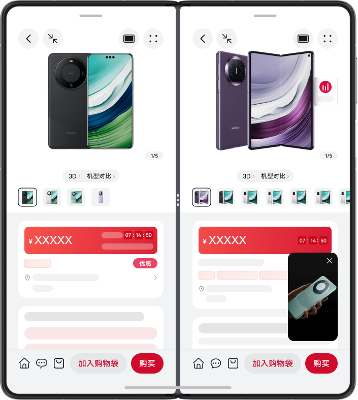
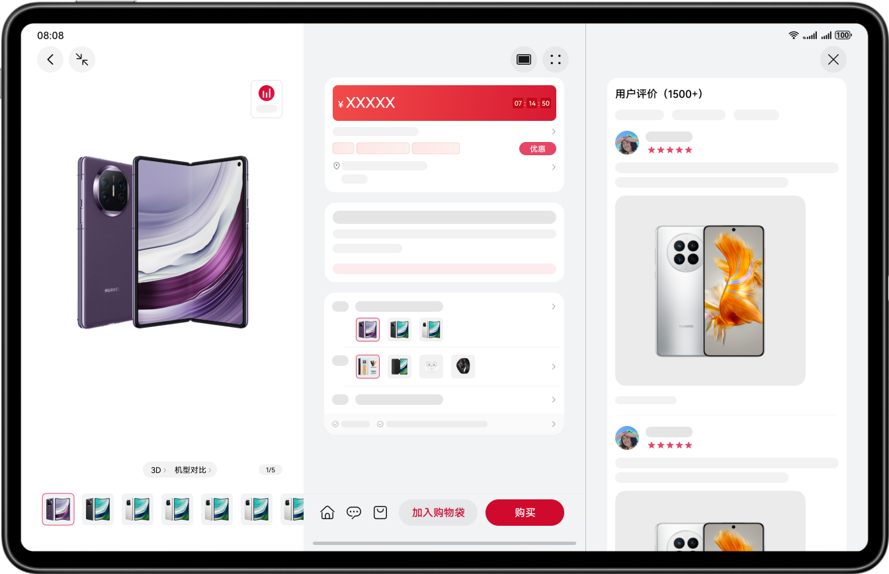

# 多设备购物比价界面

更新时间：2026-03-26 08:46:30

来源：https://developer.huawei.com/consumer/cn/doc/best-practices/multi-shopping-price-comparison

## 概述


本文从目前流行的垂类市场中，选择购物行业应用作为典型案例详细介绍“一多”在实际开发中的应用。购物行业应用的核心功能为浏览商品、商品比价和直播购等。根据这些核心功能，本文选择首页、商品分类页、商品详情页、商品支付页、咨询客服页、直播间页等作为典型页面进行开发，遵从多设备的“差异性”、“一致性”、“灵活性”和“兼容性”，能够让开发者快速高效地掌握“一多”能力并实现购物比价应用的相关功能。

购物类应用为了向用户展示更多的商品选择，对垂类内的核心功能进行了独特设计：

- [商品分类页](#section1048762514385)主要用于快速查找目标商品，采用分栏的布局提升查找效率。
- [商品支付页](#section1965713469388)，为避免大面积页面跳转和遮挡商品的关键信息，采用浅层窗口-半模态的方式进行支付。


- 在查看[商品详情](#section8305102524814)或[直播](#section972591693910)时，通过侧边面板显示其他的辅助信息，提高浏览效率。
- [直播间页](#section838561613490)推荐的商品信息，在多端基于设备屏幕尺寸进行响应式适配，避让直播的关键信息。
- 退出直播间页时，使用画中画小窗口观看直播。


下文将围绕手机、折叠屏和平板设备，从UX设计、架构设计和页面开发三个角度，介绍“一多”购物比价应用的最佳实践，并提供符合“一多”的参考样例。

- [UX设计](#section23951509373)章节介绍购物比价应用的交互逻辑和通用的设计要点，对于类似的设计要点，开发者可以直接拿来使用。
- [架构设计](#section161011524314)章节推荐“一多”应用使用目录结构更加清晰的三层架构。
- [页面开发](#section380651612378)章节会将页面划分为不同区域，按照区域的开发顺序，介绍如何使用自适应布局和响应式布局实现不同的UI效果。


> [!NOTE]
> 阅读本文前，开发者需熟悉[ArkUI（方舟UI框架）](https://developer.huawei.com/consumer/cn/doc/harmonyos-guides/arkui)和页面开发的“一多”能力（参考[一次开发，多端部署概览](https://developer.huawei.com/consumer/cn/doc/best-practices/bpta-multi-device-overview)）。下文将详细介绍它们在“一多”开发实践中如何使用。


## UX设计


电商购物类的多设备响应式设计指南，点击访问。


## 架构设计


HarmonyOS的分层架构包括产品定制层、基础特性层和公共能力层，为开发者提供了清晰、高效、可扩展的设计架构。详情请参阅分层架构设计的逻辑设计。


## 页面开发


本章介绍购物比价应用中如何使用“一多”布局能力，实现页面层级的单页面和多端适配。下文将详细说明每个页面区域的具体布局能力，帮助开发者从零开始进行购物比价应用的开发。


### 首页


首页包含入口图标和商品卡片等详细的商品信息，有助于满足用户浏览和挑选商品的核心需求。查看首页在不同设备上的UX设计图，可以进行以下设计：

- 将首页划分为7个区域，效果图如下：

|  | sm | md | lg |
| --- | --- | --- | --- |
| 效果图 |  |  |  |
| 效果图 |  |  |  |

- 首页区域2在小设备上显示为两行，在中型和大型设备上显示为单行。断点变化时，显示效果会自动切换。
- 首页区域3使用自适应布局，根据设备尺寸自动延伸或隐藏；区域4和5使用自适应布局，实现占比调整和均分。
- 首页区域1和5-7使用响应式布局的栅格断点系统，根据断点变化调整组件属性，实现相应的布局效果。


| 区域编号 | 简介 | 实现方案 |
| --- | --- | --- |
| 1 | 底部/侧边页签 | 借助[栅格布局](https://developer.huawei.com/consumer/cn/doc/best-practices/bpta-multi-device-responsive-layout#section1061332817545)监听断点变化改变位置，代码可参考多设备长视频界面的[底部/侧边页签](https://developer.huawei.com/consumer/cn/doc/best-practices/multi-video-app#zh-cn_topic_0000001744653537_li1226615201361)。 |
| 2 | 顶部页签及搜索框 | 栅格布局监听断点变化实现折行显示，[List组件](https://developer.huawei.com/consumer/cn/doc/harmonyos-references/ts-container-list)实现延伸能力，layoutWeight实现拉伸能力，代码可参考多设备长视频界面的[顶部页签及搜索框](https://developer.huawei.com/consumer/cn/doc/best-practices/multi-video-app#zh-cn_topic_0000001744653537_li1346175796)。 |
| 3 | 商品分类图标 | List组件实现延伸能力，代码可参考多设备长视频界面的[视频简介](https://developer.huawei.com/consumer/cn/doc/best-practices/multi-video-app#zh-cn_topic_0000001744653537_li1134192618160)。 |
| 4 | 商品卡片 | [Swiper组件](https://developer.huawei.com/consumer/cn/doc/harmonyos-references/ts-container-swiper)，指定displayCount属性实现占比能力，设置aspectRatio属性实现缩放能力，代码可参考多设备长视频界面的[Banner图](https://developer.huawei.com/consumer/cn/doc/best-practices/multi-video-app#zh-cn_topic_0000001744653537_li139671645597)。 |
| 5 | 福利专区 | [Row组件](https://developer.huawei.com/consumer/cn/doc/harmonyos-references/ts-container-row)的justifyContent属性设置为FlexAlign.SpaceBetween实现均分能力，代码可参考多设备长视频界面的[视频简介](https://developer.huawei.com/consumer/cn/doc/best-practices/multi-video-app#zh-cn_topic_0000001744653537_li1134192618160)。 |
| 6 | 甄选推荐 | 响应式布局的栅格布局，设置aspectRatio属性实现缩放能力，代码可参考多设备长视频界面的[每日佳片](https://developer.huawei.com/consumer/cn/doc/best-practices/multi-video-app#zh-cn_topic_0000001744653537_li1938820294129)。 |
| 7 | 限时秒杀 | 响应式布局的栅格布局，设置aspectRatio属性实现缩放能力，同甄选推荐。 |


### 商品分类页


商品分类页用于快速查找目标商品。观察不同设备上的UX设计图，进行如下设计：

- 将商品分类页划分为4个区域，效果图如下：

|  | sm | md | lg |
| --- | --- | --- | --- |
| 效果图 |  |  |  |


商品分类页的4个基础区域介绍及实现方案如下表所示：

| 区域编号 | 简介 | 实现方案 |
| --- | --- | --- |
| 1 | 顶部搜索框 | 在sm断点下占满行宽，在md、lg断点下设置justifyContent属性为End。 |
| 2 | 侧边导航 | [Navigation组件](https://developer.huawei.com/consumer/cn/doc/harmonyos-references/ts-basic-components-navigation)实现，设置mode属性为Split分栏显示，使用navBarWidthRange约束不同断点下的固定导航栏宽度。 |
| 3 | 广告卡片 | [Swiper组件](https://developer.huawei.com/consumer/cn/doc/harmonyos-references/ts-container-swiper)设置displayCount在不同断点下为1、2、3，在md断点下设置nextMargin露出后边距，实现自适应布局的占比能力，代码可参考多设备长视频界面的[Banner图](https://developer.huawei.com/consumer/cn/doc/best-practices/multi-video-app#zh-cn_topic_0000001744653537_li139671645597)。 |
| 4 | 商品小图 | 使用[List组件](https://developer.huawei.com/consumer/cn/doc/harmonyos-references/ts-container-list)+[栅格布局](https://developer.huawei.com/consumer/cn/doc/best-practices/bpta-multi-device-responsive-layout#section1061332817545)实现每行显示固定个数的商品图，代码可参考多设备长视频界面的[搜索发现](https://developer.huawei.com/consumer/cn/doc/best-practices/multi-video-app#zh-cn_topic_0000001744653537_li311217374149)。 |


- 侧边导航使用Navigation组件实现分栏显示，设置mode为NavigationMode.Split，同时设置不同断点下导航栏的最小和最大宽度相同，以约束导航栏的固定宽度。
```ts
Navigation(this.pageInfo) {
  // ...
}
.layoutWeight(1)
// Setting the double column view of the navigation.
.mode(NavigationMode.Split)
// Initialize the width of the navigation bar.
.navBarWidth(new BreakpointType('96vp', '144vp', '200vp').getValue(this.currentBreakpoint))
// Set the minimum width and maximum width of the navigation bar under different breakpoints to be the same.
.navBarWidthRange([new BreakpointType($r('app.float.classify_navigation_bar_width_sm'),
$r('app.float.classify_navigation_bar_width_md'), $r('app.float.classify_navigation_bar_width_lg'))
.getValue(this.currentBreakpoint), new BreakpointType($r('app.float.classify_navigation_bar_width_sm'),
$r('app.float.classify_navigation_bar_width_md'), $r('app.float.classify_navigation_bar_width_lg'))
.getValue(this.currentBreakpoint)])
```


### 购物袋页


购物袋页用于快速查看并支付待购买的商品，在大屏上通过右侧显示辅助信息以提高页面使用效率。观察购物袋页在不同设备上的UX设计图，可以进行如下设计：

- 将购物袋页划分为4个区域，效果图如下：

|  | sm | md | lg |
| --- | --- | --- | --- |
| 效果图 |  |  |  |


购物袋页的4个基础区域介绍及实现方案见下表：

| 区域编号 | 简介 | 实现方案 |
| --- | --- | --- |
| 1 | 顶部标题栏 | 剩余空间全部分配给中间空白区，用[Blank组件](https://developer.huawei.com/consumer/cn/doc/harmonyos-references/ts-basic-components-blank)实现自适应布局拉伸能力，同[首页顶部页签及搜索框](#section1976644133811)。 |
| 2 | 购物袋商品 | [List组件](https://developer.huawei.com/consumer/cn/doc/harmonyos-references/ts-container-list)实现。 |
| 3 | 结算工具栏 | 剩余空间全部分配给中间空白区，用Blank组件实现自适应布局拉伸能力，同顶部标题栏。 |
| 4 | 优惠明细 | 购物袋主区域与优惠明细辅助区域在Row组件中呈左右布局，sm和md断点下只显示购物袋主区域、隐藏优惠明细区域，lg断点下全部显示，代码可参考多设备长视频界面的[视频简介](https://developer.huawei.com/consumer/cn/doc/best-practices/multi-video-app#zh-cn_topic_0000001744653537_li1134192618160)。 |


### 商品详情页


商品详情页展示商品大图及详细信息。观察商品详情页在不同设备上的UX设计图，可以进行如下设计：

- 将商品详情页划分为4个区域，效果图如下：

|  | sm | md | lg |
| --- | --- | --- | --- |
| 效果图 |  |  |  |


商品详情页的4个基础区域介绍及实现方案如下表所示：

| 区域编号 | 简介 | 实现方案 |
| --- | --- | --- |
| 1 | 商品大图 | [Swiper组件](https://developer.huawei.com/consumer/cn/doc/harmonyos-references/ts-container-swiper)，指定displayCount属性实现延伸能力，设置aspectRatio属性实现缩放能力，代码可参考多设备长视频界面的[Banner图](https://developer.huawei.com/consumer/cn/doc/best-practices/multi-video-app#zh-cn_topic_0000001744653537_li139671645597)。 |
| 2 | 商品详细信息 | 商品大图区域与商品详细信息区域在sm和md断点下使用Column组件呈上下布局，在lg断点下使用Row组件呈左右布局，同[商品详情侧边面板页](#section8305102524814)。 |
| 3 | 购买工具栏 | 剩余空间按比例分配给加入购物袋与购买按钮，用layoutWeight属性实现自适应布局占比能力，同[首页顶部页签及搜索框](#section1976644133811)。 |
| 4 | 画中画 | 使用[PiPWindow](https://developer.huawei.com/consumer/cn/doc/harmonyos-references/js-apis-pipwindow)实现画中画功能，启动、停止小窗直播及控制视频播放。 |


商品详情页在大屏设备上提供分屏功能，满足用户同时查看两个商品详细参数进行比价的需求。分屏功能通过创建新的UIAbility并设置窗口显示为分屏模式实现。分屏后，左右屏幕的宽度比例为1:1。折叠屏上的效果图如下：





创建新的UIAbility时，在phone目录下创建SecondAbility.ets文件，并注册与EntryAbility相同的UIAbility生命周期回调。下一步，在phone目录下的module.json5配置文件中，修改abilities属性以注册SecondAbility。具体可参考源码。启动分屏时，调用UIAbilityContext的StartAbility接口，设置窗口模式为分屏并启动SecondAbility。关闭分屏时，调用UIAbilityContext的terminateSelf接口。

```text
Image(this.isSplitMode ? $r('app.media.icon_split') : $r('app.media.ic_mate_pad_2'))
// ...
.onClick(() => {
if (!this.isSplitMode) {
let want: Want = {
bundleName: 'com.huawei.multishoppingpricecomparison',
abilityName: 'SecondAbility'
};
let option: StartOptions = { windowMode: AbilityConstant.WindowMode.WINDOW_MODE_SPLIT_PRIMARY };
(this.context as common.UIAbilityContext).startAbility(want, option);
} else {
(this.context as common.UIAbilityContext).terminateSelf();
}
})
```

为了提升在大设备上的浏览效率，点击“全部评论”后，页面将采用三分栏布局展示右侧的全部评价页面，使用SideBarContainer组件实现。

效果图如下：





```ts
SideBarContainer() {
  Column() {
    Image($r('app.media.icon_close_4'))
    // ...
    AllComments()
  }
  .alignItems(HorizontalAlign.End)
  .height('100%')
  .padding({
    top: deviceInfo.deviceType === '2in1' ? 0 : this.topRectHeight,
    left: '32vp',
    right: '32vp'
  })

  Row() {
    // ...
  }
  // ...
}
.showSideBar(this.isShowingSidebar)
.showControlButton(false)
.sideBarPosition(SideBarPosition.End)
.divider({
  strokeWidth: '1vp',
  color: ResourceUtil.getCommonDividerColor()
})
.minSideBarWidth(this.getUIContext().px2vp(this.windowWidth) / 3)
.maxSideBarWidth(this.getUIContext().px2vp(this.windowWidth) / 3)
.autoHide(false)
```


- 为了方便浏览其他页面时继续观看直播内容，购物直播设计了画中画功能。点击直播间页的关闭按钮，返回上一页并以小窗模式显示直播内容。画中画功能的实现步骤如下：使用@ohos.PiPWindow模块的create接口创建画中画控制器，使用startPiP接口启动画中画，启动后返回上一页。其中画中画播放的视频内容需要使用XComponent+AVPlayer组件实现，读者可以自行查看源码。
```ts
async startPip(navId: string, mXComponentController: XComponentController, context: Context, pageInfos: NavPathStack): Promise<void> {
  if (canIUse('SystemCapability.Window.SessionManager')) {
    if (!PiPWindow.isPiPEnabled()) {
      Logger.error(`picture in picture disabled for current OS`);
      return;
    }
    let config: PiPWindow.PiPConfiguration = {
      context: context,
      componentController: mXComponentController,
      // Navigation ID of the current page.
      navigationId: navId,
      templateType: PiPWindow.PiPTemplateType.VIDEO_LIVE
    };
    // Create a pip controller.
    PiPWindow.create(config).then((controller: PiPWindow.PiPController)=>{
      this.pipController = controller;
      // Initializing the pip controller.
      this.initPipController();
      // Enabling the pip function through the startPip interface.
      this.pipController.startPiP().then(() => {
        Logger.info(`Succeeded in starting pip.`);
        if (this.avPlayerUtil === undefined) {
          return;
        }
        this.avPlayerUtil.play();
        pageInfos.pop();
      }).catch((err: BusinessError) => {
        Logger.error(`Failed to start pip. Cause: ${err.code}, message: ${err.message}`);
      });
    }).catch((err: BusinessError) => {
      Logger.error(`Failed to create pip controller. Cause: ${err.code}, message: ${err.message}`);
    });
  }
}
```
 初始化画中画控制器时，注册画中画生命周期状态和直播控制事件的监听。
```ts
initPipController(): void {
  if (!this.pipController) {
    return;
  }
  if (canIUse('SystemCapability.Window.SessionManager')) {
    this.pipController.on('stateChange', (state: PiPWindow.PiPState, reason: string) => {
      this.onStateChange(state, reason);
    });
    this.pipController.on('controlPanelActionEvent', (event: PiPWindow.PiPActionEventType) => {
      this.onActionEvent(event);
    });
  }
}
```
 使用stopPiP接口关闭画中画。
```ts
// Disable the pip function by calling stopPip.
async stopPip(): Promise<void> {
  if (canIUse('SystemCapability.Window.SessionManager')) {
    if (this.pipController) {
      this.pipController.stopPiP().then(()=>{
        this.isShowingPip = false;
        Logger.info(`Succeeded in stopping pip.`);
        try {
          this.pipController?.off('stateChange');
          this.pipController?.off('controlPanelActionEvent');
        } catch (exception) {
          Logger.error('Failed to unregister callbacks. Code: ' + JSON.stringify(exception));
        }
      }).catch((err: BusinessError) => {
        Logger.error(`Failed to stop pip. Cause: ${err.code}, message: ${err.message}`);
      });
    }
  }
}
```


### 商品详情侧边面板页


查看商品详情时，用户可能需要咨询客服或查看购物车。可以采用侧边面板显示客服对话等辅助信息，从而提升浏览效率，实现边看商品边聊天咨询的体验。

- 侧边面板咨询客服，效果图如下：

|  | sm | md | lg |
| --- | --- | --- | --- |
| 设计能力点 |  |  |  |
| 侧边面板-咨询客服 |  |  |  |
| 侧边面板-购物袋 |  |  |  |

- 观察商品详情侧边面板的设计，在sm断点下仅显示侧边辅助面板，在md和lg断点下使用Row组件实现左右布局，通过设置layoutWeight属性实现自适应布局的占比。在md断点时，商品详情与侧边面板的宽度比为1:1；在lg断点时，宽度比为5:3。
```ts
Row() {
  Column() {
    // ...
  }
  .height('100%')
  // Setting the width ratio of offering details to side panel.
  .layoutWeight(new BreakpointType(0, 3, 5).getValue(this.currentBreakpoint))
  .borderWidth({ right: '1vp' })
  .borderColor(ResourceUtil.getCommonBorderColor()[0])
  // Hide the product details page under the SM breakpoint.
  .visibility(this.currentBreakpoint === 'sm' ? Visibility.None : Visibility.Visible)

  Column() {
    // Check the auxiliary information page of the side panel.
    if (this.isShoppingBag) {
      DetailShoppingBagView({ isMoreDetail: this.isMoreDetail })
    }
    if (this.isCustomerService) {
      CustomerServiceView()
    }
  }
  .backgroundColor(ResourceUtil.getCommonBackgroundColor()[0])
  .height(CommonConstants.FULL_PERCENT)
  // Setting the width ratio of offering details to side panel.
  .layoutWeight(3)
}
```


### 商品支付页


商品支付页使用浅层窗口展示支付信息。观察商品支付页在不同设备上的UX设计图，具体效果见下图：

|  | sm | md | lg |
| --- | --- | --- | --- |
| 设计能力点 |  |  |  |
| 效果图 |  |  |  |


商品支付页的浅层窗口，使用bindSheet为购买按钮绑定半模态页面，在sm断点下弹窗底部显示，在md和lg断点下弹窗居中显示。

```ts
Button(DetailConstants.BUTTON_NAMES(this.context)[1])
  // ...
  .bindSheet($$this.isDialogOpen, this.PayCardBuilder(), {
    height: '620vp',
    preferType: SheetType.CENTER,
    dragBar: false,
    enableOutsideInteractive: false,
    onDisappear: () => {
      this.isDialogOpen = false;
    },
    showClose: false,
    backgroundColor: '#F1F3F5',
  })
  .onClick(() => {
    if (this.isLivePage || this.isSplitMode) {
      return;
    }
    this.isDialogOpen = true;
  });
```


半模态页面使用@Builder注解构建，并绑定到bindSheet事件。

```ts
@Builder
PayCardBuilder() {
  Column() {
    PayCard({
      // ...
    })
  }
  // ...
}
```


### 直播间页


直播画面和推荐商品信息在多端根据设备屏幕尺寸进行响应式适配。观察直播间页面在不同设备上的UX设计图，可以进行如下设计：

|  | sm | md | lg |
| --- | --- | --- | --- |
| 设计能力点 |  |  |  |
| 效果图 |  |  |  |


直播间页的3个基础区域介绍及实现方案如下表所示：

| 区域编号 | 简介 | 实现方案 |
| --- | --- | --- |
| 1 | 直播内容 | [Stack组件](https://developer.huawei.com/consumer/cn/doc/harmonyos-references/ts-container-stack)控制子组件的显示层级，在sm断点下aspectRatio属性控制直播图片等比放大实现自适应能力的缩放能力，在md和lg断点下固定大小，同[商品详情页商品大图](#section112893356386)。 |
| 2 | 直播弹幕及推荐商品 | 使用[Stack组件](https://developer.huawei.com/consumer/cn/doc/harmonyos-references/ts-container-stack)+[List组件](https://developer.huawei.com/consumer/cn/doc/harmonyos-references/ts-container-list)，在sm和md断点下呈上下结构，显示在下方，在lg断点下呈左右结构，显示在两侧并尾部对齐。 |
| 3 | 发表弹幕 | [TextInput组件](https://developer.huawei.com/consumer/cn/doc/harmonyos-references/ts-basic-components-textinput)设置layoutWeight实现自适应布局拉伸能力，同[首页顶部页签及搜索框](#section1976644133811)。 |


- 直播弹幕及推荐商品使用Stack组件和List组件。在sm和md断点下，布局呈上下结构，显示在下方。在lg断点下，布局呈左右结构，显示在两侧并尾部对齐。
```ts
Stack() {
  Column() {
    Comment(this.currentBreakpoint, this.getUIContext().getHostContext()!)
    LiveShopList({
      detailType: this.detailType,
      isMoreDetail: this.isMoreDetail,
      isSideListLayout: false
    })
    .visibility(this.currentBreakpoint === 'sm' || this.currentBreakpoint === 'md'?
    Visibility.Visible : Visibility.None)
  }
  // ...

  Row() {
    LiveShopList({
      detailType: this.detailType,
      isMoreDetail: this.isMoreDetail,
      isSideListLayout: true
    })
  }
  .visibility(this.currentBreakpoint === 'sm' || this.currentBreakpoint === 'md'?
  Visibility.None : Visibility.Visible)
  // ...
}
```

```ts
.listDirection(this.isSideListLayout ? Axis.Vertical : Axis.Horizontal)
```


### 直播侧边面板页


观看直播时，可利用侧边辅助面板查看商品详情、口袋宝贝或支付页面。直播侧边面板在不同设备上的UX设计图如下：


|  | sm | md | lg |
| --- | --- | --- | --- |
| 侧边面板-商品详情页 |  |  |  |
| 侧边面板-口袋宝贝页 |  |  |  |
| 侧边面板-支付页 |  |  |  |


- 侧边面板-商品详情页，在sm断点下不显示，在md和lg断点下使用Row组件呈左右布局，设置layoutWeight属性实现自适应布局的占比能力，同[商品详情侧边面板页](#section8305102524814)。在md断点时商品详情与侧边面板宽度为1：1，在lg断点时为5：3。
- 观察直播侧边面板-口袋宝贝页和支付页的设计，在sm断点下使用bindSheet为组件绑定半模态页面，同[商品支付页](#section1965713469388)，在md和lg断点下使用Row组件呈左右布局，设置layoutWeight属性实现自适应布局的占比能力，同[商品详情侧边面板页](#section8305102524814)。


## 示例代码


- [多设备购物比价界面](https://gitcode.com/harmonyos_codelabs/MultiShoppingPriceComparison)
