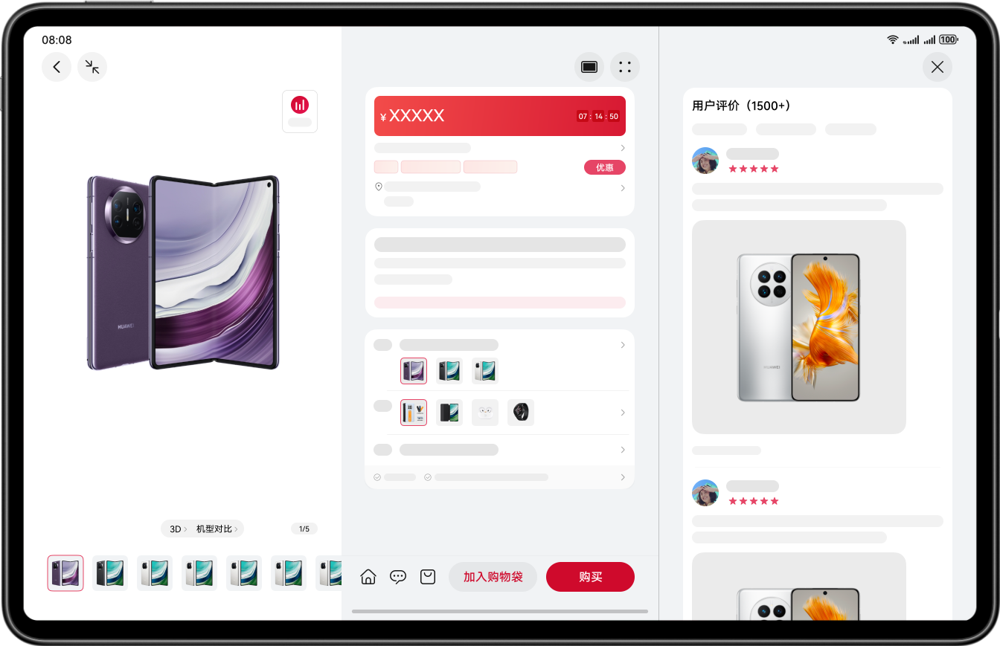

# 多设备购物比价界面

更新时间：2026-06-10 07:05:30

来源：https://developer.huawei.com/consumer/cn/doc/best-practices/multi-shopping-price-comparison

#### 概述

本文从当前常见的多设备应用场景中，选取购物行业应用作为典型案例，详细介绍“一多”在实际开发中的应用。
 
购物行业应用的核心是商品浏览与购买体验，主要功能涵盖商品推荐、商品搜索、商品详情、比价功能、直播购物等。本文围绕上述核心功能，选取首页、商品分类页、商品详情页、直播页面等作为典型页面进行开发实践。开发过程遵循多设备开发的“差异性”、“一致性”、“灵活性”和“兼容性”原则，助力开发者快速掌握“一多”开发能力，高效实现购物应用相关功能。
 
目前该应用已适配设备包括：直板机、双折叠（Mate X系列）、三折叠、阔折叠、平板和电脑。
 
> [!NOTE]
> 阅读本文前，建议开发者先了解 ArkUI（方舟UI框架） 和 一次开发，多端部署概览 相关知识。

 
下文将从UX设计、架构设计、页面开发三个方面，系统介绍购物应用在实际开发中的最佳实践，为开发者提供可借鉴的实现思路。
 
- [UX设计](#section23951509373)：介绍购物应用的交互逻辑和通用设计要点，可供同类购物应用开发者直接参考复用。
- [工程管理](#zh-cn_topic_0000001744653537_section189781175313)：基于分层架构搭建“一多”应用代码工程，以清晰的目录结构明确各层逻辑，同时针对购物业务场景提供适配的工程配置方案。
- [移动端页面](#section1731674118398)和[电脑端页面](#section121051857195719)：按照实际应用开发流程，以页面为基本单元，分别讲解不同设备端页面在窗口适配、页面开发、交互开发及功能开发等环节的设计思路与具体实现方法。

 
 

#### UX设计

购物比价应用的UX设计可参考[电商购物类](https://developer.huawei.com/consumer/cn/doc/design-guides/responsive-design-examples5-0000001930419478)多设备响应式设计指南，设计参考图如下所示。
 



 
 

#### 工程管理

为提升“一多”工程代码的复用性和可维护性，推荐开发者使用分层架构组织代码工程。分层架构将项目工程划分为产品定制层（products）、基础特性层（features）和公共能力层（common），各层级权责清晰、各司其职，为开发者提供了一套清晰、高效且可扩展的设计架构。关于分层架构的具体设计细节，可参考[分层架构设计](https://developer.huawei.com/consumer/cn/doc/best-practices/bpta-layered-architecture-design)。
 
 

#### 创建工程

开发者可先参考[多设备工程部署与发布](https://developer.huawei.com/consumer/cn/doc/best-practices/bpta-multi-device-ide)相关内容，掌握分层架构工程的创建与配置方法，并完成分层架构模板工程的搭建。后续再结合购物比价应用的实际开发需求进行针对性调整，使工程架构与业务场景保持一致。
 
 

#### 工程结构

购物比价应用基于推荐的分层架构，按products、features、common三个层级组织代码工程。各层级设计如下：
 
- products层：购物比价应用需要适配的设备包括直板机、双折叠（Mate X系列）、三折叠、阔折叠、平板、电脑。由于电脑的界面布局与其他设备差异较大，因此在products层创建名称为“pc”的HAP包，作为电脑的应用入口。直板机、双折叠（Mate X系列）、三折叠、阔折叠和平板的界面整体布局相似，部分差异可以通过“一多”的[自适应布局](https://developer.huawei.com/consumer/cn/doc/best-practices/bpta-multi-device-adaptive-layout)和[响应式布局](https://developer.huawei.com/consumer/cn/doc/best-practices/bpta-multi-device-responsive-layout)进行适配，因此在products层创建名称为“default”的HAP包作为这类设备统一的应用入口。
- features层：购物比价应用主要包含推荐（multishoppingrecommend）、商品（multishoppingproduct）、直播（multishoppinglive）和支付（multishoppingpay）四个核心业务模块。在features层为四个业务模块分别创建对应的HAR包，供products层按需引用。各业务模块相对独立，互不依赖，便于后续工程的维护与迭代。
- common层：为实现代码复用、减少冗余，在common层创建一个基础（multishoppingbase）能力HAR包，统一封装公共常量、媒体播放工具以及窗口管理工具等多模块共用的基础能力，便于上层模块直接调用。

 
工程结构如下：
 
```text
├──common                                                        // 公共模块目录（HAR 源码等）
│  └──multishoppingbase                                          // 公共能力层 HAR（断点、窗口、画中画、Tab 等）
│     └──src                                                     // 模块源码根目录
│        └──main                                                 // 主源码集
│           └──ets                                               // ArkTS 业务与公共能力源码
│              ├──constants                                      // 断点等公共常量
│              ├──model                                          // 首页/分类/Tab 等数据模型
│              ├──utils                                          // 窗口、画中画、播放器、日志等工具
│              ├──view                                           // 公共 UI 组件（头部、底栏 Tab 等）
│              └──viewmodel                                      // 公共状态（Tab、头部等）
├──features                                                      // 基础特性层
│  ├──multishoppingrecommend                                     // 首页推荐与分类展示
│  │  └──src
│  │     └──main
│  │        └──ets
│  │           ├──components                                     // 首页/分类 UI 组件
│  │           ├──model                                          // 推荐、优惠、Banner 等数据
│  │           └──viewmodel                                      // 对应页面状态
│  ├──multishoppingproduct                                       // 商品详情与列表
│  │  └──src
│  │     └──main
│  │        └──ets
│  │           ├──components                                     // 商详、轮播、评论等 UI
│  │           ├──model                                          // 商品与分类数据
│  │           └──viewmodel                                      // 商详各区块状态
│  ├──multishoppinglive                                          // 直播
│  │  └──src
│  │     └──main
│  │        └──ets
│  │           ├──components                                     // 直播画面、评论、商品列表等
│  │           ├──model                                          // 直播评论与商品数据
│  │           └──viewmodel                                      // 直播顶栏等状态
│  └──multishoppingpay                                           // 购物袋与支付
│     └──src
│        └──main
│           └──ets
│              ├──components                                     // 购物袋、支付半屏等 UI
│              ├──model                                          // 购物袋与支付数据
│              └──viewmodel                                      // 购物袋/支付 UI 状态
└──products                                                      // 产品定制层
   ├──default                                                    // 默认（手机/折叠/平板等）产品
   │  └──src
   │     └──main
   │        └──ets
   │           ├──constants                                      // 默认产品常量与路由名
   │           ├──defaultability                                 // 默认入口 Ability
   │           ├──defaultbackupability                           // 备份扩展 Ability
   │           ├──pages                                          // 页面（首页、分类、商详、直播等）
   │           └──shopsecondability                              // 分屏副窗入口 Ability
   └──pc                                                         // PC 端产品
      └──src
         └──main
            └──ets
               ├──pages                                          // PC 页面
               ├──pcability                                       // PC 入口 Ability
               ├──pcbackupability                                 // PC 备份扩展
               └──shopsecondability                                // PC 分屏副窗入口 Ability
```
 
 

#### 移动端页面

本章介绍如何针对直板机、双折叠（Mate X系列）、三折叠、阔折叠和平板设备，使用“一多”布局能力，实现购物比价应用页面层级“一套代码、多端适配”。同时，介绍上述设备的窗口适配方案，以及各页面的交互开发和功能开发方案。
 
 

#### 窗口适配

- 窗口模式购物比价应用适配设备支持全屏、分屏、悬浮窗和自由窗口模式，具体实现可参考[窗口模式](https://developer.huawei.com/consumer/cn/doc/best-practices/bpta-multi-device-window-mode)。其中，分屏模式与悬浮窗无需特殊设计，可通过系统方式进入。应用内监听窗口尺寸变化，通过[@Env：环境变量](https://developer.huawei.com/consumer/cn/doc/harmonyos-guides/arkts-env-system-property)监听断点变化，自动适配全屏、分屏、悬浮窗和自由窗口模式下的布局。
- 窗口方向在HAP包的module.json5文件中[abilities标签](https://developer.huawei.com/consumer/cn/doc/harmonyos-guides/module-configuration-file#abilities标签)下配置orientation属性为follow_desktop，详情参考[窗口旋转](https://developer.huawei.com/consumer/cn/doc/harmonyos-guides/window-rotation)。
- 窗口沉浸式根据UX设计规范，需要在多种窗口模式下实现沉浸式效果，具体实现可参考[窗口沉浸式](https://developer.huawei.com/consumer/cn/doc/best-practices/bpta-multi-device-window-immersive)。在全屏、分屏和悬浮窗模式下，均可通过[window.setWindowLayoutFullscreen()](https://developer.huawei.com/consumer/cn/doc/harmonyos-references/arkts-apis-window-window#setwindowlayoutfullscreen9)实现沉浸式，并配合动态安全区避让，确保显示效果完整。在自由窗口模式下，通过[window.setWindowDecorVisible(false)](https://developer.huawei.com/consumer/cn/doc/harmonyos-references/arkts-apis-window-window#setwindowdecorvisible11)隐藏标题栏，仅保留右上角三键，使页面内容延伸至标题栏区域，实现沉浸式显示效果。

 
 

#### 首页

首页包含入口图标和商品卡片等详细的商品信息，有助于满足用户浏览和挑选商品的核心需求。查看首页在不同设备上的UX设计图，可以进行以下设计：
 
- 将首页划分为6个区域，效果图如下：

|    | sm | md | lg |
| --- | --- | --- | --- |
| 效果图 |  |  |  |

 
**界面开发**
  
| 区域编号 | 简介 | 实现方案 |
| --- | --- | --- |
| 1 | 底部/侧边页签 | 使用HdsTabs()组件实现。 |
| 2 | 顶部页签及搜索框 | 使用栅格布局监听断点变化实现折行显示，使用List组件实现延伸能力，layoutWeight实现拉伸能力。 |
| 3 | 商品分类图标 | List组件实现延伸能力。当父容器的尺寸发生改变时，页面中显示的图标数量随之发生改变。 |
| 4 | 商品卡片 | 使用Swiper组件实现，指定displayCount属性实现占比能力，设置aspectRatio属性实现缩放能力。 |
| 5 | 福利专区 | 使用Row组件实现，justifyContent属性设置为FlexAlign.SpaceBetween实现均分能力。 |
| 6 | 甄选推荐 | 响应式布局的栅格布局，设置aspectRatio属性实现缩放能力。 |
 
 
 

#### 商品分类页

商品分类页用于快速查找目标商品。观察不同设备上的UX设计图，进行如下设计：
 
- 将商品分类页划分为4个区域，效果图如下：

|    | sm | md | lg |
| --- | --- | --- | --- |
| 效果图 |  |  |  |

 
 
**界面开发** 
| 区域编号 | 简介 | 实现方案 |
| --- | --- | --- |
| 1 | 顶部搜索框 | 在sm断点下占满行宽，在md、lg、xl断点下设置justifyContent属性为End。 |
| 2 | 侧边导航 | 使用Navigation组件实现，设置mode属性为Split分栏显示，使用navBarWidthRange约束不同断点下的固定导航栏宽度。 |
| 3 | 广告卡片 | 使用Swiper组件实现，设置displayCount在不同断点下为1、2、3设定在不同横向断点窗口下卡片展示的个数，同时在md断点下设置nextMargin露出后边距，实现自适应布局的占比能力。 |
| 4 | 商品小图 | 使用List组件和栅格布局实现每行显示固定个数的商品图。 |
 
 
 

#### 商品详情页

商品详情页展示商品大图及详细信息。观察商品详情页在不同设备上的UX设计图，可以进行如下设计：
 
- 将商品详情页划分为4个区域，效果图如下：

|    | sm | md | lg |
| --- | --- | --- | --- |
| 效果图 |  |  |  |

 
商品详情页的4个基础区域介绍及实现方案如下表所示： 
| 区域编号 | 简介 | 实现方案 |
| --- | --- | --- |
| 1 | 商品大图 | 使用Swiper组件实现，指定displayCount属性实现延伸能力，设置aspectRatio属性实现缩放能力。 |
| 2 | 商品详细信息 | 商品大图区域与商品详细信息区域在sm和md断点下使用Column组件呈上下布局，在lg和xl断点下使用Row组件呈左右布局。 |
| 3 | 购买工具栏 | 使用Row组件实现，剩余空间按比例分配给加入购物袋与购买按钮，用layoutWeight属性实现自适应布局占比能力。 |
| 4 | 直播画中画 | 使用PiPWindow实现画中画功能，启动、停止小窗直播及控制视频播放。 |
 
 
 
商品详情页在折叠屏上提供分屏功能，满足用户同时查看两个商品详细参数进行比价的需求。分屏功能通过创建新的UIAbility并设置窗口显示为分屏模式实现。分屏后，左右屏幕的宽度比例为1:1。双折叠上的效果图如下：
 


 
 

#### 商品支付页

商品支付页使用浅层窗口展示支付信息。观察商品支付页在不同设备上的UX设计图，具体效果见下图： 
|    | sm | md | lg |
| --- | --- | --- | --- |
| 效果图 |  |  |  |
 
 
 
商品支付页的浅层窗口，使用[半模态转场](https://developer.huawei.com/consumer/cn/doc/harmonyos-references/ts-universal-attributes-sheet-transition)为购买按钮绑定半模态页面，通过设置SheetOptions在sm断点下弹窗底部显示，在md和lg断点下弹窗居中显示。
 
 

#### 直播间页

直播画面与推荐商品信息应根据不同设备的屏幕尺寸进行多端响应式适配。结合各设备上直播间页面的UX设计图，建议进行如下设计 
|    | sm | md | lg |
| --- | --- | --- | --- |
| 效果图 |  |  |  |
 
 
 
直播间页的3个基础区域介绍及实现方案如下表所示： 
| 区域编号 | 简介 | 实现方案 |
| --- | --- | --- |
| 1 | 直播内容 | 使用Stack组件控制子组件的显示层级，在sm断点下aspectRatio属性控制直播图片等比放大实现自适应能力的缩放能力，在md和lg断点下固定大小，同商品详情页商品大图。 |
| 2 | 直播弹幕及推荐商品 | 使用Stack组件和List组件实现，在sm和md断点下呈上下结构，两个列表显示在下方，在lg断点下呈左右结构，显示在两侧并尾部对齐。 |
| 3 | 发表弹幕 | 使用TextInput组件实现，设置layoutWeight实现自适应布局拉伸能力，同首页顶部页签及搜索框。 |
 
 
 
 

#### 直播侧边面板页

观看直播时，可利用侧边辅助面板查看商品详情、口袋宝贝或支付页面。直播侧边面板在不同设备上的UX设计图如下：
  
|    | sm | md | lg |
| --- | --- | --- | --- |
| 侧边面板-口袋宝贝页 |  |  |  |
| 侧边面板-支付页 |  |  |  |
 
 
- 侧边面板-商品详情页，在sm断点下显示半模态，在md和lg断点下使用Row组件呈左右布局，设置layoutWeight属性实现自适应布局的占比能力。在md断点时商品详情与侧边面板宽度为1:1，在lg断点时为5:3。
- 观察直播侧边面板-口袋宝贝页和支付页的设计，在sm断点下使用[半模态转场](https://developer.huawei.com/consumer/cn/doc/harmonyos-references/ts-universal-attributes-sheet-transition)为组件绑定半模态页面，同[商品支付页](#section1965713469388)，在md和lg断点下使用Row组件呈左右布局，设置layoutWeight属性实现自适应布局的占比能力。

 
 

#### 电脑端页面

本章介绍如何基于现有移动端界面开发方案，实现代码逻辑与布局复用，高效完成电脑端应用在电脑设备上的界面开发。同时，详细阐述各页面的交互开发实现方案，相较于移动端开发，有以下主要差异点：
 
- 电脑端需要使用Navigation代替Tabs作为导航。
- 电脑端需要适配自由窗口沉浸式。

 
 

#### 窗口适配

 
- 窗口模式长视频应用在电脑端上支持全屏和自由窗口两种模式，具体实现可参考[窗口模式](https://developer.huawei.com/consumer/cn/doc/best-practices/bpta-multi-device-window-mode)。应用内监听窗口尺寸变化，[通过断点刷新UI](https://developer.huawei.com/consumer/cn/doc/best-practices/bpta-multi-device-responsive-layout#section175001836203617)，即可自动适配全屏和自由窗口模式下的布局。
- 窗口沉浸式根据UX设计规范，需要实现全屏和自由窗口下的沉浸式效果，具体实现可参考[窗口沉浸式](https://developer.huawei.com/consumer/cn/doc/best-practices/bpta-multi-device-window-immersive)。全屏模式下，通过[window.setWindowLayoutFullscreen()](https://developer.huawei.com/consumer/cn/doc/harmonyos-references/arkts-apis-window-window#setwindowlayoutfullscreen9)实现沉浸式。自由窗口模式下，通过[window.setWindowDecorVisible(false)](https://developer.huawei.com/consumer/cn/doc/harmonyos-references/arkts-apis-window-window#setwindowdecorvisible11)隐藏标题栏，仅保留右上角三键，使页面内容延伸至标题栏区域，实现沉浸式显示效果。

 

#### 首页


 
使用[Navigation](https://developer.huawei.com/consumer/cn/doc/harmonyos-references/ts-basic-components-navigation)代替[HdsTabs](https://developer.huawei.com/consumer/cn/doc/harmonyos-references/ui-design-hdstabs)作为导航，其余feature层代码复用，自由窗口的布局会复用断点进行适配，可以使自由窗口无论何时都有较好的布局效果。
 
 

#### 示例代码

[多设备购物比价界面](https://gitcode.com/HarmonyOS_Samples/MultiShoppingPriceComparison)
