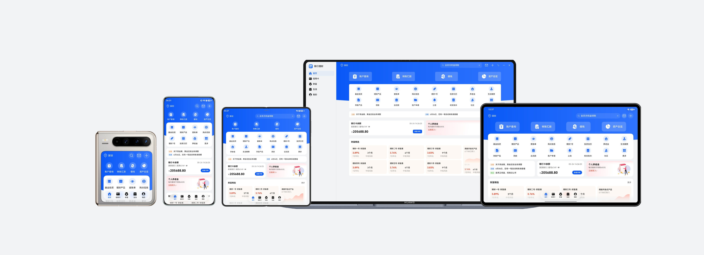
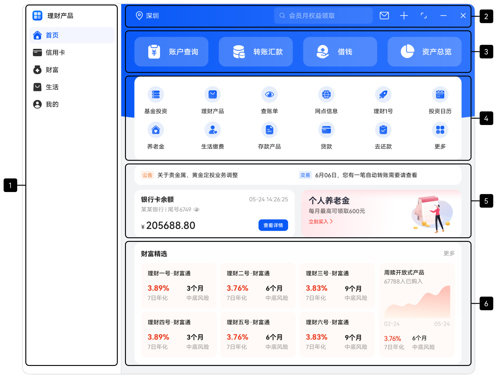
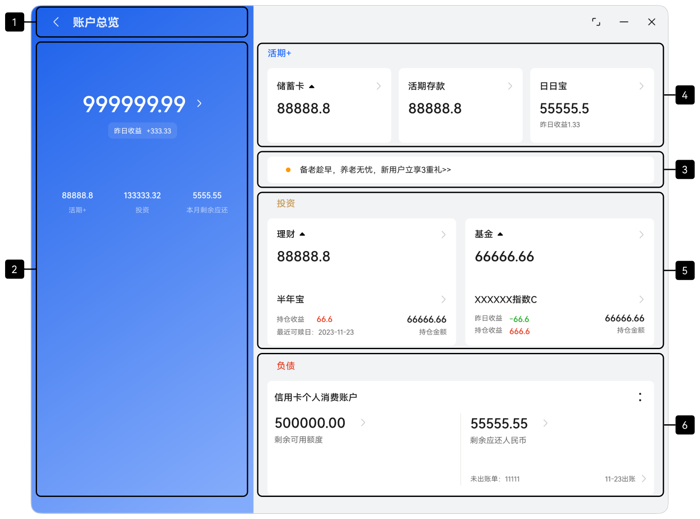
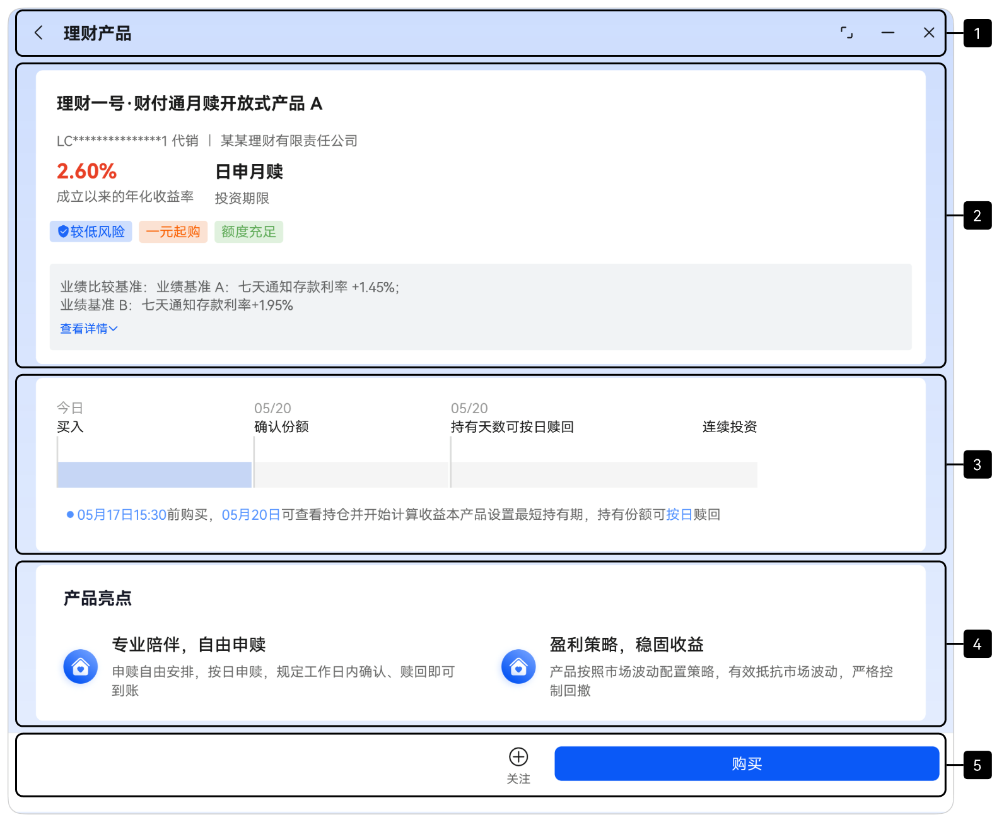
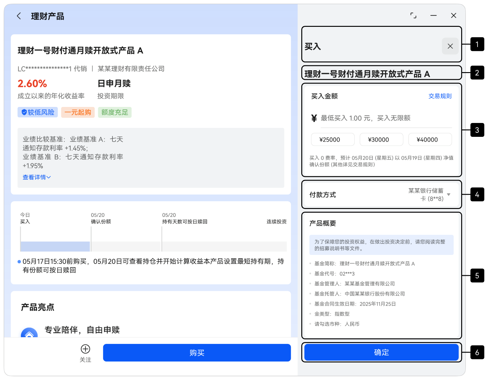

# 多设备银行理财界面

更新时间：2026-05-22 09:46:30

来源：https://developer.huawei.com/consumer/cn/doc/best-practices/multi-financial-app

#### 概述
本文从当前常见的多设备应用场景中选取银行理财应用作为典型案例，详细阐述“一多”理念在实际开发中的应用。银行理财应用在大屏幕设备上使用时，需保障用户办理金融业务的顺畅性，同时提升屏幕交互效率。多设备银行理财应用围绕首页、账户总览、理财详情和购买流程展开，覆盖了用户从资产入口浏览、产品查看到购买确认的核心链路。
当前应用已适配的设备包括：直板机、双折叠（Mate X系列）、三折叠、阔折叠、平板和电脑。

> [!NOTE] 说明
> 阅读本文前，建议开发者先了解ArkUI（方舟UI框架）和一次开发，多端部署概览相关知识。

下文将从UX设计、工程管理、页面开发三个方面，系统介绍银行理财应用在实际开发中的最佳实践，为开发者提供可借鉴的实现思路。
- [UX设计](#section99762271515)：介绍银行理财应用的交互逻辑与通用的设计要点，开发者可直接参考同类设计要点。
- [工程管理](#section719020851716)：介绍“一多”工程所需配置，并推荐采用结构更清晰的三层架构。
- [移动端页面](#section202931220101020)和[电脑端页面](#section5748352172710)：遵循实际应用开发流程，以页面为基本单元，依次讲解窗口适配、页面开发的设计思路与实现方法。

#### UX设计
应用的UX设计可参考[金融理财类](https://developer.huawei.com/consumer/cn/doc/design-guides/responsive-design-examples6-0000001793536905)的多设备响应式设计指南，设计参考图如下所示。



#### 工程管理
为确保“一多”工程代码的复用性与可维护性，建议开发者采用分层架构组织代码工程。该架构将项目划分为产品定制层（products）、基础特性层（features）和公共能力层（commons）三个层级，各层级权责明确且功能独立，为开发者提供了清晰、高效且可扩展的设计方案。关于分层架构的具体设计细节，可参考[分层架构设计](https://developer.huawei.com/consumer/cn/doc/best-practices/bpta-layered-architecture-design)。

#### 创建工程
建议开发者参考[多设备工程部署与发布](https://developer.huawei.com/consumer/cn/doc/best-practices/bpta-multi-device-ide)相关内容，掌握分层架构工程的创建与配置方法后，创建模板项目工程。根据银行理财应用的开发需求进行针对性修改，确保工程架构贴合实际业务需求。

#### 工程结构
银行理财应用采用推荐的分层架构，将代码工程按products、features、commons三个层级组织。各层级设计如下：
- products层：银行理财应用需要适配的设备包括直板机、双折叠（Mate X系列）、三折叠、阔折叠、平板和电脑。由于电脑界面布局与其他设备差异较大，因此单独创建名为“pc”的HAP包作为电脑设备的应用入口；直板机、双折叠（Mate X系列）、三折叠、阔折叠及平板设备上的界面布局整体相似，部分差异可以通过“一多”的[自适应布局](https://developer.huawei.com/consumer/cn/doc/best-practices/bpta-multi-device-adaptive-layout)和[响应式布局](https://developer.huawei.com/consumer/cn/doc/best-practices/bpta-multi-device-responsive-layout)进行适配，为此创建名为“default”的HAP包作为这些设备的应用入口。
- features层：包含四个核心业务模块——账户（account）、投资（investment）、理财产品（wealth）和推荐（recommend）。为各模块分别创建对应HAR包，供products层按需引用。各模块相对独立，互不依赖，便于后续维护与迭代。
- commons层：为实现代码复用并减少冗余，集中存放公共常量、日志工具类及窗口管理工具等基础能力，供其他模块统一调用。
工程结构如下：

```ts
├──commons/financialbase                                 
│  └──src/main
│     ├──ets
│     │  ├──constants                         // 公共常量定义
│     │  └──utils                             // 工具类与窗口能力封装
│     └──resources                            // 公共资源
├──features                                   
│  ├──account                                 // 账户模块
│  │  └──src/main
│  │     ├──ets
│  │     │  ├──components                     // 账户模块页面组件
│  │     │  ├──constants                      // 账户模块常量
│  │     │  ├──model                          // 账户模块数据模型
│  │     │  └──viewmodel                      // 账户模块视图模型
│  │     └──resources                         // 账户模块资源
│  ├──investment                              // 投资模块
│  │  └──src/main
│  │     ├──ets
│  │     │  ├──components                     // 购买模块页面组件
│  │     │  ├──model                          // 购买模块数据模型
│  │     │  └──viewmodel                      // 投资模块视图模型
│  │     └──resources                         // 投资模块资源
│  ├──wealth                                  // 理财产品模块
│  │  └──src/main
│  │     ├──ets
│  │     │  ├──components                     // 产品与卖点展示组件
│  │     │  ├──model                          // 产品模块数据模型
│  │     │  └──viewmodel                      // 产品模块视图模型
│  │     └──resources                         // 产品模块资源
│  └──recommend                               // 推荐内容特性
│     └──src/main
│        ├──ets
│        │  ├──components                     // 推荐模块组件
│        │  ├──model                          // 推荐模块数据模型
│        │  └──viewmodel                      // 推荐模块视图模型
│        └──resources                         // 推荐模块资源
└──products                                    
   ├──default                                 // 手机/平板设备
   │  └──src/main
   │     ├──ets
   │     │  ├──entryability                   // 入口类
   │     │  ├──model                          // 数据模型
   │     │  ├──pages                          // 页面
   │     │  ├──view                           // 组件
   │     │  └──viewmodel                      // 视图模型
   │     └──resources                         // 资源文件
   └──pc                                      // PC设备
      └──src/main
         │  ├──model                          // 数据结构
         │  ├──pages                          // 页面
         │  ├──pcbackupability                // 数据备份与恢复扩展能力
         │  ├──view                           // 组件
         │  └──viewmodel                      // 视图模型
         └──resources                         // 资源文件
```

#### 移动端页面
本章介绍如何针对直板机、双折叠（Mate X系列）、三折叠、阔折叠及平板设备上的银行理财应用，利用“一多”布局能力，实现页面层级“一套代码、多端适配”的目标。同时，阐述这些设备上的窗口适配方案。

#### 窗口适配
- 窗口模式适配设备支持全屏、分屏、悬浮窗和自由窗口模式，具体参见窗口模式。其中，分屏模式与悬浮窗无需特殊设计，可通过系统方式进入。应用内监听窗口尺寸变化，通过断点刷新UI，即可自动适配全屏、分屏、悬浮窗和自由窗口模式下的布局。
- 窗口方向在model.json5配置文件中将orientation字段设置为follow_desktop（跟随桌面的旋转模式），详情可参考为应用配置旋转策略。
- 窗口沉浸式根据UX设计，需实现不同窗口模式（全屏、分屏、悬浮窗、自由窗口）下的沉浸式效果，可参考窗口沉浸式。推荐开发者使用实现沉浸式效果中的组件级沉浸方案（组件设置页面沉浸），同时进行动态安全区避让，确保沉浸式显示效果。自由窗口模式下，使用window.setWindowDecorVisible(false)隐藏标题栏，仅保留右上角三键，使应用页面延伸至标题栏区域，实现沉浸式显示效果。

#### 首页
银行理财应用首页主要承担业务入口、消息公告、卡片内容和财富推荐的聚合展示。根据功能设计，应用首页相关内容划分为6个区域，效果图如下：

| 横向断点 | sm | md | lg、xl |
| --- | --- | --- | --- |
| 首页 |  |  |  |

**界面开发**
具体介绍及实现方案如下表所示：

| 区域编号 | 简介 | 实现方案 |
| --- | --- | --- |
| 1 | 底部Tabs | 使用HdsTabs实现，通过barfloatingstyle属性为页签设置悬浮样式，确保移动端底部触达优先。 |
| 2 | 顶部栏 | 展示城市、搜索和常用操作。结合组件的layoutWeight属性，实现左侧城市在不同断点下的自适应拉伸效果。小屏下搜索功能收敛为搜索图标，中大屏展开为搜索框；左右内边距随断点变化。 |
| 3 | 主业务快捷区 | 使用Row横向布局，通过监听不同断点的变化，动态调整左右内边距。sm、md断点下，图标和文字纵向排布，lg、xl断点下切换为横向排布。 |
| 4 | 业务宫格区 | 使用网格容器Grid实现。通过columnsTemplate属性，动态调整不同断点下的显示列数。 |
| 5 | 消息卡片、银行卡信息、个人养老金 | 使用响应式布局的栅格系统（GridRow、GridCol）实现。通过监听断点变化，实现响应式排列。横向sm断点下，三个卡片纵向堆叠；md断点下，消息卡片独占一行，银行卡信息和养老金卡片并排；lg断点以上，三个卡片同行均分排列。 |
| 6 | 财富精选 | 使用响应式布局的栅格系统（GridRow、GridCol）实现，断点变化时同步调整列表数量和右侧扩展内容，确保不同设备上的信息密度平衡。 |

#### 账户总览页
账户总览页用于展示用户总资产、昨日收益概览，以及活期、投资、负债等资产模块的分区信息。根据功能设计，应用账户总览页相关内容划分为6个区域，效果图如下：

| 横向断点 | sm | md | lg、xl |
| --- | --- | --- | --- |
| 账户总览页 |  |  |  |

**界面开发**
具体介绍及实现方案如下表所示：

| 区域编号 | 简介 | 实现方案 |
| --- | --- | --- |
| 1 | 标题栏 | 通过HdsNavDestination组件的titleBar属性，为标题栏设置沉浸样式与动态模糊样式。 |
| 2 | 总览面板 | 整体采用挪移布局，使用响应式栅格系统（GridRow、GridCol）实现两栏布局。通过columns属性定义不同断点下的栅格列数（可参考GridRowOptions对象说明），并使用span属性控制各区域在不同断点下的占比。 |
| 3 | 产品推荐（个人养老金） | 使用Row横向布局，通过监听不同断点的变化，动态调整左右内边距。 |
| 4 | 活期存款 | sm断点：使用Column纵向堆叠显示。md断点：使用Row横向排列，中间添加垂直分割线。lg及以上断点：使用Row横向排列三个卡片，每个卡片使用layoutWeight属性均分宽度。 |
| 5 | 投资（理财卡片、基金卡片） | 使用响应式布局的栅格系统（GridRow、GridCol）实现。通过监听断点变化，实现响应式排列。sm断点：每个卡片占满整行。md及以上断点：两个卡片并排显示。 |
| 6 | 负债 | sm断点：纵向堆叠显示，包含剩余应还、未出账单、可用额度三个部分。md断点：使用Row横向布局，剩余应还和未出账单作为一组，可用额度作为另一组，中间添加垂直分割线。lg及以上断点：使用Row横向布局，可用额度和剩余应还信息并排显示，中间添加垂直分割线，布局更加丰富。 |

#### 理财详情页
理财详情页用于展示理财产品的关键信息、交易时间线及产品亮点，并提供“关注/买入”的底部操作入口。根据功能设计，将应用首页相关内容划分为5个区域，效果图如下：

| 横向断点 | sm | md | lg、xl |
| --- | --- | --- | --- |
| 理财详情页 |  |  |  |

**界面开发**
具体介绍及实现方案如下表所示：

| 区域编号 | 简介 | 实现方案 |
| --- | --- | --- |
| 1 | 标题栏 | 在父组件Row中分别实现返回按钮及标题文字。通过Stack组件控制理财详情页组件的层级，确保标题栏始终显示在理财详情页的最上层。 |
| 2 | 产品信息卡片 | 使用Flex布局和条件渲染。通过监听断点变化，动态调整内边距。 sm断点：纵向排列产品元信息（产品代码、销售类型、公司名称）。md及以上断点：横向排列，中间添加分隔符。 |
| 3 | 时间轴卡片 | 使用网格容器Grid定义4列网格，比例固定，通过监听断点变化，动态调整内边距。通过constraintSize属性约束卡片最大宽度，避免在大屏上过度拉伸。 |
| 4 | 产品亮点 | 使用响应式布局的栅格系统（GridRow、GridCol）实现。通过监听断点变化，实现响应式排列。 sm断点：每个卡片占满整行。md及以上断点：两个卡片并排显示。 |
| 5 | 底部操作栏 | 在父组件Row中分别实现关注按钮及购买按钮。使用layoutWeight属性控制不同断点下的布局权重。通过Stack组件控制理财详情页组件的层级，确保底部操作栏始终显示在理财详情页的最下层。 |

#### 购买页
购买页用于完成理财产品的申购确认，用户在此确认金额、选择付款方式并核对产品信息。根据功能设计，将应用首页相关内容划分为6个区域，效果图如下：

| 横向断点 | sm | md | lg、xl |
| --- | --- | --- | --- |
| 购买页 |  |  |  |

**界面开发**
在sm断点下，使用[bindsheet](https://developer.huawei.com/consumer/cn/doc/harmonyos-references/ts-universal-attributes-sheet-transition#bindsheet)为组件绑定半模态页面，md及以上断点，使用[Navigation](https://developer.huawei.com/consumer/cn/doc/harmonyos-references/ts-basic-components-navigation)实现双栏。具体实现方案如下表所示：

| 区域编号 | 简介 | 实现方案 |
| --- | --- | --- |
| 1 | 标题栏 | 在父组件Row中分别实现标题文字和关闭按钮，通过justifycontent属性设置在水平方向均匀分配弹性元素。通过Stack组件控制购买页组件的层级，确保标题栏始终显示在购买页的最上层。 |
| 2 | 产品名称 | 使用Text组件实现。 |
| 3 | 购买金额卡片 | 使用Row布局，左侧显示"购买金额"，右侧显示"交易规则"。 输入区域：使用TextInput组件实现，通过type属性限制输入类型。 快捷金额按钮：使用Row组件水平排列。 |
| 4 | 支付方式卡片 | 使用Row水平布局，左侧显示"支付方式"，右侧显示银行卡信息和下拉箭头。 |
| 5 | 产品摘要信息 | 使用Column组件垂直排列7个摘要项，使用space属性控制垂直边距。 |
| 6 | 底部确认按钮 | 通过Stack组件控制购买页组件的层级，确保底部确认按钮始终显示在购买页的最下层。 |

#### 电脑端页面
本章介绍如何基于现有移动端界面开发方案，实现代码逻辑与布局复用，高效完成电脑设备上银行理财应用的界面开发。

#### 首页
银行理财应用首页主要承担业务入口、消息公告、卡片内容和财富推荐的聚合展示。根据功能设计，应用首页相关内容划分为6个区域，效果图如下：


**界面开发**
具体介绍及实现方案如下表所示：

| 区域编号 | 简介 | 实现方案 |
| --- | --- | --- |
| 1 | 侧边栏 | 使用侧边栏容器SideBarContainer实现。 |
| 2 | 顶部栏 | 展示城市、搜索和常用操作。结合组件的layoutWeight属性，实现左侧城市在不同断点下的自适应拉伸效果。 |
| 3 | 主业务快捷区 | 使用Row横向布局，通过监听不同断点的变化，动态调整左右内边距。sm、md断点下，图标和文字纵向排布，lg、xl断点下切换为横向排布。 |
| 4 | 业务宫格区 | 使用网格容器Grid实现。通过columnsTemplate属性，动态调整不同断点下的显示列数。 |
| 5 | 消息卡片、银行卡信息、个人养老金 | 使用响应式布局的栅格系统（GridRow、GridCol）实现。消息卡片独占一行，银行卡信息和养老金卡片并排。 |
| 6 | 财富精选 | 复用移动端设备布局方案，同移动端首页区域6的布局实现方案。 |

#### 账户总览页
账户总览页用于展示用户总资产、昨日收益概览，及活期、投资、负债等资产模块的分区信息。根据功能设计，应用账户总览页相关内容划分为6个区域，效果图如下：


**界面开发**
具体介绍及实现方案如下表所示：

| 区域编号 | 简介 | 实现方案 |
| --- | --- | --- |
| 1 | 标题栏 | 在父组件Row中分别实现返回按钮及标题文字。通过Stack组件控账户总览页组件的层级，确保标题栏始终显示在账户总览页的最上层。 |
| 2 | 总览面板 | 复用移动端设备布局方案，同移动端账户总览页对应区域的布局实现方案。 |
| 3 | 产品推荐 |  |
| 4 | 活期存款 |  |
| 5 | 投资（理财卡片、基金卡片） |  |
| 6 | 负债信息 |  |

#### 理财详情页页
理财详情页用于展示单个理财产品的关键信息、交易时间线及产品亮点，并提供“关注/买入”的底部操作入口。根据功能设计，将应用首页相关内容划分为5个区域，效果图如下：


**界面开发**
具体介绍及实现方案如下表所示：

| 区域编号 | 简介 | 实现方案 |
| --- | --- | --- |
| 1 | 标题栏 | 在父组件Row中分别实现返回按钮及标题文字。 |
| 2 | 产品信息卡片 | 复用移动端设备布局方案，同移动端理财详情页对应区域的布局实现方案。 |
| 3 | 时间轴卡片 |  |
| 4 | 产品亮点 |  |
| 5 | 底部操作栏 | 在父组件Row中分别实现关注按钮及购买按钮。购买按钮使用固定宽度，通过justifycontent属性设置在水平方向尾部对齐。 |

#### 购买页
购买页用于完成理财产品的申购确认，用户在此确认金额、选择付款方式并核对产品信息。根据功能设计，将应用首页相关内容划分为6个区域，效果图如下：


**界面开发**
具体介绍及实现方案如下表所示：

| 区域编号 | 简介 | 实现方案 |
| --- | --- | --- |
| 1 | 标题栏 | 复用移动端设备布局方案，同移动端购买页对应区域的布局实现方案。 |
| 2 | 产品名称 |  |
| 3 | 购买金额卡片 |  |
| 4 | 支付方式卡片 |  |
| 5 | 产品摘要信息 |  |
| 6 | 底部确认按钮 |  |

#### 示例代码
[多设备银行理财界面](https://gitcode.com/HarmonyOS_Samples/MultiFinancialManagement)