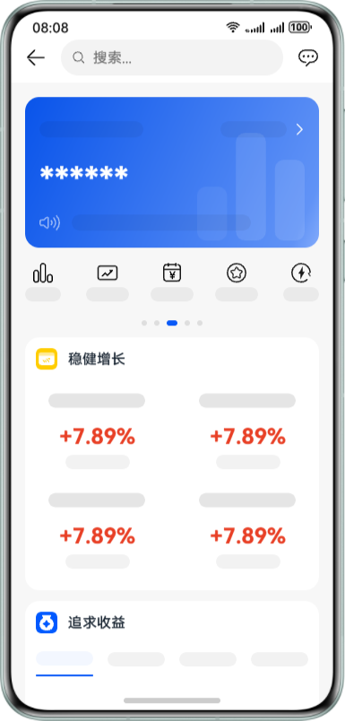

# 多设备银行理财界面

更新时间：2026-03-26 08:46:30

来源：https://developer.huawei.com/consumer/cn/doc/best-practices/multi-financial-app

## 概述


本文以银行理财应用作为典型案例详细介绍“一多”在实际开发中的应用。银行理财应用在大屏幕设备上使用时，不仅要保障用户在办理金融业务过程中的正常使用，还要提升屏幕的交互效率。具体功能包括首页推荐、产品专题、产品详情、产品对比和收益明细。

当前示例适配的产品形态包括直板机、双折叠（Mate X系列）、平板三种。下面的章节将分别从架构设计、UX设计、页面开发三个角度给出推荐的参考样例，介绍“一多”银行理财应用在开发过程中的最佳实践。


> [!NOTE]
> 阅读本文前，开发者需熟悉[ArkUI（方舟UI框架）](https://developer.huawei.com/consumer/cn/doc/harmonyos-guides/arkui)和页面开发的“一多”能力（参考[一次开发，多端部署概览](https://developer.huawei.com/consumer/cn/doc/best-practices/bpta-multi-device-overview)）。下文将详细介绍它们在“一多”开发实践中如何使用。


## 架构设计


HarmonyOS的分层架构主要包括三个层次：产品定制层、基础特性层和公共能力层，为开发者构建了一个清晰、高效、可扩展的设计架构。更多详细信息请参考分层架构设计的逻辑设计。


## UX设计


参考金融理财类的多设备响应式设计指南。


银行理财应用包含以下设计要点：弹窗、延伸布局、分栏、底部/侧边页签、列表重复布局。底部/侧边页签、列表重复布局在其他的“一多”案例中有详细的介绍，本案例以弹窗和延伸布局以及分栏为重点进行介绍。


弹窗使用自定义弹窗CustomDialog实现，首次打开应用时通过CustomDialogController类显示自定义弹窗。





使用list组件实现产品专题页面中的稳健增长信息。通过设置不同断点下的列数，实现延伸布局，以便在大屏上显示更多信息，提升屏幕交互效率。


产品详情页面使用 Navigation 实现分栏效果。在手机上，内容单栏显示；在平板等大屏设备上，内容分栏显示，左侧为导航区，右侧为内容区。点击“稳健增长”下的内容可控制右侧内容区的信息展示。


## 页面开发


本章节选取页面关键区域进行“一多”页面布局能力介绍。


### 弹窗


弹窗使用自定义弹窗 (CustomDialog)实现，在初始化弹窗时设置customStyle为true，则弹窗样式由开发者自定义，在sm、md、lg不同的断点设置固定的宽高值，使弹窗的大小在不同设备显示相差不大。


| 示意图 | sm | md | lg |
| --- | --- | --- | --- |
| 设计能力点 |  |  |  |
| 效果图 |  |  |  |


```ts
@Entry
@Component
struct Index {
  // ...
  dialogController: CustomDialogController = new CustomDialogController({
    builder: AdvertisementDialog(),
    backgroundColor: $r('app.color.dialog_background'),
    alignment: DialogAlignment.Center,
    maskColor: $r('app.color.dialog_mask'),
    customStyle: true
  });

  aboutToAppear() {
    this.dialogController.open();
  }
  // ...
}
```


### 延伸布局


延伸布局使用List列表来实现，在不同断点条件下，使用list加载不同数量的数据，并设置list的lanes属性以显示不同列数：sm、md、lg下分别显示2列、3列、5列。这样可以确保数据在不同设备上显示合适数量，提高屏幕交互效率。


| 示意图 | sm | md | lg |
| --- | --- | --- | --- |
| 设计能力点 |  |  |  |
| 效果图 |  |  |  |


```ts
List() {
  ForEach(new BreakpointUtil({
    sm: FundingViewModel.getAllFundInfo(0, 2),
    md: FundingViewModel.getAllFundInfo(0, 4),
    lg: FundingViewModel.getAllFundInfo(0, 6)
  }).getValue(this.currentPoint), (item: FundDetail) => {
    ListItem() {
      Row() {
        Text(item.amplitude)
        .fontSize('24fp')
        .fontColor('#E84026')
        .fontWeight(700)
        Text(item.name)
        .fontSize('16fp')
        .fontWeight(500)
        .fontFamily('HarmonyHeiTi-Medium')
        .margin({ left: '16vp' })
      }
      .justifyContent(FlexAlign.SpaceAround)
    }
  })
}
.lanes(new BreakpointUtil({ sm: 1, md: 2, lg: 3 }).getValue(this.currentPoint))
.width(CommonConstants.FULL_WIDTH_PERCENT)
```


### 分栏


分栏布局通过Navigation实现，在断点为lg时，设置mode属性为NavigationMode.Split，实现分栏效果。在其他断点下，设置mode属性为NavigationMode.Stack，显示单栏效果。


| 示意图 | sm | md | lg |
| --- | --- | --- | --- |
| 设计能力点 |  |  |  |
| 效果图 |  |  |  |


```ts
Navigation(this.pageInfo) {
  FundNavigationComponent({ listIndex: this.index })
}
.navDestination(this.buildNavDestination)
.hideTitleBar(true)
.hideBackButton(true)
.mode(this.breakPoint === 'lg' ? NavigationMode.Split : NavigationMode.Stack)
.navBarWidth('40%')
```

```ts
@Builder
buildNavDestination(name: string, param: object) {
  if (name === 'detail') {
    if (typeof param === 'number') {
      DetailComponent({ indexList: param })
    }
  } else if (name === 'comparison') {
    ComparisonComponent()
  } else if (name === 'comparisonDetail') {
    NavDestination() {
      ComparisonDetailComponent({ chooseComparison: (param as ComparisonInfo[]) })
    }
    .hideTitleBar(true)
  } else if (name === 'buying') {
    if (typeof param === 'number') {
      TransactionComponent({ indexList: param })
    }
  }
}
```


## 示例代码


- [多设备银行理财界面](https://gitcode.com/harmonyos_codelabs/MultiFinancialManagement)
