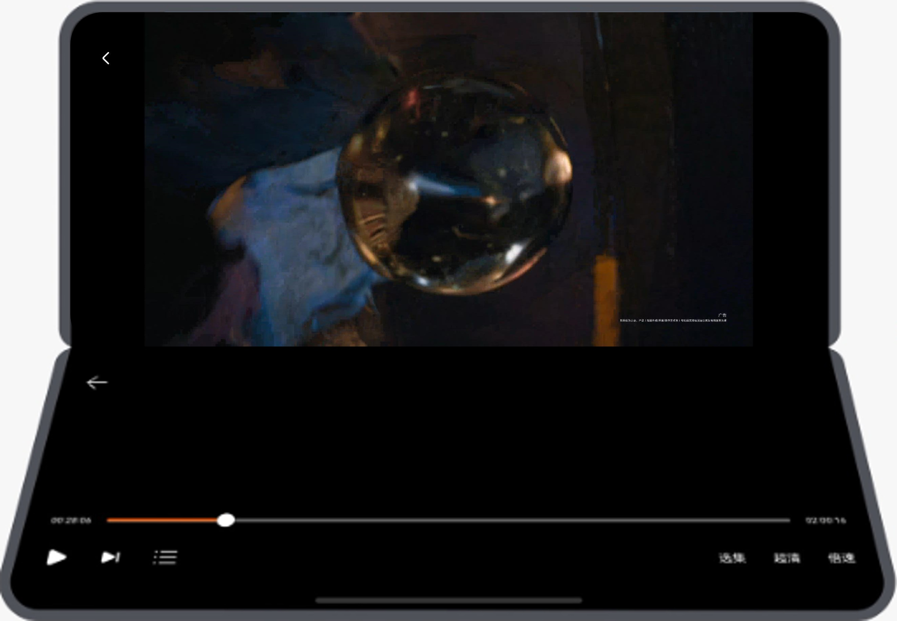

# 多设备长视频界面

更新时间：2026-04-27 09:23:00

来源：https://developer.huawei.com/consumer/cn/doc/best-practices/multi-video-app

## 概述


本文从当前常见的多设备应用场景中，选取长视频行业应用作为典型案例，详细介绍“一多”在实际开发中的应用。

长视频应用的核心在于沉浸式播放与用户互动，主要功能模块包含首页推荐、视频搜索、视频详情、视频评论、全屏播放等。基于这些核心功能，本文选取首页、搜索页和视频详情页作为典型页面进行开发。开发过程遵从多设备的“差异性”、“一致性”、“灵活性”和“兼容性”，帮助开发者快速掌握“一多”开发能力，高效实现长视频应用的相关功能。

当前应用已适配的设备包括：直板机、双折叠（Mate X系列）、三折叠、阔折叠、平板、电脑和智慧屏。


> [!NOTE]
> 在阅读本文前，建议开发者先了解[ArkUI（方舟UI框架）](https://developer.huawei.com/consumer/cn/doc/harmonyos-guides/arkui)和[一次开发，多端部署概览](https://developer.huawei.com/consumer/cn/doc/best-practices/bpta-multi-device-overview)相关知识。


下文将从UX设计、工程管理、页面开发三个角度，详细介绍长视频应用在实际开发中的最佳实践，为开发者提供可参考的落地思路。

- [UX设计](#section17797105112306)：介绍长视频应用的交互逻辑和通用设计要点，可供同类长视频应用开发者直接参考。
- [工程管理](#section189781175313)：推荐“一多”应用采用分层架构，通过清晰的目录结构组织工程，明确各层逻辑。同时，介绍长视频应用适用的架构配置。
- [移动端页面](#section7318163817529)和[智慧屏页面](#section67231377369)：遵循实际应用开发流程，以页面为基本单元，逐项讲解各页面在窗口适配、页面开发、交互开发和功能开发上的设计思路与实现方法。


## UX设计


长视频应用的UX设计可参考影音娱乐类多设备响应式设计指南的长视频章节，设计参考图如下所示。


## 工程管理


考虑到“一多”工程代码的复用性和可维护性，推荐开发者使用分层架构组织代码工程。分层架构将项目工程划分为产品定制层（products）、基础特性层（features）和公共能力层（common）三个层级，各层级权责清晰、各司其职，为开发者提供了一套清晰、高效且可扩展的设计架构。关于分层架构的具体设计细节，可参考分层架构设计。


### 创建工程


建议开发者参考多设备工程部署与发布相关内容，掌握分层架构工程的创建与配置方法后，创建出模板项目工程。然后根据长视频应用的开发需求进行针对性修改，确保工程架构贴合实际业务需求。


### 工程结构


长视频应用根据推荐的分层架构按照products、features、common三个层级组织代码工程。每个层级的设计如下：

- products层：长视频应用需要适配的设备包括直板机、双折叠（Mate X系列）、三折叠、阔折叠、平板、电脑和智慧屏。由于智慧屏设备的界面布局与其他设备差异较大，因此在products层单独创建名称为“tv”的HAP包作为智慧屏的应用入口；而直板机、双折叠（Mate X系列）、三折叠、阔折叠、平板和电脑设备上的界面布局整体相似，部分差异可以通过“一多”的[自适应布局](https://developer.huawei.com/consumer/cn/doc/best-practices/bpta-multi-device-adaptive-layout)和[响应式布局](https://developer.huawei.com/consumer/cn/doc/best-practices/bpta-multi-device-responsive-layout)进行适配，因此在products层创建一个名称为“default”的HAP包作为这些设备的应用入口。
- features层：长视频应用主要包含三个核心业务模块，分别是首页（home）、搜索页（search）和视频详情页（videoDetail）。在features层为三个业务模块分别创建对应的HAR包，供products层按需引用。三个业务模块相对独立，互不依赖，便于后续维护与迭代。
- common层：为实现代码复用、减少冗余，在common层创建一个基础（base）能力HAR包。集中存放公共常量、媒体播放工具以及窗口管理工具等需要被多个模块共用的基础能力，供其他模块统一调用。


工程结构如下：
```text
├──common // common
│  ├──base/src/main/ets // ArkTS source code of basic capability
│  │  ├──constants
│  │  └──utils
│  └──base/Index.ets // external interface class of basic capability
├──features // features
│  ├──home/src/main/ets // ArkTS source code of home page
│  │  ├──constants
│  │  ├──model
│  │  ├──utils
│  │  ├──view
│  │  └──viewmodel
│  ├──home/src/main/resources // resource directory of home page
│  ├──home/Index.ets // external interface class of home page
│  ├──search/src/main/ets // ArkTS source code of search page
│  │  ├──constants
│  │  ├──model
│  │  ├──view
│  │  └──viewmodel
│  ├──search/src/main/resources // resource directory of search page
│  ├──search/Index.ets // external interface class of search page
│  ├──videoDetail/src/main/ets // ArkTS source code of video detail page
│  │  ├──constants
│  │  ├──model
│  │  ├──utils
│  │  ├──view
│  │  └──viewmodel
│  ├──videoDetail/src/main/resources // resource directory of video detail page
│  └──videoDetail/Index.ets // external interface class of video detail page
└──products // products
├──default/src/main/ets // ArkTS source code of mobile devices(Bar phone, Bi-fold phone(Mate X series), Tri-fold phone, Widescreen foldable phone, Tablet, PC/2-in-1 device)
│  ├──constants
│  ├──entryability
│  ├──pages
│  ├──view
│  └──viewmodel
├──default/src/main/resources // resource directory of mobile devices
├──tv/src/main/ets // ArkTS source code of Vision
│  ├──constants
│  ├──pages
│  ├──tvability
└──tv/src/main/resources // resource directory of Vision
```


## 移动端页面


本章介绍如何针对直板机、双折叠（Mate X系列）、三折叠、阔折叠、平板和电脑设备上的长视频应用，使用“一多”布局能力，实现页面层级“一套代码、多端适配”的目标。同时，介绍这些设备上的窗口适配方案，以及各页面的交互开发和功能开发方案。


### 窗口适配


- 窗口模式适配设备支持全屏、分屏、悬浮窗和自由窗口模式，具体参见[窗口模式](https://developer.huawei.com/consumer/cn/doc/best-practices/bpta-multi-device-window-mode)。其中，分屏模式与悬浮窗通常无特殊设计，可通过系统方式进入。应用内监听窗口尺寸变化，[通过断点刷新UI](https://developer.huawei.com/consumer/cn/doc/best-practices/bpta-multi-device-responsive-layout#section175001836203617)，即可自动适配全屏、分屏、悬浮窗、自由窗口模式下的布局。
- 窗口方向可以通过[window.setPreferredOrientation()](https://developer.huawei.com/consumer/cn/doc/harmonyos-references/arkts-apis-window-window#setpreferredorientation9)设置窗口方向显示类型。窗口方向包含四种类型，分别是竖屏、横屏、反向竖屏和反向横屏。相关内容可参考[窗口方向](https://developer.huawei.com/consumer/cn/doc/best-practices/bpta-multi-device-window-direction)。在长视频应用中，仅视频详情页进入到全屏播放模式时，进行特殊窗口方向设置。当窗口处于sm横向断点+lg纵向断点或md横向断点+sm纵向断点时，设置为[AUTO_ROTATION_LANDSCAPE_RESTRICTED](https://developer.huawei.com/consumer/cn/doc/harmonyos-references/arkts-apis-window-e#orientation9)窗口策略。除上述场景外，均设置应用为[跟随桌面的旋转模式](https://developer.huawei.com/consumer/cn/doc/harmonyos-guides/window-rotation#其他方向类型)。
- 窗口沉浸式根据UX设计，需要实现不同窗口模式（全屏、分屏、悬浮窗、自由窗口）下的沉浸式效果，可参考[窗口沉浸式](https://developer.huawei.com/consumer/cn/doc/best-practices/bpta-multi-device-window-immersive)。全屏、分屏和悬浮窗模式下的沉浸式均可通过[window.setWindowLayoutFullscreen()](https://developer.huawei.com/consumer/cn/doc/harmonyos-references/arkts-apis-window-window#setwindowlayoutfullscreen9)实现。同时需要进行动态安全区避让，确保沉浸式显示效果。自由窗口模式下使用[window.setWindowDecorVisible(false)](https://developer.huawei.com/consumer/cn/doc/harmonyos-references/arkts-apis-window-window#setwindowdecorvisible11)设置隐藏标题栏，仅保留右上角三键。此时，应用页面拓展至标题栏区域，实现沉浸式显示效果。


### 首页


长视频应用首页主要用于推荐精选视频，满足用户观看需求。根据功能设计，将应用首页相关内容划分为8个区域，效果图如下：


| 横向（/纵向）断点 | sm/md | sm/lg | md | lg | xl |
| --- | --- | --- | --- | --- | --- |
| 首页-精选页Tab |  |  |  |  |  |


界面开发

首页借助“一多”自适应布局的延伸能力、缩放能力和响应式布局的栅格系统，实现不同断点下的布局效果。

- 首页区域1使用Tabs组件或侧边栏实现，在不同断点下分别实现侧边显示或底部显示。
- 首页区域2使用响应式布局的栅格系统，在不同断点下分别实现单行显示或两行显示。
- 首页区域3使用自适应布局的延伸能力和缩放能力，实现Banner图在不同断点下宽高比和视窗内显示元素个数的自适应变化。
- 首页区域5-8使用响应式布局的栅格系统和自适应布局的缩放能力，实现视频封面相关组件在不同断点下宽高比和布局效果的自适应变化。


具体介绍及实现方案如下表所示：


| 区域编号 | 简介 | 实现方案 |
| --- | --- | --- |
| 1 | 底部/侧边页签 | 使用响应式组件[Tabs](https://developer.huawei.com/consumer/cn/doc/harmonyos-references/ts-container-tabs)或侧边栏容器[SideBarContainer](https://developer.huawei.com/consumer/cn/doc/harmonyos-references/ts-container-sidebarcontainer)实现。在横向断点为sm或md时，组件底部显示；在横向断点为lg或xl时，组件侧边显示。 |
| 2 | 顶部页签及搜索框 | 使用响应式布局的栅格系统实现。通过监听断点变化，实现折行显示。在横向断点为sm或md时，组件两行显示；在横向断点为lg或xl时，组件单行显示。结合组件的[layoutWeight](https://developer.huawei.com/consumer/cn/doc/harmonyos-references/ts-universal-attributes-size#layoutweight)属性，实现顶部页签在不同断点下的自适应拉伸效果。 |
| 3 | Banner图 | 使用响应式组件[Swiper](https://developer.huawei.com/consumer/cn/doc/harmonyos-references/ts-container-swiper)实现。通过[displayCount](https://developer.huawei.com/consumer/cn/doc/harmonyos-references/ts-container-swiper#displaycount8)属性控制视窗内显示元素数量。在横向断点为sm或md时，视窗内显示1个元素；在横向断点为lg或xl时，视窗内显示2个元素。结合[aspectRatio](https://developer.huawei.com/consumer/cn/doc/harmonyos-references/ts-universal-attributes-layout-constraints#aspectratio)属性，实现Banner图在不同断点下的自适应缩放。 |
| 4 | 图标列表 | 使用响应式组件[List](https://developer.huawei.com/consumer/cn/doc/harmonyos-references/ts-container-list)实现。通过监听不同断点的变化，动态调整图标之间的间距。 |
| 5 | 推荐视频 | 使用网格容器[Grid](https://developer.huawei.com/consumer/cn/doc/harmonyos-references/ts-container-grid)实现。通过[columnsTemplate](https://developer.huawei.com/consumer/cn/doc/harmonyos-references/ts-container-grid#columnstemplate)属性，动态调整不同断点下的显示列数。结合[aspectRatio](https://developer.huawei.com/consumer/cn/doc/harmonyos-references/ts-universal-attributes-layout-constraints#aspectratio)属性，实现视频预览图在不同断点下的自适应缩放。 |
| 6 | 新片发布 |  |
| 7 | 每日佳片 | 使用响应式布局的栅格系统实现。通过挪移布局，实现不同断点下“上下布局”与“左右布局”之间的自适应切换。结合[aspectRatio](https://developer.huawei.com/consumer/cn/doc/harmonyos-references/ts-universal-attributes-layout-constraints#aspectratio)属性，实现视频预览图在不同断点下的自适应缩放。 |
| 8 | 往期回顾 |  |


在实际开发中，区域1为外层导航栏，区域2为内层导航栏，区域3-8为并列的首页内容，所以对应的开发顺序为区域1，区域2，区域3-8。另外，为了提升用户的使用体验，首页设计了额外的功能，包括社区页签沉浸式设计和Banner图创新排版。效果图如下所示。

- 社区页签沉浸式设计

| 横向（/纵向）断点 | sm/md | sm/lg | md | lg | xl |
| --- | --- | --- | --- | --- | --- |
| 首页-社区页Tab |  |  |  |  |  |

- Banner图创新排版

| 横向（/纵向）断点 | sm/md | sm/lg | md | lg | xl |
| --- | --- | --- | --- | --- | --- |
| 首页-视频页Tab的Banner图 |  |  |  |  |  |


交互开发

为提升长视频应用首页的用户浏览体验，需结合用户潜在需求进行交互开发。用户在浏览过程中，可能存在动态调整推荐视频数量、预览视频内容的需求。因此，除按照多设备交互开发要求完成基础操作适配外，额外提供了两项交互功能：推荐视频区域长按预览和推荐视频区域缩放。

- 推荐视频区域长按预览长视频应用适配了手机、平板、电脑三类设备，需支持的输入设备包括触控屏、手写笔、鼠标和触控板。 上述输入设备长按预览操作，统一在推荐视频区域首张图片的[LongPressGesture()](https://developer.huawei.com/consumer/cn/doc/harmonyos-references/ts-basic-gestures-longpressgesture)回调实现，通过拉起[自定义弹窗 (CustomDialog)](https://developer.huawei.com/consumer/cn/doc/harmonyos-references/ts-methods-custom-dialog-box)播放视频完成交互。 效果图如下表所示：

| 横向（/纵向）断点 | sm/md | sm/lg | md | lg | xl |
| --- | --- | --- | --- | --- | --- |
| 首页-推荐视频长按预览 |  |  |  |  |  |

- 推荐视频区域缩放长视频应用适配了手机、平板、电脑三类设备，需支持的输入设备包括触控屏、手写笔、鼠标和触控板。 上述输入设备的缩放操作，统一在推荐视频区域的[PinchGesture()](https://developer.huawei.com/consumer/cn/doc/harmonyos-references/ts-basic-gestures-pinchgesture)回调中实现，通过修改网格布局的[columnsTemplate](https://developer.huawei.com/consumer/cn/doc/harmonyos-references/ts-container-grid#columnstemplate)属性动态调整布局效果。 效果图如下表所示：

| 横向（/纵向）断点 | md | lg | xl |
| --- | --- | --- | --- |
| 首页-推荐视频区域缩放 |  |  |  |


### 搜索页


长视频应用搜索页主要用于响应用户输入并提供相关提示，同时展示搜索结果。根据功能设计，将应用搜索页相关内容划分为5个区域，效果图如下：


| 横向（/纵向）断点 | sm/md | sm/lg | md | lg | xl |
| --- | --- | --- | --- | --- | --- |
| 搜索页 |  |  |  |  |  |
| 搜索输入页 |  |  |  |  |  |
| 搜索结果页 |  |  |  |  |  |


界面开发

搜索页借助“一多”自适应布局的延伸能力和响应式布局的栅格系统，实现不同断点下的布局效果。

- 搜索页区域1通过layoutWeight属性实现拉伸能力，在不同断点下均横向占满屏幕。
- 搜索页区域2-4使用List组件实现，可根据断点变化自适应调整显示的列数。
- 搜索页区域5基于响应式栅格系统，在不同断点下自适应调整占用的栅格列数。


具体介绍及实现方案如下表所示：


| 区域编号 | 简介 | 实现方案 |
| --- | --- | --- |
| 1 | 搜索框 | 使用[TextInput](https://developer.huawei.com/consumer/cn/doc/harmonyos-references/ts-basic-components-textinput)组件实现。通过[layoutWeight](https://developer.huawei.com/consumer/cn/doc/harmonyos-references/ts-universal-attributes-size#layoutweight)属性实现自适应拉伸，确保在不同断点下均横向铺满屏幕。 |
| 2 | 搜索发现 | 使用响应式组件[List](https://developer.huawei.com/consumer/cn/doc/harmonyos-references/ts-container-list)实现。通过[lanes](https://developer.huawei.com/consumer/cn/doc/harmonyos-references/ts-container-list#lanes9)属性控制列数：在sm和md横向断点下2列显示；在lg和xl横向断点下3列显示。标题栏的空白区域使用[Blank](https://developer.huawei.com/consumer/cn/doc/harmonyos-references/ts-basic-components-blank)组件实现拉伸效果。 |
| 3 | 热搜 | 使用响应式组件[List](https://developer.huawei.com/consumer/cn/doc/harmonyos-references/ts-container-list)实现。通过[lanes](https://developer.huawei.com/consumer/cn/doc/harmonyos-references/ts-container-list#lanes9)属性控制列数：在sm横向断点下1列显示；在md横向断点下2列显示；在lg和xl横向断点下3列显示。顶部的页签间距随断点自适应调整。 |
| 4 | “华”搜索智能提示 | 使用响应式组件[List](https://developer.huawei.com/consumer/cn/doc/harmonyos-references/ts-container-list)实现。通过[lanes](https://developer.huawei.com/consumer/cn/doc/harmonyos-references/ts-container-list#lanes9)属性控制列数：在sm和md横向断点下1列显示；在lg和xl横向断点下2列显示。 |
| 5 | 搜索结果 | 使用响应式栅格系统实现。通过挪移布局完成“上下布局”与“左右布局”之间的切换。同时，结合[aspectRatio](https://developer.huawei.com/consumer/cn/doc/harmonyos-references/ts-universal-attributes-layout-constraints#aspectratio)属性，实现视频预览图的自适应缩放。 |


在实际开发中，区域1为导航栏，区域2、3、4和5为并列的搜索页内容。因此，开发顺序为区域1，区域2-5。为提升长视频应用搜索页使用体验，需根据用户在搜索框输入的内容，动态调整搜索页的显示内容。本示例中，默认显示搜索发现和热搜内容。当用户输入“华”时，显示智能提示列表。当用户输入“华为发布会”，或在提示列表中点击“华为发布会”时，显示搜索结果。开发者可自行设计搜索发现、热搜、智能提示和搜索结果的显示条件，同时自定义各类内容的显示效果。


### 视频详情页


- 边看边评页


边看边评页主要用于展示视频详细信息，并为用户提供评论互动功能。根据功能设计，将边看边评页相关内容划分为5个区域，效果图如下：


| 横向（/纵向）断点 | sm/md | sm/lg | md | lg | xl |
| --- | --- | --- | --- | --- | --- |
| 视频详情页-边看边评页 |  |  |  |  |  |


界面开发

边看边评页的布局适配，借助“一多”自适应布局的延伸能力和缩放能力。同时通过在不同断点下控制部分组件的显示与隐藏，实现多断点布局适配效果。


- 边看边评页区域1包含视频播放相关组件，占据整个视频播放区。
- 边看边评页区域2使用自适应布局的延伸能力，横向显示视频相关列表。
- 边看边评页区域3使用自适应布局的缩放能力，实现评论区图片在不同断点下宽高比的自适应变化。根据断点不同，该区域侧边显示或底部显示。
- 边看边评页区域4通过layoutWeight属性实现拉伸能力，在不同断点下均横向占满容器的剩余空间。根据断点不同，该区域侧边显示或底部显示。
- 边看边评页区域5通过组件的visibility属性，在不同断点下控制组件的显示与隐藏。


具体介绍及实现方案如下表所示：


| 区域编号 | 简介 | 实现方案 |
| --- | --- | --- |
| 1 | 视频播放 | 使用视频播放[AVPlayer](https://developer.huawei.com/consumer/cn/doc/harmonyos-references/arkts-apis-media-avplayer)和[XComponent](https://developer.huawei.com/consumer/cn/doc/harmonyos-references/ts-basic-components-xcomponent)等相关组件实现。具体实现逻辑可查看示例代码。 |
| 2 | 相关列表 | 标题栏的空白区域通过[Blank](https://developer.huawei.com/consumer/cn/doc/harmonyos-references/ts-basic-components-blank)组件实现拉伸能力。视频列表区域通过[List](https://developer.huawei.com/consumer/cn/doc/harmonyos-references/ts-container-list)组件实现延伸能力，横向显示视频相关列表。 |
| 3 | 全部评论 | 在sm和md横向断点下，该区域底部显示；在lg和xl横向断点下，该区域侧边显示。同时结合[aspectRatio](https://developer.huawei.com/consumer/cn/doc/harmonyos-references/ts-universal-attributes-layout-constraints#aspectratio)属性，实现评论区图片在不同断点下的自适应缩放。 |
| 4 | 写评论 | 使用[TextInput](https://developer.huawei.com/consumer/cn/doc/harmonyos-references/ts-basic-components-textinput)组件实现。通过[layoutWeight](https://developer.huawei.com/consumer/cn/doc/harmonyos-references/ts-universal-attributes-size#layoutweight)属性实现自适应拉伸，确保在不同断点下均横向占满容器的剩余空间。 |
| 5 | 视频简介 | 视频简介区域的图标使用[Row](https://developer.huawei.com/consumer/cn/doc/harmonyos-references/ts-container-row)组件实现。通过将[justifyContent](https://developer.huawei.com/consumer/cn/doc/harmonyos-references/ts-container-row#justifycontent8)属性设置为FlexAlign.SpaceBetween实现均分图标均分排列。选集列表和周边视频区域通过[List](https://developer.huawei.com/consumer/cn/doc/harmonyos-references/ts-container-list)组件实现延伸能力，横向显示相关内容。在sm和md横向断点下，隐藏该区域；在lg和xl断点下，显示该区域。 |


在实际开发中，在sm和md断点下，区域5不显示，区域1-4均显示在视频下方。区域1-3和区域4为并列的边看边评页内容，对应的开发顺序为区域4，区域1-3；在lg和xl断点下，页面分为侧边栏和主内容区两部分，主内容区包含区域1、2、5，侧边栏包括区域3、4，两部分为并列的边看边评页内容，对应的开发顺序为区域3、4，区域1、2、5。

- 全屏播放页


全屏播放页主要为用户提供沉浸式观看体验，并支持选集功能。根据功能设计，将全屏播放页相关内容划分为3个区域，效果图如下：


| 横向（/纵向）断点 | sm/md | sm/lg或md/sm | md/md | lg/sm | xl/sm |
| --- | --- | --- | --- | --- | --- |
| 视频详情页-全屏播放页 |  |  |  |  |  |
| 视频详情页-全屏播放页-选集 |  |  |  |  |  |


界面开发

全屏播放页借助“一多”自适应布局的占比能力，实现不同断点下布局效果的自适应调整。

- 全屏播放页区域1和区域2包含视频播放相关组件，默认占满屏幕。当用户点击选集时，弹出区域3，此时区域1与区域2的尺寸会根据不同断点进行自适应调整，确保页面布局适配合理。
- 全屏播放页区域3使用List组件实现，显示列数可根据不同断点自适应变化。根据断点差异，该区域侧边显示或底部显示。


具体介绍及实现方案如下表所示：


| 区域编号 | 简介 | 实现方案 |
| --- | --- | --- |
| 1 | 全屏视频播放 | 使用视频播放[AVPlayer](https://developer.huawei.com/consumer/cn/doc/harmonyos-references/arkts-apis-media-avplayer)和[XComponent](https://developer.huawei.com/consumer/cn/doc/harmonyos-references/ts-basic-components-xcomponent)等相关组件实现，具体实现逻辑可查看示例代码。 |
| 2 | 进度条及工具栏 | 进度条使用[Slider](https://developer.huawei.com/consumer/cn/doc/harmonyos-references/ts-basic-components-slider)组件实现。通过layoutWeight属性，控制进度条在不同断点下均自适应横向占满父组件剩余空间。 |
| 3 | 选集列表 | 使用响应式组件[List](https://developer.huawei.com/consumer/cn/doc/harmonyos-references/ts-container-list)实现。通过[lanes](https://developer.huawei.com/consumer/cn/doc/harmonyos-references/ts-container-list#lanes9)属性控制选集列表在不同断点下的列数自适应变化。在不同断点下，该区域侧边显示或底部显示。断点变化时，该区域大小可设置为固定大小，或通过[layoutWeight](https://developer.huawei.com/consumer/cn/doc/harmonyos-references/ts-universal-attributes-size#layoutweight)属性，实现与区域1、区域2的固定占比。 |


在实际开发中，区域1、2和区域3是并列的全屏播放页内容，因此开发顺序为区域1、2，区域3。全屏播放页的窗口适配可参考窗口方向。为了提升用户使用体验，全屏播放页在折叠屏的半折叠状态下设计了视频悬停播放功能。

- 视频悬停播放功能1. 悬停态触发条件：在折叠屏设备上浏览边看边评页或全屏播放页时，将设备旋转至横屏并切换为半折叠状态，即可自动进入悬停态，获得沉浸视频播放体验。 2. 折叠屏悬停适配实现方式：通过[window.setPreferredOrientation()](https://developer.huawei.com/consumer/cn/doc/harmonyos-references/arkts-apis-window-window#setpreferredorientation9)接口设置窗口横向显示。通过[display.getCurrentFoldCreaseRegion()](https://developer.huawei.com/consumer/cn/doc/harmonyos-references/js-apis-display#displaygetcurrentfoldcreaseregion10)接口获取折叠屏折痕区域的位置和大小。通过自定义方式实现悬停态页面。 3. 悬停态页面布局：视频移至屏幕上半屏显示。屏幕中间设置为折叠屏折痕避让区。其他可操作组件，堆叠到屏幕下半屏。效果图如下：





> [!NOTE]
> 更多悬停态页面的开发方式，请参考[折叠屏悬停态](https://developer.huawei.com/consumer/cn/doc/best-practices/bpta-folded-hover)。


交互开发

长视频应用的全屏播放页面，主要为用户沉浸式的视频观看体验。因此，除按照多设备交互开发要求完成基础操作适配外，还进行了视频播放控制的交互开发。

- 视频播放控制长视频应用适配了手机、平板、电脑三类设备，需支持的输入设备包括触控屏、手写笔、鼠标和触控板。需根据不同输入设备的交互方式，适配相应事件处理机制。 以实现播放/暂停控制为例，对于触控屏、手写笔、鼠标和触摸板，统一在视频播放区域的播放/暂停控件上监听[onClick()](https://developer.huawei.com/consumer/cn/doc/harmonyos-references/ts-universal-events-click#onclick12)点击事件来进行播放和暂停控制。对于键盘，则监听空格键的[onKeyEvent](https://developer.huawei.com/consumer/cn/doc/harmonyos-guides/arkts-interaction-development-guide-keyboard#onkeyevent--onkeypreime)事件来进行播放和暂停控制。视频播放控制的具体交互逻辑，可查看示例代码。


## 智慧屏页面


本章介绍如何基于现有移动端界面开发方案，实现代码逻辑与布局复用，高效完成智慧屏设备上长视频应用的界面开发。同时，详细阐述各页面交互开发的实现方案。


### 首页


长视频应用首页主要推荐精选视频，满足用户观看需求。根据功能设计，将应用首页相关内容划分为7个区域，效果图如下：


界面开发

- 首页区域1使用响应式组件List分别实现两个功能区，始终在首页最上层显示。
- 首页区域2使用响应式组件Swiper实现功能区，视窗内的元素在位置变换时切换显示效果。
- 首页区域3使用响应式组件List实现功能区。
- 首页区域4-7使用响应式栅格系统和自适应布局的缩放能力实现功能区。


具体介绍及实现方案如下表所示：


| 区域编号 | 简介 | 实现方案 |
| --- | --- | --- |
| 1 | 顶部导航 | 在父组件[Column](https://developer.huawei.com/consumer/cn/doc/harmonyos-references/ts-container-column)中，使用响应式组件[List](https://developer.huawei.com/consumer/cn/doc/harmonyos-references/ts-container-list)分别实现两个功能区。通过[Stack](https://developer.huawei.com/consumer/cn/doc/harmonyos-references/ts-container-stack)组件控制首页组件的层级，确保顶部导航始终显示在首页最上层。 |
| 2 | Banner图 | 使用响应式组件[Swiper](https://developer.huawei.com/consumer/cn/doc/harmonyos-references/ts-container-swiper)实现。通过[displayCount](https://developer.huawei.com/consumer/cn/doc/harmonyos-references/ts-container-swiper#displaycount8)属性控制视窗内同时显示5个元素，当视窗内元素发生位置变换时，将呈现不同的布局效果，提升视觉交互体验。 |
| 3 | 顶部页签 | 使用响应式组件[List](https://developer.huawei.com/consumer/cn/doc/harmonyos-references/ts-container-list)实现。通过index变化实现下方区域显示内容的切换。 |
| 4 | 推荐视频 | 与移动端设备复用布局方案，同移动端[首页](#section109591922155720)区域5、6的布局实现方案。 |
| 5 | 新片发布 |  |
| 6 | 每日佳片 | 与移动端设备复用布局方案，同移动端[首页](#section109591922155720)区域7、8的布局实现方案。 |
| 7 | 往期回顾 |  |


在实际开发中，区域1为外层导航栏，区域2-7为并列的首页内容，所以对应的开发顺序为区域1和区域2-7。


### 搜索页


长视频应用搜索页主要用于智能响应用户输入并提供相关提示，同时展示搜索结果。根据功能设计，将应用搜索页相关内容划分为5个区域，效果图如下：


| 搜索输入页 |
| --- |
| 搜索结果页 |


界面开发

- 搜索页区域1与首页区域1复用布局方案。
- 搜索页区域2设置为固定宽度，且始终保持居中显示。
- 搜索页区域3使用栅格组件Grid分别实现两个自定义键盘功能区。
- 搜索页区域4使用使用响应式组件List实现功能区。
- 搜索页区域5、6使用Text组件和响应式组件List实现功能区。


具体介绍及实现方案如下表所示：


| 区域编号 | 简介 | 实现方案 |
| --- | --- | --- |
| 1 | 顶部导航 | 同首页区域1的布局实现方案。 |
| 2 | 搜索框 | 使用[TextInput](https://developer.huawei.com/consumer/cn/doc/harmonyos-references/ts-basic-components-textinput)组件实现。设置为固定宽度，在窗口横向保持居中显示。 |
| 3 | 自定义键盘 | 使用使用栅格组件[Grid](https://developer.huawei.com/consumer/cn/doc/harmonyos-references/ts-container-grid)分别实现字母输入和数字输入两个自定义键盘。 |
| 4 | 搜索智能提示 | 使用响应式组件[List](https://developer.huawei.com/consumer/cn/doc/harmonyos-references/ts-container-list)实现。 |
| 5 | 搜索推荐 | 上方标题栏使用[Text](https://developer.huawei.com/consumer/cn/doc/harmonyos-references/ts-basic-components-text)或响应式组件[List](https://developer.huawei.com/consumer/cn/doc/harmonyos-references/ts-container-list)实现，下方视频区域使用响应式组件[List](https://developer.huawei.com/consumer/cn/doc/harmonyos-references/ts-container-list)实现，相同布局区域进行复用。 |
| 6 | 搜索结果 |  |


在实际开发中，区域1为顶部导航，区域2、3为键盘输入操作区域，区域4-6为并列的搜索页内容。因此开发顺序为区域1，区域2、3，区域4-6。为提升长视频应用搜索页使用体验，需根据用户在搜索框输入的内容，动态调整搜索页的显示内容。本示例中，默认显示大家都在搜和热搜内容。当用户输入“H”时，显示智能提示列表。开发者可自行设计搜索智能提示、搜索推荐和搜索结果的显示条件，同时自定义各类内容的显示效果。


### 视频详情页


长视频应用的视频详情页主要用于视频播放和视频相关信息展示。根据功能设计，将应用视频详情页相关内容划分为5个区域，效果图如下：


| 横向（/纵向）断点 | lg/sm |
| --- | --- |
| 视频详情页 |  |
| 视频详情页-全屏播放 |  |
| 视频详情页-选集 |  |


界面开发

- 视频详情页区域1包含视频播放相关组件，占据整个视频播放区。
- 视频详情页区域2在父组件Row中分别实现两个功能区，始终在视频详情页最上层显示。
- 视频详情页区域3使用Text组件实现功能区，根据是否处于视频播放状态控制显隐。
- 视频详情页区域4使用响应式组件List实现功能区，其显隐状态由视频播放状态及选集操作共同控制。
- 视频详情页区域5使用使用Slider组件实现功能区，其显隐状态由视频播放状态及选集操作共同控制。
- 视频详情页区域6使用Text组件和响应式组件List实现功能区，根据是否处于视频播放状态控制显隐。


具体介绍及实现方案如下表所示：


| 区域编号 | 简介 | 实现方案 |
| --- | --- | --- |
| 1 | 视频播放 | 使用视频播放[AVPlayer](https://developer.huawei.com/consumer/cn/doc/harmonyos-references/arkts-apis-media-avplayer)和[XComponent](https://developer.huawei.com/consumer/cn/doc/harmonyos-references/ts-basic-components-xcomponent)等相关组件实现，具体实现逻辑可查看示例代码。 |
| 2 | 标题栏 | 在父组件[Row](https://developer.huawei.com/consumer/cn/doc/harmonyos-references/ts-container-row)中分别实现标题和选集两个功能区。通过[Stack](https://developer.huawei.com/consumer/cn/doc/harmonyos-references/ts-container-stack)组件控制视频详情页组件的层级，确保标题栏始终显示在视频详情页的最上层。 |
| 3 | 视频简介 | 使用[Text](https://developer.huawei.com/consumer/cn/doc/harmonyos-references/ts-basic-components-text)组件实现。进入视频详情页时默认显示该区域，视频播放时隐藏该区域。 |
| 4 | 选集列表 | 使用响应式组件[List](https://developer.huawei.com/consumer/cn/doc/harmonyos-references/ts-container-list)实现。进入视频详情页时默认显示该区域，视频播放时默认隐藏该区域。用户进行选集操作时，可再次显示该区域。 |
| 5 | 进度条 | 使用[Slider](https://developer.huawei.com/consumer/cn/doc/harmonyos-references/ts-basic-components-slider)组件实现。进入视频详情页时默认隐藏该区域，视频播放时默认显示该区域。用户进行选集操作时，可再次隐藏该区域。 |
| 6 | 视频推荐 | 上方标题栏使用[Text](https://developer.huawei.com/consumer/cn/doc/harmonyos-references/ts-basic-components-text)组件实现，下方视频区域通过使用响应式组件[List](https://developer.huawei.com/consumer/cn/doc/harmonyos-references/ts-container-list)实现。进入视频详情页时默认显示该区域，视频播放时默认隐藏该区域。 |


在实际开发中，区域1为视频播放主题内容、区域2-5为视频相关信息、区域6为视频推荐内容，三个区域均为视频详情页的并列展示模块，因此开发顺序为区域1，区域2-5，区域6。

交互开发

长视频应用的全屏播放页面，主要为用户沉浸式的视频观看体验。因此，除按照多设备交互开发要求完成基础操作适配外，还进行了视频播放控制的交互开发。

- 视频播放控制长视频应用适配了智慧屏设备，需支持的输入设备包括灵犀指向遥控、灵犀悬浮触控、走焦类遥控、键盘和鼠标。需根据不同输入设备的交互方式，适配相应事件处理机制。 以实现播放/暂停控制为例，对于灵犀指向遥控、灵犀悬浮触控和鼠标，统一在视频播放区域监听[onClick()](https://developer.huawei.com/consumer/cn/doc/harmonyos-references/ts-universal-events-click#onclick12)点击事件来进行播放和暂停控制。对于灵犀指向遥控和走焦类遥控，监听确定键的[onKeyEvent](https://developer.huawei.com/consumer/cn/doc/harmonyos-guides/arkts-interaction-development-guide-keyboard#onkeyevent--onkeypreime)事件来进行播放和暂停控制。对于键盘，则监听空格键的[onKeyEvent](https://developer.huawei.com/consumer/cn/doc/harmonyos-guides/arkts-interaction-development-guide-keyboard#onkeyevent--onkeypreime)事件来进行播放和暂停控制。视频播放控制的具体交互逻辑，可查看示例代码。


## 示例代码


- [多设备长视频界面](https://gitcode.com/harmonyos_samples/MultiVideoApplication)
