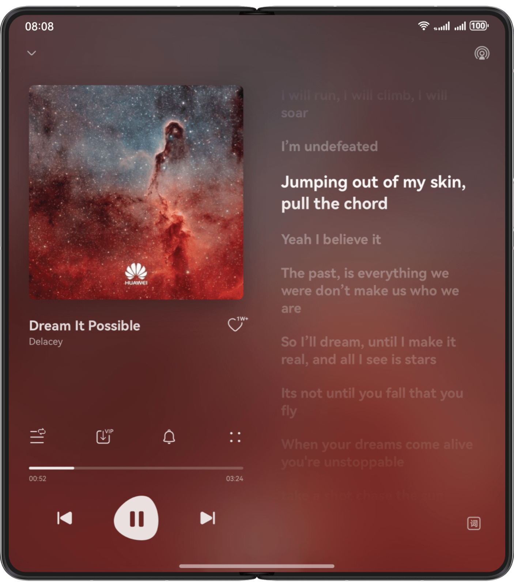
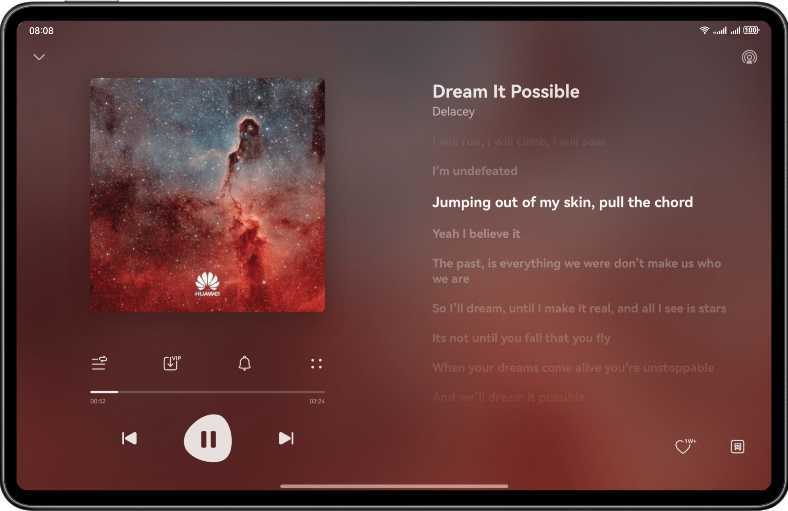
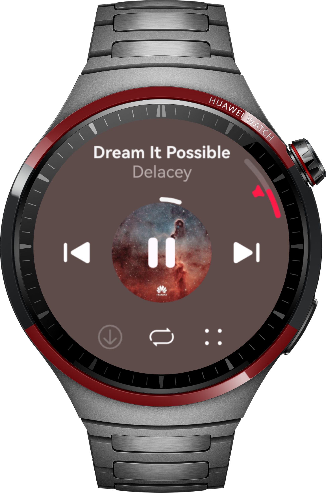
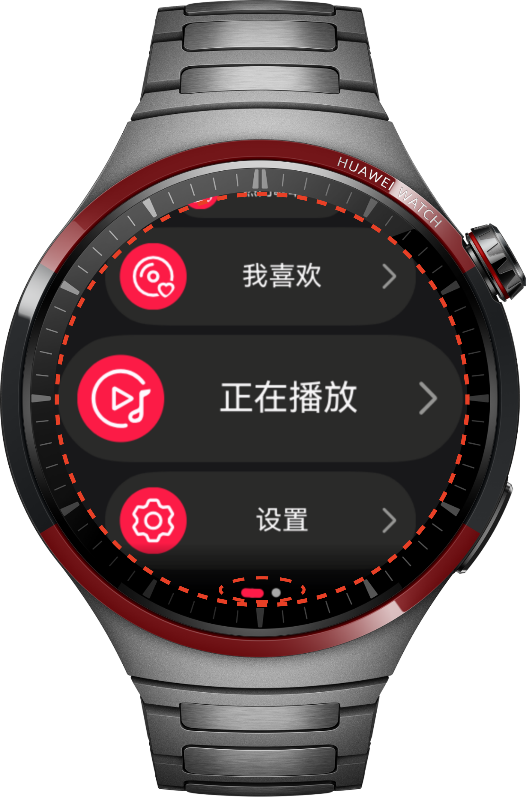

# 多设备音乐界面

更新时间：2026-05-09 09:58:30

来源：https://developer.huawei.com/consumer/cn/doc/best-practices/bpta-multi-music-app-overview

##### 概述

本文将介绍如何在音乐播放器的实际开发过程中实现“一次开发，多端部署”。音乐播放器是当前广受欢迎的大众娱乐应用。本文将以播放页为例，展示其在直板机、双折叠（Mate X系列）、平板、智能穿戴四种产品形态上的“一次开发，多端部署”。本文将通过UX设计、工程管理、页面开发和智能穿戴开发四个部分，介绍在开发过程中实现“一次开发，多端部署”的最佳实践。
 
> [!NOTE]
> 阅读本文前，开发者需熟悉 ArkUI（方舟UI框架） 和页面开发的“一多”能力（参考 一次开发，多端部署概览 ）。下文将详细介绍它们在“一多”开发实践中如何使用。

 
 

##### UX设计

音乐应用以播放页为重点进行介绍。
 



 



 



 



  
|    | sm | md | lg | 智能穿戴 |
| --- | --- | --- | --- | --- |
| 布局方式 | 单列+Swiper切换 | 左右分栏（1:1） | 左右分栏（1:1） | 圆形布局 |
| 交互特点 | 进度条拖动、按钮点击、左右滑动切换页面 | 进度条拖动、按钮点击 | 按钮点击、旋转表冠 |
 
 
> [!NOTE]
> 由于智能穿戴设备与移动端的布局差异显著，因此需为前者单独创建 HAP 包，而非依赖断点判断。

 
 

##### 工程管理

本章将介绍如何创建“一多”工程及划分目录结构。
 
 

##### 创建工程

根据三层架构进行[多设备工程部署与发布](https://developer.huawei.com/consumer/cn/doc/best-practices/bpta-multi-device-ide)，先创建出最基本的项目工程，再在基本目录结构的基础上进行修改。
 
由于圆形屏幕设备在形态与使用场景上的特殊性，其交互与界面设计和常规设备存在显著差异。因此，在products层中设立独立的watch模块，以实现对穿戴设备的精准适配。该模块采用分层架构设计，聚焦于穿戴设备特有的界面与交互逻辑，同时将设备无关的通用逻辑下沉至公共模块，从而确保架构清晰、复用性高。
 
> [!NOTE]
> 在开发穿戴应用时，需要将工程中module.json5的deviceTypes改为wearable，以确保应用能够在穿戴设备上正确部署和运行。可参考 智能穿戴应用开发 了解能力介绍。

 
 

##### 工程结构

HarmonyOS的分层架构包括产品定制层、基础特性层和公共能力层，为开发者提供清晰、高效、可扩展的设计架构。详细请参见[分层架构设计](https://developer.huawei.com/consumer/cn/doc/best-practices/bpta-layered-architecture-design)。
 
音乐应用根据一多推荐的common、features、products的“三层工程架构”划分目录。其中三个页面功能不同，互不依赖，根据页面划分为三个features（基础特性层）：直播页-live、音乐评论页-musicComment和歌曲列表页-musicList。公共常量、媒体播放工具以及窗口管理工具等需要被不同页面依赖引用的内容，划分为一个common（公共能力层）。在products（产品定制层）中，分别设立了面向智能穿戴设备开发的独立watch模块和适用于普通设备的phone模块，以适配不同设备在界面与交互方面的差异，从而实现清晰的模块化划分。
 
 
工程结构如下：
 
```text
│──common                                    // 公共能力层
│  ├──constantsCommon/src/main/ets            // 公共常量
│  │  └──constants
│  └──mediaCommon/src/main/ets                // 公共媒体方法
│     └──utils
│     └──viewmodel
├──features                                   // 基础特性层
│  ├──live/src/main/ets                       // 直播页
│  │  ├──constants
│  │  ├──view
│  │  └──viewmodel
│  ├──live/src/main/resources                 // 资源文件目录
│  ├──musicComment/src/main/ets               // 音乐评论页
│  │  ├──constants
│  │  ├──view
│  │  └──viewmodel
│  ├──musicComment/src/main/resources         // 资源文件目录
│  ├──musicList/src/main/ets                  // 歌曲列表页
│  │  ├──components
│  │  ├──constants
│  │  ├──lyric
│  │  ├──view
│  │  └──viewmodel
│  └──musicList/src/main/resources            // 资源文件目录
└──products                                   // 产品定制层
   ├──phone/src/main/ets                      // 支持手机、平板
   │  ├──common
   │  ├──entryability
   │  ├──pages
   │  ├──phonebackupextability
   │  └──viewmodel
   ├──phone/src/main/resources                // 资源文件目录
   ├──watch/src/main/ets                      // 支持智能穿戴
   │  ├──constants                      
   │  ├──pages
   │  ├──view
   │  ├──watchability
   │  └──watchbackupability
   └──watch/src/main/resources                // 资源文件目录
```
 

##### 页面开发

本章介绍音乐应用如何使用“一多”的布局能力，完成页面层级的一套代码、多端适配。下文以播放页为例，介绍各区域使用的具体布局能力，帮助开发者快速实现“一多”开发。
 
 

##### 播放页

播放页是音乐应用的主要功能页面，用于播放音乐。以下是播放页在三种设备上的显示效果图：
  
| 示意图 | sm | md | lg |
| --- | --- | --- | --- |
| 效果图 |  |  |  |
 
 
- 播放页主要包含播控区域和歌词区域。在sm断点下，通过Tabs组件或Swiper组件切换这两个区域。在md和lg断点下，播控区域和歌词区域以左右两列展示。
- 在sm断点下，使用Stack组件将区域1显示在Swiper组件上。区域2、3、4作为沿垂直方向布局的Column组件的子组件，在区域3和区域4之间使用Blank组件填充空白区域。
- 在md断点下，播控区域与歌词区域通过GridRow和GridCol组件实现。GridRow设置总栅格数为8，每个GridCol占4个栅格。
- 在lg断点下，GridRow设置总栅格数为12。播控区域占4个栅格，GridCol设置offset为1。歌词区域占6个栅格，offset为1。

| 区域编号 | 简介 | 实现方案 |

| --- | --- | --- |

| 1 | 标题区 | Row组件的justifyContent属性设置为FlexAlign.SpaceBetween实现均分能力，代码可参考多设备长视频界面。 |

| 2 | 专辑封面 | Image组件设置aspectRatio属性为1使图片宽高相等。 |

| 3 | 歌曲信息 | Column组件沿垂直方向布局展示两行文本。 |

| 4 | 播控区域 | 使用Slider组件实现进度条。 |

| 5 | 歌词区域 | Canvas结合动画实现歌词滚动效果。 |

| 6 | 桌面歌词按钮 | Image组件显示歌词图片。 |

 
 

##### 智能穿戴开发

本章将介绍音乐应用如何借助“一多”布局能力，在智能穿戴设备上实现独立应用开发，并以首页、歌单页、歌曲列表页与播放页等典型页面为例，详细阐述其设计与实现。
 
 

##### 首页


  
| 区域编号 | 简介 | 实现方案 |
| --- | --- | --- |
| 1 | 首页列表区域 | 使用ArcList实现弧形列表布局，多行展示列表。 |
| 2 | 首页轮播区域 | 使用ArcSwiper组件实现左右轮播效果。 |
 
 
- 首页列表区域通过[ArcList](https://developer.huawei.com/consumer/cn/doc/harmonyos-references/ts-container-arclist)实现弧形列表布局，设置scrollBar属性为BarState.Off隐藏滚动条的显示，通过space属性调整子组件之间的距离。每个子组件需要使用[ArcListItem](https://developer.huawei.com/consumer/cn/doc/harmonyos-references/ts-container-arclistitem)作为容器，给子组件设置justifyContent为SpaceBetween，使弹性元素均匀分布，相邻元素间距相等，首元素与行首对齐，末元素与行尾对齐。

  
```ArkTS
Column() {
  ArcList({ initialIndex: 0 }) {
    ForEach(this.menuList, (item: Menu) => {
      ArcListItem() {
        Row() {
          Image(item.icon)
            .width($r('app.float.home_icon_width'))
            .height($r('app.float.home_icon_width'))
            .borderRadius(StyleConstants.CIRCLE_BORDER_RADIUS)
            .backgroundColor($r('app.color.home_icon_background'))
            .padding($r('app.float.home_icon_padding'))

          Text(item.text)
            .fontColor($r('app.color.font_color'))
            .fontSize($r('app.float.home_font_size'))

          Image($r('app.media.chevron_right'))
            .width($r('app.float.home_icon_jump_width'))
        }
        .width(this.HOME_BTN_WIDTH)
        .height($r('app.float.home_btn_height'))
        .padding({ left: $r('app.float.list_btn_padding'), right: $r('app.float.list_btn_padding') })
        .justifyContent(FlexAlign.SpaceBetween)
        .borderRadius(StyleConstants.CIRCLE_BORDER_RADIUS)
        .backgroundColor($r('app.color.home_btn_background'))
        // ...
      }
    }, (item: Menu, index: number) => JSON.stringify(item) + index)
  }
  .scrollBar(BarState.Off)
  .space(LengthMetrics.vp(5))
  .borderRadius(StyleConstants.CIRCLE_BORDER_RADIUS)
  .focusable(true)
  .focusOnTouch(true)
  .defaultFocus(true)
}
.align(Alignment.Center)
.width(StyleConstants.FULL_WIDTH)
.height(StyleConstants.FULL_HEIGHT)
.borderRadius(StyleConstants.CIRCLE_BORDER_RADIUS)
```


 
- 首页轮播区域使用[ArcSwiper](https://developer.huawei.com/consumer/cn/doc/harmonyos-references/ts-container-arcswiper)组件实现，通过左右滑动实现首页和歌单页的切换，并且通过indicator属性设置导航点样式。

  
```ArkTS
Column() {
  Row() {
    ArcSwiper(this.wearableSwiperController) {
      Home()
      PlayList()
    }
    .duration(400)
    .indicator(this.arcDotIndicator
      .arcDirection(ArcDirection.SIX_CLOCK_DIRECTION)
      .selectedItemColor('#FE1B48')
    )
    // ...
  }
  .height(StyleConstants.FULL_HEIGHT)
}
.width(StyleConstants.FULL_WIDTH)
```


 
 

##### 歌单页


  
| 区域编号 | 简介 | 实现方案 |
| --- | --- | --- |
| 1 | 歌单列表区域 | 使用ArcSwiper组件实现上下滑动切换歌单。 |
 
 
歌单页使用[ArcSwiper](https://developer.huawei.com/consumer/cn/doc/harmonyos-references/ts-container-arcswiper)组件实现。通过将组件的vertical属性设置为true，指定滑动轴为垂直方向，从而实现竖向滑动交互。将indicator属性设置为false，隐藏默认的页面导航点，减少视觉干扰。
 
```ArkTS
Column() {
  ArcSwiper(this.wearableSwiperController) {
    ForEach(this.playList, (item: PlayListSheet) => {
      Column({ space: 10 }) {
        Row() {
          Text(item.name)
            .fontWeight(FontWeight.Bold)
            .fontColor($r('app.color.font_color'))
            .fontSize($r('app.float.home_font_size'))
          Image($r('app.media.chevron_right'))
            .width($r('app.float.home_icon_jump_width'))
            .margin({ left: $r('app.float.playlist_padding') })
        }

        Image($r('app.media.play_btn_fill'))
          .width($r('app.float.playlist_icon'))
          .height($r('app.float.playlist_icon'))
          .position({ x: '25%', y: '65%' })
        Text(item.title)
      }
      .width(StyleConstants.FULL_WIDTH)
      .height(StyleConstants.FULL_HEIGHT)
      .backgroundImage(item.background, ImageRepeat.NoRepeat)
      .backgroundImageSize({ width: StyleConstants.FULL_WIDTH, height: StyleConstants.FULL_HEIGHT })
      .justifyContent(FlexAlign.SpaceBetween)
      .padding({ top: $r('app.float.playlist_row_padding'), bottom: $r('app.float.playlist_row_padding') })
      // ...
    }, (item: PlayListSheet, index?: number) => index + JSON.stringify(item))
  }
  .index(0)
  .duration(400)
  .focusable(true)
  .focusOnTouch(true)
  .defaultFocus(true)
  .vertical(true)
  .indicator(false)
  // ...
}
.width(StyleConstants.FULL_WIDTH)
.height(StyleConstants.FULL_HEIGHT)
```
 
 

##### 歌曲列表页


  
| 区域编号 | 简介 | 实现方案 |
| --- | --- | --- |
| 1 | 歌曲列表区域 | 使用首页一致的ArcList实现多行展示歌曲。 |
 
 
列表页采用与首页一致的ArcList弧形列表布局。每一行歌曲项中，左侧使用Image组件展示专辑封面，并通过设置borderRadius为50%实现圆形效果；右侧歌曲信息使用Column组件，设置layoutWeight为1以占据剩余全部宽度，再结合Column组件默认居中的特性，实现剩余空间内居中对齐。
 
```ArkTS
Column() {
  ArcList({ initialIndex: 0 }) {
    ForEach(this.songList, (item: SongItem, index: number) => {
      ArcListItem() {
        Row() {
          Image(item.label)
            .width($r('app.float.home_icon_width'))
            .height($r('app.float.home_icon_width'))
            .borderRadius(StyleConstants.CIRCLE_BORDER_RADIUS)

          Column() {
            Text(item.title)
              .fontWeight(FontWeight.Bold)
              .fontColor($r('app.color.font_color'))
            Text(item.singer)
              .fontColor($r('app.color.text_color'))
          }
          .layoutWeight(1)
        }
        .width(this.HOME_BTN_WIDTH)
        .height($r('app.float.home_btn_height'))
        .padding({ left: $r('app.float.list_btn_padding'), right: $r('app.float.list_btn_padding') })
        .borderRadius(StyleConstants.CIRCLE_BORDER_RADIUS)
        .focusable(true)
        .focusOnTouch(true)
        .backgroundColor($r('app.color.home_btn_background'))
      }
      .align(Alignment.Center)
      // ...
    }, (item: SongItem, index: number) => JSON.stringify(item) + index)
  }
  .scrollBar(BarState.Off)
  .space(LengthMetrics.vp(5))
  .borderRadius(StyleConstants.CIRCLE_BORDER_RADIUS)
  .focusable(true)
  .focusOnTouch(true)
  .defaultFocus(true)
}
.align(Alignment.Center)
.width(StyleConstants.FULL_WIDTH)
.height(StyleConstants.FULL_HEIGHT)
.borderRadius(StyleConstants.CIRCLE_BORDER_RADIUS)
```
 
 

##### 播放页


  
| 区域编号 | 简介 | 实现方案 |
| --- | --- | --- |
| 1 | 歌曲信息及操作按钮区域 | 使用Column组件沿垂直方向布局展示歌曲信息、音乐控制按钮、操作按钮。使用Stack和Progress实现控制按钮和环形进度条。 |
| 2 | 音量控制区域 | 使用ArcSlider组件实现滑动调节音量。 |
 
 
- 歌曲信息及操作按钮区域1. 使用[Stack](https://developer.huawei.com/consumer/cn/doc/harmonyos-references/ts-container-stack)组件可将多个元素堆叠在一起，实现更加灵活的布局。

2. 使用[Progress](https://developer.huawei.com/consumer/cn/doc/harmonyos-references/ts-basic-components-progress)组件用于实时显示当前音乐的播放进度，帮助用户了解歌曲的播放时间及剩余时间。采用环形进度条（ProgressType.Ring），既具视觉吸引力，又能高效利用屏幕空间。

  
```ArkTS
Column() {
  Column() {
    Text(this.songList[this.selectIndex].title)
      .fontWeight(FontWeight.Bold)
      .fontColor($r('app.color.font_color'))
    Text(this.songList[this.selectIndex].singer)
      .fontColor($r('app.color.play_singer_color'))
  }

  Row() {
    Column() {
      Image($r('app.media.previous_btn'))
        .width($r('app.float.play_song_img'))
    }
    // ...
    Stack() {
      Image(this.songList[this.selectIndex].label)
        .width($r('app.float.play_circle_img'))
        .height($r('app.float.play_circle_img'))
        .borderRadius(StyleConstants.CIRCLE_BORDER_RADIUS)

      Progress({ value: this.time, total: this.max, type: ProgressType.Ring })
        .width($r('app.float.play_progress_width'))
        .backgroundColor(Color.Transparent)
        .color($r('app.color.font_color'))

      Image($r('app.media.play_btn'))
        .width($r('app.float.play_song_img'))
        .visibility(this.isPlay === true ? Visibility.None : Visibility.Visible)
        // ...

      Image($r('app.media.pause_btn'))
        .width($r('app.float.play_song_img'))
        .visibility(this.isPlay === true ? Visibility.Visible : Visibility.None)
        // ...
    }
    .width(this.HALF_WIDTH)
    .align(Alignment.Center)

    Column() {
      Image($r('app.media.next_btn'))
        .width($r('app.float.play_song_img'))
    }
    // ...
  }
  .justifyContent(FlexAlign.SpaceAround)
  .width('85%')

  Row() {
    Image($r('app.media.download'))
      .width($r('app.float.play_icon_width'))
    Image($r('app.media.repeat'))
      .width($r('app.float.play_icon_width'))
    Image($r('app.media.full_screen'))
      .width($r('app.float.play_icon_width'))
  }
  .width('60%')
  .justifyContent(FlexAlign.SpaceAround)
}
.width(StyleConstants.FULL_WIDTH)
.height(StyleConstants.FULL_HEIGHT)
.padding({ top: $r('app.float.play_column_padding'), bottom: $r('app.float.play_column_padding') })
.justifyContent(FlexAlign.SpaceAround)
```

- 音量控制区域1. 音量控制交互通过[ArcSlider](https://developer.huawei.com/consumer/cn/doc/harmonyos-references/ohos-arkui-advanced-arcslider)实现。通过设置position={ top: 0, right: 0 }，将滑动条定位在界面右上角，使其层级覆盖于其他组件之上，确保良好的可见性与操作便捷性。

2. 在滑动条旁新增麦克风图标，并通过精确的position布局进行定位，直观提示用户该控件与音频调节相关，增强功能可识别性与用户体验。

  
```ArkTS
Column() {
  ArcSlider({ options: this.arcSliderOptions })
    .focusable(true)
    .focusOnTouch(true)
    .defaultFocus(true)
    .zIndex(999)
    .onDigitalCrown((event: CrownEvent) => {
      event.stopPropagation();
      const STEP_DEGREE = 20;
      let newVolume = this.volume + event.degree / STEP_DEGREE;
      newVolume = Math.max(0, Math.min(100, newVolume));
      this.setAVPlayerVolume(newVolume);
    })
  Image($r('app.media.speaker_fill'))
    .width($r('app.float.volume_icon_width'))
    .height($r('app.float.volume_icon_width'))
    .rotate({ angle: '-30deg' })
    .position({
      right: $r('app.float.volume_icon_right'),
      top: $r('app.float.volume_icon_top'),
    })
}
.hitTestBehavior(HitTestMode.Transparent)
.position({
  top: 0,
  right: 0
})
```


 
 

##### 示例代码

- [多设备音乐界面](https://gitcode.com/harmonyos_codelabs/MusicHome)
