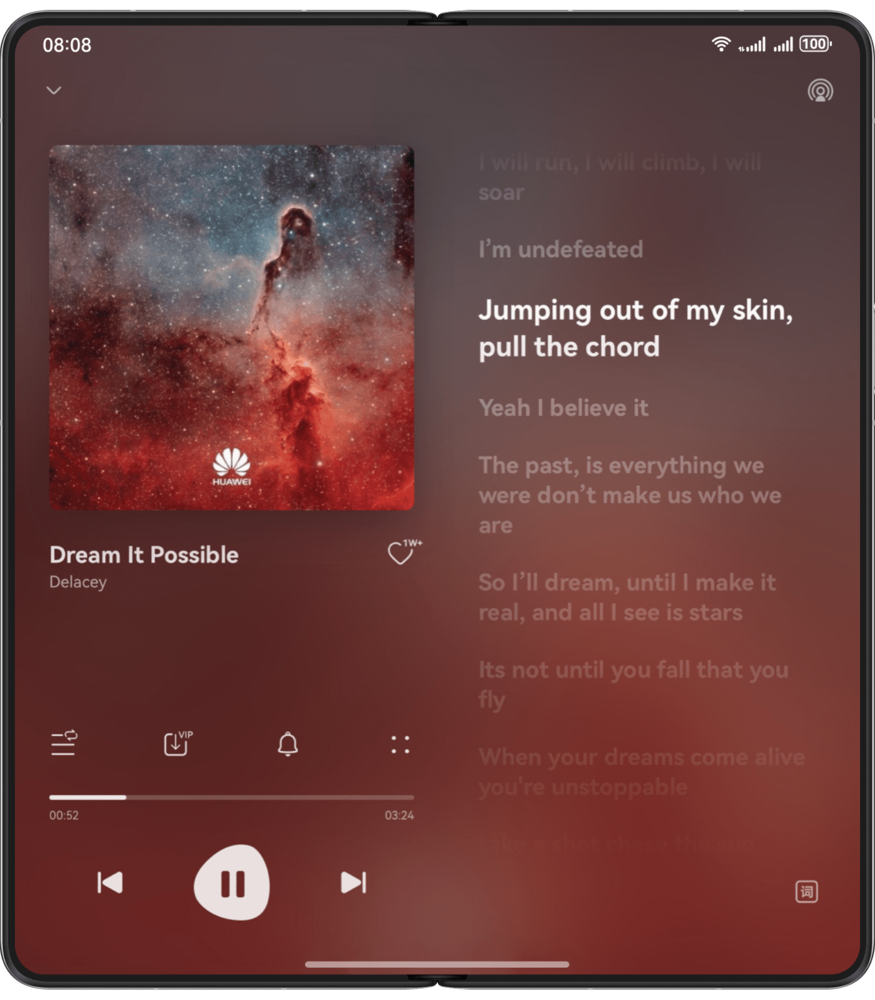

# 多设备音乐界面

更新时间：2026-06-10 07:05:30

来源：https://developer.huawei.com/consumer/cn/doc/best-practices/bpta-multi-music-app-overview

#### 概述

 
本文将介绍如何在音乐播放类应用的实际开发过程中实现“一次开发，多端部署”。收听音乐是大众最受欢迎的日常娱乐方式之一，而音乐播放应用是其核心载体。多设备音乐播放案例围绕首页、歌单详情页和全屏播放页等核心页面展开，覆盖了用户从音乐浏览、歌单查看到沉浸式播放的完整音乐欣赏链路。文章重点介绍关键布局能力及对应实现。当前应用已适配的设备包括：直板机、双折叠（Mate X系列）、三折叠、阔折叠、平板、电脑、智慧屏和智能穿戴。
 
> [!NOTE]
> 阅读本文前，建议开发者先了解 ArkUI（方舟UI框架） 和 一次开发，多端部署概览 相关知识。

 
下文将从UX设计、工程管理、页面开发三个方面系统介绍音乐播放类应用在实际开发中的最佳实践，为开发者提供可借鉴的实现思路。
 
- [UX设计](#section1496102654513)：介绍音乐播放类应用的交互逻辑与通用设计要点，开发者可直接参考同类设计要点。
- [工程管理](#section2146193418540)：介绍“一多”工程所需配置，并推荐采用结构更清晰的三层架构。
- [移动端页面](#section169906412567)、[电脑端页面](#section3647191712520)、[智慧屏页面](#section13448146153217)、[智能穿戴页面](#section95447563587)：遵循实际应用开发流程，以页面为基本单元，依次讲解窗口适配、页面开发的设计思路与实现方法。

 

#### UX设计

应用的UX设计可参考[音乐听书](https://developer.huawei.com/consumer/cn/doc/design-guides/responsive-design-examples1-0000001957369849#section12973333171715)的多设备响应式设计指南，设计参考图如下所示。
 



 

 
 

#### 工程管理

为确保“一多”工程代码的复用性与可维护性，建议开发者采用分层架构组织代码工程。该架构将项目划分为产品定制层（products）、基础特性层（features）和公共能力层（common）三个层级，各层级权责明确且功能独立，为开发者提供了清晰、高效且可扩展的设计方案。关于分层架构的具体设计细节，可参考[分层架构设计](https://developer.huawei.com/consumer/cn/doc/best-practices/bpta-layered-architecture-design)。
 
 

#### 创建工程

 
建议开发者参考[多设备工程部署与发布](https://developer.huawei.com/consumer/cn/doc/best-practices/bpta-multi-device-ide)相关内容，掌握分层架构工程的创建与配置方法后，创建模板项目工程。根据多设备音乐的开发需求进行针对性修改，确保工程架构贴合实际业务需求。
 

#### 工程结构

 
多设备音乐应用采用推荐的分层架构，将代码工程按products、features、common三个层级组织。各层级设计如下：
 
- products层：针对不同终端形态提供独立入口与页面组装。例如，products/default面向手机/平板类形态；products/watch、products/tv、products/pc分别面向穿戴、智慧屏、电脑等。
- features层：包含三个核心业务模块——首页、列表页和播放页。为各模块分别创建对应HAR包，供products层按需引用。各模块相对独立，互不依赖，便于后续维护与迭代。
- common层：为实现代码复用并减少冗余，集中存放公共常量、日志工具类及窗口管理工具等基础能力，供其他模块统一调用。

 
工程结构如下：
 
```text
├── common                                                  // 公共能力层目录
│   └── musicbasic                                          // 基础HAR：歌曲数据、全局状态、断点与窗口工具
│       └── src/main                                        // 模块标准源码与资源根目录
│           ├── ets                                         // ArkTS业务源码根目录
│           │   ├── api                                     // 接口DTO与映射
│           │   ├── constants                               // 公共常量
│           │   ├── data                                    // 歌曲/歌单/推荐Feed等行数据模型
│           │   ├── db                                      // 内存曲库等数据访问
│           │   ├── model                                   // 全局播控状态、菜单、歌曲实体等
│           │   └── util                                    // 日志、断点、窗口、持久化门面等工具
│           └── resources                                   // 字符串、颜色、媒体与rawfile资源
├── features                                                // 特性HAR：按业务能力拆分
│   ├── player                                              // 播放器：全屏页、歌词、音频播放封装
│   │   └── src/main                                        // 模块标准源码与资源根目录
│   │       ├── ets                                         // ArkTS业务源码根目录
│   │       │   ├── constant                                // 播放器与歌词相关常量
│   │       │   ├── model                                   // 播放UI模型、媒体服务、歌词条目
│   │       │   ├── util                                    // LRC、后台播放、播放意图壳层等
│   │       │   ├── view                                    // 播放页 UI 组件（含穿戴等形态适配）
│   │       │   └── viewmodel                               // 播放页ViewModel
│   │       └── resources                                   // 模块字符串、图标与主题资源
│   ├── playlist                                            // 歌单：详情页、分栏、迷你播控条
│   │   └── src/main                                        // 模块标准源码与资源根目录
│   │       ├── ets                                         // ArkTS业务源码根目录
│   │       │   ├── model                                   // 歌单与列表UI模型、数据源
│   │       │   ├── util                                    // 歌单演示数据等工具
│   │       │   ├── view                                    // 歌单页与迷你条 UI（含穿戴路由相关）
│   │       │   └── viewmodel                               // 歌单与播控联动ViewModel
│   │       └── resources                                   // 模块字符串与图标资源
│   └── recommendation                                      // 推荐首页、宽屏面板、首页迷你条
│       └── src/main                                        // 模块标准源码与资源根目录
│           ├── ets                                         // ArkTS业务源码根目录
│           │   ├── model                                   // 推荐区块UI模型与数据源
│           │   ├── util                                    // 推荐演示数据工具
│           │   ├── view                                    // 推荐首页、迷你条、宽屏面板与穿戴首页等 UI
│           │   └── viewmodel                               // 推荐首页ViewModel
│           └── resources                                   // 模块字符串、横幅与主题资源
└── products                                                // 各设备形态HAP产品入口
    ├── default                                             // 手机/平板应用入口
    │   └── src/main                                        // 模块标准源码与资源根目录
    │       ├── ets                                         // ArkTS入口与页面根目录
    │       │   ├── entryability                            // 主入口Ability
    │       │   ├── pages                                   // 页面路由（主导航与壳层）
    │       │   └── phonebackupextability                   // 手机侧备份扩展Ability
    │       └── resources                                   // 权限声明、页面profile、图标与多语言
    ├── pc                                                  // PC/2in1应用入口
    │   └── src/main                                        // 模块标准源码与资源根目录
    │       ├── ets                                         // ArkTS入口与页面根目录
    │       │   ├── pages                                   // PC主页与路由页面
    │       │   ├── pcability                               // PC入口Ability
    │       │   └── pcbackupability                         // PC备份扩展Ability
    │       └── resources                                   // 分层图标、页面profile、多语言
    ├── tv                                                  // 智慧大屏应用入口
    │   └── src/main                                        // 模块标准源码与资源根目录
    │       ├── ets                                         // ArkTS入口与页面根目录
    │       │   ├── pages                                   // TV主页与路由页面
    │       │   ├── tvability                               // TV入口Ability
    │       │   └── tvbackupability                         // TV备份扩展Ability
    │       └── resources                                   // 分层图标、页面profile、多语言
    └── watch                                               // 智能穿戴应用入口
        └── src/main                                        // 模块标准源码与资源根目录
            ├── ets                                         // ArkTS入口与页面根目录
            │   ├── pages                                   // 穿戴主页路由页面
            │   ├── watchability                            // 穿戴入口Ability
            │   └── watchbackupability                      // 穿戴备份扩展Ability
            └── resources                                   // 表盘图标、路由profile、多语言
```
 

 

#### 移动端页面

本章说明在直板机、折叠机、平板等形态下，如何借助一多布局能力，使首页、歌单详情页、全屏播放页在同一套业务逻辑上完成适配，并概述与本示例相关的窗口适配要点。
 
 

#### 窗口适配

- 窗口模式适配设备支持全屏、分屏、悬浮窗和自由窗口模式，具体参见[窗口模式](https://developer.huawei.com/consumer/cn/doc/best-practices/bpta-multi-device-window-mode)。其中，分屏模式与悬浮窗无需特殊设计，可通过系统方式进入。应用内监听窗口尺寸变化，[通过断点刷新UI](https://developer.huawei.com/consumer/cn/doc/best-practices/bpta-multi-device-responsive-layout#section175001836203617)，即可自动适配全屏、分屏、悬浮窗和自由窗口模式下的布局。
- 窗口方向在类直板机上推荐仅竖屏显示，在双折叠展开态、三折叠展开态、平板等大屏幕场景下推荐四方向旋转并受控制中心的旋转开关控制。在移动端应用推荐在[module.json5](https://gitcode.com/HarmonyOS_Samples/MusicHome/blob/master/products/default/src/main/module.json5)配置文件中将orientation字段设置为follow_desktop（跟随桌面的旋转模式），具体说明可参考[为应用配置旋转策略](https://developer.huawei.com/consumer/cn/doc/best-practices/bpta-multi-device-window-direction#section714419371037)。
- 窗口沉浸式根据UX设计，需实现不同窗口模式（全屏、分屏、悬浮窗、自由窗口）下的沉浸式效果，可参考[窗口沉浸式](https://developer.huawei.com/consumer/cn/doc/best-practices/bpta-multi-device-window-immersive)。推荐开发者使用[实现沉浸式效果](https://developer.huawei.com/consumer/cn/doc/best-practices/bpta-multi-device-window-immersive#section180431120426)中的组件级沉浸方案（组件设置页面沉浸），同时进行动态安全区避让，确保沉浸式显示效果。自由窗口模式下，使用[window.setWindowDecorVisible(false)](https://developer.huawei.com/consumer/cn/doc/harmonyos-references/arkts-apis-window-window#setwindowdecorvisible11)隐藏标题栏，仅保留右上角三键，使应用页面延伸至标题栏区域，实现沉浸式显示效果。

 
 

#### 首页

音乐应用首页用于展示推荐信息流与快捷入口，以满足试听与浏览歌单的需求。本示例将首页主要内容组织在RecommendPage中，并由多个分区组件拼装而成。
 
效果图如下所示：
  
| 横向（/纵向）断点 | sm/md | sm | md | lg、xl |
| --- | --- | --- | --- | --- |
| 首页 |  |  |  |  |
 
 
**界面开发**
 
对各个区域使用多种能力进行分析，实现方案如下表：
  
| 区域编号 | 简介 | 实现方案 |
| --- | --- | --- |
| 1 | 底部页签 | 借助HdsTabs实现。同时在api版本低的设备上降级使用Tabs组件。 |
| 2 | 顶部页签及搜索框 | 使用响应式布局实现。通过监听断点变化，实现折行显示。在横向断点为sm时，组件两行显示；在横向断点为md、lg或xl时，组件单行显示。 |
| 3 | 歌单卡片列表 | 使用响应式组件Scroll结合Row组件实现横向滚动。 |
| 4 | 分类标签区域 | 使用响应式组件Scroll结合Row组件实现横向滚动。 |
| 5 | 为你推荐区域 | 使用响应式组件Scroll结合Row组件实现横向滚动。 |
| 7 | 音乐列表 | 使用List结合LazyForEach实现列表渲染，并通过lanes()属性设置响应式列数，根据横向断点为sm展示一列，md展示两列，lg或者xl展示三列。 |
 
 
 

#### 列表页

列表页用于展示歌单头图与曲目列表，并在页面内提供迷你播放条以延续播控。对应实现集中在PlaylistDetailPage及相关Section组件。
 
效果图如下所示：
  
| 横向（/纵向）断点 | sm/md | sm | md | lg、xl |
| --- | --- | --- | --- | --- |
| 列表页 |  |  |  |  |
 
 
**界面开发**
 
列表页通过栅格系统区分窄屏堆叠与宽屏分栏。
 
- 窄屏（如横向断点sm、md下占满列宽）：封面信息区域与列表区域在[GridRow](https://developer.huawei.com/consumer/cn/doc/harmonyos-references/ts-container-gridrow)中均占据满列，呈现上图下文的布局。
- 宽屏（如横向断点lg、xl）：同一[GridRow](https://developer.huawei.com/consumer/cn/doc/harmonyos-references/ts-container-gridrow)下封面信息区域与列表区按列跨度分为四列与八列，实现左右分栏。

 
实现方案如下表：
  
| 区域编号 | 简介 | 实现方案 |
| 1 | 标题栏 | 使用HdsNavDestination实现，并支持滚动渐变效果 (IMMERSIVE_GRADIENT_BLUR）。 |
| 2 | 封面信息 | 使用响应式组件Flex实现，当横向断点为sm、md时采用水平布局，当断点为lg、xl时实现垂直布局。 |
| 3 | 列表区 | 使用List结合LazyForEach实现列表渲染，并通过lanes()属性设置响应式列数，根据横向断点为sm展示一列，md、lg、xl时展示两列。 |
| 4 | 播放条 | 使用Row组件实现，分为封面区域以及音乐控制区两部分，封面区域通过Stack层叠环形进度条。 |
 
 
 

#### 播放页

播放页用于沉浸式展示封面、进度条与歌词，并提供手势收起等交互功能。
 
效果图如下所示：
  
| 横向（/纵向）断点 | sm/md | sm | md | lg、xl |
| --- | --- | --- | --- | --- |
| 播放页 |  |  |  |  |
| 歌词页 |  |  |    |    |
 
 
**界面开发**
 
全屏播放页面综合使用[Swiper](https://developer.huawei.com/consumer/cn/doc/harmonyos-references/ts-container-swiper)与[GridRow](https://developer.huawei.com/consumer/cn/doc/harmonyos-references/ts-container-gridrow)完成窄宽屏形态切换。
 
- 窄屏（如横向断点sm下占满列宽）：采用[Swiper](https://developer.huawei.com/consumer/cn/doc/harmonyos-references/ts-container-swiper)分页方式，分页展示封面、歌曲信息与歌词等内容区域。
- 宽屏（如横向断点md、lg、xl）：使用[GridRow](https://developer.huawei.com/consumer/cn/doc/harmonyos-references/ts-container-gridrow)双列排布歌曲信息控制区域与歌词区域。

 
实现方案如下表：
  
| 区域编号 | 简介 | 实现方案 |
| 1 | 顶部栏 | 使用Row组件实现，包含返回图标以及分享按钮。 |
| 2 | 封面区域 | 使用Image组件实现，并通过scale()属性实现下滑关闭缩放动画。 |
| 3 | 控制区域 | 采用Column组件实现垂直布局，进度条由Slider组件实现。 |
| 4 | 歌词区域 | 使用Canvas组件逐行绘制歌词。 |
 
 
 

#### 电脑端页面

本章介绍如何基于现有移动端界面开发方案，实现代码逻辑与布局复用，高效完成音乐类应用在电脑设备上的界面开发。
 
 

#### 首页

将电脑端首页划分为八个区域。
 
效果图如下所示：
 


 
**界面开发**
 
对各个区域使用的多种能力进行分析，实现方案如下表：
  
| 区域编号 | 简介 | 实现方案 |
| --- | --- | --- |
| 1 | 侧边页签 | 使用侧边栏容器SideBarContainer实现。 |
| 2 | 顶部页签及搜索框 | 同移动端首页对应区域的布局实现方案。 |
| 3 | 歌单卡片列表 | 同移动端首页对应区域的布局实现方案。 |
| 4 | 分类标签区域 | 同移动端首页对应区域的布局实现方案。 |
| 5 | 为你推荐区域 | 同移动端首页对应区域的布局实现方案。 |
| 7 | 音乐列表 | 同移动端首页对应区域的布局实现方案。 |
| 8 | 播放条 | 使用Row组件实现，分为封面区域和音乐控制区两部分，封面通过Stack层叠环形进度条。 |
 
 
 

#### 列表页

将电脑端列表划分为五个区域。
 
效果图如下所示：
 


 
**界面开发**
 
实现方案如下表：
  
| 区域编号 | 简介 | 实现方案 |
| 1 | 侧边页签 | 使用侧边栏容器SideBarContainer实现。 |
| 2 | 标题栏 | 同移动端列表页对应区域的布局实现方案。 |
| 3 | 封面信息 | 同移动端列表页对应区域的布局实现方案。 |
| 4 | 列表区 | 同移动端列表页对应区域的布局实现方案。 |
| 5 | 播放条 | 同移动端列表页对应区域的布局实现方案。 |
 
 
 

#### 播放页

电脑端播放页面与移动端播放页面实现效果一致，可参考移动端[播放页](#section143891320165811)实现。
 
 

#### 智慧屏页面

 
本章介绍如何基于现有移动端界面开发方案，实现代码逻辑与布局复用，以高效完成音乐类应用在智慧屏设备上的界面开发。
 

#### 首页

将智慧屏首页划分为四个区域。
 
效果图如下所示：
 


 
**界面开发**
 
对各个区域使用的多种能力进行分析，实现方案如下表：
  
| 区域编号 | 简介 | 实现方案 |
| --- | --- | --- |
| 1 | 顶部胶囊导航 | 使用Row组件实现横向布局，使用List组件实现胶囊导航。 |
| 2 | 歌单卡片列表 | 与移动端首页对应区域的布局实现方案一致。 |
| 3 | 为你推荐区域 | 与移动端首页对应区域的布局实现方案一致。 |
| 4 | 音乐列表 | 与移动端首页对应区域的布局实现方案一致。 |
 
 
 

#### 列表页

智慧屏列表页与移动端显示效果存在较大差异，建议单独开发智慧屏列表页，并将其划分为两个区域。
 
效果图如下所示：
 


 
**界面开发**
 
实现方案如下表：
  
| 区域编号 | 简介 | 实现方案 |
| 1 | 歌单信息 | 使用Row组件实现水平布局。 |
| 2 | 列表区 | 使用List结合LazyForEach实现列表渲染。 |
 
 
 

#### 播放页

智慧屏播放页与移动端播放页实现效果一致，参考移动端[播放页](#section143891320165811)实现。
 
 

#### 智能穿戴页面

本章将介绍音乐应用如何借助“一多”布局能力，在智能穿戴设备上实现独立应用开发，并以首页、歌曲列表页与播放页等典型页面为例，详细阐述其设计与实现。
 
 

#### 首页

穿戴首页通过[ArcSwiper](https://developer.huawei.com/consumer/cn/doc/harmonyos-references/ts-container-arcswiper)实现首页与歌单列表的横向切换，并在首页显示当前播放的音乐以方便用户操作。
 


 
实现方案如下表：
  
| 区域编号 | 简介 | 实现方案 |
| 1 | 顶部标题栏 | 使用Row组件实现标题与搜索按钮的水平布局。 |
| 2 | 播控条 | 使用Row组件实现，分为封面区域和音乐控制区。 |
| 3 | 推荐区域 | 使用Stack组件实现图片堆叠效果。 |
 
 
 

#### 歌单与曲目列表

穿戴列表页主要展示歌曲列表内容。
 


 
实现方案如下表：
  
| 区域编号 | 简介 | 实现方案 |
| 1 | 歌单列表页 | 使用ArcList实现列表展示。 |
 
 
 

#### 播放页

穿戴播放页划分为三个区域。
 


 
实现方案如下表：
  
| 区域编号 | 简介 | 实现方案 |
| 1 | 歌曲信息 | 使用Column组件实现歌名与歌手名的垂直布局。 |
| 2 | 控制区域 | 使用Row组件实现上一首、播放/暂停、下一首的水平布局。 |
| 3 | 辅助功能区 | 使用Row组件实现水平布局。 |
 
 
 

#### 交互开发

智能穿戴设备音乐应用因界面空间有限，在页面中直接添加音量调节功能较为不便，因此可利用表冠监听功能实现音量的调节。
 
- 表冠调节音量穿戴设备支持[onDigitalCrown](https://developer.huawei.com/consumer/cn/doc/harmonyos-references/ts-universal-events-crown#ondigitalcrown)事件，当组件获焦后旋转表冠触发该事件。音乐应用可在播放页面监听此事件，通过旋转表冠调节音量大小，具体交互逻辑请参见[示例代码](#section520865982117)。

 
 

#### 示例代码

- [多设备音乐界面](https://gitcode.com/HarmonyOS_Samples/MusicHome)
