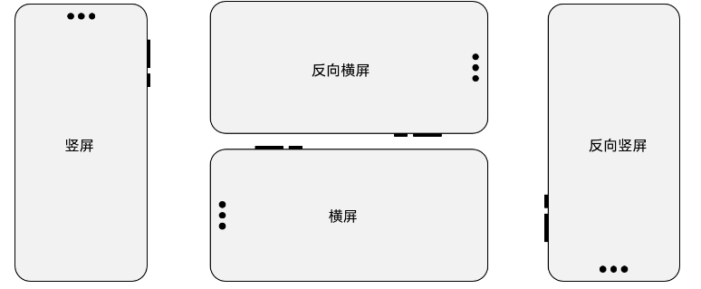

# 窗口方向

更新时间：2026-05-18 00:55:31

来源：https://developer.huawei.com/consumer/cn/doc/best-practices/bpta-multi-device-window-direction

#### 概述

窗口方向适配旨在解决应用不同场景下窗口的朝向问题。以直板机上的视频类应用为例，应用首页通常竖屏显示；而全屏视频播放页通常横屏显示。其核心的策略在于动态调整应用窗口方向的显示策略（即window的[Orientation](https://developer.huawei.com/consumer/cn/doc/harmonyos-references/arkts-apis-window-e#orientation9)，以下简称“**窗口旋转策略**”），确保在不同用户交互场景下提升用户体验。
 

 
本文主要内容如下：
 
- 前置约束与限制：介绍窗口方向的含义。明确指出在设备形态多样化的前提下，如何选择更合适的窗口旋转策略。
- 窗口旋转策略枚举：介绍窗口旋转策略的枚举值，并解析各值在不同设备形态下的行为映射，帮助开发者理解系统的底层适配逻辑。
- 实现原理：介绍配置页面窗口旋转策略的技术实现机制与核心流程。

 
- 典型场景：
应用首页案例：通用页面窗口旋转策略。
- 游戏应用案例：竖屏或横屏方向锁定的窗口旋转策略。
- 图库案例：四个方向自动旋转且受控制中心的旋转开关控制的窗口旋转策略。
- 个股详情页 & 股票K线图页：应用组合页面内根据场景不同切换的窗口旋转策略。
- 视频详情页 & 全屏播放页：相同页面内根据用户行为切换的窗口旋转策略。

 
 
 

#### 前置约束与限制

在阅读本文前，建议开发者先了解[窗口管理](https://developer.huawei.com/consumer/cn/doc/harmonyos-guides/window-manager)、[窗口旋转](https://developer.huawei.com/consumer/cn/doc/harmonyos-guides/window-rotation)、[屏幕管理](https://developer.huawei.com/consumer/cn/doc/harmonyos-guides/display-manager)、[一次开发，多端部署](https://developer.huawei.com/consumer/cn/doc/best-practices/bpta-multi-device-overview)、[组件导航（Navigation）](https://developer.huawei.com/consumer/cn/doc/harmonyos-guides/arkts-navigation-navigation)等相关知识。
 

 
横竖屏切换功能可实现应用内既支持竖屏显示也支持横屏显示的效果。对于应用内不同页面显示方向不同的情况，需在应用逻辑中动态修改窗口方向以实现该效果。例如，在直板机上具备视频播放功能的应用中，首页内容是采用竖屏方式，而全屏播放页则采用横屏方式展示。
 
随着设备形态日益丰富，应用页面支持旋转已从部分页面适配发展为全面支持。因此，选择合适的旋转策略，对应用开发至关重要。
 
目前HarmonyOS系统中设备的显示方向有以下四种，对应真机实际状态如下：
 



 
**基本定义：**
 
以设备物理屏幕尺寸为判定依据，设备的显示方向定义如下：
 
- 竖屏（PORTRAIT）：屏幕高度大于宽度，用户正向握持设备时充电口朝下（默认竖屏状态）。
- 反向竖屏（PORTRAIT_INVERTED）：屏幕高度大于宽度，但设备倒置，即充电口朝上。
- 横屏（LANDSCAPE）：屏幕宽度大于高度，用户正向握持设备时充电口朝右（默认横屏状态）。
- 反向横屏（LANDSCAPE_INVERTED）：屏幕宽度大于高度，但设备倒置，即充电口朝左。

 
**区分方法**：
 
系统提供了@ohos.display模块来获取屏幕的当前方向（[Orientation](https://developer.huawei.com/consumer/cn/doc/harmonyos-references/js-apis-display#orientation10)）和旋转角度（即[Display](https://developer.huawei.com/consumer/cn/doc/harmonyos-references/js-apis-display#display)的rotation）。屏幕方向直接对应上述四种方向枚举值，而旋转角度表示屏幕相对于默认方向的顺时针旋转度数，其对应关系如下表（以常见直板机为例）：
  
| 屏幕旋转角度返回值 (rotation) | 对应度数 | 屏幕方向 (Orientation) |
| --- | --- | --- |
| 0 | 0° | 竖屏 (PORTRAIT) |
| 1 | 90° | 反向横屏 (LANDSCAPE_INVERTED) |
| 2 | 180° | 反向竖屏 (PORTRAIT_INVERTED) |
| 3 | 270° | 横屏 (LANDSCAPE) |
 
 
 

#### 了解窗口旋转策略

窗口旋转策略提供了18种窗口旋转策略（即window的[Orientation](https://developer.huawei.com/consumer/cn/doc/harmonyos-references/arkts-apis-window-e#orientation9)），开发者可通过预设相关窗口旋转策略控制应用在不同场景下的窗口显示方向。为帮助开发者能更快速的理解这些策略，下文会分类说明18个枚举值的含义及对应效果。
 
 

#### 固定方向策略


 
固定方向旋转策略是指应用窗口在启动或页面跳转时被锁定在特定显示方向（如竖屏、横屏等），且不随设备物理方向改变而自动旋转，包含以下五类：
  
| 名称 | 值 | 说明 |
| --- | --- | --- |
| PORTRAIT | 1 | 表示竖屏显示模式。 |
| LANDSCAPE | 2 | 表示横屏显示模式。 |
| PORTRAIT_INVERTED | 3 | 表示反向竖屏显示模式。 |
| LANDSCAPE_INVERTED | 4 | 表示反向横屏显示模式。 |
| LOCKED | 11 | 表示锁定模式，窗口显示方向与屏幕当前方向（参考Orientation）一致。 |
 
 
以三折叠G态为例，窗口初始方向的效果图如下：
  
| 初始方向 | 枚举值 | 设备竖屏时，应用启动效果图 | 设备横屏时，应用启动效果图 |
| --- | --- | --- | --- |
| 竖屏 | PORTRAIT |  |  |
| 反向竖屏 | PORTRAIT_INVERTED |  |  |
| 横屏 | LANDSCAPE |  |  |
| 反向横屏 | LANDSCAPE_INVERTED |  |  |
| 锁定模式 | LOCKED |  |  |
 
 
 

#### 自动旋转策略


 
自动旋转策略是指应用窗口能够根据设备物理方向（即重力传感器）的变化自动调整显示方向，且可能受系统控制中心“旋转锁定”开关的影响。
 
> [!NOTE]
> 控制中心的旋转开关用于控制屏幕是否可以旋转。当“旋转锁定”高亮时，表示已锁定，无法旋转；当“旋转锁定”为灰色时，表示已解锁，可以旋转。 例如，若要实现跟随控制中心的自动旋转，包括横屏、竖屏、反向横屏、反向竖屏，则可设置为AUTO_ROTATION_RESTRICTED。 若不希望跟随控制中心的旋转控制，只需设置为AUTO_ROTATION，此时应用的旋转不受控制中心锁定的影响。其他旋转方式亦然。

 

 
**不受控制中心控制的自动旋转**
 
不受控制中心控制的自动旋转策略包含以下三类：
  
| 名称 | 值 | 说明 |
| --- | --- | --- |
| AUTO_ROTATION | 5 | 跟随传感器自动旋转，可以旋转到竖屏、横屏、反向竖屏、反向横屏四个方向，且不受控制中心的旋转开关控制。 |
| AUTO_ROTATION_PORTRAIT | 6 | 跟随传感器自动竖向旋转，可以旋转到竖屏、反向竖屏，无法旋转到横屏、反向横屏，且不受控制中心的旋转开关控制。 |
| AUTO_ROTATION_LANDSCAPE | 7 | 跟随传感器自动横向旋转，可以旋转到横屏、反向横屏，无法旋转到竖屏、反向竖屏，且不受控制中心的旋转开关控制。 |
 
 
以三折叠G态为例，不受控制中心控制的自动旋转策略效果图如下：
  
|    | 不受开关控制枚举值 | 不受开关控制效果图 |
| --- | --- | --- |
| 自由旋转（竖屏/反向竖屏/横屏/反向横屏） | AUTO_ROTATION |  |
| 竖屏旋转（竖屏/反向竖屏） | AUTO_ROTATION_PORTRAIT |  |
| 横屏旋转（横屏/反向横屏） | AUTO_ROTATION_LANDSCAPE |  |
 
 
> [!NOTE]
> 控制中心的旋转开关用于控制屏幕是否可以旋转。当“旋转锁定”高亮时，表示已锁定，无法旋转；当“旋转锁定”为灰色时，表示已解锁，可以旋转。 例如，若要实现跟随控制中心的自动旋转，包括横屏、竖屏、反向横屏、反向竖屏，则可设置为AUTO_ROTATION_RESTRICTED。 若不希望跟随控制中心的旋转控制，只需设置为AUTO_ROTATION，此时应用的旋转不受控制中心锁定的影响。其他旋转方式亦然。

 
**受控制中心控制的自动旋转**
 
受控制中心控制的自动旋转策略包含以下四类：
  
| 名称 | 值 | 说明 |
| --- | --- | --- |
| AUTO_ROTATION_RESTRICTED | 8 | 跟随传感器自动旋转，可以旋转到竖屏、横屏、反向竖屏、反向横屏四个方向，且受控制中心的旋转开关控制。 |
| AUTO_ROTATION_PORTRAIT_RESTRICTED | 9 | 跟随传感器自动竖向旋转，可以旋转到竖屏、反向竖屏，无法旋转到横屏、反向横屏，且受控制中心的旋转开关控制。 |
| AUTO_ROTATION_LANDSCAPE_RESTRICTED | 10 | 跟随传感器自动横向旋转，可以旋转到横屏、反向横屏，无法旋转到竖屏、反向竖屏，且受控制中心的旋转开关控制。 |
| AUTO_ROTATION_UNSPECIFIED | 12 | 跟随传感器自动旋转，受控制中心的旋转开关控制，且可旋转方向受系统判定。 |
 
 
以三折叠G态（即三折叠设备完全展开时的三屏显示状态）为例，受控制中心控制的自动旋转策略效果图如下：
  
| 自由旋转（竖屏/反向竖屏/横屏/反向横屏） | AUTO_ROTATION_RESTRICTED |  |
| 竖屏旋转（竖屏/反向竖屏） | AUTO_ROTATION_PORTRAIT_RESTRICTED |  |
| 横屏旋转（横屏/反向横屏） | AUTO_ROTATION_LANDSCAPE_RESTRICTED |  |
| 跟随传感器自动旋转，受控制中心的旋转开关控制，且可旋转方向受系统判定。 | AUTO_ROTATION_UNSPECIFIED |  |
 
 
**带首选方向的自动旋转**
 

 
带首选方向的旋转策略允许应用在启动时或调用接口时临时切换到指定方向（如竖屏、横屏等），之后跟随设备传感器自动旋转，且该自动旋转受控制中心“旋转锁定”开关控制，同时可旋转方向受系统对当前设备形态判定的影响，具体可分为以下四类：
  
| 名称 | 值 | 说明 |
| --- | --- | --- |
| USER_ROTATION_PORTRAIT | 13 | 调用时临时旋转到竖屏，之后跟随传感器自动旋转，受控制中心的旋转开关控制，且可旋转方向受系统判定。 |
| USER_ROTATION_LANDSCAPE | 14 | 调用时临时旋转到横屏，之后跟随传感器自动旋转，受控制中心的旋转开关控制，且可旋转方向受系统判定。 |
| USER_ROTATION_PORTRAIT_INVERTED | 15 | 调用时临时旋转到反向竖屏，之后跟随传感器自动旋转，受控制中心的旋转开关控制，且可旋转方向受系统判定。 |
| USER_ROTATION_LANDSCAPE_INVERTED | 16 | 调用时临时旋转到反向横屏，之后跟随传感器自动旋转，受控制中心的旋转开关控制，且可旋转方向受系统判定。 |
 
 
> [!NOTE]
> 可旋转方向受系统判定：在自动旋转开关开启的状态下，窗口可旋转至的具体方向（如竖屏、横屏、反向横屏等）由系统根据当前设备的形态（如直板机、折叠屏展开态、平板等）自动决定，以提供最佳体验。在具体设备上会禁用不适合用户使用的方向，例如在直板机上可以旋转到竖屏、横屏、反向横屏三个方向，无法旋转到反向竖屏。

 
 

#### 跟随桌面显示策略

跟随桌面显示策略适用于适配多种设备形态（如手机、平板、折叠屏）的应用，使应用自动继承系统桌面的旋转策略，从而在不同设备上提供一致且符合用户预期的旋转体验。例如，在同时适配手机和平板的应用中，若希望应用在平板上随桌面横竖屏旋转，而在手机上保持竖屏锁定，可采用此策略，无需为不同设备单独编写复杂的旋转逻辑。
 
该策略简化了多设备适配的复杂度，开发者无需针对每种设备形态单独配置旋转行为，系统会自动根据桌面状态管理应用窗口的方向。具体实现可参考“[跟随桌面的旋转策略](#section3434202623320)”章节。
  
| 名称 | 值 | 说明 |
| --- | --- | --- |
| FOLLOW_DESKTOP | 17 | 表示跟随桌面的旋转模式，如果桌面可以旋转则可旋转，桌面不可旋转则不可旋转。 |
 
 
 

#### 选择合适的窗口旋转策略

 
应用在不同业务界面需设置合适的窗口旋转策略，以提供最佳用户体验。
 
为正确选择旋转策略枚举，开发者可通过通过是否支持自动旋转、支持旋转的方向及预设初始方向三个维度进行匹配，具体参考如下表：
  
| 是否支持自动旋转 | 支持旋转的方向 | 预设初始方向 | 窗口旋转策略 |
| --- | --- | --- | --- |
| 固定方向 | NA | 竖屏 | PORTRAIT |
| 固定方向 | NA | 横屏 | LANDSCAPE |
| 固定方向 | NA | 反向竖屏 | PORTRAIT_INVERTED |
| 固定方向 | NA | 反向横屏 | LANDSCAPE_INVERTED |
| 受控自动旋转 | 竖两向可旋转 | NA | AUTO_ROTATION_PORTRAIT_RESTRICTED |
| 受控自动旋转 | 横两向可旋转 | NA | AUTO_ROTATION_LANDSCAPE_RESTRICTE |
| 受控自动旋转 | 最多四向可旋转，但受系统判定 | NA | AUTO_ROTATION_UNSPECIFIED |
| 最多四向可旋转，但受系统判定 | 竖屏 | USER_ROTATION_PORTRAIT |
| 最多四向可旋转，但受系统判定 | 横屏 | USER_ROTATION_LANDSCAPE |
| 最多四向可旋转，但受系统判定 | 反向竖屏 | USER_ROTATION_PORTRAIT_INVERTED |
| 最多四向可旋转，但受系统判定 | 反向横屏 | USER_ROTATION_LANDSCAPE_INVERTED |
| 跟随桌面策略 | NA | NA | FOLLOW_DESKTOP |
 
 
上述表格也可以抽象为如下的决策逻辑，如图所示：
 


 
> [!NOTE]
> 不推荐使用不受控制中心限制的自动旋转策略，故未将其列入表格。如特定场景需要，可直接使用 自动旋转策略 中的该策略。

 

 
**窗户策略工具类**
 
为提升开发者窗口旋转策略选择的易用性，结合上述策略决策逻辑图，我们提供了一套窗口旋转策略选择工具类，支持三种使用形式。
 1. 通过链式属性访问直接获取策略值若开发者需要在代码的中硬编码策略值，可通过工具类中的OrientationPresets常量，采用三层递进的链式调用获取旋转策略枚举，示例如下：

  
```ArkTS
@Component
export struct Home {
  windowObj: window.Window | undefined = undefined;
  // ...

  aboutToAppear(): void {
    this.tabBarsInfo.setTabList(TabBarsInfo);
    try {
      this.windowObj = (this.getUIContext().getHostContext() as common.UIAbilityContext).windowStage.getMainWindowSync()
    } catch (err) {
      Logger.error(`Invoke set preferred orientation failed, code is ${err.code}, message is ${err.message}`)
    }

    // Use the WindowOrientationHelper tool to directly obtain the rotation strategy enumeration through chained calls.
    this.windowObj?.setPreferredOrientation(WindowOrientationHelper.presets.FOLLOW_DESKTOP)
      .catch((err: BusinessError) => {
        Logger.error(`Invoke set preferred orientation failed, code is ${err.code}, message is ${err.message}`)
      });
    // ...
  }

  aboutToDisappear() {
    // Use the WindowOrientationHelper tool to directly obtain the rotation strategy enumeration through chained calls.
    this.windowObj?.setPreferredOrientation(WindowOrientationHelper.presets.FIXED.UNSPECIFIED)
      .catch((err: BusinessError) => {
        Logger.error(`Invoke set preferred orientation failed, code is ${err.code}, message is ${err.message}`)
      });
  }

  // ...

  build() {
    // ...
  }
}
```

2. 通过函数式选择器动态选择若开发者在特定界面场景下已确定主行为模式，仅需根据条件细化策略，则可采用该方法，示例如下：

  
```ArkTS
@Component
export struct PortraitModeGame {
  windowObj: window.Window | undefined = undefined;
  // ...

  aboutToAppear(): void {
    try {
      this.windowObj = (this.getUIContext().getHostContext() as common.UIAbilityContext).windowStage.getMainWindowSync()
    } catch (err) {
      Logger.error(`Invoke set preferred orientation failed, code is ${err.code}, message is ${err.message}`)
    }

    // Obtain the PORTRAIT rotation strategy enumeration through the function selector.
    this.windowObj?.setPreferredOrientation(WindowOrientationHelper.fixed('PORTRAIT'))
      .catch((err: BusinessError) => {
        Logger.error(`Invoke set preferred orientation failed, code is ${err.code}, message is ${err.message}`)
      });
    // ...
  }

  // ...
  build() {
    // ...
  }
}
```

3. 通过通用选择器动态选择若开发者在特定界面场景下所有旋转参数均需动态确定，可通过select方法，利用联合参数定义策略选择器入参实现，示例如下：

  
```ArkTS
@Component
export struct VideoDetail {
  windowObj: window.Window | undefined = undefined;
  // ...

  aboutToAppear() {
    // ...

    // Dynamically select an appropriate rotation strategy through a selector.
    this.windowObj?.setPreferredOrientation(WindowOrientationHelper.select({
      mode: 'autoRotate',
      range: 'ALL_ORIENTATIONS',
      preferred: 'UNSPECIFIED'
    }))
      .catch((err: BusinessError) => {
        Logger.error(`Invoke set preferred orientation failed, code is ${err.code}, message is ${err.message}`)
      });
  }

  onFullScreenChange(): void {
    if (this.isFullScreen) {
      if (this.isClick) {
        if (this.widthBp === WidthBreakpoint.WIDTH_SM || this.widthBp === WidthBreakpoint.WIDTH_LG ||
          this.heightBp === HeightBreakpoint.HEIGHT_LG) {
          // Dynamically select an appropriate rotation strategy through a selector.
          this.windowObj?.setPreferredOrientation(WindowOrientationHelper.select({
            mode: 'autoRotate',
            range: 'LANDSCAPE_ONLY'
          }))
            .catch((err: BusinessError) => {
              Logger.error(`Invoke set preferred orientation failed, code is ${err.code}, message is ${err.message}`)
            });
        }
      }
    } else {
      // Dynamically select an appropriate rotation strategy through a selector.
      this.windowObj?.setPreferredOrientation(WindowOrientationHelper.select({
        mode: 'autoRotate',
        range: 'ALL_ORIENTATIONS',
        preferred: 'UNSPECIFIED'
      }))
        .catch((err: BusinessError) => {
          Logger.error(`Invoke set preferred orientation failed, code is ${err.code}, message is ${err.message}`)
        });
    }
  }


  private onWindowSizeChange: (windowSize: window.Size) => void = () => {
    if (this.isClick) {
      return;
    }
    if (this.widthBp === WidthBreakpoint.WIDTH_SM) {
      this.isFullScreen = false
      // Dynamically select an appropriate rotation strategy through a selector.
      this.windowObj?.setPreferredOrientation(WindowOrientationHelper.select({
        mode: 'autoRotate',
        range: 'ALL_ORIENTATIONS',
        preferred: 'UNSPECIFIED'
      }))
        .catch((err: BusinessError) => {
          Logger.error(`Invoke set preferred orientation failed, code is ${err.code}, message is ${err.message}`)
        });
    }

    if (this.widthBp === WidthBreakpoint.WIDTH_MD && this.heightBp === HeightBreakpoint.HEIGHT_SM) {
      this.isFullScreen = true;
    }
  };

  async aboutToDisappear() {
    // ...
    // Dynamically select an appropriate rotation strategy through a selector.
    this.windowObj?.setPreferredOrientation(WindowOrientationHelper.select({
      mode: 'autoRotate',
      range: 'ALL_ORIENTATIONS',
      preferred: 'UNSPECIFIED'
    }))
      .catch((err: BusinessError) => {
        Logger.error(`Invoke set preferred orientation failed, code is ${err.code}, message is ${err.message}`)
      });
    // ...
  }


  build() {
    // ...
  }

}
```


  在工具类中，select方法的入参类型为OrientationConfig，根据逻辑选型分为三种子类型：自动旋转AutoRotateConfig、跟随桌面FollowDesktopConfig及固定方向FixedConfig。例如自动旋转分支，采用三层抽象的维度，需在配置中继续添加旋转范围range字段及首选方向preferred字段，以确定符合场景的窗口旋转策略。OrientationConfig类型定义如下：

  
```ArkTS
/**
 * Orientation Type (used uniformly for fixed orientation and preferred orientation of auto rotation)
 */
export type WindowOrientationType =
  | 'UNSPECIFIED' // Unspecified (lock current orientation for fixed mode, no preferred orientation for auto rotation)
    | 'PORTRAIT'
    | 'LANDSCAPE'
    | 'PORTRAIT_INVERTED'
    | 'LANDSCAPE_INVERTED';

/**
 * Auto Rotation Range
 */
export type AutoRotateRange =
  | 'LANDSCAPE_ONLY' // Landscape only (including forward and reverse landscape)
    | 'PORTRAIT_ONLY' // Portrait only (including forward and reverse portrait)
    | 'ALL_ORIENTATIONS'; // All orientations (support all directions)

// ...
/**
 * Fixed Orientation Configuration
 */
export interface FixedConfig {
  mode: 'fixed';
  orientation?: WindowOrientationType; // Omitted or 'UNSPECIFIED' means lock current orientation
}

/**
 * Auto Rotation Configuration
 */
export interface AutoRotateConfig {
  mode: 'autoRotate';
  range: AutoRotateRange; // Rotation range
  preferred?: WindowOrientationType; // Preferred orientation (valid only when range = 'ALL_ORIENTATIONS')
}

/**
 * Follow Desktop Configuration
 */
export interface FollowDesktopConfig {
  mode: 'followDesktop';
}

/**
 * Union type of window rotation strategy configuration
 */
export type OrientationConfig = FixedConfig | AutoRotateConfig | FollowDesktopConfig;
```
 上述工具类的使用示例可参考本文典型场景中的各类案例。
 

#### 为应用配置旋转策略

为了满足灵活多变的UI交互需求，系统支持**应用级**、**窗口级**和**页面级**的窗口旋转策略配置方案，并提供**子窗口**和**悬浮窗**旋转的窗口旋转策略配置。
 
 

#### 应用级配置

 
通过在hap包的module.json5文件中配置orientation属性，可设置应用的初始窗口旋转策略，会影响整个应用的启动方向。
 

 
该字段用于配置应用启动时的窗口显示状态。若应用需以默认的横屏或竖屏方式启动，应在字段中进行相应配置。
 
其支持的参数可以参考module.json5配置项中[abilities标签](https://developer.huawei.com/consumer/cn/doc/harmonyos-guides/module-configuration-file#abilities标签)下orientation的[orientation](https://developer.huawei.com/consumer/cn/doc/harmonyos-references/arkts-apis-window-e#orientation9)枚举值。
 
```json
{
  "module": {
    // ...
    "abilities": [
      {
        "name": "EntryAbility",
        // ...
        "orientation": "unspecified",
        // ...
      }
    ],
    // ...
  }
}
```
 
应用可根据业务需求配置默认旋转策略：
 
- 
- 若应用在直板机和双折叠折叠态是竖屏应用，平板和双折叠展开态是可旋转应用，推荐配置FOLLOW_DESKTOP为默认旋转策略。
- 若应用为竖屏应用，建议配置PORTRAIT为默认旋转策略。
- 若应用为横屏应用（如MOBA类游戏），启动时默认为横屏，存在以下两种情况：
仅支持横屏时，建议配置LANDSCAPE为默认旋转策略；
- 支持横屏和反向横屏切换时，建议配置AUTO_ROTATION_LANDSCAPE或AUTO_ROTATION_LANDSCAPE_RESTRICTED（是否受控制中心旋转开关控制）。

 - 若应用为可旋转应用，建议配置AUTO_ROTATION_RESTRICTED为默认旋转策略。

 

 
> [!NOTE]
> 对于需要通过控制中心进行旋转锁定控制的情况，可选择字段后方带有RESTRICTED字段的旋转策略。 该字段表示旋转行为受到控制中心按钮控制：开关打开时，不随设备方向旋转；关闭时，则跟随设备旋转。 以如下文件管理应用为例，当系统关闭旋转锁定后，应用页面会随手机旋转自动切换横竖屏，打开旋转锁定时，则不会发生旋转行为，此时需要配置为AUTO_ROTATION_RESTRICTED。

 

#### 窗口级配置

它作用于整个应用窗口（window），定义该窗口的横竖屏旋转策略，并对基于Navigation组件和Router模块实现的路由跳转均生效。一旦配置，除非显式修改，否则对窗口内所有页面生效。
 

 
1. 在onWindowStageCreate()中调用window.setPreferredOrientation()方法即可设置整个应用窗口默认方向。
 
```text
setWindowOrientation(orientation: window.Orientation): void {
  this.mainWindow.setPreferredOrientation(orientation)
    .then(() => {
      hilog.info(0x0000, 'testLog', `Succeeded in setting window orientation.`);
      // Update window orientation.
      this.mainWindowInfo.orientation = orientation;
    })
    .catch((err: BusinessError) => {
      hilog.error(0x0000, 'testLog', `Failed to set window orientation. Code: ${err.code}, message: ${err.message}`);
    });
}
```
 

 
2. 如果应用内页面的窗口旋转策略不一致，则需要执行本步骤。在页面进入时（aboutToAppear），调用window.setPreferredOrientation()定义当前页面对应的窗口旋转策略；在页面退出时（aboutToDisappear），调用window.setPreferredOrientation()恢复即将展示页面对应的窗口旋转策略。
 
```text
@StorageLink('mainWindow') mainWindow?: window.Window = undefined;
public lastOrientation?: window.Orientation;

aboutToAppear(): void {
  if (this.mainWindow === undefined) {
    return;
  }
  this.lastOrientation = this.mainWindow!.getPreferredOrientation();
  this.mainWindow!.setPreferredOrientation(window.Orientation.LANDSCAPE);
}

aboutToDisappear(): void {
  this.mainWindow!.setPreferredOrientation(this.lastOrientation)
}
```
 
典型场景如一些视频类应用、图片类应用等。
 
视频播窗横竖屏切换
 


 
 

#### 页面级配置

 
它作用于当前显示的具体页面（NavDestination组件），仅对基于Navigation组件实现的路由跳转生效。它允许根据业务需求动态调整不同页面的窗口旋转策略。在页面路由跳转时，系统自动切换为下一个展示页面对应的窗口旋转策略。
 

 
NavDestination组件提供[preferredOrientation](https://developer.huawei.com/consumer/cn/doc/harmonyos-references/ts-basic-components-navdestination#preferredorientation19)属性，支持每个页面独立配置窗口旋转策略，互相不影响。页面跳转时，窗口旋转策略自动更新为下一个页面对应的preferredOrientation。页面返回时，窗口旋转策略也会自动更新为上一个页面对应的preferredOrientation。
 

#### 方案对比
 
| 窗口旋转策略配置方案 | 优势 | 劣势 | 推荐使用场景 |
| --- | --- | --- | --- |
| 应用级 | 可设置应用启动的初始方向应用所有页面窗口旋转策略一致时仅需配置一次 | 应用内页面窗口旋转策略不一致时，无法切换，需要配合窗口级或页面级窗口旋转策略 | 应用需要设置启动的初始方向。应用所有页面窗口旋转策略一致。 |
| 窗口级 | 配置后同一窗口内所有页面生效支持Navigation组件与Router模块实现的路由版本兼容性高（API9+） | 页面窗口旋转策略不一致时，需要在页面进入及退出时设置两次窗口旋转策略。 | 使用Router模块实现页面路由应用基于API19之前的版本开发 |
| 页面级 | 单独配置每个页面的窗口旋转策略，页面跳转时窗口旋转策略跟随自动更新针对页面配置窗口旋转策略，使用更简单、更灵活 | 版本兼容性有限（API19+）仅支持Navigation组件实现的页面路由 | 应用内页面的窗口旋转策略多处不一致基于Navigation模块实现页面路由应用基于API19之后的版本开发 |
 
 
 

#### 应用子窗口的旋转

 
在应用旋转场景中，应用主窗的尺寸由系统控制，而应用子窗的尺寸和位置由应用控制。因此，建议应用开发者在有应用子窗的旋转场景中，同步调整应用子窗的尺寸和位置，避免因旋转过程中应用子窗的尺寸和位置保持不变而导致如下图所示的应用子窗显示截断问题（直板机默认的旋转策略为UNSPECIFIED，旋转锁定按钮关闭的情况下不允许应用旋转，可以通过module.json5配置文件中abilities标签的"orientation"字段（参考[abilities对象的内部结构](https://developer.huawei.com/consumer/cn/doc/harmonyos-guides/module-structure#abilities对象的内部结构)）配置应用的旋转策略为AUTO_ROTATION，使应用跟随设备方向旋转）。
  
| 旋转前竖屏显示 | 旋转后横屏显示（调整前） |
| --- | --- |
|  |  |
 
 
**实现方案**
 
系统为设备窗口尺寸变化监听、设置应用子窗尺寸和位置提供了如下接口：
 1. [on('windowSizeChange')](https://developer.huawei.com/consumer/cn/doc/harmonyos-references/arkts-apis-window-window#onwindowsizechange7)接口用于开启窗口尺寸变化的监听，当窗口发生旋转后，会触发其中的回调。
2. [resize()](https://developer.huawei.com/consumer/cn/doc/harmonyos-references/arkts-apis-window-window#resize9)接口用于改变当前窗口的大小，可以在窗口发生旋转后及时调整子窗的宽高。
3. [moveWindowTo()](https://developer.huawei.com/consumer/cn/doc/harmonyos-references/arkts-apis-window-window#movewindowto9)接口用于移动窗口位置，可以在窗口发生旋转后及时调整子窗的位置。
 
为实现根据应用旋转方向设置应用子窗尺寸，开发者可使用on('windowSizeChange')接口监听窗口尺寸的变化，并在回调函数中通过resize()接口和moveWindowTo()接口分别调整应用子窗的尺寸和位置。
 
需要指出的是，开发者可以使用[setFollowParentWindowLayoutEnabled()](https://developer.huawei.com/consumer/cn/doc/harmonyos-references/arkts-apis-window-window#setfollowparentwindowlayoutenabled17)接口设置子窗或模态窗口的布局信息是否跟随主窗，如果设置为跟随主窗，那么子窗的旋转便不再需要额外适配。
 
```ArkTS
import { window } from '@kit.ArkUI';
import { BusinessError } from '@kit.BasicServicesKit';
import { hilog } from '@kit.PerformanceAnalysisKit';

const SUB_WINDOW_LEFT_OFFSET: number = 50;
const SUB_WINDOW_TOP_OFFSET: number = 500;
const TAG: string = 'subWindowAdaptWhenRotate';
const DOMAIN: number = 0x0000;

@Entry
@Component
struct Index {
  public mainWindow: window.Window | undefined = undefined;
  public subWindow: window.Window | undefined = undefined;

  aboutToAppear(): void {
    // create subWindow
    this.createSubWindow();

    this.mainWindow = AppStorage.get('mainWindow');
    if (!this.mainWindow) {
      return;
    }
    this.mainWindow.on('windowSizeChange', () => {
      this.adjustSubwindowSizeAndPosition();
    })
  }

  private adjustSubwindowSizeAndPosition(): void {
    if (!this.subWindow) {
      hilog.error(DOMAIN, TAG, 'subWindow is null');
      return;
    }
    let subwindowRect: window.Rect | null = null;
    try {
      subwindowRect = this.subWindow.getWindowProperties().windowRect;
    } catch (error) {
      hilog.warn(0x000, 'testTag', `getWindowProperties failed, code: ${error.code}, message: ${error.message}`);
    }
    let newWidth: number = subwindowRect!.height;
    let newHeight: number = subwindowRect!.width;
    let newX: number = subwindowRect!.top;
    let newY: number = subwindowRect!.left;
    this.subWindow.resize(newWidth, newHeight)
      .then(() => {
        hilog.info(DOMAIN, TAG, 'Succeeded in changing the window size')
      }).catch((err: BusinessError) => {
      hilog.error(DOMAIN, TAG, `Failed to change the window size. Cause code: ${err.code}, message: ${err.message}`);
    });

    this.subWindow.moveWindowTo(newX, newY)
      .then(() => {
        hilog.info(DOMAIN, TAG, 'Succeeded in moving the window');
      }).catch((err: BusinessError) => {
      hilog.error(DOMAIN, TAG, `Failed to move the window. Cause code: ${err.code}, message: ${err.message}`);
    });

  }

  // ...
}
```
 

 
**实现效果**
 
根据示例代码为不同旋转方向设置不同的应用子窗尺寸和位置的实际效果如下图所示，应用子窗的尺寸和位置在竖屏显示和横屏显示下是不同的。
  
| 旋转前竖屏显示 | 旋转后横屏显示 |
| --- | --- |
|  |  |
 
 

#### 悬浮窗的旋转

 
悬浮窗默认是竖向的，但是对于横向游戏和视频应用，横向的悬浮窗体验会更好。开发者可以通过在module.json5配置文件中abilities标签下的preferMultiWindowOrientation属性增加“landscape”或者“landscape_auto”，配合API以声明应用支持横向悬浮窗或上下分屏模式。
 
```json
{
  "module": {
    // ...
    "abilities": [
      {
        "name": "EntryAbility",
        // ...
        "preferMultiWindowOrientation": "landscape_auto",
        // ...
      }
    ],
    // ...
  }
}
```
 
该场景下多窗布局动态可变为横向，需要配合API（[enableLandscapeMultiWindow()](https://developer.huawei.com/consumer/cn/doc/harmonyos-references/arkts-apis-window-window#enablelandscapemultiwindow12)/ [disableLandscapeMultiWindow()](https://developer.huawei.com/consumer/cn/doc/harmonyos-references/arkts-apis-window-window#disablelandscapemultiwindow12)）使用。
 
```ArkTS
private windowClass = (this.getUIContext().getHostContext() as common.UIAbilityContext).windowStage.getMainWindowSync()

aboutToAppear(): void {
  this.windowClass.enableLandscapeMultiWindow();
}

aboutToDisappear(): void {
  this.windowClass.disableLandscapeMultiWindow();
}
```
 

 
例如：视频或者游戏类应用在横屏模式下开启悬浮窗后，页面没有适配横屏，导致内容显示不全或者观看体验不好。
 


 
优化后效果如下图所示。
 


 

#### 为多设备配置旋转策略

随着设备的多样化，应用某些页面需要根据设备类型配置不同的窗口旋转策略以达到极致的用户体验，为了开发者能快速适配不同设备，我们提供了多设备的窗口旋转策略。
 
 

#### 背景

1. 不同设备对旋转策略的使用约束不同下述特定场景下，由于产品定义与使用场景的不同，开发者自定义的窗口旋转策略可能会显著降低用户体验，因此系统配置的窗口旋转策略优先级会高于应用配置。此时，应用实际显示的窗口方向将由系统统一调度，开发者自定义的窗口旋转策略将被覆盖而不生效。

| 设备场景 | Pura X折叠态 | 电脑 | 智慧屏 | 智能穿戴 |

| --- | --- | --- | --- | --- |

| 特定显示方向 | 跟随屏幕方向显示 |

| 效果图 |  |  |  |  |
2. 不同交互场景对旋转策略的使用约束不同

  例如下述场景中，自由多窗不支持竖屏模式，悬浮窗默认是竖向的，但是但是对于横向游戏和视频应用，横向的悬浮窗体验会更好。

| 使用场景 | 分屏 | 全景多窗 | 自由多窗 | 全局批注 | 任务列表视图 |

| --- | --- | --- | --- | --- | --- |

| 特定显示方向 | 跟随传感器自动旋转，可以旋转到竖屏、横屏、反向竖屏、反向横屏四个方向，且受控制中心的旋转开关控制 | 跟随屏幕方向显示 | 手写笔点击全局批注后，锁定当前窗口方向 | 锁定当前窗口方向 |

| 效果图 |  |  |  |  |  |
3. 相同的页面，开发者希望在不同的设备上，应用不同的旋转策略。例如：视频详情页应用在直板机上默认只能竖向，而在折叠屏展开态则希望能四个方向自由旋转。
4. 由于设备的形态差异，应用在不同的设备上也希望有不同的启动方向。
 

#### 跟随桌面的旋转策略

当前HarmonyOS主流设备桌面的横竖屏旋转策略如下表所示：
 
  
| 产品类型 | 手机 | 阔折（Pura X系列） | 大阔折（Pura X MAX系列） | 双折叠（Mate X系列） | 三折叠（Mate XT系列） | 平板 | 电脑 |
| --- | --- | --- | --- | --- | --- | --- | --- |
| 是否支持横竖屏旋转 | 不支持 | 内屏：不支持 外屏：不支持 | 内屏：支持 外屏：不支持 | 内屏：支持 外屏：不支持 | F态（单屏显示）：不支持 M态（双屏显示）：支持 G态（三屏显示）：支持 | 支持 | 应用无法配置窗口旋转策略 |
 
 
对于某些应用，在直板手机上默认采用竖屏显示策略，但在平板或折叠屏设备上，需支持自动旋转。若在Ability的生命周期中调用setPreferredOrientation，可能会导致应用启动时出现旋转动画。因此，可通过修改module.json5配置文件中的orientation属性，设置为FOLLOW_DESKTOP，以跟随桌面的旋转模式。
 

#### 实现响应式旋转策略

在设备切换形态时，有时应用对于相同页面希望采用不同的旋转策略，这时需要通过监听设备的窗口尺寸变化配合系统断点实现响应式旋转策略，至于断点与设备的映射关系，请先了解”[响应式布局](https://developer.huawei.com/consumer/cn/doc/best-practices/bpta-multi-device-responsive-layout)“。
 
1.在应用EntryAbility的onWindowStageCreate生命周期中，通过on('windowSizeChange')方法监听窗口尺寸变化，在其回调中通过getWindowWidthBreakpoint()及getWindowHeightBreakpoint()实时获取并存储横竖断点变化信息，配合各个页面实现响应式旋转策略。
 
 
```ArkTS
export default class EntryAbility extends UIAbility {
  uiContext?: UIContext;
  onWindowSizeChange: (windowSize: window.Size) => void = () => {
    let widthBp: WidthBreakpoint = this.uiContext!.getWindowWidthBreakpoint();
    AppStorage.setOrCreate(CommonConstants.WIDTH_BREAK_POINT, widthBp);
    let heightBp: HeightBreakpoint = this.uiContext!.getWindowHeightBreakpoint();
    AppStorage.setOrCreate(CommonConstants.HEIGHT_BREAK_POINT, heightBp);
  }

  // ...

  onWindowStageCreate(windowStage: window.WindowStage): void {
    // ...

    windowStage.loadContent('pages/Index', (err) => {
      // ...

      windowStage.getMainWindow().then((data: window.Window) => {
        try {
          this.uiContext = data.getUIContext();
        } catch (err) {
          Logger.error(`Invoke set preferred orientation failed, code is ${err.code}, message is ${err.message}`)
        }

        let widthBp: WidthBreakpoint = this.uiContext!.getWindowWidthBreakpoint();
        AppStorage.setOrCreate(CommonConstants.WIDTH_BREAK_POINT, widthBp);

        let heightBp: HeightBreakpoint = this.uiContext!.getWindowHeightBreakpoint();
        AppStorage.setOrCreate(CommonConstants.HEIGHT_BREAK_POINT, heightBp);

        data.on('windowSizeChange', this.onWindowSizeChange);
      }).catch((err: BusinessError) => {
        hilog.error(0x0000, 'testTag', `Error occured, error code: ${err.code}, error message: ${err.message}`);
      })

    });
  }

  // ...
}
```
 
2.在需要实现响应式旋转策略页面的aboutToAppear生命周期中，通过on('windowSizeChange')方法监听窗口尺寸变化，在其回调中实时获取设备的窗口尺寸变化信息。
 
```ArkTS
@Component
export struct VideoDetail {
  windowObj: window.Window | undefined = undefined;
  // ...

  aboutToAppear() {
    try {
      this.windowObj = (this.getUIContext().getHostContext() as common.UIAbilityContext).windowStage.getMainWindowSync()
    } catch (err) {
      Logger.error(`Invoke set preferred orientation failed, code is ${err.code}, message is ${err.message}`)
    }

    // ...
    this.windowObj?.on('windowSizeChange', this.onWindowSizeChange);

    // ...
  }
  // ...
}
```
 
并在aboutToDisappear中取消监听：
 
```ArkTS
async aboutToDisappear() {
  // ...
  this.windowObj?.off('windowSizeChange')
}
```
 
3.在页面windowSizeChange回调方法中，配合全局横竖断点变化，保证页面切换时不同设备上配置合适的窗口旋转策略。
 
```ArkTS
@Component
export struct VideoDetail {
  // ...
  @StorageLink(CommonConstants.WIDTH_BREAK_POINT) widthBp: WidthBreakpoint = WidthBreakpoint.WIDTH_SM;
  @StorageLink(CommonConstants.HEIGHT_BREAK_POINT) heightBp: HeightBreakpoint = HeightBreakpoint.HEIGHT_SM;
  // ...

  // ...

  private onWindowSizeChange: (windowSize: window.Size) => void = () => {
    if (this.isClick) {
      return;
    }
    if (this.widthBp === WidthBreakpoint.WIDTH_SM) {
      this.isFullScreen = false
      // Dynamically select an appropriate rotation strategy through a selector.
      this.windowObj?.setPreferredOrientation(WindowOrientationHelper.select({
        mode: 'autoRotate',
        range: 'ALL_ORIENTATIONS',
        preferred: 'UNSPECIFIED'
      }))
        .catch((err: BusinessError) => {
          Logger.error(`Invoke set preferred orientation failed, code is ${err.code}, message is ${err.message}`)
        });
    }

    if (this.widthBp === WidthBreakpoint.WIDTH_MD && this.heightBp === HeightBreakpoint.HEIGHT_SM) {
      this.isFullScreen = true;
    }
  };

  // ...

  build() {
    // ...
}
```
 
在折叠屏设备上，通过display.on('foldStatusChange', callback())方法监听折叠的状态，并通过@StorageLink('isHalfFolded')保存并实时更新全局变量。
 
```ArkTS
@Component
export struct VideoPlayer {
  // ...
  @StorageLink('isHalfFolded') isHalfFolded: boolean = false;
  // ...
  private onFoldStatusChange: Callback<display.FoldStatus> = (data: display.FoldStatus) => {
    this.foldStatus = data;
    if (canIUse('SystemCapability.Window.SessionManager')) {
      if (data === display.FoldStatus.FOLD_STATUS_EXPANDED || data === display.FoldStatus.FOLD_STATUS_FOLDED ||
        data === display.FoldStatus.FOLD_STATUS_EXPANDED_WITH_SECOND_EXPANDED ||
        data === display.FoldStatus.FOLD_STATUS_FOLDED_WITH_SECOND_EXPANDED) {
        let widthBp: WidthBreakpoint = this.getUIContext().getWindowWidthBreakpoint();
        AppStorage.setOrCreate(CommonConstants.WIDTH_BREAK_POINT, widthBp);
        let heightBp: HeightBreakpoint = this.getUIContext().getWindowHeightBreakpoint();
        AppStorage.setOrCreate(CommonConstants.HEIGHT_BREAK_POINT, heightBp);
      }
      if (data === display.FoldStatus.FOLD_STATUS_FOLDED_WITH_SECOND_EXPANDED && this.isFullScreen) {
        this.windowObj?.setPreferredOrientation(window.Orientation.AUTO_ROTATION_LANDSCAPE_RESTRICTED)
          .catch((err: BusinessError) => {
            Logger.error(`Invoke set preferred orientation failed, code is ${err.code}, message is ${err.message}`)
          });
      } else {
        this.windowObj?.setPreferredOrientation(window.Orientation.AUTO_ROTATION_UNSPECIFIED)
          .catch((err: BusinessError) => {
            Logger.error(`Invoke set preferred orientation failed, code is ${err.code}, message is ${err.message}`)
          });
      }
    }
  };

  aboutToAppear(): void {
    // ...
    if (canIUse('SystemCapability.Window.SessionManager')) {
      try {
        display.on('foldStatusChange', this.onFoldStatusChange);
      } catch (error) {
        let err = error as BusinessError;
        Logger.error('VideoPlayer', `onFoldStatusChange failed, code = ${err.code}, message = ${err.message}`);
      }
    }
  }
  // ...

  build() {
    // ...
}
```
 

#### 优化横竖屏切换性能

在窗口旋转时，屏幕尺寸变化会导致界面重新布局。为提高横竖屏切换的流畅度，需进行性能优化。
 
 
**使用自定义组件冻结**
 
旋转时，由于整窗一起旋转，会导致页面重新布局，但是实际上需要展示的可能只有播放内容，对于其他的组件可以使用自定义组件冻结功能，避免由于旋转导致的UI更新操作。例如视频播放底下的详情内容，可能是单独的组件。
 
```ArkTS
@Component({ freezeWhenInactive: true })
  // Added custom component freezing function
struct VideoDetailView {
  build() {
    Scroll() {
      // ...
    }
  }
}
```
 
**对图片使用autoResize**
 
如果当前旋转页面存在一些图片，未经合理的裁剪，图片过大，可以对图片设置autoResize属性，使图片裁剪到合适的大小进行绘制。该属性是将组件显示区域作为绘制的图源尺寸，以减少内存占用。例如原图是1920px*1080px，但是显示区域是200vp*100vp，则在解码时会降低采样编码到200vp*100vp尺寸。
 
```ArkTS
@Builder
function ImageItem(imageSrc: ResourceStr) {
  Stack({}) {
    Image(imageSrc)
      .width('100%')
      .height('100%')
      .autoResize(true)// Use auto_resize attributes on images
      .borderRadius(8)
      .objectFit(ImageFit.Fill)
      .backgroundColor('#1AFFFFFF')
  }
}
```
 
**排查一些耗时操作**
 
排查当前页面是否存在冗余的OnAreaChange事件、blur模糊属性或linearGradient属性，这些属性较为耗时，应根据是否必须使用来决定是否进行优化。
 

#### 典型场景

以窗口旋转策略实现的五个高频场景为载体，通过窗口级配置实现多设备的窗口方向变化。
 
 

#### 应用首页案例

应用首页通常支持横屏与竖屏显示。但是在类直板机上横屏的用户体验不好，所以直板机始终竖屏显示；在非类直板机（如平板、双折叠展开态、三折叠M/G态）支持竖屏与横屏展示。体验标准如下：
 
  
| 体验标准 | 仅竖屏 | 支持自由旋转，受开关控制 |
| --- | --- | --- |
| 支持设备形态 | 直板机、双折叠折叠态、三折叠F态 | 双折叠展开态、三折叠M/G态、平板 |
| 效果图 |  |  |
 
 
对于市场上大多数应用的首页用户行为及体验，推荐使用FOLLOW_DESKTOP策略，以满足应用在不同设备上的窗口旋转策略需求。同时，FOLLOW_DESKTOP支持在同设备的折叠状态切换时，窗口旋转策略自动更新。例如，三折叠F态仅支持竖屏，切换至三折叠M态时，自动变为自由旋转，并受控制中心旋转开关的控制。
 

 
首先，需对应用启动时的旋转策略进行设置，具体可参考[配置module.json5文件中的orientation字段](https://developer.huawei.com/consumer/cn/doc/best-practices/bpta-landscape-and-portrait-development#section1188593118171)。以实现多开发为例，为满足直板机和平板设备的不同策略，设置为follow_desktop，此字段主要解决不同设备上默认旋转策略差异的问题。
 

 
在具体需要实现横竖屏切换的页面上，采用window窗口提供的设置窗口方向的能力，通过[setPreferredOrientation()](https://developer.huawei.com/consumer/cn/doc/harmonyos-references/arkts-apis-window-window#setpreferredorientation9)将窗口显示的方向修改为横屏或竖屏的状态。
 

 
具体如下：通过getContext获取对应的UIAbilityContext，并通过context获取对应的windowStage实例，然后通过windowStage.getMainWindowSync同步方法拿到对应的窗口实例win，然后调用[setPreferredOrientation()](https://developer.huawei.com/consumer/cn/doc/harmonyos-references/arkts-apis-window-window#setpreferredorientation9)方法设置窗口方向。
 
```ArkTS
@Component
export struct Home {
  windowObj: window.Window | undefined = undefined;
  // ...

  aboutToAppear(): void {
    this.tabBarsInfo.setTabList(TabBarsInfo);
    try {
      this.windowObj = (this.getUIContext().getHostContext() as common.UIAbilityContext).windowStage.getMainWindowSync()
    } catch (err) {
      Logger.error(`Invoke set preferred orientation failed, code is ${err.code}, message is ${err.message}`)
    }

    // Use the WindowOrientationHelper tool to directly obtain the rotation strategy enumeration through chained calls.
    this.windowObj?.setPreferredOrientation(WindowOrientationHelper.presets.FOLLOW_DESKTOP)
      .catch((err: BusinessError) => {
        Logger.error(`Invoke set preferred orientation failed, code is ${err.code}, message is ${err.message}`)
      });
    // ...
  }

  // ...

  build() {
    // ...
  }
}
```
 

#### 游戏应用案例

游戏应用通常仅支持竖屏或横屏显示。例如消除类游戏仅支持竖屏显示；MOBA类游戏仅支持横屏显示。体验标准如下：
 
  
| 体验标准 | 竖屏游戏仅支持竖屏 | 横屏游戏支持横屏旋转，受开关控制 |
| --- | --- | --- |
| 支持设备形态 | 直板机、双折叠折叠态、三折叠F/M/G态、平板 | 直板机、双折叠折叠态、三折叠F/M/G态、平板 |
| 效果图 |  |  |
 
 
对于游戏类应用，无论横竖屏游戏，均为固定方式或仅支持一个方向（例竖屏及反向竖屏）的旋转切换，此类应用均不需要在应用内进行开关控制，所以只需要在module.json5配置文件中进行相应的配置即可。一般有以下几种情况：
 
**默认竖屏方向**
 
如果该应用默认为仅竖屏状态，那么则需要在module.json5中的“orientation”字段进行配置为portrait。如果希望游戏同时支持反向竖屏显示，推荐设置为auto_rotation_portrait_restricted。
 

 
**默认横屏方向**
 
推荐横屏游戏使用auto_rotation_landscape_restricted策略，所有设备上初始窗口方向为横屏或反向横屏，支持横屏旋转，且受控制中心的旋转开关控制。同时，在同一设备切换折叠状态时，保持横屏或反向横屏显示。
 

 

#### 图库应用案例

图库应用通常在所有设备上支持竖屏或横屏显示。但是在直板机上反向竖屏的用户体验不好，所以直板机只能旋转至竖屏、横屏、反向横屏三个方向，受开关控制；在非类直板机（如平板、双折叠展开态、三折叠M/G态）保持当前窗口方向，支持自由旋转，且受开关控制。体验标准如下：
 
  
| 体验标准 | 三向旋转（竖屏/横屏/反向横屏），受开关控制 | 自由旋转，受开关控制 |
| --- | --- | --- |
| 支持设备形态 | 直板机、双折叠折叠态、三折叠F态 | 双折叠展开态、三折叠M/G态、平板 |
| 效果图 |  |  |
 
 
推荐图库应用案例在module.json5中的“orientation”字段或页面中通过[setPreferredOrientation()](https://developer.huawei.com/consumer/cn/doc/harmonyos-references/arkts-apis-window-window#setpreferredorientation9)使用AUTO_ROTATION_UNSPECIFIED策略。
 

 

#### 个股详情页 & 股票K线图页案例

个股详情页通常支持横屏与竖屏显示。但是在类直板机上横屏的用户体验不好，所以直板机始终竖屏显示，不支持旋转；在非类直板机（如平板、双折叠展开态、三折叠M/G态）保持当前窗口方向，支持自由旋转，且受控制中心的旋转开关控制。体验标准如下：
 
  
| 体验标准 | 仅竖屏 | 支持自由旋转，受开关控制 |
| --- | --- | --- |
| 支持设备形态 | 直板机、双折叠折叠态、三折叠F态 | 双折叠展开态、三折叠M/G态、平板 |
| 效果图 |  |  |
 
 
在个股详情页面上，在aboutToAppear生命周期中采用window窗口提供的设置窗口方向的能力，通过[setPreferredOrientation()](https://developer.huawei.com/consumer/cn/doc/harmonyos-references/arkts-apis-window-window#setpreferredorientation9)设置窗口旋转策略为FOLLOW_DESKTOP，在aboutToDisappear中恢复上级页面的窗口旋转策略。
 
```ArkTS
@Component
export struct StockDetail {
  windowObj: window.Window | undefined = undefined;
  // ...

  aboutToAppear(): void {
    try {
      this.windowObj = (this.getUIContext().getHostContext() as common.UIAbilityContext).windowStage.getMainWindowSync()
    } catch (err) {
      Logger.error(`Invoke set preferred orientation failed, code is ${err.code}, message is ${err.message}`)
    }

    this.windowObj?.setPreferredOrientation(window.Orientation.FOLLOW_DESKTOP)
      .catch((err: BusinessError) => {
        Logger.error(`Invoke set preferred orientation failed, code is ${err.code}, message is ${err.message}`)
      });
  }

  aboutToDisappear() {
    this.windowObj?.setPreferredOrientation(window.Orientation.UNSPECIFIED)
      .catch((err: BusinessError) => {
        Logger.error(`Invoke set preferred orientation failed, code is ${err.code}, message is ${err.message}`)
      });
  }

  build() {
    // ...
  }
}
```
 
股票K线图页通常仅横屏显示，支持横屏旋转，且受控制中心的旋转开关控制。体验标准如下：
  
| 体验标准 | 横屏旋转，受开关控制 |
| --- | --- |
| 支持设备形态 | 直板机、双折叠折叠态、三折叠F/M/G态、平板 |
| 效果图 |  |
 
 
**示例代码**
 
在K线图页的aboutToAppear()和aboutToDisappear()生命周期中调用window.setPreferredOrientation()，设置K线图页显示时窗口旋转策略为AUTO_ROTATION_LANDSCAPE_RESTRICTED，K线图页返回时恢复窗口旋转策略为FOLLOW_DESKTOP。
 
```ArkTS
aboutToAppear(): void {
  try {
    this.windowObj = (this.getUIContext().getHostContext() as common.UIAbilityContext).windowStage.getMainWindowSync()
  } catch (err) {
    Logger.error(`Invoke set preferred orientation failed, code is ${err.code}, message is ${err.message}`)
  }

  this.windowObj?.setPreferredOrientation(WindowOrientationHelper.autoRotate("LANDSCAPE_ONLY"))
    .catch((err: BusinessError) => {
      Logger.error(`Invoke set preferred orientation failed, code is ${err.code}, message is ${err.message}`)
    });
}

aboutToDisappear(): void {
  this.windowObj?.setPreferredOrientation(WindowOrientationHelper.followDesktop())
    .catch((err: BusinessError) => {
      Logger.error(`Invoke set preferred orientation failed, code is ${err.code}, message is ${err.message}`)
    });
}
```
 

#### 视频详情页 & 全屏播放页案例

视频详情页通常支持横屏与竖屏显示。但是在直板机上反向竖屏的用户体验不好，所以直板机只能旋转至竖屏、横屏、反向横屏三个方向，且横屏时自动显示全屏播放页，竖屏时自动显示视频详情页；在非类直板机（如平板、双折叠展开态、三折叠M/G态）保持当前窗口方向，支持自由旋转，且受开关控制。体验标准如下：
 
  
| 体验标准 | 三方向旋转（竖屏/横屏/反向横屏），受开关控制 | 自由旋转，受开关控制 |
| --- | --- | --- |
| 支持设备形态 | 直板机、双折叠折叠态、三折叠F态 | 双折叠展开态、三折叠M/G态、平板 |
| 效果图 |  |  |
 
 
全屏播放页仅横屏显示，支持横屏旋转，并受控制中心旋转开关控制。在类直板机上，用户点击全屏按钮进入全屏播放页时，仅能旋转至横屏和反向横屏两个方向；若开启旋转开关，从横屏或反向横屏进入全屏播放页时，支持旋转至竖屏、横屏、反向横屏三个方向，并在旋转至竖屏时切换至视频详情页。在双折叠展开态（接近正方形）下，可自由旋转至四个方向，且受开关控制。体验标准如下：
  
| 体验标准 | 横屏旋转，受开关控制 | 自由旋转，受开关控制 | 横屏旋转，受开关控制 |
| --- | --- | --- | --- |
| 支持设备形态 | 类直板机 | 双折叠展开态、三折叠M | 三折叠G态、平板 |
| 效果图 |  |  |  |
 
 
对于视频类应用，在具体需要实现横竖屏切换的页面上，例如视频播放页面支持横屏，但是首页的内容是支持仅竖屏的，那么就需要在进入对应的页面时，采用window窗口提供的设置窗口方向的能力，通过[setPreferredOrientation](https://developer.huawei.com/consumer/cn/doc/harmonyos-references/arkts-apis-window-window#setpreferredorientation9)将窗口显示的方向修改为横屏、竖屏的状态。应用的默认旋转策略和如何通过[setPreferredOrientation](https://developer.huawei.com/consumer/cn/doc/harmonyos-references/arkts-apis-window-window#setpreferredorientation9)方法设置窗口方向可参考首页案例代码。
 

 
以视频播放为例，不仅可以通过系统控制横竖屏，也支持用户在系统锁定旋转的情况下，手动设置横屏状态，即需要满足以下条件：
 1. **应用跟随传感器旋转。**
2. **受到控制中心的旋转锁定按钮控制。**
3. **支持用户在应用页面中临时调用设置方向的能力，例如点击全屏按钮进行切换。**
 
要实现上述效果，可通过窗口的 orientation 属性设置枚举类型来实现旋转功能。为支持临时方向设置，当用户点击全屏按钮时需手动触发横竖屏切换。若旋转锁定已关闭，窗口应跟随传感器旋转。因此推荐视频详情页采用 AUTO_ROTATION_UNSPECIFIED 策略，三折叠展开态及平板全屏播放页采用 AUTO_ROTATION_LANDSCAPE_RESTRICTED 策略，以实现临时调用旋转并支持后续传感器跟随。
 
在视频详情页中，设置窗口方向为AUTO_ROTATION_UNSPECIFIED：
 
```ArkTS
@Component
export struct VideoDetail {
  windowObj: window.Window | undefined = undefined;
  // ...

  aboutToAppear() {
    try {
      this.windowObj = (this.getUIContext().getHostContext() as common.UIAbilityContext).windowStage.getMainWindowSync()
    } catch (err) {
      Logger.error(`Invoke set preferred orientation failed, code is ${err.code}, message is ${err.message}`)
    }

    // ...

    // Dynamically select an appropriate rotation strategy through a selector.
    this.windowObj?.setPreferredOrientation(WindowOrientationHelper.select({
      mode: 'autoRotate',
      range: 'ALL_ORIENTATIONS',
      preferred: 'UNSPECIFIED'
    }))
      .catch((err: BusinessError) => {
        Logger.error(`Invoke set preferred orientation failed, code is ${err.code}, message is ${err.message}`)
      });
  }

  // ...

  build() {
    // ...
  }

}
```
 
在aboutToAppear()生命周期中添加窗口尺寸变化的监听方法on('windowSizeChange', callback)，当窗口尺寸变化时，通过窗口断点判断当前设备的横竖屏状态，切换全屏状态或更新窗口旋转策略；
 
监听视频详情页的全屏播放状态，在用户点击全屏播放按钮时，在回调方法onFullScreenChange()中判断当前设备的横竖屏状态，更新窗口旋转策略，并在用户返回视频详情页时恢复视频详情页的窗口旋转策略。
 
```ArkTS
@Component
export struct VideoDetail {
  windowObj: window.Window | undefined = undefined;
  @StorageLink('isFullScreen') @Watch('onFullScreenChange') isFullScreen: boolean = false;
  // ...

  aboutToAppear() {
    // ...
    this.windowObj?.on('windowSizeChange', this.onWindowSizeChange);

    // ...
  }

  onFullScreenChange(): void {
    if (this.isFullScreen) {
      if (this.isClick) {
        if (this.widthBp === WidthBreakpoint.WIDTH_SM || this.widthBp === WidthBreakpoint.WIDTH_LG ||
          this.heightBp === HeightBreakpoint.HEIGHT_LG) {
          // Dynamically select an appropriate rotation strategy through a selector.
          this.windowObj?.setPreferredOrientation(WindowOrientationHelper.select({
            mode: 'autoRotate',
            range: 'LANDSCAPE_ONLY'
          }))
            .catch((err: BusinessError) => {
              Logger.error(`Invoke set preferred orientation failed, code is ${err.code}, message is ${err.message}`)
            });
        }
      }
    } else {
      // Dynamically select an appropriate rotation strategy through a selector.
      this.windowObj?.setPreferredOrientation(WindowOrientationHelper.select({
        mode: 'autoRotate',
        range: 'ALL_ORIENTATIONS',
        preferred: 'UNSPECIFIED'
      }))
        .catch((err: BusinessError) => {
          Logger.error(`Invoke set preferred orientation failed, code is ${err.code}, message is ${err.message}`)
        });
    }
  }


  private onWindowSizeChange: (windowSize: window.Size) => void = () => {
    if (this.isClick) {
      return;
    }
    if (this.widthBp === WidthBreakpoint.WIDTH_SM) {
      this.isFullScreen = false
      // Dynamically select an appropriate rotation strategy through a selector.
      this.windowObj?.setPreferredOrientation(WindowOrientationHelper.select({
        mode: 'autoRotate',
        range: 'ALL_ORIENTATIONS',
        preferred: 'UNSPECIFIED'
      }))
        .catch((err: BusinessError) => {
          Logger.error(`Invoke set preferred orientation failed, code is ${err.code}, message is ${err.message}`)
        });
    }

    if (this.widthBp === WidthBreakpoint.WIDTH_MD && this.heightBp === HeightBreakpoint.HEIGHT_SM) {
      this.isFullScreen = true;
    }
  };

  // ...

  build() {
    // ...
  }

}
```
 

#### 常见问题

 

#### display与window的区别

- 屏幕（[@ohos.display (屏幕属性)](https://developer.huawei.com/consumer/cn/doc/harmonyos-references/js-apis-display)）指物理或逻辑的显示设备，是显示内容的整体区域。例如：
物理屏幕：显示器、手机屏幕、投影仪等硬件设备。
- 逻辑屏幕：操作系统虚拟的多屏幕环境（如扩展桌面）。

 - 窗口（window）是运行在屏幕上的一个可交互的图形界面区域，属于软件层面。例如：
应用程序窗口（如浏览器、文件夹窗口）。
- 对话框、工具栏等子窗口。

 
 
 

#### display.Orientation与window.Orientation的区别

- display的[Orientation](https://developer.huawei.com/consumer/cn/doc/harmonyos-references/js-apis-display#orientation10)表示屏幕当前横竖显示方向，屏幕的横竖显示方向只能获取，不能设置，客观体现了当前屏幕的显示状态。
- window.Orientation表示窗口旋转策略，窗口旋转策略可以由开发者设置，系统会根据开发者的预设策略进行相应的旋转。

 
对于开发者而言，控制应用的显示方向应该通过设置window.Orientation实现。
 
 

#### display.rotation的定义

[Display](https://developer.huawei.com/consumer/cn/doc/harmonyos-references/js-apis-display#display)的属性rotation表示显示设备的屏幕顺时针旋转角度。使用场景：适用于和硬件设备角度强关联的场景，如相机预览角度补偿。
 
rotation的取值有4种，分别对应下图所示的4个方向（以直板机为例）。如果需要更精准的角度信息，则需要配合设备sensor获取。
 


  
| 值 | 含义 |
| --- | --- |
| 0 | 显示设备屏幕顺时针旋转为0°。 |
| 1 | 显示设备屏幕顺时针旋转为90°。 |
| 2 | 显示设备屏幕顺时针旋转为180°。 |
| 3 | 显示设备屏幕顺时针旋转为270°。 |
 
 
 

#### window.getLastWindow的方式获取窗口出现延迟
1. 由于getLastWindow底层原因，需要经过查找获取实例，一定程度上会有性能损耗，可能会出现已经发生横屏或者竖屏切换的情况下，状态栏还没切换的情况。
2. 使用windowStage.getMainWindowSync的同步方法获取窗口实例。
 
 
```text
onWindowStageCreate(windowStage: window.WindowStage): void {
  // ...
  try {
    this.windowUtil = new WindowUtil(windowStage.getMainWindowSync());
  } catch (error) {
    let err = error as BusinessError;
    hilog.error(0x0000, 'TestLog', `Failed to get main window. Code: ${err.code}, message: ${err.message}`);
  }
  AppStorage.setOrCreate('windowUtil', this.windowUtil);

  windowStage.loadContent('pages/Index', (err) => {
    // ...
    this.windowUtil!.setUIContext();
    this.windowUtil!.setImmersiveType(ImmersiveType.IMMERSIVE);
    this.windowUtil!.updateWindowInfo();
  });
}
```
 

 

#### 竖屏时进入任务中心，进入横屏的应用，在onPageShow时获取的display信息不符合预期

目前display接口规则还不够清晰，建议使用window的getWindowProperties()接口处理。
 
 

#### 如何获取屏幕的宽度、高度、分辨率和横竖屏等信息

引入屏幕属性模块，可以通过调用[display.getDefaultDisplaySync()](https://developer.huawei.com/consumer/cn/doc/harmonyos-references/js-apis-display#displaygetdefaultdisplaysync9)方法获取display对象后，从而获取到屏幕的宽度、高度、分辨率和横竖屏等信息。
 
 

#### window.orientation与display.rotation的关系

窗口的orientation和屏幕rotation并没有直接关联关系，在使用上也不能相互替代，否则在多设备适配场景下可能会出现兼容性问题。以三折叠不同形态下的window.orientation与display.rotation映射关系为例说明。在rotation为0度的情况下，window.orientation可能是竖屏也可能是横屏。
 


 
 

#### 如何通过日志查看应用当前设置的窗口旋转策略

在多模块多团队共同开发过程中，页面窗口旋转策略的设置可能导致预期之外的窗口旋转问题。开发者需通过查询日志的方式自行排查是否设定了非预期的窗口旋转策略。查询方法如下：
 1. 连接并推包到当前设备。
2. 打开Log页面，依次在筛选框中选择“当前的连接设备”、“No filters”、“当前的调试应用”、“Debug”或“Info”，最后在关键字栏填写“SetRequestedOrientation”。
3. 操作问题页面后，在日志中查看系统日志，找到应用包名一行的日志，lastReqOrientation表示应用最后的窗口旋转策略，target表示目标窗口旋转策略，后面的数字可参考下方对照表。
 


 
日志中查看窗口方向对照表
  
| window.orientation | target |
| --- | --- |
| UNSPECIFIED | 0 |
| PORTRAIT | 1 |
| LANDSCAPE | 2 |
| PORTRAIT_INVERTED | 3 |
| LANDSCAPE_INVERTED | 4 |
| AUTO_ROTATION | 5 |
| AUTO_ROTATION_PORTRAIT | 6 |
| AUTO_ROTATION_LANDSCAPE | 7 |
| AUTO_ROTATION_RESTRICTED | 8 |
| AUTO_ROTATION_PORTRAIT_RESTRICTED | 9 |
| AUTO_ROTATION_LANDSCAPE_RESTRICTED | 10 |
| LOCKED | 11 |
| FOLLOW_RECENT | 12 |
| AUTO_ROTATION_UNSPECIFIED | 13 |
| USER_ROTATION_PORTRAIT | 14 |
| USER_ROTATION_LANDSCAPE | 15 |
| USER_ROTATION_PORTRAIT_INVERTED | 16 |
| USER_ROTATION_LANDSCAPE_INVERTED | 17 |
| FOLLOW_DESKTOP | 18 |
 
 
 

#### 示例代码

- [窗口方向](https://gitcode.com/HarmonyOS_Samples/WindowOrientation)
