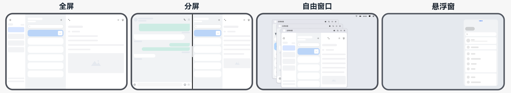
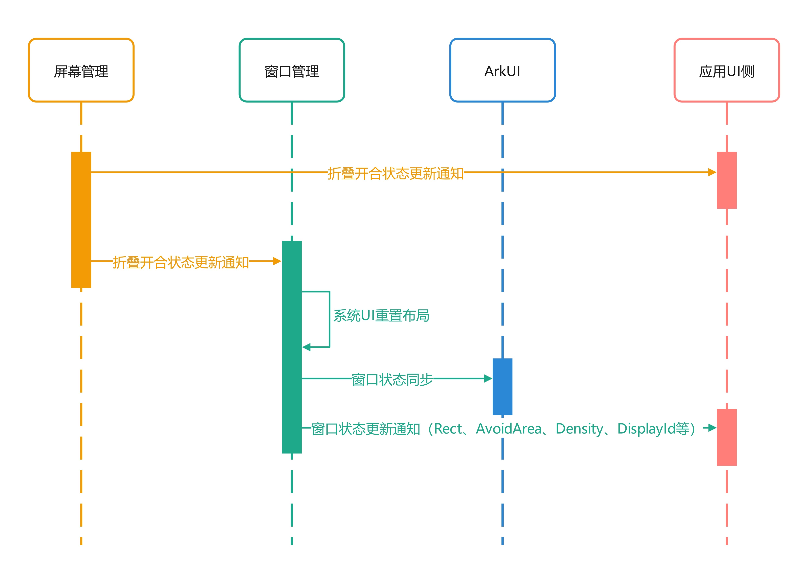
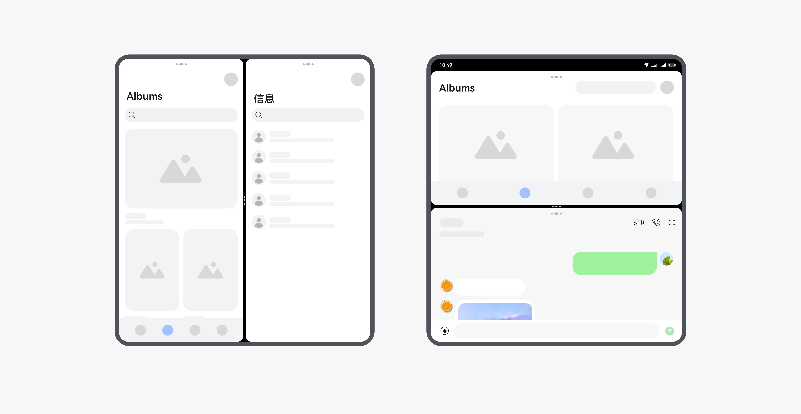
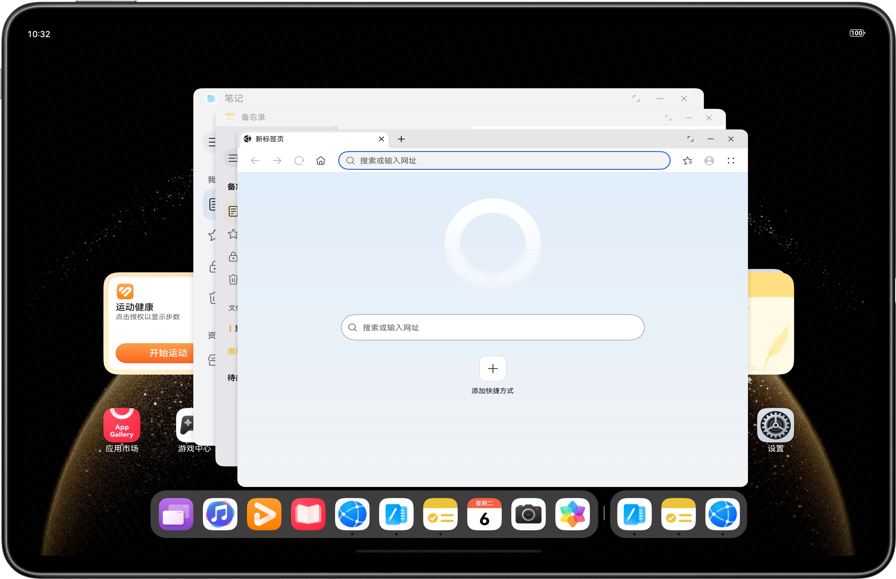
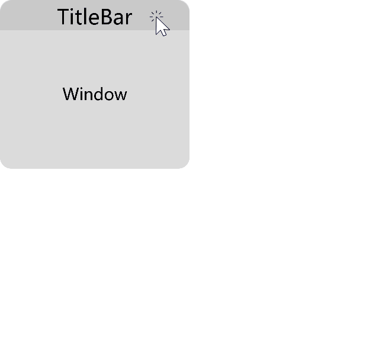

# 窗口模式

更新时间：2026-04-13 06:22:00

来源：https://developer.huawei.com/consumer/cn/doc/best-practices/bpta-multi-device-window-mode

## 概述


应用窗口模式指应用主窗口启动时的显示方式。HarmonyOS目前支持全屏、分屏、自由悬浮多窗三种应用窗口模式。这种对多种应用窗口模式的支持能力，也称为操作系统的“多窗口能力”。

- **全屏**：应用主窗口启动时铺满整个屏幕。
- **分屏**：应用主窗口启动时占据屏幕的某个部分，当前支持二分屏。两个分屏窗口之间具有分界线，可通过拖拽分界线调整两个部分的窗口尺寸。


自由悬浮多窗分为自由多窗和悬浮窗。

- **自由多窗**：自由窗口的大小和位置可自由调整。同一个屏幕上可同时显示多个自由窗口，这些自由窗口按照打开或者获取焦点的顺序在Z轴排布。当自由窗口被点击或触摸时，其Z轴高度提升，并获取焦点。
- **悬浮窗**：悬浮窗是一种在设备屏幕上悬浮的非全屏应用窗口。一般用于在已有全屏任务运行的基础上，临时处理另一个任务，或短时间多任务并行使用。如浏览网页的同时回复消息。





### 实现窗口模式


窗口模式是由系统提供的能力，不需要开发者单独开发功能，所以开发者只需要考虑悬浮或者分屏之后应用界面的适配问题。

当应用需要配置是否支持悬浮窗/分屏能力时，可以通过在module.json5配置文件中abilities标签下添加supportWindowMode字段来实现。supportWindowMode属性主要标识当前UIAbility所支持的窗口模式，详细请参见应用声明支持智慧多窗。

supportWindowMode属性默认值为["fullscreen", "split", "floating"]，即全屏、分屏、悬浮窗全部支持。开发者可以通过配置supportWindowMode属性来定制支持的窗口模式。支持的字段及含义如下表所示。


| 字段 | 说明 |
| --- | --- |
| fullscreen | 窗口支持全屏显示。 |
| split | 窗口支持分屏显示。 |
| floating | 手机/折叠屏表示窗口支持悬浮窗显示，平板设备中表示窗口支持悬浮窗和自由多窗显示，pc设备中表示支持自由多窗显示。 |


> [!NOTE]
> 如果当前窗口处于自由多窗模式，应用可通过调用 setSupportedWindowModes()方法来动态修改其支持的窗口模式，仅在2in1和tablet上可正常调用。        智慧多窗详情，开发者可参考智慧多窗应用开发指南。


### 获取窗口模式


开发者可以通过获取windowStatusType的值来判断设备目前的窗口模式。

```ts
public onStatusTypeChange: (statusType: window.WindowStatusType) => void = (statusType: window.WindowStatusType) => {
  this.mainWindowInfo.windowStatusType = statusType;
}
// ...
updateWindowInfo(): void {
  try {
    // First time get window status.
    this.mainWindowInfo.windowStatusType = this.mainWindow.getWindowStatus();
    this.mainWindow.on('windowStatusChange', this.onStatusTypeChange);
    // ...
  } catch (error) {
    let err = error as BusinessError;
    hilog.error(0x0000, `TestLog`, `Failed to update window info. Code: ${err.code}, message: ${err.message}`);
  }
}
```


### 不同设备支持哪些窗口模式


窗口模式与产品设计强相关，不同产品支持的窗口模式不同。


| 设备 | 全屏 | 分屏 | 自由多窗 | 悬浮窗 |
| --- | --- | --- | --- | --- |
| 手机 | 支持（默认） | 支持 | 不支持 | 支持 |
| 折叠屏 | 支持（默认） | 支持 | 不支持 | 支持 |
| 平板 | 支持（默认） | 支持 | 支持 | 支持 |
| 电脑 | 支持 | 支持 | 支持（默认） | 支持 |


> [!NOTE]
> 平板设备和电脑设备同时支持自由多窗和悬浮窗，开启自由多窗模式，FLOATING代表自由多窗模式；关闭自由多窗模式，FLOATING代表悬浮窗模式。


### WindowType和WindowStatusType的使用区别


- [WindowType](https://developer.huawei.com/consumer/cn/doc/harmonyos-references/arkts-apis-window-e#windowtype7)表示窗口的类型枚举。 HarmonyOS的窗口模块将窗口界面分为系统窗口、应用窗口两种基本类型。 **系统窗口**：系统窗口指完成系统特定功能的窗口。如音量条、壁纸、通知栏、状态栏、导航栏等。
- **应用窗口**：应用窗口区别于系统窗口，指与应用显示相关的窗口。根据显示内容的不同，应用窗口又分为应用主窗口、应用子窗口两种类型。 应用主窗口：应用主窗口用于显示应用界面，会在“任务管理界面”显示。
- 应用子窗口：应用子窗口用于显示应用的弹窗、悬浮窗等辅助窗口，不会在“任务管理界面”显示。应用子窗口的生命周期跟随应用主窗口。


- [WindowStatusType](https://developer.huawei.com/consumer/cn/doc/harmonyos-references/arkts-apis-window-e#windowstatustype11)表示窗口模式枚举。 应用窗口模式指应用主窗口启动时的显示方式。HarmonyOS目前支持全屏、分屏、自由窗口三种应用窗口模式。这种对多种应用窗口模式的支持能力，也称为操作系统的“多窗口能力”。 **全屏**：应用主窗口启动时铺满整个屏幕。
- **分屏**：应用主窗口启动时占据屏幕的某个部分，当前支持二分屏。两个分屏窗口之间具有分界线，可通过拖拽分界线调整两个部分的窗口尺寸。
- **自由悬浮多窗**：分为自由多窗和悬浮窗。 **自由多窗**：自由窗口的大小和位置可自由调整。同一个屏幕上可同时显示多个自由窗口，这些自由窗口按照打开或者获取焦点的顺序在Z轴排布。当自由窗口被点击或触摸时，其Z轴高度提升，并获取焦点。
- **悬浮窗**：悬浮窗是一种在设备屏幕上悬浮的非全屏应用窗口。一般用于在已有全屏任务运行的基础上，临时处理另一个任务，或短时间多任务并行使用。如浏览网页的同时回复消息。


## 窗口模式开发场景


在应用窗口模式变化时，通常伴随窗口尺寸变化，以及页面布局或功能差异。开发者适配多设备上不同窗口模式时，按需对窗口的不同变化做出响应。


### 监听窗口模式变化


开发者可通过on('windowStatusChange')开启窗口模式变化的监听，当窗口windowStatusType发生变化时进行通知。

```ts
public onStatusTypeChange: (statusType: window.WindowStatusType) => void = (statusType: window.WindowStatusType) => {
  this.mainWindowInfo.windowStatusType = statusType;
}
// ...
updateWindowInfo(): void {
  try {
    // First time get window status.
    this.mainWindowInfo.windowStatusType = this.mainWindow.getWindowStatus();
    this.mainWindow.on('windowStatusChange', this.onStatusTypeChange);
    // ...
  } catch (error) {
    let err = error as BusinessError;
    hilog.error(0x0000, `TestLog`, `Failed to update window info. Code: ${err.code}, message: ${err.message}`);
  }
}
```


> [!NOTE]
> 在窗口模式变化时，系统内窗口尺寸还未刷新，如果开发者需要获取新窗口尺寸，应该在[on('windowSizeChange')](https://developer.huawei.com/consumer/cn/doc/harmonyos-references/arkts-apis-window-window#onwindowsizechange7)事件回调中获取。


### 获取窗口尺寸


开发者获取指定窗口对象Window后，在该对象上使用getWindowProperties()获取窗口各个属性，在属性windowRect中获取窗口宽高信息。如果要在页面中获取窗口宽高信息，需要注意获取的正确时机。参考代码如下：

```text
// First time get window size.
let width: number = this.mainWindow.getWindowProperties().windowRect.width;
let height: number = this.mainWindow.getWindowProperties().windowRect.height;
let windowSize: window.Size = {
width: width,
height: height
}
this.mainWindowInfo.windowSize = windowSize;
```


> [!NOTE]
> 页面生命周期aboutToAppear阶段，不代表此时窗口可见，仅代表当前组件已创建，此时获取到的窗口尺寸信息（windowRect）可能有误。建议在页面生命周期onPageShow阶段获取，该阶段会在窗口可见后调用，此时可以拿到窗口正确的宽高信息。       获取到的windowRect是实际上的窗口大小，如果应用在小窗模式下，则实际展示效果是根据scale进行缩放后的。


### 监听窗口尺寸变化


获取窗口实例对象后，可以通过window.on('windowSizeChange')方法实现对窗口尺寸大小变化的监听。

```ts
public onWindowSizeChange: (windowSize: window.Size) => void = (windowSize: window.Size) => {
  this.mainWindowInfo.windowSize = windowSize;
  this.mainWindowInfo.widthBp = this.uiContext!.getWindowWidthBreakpoint();
  this.mainWindowInfo.heightBp = this.uiContext!.getWindowHeightBreakpoint();
};
// ...
updateWindowInfo(): void {
  try {
    // ...
    // Register for window size change monitoring, update window size and width/height breakpoint.
    this.mainWindow.on('windowSizeChange', this.onWindowSizeChange);
    // ...
  } catch (error) {
    let err = error as BusinessError;
    hilog.error(0x0000, `TestLog`, `Failed to update window info. Code: ${err.code}, message: ${err.message}`);
  }
}
```


> [!NOTE]
> 需要注意的是，在window侧如果窗口大小没发生变化，此监听不会被触发。如直接旋转180度的情况下，窗口大小并没有改变，此时不会通知回调。在这种情况下，应用可以通过监听[display.on('change')](https://developer.huawei.com/consumer/cn/doc/harmonyos-references/js-apis-display#displayonaddremovechange)事件，感知屏幕显示方向变化。


在使用多窗口功能时，窗口的尺寸会发生变化，可能影响布局。以下是两种情况的具体描述：

- **进入分屏模式****：**当手机设备进入分屏模式时，窗口高度缩小为原来的1/2或1/3，宽度保持不变。由于内容页面大小未作相应调整，垂直方向的内容可能被截断，且页面无法滚动查看完整内容。开发者可参考[窗口模式变化常见问题](#section2763122110135)。
- **进入竖向悬浮窗模式**：在这种模式中，窗口内容会根据窗口大小进行等比缩放。但是，窗口的高宽比变为3:4.575，这与全屏模式（通常为16:9或4:3）的比例不同。纵向比例相对于横向较小，这也可能导致内容截断现象。开发者可参考[窗口模式变化常见问题](#section2763122110135)。


### 定制窗口模式支持策略


如果开发者希望在不同的设备上支持不同的窗口模式，可通过多HAP工程实现。

在单HAP工程下，开发者只能在module.json5中定制一种窗口支持策略。在不同的HAP工程下，开发者可以通过在module.json5配置文件abilities标签下添加supportWindowMode字段，为每个HAP定制一种窗口支持策略。


> [!NOTE]
> 建立多HAP工程示例代码，可参考[多HAP构建功能](https://gitcode.com/harmonyos_samples/multi-hap)。


### 折叠开合场景下状态监听建议


折叠展开过程中应用可感知的部分回调


| 监听方法 | 功能 |
| --- | --- |
| display.on('foldStatusChange') | 用于监听设备物理折叠状态变化，如折叠、展开、半折叠之间的状态变化。 |
| display.on('foldDisplayModeChange') | 用于监听设备屏幕显示模式变化，如主屏显示、子屏显示、全屏幕显示、双屏显示等状态之间的变化。 |
| window.on('windowRectChange') | 用于监听窗口位置信息变化，表示窗口坐标或者窗口宽高发生改变。 |
| window.on('avoidAreaChange') | 用于监听窗口避让区域的信息变化，表示窗口与状态栏、导航条等系统UI交叠区域发生改变。 |
| window.on('displayIdChange') | 用于监听本窗口所处屏幕变化事件。比如，当前窗口移动到其他屏幕时，可以从该接口监听到这个行为。 |


屏幕管理的生命周期如下图





> [!NOTE]
> 建议与窗口内容布局相关的逻辑放在对应监听接口中实现，不要在屏幕状态变化回调中主动获取窗口状态数据（rect、displayId、avoidArea、density），换用对应的信息变化监听接口。        建议在每种监听接口中只处理该接口返回的数据，不要默认在接口A中查询到的接口B中的数据始终是正确的，如windowRectChange回调中不要使用getWindowAvoidArea接口主动查询避让区域，换用on('avoidAreaChange')监听接口。        建议布局数据相关的回调中只做UI刷新逻辑，不要在其中做IO等耗时逻辑。


## 分屏窗口模式适配


### 分屏布局适配


目前支持两种分屏样式：“上下分屏”和“左右分屏”。





分屏比例指的是分屏下两应用间尺寸的比例，调整分屏比例会调整应用窗口的大小。

分屏模式的分屏比例是由产品定义，开发者无法控制。常见产品的分屏比例，可参考下表。


| 设备 | 默认分屏比例 | 分屏可调节档位 |
| --- | --- | --- |
| 手机、平板、阔折叠（内屏）、三折叠F态 | 1:1 | “上下分屏”（竖屏）: 1:1, 1:2, 2:1          “左右分屏”（横屏）: 1:1 |
| 双折叠屏（Mate X5）展开态、三折叠M态 | 1:1 | “上下分屏”和 “左右分屏”: 1:1 |
| 三折叠G态 | 1:1 | 当三折叠横屏：          “上下分屏”：不支持          “左右分屏” : 1:1, 1:2, 2:1          当三折叠竖屏：          “上下分屏”：1:1, 1:2, 2:1          “左右分屏” : 不支持 |


> [!NOTE]
> 手机上下分屏开发实践，开发者可参考链接：[小方形屏](https://developer.huawei.com/consumer/cn/doc/best-practices/bpta-multi-device-screen-layout#section1395830175918)。


当手机设备进入分屏模式时，窗口高度缩小为原来的1/2或1/3，宽度保持不变。由于内容页面大小未作相应调整，垂直方向的内容可能被截断，且页面无法滚动查看完整内容，开发者可参考窗口模式变化常见问题。


### 实现应用内分屏


分屏一般用于两个应用长时间并行使用的场景。例如：边看购物攻略边浏览商品；边看视频边玩游戏；看学习类视频的同时做笔记等。除了通过手势触发分屏之外，应用可以自主选择启动分屏。

应用内分屏功能允许声明支持分屏的应用在全屏显示模式下，通过调用startAbility方法启动UIAbility并形成分屏。该功能能够增强应用的多任务处理能力，提升用户的操作体验。


开发步骤：

1. 在应用中获取UIAbilityContext 对象，这是启动分屏所必需的上下文对象，用于后续调用startAbility接口。
```text
let context = this.uiContext?.getHostContext() as common.UIAbilityContext;
```
2. 调用startAbility接口启动UIAbility，形成分屏。调用startAbility接口时，设置StartOptions对象，需要指定窗口模式[windowMode](https://developer.huawei.com/consumer/cn/doc/harmonyos-references/js-apis-app-ability-abilityconstant#windowmode12)（需设置为WINDOW_MODE_SPLIT_PRIMARY或者WINDOW_MODE_SPLIT_SECONDARY），并可根据需要设置其他StartOptions属性或startAbility参数，如Want对象。
```text
setSplitScreen(bundleName: string, abilityName: string, moduleName: string): void {
// ...
// Create StartOptions and set them to the main window mode.
let option: StartOptions = { windowMode: AbilityConstant.WindowMode.WINDOW_MODE_SPLIT_PRIMARY };
let want: Want = { bundleName: bundleName, abilityName: abilityName, moduleName: moduleName };
context.startAbility(want, option).catch((err: BusinessError) => {
hilog.error(0x0000, 'TestLog', `Failed to start ability. Code: ${err.code}, message: ${err.message}`);
});
}
```
3. 若继续执行上述步骤，可继续启动其他UIAbility窗口，呈现左右分屏或替换一侧的分屏窗口。
4. 如果想结束应用内分屏，则执行terminateSelf()方法。
```text
cancelSplitScreen(): void {
let context = this.uiContext?.getHostContext() as common.UIAbilityContext;
context.terminateSelf().catch((err: BusinessError) => {
hilog.error(0x0000, 'TestLog', `Failed to terminate self. Code: ${err.code}, message: ${err.message}`);
});
}
```
5. 应用内分屏只支持左右分屏，折叠屏折叠态以及直板机由于只支持上下分屏，所以不进入分屏，折叠机展开态会进入分屏。开发者可参考[应用声明支持智慧多窗](https://developer.huawei.com/consumer/cn/doc/harmonyos-guides/multi-window-support)。


> [!NOTE]
> 应用分屏完整代码，开发者请参考[应用内分屏](https://developer.huawei.com/consumer/cn/doc/harmonyos-guides/multi-window-support#section152819561687)。


## 自由窗口模式适配


自由多窗是一种多窗口显示模式，它允许用户在同一屏幕上同时运行多个应用窗口。自由窗口是默认居中启动并向右下方层叠排布，支持无极缩放的窗口。启动后，窗口的大小和位置可自由调整。同一个屏幕上可同时显示多个自由窗口，这些自由窗口按照打开或者获取焦点的顺序在Z轴排布。当自由窗口被点击或触摸时，将导致其Z轴高度提升，并获取焦点。自由窗口下默认显示标题栏，标题栏左侧显示应用图标，右侧显示三键：放大、缩小和关闭，长按或鼠标hover可显示切换至分屏菜单。





- 在电脑设备上，应用启动时默认应为自由窗口模式，而非全屏模式。在适配电脑设备时，存在拖动自由窗口导致尺寸过小而引起页面布局异常的问题，开发者可参考[如何限制自由窗窗口尺寸](#section6754152523715)，确保页面正常显示。
- 在平板设备上，用户需要下拉控制中心，点击自由多窗按钮，切换至自由多窗模式，窗口默认以自由窗口层叠显示。进入自由多窗模式后设备强制横屏，不支持切换竖屏。为优化窗口显示内容，DPI默认调整为最小档，并记忆调整前的DPI，用户可在设置-显示和亮度-字体大小和界面缩放中按需调整。退出自由多窗时恢复到记忆的DPI，如果用户在自由多窗模式下主动调整过DPI，则保持当前值不恢复记忆。


### 如何限制自由窗窗口尺寸


自适应布局可以保证窗口尺寸在一定范围内变化时，页面的显示是正常的。当窗口尺寸变化较大时，就需要额外借助响应式布局能力（如断点等）调整页面结构以保证显示正常。通常每个断点都需要开发者精心适配，以获得最佳的显示效果，考虑到设计及开发成本等实际因素的限制，应用不可能适配从零到正无穷的所有窗口宽度。

不同设备或不同设备状态，系统默认的自由窗口尺寸的调节范围可能不同。开发者可以在module.json5配置文件的abilities标签中限制应用中各个Ability的自由窗口尺寸调节范围。配置文件中影响自由窗口尺寸调节范围的字段如下表所示。


| 配置文件字段 | 数据类型 | 描述 |
| --- | --- | --- |
| minWindowWidth | 数值 | 标识该ability支持的最小的窗口宽度，宽度单位为vp。 |
| minWindowHeight | 数值 | 标识该ability支持的最小的窗口高度，高度单位为vp。 |
| maxWindowWidth | 数值 | 标识该ability支持的最大的窗口宽度，宽度单位为vp。 |
| maxWindowHeight | 数值 | 标识该ability支持的最大的窗口高度，高度单位为vp。 |
| minWindowRatio | 数值 | 标识该ability支持的最小的宽高比。 |
| maxWindowRatio | 数值 | 标识该ability支持的最大的宽高比。 |


开发者可通过两种方式限制自由窗口的最大和最小尺寸

- 通过配置文件分别限制自由窗口的最大和最小尺寸。
```text
{
"module": {
// ...
"abilities": [
{
// ...
"minWindowWidth": 320,
"minWindowHeight": 240,
"maxWindowWidth": 1440,
"maxWindowHeight": 900,
"minWindowRatio": 0.5,
"maxWindowRatio": 2
}
],
// ...
}
}
```
- 通过[setWindowLimits()](https://developer.huawei.com/consumer/cn/doc/harmonyos-references/arkts-apis-window-window#setwindowlimits11)接口设置当前应用窗口的尺寸限制。
```text
setWindowLimits(maxWidth: number, maxHeight: number, minWidth: number, minHeight: number): void {
let windowLimits: window.WindowLimits = {
maxWidth: maxWidth,
maxHeight: maxHeight,
minWidth: minWidth,
minHeight: minHeight
}
this.mainWindow.setWindowLimits(windowLimits).then((data: window.WindowLimits) => {
hilog.info(0x0000, 'testLog', `Succeeded in changing the window limits. Cause: ${JSON.stringify(data)}`);
}).catch((err: BusinessError) => {
hilog.error(0x0000, 'testLog',
`Failed to change the window limits. Cause code: ${err.code}, message: ${err.message}`);
});
}
```


> [!NOTE]
> 如果开发者希望针对不同设备类型配置不同的最小值，可通过[多HAP工程](https://developer.huawei.com/consumer/cn/doc/best-practices/bpta-modular-design#section1260019161216)实现。


### 主动调节窗口大小


改变窗口大小有以下两种方式：

1. 通过窗口热区拖拽进行窗口缩放。 应用窗口拖拽缩放是在电脑和平板设备上使用自由多窗模式时常见的操作，指鼠标点击或手指触控应用窗口边缘，使得应用窗口跟随鼠标或手指位置移动而变化大小的现象，如下图所示。 对于窗口拖拽缩放有两种限制方式：
- [setWindowLimits()](https://developer.huawei.com/consumer/cn/doc/harmonyos-references/arkts-apis-window-window#setwindowlimits15)限制窗口大小；
- [setResizeByDragEnabled()](https://developer.huawei.com/consumer/cn/doc/harmonyos-references/arkts-apis-window-window#setresizebydragenabled14)禁止/使能通过拖拽方式缩放主窗口或启用装饰的子窗口的功能。


> [!NOTE]
> 主窗口和带标题栏的子窗口默认可以通过热区拖拽进行窗口大小缩放，不带标题栏的子窗口和悬浮窗不可以通过热区拖拽进行窗口大小缩放。


2. 通过[resize()](https://developer.huawei.com/consumer/cn/doc/harmonyos-references/arkts-apis-window-window#resize9)方法修改窗口大小。
```text
resize(width: number, height: number): void {
this.mainWindow.resize(width, height, (err: BusinessError) => {
const errCode: number = err.code;
if (errCode) {
hilog.error(0x0000, 'testLog',
`Failed to change the window size. Cause code: ${err.code}, message: ${err.message}`);
return;
}
hilog.info(0x0000, 'testLog', 'Succeeded in changing the window size.');
});
}
```


根据组件内容大小修改浮动窗口

可以通过组件的onAreaChange()方法监听组件区域变化并根据返回的内容大小修改浮动窗口大小。


### 如何设置窗口拖拽热区


应用窗口拖动是在电脑和平板设备上使用自由多窗时常见的操作，指鼠标点击或手指触控应用窗口在屏幕区域内拖动，应用窗口跟随鼠标或手指位置移动的现象，如下图所示。对于使用默认标题栏的窗口，系统提供了高性能的应用窗口拖动能力。而对于没有标题栏或需要自定义标题栏的窗口，需要开发者调用系统提供的拖动能力来实现。本章节将重点探讨这一类窗口拖动场景的高性能开发方法。





实现方案

由于使用moveWindowTo()来进行窗口移动，会导致不跟手的问题，且在扩展屏场景下不支持跨屏移动。因此，对于采用方舟UI框架（ArkUI）开发应用程序的开发者，推荐使用startMoving()接口实现高性能应用窗口拖动。开发者可以在任意组件的onTouch()方法中注册自定义回调函数，当收到TouchType.Down类型事件时，调用startMoving()接口实现窗口拖动。


| 接口 | 说明 | 使用场景 |
| --- | --- | --- |
| [moveWindowTo()](https://developer.huawei.com/consumer/cn/doc/harmonyos-references/arkts-apis-window-window#movewindowto9) | 移动窗口位置。 | 在[自由窗口](https://developer.huawei.com/consumer/cn/doc/harmonyos-guides/window-terminology#自由窗口)状态下，窗口相对于屏幕移动；在非自由窗口状态下，窗口相对于父窗口移动，也可用于设置子窗启动位置。 |
| [startMoving()](https://developer.huawei.com/consumer/cn/doc/harmonyos-references/arkts-apis-window-window#startmoving14) | 开始移动窗口。 | 窗口将跟随鼠标移动，抬手终止移动，且窗口类型无限制。 |
| [startMoving(offsetX: number, offsetY: number)](https://developer.huawei.com/consumer/cn/doc/harmonyos-references/arkts-apis-window-window#startmoving15) | 指定鼠标在窗口内的位置并移动窗口。 | 若鼠标快速移动，窗口移动时鼠标可能会在窗口外，这时，可指定窗口移动时鼠标在窗口内相对窗口左上角的偏移量，先移动窗口到预期鼠标位置后，再开始移动窗口。 |
| [stopMoving()](https://developer.huawei.com/consumer/cn/doc/harmonyos-references/arkts-apis-window-window#stopmoving15) | 停止窗口移动。 | 用于在窗口拖拽移动过程中，通过此接口来停止窗口移动，可绑定快捷键或删除拖拽事件时使用。 |


示例代码

对于采用方舟UI框架（ArkUI）开发应用程序的开发者，如下代码展示窗口跟随标题栏组件拖动的实现。当该标题栏组件收到点击事件，开发者可通过getMainWindowSync()方法获取该标题栏组件对应的窗口对象，进而对该窗口对象调用startMoving()接口进入窗口拖动逻辑。

```ts
import { BusinessError } from '@kit.BasicServicesKit';
import { window } from '@kit.ArkUI';

const COLUMN_WIDTH: number = 108;
const COLUMN_TOP: number = 50;
const COLUMN_LEFT: number = 100;

@Entry
@Component
struct Index {
  // get the window manager from AppStorage
  windowStage: window.WindowStage = AppStorage.get('window') as window.WindowStage;

  build() {
    Column() {
      Blank('60')
      .color(Color.Blue)
      .onTouch((event: TouchEvent) => {
        if (event.type === TouchType.Down) {
          try {
            let wnd: window.Window = this.windowStage.getMainWindowSync();
            if (canIUse('SystemCapability.Window.SessionManager')) {
              wnd.startMoving().then(() => {
                console.info('wnd Succeeded in starting moving window');
              }).catch((err: BusinessError) => {
                console.error(`Failed to start moving. Cause code: ${err.code}, message: ${err.message}`);
              });
            }
          } catch (exception) {
            console.error(`Failed to start moving. Cause code: ${exception.code}, message: ${exception.message}`);
          }
        }
      })
  }.width(COLUMN_WIDTH).position({ top: COLUMN_TOP, left: COLUMN_LEFT }).alignItems(HorizontalAlign.Center);
  }
}
```


### 设置应用启动时的窗口模式、大小与位置


电脑上启动应用窗口有两种方式：

1. 通过双击桌面应用图片或点击应用中心图标启动应用。
2. 通过[UIAbilityContext.startAbility()](https://developer.huawei.com/consumer/cn/doc/harmonyos-references/js-apis-inner-application-uiabilitycontext#startability-1)接口启动，其中startOption参数设置启动时的窗口模式、所处屏幕id、窗口位置、窗口大小等信息。


应用启动自由窗口时设置主窗口的位置和大小有多种方式，按照生效优先级由高到低排序为：全屏显示 > 使用startOptions参数指定启动窗口的大小和位置 > 使用setWindowRectAutoSave()方法开启窗口尺寸记忆 > 使用metadata标签配置最大化 > 使用metadata标签配置大小和位置。

- 全屏显示 在[module.json5配置文件](https://gitcode.com/openharmony/docs/blob/master/zh-cn/application-dev/quick-start/module-configuration-file.md)中的[abilities标签](https://gitcode.com/openharmony/docs/blob/master/zh-cn/application-dev/quick-start/module-configuration-file.md#abilities标签)下，取消supportWindowMode字段支持的floating，仅配置[fullscreen]或[fullscreen, split]。
```ts
"abilities": [
{
  "name": "EntryAbility",
  "srcEntry": "./ets/entryability/EntryAbility.ets",
  "supportWindowMode": [
  "fullscreen"
  ],
  // ...
  "description": "$string:EntryAbility_desc",
  "icon": "$media:layered_image",
  "label": "$string:EntryAbility_label",
  "startWindowIcon": "$media:startIcon",
  "startWindowBackground": "$color:start_window_background",
  "exported": true,
  "skills": [
  {
    "entities": [
    "entity.system.home"
    ],
    "actions": [
    "action.system.home"
    ]
  }
  ]
},
{
  "name": "SubEntryAbility",
  "srcEntry": "./ets/entryability/SubEntryAbility.ets",
  "supportWindowMode": [
  "fullscreen",
  "floating"
  ],
  "launchType": "specified",
  "description": "$string:EntryAbility_desc",
  "icon": "$media:layered_image",
  "label": "$string:EntryAbility_label",
  "startWindowIcon": "$media:startIcon",
  "startWindowBackground": "$color:start_window_background",
  "exported": true,
  "skills": [
  {
    "entities": [
    "entity.system.home"
    ],
    "actions": [
    "action.system.home"
    ]
  }
  ]
}
],
```
- 将[startAbility()](https://developer.huawei.com/consumer/cn/doc/harmonyos-references/js-apis-inner-application-uiabilitycontext#startability-1)接口的入参StartOptions选项中的windowMode参数设置为WINDOW_MODE_FULLSCREEN。
```ts
let want: Want = {
  bundleName: 'com.example.pcproject',
  abilityName: 'SubEntryAbility',
};
try {
  (this.getUIContext().getHostContext() as common.UIAbilityContext)
    .startAbility(want, {
      windowMode: AbilityConstant.WindowMode.WINDOW_MODE_FULLSCREEN,
      supportWindowModes: [bundleManager.SupportWindowMode.FULL_SCREEN],
    })
    .then(() => {
      // Carry out normal business operations
      hilog.info(DOMAIN, TAG, '%{public}s', 'startAbility succeed');
    })
    .catch((err: BusinessError) => {
      // Handle business logic errors
      hilog.error(
        DOMAIN,
        TAG,
        '%{public}s',
        `startAbility failed. Cause code: ${err.code}, message: ${err.message}`,
      );
    });
} catch (err) {
  // Handle the err of incorrect input parameters
  hilog.error(
    DOMAIN,
    TAG,
    '%{public}s',
    `startAbility failed. Cause code: ${err.code}, message: ${err.message}`,
  );
}
```
- 将startAbility()接口的入参StartOptions选项中的supportWindowModes参数设置为[bundleManager.SupportWindowMode.FULL_SCREEN]或[bundleManager.SupportWindowMode.FULL_SCREEN, bundleManager.SupportWindowMode.SPLIT]。
```ts
let want: Want = {
  bundleName: 'com.example.pcproject',
  abilityName: 'SubEntryAbility',
};
try {
  (this.getUIContext().getHostContext() as common.UIAbilityContext)
    .startAbility(want, {
      supportWindowModes: [bundleManager.SupportWindowMode.FULL_SCREEN],
    })
    .then(() => {
      // Carry out normal business operations
      hilog.info(DOMAIN, TAG, '%{public}s', 'startAbility succeed');
    })
    .catch((err: BusinessError) => {
      // Handle business logic errors
      hilog.error(
        DOMAIN,
        TAG,
        '%{public}s',
        `startAbility failed. Cause code: ${err.code}, message: ${err.message}`,
      );
    });
} catch (err) {
  // Handle the err of incorrect input parameters
  hilog.error(
    DOMAIN,
    TAG,
    '%{public}s',
    `startAbility failed. Cause code: ${err.code}, message: ${err.message}`,
  );
}
```


> [!NOTE]
> 在UIAbility启动模式为specified模式时，设置StartOptions选项中的supportWindowModes参数不生效。


- StartOptions指定大小位置 可通过StartOptions选项的windowLeft、windowTop、windowWidth、windowHeight设置窗口的位置和大小。
```ts
let want: Want = {
  bundleName: 'com.example.pcproject',
  abilityName: 'SubEntryAbility',
};
try {
  (this.getUIContext().getHostContext() as common.UIAbilityContext)
    .startAbility(want, {
      windowLeft: 700,
      windowTop: 300,
      windowWidth: 1600,
      windowHeight: 1000,
      minWindowWidth: 800,
      minWindowHeight: 600,
    })
    .then(() => {
      // Carry out normal business operations
      hilog.info(DOMAIN, TAG, '%{public}s', 'startAbility succeed');
    })
    .catch((err: BusinessError) => {
      // Handle business logic errors
      hilog.error(
        DOMAIN,
        TAG,
        '%{public}s',
        `startAbility failed. Cause code: ${err.code}, message: ${err.message}`,
      );
    });
} catch (err) {
  // Handle the err of incorrect input parameters
  hilog.error(
    DOMAIN,
    TAG,
    '%{public}s',
    `startAbility failed. Cause code: ${err.code}, message: ${err.message}`,
  );
}
```
- 窗口尺寸记忆(目前只支持电脑) 在同一个UIAbility下，应用可以通过setWindowRectAutoSave()接口开启窗口记忆，记忆最后关闭的主窗口尺寸，此主窗口再次启动时，以记忆的尺寸按照规则进行打开。 在同一个UIAbility下，也可以通过setWindowRectAutoSave(enabled: boolean, isSaveBySpecifiedFlag: boolean) 接口，针对每个主窗口尺寸单独进行记忆，只有在UIAbility启动模式为specified模式，且isSaveBySpecifiedFlag设置为true时，才能针对每个主窗口尺寸进行单独记忆。 窗口记忆规则及示例代码可参考[setWindowRectAutoSave()](https://developer.huawei.com/consumer/cn/doc/harmonyos-references/arkts-apis-window-windowstage#setwindowrectautosave14) 和[setWindowRectAutoSave(enabled: boolean, isSaveBySpecifiedFlag: boolean)](https://developer.huawei.com/consumer/cn/doc/harmonyos-references/arkts-apis-window-windowstage#setwindowrectautosave17) 。
- metadata标签配置大小和位置 配置主窗启动时是否以最大化状态显示，可以在module.json5的[metadata标签](https://developer.huawei.com/consumer/cn/doc/harmonyos-guides/window-config-m#metadata标签)属性字段中添加name为ohos.ability.window.isMaximize，value取值为true的配置项。其中，value的取值为true或false，取值为true表示最大化启动，取值为false表示不以最大化状态启动，未配置时默认为false。该方案可以避免在onWindowStageCreate里调用maximize出现闪烁的现象。 也可以在metadata标签中配置窗口启动时的大小和位置，具体属性字段和使用方式可参考[窗口元数据配置](https://developer.huawei.com/consumer/cn/doc/harmonyos-guides/window-config-m)。

> [!NOTE]
> 主窗最大化显示需满足supportWindowMode字段配置中必须包含fullscreen和floating选项。
>          如果窗口设置的大小和位置超出屏幕之外，会自动调整至当前屏幕内。
>          当left和top都不配置或配置不生效时，按照系统层叠规则显示。


- 窗口层叠规格

| 规格名称 | 规格描述 |
| --- | --- |
| 窗口默认大小 | 应用首次启动窗口默认大小：宽高各占屏幕尺寸的67%，在工作区（去除Dock和状态栏的屏幕区域）居中显示。 |
| 系统尺寸限制 | 自由窗口的系统默认最小宽度为320vp，最小高度为72vp，最大宽度和高度都为3840vp；应用未设置windowLimits时，通过window.[getWindowLimits()](https://developer.huawei.com/consumer/cn/doc/harmonyos-references/arkts-apis-window-window#getwindowlimits11)接口会默认返回前面系统的尺寸限制。 |
| 默认窗口模式 | 支持floating模式的窗口，默认以自由窗口方式打开。 |


多自由窗口层叠规则： 找到除了置顶窗口外的最上层窗口(包括后台窗口)，作为基准，进行层叠显示(分别向右和向下偏移)；
- 如果偏移后的窗口位置有部分超出了工作区，则将超出方向的坐标位置修改为工作区的起点位置；
- 支持多实例的应用，打开第二个窗口时，参考上一个多实例窗口的位置进行层叠。


## 悬浮窗口模式适配


针对应用进入悬浮窗出现的页面内容截断、挤压、堆叠等问题，开发者可以参考多设备界面开发中的界面布局响应式变化和界面元素自适应变化内容，使应用可以自适应窗口的大小变化。

常见悬浮布局适配问题分为以下三类

- [布局适配问题](#section1611382919595)：这类问题一般是由于进入分屏/悬浮窗时，由于窗口高度缩小，导致的布局混乱、被截断等问题。
- [沉浸模式下顶部窗口控制条避让问题](#section561523134011)：在沉浸模式下，应用分屏后视图和悬浮窗顶部重合的区域无法响应操作的问题。
- [横屏悬浮窗适配问题](#section16977171113215)：对于横向游戏和视频应用横向的悬浮窗适配问题。


## 窗口模式变化常见问题


### 界面被截断，无法上下滑动，应用分屏后内容显示不全，无法通过上下滑动展示未显示的内容


原因

应用只适配了全屏大小，当应用分屏/悬浮窗后，窗口会变小，导致页面显示不全，超出窗口的区域无法显示。

```ts
@Component
export struct Question1Incorrect {
  build() {
    NavDestination() {
      Column({ space: 12 }) {
        Text('Text1')
        .fontSize(50)
        .width('100%')
        .textAlign(TextAlign.Center)
        .height(350)
        .backgroundColor(Color.Brown)

        Text('Text2')
        .fontSize(50)
        .width('100%')
        .textAlign(TextAlign.Center)
        .height(350)
        .backgroundColor(Color.Orange)
      }
      // ...
    }
    // ...
  }
}
```

解决措施

使用一多的延伸能力，增加Scroll组件，让列表或者文字区域可以按照指定方向滑动。示例代码如下：

```ts
@Component
export struct Question1Correct {
  build() {
    NavDestination() {
      Scroll() {
        Column({ space: 12 }) {
          Text('Text1')
          .fontSize(50)
          .width('100%')
          .textAlign(TextAlign.Center)
          .height(350)
          .backgroundColor(Color.Brown)

          Text('Text2')
          .fontSize(50)
          .width('100%')
          .textAlign(TextAlign.Center)
          .height(350)
          .backgroundColor(Color.Orange)
        }
      }
      // ...
    }
    // ...
  }
}
```

优化后效果如下图所示。


### XComponent视频画面在分屏页面显示不全，视频播放界面分屏后，视频被截断显示不全


原因

在进入分屏页面，窗口的height变成了屏幕的1/2，应用没有对这种情况进适配，导致XComponent宽度没变为之前的1/2导致视频形变。

```ts
@Component
export struct Question2Incorrect {
  @State aspect: number = 9 / 16; // default video height/width ratio value
  @State xComponentWidth: number = this.getUIContext().px2vp(display.getDefaultDisplaySync().width);
  @State xComponentHeight: number = this.getUIContext().px2vp(display.getDefaultDisplaySync().width * this.aspect);
  // ...

  build() {
    NavDestination() {
      Stack() {
        XComponent({ id: 'video_player_id', type: XComponentType.SURFACE, controller: this.xComponentController })
        // ...
        .width(this.xComponentWidth)
        .height(this.xComponentHeight)
      }
      .width('100%')
      .height('100%')
      .backgroundColor(Color.Black)
    }
    .hideTitleBar(true)
  }
}
```

解决措施

使用aspectRatio属性指定XComponent组件的宽高比。设置aspectRatio属性后，组件宽高会受父组件内容区大小限制。

```ts
@Component
export struct Question2Correct {
  @State aspect: number = 9 / 16; // default video width/height ratio value
  // ...

  build() {
    NavDestination() {
      Stack() {
        XComponent({ id: 'video_player_id', type: XComponentType.SURFACE, controller: this.xComponentController })
        // ...
        .aspectRatio(this.aspect)
      }
      .width('100%')
      .height('100%')
      .backgroundColor(Color.Black)
    }
    // ...
  }
}
```

优化后效果如下图所示。


### Video组件在分屏状态下截断，Video组件在分屏状态下，视频播放界面被截断显示不全


原因

给Video组件宽高设置的均为100%，Video组件默认保持宽高比进行缩小或者放大，使得视频铺满屏幕。当应用分屏后，由于窗口宽度不变，高度变为原来的1/2，Video组件的高度会超出窗口高度，导致视频显示不全。

```ts
@Component
export struct Question3Incorrect {
  build() {
    NavDestination() {
      Column() {
        Video({ src: $rawfile('testVideo2.mp4') })
        .height('100%')
        .width('100%')
        .autoPlay(true)
        .controls(false)
      }
      .height('100%')
      .width('100%')
    }
    .hideTitleBar(true)
  }
}
```

解决措施

给Video组件设置.objectFit(ImageFit.Contain)属性，使视频保持宽高进行缩小或者放大，使得视频完全显示在Video组件边界内。

```ts
@Component
export struct Question3Correct {
  build() {
    NavDestination() {
      Column() {
        Video({ src: $rawfile('testVideo2.mp4') })
        // ...
        .objectFit(ImageFit.Contain)
      }
      .height('100%')
      .width('100%')
    }
    .hideTitleBar(true)
  }
}
```

优化后效果如下图所示。


### 子组件超出父组件的范围，子组件显示超出了父组件范围，无法通过上下滑动显示完全


原因

子组件设置为了固定值，当应用分屏的时候，屏幕高度变为原来的1/2，父组件高度会随之变小。如果此时子组件高度大于父组件，就会导致子组件无法完全显示。

```ts
@Component
export struct Question4Incorrect {

  @Builder
  customDialogComp() {
    Column() {
      Text('Top')
      // ...

      Scroll() {
        Text('Middle')
        // ...
      }
      .layoutWeight(1)

      Text('Bottom')
      // ...
    }
    .height(500)
    .justifyContent(FlexAlign.SpaceBetween)
  }

  build() {
    // ...
  }
}
```

解决措施

子组件使用constraintSize约束子组件跟随父容器的大小。建议用子组件占用父组件的高度百分比，而不是绝对值。

```ts
@Builder
customDialogComp() {
  Column() {
    Text('Top')
    // ...

    Scroll() {
      Text('Middle')
      // ...
    }
    .layoutWeight(1)

    Text('Bottom')
    // ...
  }
  .height(500)
  .justifyContent(FlexAlign.SpaceBetween)
  .constraintSize({
    maxHeight: '90%'
  })
}
```

优化后效果如下图所示。


### Image组件在分屏状态下显示异常，应用进入分屏后，随着窗口变小，Image组件显示不全，页面布局显示异常


原因

在进入分屏页面，窗口的height变成了屏幕的1/2，导致image组件的height变小，image图片形变。

```ts
@Component
export struct Question5Incorrect {
  build() {
    NavDestination() {
      Flex({ direction: FlexDirection.Column, alignItems: ItemAlign.Center }) {
        Text("Login Page")
        // ...
        Text("Login in to access more services")
        // ...

        Image($r('app.media.login_pic'))
        // ...

        Column() {
          TextInput({ placeholder:  "Account" })
          // ...

          TextInput({ placeholder:"Password" })
          // ...
        }
        // ...

        Button($r('app.string.login'))
        // ...
      }
      // ...
    }
    // ...
  }
}
```

解决措施

推荐开发者通过一多的隐藏能力来实现，按照其预设的显示优先级，随容器组件尺寸变化显示或隐藏，通过设置布局优先级（displayPriority属性）来控制显隐。

```ts
@Component
export struct Question5Correct {
  build() {
    NavDestination() {
      Flex({ direction: FlexDirection.Column, alignItems: ItemAlign.Center }) {
        Text("Login Page")
        // ...
        .displayPriority(4)

        Text("Login in to access more services")
        // ...
        .displayPriority(3)

        Image($r('app.media.login_pic'))
        // ...
        .displayPriority(2)

        Column() {
          TextInput({ placeholder: "Account" })
          // ...

          TextInput({ placeholder: "Password" })
          // ...
        }
        // ...
        .displayPriority(5)
        // ...
        Button($r('app.string.login'))
        // ...
        .displayPriority(5)
      }
      // ...
    }
    // ...
  }
}
```

优化后效果如下图所示。


### 弹窗布局错乱，进入分屏后弹窗页面内容显示错乱，底部按钮挡住弹窗内容


原因

应用未考虑分屏窗口尺寸变小的情况，弹窗高度设置为固定值，且底部按钮使用position属性设置了固定位置，导致整体布局错乱。

```ts
@CustomDialog
struct CustomDialogComp1 {
  controller: CustomDialogController = new CustomDialogController({ 'builder': '' });

  build() {
    Column() {
      Text($r('app.string.welcome'))
      // ...

      Column() {
        Scroll() {
          Text($r('app.string.dialog_content'))
          // ...
        }
      }

      Row({ space: 12 }) {
        Button($r('app.string.disagree'))
        // ...
        Button($r('app.string.agree'))
        // ...
      }
      .height(56)
      .alignItems(VerticalAlign.Top)
      .position({
        bottom: 0,
        left: 0
      })
    }
    .constraintSize({
      maxHeight: '80%'
    })
    // ...
  }
}
```

解决措施

使用constraintSize属性给弹窗高度限定最大值，同时使用Scroll组件包裹弹窗内容区域（一多的延伸能力），通过给内容区域的Column组件设置layoutWeight（一多的占比能力）属性，使其占据剩余空间，使操作按钮居于底部显示。当内容高度超过内容区域高度的时候可以滚动进行查看。

```ts
@CustomDialog
struct CustomDialogComp {
  controller: CustomDialogController = new CustomDialogController({ 'builder': '' });

  build() {
    Column() {
      Text($r('app.string.welcome'))
      // ...

      Column() {
        Scroll() {
          Text($r('app.string.dialog_content'))
          // ...
        }
      }
      .layoutWeight(1)

      Row({ space: 12 }) {
        Button($r('app.string.disagree'))
        // ...
        Button($r('app.string.agree'))
        // ...
      }
      .height(56)
      .alignItems(VerticalAlign.Top)
    }
    .constraintSize({
      maxHeight: '80%'
    })
    .height(400)
    // ...
  }
}
```

优化后效果如下图所示。


### 沉浸模式下顶部窗口控制条避让问题


沉浸式应用在悬浮窗场景下，顶部操作栏无法操作，应用分屏后，视图和悬浮窗顶部重合的区域无法响应操作。


原因

沉浸式应用顶部没有避让，导致悬浮窗顶部bar与应用的顶部区域重叠，重叠区域中的按钮无法响应点击事件。

```ts
@Component
export struct Question7Incorrect {
  private windowClass: window.Window | undefined = undefined;

  aboutToAppear(): void {
    try {
      this.windowClass=(this.getUIContext().getHostContext() as common.UIAbilityContext).windowStage.getMainWindowSync();
      this.windowClass.setSpecificSystemBarEnabled('status', false).catch((error:BusinessError) => {
        Logger.error(TAG, `setSpecificSystemBarEnabled err, code: ${error.code}, mesage: ${error.message}`);
      });
    } catch (err) {
      let error = err as BusinessError;
      Logger.error(TAG, `aboutToAppear err, code: ${error.code}, mesage: ${error.message}`);
    }
  }

  aboutToDisappear(): void {
    this.windowClass?.setSpecificSystemBarEnabled('status', true).catch((error:BusinessError) => {
      Logger.error(TAG, `setSpecificSystemBarEnabled err, code: ${error.code}, mesage: ${error.message}`);
    });
  }

  build() {
    NavDestination() {
      Stack() {
        // ...

        Row() {
          Image($r('app.media.icon_pause'))
          // ...
          .onClick(() => {
            try {
              this.getUIContext().getPromptAction().showToast({
                message: 'Action success'
              });
            } catch (err) {
              let error = err as BusinessError;
              Logger.error(TAG, `showToast err, code: ${error.code}, mesage: ${error.message}`);
            }
          })
        }
        .height('100%')
        .width('100%')
        .justifyContent(FlexAlign.End)
        .alignItems(VerticalAlign.Top)
      }
    }
    .hideTitleBar(true)
  }
}
```

解决措施

通过getWindowAvoidArea()可获取屏幕顶部需要规避的矩阵区域topRect，获取到该值后应用可对应做布局避让。同时，可通过on('avoidAreaChange')监听系统规避区域变化以进行布局的动态调整。具体可以参考顶部窗口控制条避让适配智慧多窗。

```ts
@Component
export struct Question7Correct {
  private windowClass: window.Window | undefined = undefined;
  @State topSafeHeight: number = 0;
  @State windowStatus: WindowStatusType = window.WindowStatusType.FULL_SCREEN;

  aboutToAppear(): void {
    try {
      this.windowClass=(this.getUIContext().getHostContext() as common.UIAbilityContext).windowStage.getMainWindowSync();
      this.windowClass.setSpecificSystemBarEnabled('status', false).catch((error:BusinessError) => {
        Logger.error(TAG, `setSpecificSystemBarEnabled err, code: ${error.code}, mesage: ${error.message}`);
      });
      this.windowStatus = this.windowClass.getWindowStatus();

      if (this.windowStatus === window.WindowStatusType.FLOATING) {
        this.topSafeHeight = this.getUIContext()
        .px2vp(this.windowClass.getWindowAvoidArea(window.AvoidAreaType.TYPE_SYSTEM).topRect.height);
      }

      this.windowClass.on('windowStatusChange', data => {
        if (data === window.WindowStatusType.FLOATING) {
          this.topSafeHeight =
          this.getUIContext()
          .px2vp(this.windowClass?.getWindowAvoidArea(window.AvoidAreaType.TYPE_SYSTEM).topRect.height);
        } else {
          this.topSafeHeight = 0;
        }
      })
    } catch (err) {
      let error = err as BusinessError;
      Logger.error(TAG, `aboutToAppear err, code: ${error.code}, mesage: ${error.message}`);
    }
  }

  aboutToDisappear(): void {
    this.windowClass?.setSpecificSystemBarEnabled('status', true).catch((error:BusinessError) => {
      Logger.error(TAG, `setSpecificSystemBarEnabled err, code: ${error.code}, mesage: ${error.message}`);
    });
  }

  build() {
    // ...
  }
}
```

优化后效果如下图所示。


### 视频或游戏类应用在横屏模式下开启悬浮窗，若应用未适配横屏悬浮窗，可能会导致内容显示不全，影响用户体验


原因

悬浮窗默认是竖屏，需要应用主动适配横屏的属性值。

```ts
@Component
export struct Question8Incorrect {
  build() {
    NavDestination() {
      Column() {
        Video({ src: $rawfile('testVideo1.mp4') })
        .height('100%')
        .width('100%')
        .autoPlay(true)
        .objectFit(ImageFit.Contain)
        .controls(false)
      }
      .height('100%')
      .width('100%')
    }
    .hideTitleBar(true)
  }
}
```

解决措施

开发者可以通过在module.json5配置文件中abilities标签下的preferMultiWindowOrientation属性增加"landscape_auto"。

```ts
{
  "module": {
    // ...
    "abilities": [
    {
      "name": "EntryAbility",
      // ...
      "preferMultiWindowOrientation": "landscape_auto",
      // ...
    }
    ],
    // ...
  }
}
```

该场景下多窗布局动态可变为横向，需要配合API（enableLandscapeMultiWindow()/disableLandscapeMultiWindow()）使用。

```ts
@Component
export struct Question8Correct {
  private windowClass: window.Window | undefined = undefined;

  aboutToAppear(): void {
    try {
      this.windowClass=(this.getUIContext().getHostContext() as common.UIAbilityContext).windowStage.getMainWindowSync();
      this.windowClass.enableLandscapeMultiWindow().catch((error:BusinessError) => {
        Logger.error(TAG, `enableLandscapeMultiWindow err, code: ${error.code}, mesage: ${error.message}`);
      });
    } catch (err) {
      let error = err as BusinessError;
      Logger.error(TAG, `aboutToAppear err, code: ${error.code}, mesage: ${error.message}`);
    }


  }

  aboutToDisappear(): void {
    this.windowClass?.disableLandscapeMultiWindow().catch((error:BusinessError) => {
      Logger.error(TAG, `disableLandscapeMultiWindow err, code: ${error.code}, mesage: ${error.message}`);
    });
  }

  build() {
    // ...
  }
}
```

优化后效果如下图所示。


