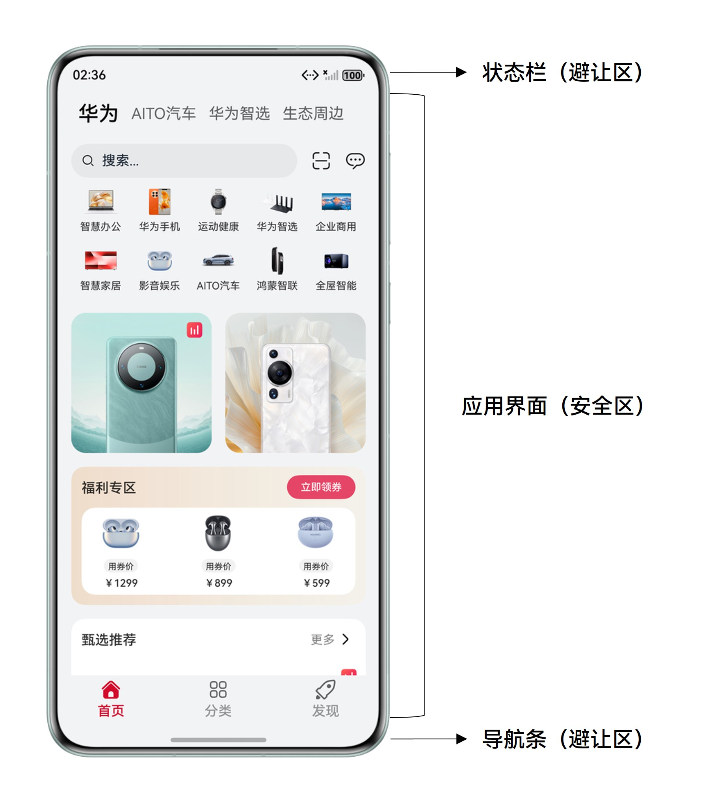
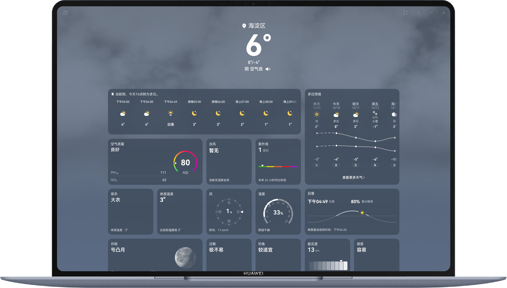
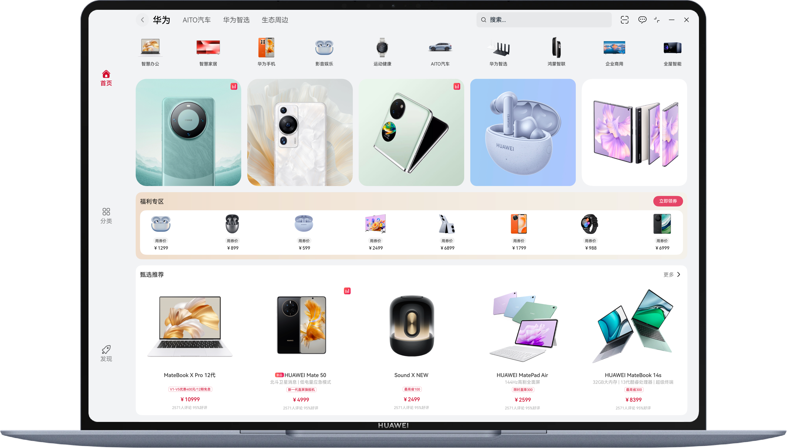

# 窗口沉浸式

更新时间：2026-03-12 08:45:02

来源：https://developer.huawei.com/consumer/cn/doc/best-practices/bpta-multi-device-window-immersive

## 概述


沉浸式模式是指通过减少无关元素的干扰，使应用界面更加专注于内容呈现，以提升用户体验的设计模式。典型应用的全屏窗口，其UI元素包括状态栏、应用界面和底部导航条。其中，状态栏和导航条在沉浸式布局下称为避让区，避让区之外的区域称为安全区（如下图）。沉浸式页面开发通常通过将应用页面延伸至状态栏和导航条，达到以下目的：

- 视觉统一：应用页面与避让区（状态栏、导航条）色调统一，避免界面割裂，提供更好的视觉体验。
- 布局扩展：充分利用屏幕可视区域，使页面内容延伸到状态栏和导航条区域（即“安全区”之外的避让区），获得更大的布局空间。
- 沉浸体验：在游戏、视频等场景中隐藏系统元素，提供无干扰的全屏体验。





本文将介绍沉浸式原理、实现方案，并提供常见沉浸式页面开发场景下适配问题的解决方案。

- [顶部或底部背景延伸案例](#section166836535168)
- [挖孔避让案例](#section35561799107)
- [自由窗口标题栏沉浸案例](#section18705614278)


## 实现原理


沉浸式实现主要考虑如下两个因素：

1. 实现沉浸式效果：通过特定方法、属性或接口，使页面突破安全区或标题栏限制，延伸至目标区域。页面沉浸式效果实现方案分为窗口、组件两个层级：
- 窗口级：应用级全局沉浸，作用于所有页面。
- 组件级：作用于当前组件，可针对单个页面内的多个组件分别配置。
2. 避让处理：避免页面内容与避让区的系统信息（如电量、时间）、交互功能（如导航条手势）或窗口控制键（如关闭、最小化）发生遮挡和冲突。


### 实现沉浸式效果


- 方案一：组件设置背景沉浸（组件级）组件与避让区边界重合时，设置组件的[background()](https://developer.huawei.com/consumer/cn/doc/harmonyos-references/ts-universal-attributes-background#background10)属性，将组件背景扩展至避让区，页面布局仍在安全区内。 该接口为组件级，不同组件可设置不同背景色并扩展至对应避让区（如顶部组件设置红色背景并扩展至顶部状态栏，底部组件设置蓝色背景并扩展至底部导航条）。若页面背景色统一，可设置最外层父组件的background()属性，实现页面的沉浸式效果。 此方案中，只需设置一次代码属性，即可实现同一组件在不同窗口模式、窗口方向下的沉浸效果。但界面元素仅做绘制延伸，无法单独布局至状态栏和导航条区域。当页面支持滚动时，滚动区域无法延伸至状态栏和导航条。

| 原始布局（设置backgroundColor()效果） | 组件设置背景沉浸 |
| --- | --- |
|  |  |


> [!NOTE]
> [backgroundColor()](https://developer.huawei.com/consumer/cn/doc/harmonyos-references/ts-universal-attributes-background#backgroundcolor)：背景颜色限定在安全区内。
>  [background()](https://developer.huawei.com/consumer/cn/doc/harmonyos-references/ts-universal-attributes-background#background10)：背景颜色扩展至顶部状态栏及底部导航条区域。


- 方案二：组件设置页面沉浸（组件级）通过设置[ignoreLayoutSafeArea()](https://developer.huawei.com/consumer/cn/doc/harmonyos-references/ts-universal-attributes-expand-safe-area#ignorelayoutsafearea20)并设置高度为LayoutPolicy.matchParent适应父组件，页面背景与布局均扩展至顶部状态栏和底部导航条。作为组件级的沉浸式方案，每个页面均需单独配置。当页面内容与避让区发生冲突时，需由开发者手动进行避让处理。

| 原始布局 | 组件设置页面沉浸 |
| --- | --- |
|  |  |
- 方案三：安全区域拓展（组件级）设置组件的[expandSafeArea](https://developer.huawei.com/consumer/cn/doc/harmonyos-references/ts-universal-attributes-expand-safe-area#expandsafearea)属性，将组件的安全区域延伸至状态栏或导航条区域，同时保持子组件在安全区内布局，无需额外避让处理。支持指定系统避让区域类型（[SafeAreaType](https://developer.huawei.com/consumer/cn/doc/harmonyos-references/ts-universal-attributes-expand-safe-area#safeareatype)）和延伸方向（[SafeAreaEdge](https://developer.huawei.com/consumer/cn/doc/harmonyos-references/ts-universal-attributes-expand-safe-area#safeareaedge)），实现沉浸式的方案可参考[组件安全区方案](https://developer.huawei.com/consumer/cn/doc/harmonyos-guides/arkts-develop-apply-immersive-effects#section202081847174413)。

| 原始布局 | 扩展至状态栏和导航条 | 仅扩展至状态栏 | 仅扩展至导航条 |
| --- | --- | --- | --- |
|  |  |  |  |


> [!NOTE]
> 边界重合要求：组件必须与安全区域边界重合（例如顶部组件需紧贴屏幕顶部）。组件尺寸限制：配置expandSafeArea属性将组件进行绘制扩展时，需要关注组件不能配置固定宽高尺寸，百分比除外。滚动容器限制：当父容器是滚动容器时，expandSafeArea属性设置无效。


- 方案四：窗口设置沉浸式显示（窗口级）调用窗口强制全屏布局接口[setWindowLayoutFullScreen()](https://developer.huawei.com/consumer/cn/doc/harmonyos-references/arkts-apis-window-window#setwindowlayoutfullscreen9)设置窗口为沉浸式布局。页面布局范围从安全区域扩展为整个窗口（包括状态栏和导航条），布局范围扩展效果同[组件设置页面沉浸](#table11224183514210)。 该方案为窗口级沉浸方案，沉浸式布局生效时，所有页面均开启全屏模式，需要开发者在各页面进行避让处理。


各沉浸式方案对比如下：


| 对比维度 | 组件设置背景沉浸 | 组件设置页面沉浸 | 安全区域拓展 | 窗口设置沉浸式显示 |
| --- | --- | --- | --- | --- |
| 级别 | 组件级 | 组件级 | 组件级 | 窗口级 |
| 特点 | 仅背景扩展至避让区，内容默认在安全区 | 背景与内容均扩展至避让区 | 仅背景扩展至避让区，内容默认在安全区 支持指定系统避让区域类型和延伸方向 | 所有页面布局范围扩展至全屏，不自动避让 |
| 使用场景 | 仅页面背景沉浸的场景 | 需组件内容完全覆盖屏幕的场景 | 需要指定延伸区域类型的局部延伸场景 | 应用所有页面均需实现沉浸式 |
| 优点 | 使用简单，易理解 一次配置适配不同窗口模式、窗口方向 支持多组件不同背景扩展 | 使用简单，易理解 一次配置适配不同窗口模式、窗口方向 | 能够对扩展不同的安全区域进行配置 子组件仍在安全区内布局，无需额外的避让处理 | 全局统一生效，适配逻辑集中 |
| 缺点 | 滚动内容无法延伸至避让区 需为每个页面单独配置 | 内容易与避让区元素冲突，需手动处理避让 需为每个页面单独配置 | 滚动内容无法延伸至避让区 参数复杂，理解成本过高 | 需手动计算避让区高度，处理所有内容避让 |


窗口沉浸式效果由不同页面的沉浸实现，页面沉浸式效果由不同组件的沉浸策略组合而成。建议通过组件沉浸方案为每个页面配置不同的沉浸策略，以实现应用的沉浸效果。


### 避让处理


由于避让区本身有内容展示（如状态栏中的电量、时间等系统信息），或是手势交互（如导航条点击或上滑），在实现应用页面沉浸式效果后，往往会和避让区域产生UI元素的遮挡、视觉上的违和或交互上的冲突等问题，开发者可以针对不同场景选择合适的方式进行适配。

- 使用[Window.setWindowSystemBarEnable()](https://developer.huawei.com/consumer/cn/doc/harmonyos-references/arkts-apis-window-window#setwindowsystembarenable9)方法或[Window.setSpecificSystemBarEnabled()](https://developer.huawei.com/consumer/cn/doc/harmonyos-references/arkts-apis-window-window#setspecificsystembarenabled11)方法设置状态栏和导航条的显隐。

| 显示状态栏和导航条 | 隐藏状态栏和导航条 |
| --- | --- |
|  |  |
- 使用[Window.getWindowAvoidArea()](https://developer.huawei.com/consumer/cn/doc/harmonyos-references/arkts-apis-window-window#getwindowavoidarea9)方法获取避让区域的高度，设置应用页面内容的上下padding实现避让状态栏和导航条。

| 避让前 | 避让后 |
| --- | --- |
|  |  |
- 使用[on('avoidAreaChange')](https://developer.huawei.com/consumer/cn/doc/harmonyos-references/arkts-apis-window-window#onavoidareachange9)动态监听避让区变化。通过AvoidAreaType.TYPE_SYSTEM获取状态栏区域信息。
- 通过AvoidAreaType.TYPE_NAVIGATION_INDICATOR获取底部导航条区域信息。
- 通过AvoidAreaType.TYPE_CUTOUT获取挖孔区信息。


### 自由窗口标题栏沉浸


在PC设备及平板和Mate XTs设备的自由多窗模式下，开发者可以设置应用窗口的标题栏不可见，将应用页面扩展至原标题栏区域，实现窗口的沉浸式效果。组件沉浸式的策略不适用于自由窗口标题栏的沉浸，需要开发者单独适配。

自由窗口标题栏包含应用图标、应用名称和三个按钮（全屏/还原、最小化、关闭）。通过设置标题栏不可见，隐藏应用图标和应用名称，保留三键区，实现窗口的沉浸式效果。

- 使用[setWindowDecorVisible(false)](https://developer.huawei.com/consumer/cn/doc/harmonyos-references/arkts-apis-window-window#setwindowdecorvisible11)设置隐藏标题栏，只显示右上角三键，此时应用页面拓展至标题栏区域。
- 使用[setWindowDecorHeight()](https://developer.huawei.com/consumer/cn/doc/harmonyos-references/arkts-apis-window-window#setwindowdecorheight11)接口设置标题栏高度，控制右上角三键区显示以及显示高度。
- 使用[setDecorButtonStyle()](https://developer.huawei.com/consumer/cn/doc/harmonyos-references/arkts-apis-window-window#setdecorbuttonstyle14)接口设置右上角按钮颜色、大小、间距、圆角半径等样式。
- 使用[getTitleButtonRect()](https://developer.huawei.com/consumer/cn/doc/harmonyos-references/arkts-apis-window-window#gettitlebuttonrect11)获取窗口标题栏上的三键区位置和大小，用于不同场景下的页面布局避让。
- 使用[on('windowTitleButtonRectChange')](https://developer.huawei.com/consumer/cn/doc/harmonyos-references/arkts-apis-window-window#onwindowtitlebuttonrectchange11)注册右上角三键大小变化监听。





## 顶部或底部背景延伸案例


### 场景描述


页面背景需延伸至状态栏与导航条区域，页面内容在安全区内展示。


| 全屏 | 分屏 | 悬浮窗 |
| --- | --- | --- |
|  |  |  |


### 开发步骤


1. 方案一：组件设置背景沉浸组件设置[background()](https://developer.huawei.com/consumer/cn/doc/harmonyos-references/ts-universal-attributes-background#background10)实现背景延伸，内容自动保留在安全区内，自动适配不同窗口模式和窗口方向下避让区的变化。
```ts
Column() {
  // ...
}
// Add a background for the component to achieve immersive background effect
.background('#F1F3F5')
```
2. 方案二：组件设置页面沉浸 + 避让处理
- 通过设置[ignoreLayoutSafeArea()](https://developer.huawei.com/consumer/cn/doc/harmonyos-references/ts-universal-attributes-expand-safe-area#ignorelayoutsafearea20)并设置高度为LayoutPolicy.matchParent适应父组件，将页面扩展至避让区。
```ts
Column() {
  // ...
}
// Expands the layout safe area of a component.
.ignoreLayoutSafeArea()
.height(LayoutPolicy.matchParent)
```
- 通过[Window.getWindowAvoidArea()](https://developer.huawei.com/consumer/cn/doc/harmonyos-references/arkts-apis-window-window#getwindowavoidarea9)方法获取状态栏和导航条高度，并用状态变量avoidSystem记录。
```ts
// Get the avoid area.
this.mainWindowInfo.avoidSystem = this.mainWindow.getWindowAvoidArea(
  window.AvoidAreaType.TYPE_SYSTEM,
);
```
- 使用[on('avoidAreaChange')](https://developer.huawei.com/consumer/cn/doc/harmonyos-references/arkts-apis-window-window#onavoidareachange9)事件监听避让区域的变化，在监听回调中更新状态变量avoidSystem。
```ts
public onAvoidAreaChange: (avoidOptions: window.AvoidAreaOptions) => void =
(avoidOptions: window.AvoidAreaOptions) => {
  if (avoidOptions.type === window.AvoidAreaType.TYPE_SYSTEM) {
    // Default area of the system.
    this.mainWindowInfo.avoidSystem = avoidOptions.area;
  } else if (avoidOptions.type === window.AvoidAreaType.TYPE_CUTOUT) {
    // Cutout area.
    this.mainWindowInfo.avoidCutout = avoidOptions.area;
    this.updateAvoidPadding(avoidOptions.area);
  } else if (avoidOptions.type === window.AvoidAreaType.TYPE_SYSTEM_GESTURE) {
    // Side return gesture area.
    this.mainWindowInfo.avoidSystemGesture = avoidOptions.area;
  } else if (avoidOptions.type === window.AvoidAreaType.TYPE_KEYBOARD) {
    // Fixed soft keyboard area.
    this.mainWindowInfo.avoidKeyboard = avoidOptions.area;
  } else if (avoidOptions.type === window.AvoidAreaType.TYPE_NAVIGATION_INDICATOR) {
    // Bottom navigation bar.
    this.mainWindowInfo.avoidNavigationIndicator = avoidOptions.area;
  }
};
```
- 设置组件的上下padding分别为状态栏和导航条的高度，使内容避让状态栏和导航条，仅在安全区域显示。
```ts
Column() {
  // ...
}
// ...
// Set the top and bottom padding to avoid status bar and navigation bar.
.padding({
  top: this.windowUtil?.mainWindowInfo.avoidSystem?.topRect.height + 'px',
  bottom: this.windowUtil?.mainWindowInfo.avoidNavigationIndicator?.bottomRect.height + 'px'
})
```

 推荐使用上述两种方案实现，相比窗口设置沉浸显示和安全区域拓展，这两种方案实现方式简单易理解，且自动适配不同窗口模式和方向。


## 挖孔避让案例


### 场景描述


在需要充分利用屏幕可视区域的场景中，若要在状态栏显示重要信息或操作按钮，不仅需隐藏原始状态栏和导航条，还需对挖孔区域进行避让。这种情况下可以将背景全屏沉浸，内容区对挖孔区域做避让处理。

在以下场景中，挖孔区尺寸可能发生变化，因此需要监听避让区高度等信息的变化，确保UI布局及时适配调整。

- 窗口模式切换（全屏/悬浮窗/分屏等）
- 设备旋转
- 折叠状态切换（展开、折叠）


以设备旋转为例，效果图如下。


| 竖屏-挖孔区在顶部 | 横屏-挖孔区在左侧 | 反向竖屏-挖孔区在底部 | 反向横屏-挖孔区在右侧 |
| --- | --- | --- | --- |
|  |  |  |  |


### 开发步骤


1. 使用[ignoreLayoutSafeArea()](https://developer.huawei.com/consumer/cn/doc/harmonyos-references/ts-universal-attributes-expand-safe-area#ignorelayoutsafearea20)和height(LayoutPolicy.matchParent)，实现页面沉浸。
```ts
Column() {
  // ...
}
// Expands the layout safe area of a component.
.ignoreLayoutSafeArea()
.height(LayoutPolicy.matchParent)
```
2. 使用[setWindowSystemBarEnable()](https://developer.huawei.com/consumer/cn/doc/harmonyos-references/arkts-apis-window-window#setwindowsystembarenable9)隐藏状态栏和导航条。
```ts
// Hide the status bar and navigation bar.
this.mainWindow.setWindowSystemBarEnable([]).catch((error: BusinessError) => {
  let err = error as BusinessError;
  hilog.error(
    0x0000,
    'testLog',
    `setWindowSystemBarEnable failed. Code:${err.code}, message:${err.message}`,
  );
});
```
3. 使用[on('avoidAreaChange')](https://developer.huawei.com/consumer/cn/doc/harmonyos-references/arkts-apis-window-window#onavoidareachange9)动态监听避让区变化，通过AvoidAreaType.TYPE_CUTOUT来获取挖孔区域信息。
```ts
public onAvoidAreaChange: (avoidOptions: window.AvoidAreaOptions) => void =
(avoidOptions: window.AvoidAreaOptions) => {
  if (avoidOptions.type === window.AvoidAreaType.TYPE_SYSTEM) {
    // Default area of the system.
    this.mainWindowInfo.avoidSystem = avoidOptions.area;
  } else if (avoidOptions.type === window.AvoidAreaType.TYPE_CUTOUT) {
    // Cutout area.
    this.mainWindowInfo.avoidCutout = avoidOptions.area;
    this.updateAvoidPadding(avoidOptions.area);
  } else if (avoidOptions.type === window.AvoidAreaType.TYPE_SYSTEM_GESTURE) {
    // Side return gesture area.
    this.mainWindowInfo.avoidSystemGesture = avoidOptions.area;
  } else if (avoidOptions.type === window.AvoidAreaType.TYPE_KEYBOARD) {
    // Fixed soft keyboard area.
    this.mainWindowInfo.avoidKeyboard = avoidOptions.area;
  } else if (avoidOptions.type === window.AvoidAreaType.TYPE_NAVIGATION_INDICATOR) {
    // Bottom navigation bar.
    this.mainWindowInfo.avoidNavigationIndicator = avoidOptions.area;
  }
};
```
4. 根据挖孔区方位，确定避让方向，并记录在状态变量avoidAreaPadding中。
- 挖孔区在顶部，则顶部避让 = 挖孔区距屏幕顶部边缘的距离 + 挖孔区域的高度。
- 挖孔区在左侧，则左侧避让 = 挖孔区距屏幕左侧边缘的距离 + 挖孔区域的宽度。
- 挖孔区在右侧，则右侧避让 = 屏幕宽度 - 挖孔区距屏幕左侧边缘的距离。
- 挖孔区在底部，则底部避让 = 屏幕高度 -  挖孔区距屏幕顶部距离。


```ts
updateAvoidPadding(area: window.AvoidArea) {
  const avoidAreaPadding: Padding = {};
  try {
    // Top cutout area: set top padding.
    if (area.topRect.height > 0) {
      avoidAreaPadding.top = this.uiContext?.px2vp(area.topRect.height + area.topRect.top);
    }
    // Left cutout area: set left padding.
    if (area.leftRect.width > 0) {
      avoidAreaPadding.left = this.uiContext?.px2vp(area.leftRect.left + area.leftRect.width);
    }
    // Right cutout area: set right padding.
    if (area.rightRect.width > 0) {
      avoidAreaPadding.right = this.uiContext?.px2vp(display.getDefaultDisplaySync().width - area.rightRect.left);
    }
    // Bottom cutout area: set bottom padding.
    if (area.bottomRect.height > 0) {
      avoidAreaPadding.bottom = this.uiContext?.px2vp(display.getDefaultDisplaySync().height - area.bottomRect.top);
    }
  } catch (error) {
    let err = error as BusinessError;
    hilog.error(0x0000, 'TestLog', `Failed to set avoid padding. Code: ${err.code}, message: ${err.message}`);
  }
  this.mainWindowInfo.avoidAreaPadding = avoidAreaPadding;
}
```
5. 设置组件padding，进行避让。
```ts
Column() {
  // ...
}
// ...
// Set paddings to avoid notch.
.padding(this.mainWindowInfo?.avoidAreaPadding)
```


## 自由窗口标题栏沉浸案例


### 场景描述


自由窗口模式下，需隐藏默认标题栏，保留关闭、最小化、最大化三键区，使页面延伸至原标题栏区域，实现窗口沉浸式。





### 开发步骤


1. 使用[setWindowDecorVisible(false)](https://developer.huawei.com/consumer/cn/doc/harmonyos-references/arkts-apis-window-window#setwindowdecorvisible11)接口设置标题栏的隐藏，仅保留右上角的三键区。
```ts
this.mainWindow.setWindowDecorVisible(false);
```
2. 使用[setWindowDecorHeight()](https://developer.huawei.com/consumer/cn/doc/harmonyos-references/arkts-apis-window-window#setwindowdecorheight11)接口设置标题栏高度，控制右上角三键区显示高度。
```ts
this.mainWindow.setWindowDecorHeight(56);
```
3. 使用[setDecorButtonStyle()](https://developer.huawei.com/consumer/cn/doc/harmonyos-references/arkts-apis-window-window#setdecorbuttonstyle14)接口设置右上角按钮大小，和页面顶部icon大小保持一致。
```ts
this.mainWindow.setDecorButtonStyle({ buttonIconSize: 24 });
```
4. 使用[on('windowTitleButtonRectChange')](https://developer.huawei.com/consumer/cn/doc/harmonyos-references/arkts-apis-window-window#onwindowtitlebuttonrectchange11)注册右上角三键大小变化监听，用于页面布局避让。
```ts
public onWindowButtonRectChange: (titleButtonRect: window.TitleButtonRect) => void =
(titleButtonRect: window.TitleButtonRect) => {
  // Update the rectangle information of the title bar button.
  this.mainWindowInfo.titleButtonRect = titleButtonRect;
}
```
5. 使用padding进行布局避让。
```ts
Column() {
  // ...
}
.padding({
  right: this.mainWindowInfo.isImmersive === ImmersiveType.IMMERSIVE ? this.mainWindowInfo.titleButtonRect?.width :
  0
})
```


## 示例代码


沉浸式页面开发
